# 十二、安卓入侵者：大结局

我们终于准备好为这本书创作最后一个游戏了。这一次我们将开发一个简单的动作/街机游戏，采用前两章讨论的技术，改编一个旧的经典并赋予它一个漂亮的 3D 外观。

核心游戏机制

正如你可能已经从这一章的标题中猜到的，我们即将实现*太空入侵者*的一个变种，一个 2D 游戏的原始形式(如图图 12-1 )。

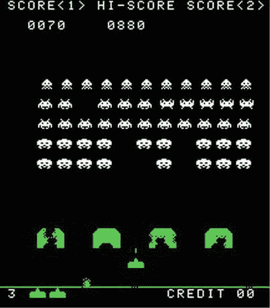

图 12-1。原版太空入侵者街机游戏

这里有一个小惊喜:我们将继续留在 2D，大部分时间。我们所有的对象都将具有 3D 边界，其形式为 3D 空间中的边界球体和位置。然而，运动只会发生在 x-z 平面，这使得某些事情变得简单了一些。图 12-2 展示了改编后的 3D 太空入侵者世界。实体模型是用 Wings3D 创建的。

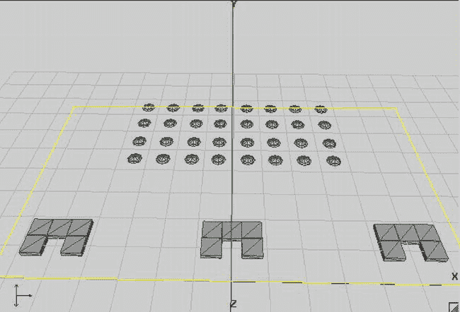

图 12-2。3D 游戏场地实物模型

现在来定义游戏机制:

*   一艘船在操场的底部飞行，只能在 x 轴上导航。
*   运动被限制在操场的边界。当船到达游戏区域的左边或右边界时，它简单地停止移动。
*   我们想让玩家选择使用加速度计来导航船只，或者使用屏幕上的按钮来左右移动。
*   这艘船每秒能发射一发子弹。玩家按下屏幕上的按钮射击。
*   在游戏场的底部，有三个盾牌，每个盾牌由五个立方体组成。
*   入侵者以图 12-2 所示的配置开始，然后向左移动一段距离，再向 z 正方向移动一段距离，再向右移动一段距离。总共将有 32 个入侵者，组成四排八个入侵者。
*   入侵者会随机射击。
*   当一颗子弹击中船时，船就会爆炸并失去一条生命。
*   当子弹击中盾牌时，盾牌会永久消失。
*   一枪命中入侵者，入侵者爆炸，分数增加 10 分。
*   当所有入侵者被消灭后，新一波入侵者出现，移动速度略快于上一波。
*   当入侵者直接撞上一艘船，游戏就结束了。
*   当这艘船失去了所有的生命，游戏就结束了。

这不是一个压倒性的名单，是吗？所有操作基本上都可以在 2D 进行(在 x-z 平面而不是 x-y 平面)。然而，我们仍然会使用 3D 包围球。如果你愿意，你可以在我们完成第一次迭代后将游戏扩展到真正的 3D。现在，让我们来看看背景故事和艺术风格。

发展背景故事和选择艺术风格

我们将称这个游戏为安卓入侵者，以示对安卓和太空入侵者的尊重。那是便宜的，但是我们还不打算生产一个 AAA 头衔。在传统的经典射击游戏中，像*末日*，背景故事会很少。事情是这样的:

> 来自外太空的入侵者攻击地球。你是唯一有能力击退邪恶力量的人。

这对《毁灭战士》和《??》《地震》来说已经足够好了，所以对《安卓入侵者》来说也足够好了。

当涉及到 GUI 时，艺术风格将有点复古，使用我们在第九章中为超级 Jumper 使用的相同的老式字体。我们的游戏世界本身将以花哨的 3D 显示，带有纹理和光照的 3D 模型。图 12-3 显示了游戏屏幕的样子。

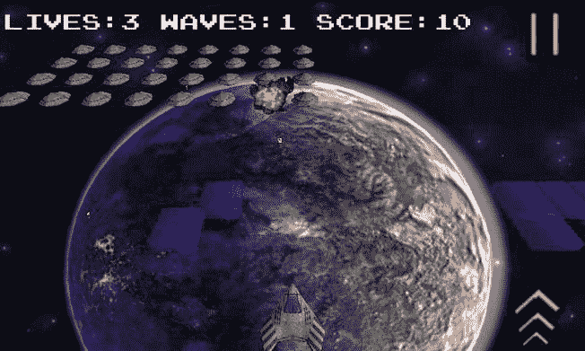

图 12-3。安卓入侵者样机。想不到！

音乐将是摇滚/金属混合，音效将与场景相匹配。

定义屏幕和过渡

由于我们已经实现了两次帮助屏幕和高分屏幕，分别是在第六章第一章的《提名先生》和第九章第三章的《超级跳跃者》中，我们将不再为 Android 入侵者这样做；这总是相同的原则，无论如何，一旦游戏屏幕出现，玩家应该立即知道该做什么。相反，我们将添加一个设置屏幕，允许玩家选择输入类型(多点触摸或加速度计)以及禁用或启用声音。以下是安卓入侵者的屏幕列表:

*   主屏幕上有一个标志和播放和设置选项。
*   立即开始游戏的游戏画面(没有更多的准备？信号！)并且还处理暂停状态(带有恢复和退出选项),并且一旦船上没有更多的生命就显示游戏结束。
*   显示代表配置选项(多点触控、加速度计和声音)的三个图标的设置屏幕。

这与我们前两场比赛的情况非常相似。图 12-4 显示了所有的屏幕和过渡。

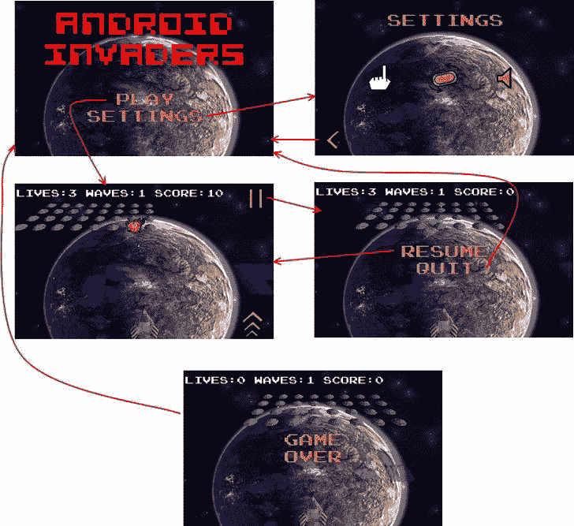

图 12-4。安卓入侵者的画面和过渡

定义游戏世界

在 3D 中工作的乐趣之一是我们摆脱了像素的束缚。我们可以用任何我们想要的单位来定义我们的世界。我们概述的游戏机制规定了一个有限的游戏领域，所以让我们从定义这个领域开始。图 12-5 显示了我们游戏世界中游戏场地的面积。

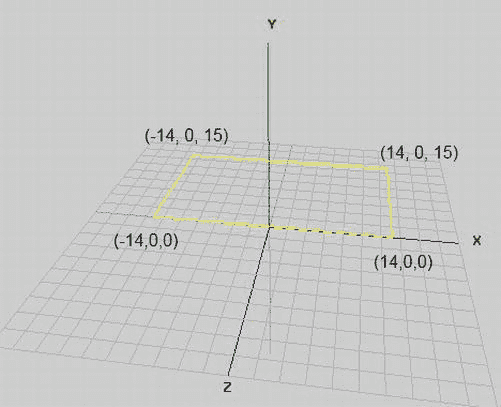

图 12-5。比赛场地

我们世界的一切都将发生在 x-z 平面的这个边界内。坐标将限制在 x 轴从 14 到 14，z 轴从 0 到 15。船只将能够沿着比赛场地的底边从(14，0，0)移动到(14，0，0)。

接下来，我们定义世界中物体的大小:

*   飞船的半径将为 0.5 个单位。
*   入侵者的半径会稍微大一点，0.75 个单位。这使得它们更容易被击中。
*   每个屏蔽块的半径为 0.5 个单位。
*   每个镜头的半径为 0.1 个单位。

我们是如何得出这些价值的？我们简单地将我们的游戏世界分成一个单元一个单元的单元，并确定每个游戏元素相对于游戏场地的大小应该有多大。通常，您可以通过一些实验或者使用米这样的真实单位来获得这些测量值。在安卓入侵者中，我们会使用无名单位。

当然，我们刚刚定义的半径可以直接转化为边界球。在屏蔽块和飞船的情况下，我们可以欺骗一下，因为它们显然不是球形的。多亏了我们世界的 2D 属性，我们才得以逃脱这个小把戏。在入侵者的例子中，球体实际上是一个很好的近似。

我们还必须定义运动物体的速度:

*   船能以每秒 20 单位的最大速度移动。在超级 Jumper 中，我们通常会有一个较低的速度，因为它取决于设备的倾斜。
*   入侵者最初每秒移动 1 个单位。每一波都会稍微提高这个速度。
*   镜头以每秒 10 个单位的速度移动。

有了这些定义，我们就可以开始实现我们游戏世界的逻辑了。在我们开始实现逻辑之前，我们将首先创建我们的素材。

创建素材

正如在我们以前的游戏中，我们有两种图形素材:UI 元素，如徽标和按钮，以及游戏中不同类型对象的模型。

用户界面素材

我们将再次创建与某个目标分辨率相关的 UI 素材。我们的游戏将在横向模式下运行，因此我们只需选择 480×320 像素的目标分辨率。图 12-4 中的屏幕显示了我们用户界面中已经有的元素:一个标志、不同的菜单项、几个按钮和一些文本。对于文本，我们将重用超级跳线的字体。我们已经在之前的游戏中为所有这些元素做了合成，你已经知道将它们放入纹理贴图集对性能有好处。我们将为 Android Invaders 使用的纹理地图，包含所有的 UI 元素(以及游戏中所有屏幕的字体)，如图图 12-6 所示。

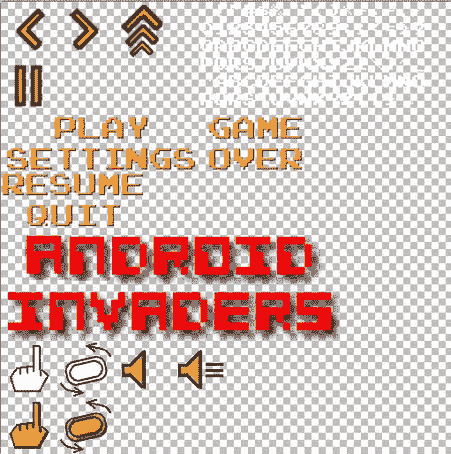

图 12-6。UI 元素图集，有按钮，logo，字体。它存储在 512×512 像素的 items.png 文件中

这和我们在《超级跳线》中使用的概念基本相同。我们也有一个将在所有屏幕上呈现的背景。图 12-7 显示了该图像。

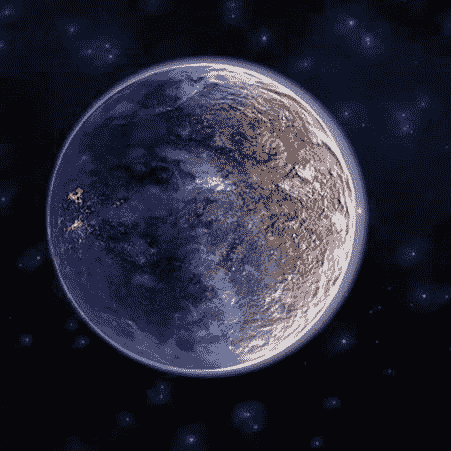

图 12-7。背景存储在 background，512×512 像素

如前面的图 12-4 所示，我们只需要使用该图像的左上角区域来渲染一个完整的帧(480×320 像素)。

这些都是我们需要的 UI 元素。现在我们可以看看我们的 3D 模型和它们的纹理。

游戏素材

正如在第十一章中提到的，详细介绍如何用 Wings3D 这样的软件创建 3D 模型超出了本书的范围。如果你想创建自己的模型，选择一个应用来工作，并通过一些教程，这些教程通常可以在互联网上免费获得。对于 Android Invaders 的模型，我们使用 Wings3D 并简单地将它们导出为 OBJ 格式，我们可以用我们的框架加载它。所有模型都只由三角形组成，并且有纹理坐标和法线。对于一些模型，我们不需要纹理坐标，但是拥有它们也无妨。

船舶模型及其纹理如图图 12-8 所示。

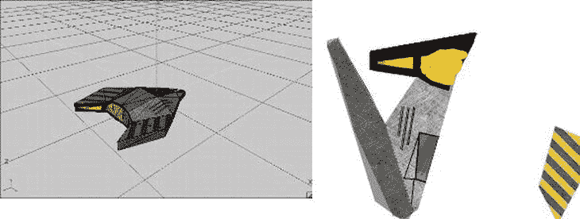

图 12-8。wings 3d 中的船舶模型(ship.obj)及其纹理(ship.png，256×256 像素)

至关重要的是，图 12-8 中的船大致具有上一节中概述的“半径”。我们不需要缩放任何东西，也不需要将尺寸和位置从一个坐标系转换到另一个坐标系。船的模型是用和它的边界球相同的单位定义的！

图 12-9 显示了入侵者模型及其纹理。

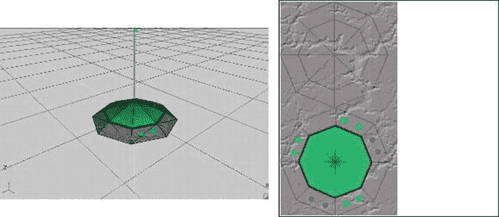

图 12-9。入侵者模型(invader.obj)及其纹理(invader.png，256×256 像素)

入侵者模型遵循与船只模型相同的原则。我们有一个 OBJ 文件存储顶点位置，纹理坐标，法线和面，以及一个纹理图像。

盾牌块和镜头被建模为立方体，并存储在文件 shield.obj 和 shot.obj 中。尽管它们被分配了纹理坐标，但我们在渲染它们时实际上并不使用纹理映射。我们只是用特定的颜色(蓝色的屏蔽块，黄色的镜头)将它们绘制成(半透明的)物体。

最后，我们有我们的爆炸(再次参见图 12-3 )。我们如何对它们建模？我们没有。我们做了我们在 2D 做的事情，简单地在我们的 3D 世界中绘制一个具有适当 z 位置的矩形，用包含爆炸动画的纹理图像的帧对其进行纹理映射。这和我们在《超级跳伞》中使用的动画物体的原理是一样的。唯一的区别是，我们在小于 0 的 z 位置(爆炸对象所在的位置)绘制矩形。我们甚至可以滥用 SpriteBatcher 类来做到这一点。OpenGL ES 万岁！图 12-10 显示了纹理。

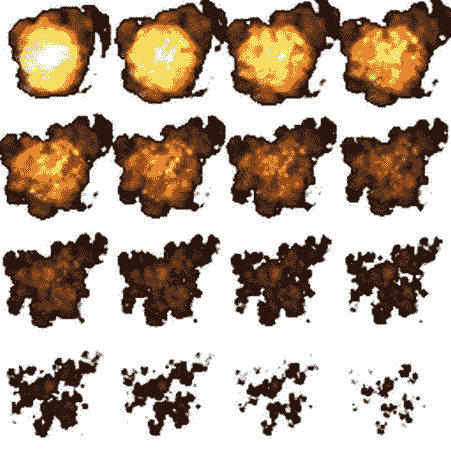

图 12-10。爆炸动画纹理(explode.png，256×256 像素)

动画的每一帧大小为 64×64 像素。我们需要做的就是为每一帧生成纹理区域，并将它们放入一个动画实例中，我们可以使用它来获取给定动画时间的正确帧，就像我们在《超级跳线》中对松鼠和鲍勃动画所做的那样。

声音和音乐

对于音效，我们再次使用了 as3sfxr。我们在网上找到了爆炸音效。这是一个公共域音效，所以我们可以在 Android Invaders 中使用它。对于我们自己版本的 Android Invaders，我们用真实的乐器自己录制了音乐。是的——那很老派。以下是安卓入侵者的音频文件列表:

*   click.ogg:用于菜单项/按钮的咔哒声
*   射击声:射击声
*   爆炸:一种爆炸的声音
*   music.mp3:我们为 Android Invaders 写的摇滚/金属歌曲

行动（或活动、袭击）计划

有了我们的游戏机制、设计和素材，我们可以开始编码了。像往常一样，我们创建一个新项目，复制我们所有的框架代码，确保我们有一个合适的清单和图标，等等。到目前为止，您应该已经很好地掌握了如何进行设置。Android 入侵者的所有代码都会放在包 com . badlogic . androidgames . androidinvaders 中，素材存放在 Android 项目的 assets/目录下。我们使用了与超级 Jumper 中相同的通用结构:一个从 GLGame 派生的默认活动；实现不同屏幕和过渡的几个 GLScreen 实例，如图 12-4 所示；用于加载素材和存储设置的类，以及用于游戏对象的类；还有一个渲染类，可以用 3D 绘制我们的游戏世界。让我们从素材类开始。

素材类别

好吧，我们之前在《提名先生》和《超级跳伞者》中已经这样做过了，所以不要期待任何惊喜。清单 12-1 显示了素材类的代码。

***清单 12-1。****【Assets.java】，一如既往地装载和储存素材*

```java
package com.badlogic.androidgames.androidinvaders;

import com.badlogic.androidgames.framework.Music;
import com.badlogic.androidgames.framework.Sound;
import com.badlogic.androidgames.framework.gl.Animation;
import com.badlogic.androidgames.framework.gl.Font;
import com.badlogic.androidgames.framework.gl.ObjLoader;
import com.badlogic.androidgames.framework.gl.Texture;
import com.badlogic.androidgames.framework.gl.TextureRegion;
import com.badlogic.androidgames.framework.gl.Vertices3;
import com.badlogic.androidgames.framework.impl.GLGame;

public class Assets {
    public static Texture *background*;
    public static TextureRegion *backgroundRegion*;
    public static Texture *items*;
    public static TextureRegion *logoRegion*;
    public static TextureRegion *menuRegion*;
    public static TextureRegion *gameOverRegion*;
    public static TextureRegion *pauseRegion*;
    public static TextureRegion *settingsRegion*;
    public static TextureRegion *touchRegion*;
    public static TextureRegion *accelRegion*;
    public static TextureRegion *touchEnabledRegion*;
    public static TextureRegion *accelEnabledRegion*;
    public static TextureRegion *soundRegion*;
    public static TextureRegion *soundEnabledRegion*;
    public static TextureRegion *leftRegion*;
    public static TextureRegion *rightRegion*;
    public static TextureRegion *fireRegion*;
    public static TextureRegion *pauseButtonRegion*;
    public static Font *font*;
```

我们有几个成员存储 UI 元素的纹理，以及背景图像。我们还存储了几个 TextureRegions，以及一个 Font 实例。这涵盖了我们所有的 UI 需求。

```java
    public static Texture *explosionTexture*;
    public static Animation *explosionAnim*;
    public static Vertices3 *shipModel*;
    public static Texture *shipTexture*;
    public static Vertices3 *invaderModel*;
    public static Texture *invaderTexture*;
    public static Vertices3 *shotModel*;
    public static Vertices3 *shieldModel*;
```

我们使用纹理实例和顶点实例来存储游戏对象的模型和纹理。我们使用一个动画实例来保存爆炸动画的帧。

```java
    public static Music*music*;
    public static Sound *clickSound*;
    public static Sound *explosionSound*;
    public static Sound *shotSound*;
```

我们使用一个音乐实例和几个声音实例来存储游戏的音频。

```java
    public static void load(GLGame game) {
        *background* = new Texture(game, "background.jpg",true );
        *backgroundRegion* = new TextureRegion(*background*, 0, 0, 480, 320);
        *items* = new Texture(game, "items.png",true );
        *logoRegion* = new TextureRegion(*items*, 0, 256, 384, 128);
        *menuRegion* = new TextureRegion(*items*, 0, 128, 224, 64);
        *gameOverRegion* = new TextureRegion(*items*, 224, 128, 128, 64);
        *pauseRegion* = new TextureRegion(*items*, 0, 192, 160, 64);
        *settingsRegion* = new TextureRegion(*items*, 0, 160, 224, 32);
        *touchRegion* = new TextureRegion(*items*, 0, 384, 64, 64);
        *accelRegion* = new TextureRegion(*items*, 64, 384, 64, 64);
        *touchEnabledRegion* = new TextureRegion(*items*, 0, 448, 64, 64);
        *accelEnabledRegion* = new TextureRegion(*items*, 64, 448, 64, 64);
        *soundRegion* = new TextureRegion(*items*, 128, 384, 64, 64);
        *soundEnabledRegion* = new TextureRegion(*items*, 190, 384, 64, 64);
        *leftRegion* = new TextureRegion(*items*, 0, 0, 64, 64);
        *rightRegion* = new TextureRegion(*items*, 64, 0, 64, 64);
        *fireRegion* = new TextureRegion(*items*, 128, 0, 64, 64);
        *pauseButtonRegion* = new TextureRegion(*items*, 0, 64, 64, 64);
        *font* = new Font(*items*, 224, 0, 16, 16, 20);
```

load()方法从创建 UI 相关的东西开始。像往常一样，只是一些纹理加载和区域创建。

```java
        *explosionTexture* = new Texture(game, "explode.png",true );
        TextureRegion[] keyFrames = new TextureRegion[16];
        int frame = 0;
        for (int y = 0; y < 256; y += 64) {
            for (int x = 0; x < 256; x += 64) {
                keyFrames[frame++] = new TextureRegion(*explosionTexture*, x, y, 64, 64);
            }
        }
        *explosionAnim* = new Animation(0.1f, keyFrames);
```

接下来，我们为爆炸动画创建纹理，以及每个帧和动画实例的纹理区域。我们简单地以 64 像素的增量从左上到右下循环，并且每帧创建一个 TextureRegion。然后，我们将所有区域提供给一个动画实例，其帧持续时间为 0.1 秒。

```java
        *shipTexture* = new Texture(game, "ship.png",true );
        *shipModel*  = ObjLoader.*load*(game, "ship.obj");
        *invaderTexture* = new Texture(game, "invader.png",true );
        *invaderModel*  = ObjLoader.*load*(game, "invader.obj");
        *shieldModel*  = ObjLoader.*load*(game, "shield.obj");
        *shotModel*  = ObjLoader.*load*(game, "shot.obj");
```

接下来，我们加载船、入侵者、盾块和镜头的模型和纹理。这对于我们强大的 ObjLoader 来说非常简单，不是吗？请注意，我们使用纹理的小中见大贴图。

```java
        *music*  = game.getAudio().newMusic("music.mp3");
        *music*.setLooping(true );
        *music*.setVolume(0.5f);
        if (Settings.*soundEnabled*)
            *music*.play();

        *clickSound*  = game.getAudio().newSound("click.ogg");
        *explosionSound*  = game.getAudio().newSound("explosion.ogg");
        *shotSound*  = game.getAudio().newSound("shot.ogg");
    }
```

在这里，我们加载游戏的音乐和音效。对 Settings 类的引用本质上和《超级 Jumper》和《Nom 先生》中的一样。当我们的游戏在我们马上要实现的 AndroidInvaders 类中启动时，这个方法将被调用一次。一旦所有的资源都被加载，我们可以忘记它们中的大部分，除了纹理，如果游戏暂停然后继续，我们需要重新加载。

```java
    public static void reload() {
        *background*.reload();
        *items*.reload();
        *explosionTexture*.reload();
        *shipTexture*.reload();
        *invaderTexture*.reload();
        if (Settings.*soundEnabled*)
            *music*.play();
    }
```

这就是 reload()方法的用武之地。我们在 AndroidInvaders.onResume()方法中调用此方法，这样我们的纹理将被重新加载，音乐将被取消暂停。

```java
    public static void playSound(Sound sound) {
        if (Settings.*soundEnabled*)
            sound.play(1);
    }
}
```

最后，我们有在《超级跳线》中使用的相同的便利方法来减轻回放声音效果的痛苦。当用户禁用声音时，我们在这个方法中不播放任何东西。

**注意**虽然这种加载和管理素材的方法很容易实现，但是如果您拥有的素材太多，就会变得一团糟。另一个问题是，有时并不是所有的素材都能一次放入内存。对于简单的游戏，比如我们在本书中开发的游戏，这种方法很好。我们也经常在游戏中使用它。对于更大的游戏，你必须考虑更精细的素材管理策略。

设置类

与素材类一样，对于设置类，我们可以在某种程度上重用我们为以前的游戏编写的内容。我们现在可以存储一个额外的布尔值，告诉我们用户是想使用触摸屏还是加速度计来移动船只。我们可以放弃高分支持，因为我们不需要跟踪这一点。(作为练习，您当然可以重新引入高分屏幕并将这些分数保存到 SD 卡中。)清单 12-2 显示了代码。

***清单 12-2。****Settings.java，老样子，老样子*

```java
package com.badlogic.androidgames.androidinvaders;

import java.io.BufferedReader;
import java.io.BufferedWriter;
import java.io.IOException;
import java.io.InputStreamReader;
import java.io.OutputStreamWriter;

import com.badlogic.androidgames.framework.FileIO;

public class Settings {
    public static boolean *soundEnabled* =true ;
    public static boolean *touchEnabled* =true ;
    public final static String*file*  = ".androidinvaders";
```

首先，我们存储声音是否启用，以及用户是否希望使用触摸输入来导航船只。这些设置将存储在文件中。SD 卡上的 androidinvaders。

```java
    public static void load(FileIO files) {
        BufferedReader in = null ;
        try {
            in = new BufferedReader(new InputStreamReader(files.readFile(*file*)));
            *soundEnabled*  = Boolean.*parseBoolean*(in.readLine());
            *touchEnabled*  = Boolean.*parseBoolean*(in.readLine());
        }catch (IOException e) {
            // :( It's ok we have defaults
        }catch (NumberFormatException e) {
            // :/ It's ok, defaults save our day
        }finally {
            try {
                if (in != null )
                    in.close();
            }catch (IOException e) {
            }
        }
    }
```

这一节没有什么我们需要仔细阅读的，真的；我们以前做过这个。我们尝试从 SD 卡上的文件中读取这两个布尔值。如果失败，我们就回到默认值。

```java
    public static void save(FileIO files) {
        BufferedWriter out = null ;
        try {
            out = new BufferedWriter(new OutputStreamWriter(
                    files.writeFile(*file*)));
            out.write(Boolean.*toString*(*soundEnabled*));
            out.write("\n");
            out.write(Boolean.*toString*(*touchEnabled*));
        }catch (IOException e) {
        }finally {
            try {
                if (out != null )
                    out.close();
            }catch (IOException e) {
            }
        }
    }
}
```

存钱又很无聊。我们只是存储我们所拥有的，如果失败，我们忽略错误。这是另一个需要改进的地方，因为您可能想让用户知道有什么地方出错了。

主要活动

像往常一样，我们有一个从 GLGame 类派生的主活动。它负责在启动时通过调用 Assets.load()加载素材，以及在活动暂停或恢复时暂停和恢复音乐。作为开始屏幕，我们只是返回 MainMenuScreen，我们将很快实现它。我们需要记住的一件事是在清单文件的活动定义中将方向设置为横向。清单 12-3 显示了代码。

***清单 12-3。****AndroidInvaders.java，主要活动*

```java
package com.badlogic.androidgames.androidinvaders;

import javax.microedition.khronos.egl.EGLConfig;
import javax.microedition.khronos.opengles.GL10;

import com.badlogic.androidgames.framework.Screen;
import com.badlogic.androidgames.framework.impl.GLGame;

public class AndroidInvaders extends GLGame {
    boolean firstTimeCreate =true ;

    public Screen getStartScreen() {
        return new MainMenuScreen(this );
    }

    @Override
    public void onSurfaceCreated(GL10 gl, EGLConfig config) {
        super.onSurfaceCreated(gl, config);
        if (firstTimeCreate) {
            Settings.*load*(getFileIO());
            Assets.*load*(this );
            firstTimeCreate =false ;
        }else {
            Assets.*reload*();
        }
    }

    @Override
    public void onPause() {
        super.onPause();
        if (Settings.*soundEnabled*)
            Assets.*music*.pause();
    }
}
```

这和《超级 Jumper》里一模一样。在对 getStartScreen()的调用中，我们返回 MainMenuScreen 的一个新实例，接下来我们将编写这个实例。在 onSurfaceCreated()中，我们确保我们的资源被重新加载，而在 onPause()中，如果音乐正在播放，我们就暂停它。

正如你所看到的，一旦你对如何实现一个简单的游戏有了一个好的想法，有很多事情可以重复。想想如何通过将事情转移到框架中来进一步减少样板代码！

主菜单屏幕

我们已经为之前的游戏写了很多琐碎的画面。安卓入侵者也有一些这样的。原则总是一样的:提供一些 UI 元素来点击和触发转换或配置更改，并显示一些信息。主菜单屏幕仅显示徽标以及播放和设置选项，如前面的图 12-4 所示。触摸其中一个按钮会切换到游戏屏幕或设置屏幕。清单 12-4 显示了代码。

***清单 12-4。****【MainMenuScreen.java】，主菜单屏幕*

```java
package com.badlogic.androidgames.androidinvaders;

import java.util.List;

import javax.microedition.khronos.opengles.GL10;

import com.badlogic.androidgames.framework.Game;
import com.badlogic.androidgames.framework.Input.TouchEvent;
import com.badlogic.androidgames.framework.gl.Camera2D;
import com.badlogic.androidgames.framework.gl.SpriteBatcher;
import com.badlogic.androidgames.framework.impl.GLScreen;
import com.badlogic.androidgames.framework.math.OverlapTester;
import com.badlogic.androidgames.framework.math.Rectangle;
import com.badlogic.androidgames.framework.math.Vector2;

public class MainMenuScreen extends GLScreen {
    Camera2D guiCam;
    SpriteBatcher batcher;
    Vector2 touchPoint;
    Rectangle playBounds;
    Rectangle settingsBounds;
```

像往常一样，我们需要一个摄像机来设置我们的视口和 480×320 像素的虚拟目标分辨率。我们使用 SpriteBatcher 来呈现 UI 元素和背景图像。Vector2 和 Rectangle 实例将帮助我们判断触摸是否点击了按钮。

```java
    public MainMenuScreen(Game game) {
        super(game);

        guiCam = new Camera2D(glGraphics, 480, 320);
        batcher = new SpriteBatcher(glGraphics, 10);
        touchPoint = new Vector2();
        playBounds = new Rectangle(240–112, 100, 224, 32);
        settingsBounds = new Rectangle(240–112, 100–32, 224, 32);
    }
```

在构造函数中，我们像往常一样设置了摄像机和 SpriteBatcher。我们使用屏幕上两个元素的位置、宽度和高度，以 480×320 的目标分辨率实例化 Vector2 和 Rectangle 实例。

```java
    @Override
    public void update(float deltaTime) {
        List<TouchEvent> events = game.getInput().getTouchEvents();
        int len = events.size();
        for (int i = 0; i < len; i++) {
            TouchEvent event = events.get(i);
            if (event.type != TouchEvent.*TOUCH_UP*)
                continue ;

            guiCam.touchToWorld(touchPoint.set(event.x, event.y));
            if (OverlapTester.*pointInRectangle*(playBounds, touchPoint)) {
                Assets.*playSound*(Assets.*clickSound*);
                game.setScreen(new GameScreen(game));
            }
            if (OverlapTester.*pointInRectangle*(settingsBounds, touchPoint)) {
                Assets.*playSound*(Assets.*clickSound*);
                game.setScreen(new SettingsScreen(game));
            }
        }
    }
```

在 update()方法中，我们获取触摸事件并检查“touch-up”事件。如果有这样的事件，我们把它的真实坐标转换到摄像机建立的坐标系。剩下要做的就是对照包围菜单项的两个矩形来检查接触点。如果其中一个被击中，我们播放点击声音，并转换到各自的屏幕。

```java
    @Override
    public void present(float deltaTime) {
        GL10 gl = glGraphics.getGL();
        gl.glClear(GL10.*GL_COLOR_BUFFER_BIT*);
        guiCam.setViewportAndMatrices();

        gl.glEnable(GL10.*GL_TEXTURE_2D*);

        batcher.beginBatch(Assets.*background*);
        batcher.drawSprite(240, 160, 480, 320, Assets.*backgroundRegion*);
        batcher.endBatch();

        gl.glEnable(GL10.*GL_BLEND*);
        gl.glBlendFunc(GL10.*GL_SRC_ALPHA*, GL10.*GL_ONE_MINUS_SRC_ALPHA*);

        batcher.beginBatch(Assets.*items*);
        batcher.drawSprite(240, 240, 384, 128, Assets.*logoRegion*);
        batcher.drawSprite(240, 100, 224, 64, Assets.*menuRegion*);
        batcher.endBatch();

        gl.glDisable(GL10.*GL_BLEND*);
        gl.glDisable(GL10.*GL_TEXTURE_2D*);
    }
```

present()方法做的事情和它在 Super Jumper 的大多数屏幕中做的一样。我们清空屏幕，并通过相机建立投影矩阵。我们启用纹理，然后通过我们在 Assets 类中定义的 SpriteBatcher 和 TextureRegion 立即渲染背景。菜单项有半透明的区域，所以我们在渲染之前启用混合。

```java
    @Override
    public void pause() {
    }

    @Override
    public void resume() {
    }

    @Override
    public void dispose() {
    }
}
```

该类的其余部分由样板方法组成，它们不做任何事情。纹理重新加载是在 AndroidInvaders 活动中完成的，所以在 MainMenuScreen 中没有任何事情需要处理。

设置屏幕

设置屏幕为播放器提供了更改输入法的选项以及启用或禁用音频的选项。我们用三种不同的图标来表示这些选项(见图 12-4 )。触摸手图标或倾斜设备图标可启用相应的输入法。当前活动输入法的图标将为金色。对于音频图标，我们做的和以前的游戏一样。

用户的选择通过在设置类中设置相应的布尔值来反映。我们还通过调用 Settings.save()确保这些设置在其中一项发生变化时立即保存到 SD 卡中。清单 12-5 显示了代码。

***清单 12-5。****【SettingsScreen.java】，设置屏幕*

```java
package com.badlogic.androidgames.androidinvaders;

import java.util.List;

import javax.microedition.khronos.opengles.GL10;

import com.badlogic.androidgames.framework.Game;
import com.badlogic.androidgames.framework.Input.TouchEvent;
import com.badlogic.androidgames.framework.gl.Camera2D;
import com.badlogic.androidgames.framework.gl.SpriteBatcher;
import com.badlogic.androidgames.framework.impl.GLScreen;
import com.badlogic.androidgames.framework.math.OverlapTester;
import com.badlogic.androidgames.framework.math.Rectangle;
import com.badlogic.androidgames.framework.math.Vector2;

public class SettingsScreen extends GLScreen {
    Camera2D guiCam;
    SpriteBatcher batcher;
    Vector2 touchPoint;
    Rectangle touchBounds;
    Rectangle accelBounds;
    Rectangle soundBounds;
    Rectangle backBounds;
```

像往常一样，我们有一个摄像头和一个 SpriteBatcher 来呈现我们的 UI 元素和背景。为了检查触摸事件是否击中了按钮，我们为屏幕上的四个按钮存储了一个 Vector2 实例和四个 Rectangle 实例。

```java
    public SettingsScreen(Game game) {
        super(game);
        guiCam = new Camera2D(glGraphics, 480, 320);
        batcher = new SpriteBatcher(glGraphics, 10);
        touchPoint = new Vector2();

        touchBounds = new Rectangle(120–32, 160–32, 64, 64);
        accelBounds = new Rectangle(240–32, 160–32, 64, 64);
        soundBounds = new Rectangle(360–32, 160–32, 64, 64);
        backBounds = new Rectangle(32, 32, 64, 64);
    }
```

在构造函数中，我们设置了屏幕的所有成员。这里不涉及火箭科学。

```java
    @Override
    public void update(float deltaTime) {
        List<TouchEvent> events = game.getInput().getTouchEvents();
        int len = events.size();
        for (int i = 0; i < len; i++) {
            TouchEvent event = events.get(i);
            if (event.type != TouchEvent.*TOUCH_UP*)
                continue ;

            guiCam.touchToWorld(touchPoint.set(event.x, event.y));
            if (OverlapTester.*pointInRectangle*(touchBounds, touchPoint)) {
                Assets.*playSound*(Assets.*clickSound*);
                Settings.*touchEnabled* =true ;
                Settings.*save*(game.getFileIO());
            }
            if (OverlapTester.*pointInRectangle*(accelBounds, touchPoint)) {
                Assets.*playSound*(Assets.*clickSound*);
                Settings.*touchEnabled* =false ;
                Settings.*save*(game.getFileIO());
            }
            if (OverlapTester.*pointInRectangle*(soundBounds, touchPoint)) {
                Assets.*playSound*(Assets.*clickSound*);
                Settings.*soundEnabled*  = !Settings.*soundEnabled*;
                if (Settings.*soundEnabled*) {
                    Assets.*music*.play();
                }else {
                    Assets.*music*.pause();
                }
                Settings.*save*(game.getFileIO());
            }
            if (OverlapTester.*pointInRectangle*(backBounds, touchPoint)) {
                Assets.*playSound*(Assets.*clickSound*);
                game.setScreen(new MainMenuScreen(game));
            }
        }
    }
```

update()方法获取触摸事件并检查是否注册了一个“触发”事件。如果是，它会将触摸坐标转换到相机的坐标系。有了这些坐标，它测试各种矩形来决定采取什么行动。

```java
    @Override
    public void present(float deltaTime) {
        GL10 gl = glGraphics.getGL();
        gl.glClear(GL10.*GL_COLOR_BUFFER_BIT*);
        guiCam.setViewportAndMatrices();

        gl.glEnable(GL10.*GL_TEXTURE_2D*);

        batcher.beginBatch(Assets.*background*);
        batcher.drawSprite(240, 160, 480, 320, Assets.*backgroundRegion*);
        batcher.endBatch();

        gl.glEnable(GL10.*GL_BLEND*);
        gl.glBlendFunc(GL10.*GL_SRC_ALPHA*, GL10.*GL_ONE_MINUS_SRC_ALPHA*);

        batcher.beginBatch(Assets.*items*);
        batcher.drawSprite(240, 280, 224, 32, Assets.*settingsRegion*);
        batcher.drawSprite(120, 160, 64, 64,
                Settings.*touchEnabled*? Assets.*touchEnabledRegion*: Assets.*touchRegion*);
        batcher.drawSprite(240, 160, 64, 64,
                Settings.*touchEnabled*? Assets.*accelRegion*
                        : Assets.*accelEnabledRegion*);
        batcher.drawSprite(360, 160, 64, 64,
                Settings.*soundEnabled*? Assets.*soundEnabledRegion*: Assets.*soundRegion*);
        batcher.drawSprite(32, 32, 64, 64, Assets.*leftRegion*);
        batcher.endBatch();

        gl.glDisable(GL10.*GL_BLEND*);
        gl.glDisable(GL10.*GL_TEXTURE_2D*);
    }
```

present()方法的作用与 MainMenuScreen.render()方法相同。我们在需要的地方用纹理和混合来渲染背景和按钮。基于当前的设置，我们决定使用哪个 TextureRegion 来呈现三个设置按钮。

```java
    @Override
    public void pause() {
    }

    @Override
    public void resume() {
    }

    @Override
    public void dispose() {
    }
}
```

类的其余部分还是由一些样板方法组成，没有任何功能。

在创建 GameScreen 类之前，我们首先要实现我们世界的逻辑和渲染。模型-视图-控制器来拯救我们！

模拟类

像往常一样，我们将为我们世界中的每个对象创建一个单独的类:

*   屏蔽块
*   发射
*   一艘船
*   入侵者

这种编排是由一个无所不知的世界级大师完成的。正如我们在第十一章中看到的，在物体表现方面，2D 和 3D 并没有太大的区别。我们现在可以使用 GameObject3D 和 DynamicObject3D 来代替 GameObject 和 DynamicObject。唯一的区别是，我们使用 Vector3 实例而不是 Vector2 实例来存储位置、速度和加速度，并且我们使用边界球体而不是边界矩形来表示对象的形状。剩下要做的就是实现我们世界中不同对象的行为。

盾牌格挡类

从游戏力学的定义中，我们知道我们的盾块的大小和行为。他们只是坐在我们世界的某个地方，等着被飞船或入侵者的子弹消灭。它们没有太多的逻辑，所以代码相当简洁。清单 12-6 显示了屏蔽块的内部结构。

***清单 12-6。****Shield.java，盾牌格挡类*

```java
package com.badlogic.androidgames.androidinvaders;

import com.badlogic.androidgames.framework.GameObject3D;

public class Shield extends GameObject3D {
    static float *SHIELD_RADIUS*  = 0.5f;

    public Shield(float x,float y,float z) {
        super(x, y, z,*SHIELD_RADIUS*);
    }
}
```

我们定义屏蔽的半径，并根据构造函数的参数初始化它的位置和包围球。这就是全部了！

铅球课

Shot 类同样简单。它来源于 DynamicGameObject3D，因为它实际上在移动。清单 12-7 显示了代码。

***清单 12-7。****Shot.java，射击类*

```java
package com.badlogic.androidgames.androidinvaders;

import com.badlogic.androidgames.framework.DynamicGameObject3D;

public class Shot extends DynamicGameObject3D {
    static float *SHOT_VELOCITY*  = 10f;
    static float *SHOT_RADIUS*  = 0.1f;

    public Shot(float x,float y,float z,float velocityZ) {
        super(x, y, z,*SHOT_RADIUS*);
        velocity.z = velocityZ;
    }

    public void update(float deltaTime) {
        position.z += velocity.z * deltaTime;
        bounds.center.set(position);
    }
}
```

这里，我们定义一些常数，即弹丸速度及其半径。构造函数获取一个镜头的初始位置，以及它在 z 轴上的速度。等等，我们不是刚把速度定义为常数了吗？是的，但是那会让我们的射击只在 z 轴的正方向上行进。这对于入侵者的射击来说没问题，但是来自船上的射击必须向相反的方向行进。当我们创建一个镜头时(在这个类之外)，我们知道镜头应该向哪个方向移动。

update()方法只做通常的质点物理学。这里不涉及加速度，因此我们只需要将恒定速度乘以时间增量加到射击的位置上。关键的部分是，我们还根据镜头的位置更新包围球中心的位置。否则，边界球体不会随快照移动。

轮船等级

Ship 类负责更新船的位置，使其保持在游戏场的边界内，并跟踪其所处的状态。它可以是活的，也可以是爆炸的。在这两种情况下，我们都会记录船只处于这种状态的时间。然后，我们可以使用状态时间来制作动画，例如，就像我们在 Super Jumper 及其 WorldRenderer 类中所做的那样。船只将从外部获得当前速度，基于用户输入，或者是加速度计读数，就像我们对 Bob 所做的那样，或者是基于一个常数，取决于屏幕上的按钮被按下。此外，这艘船将记录它拥有的生命数量，并向我们提供一种方式来告诉它它已经被杀死。清单 12-8 显示了代码。

***清单 12-8。****Ship.java，船级*

```java
package com.badlogic.androidgames.androidinvaders;

import com.badlogic.androidgames.framework.DynamicGameObject3D;

public class Ship extends DynamicGameObject3D {
    static float *SHIP_VELOCITY*  = 20f;
    static int *SHIP_ALIVE*  = 0;
    static int *SHIP_EXPLODING*  = 1;
    static float *SHIP_EXPLOSION_TIME*  = 1.6f;
    static float *SHIP_RADIUS*  = 0.5f;
```

我们首先用一些常数来定义最大船速，两种状态(存活和爆炸)，船身完全爆炸所需的时间，以及船身的包围球半径。此外，我们让该类从 DynamicGameObject3D 派生，因为它有一个位置和边界球，以及一个速度。存储在 DynamicGameObject3D 中的加速度矢量将再次被使用。

```java
    int lives;
    int state;
    float stateTime = 0;
```

接下来我们有两个成员，由两个整数组成，用来记录船的生命数量和它的状态(SHIP_ALIVE 或 SHIP _ EXPLODING)。最后一个成员记录飞船处于当前状态的秒数。

```java
    public Ship(float x,float y,float z) {
        super(x, y, z,*SHIP_RADIUS*);
        lives = 3;
        state =*SHIP_ALIVE*;
    }
```

构造函数执行通常的超类构造函数调用，并初始化一些成员。这艘船总共有三条命。

```java
    public void update(float deltaTime,float accelY) {
        if (state ==*SHIP_ALIVE*) {
            velocity.set(accelY / 10 **SHIP_VELOCITY*, 0, 0);
            position.add(velocity.x * deltaTime, 0, 0);
            if (position.x < World.*WORLD_MIN_X*)
                position.x = World.*WORLD_MIN_X*;
            if (position.x > World.*WORLD_MAX_X*)
                position.x = World.*WORLD_MAX_X*;
            bounds.center.set(position);
        }else {
            if (stateTime >=*SHIP_EXPLOSION_TIME*) {
                lives--;
                stateTime = 0;
                state =*SHIP_ALIVE*;
            }
        }
        stateTime += deltaTime;
    }
```

update()方法非常简单。它需要设备 y 轴上的增量时间和当前加速度计读数(记住，我们处于横向模式，因此加速度计 y 轴是我们屏幕的 x 轴)。如果船是活的，我们就根据加速度计的值(在 10 到 10 的范围内)设置它的速度，就像我们在《超级 Jumper》中对 Bob 所做的那样。此外，我们根据当前速度更新它的位置。接下来，我们使用两个常数来检查船是否离开了比赛场地的边界，我们将在后面的世界级课程中定义这两个常数。当位置固定时，我们可以更新船的包围球的中心。

如果飞船正在爆炸，我们检查这种情况已经持续了多久。在爆炸状态 1.6 秒后，飞船完成爆炸，失去一条生命，并回到存活状态。

最后，我们根据给定的增量时间更新 stateTime 成员。

```java
    public void kill() {
        state =*SHIP_EXPLODING*;
        stateTime = 0;
        velocity.x = 0;
    }
}
```

如果世界类确定船只与射击者或入侵者之间发生了碰撞，将调用 last kill()方法。它会将状态设置为爆炸，重置状态时间，并确保船的速度在所有轴上都为零(我们从未设置速度向量的 y 和 z 分量，因为我们只在 x 轴上移动)。

侵略者阶级

入侵者只是按照预定的模式漂浮在太空中。图 12-11 显示了这种模式。

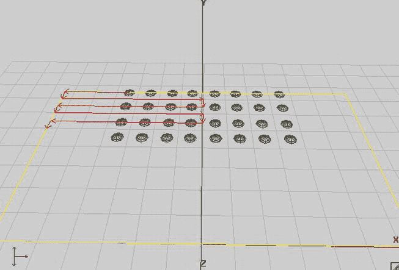

图 12-11。入侵者的动作:左、下、右、下、左、下、右、下。。。

入侵者遵循极其简单的运动模式。从初始位置开始，它先向右移动一段距离。接下来，它再次向下移动一段指定的距离(这意味着在运动场上 z 轴的正方向上)。一旦完成，它就开始向右移动，基本上回到向左移动之前的 x 坐标。

除了开始时，左右移动距离总是相同的。图 12-11 展示了左上入侵者的移动。它的第一次向左运动比随后所有向左或向右的运动都要短。水平移动距离是运动场宽度的一半，在这种情况下是 14 个单位。对于第一次水平运动，入侵者必须行进的距离是这个距离的一半，即 7 个单位。

我们要做的是跟踪入侵者移动的方向，以及它在这个方向上已经移动了多远。如果达到给定移动状态的移动距离(水平移动 14 个单位，垂直移动 1 个单位)，则切换到下一个移动状态。所有入侵者最初的移动距离都被设置为球场宽度的一半。再次查看图 12-11 以了解其工作原理。这将使入侵者从比赛场地的边缘向左右弹开。

入侵者也有恒定的速度。如果当前一波入侵者都死了，那么每次我们产生新一波入侵者时，速度都会增加。我们可以简单地通过将默认速度乘以某个从外部设置的常数来实现这一点，即负责更新所有入侵者的世界级。

最后，我们必须跟踪入侵者的状态，可以是活着的，也可以是正在爆炸的。我们将使用与船的情况相同的机制，带有状态和状态时间。清单 12-9 显示了代码。

***清单 12-9。****Invader.java，入侵者阶层*

```java
package com.badlogic.androidgames.androidinvaders;

import com.badlogic.androidgames.framework.DynamicGameObject3D;

public class Invader extends DynamicGameObject3D {
    static final int *INVADER_ALIVE*  = 0;
    static final int *INVADER_DEAD*  = 1;
    static final float *INVADER_EXPLOSION_TIME*  = 1.6f;
    static final float *INVADER_RADIUS*  = 0.75f;
    static final float *INVADER_VELOCITY*  = 1;
    static final int *MOVE_LEFT*  = 0;
    static final int *MOVE_DOWN*  = 1;
    static final int *MOVE_RIGHT*  = 2;
```

我们从定义入侵者的状态、爆炸持续时间、半径和默认速度的一些常数开始，然后是三个常数，允许我们跟踪入侵者当前移动的方向。

```java
    int state =*INVADER_ALIVE*;
    float stateTime = 0;
    int move =*MOVE_LEFT*;
    boolean wasLastStateLeft =true ;
    float movedDistance = World.*WORLD_MAX_X*/ 2;
```

我们跟踪入侵者的状态、状态时间、移动方向和移动距离，这些应该最初设置为运动场宽度的一半。我们还记录了最后一次水平移动是否向左。一旦入侵者完成了在 z 轴上的垂直运动，我们就可以决定它应该朝哪个方向前进。

```java
    public Invader(float x,float y,float z) {
        super(x, y, z,*INVADER_RADIUS*);
    }
```

构造函数通过超类构造函数执行入侵者位置和边界船只的常规设置。

```java
    public void update(float deltaTime,float speedMultiplier) {
        if (state ==*INVADER_ALIVE*) {
            movedDistance += deltaTime **INVADER_VELOCITY** speedMultiplier;
            if (move ==*MOVE_LEFT*) {
                position.x -= deltaTime **INVADER_VELOCITY** speedMultiplier;
                if (movedDistance > World.*WORLD_MAX_X*) {
                    move =*MOVE_DOWN*;
                    movedDistance = 0;
                    wasLastStateLeft =true ;
                }
            }
            if (move ==*MOVE_RIGHT*) {
                position.x += deltaTime **INVADER_VELOCITY** speedMultiplier;
                if (movedDistance > World.*WORLD_MAX_X*) {
                    move =*MOVE_DOWN*;
                    movedDistance = 0;
                    wasLastStateLeft =false ;
                }
            }
            if (move ==*MOVE*_*DOWN*) {
                position.z += deltaTime **INVADER*_*VELOCITY** speedMultiplier;
                if (movedDistance > 1) {
                    if (wasLastStateLeft)
                        move =*MOVE*_*RIGHT*;
                    else
                        move =*MOVE*_*LEFT*;
                    movedDistance = 0;
                }
            }

            bounds.center.set(position);
        }

        stateTime += deltaTime;
    }
```

update()方法采用当前的增量时间和速度乘数，使新一波入侵者移动得更快。当然，只有当入侵者活着的时候，我们才进行运动。

我们首先计算这次更新中入侵者将行进多少个单位，并相应地增加 movedDistance 成员。如果它向左移动，我们直接通过从位置的 x 坐标减去移动速度乘以时间和速度的增量乘数来更新位置。如果它移动得足够远，我们通过将 move 成员设置为 MOVE_DOWN 来告诉它开始垂直移动。此外，我们将 wasLastStateLeft 设置为 true，这样我们就知道，向下运动完成后，入侵者必须向右移动。

对于向右的运动，我们做了完全相同的处理。唯一的区别是，我们从位置的 x 坐标中减去移动速度，并在达到移动距离后将 wasLastStateLeft 设置为 false。

如果入侵者向下移动，我们操纵入侵者位置的 z 坐标，并再次检查它在那个方向上移动了多远。如果它到达了向下移动的移动距离，我们将移动状态切换到 MOVE_LEFT 或 MOVE_RIGHT，这取决于 wasLastStateLeft 成员中编码的最后一个水平移动方向。一旦我们完成了入侵者位置的更新，我们就设置包围球的位置，就像我们对飞船所做的那样。最后，我们更新当前状态时间，并认为更新已经完成。

```java
    public void kill() {
        state =*INVADER*_*DEAD*;
        stateTime = 0;
    }
}
```

这里的 kill()方法与 Ship 类的 kill()方法的作用相同。它允许我们告诉入侵者它应该开始死亡。我们将其状态设置为 INVADER_DEAD，并重置其状态时间。然后入侵者将停止移动，并且只根据当前的时间增量更新它的状态时间。

世界一流

世界级是这一切的策划者。它存储船只、入侵者和镜头，并负责更新它们和检查碰撞。这和《超级 Jumper》中的差不多，只有一些小的不同。初始放置盾块，以及入侵者，也是世界级的责任。我们创建了一个 WorldListener 接口来通知外部各方我们世界中的事件，例如爆炸或枪击。这将允许我们播放声音效果，就像在超级跳线。一次检查一个方法会有所帮助。清单 12-10 显示了代码。

***清单 12-10。****World.java，世界级，将一切联系在一起*

```java
package com.badlogic.androidgames.androidinvaders;

import java.util.ArrayList;
import java.util.List;
import java.util.Random;

import com.badlogic.androidgames.framework.math.OverlapTester;

public class World {
    public interface WorldListener {
        public void explosion();

        public void shot();
    }
```

我们希望外界知道何时发生爆炸或何时开枪。为此，我们定义了一个侦听器接口，我们可以实现该接口并向一个 World 实例注册，当这些事件之一发生时将调用该实例。这很像超级跳伞，只是项目不同。

```java
    final static float *WORLD*_*MIN*_*X*  = −14;
    final static float *WORLD*_*MAX*_*X*  = 14;
    final static float *WORLD*_*MIN*_*Z*  = −15;
```

我们也有几个常量来定义世界的范围，正如前面“定义游戏世界”一节所讨论的。

```java
    WorldListener listener;
    int waves = 1;
    int score = 0;
    float speedMultiplier = 1;
    final List<Shot> shots = new ArrayList<Shot>();
    final List<Invader> invaders = new ArrayList<Invader>();
    final List<Shield> shields = new ArrayList<Shield>();
    final Ship ship;
    long lastShotTime;
    Random random;
```

我们的世界记录了一些事情。我们有一个监听器，当发生爆炸或枪击时，我们会调用它。此外，我们会记录玩家已经消灭了多少波入侵者。score 成员跟踪当前分数，speedMultiplier 成员允许我们加快入侵者的移动速度(记住 Invaders.update()方法)。此外，我们还储存了世界上现存的射击、入侵者和盾块的列表。最后，我们有一个船的实例，我们存储船最后一次开枪的时间。我们以纳秒为单位存储这个时间，由 System.nanoTime()返回—因此是长数据类型。当我们想决定一个入侵者是否应该开枪时，这个随机的例子将会派上用场。

```java
    public World() {
        ship = new Ship(0, 0, 0);
        generateInvaders();
        generateShields();
        lastShotTime = System.*nanoTime*();
        random = new Random();
    }
```

在构造器中，我们在初始位置创建飞船，生成入侵者和护盾，初始化其余成员。

```java
    private void generateInvaders() {
        for (int row = 0; row < 4; row++) {
            for (int column = 0; column < 8; column++) {
                Invader invader = new Invader(−*WORLD*_*MAX*_*X*/ 2 + column * 2f,
                        0,*WORLD*_*MIN*_*Z*+ row * 2f);
                invaders.add(invader);
            }
        }
    }
```

generateInvaders()方法简单地创建了一个入侵者网格，8 乘 4，排列如图图 12-11 所示。

```java
    private void generateShields() {
        for (int shield = 0; shield < 3; shield++) {
            shields.add(new Shield(−10 + shield * 10–1, 0, -3));
            shields.add(new Shield(−10 + shield * 10 + 0, 0, -3));
            shields.add(new Shield(−10 + shield * 10 + 1, 0, -3));
            shields.add(new Shield(−10 + shield * 10–1, 0, -2));
            shields.add(new Shield(−10 + shield * 10 + 1, 0, -2));
        }
    }
```

generateShields()方法做得差不多:实例化三个盾牌，每个盾牌由五个盾牌块组成，如图 12-2 所示。

```java
    public void setWorldListener(WorldListener worldListener) {
        this .listener = worldListener;
    }
```

我们还有一个 setter 方法来设置世界上的侦听器。我们将用它来了解世界上发生的事件并做出相应的反应，例如播放音效。

```java
    public void update(float deltaTime,float accelX) {
        ship.update(deltaTime, accelX);
        updateInvaders(deltaTime);
        updateShots(deltaTime);

        checkShotCollisions();
        checkInvaderCollisions();

        if (invaders.size() == 0) {
            generateInvaders();
            waves++;
            speedMultiplier += 0.5f;
        }
    }
```

update()方法出奇的简单。它使用当前的 delta 时间，以及加速度计 y 轴上的读数，我们可以将它们传递给 Ship.update()。一旦船更新了，我们调用 updateInvaders()和 updateShots()，它们负责更新这两种类型的对象。在世界上所有的物体都被更新后，我们开始检查是否有碰撞。checkShotCollision()方法将检查任何镜头与船只和/或入侵者之间的碰撞。

最后，我们检查入侵者是否已经死亡。如果是的话，我们会产生新一波入侵者。出于对垃圾收集器(GC)的热爱，我们可以重用旧的 Invader 实例，例如，通过 Pool 类。然而，为了简单起见，我们简单地创建新的实例。对了，打针也是一样。鉴于我们在一个游戏会话中创建的对象数量很少，GC 不太可能触发。如果你想让 GC 真正开心，就使用一个 Pool 实例来重用死去的入侵者和镜头。另外，请注意，我们在这里增加了速度乘数！

```java
    private void updateInvaders(float deltaTime) {
        int len = invaders.size();
        for (int i = 0; i < len; i++) {
            Invader invader = invaders.get(i);
            invader.update(deltaTime, speedMultiplier);

            if (invader.state == Invader.*INVADER*_*ALIVE*) {
                if (random.nextFloat() < 0.001f) {
                    Shot shot = new Shot(invader.position.x,
                                 invader.position.y,
                                                             invader.position.z,
                                 Shot.*SHOT*_*VELOCITY*);
                    shots.add(shot);
                    listener.shot();
                }
            }

            if (invader.state == Invader.*INVADER_DEAD*&&
                            invader.stateTime > Invader.*INVADER_EXPLOSION_TIME*) {
                invaders.remove(i);
                i--;
                len--;
            }
        }
    }
```

updateInvaders()方法有几个职责。它遍历所有入侵者并调用他们的 update()方法。一旦入侵者实例被更新，我们检查它是否还活着。如果是的话，我们通过产生一个随机数给它一个开火的机会。如果这个数字低于 0.001，它就开一枪。这意味着每个入侵者每帧有 0.1%的几率开枪。如果发生这种情况，我们实例化一个新镜头，设置它的速度，使它在 z 轴的正方向上移动，并通知侦听器该事件。如果入侵者已经死亡并完成爆炸，我们只需将其从当前入侵者列表中移除。

```java
    private void updateShots(float deltaTime) {
        int len = shots.size();
        for (int i = 0; i < len; i++) {
            Shot shot = shots.get(i);
            shot.update(deltaTime);
            if (shot.position.z <*WORLD_MIN_Z*||
                shot.position.z > 0) {
                shots.remove(i);
                i--;
                len--;
            }
        }
    }
```

updateShots()方法也很简单。我们循环所有镜头，更新它们，并检查每一个镜头是否已经离开了比赛场地，在这种情况下，我们将其从镜头列表中删除。

```java
    private void checkInvaderCollisions() {
        if (ship.state == Ship.*SHIP_EXPLODING*)
            return ;

        int len = invaders.size();
        for (int i = 0; i < len; i++) {
            Invader invader = invaders.get(i);
            if (OverlapTester.*overlapSpheres*(ship.bounds, invader.bounds)) {
                ship.lives = 1;
                ship.kill();
                return ;
            }
        }
    }
```

在 checkInvaderCollisions()方法中，我们检查是否有任何入侵者与船只发生碰撞。这是一件非常简单的事情，因为我们需要做的就是遍历所有入侵者，并检查每个入侵者的边界球和飞船的边界球之间的重叠。根据我们的游戏力学定义，如果飞船与入侵者相撞，游戏就结束了。这就是为什么我们在调用 Ship.kill()方法之前将船的寿命设置为 1。在那个调用之后，ship 的 lives 成员被设置为 0，我们将在另一个方法中使用它来检查游戏结束状态。

```java
    private void checkShotCollisions() {
        int len = shots.size();
        for (int i = 0; i < len; i++) {
            Shot shot = shots.get(i);
            boolean shotRemoved =false ;

            int len2 = shields.size();
            for (int j = 0; j < len2; j++) {
                Shield shield = shields.get(j);
                if (OverlapTester.*overlapSpheres*(shield.bounds, shot.bounds)) {
                    shields.remove(j);
                    shots.remove(i);
                    i--;
                    len--;
                    shotRemoved =true ;
                    break ;
                }
            }
            if (shotRemoved)
                continue ;

            if (shot.velocity.z < 0) {
                len2 = invaders.size();
                for (int j = 0; j < len2; j++) {
                    Invader invader = invaders.get(j);
                    if (OverlapTester.*overlapSpheres*(invader.bounds,
                            shot.bounds)
                            && invader.state == Invader.*INVADER_ALIVE*) {
                        invader.kill();
                        listener.explosion();
                        score += 10;
                        shots.remove(i);
                        i--;
                        len--;
                        break ;
                    }
                }
            }else {
                if (OverlapTester.*overlapSpheres*(shot.bounds, ship.bounds)
                        && ship.state == Ship.*SHIP_ALIVE*) {
                    ship.kill();
                    listener.explosion();
                    shots.remove(i);
                    i--;
                    len--;
                }
            }
        }
    }
```

checkShotCollisions()方法稍微复杂一点。它循环遍历每个镜头实例，并检查它与盾块、入侵者或船只之间的重叠。盾牌格挡可以被飞船或入侵者的射击击中。入侵者只能被飞船发射的子弹击中。而且船只能被入侵者射出的子弹击中。要区分一发子弹是船只发射的还是入侵者发射的，我们需要做的就是看它的 z 向速度。如果它是正的，它向船移动，因此被入侵者发射。如果是否定的，那就是飞船发射的。

```java
    public boolean isGameOver() {
        return ship.lives == 0;
    }
```

isGameOver()方法只是简单地告诉一个外部方这艘船是否已经失去了所有的生命。

```java
    public void shoot() {
        if (ship.state == Ship.*SHIP_EXPLODING*)
            return ;

        int friendlyShots = 0;
        int len = shots.size();
        for (int i = 0; i < len; i++) {
            if (shots.get(i).velocity.z < 0)
                friendlyShots++;
        }

        if (System.*nanoTime*() - lastShotTime > 1000000000 || friendlyShots == 0) {
            shots.add(new Shot(ship.position.x, ship.position.y,
                    ship.position.z, -Shot.*SHOT_VELOCITY*));
            lastShotTime = System.*nanoTime*();
            listener.shot();
        }
    }
}
```

最后，每次用户按下 Fire 按钮时，都会从外部调用 shoot()方法。正如在“核心游戏机制”一节中所提到的，船只可以每秒发射一次，或者如果没有船只在战场上发射过，也可以发射一次。飞船爆炸当然不能开火，所以这是我们检查的第一件事。接下来，我们运行所有的快照实例，并检查其中是否有一个是船只快照。如果不是这样，我们可以立即拍摄。否则，我们检查最后一枪是什么时候开的。如果距离上次射击超过一秒钟，我们就发射新的。这一次，我们将速度设置为 Shot。SHOT_VELOCITY，使镜头沿 z 轴负方向向入侵者移动。像往常一样，我们调用侦听器来通知它事件。

而这就是组成我们游戏世界的所有职业！与我们在《超级 Jumper》中看到的相比。原理几乎相同，代码看起来也非常相似。当然，Android Invaders 是一个非常简单的游戏，所以我们可以用简单的解决方案，比如对所有东西都使用边界球。对于许多简单的 3D 游戏，这就是你所需要的。继续我们游戏的最后两个部分:GameScreen 类和 WorldRenderer 类！

GameScreen 类

一旦游戏转换到 GameScreen 类，玩家可以立即开始游戏，而不必声明他或她已经准备好了。我们仅有的状态是:

*   运行状态，我们渲染背景、世界和 UI 元素，如图图 12-4 所示
*   暂停状态，我们渲染背景、世界和暂停菜单，如图图 12-4 所示
*   游戏结束状态，我们渲染的东西和暂停状态差不多。

我们将遵循在 Super Jumper 中使用的相同模式，并为三种状态中的每一种状态使用不同的 update()和 present()方法。

这个类最有趣的部分是我们如何处理用户输入来移动船只。我们希望我们的玩家能够通过屏幕上的按钮或加速度计来控制船只。我们可以读取 Settings.touchEnabled 字段来找出用户对此想要什么。根据哪个输入方法是活动的，我们决定是否呈现屏幕上的按钮，并将适当的加速度计值传递给 World.update()方法来移动船只。

如果玩家选择了屏幕上的按钮，我们当然不需要使用加速度计的值；相反，我们只是将一个恒定的人工加速度值传递给 World.update()方法。它必须在 10(左)到 10(右)的范围内。经过一点试验，我们通过屏幕上的按钮得出向左移动的值为 5，向右移动的值为 5。

这个课程的另一个有趣的部分是我们结合 3D 游戏世界的渲染和 2D UI 元素的方式。让我们看看清单 12-11 中的 GameScreen 类的代码。

***清单 12-11。****GameScreen.java，游戏画面*

```java
package com.badlogic.androidgames.androidinvaders;

import java.util.List;

import javax.microedition.khronos.opengles.GL10;

import com.badlogic.androidgames.androidinvaders.World.WorldListener;
import com.badlogic.androidgames.framework.Game;
import com.badlogic.androidgames.framework.Input.TouchEvent;
import com.badlogic.androidgames.framework.gl.Camera2D;
import com.badlogic.androidgames.framework.gl.FPSCounter;
import com.badlogic.androidgames.framework.gl.SpriteBatcher;
import com.badlogic.androidgames.framework.impl.GLScreen;
import com.badlogic.androidgames.framework.math.OverlapTester;
import com.badlogic.androidgames.framework.math.Rectangle;
import com.badlogic.androidgames.framework.math.Vector2;

public class GameScreen extends GLScreen {
    static final int *GAME*_*RUNNING*  = 0;
    static final int *GAME_PAUSED*  = 1;
    static final int *GAME_OVER*  = 2;
```

像往常一样，我们有几个常量用于编码屏幕的当前状态。

```java
    int state;
    Camera2D guiCam;
    Vector2 touchPoint;
    SpriteBatcher batcher;
    World world;
    WorldListener worldListener;
    WorldRenderer renderer;
    Rectangle pauseBounds;
    Rectangle resumeBounds;
    Rectangle quitBounds;
    Rectangle leftBounds;
    Rectangle rightBounds;
    Rectangle shotBounds;
    int lastScore;
    int lastLives;
    int lastWaves;
    String scoreString;
    FPSCounter fpsCounter;
```

游戏屏幕的成员照常工作。我们有一个跟踪状态的成员、一个摄像头、一个触摸点的向量、一个用于呈现 2D UI 元素的 SpriteBatcher、一个 World 实例、一个 WorldListener、一个 WorldRenderer(我们马上就要编写这个程序)以及几个用于检查 UI 元素是否被触摸的矩形。此外，三个整数跟踪最后的生命数、waves 和 score，这样我们就不必为了减少 GC 活动而每次都更新 scoreString。最后，我们有一个 FPSCounter，这样以后我们就可以计算出游戏的性能。

```java
    public GameScreen(Game game) {
        super(game);

        state =*GAME_RUNNING*;
        guiCam = new Camera2D(glGraphics, 480, 320);
        touchPoint = new Vector2();
        batcher = new SpriteBatcher(glGraphics, 100);
        world = new World();
        worldListener = new WorldListener() {
            public void shot() {
                Assets.*playSound*(Assets.*shotSound*);
            }

            public void explosion() {
                Assets.*playSound*(Assets.*explosionSound*);
            }
        };
        world.setWorldListener(worldListener);
        renderer = new WorldRenderer(glGraphics);
        pauseBounds = new Rectangle(480–64, 320–64, 64, 64);
        resumeBounds = new Rectangle(240–80, 160, 160, 32);
        quitBounds = new Rectangle(240–80, 160–32, 160, 32);
        shotBounds = new Rectangle(480–64, 0, 64, 64);
        leftBounds = new Rectangle(0, 0, 64, 64);
        rightBounds = new Rectangle(64, 0, 64, 64);
        lastScore = 0;
        lastLives = world.ship.lives;
        lastWaves = world.waves;
        scoreString = "lives:" + lastLives + " waves:" + lastWaves + " score:"
                + lastScore;
        fpsCounter = new FPSCounter();
    }
```

在构造函数中，我们设置了所有的成员，就像我们现在习惯做的那样。WorldListener 负责在我们的世界发生事件时播放正确的声音。其余部分与 Super Jumper 相同，尽管针对稍微不同的 UI 元素做了一些修改。

```java
    @Override
    public void update(float deltaTime) {
        switch (state) {
        case *GAME_PAUSED*:
            updatePaused();
            break ;
        case *GAME_RUNNING*:
            updateRunning(deltaTime);
            break ;
        case *GAME_OVER*:
            updateGameOver();
            break ;
        }
    }
```

update()方法根据屏幕的当前状态，将真正的更新委托给其他三种更新方法之一。

```java
    private void updatePaused() {
        List<TouchEvent> events = game.getInput().getTouchEvents();
        int len = events.size();
        for (int i = 0; i < len; i++) {
            TouchEvent event = events.get(i);
            if (event.type != TouchEvent.*TOUCH_UP*)
                continue ;

            guiCam.touchToWorld(touchPoint.set(event.x, event.y));
            if (OverlapTester.*pointInRectangle*(resumeBounds, touchPoint)) {
                Assets.*playSound*(Assets.*clickSound*);
                state =*GAME_RUNNING*;
            }

            if (OverlapTester.*pointInRectangle*(quitBounds, touchPoint)) {
                Assets.*playSound*(Assets.*clickSound*);
                game.setScreen(new MainMenuScreen(game));
            }
        }
    }
```

updatePaused()方法遍历所有可用的触摸事件，并检查是否按下了两个菜单项中的一个(Resume 或 Quit)。在每种情况下，我们都播放卡嗒声。这里没什么新鲜的。

```java
    private void updateRunning(float deltaTime) {
        List<TouchEvent> events = game.getInput().getTouchEvents();
        int len = events.size();
        for (int i = 0; i < len; i++) {
            TouchEvent event = events.get(i);
            if (event.type != TouchEvent.*TOUCH_DOWN*)
                continue ;

            guiCam.touchToWorld(touchPoint.set(event.x, event.y));

            if (OverlapTester.*pointInRectangle*(pauseBounds, touchPoint)) {
                Assets.*playSound*(Assets.*clickSound*);
                state =*GAME_PAUSED*;
            }
            if (OverlapTester.*pointInRectangle*(shotBounds, touchPoint)) {
                world.shoot();
            }
        }

        world.update(deltaTime, calculateInputAcceleration());
        if (world.ship.lives != lastLives || world.score != lastScore
                || world.waves != lastWaves) {
            lastLives = world.ship.lives;
            lastScore = world.score;
            lastWaves = world.waves;
            scoreString = "lives:" + lastLives + " waves:" + lastWaves
                    + " score:" + lastScore;
        }
        if (world.isGameOver()) {
            state =*GAME_OVER*;
        }
    }
```

updateRunning()方法负责两件事:检查暂停按钮是否被按下(并相应地做出反应)以及根据用户输入更新世界。第一块拼图很琐碎，我们来看看世界更新机制。我们将加速度值的计算委托给一个名为 calculateInputAcceleration()的方法。一旦世界被更新，我们检查三个状态(生命、波浪或分数)中的任何一个是否已经改变，并相应地更新 scoreString。最后，我们检查游戏是否结束，在这种情况下，我们进入 GameOver 状态。

```java
    private float calculateInputAcceleration() {
        float accelX = 0;
        if (Settings.*touchEnabled*) {
            for (int i = 0; i < 2; i++) {
                if (game.getInput().isTouchDown(i)) {
                    guiCam.touchToWorld(touchPoint.set(game.getInput()
                            .getTouchX(i), game.getInput().getTouchY(i)));
                    if (OverlapTester.*pointInRectangle*(leftBounds, touchPoint)) {
                        accelX = −Ship.*SHIP_VELOCITY*/ 5;
                    }
                    if (OverlapTester.*pointInRectangle*(rightBounds, touchPoint)) {
                        accelX = Ship.*SHIP_VELOCITY*/ 5;
                    }
                }
            }
        }else {
            accelX = game.getInput().getAccelY();
        }
        return accelX;
    }
```

calculateInputAcceleration()方法是我们实际解释用户输入的地方。如果启用了触摸，我们会检查屏幕上的向左或向右移动按钮是否被按下，如果是，我们会相应地将加速度值设置为 5(左)或 5(右)。如果使用加速度计，我们只需返回它在 y 轴上的当前值(记住，我们处于横向模式)。

```java
    private void updateGameOver() {
        List<TouchEvent> events = game.getInput().getTouchEvents();
        int len = events.size();
        for (int i = 0; i < len; i++) {
            TouchEvent event = events.get(i);
            if (event.type == TouchEvent.*TOUCH_UP*) {
                Assets.*playSound*(Assets.*clickSound*);
                game.setScreen(new MainMenuScreen(game));
            }
        }
    }
```

updateGameOver()方法也很简单，它只是检查触摸事件，在这种情况下，我们转换到 MainMenuScreen。

```java
    @Override
    public void present(float deltaTime) {
        GL10 gl = glGraphics.getGL();
        gl.glClear(GL10.*GL_COLOR_BUFFER_BIT*| GL10.*GL_DEPTH_BUFFER_BIT*);
        guiCam.setViewportAndMatrices();

        gl.glEnable(GL10.*GL_TEXTURE_2D*);
        batcher.beginBatch(Assets.*background*);
        batcher.drawSprite(240, 160, 480, 320, Assets.*backgroundRegion*);
        batcher.endBatch();
        gl.glDisable(GL10.*GL_TEXTURE_2D*);

        renderer.render(world, deltaTime);

        switch (state) {
        case *GAME_RUNNING*:
            presentRunning();
            break ;
        case *GAME_PAUSED*:
            presentPaused();
            break ;
        case *GAME_OVER*:
            presentGameOver();
        }

        fpsCounter.logFrame();
    }
```

present()方法实际上非常简单，也是如此。和往常一样，我们从清除帧缓冲区开始。此外，我们清除 z 缓冲区，因为我们要渲染一些需要 z 测试的 3D 对象。接下来，我们设置投影矩阵，这样我们就可以渲染我们的 2D 背景图像，就像我们在 MainMenuScreen 或 SettingsScreen 类中所做的那样。一旦完成，我们告诉 WorldRenderer 成员渲染我们的游戏世界。最后，我们根据当前状态委托呈现 UI 元素。请注意，WorldRenderer.render()方法负责设置渲染 3D 世界所需的所有内容！

```java
    private void presentPaused() {
        GL10 gl = glGraphics.getGL();
        guiCam.setViewportAndMatrices();
        gl.glEnable(GL10.*GL_BLEND*);
        gl.glBlendFunc(GL10.*GL_SRC_ALPHA*, GL10.*GL_ONE_MINUS_SRC_ALPHA*);
        gl.glEnable(GL10.*GL_TEXTURE_2D*);

        batcher.beginBatch(Assets.*items*);
        Assets.*font*.drawText(batcher, scoreString, 10, 320–20);
        batcher.drawSprite(240, 160, 160, 64, Assets.*pauseRegion*);
        batcher.endBatch();

        gl.glDisable(GL10.*GL_TEXTURE_2D*);
        gl.glDisable(GL10.*GL_BLEND*);
    }
```

presentPaused()方法只是通过存储在 Assets 类中的字体实例以及暂停菜单来呈现 scoreString。请注意，在这一点上，我们已经渲染了背景图像，以及 3D 世界。因此，所有的 UI 元素都将覆盖 3D 世界。

```java
    private void presentRunning() {
        GL10 gl = glGraphics.getGL();
        guiCam.setViewportAndMatrices();
        gl.glEnable(GL10.*GL_BLEND*);
        gl.glBlendFunc(GL10.*GL_SRC_ALPHA*, GL10.*GL_ONE_MINUS_SRC_ALPHA*);
        gl.glEnable(GL10.*GL_TEXTURE_2D*);

        batcher.beginBatch(Assets.*items*);
        batcher.drawSprite(480–32, 320–32, 64, 64, Assets.*pauseButtonRegion*);
        Assets.*font*.drawText(batcher, scoreString, 10, 320–20);
        if (Settings.*touchEnabled*) {
            batcher.drawSprite(32, 32, 64, 64, Assets.*leftRegion*);
            batcher.drawSprite(96, 32, 64, 64, Assets.*rightRegion*);
        }
        batcher.drawSprite(480–40, 32, 64, 64, Assets.*fireRegion*);
        batcher.endBatch();

        gl.glDisable(GL10.*GL_TEXTURE_2D*);
        gl.glDisable(GL10.*GL_BLEND*);
    }
```

presentRunning()方法也非常简单。我们首先呈现 scoreString。如果启用了触摸输入，我们将呈现左右移动按钮。最后，我们渲染 Fire 按钮，并重置我们已经更改的任何 OpenGL ES 状态(纹理和混合)。

```java
    private void presentGameOver() {
        GL10 gl = glGraphics.getGL();
        guiCam.setViewportAndMatrices();
        gl.glEnable(GL10.*GL_BLEND*);
        gl.glBlendFunc(GL10.*GL_SRC_ALPHA*, GL10.*GL_ONE_MINUS_SRC_ALPHA*);
        gl.glEnable(GL10.*GL_TEXTURE_2D*);

        batcher.beginBatch(Assets.*items*);
        batcher.drawSprite(240, 160, 128, 64, Assets.*gameOverRegion*);
        Assets.*font*.drawText(batcher, scoreString, 10, 320–20);
        batcher.endBatch();

        gl.glDisable(GL10.*GL_TEXTURE_2D*);
        gl.glDisable(GL10.*GL_BLEND*);
    }
```

presentGameOver()方法与此大同小异，只是一些字符串和 UI 呈现。

```java
    @Override
    public void pause() {
        state =*GAME_PAUSED*;
    }
```

最后，pause()方法只是将 GameScreen 置于暂停状态。

```java
    @Override
    public void resume() {

    }

    @Override
    public void dispose() {

    }
}
```

剩下的只是空的存根，这样我们就完成了 GLGame 接口定义。接下来是我们的最后一个类:WorldRenderer！

worldreader 类

让我们回忆一下我们需要在 3D 中渲染什么:

*   船，使用船的模型和纹理，并应用灯光。
*   入侵者，使用入侵者模型和纹理，再次使用灯光。
*   操场上的任何镜头，基于镜头模型，这一次没有纹理，但有灯光。
*   屏蔽块，基于屏蔽块模型，同样没有纹理，但是有灯光和透明度(见图 12-3 )。
*   爆炸而不是船只或入侵者模型，以防船只或入侵者爆炸。当然，爆炸没有被点燃。

我们知道如何对这个列表中的前四项进行编码。但是爆炸呢？

事实证明，我们可以为此滥用 SpriteBatcher。根据爆炸船只或入侵者的状态时间，我们可以从保存爆炸动画的动画实例中获取一个 TextureRegion(请参见 Assets 类)。SpriteBatcher 只能在 x-y 平面上渲染纹理化的矩形，所以我们要想办法把这样的矩形移动到空间中的任意位置(爆炸的船或者入侵者所在的位置)。在通过 SpriteBatcher 渲染矩形之前，我们可以通过在模型视图矩阵上使用 glTranslatef()轻松实现这一点！

其他对象的渲染设置非常简单。我们有一个来自右上角的平行光，我们有一个环境光来照亮所有的物体，不管它们的方向。相机位于船的上方和后方一点，它会看着船前方一点的地方。我们用我们的摄像机来做这个。为了让相机跟随船只，我们只需要保持其位置的 x 坐标和观察点与船只的 x 坐标同步。

为了获得更多的视觉效果，我们将绕 y 轴旋转入侵者，并根据当前速度绕 z 轴旋转船只，使其看起来向移动的方向倾斜。

让我们把它写成代码吧！清单 12-12 显示了 Android 入侵者的最后一类。

***清单 12-12。****WorldRenderer.java，世界渲染器*

```java
package com.badlogic.androidgames.androidinvaders;

import java.util.List;

import javax.microedition.khronos.opengles.GL10;

import com.badlogic.androidgames.framework.gl.AmbientLight;
import com.badlogic.androidgames.framework.gl.Animation;
import com.badlogic.androidgames.framework.gl.DirectionalLight;
import com.badlogic.androidgames.framework.gl.LookAtCamera;
import com.badlogic.androidgames.framework.gl.SpriteBatcher;
import com.badlogic.androidgames.framework.gl.TextureRegion;
import com.badlogic.androidgames.framework.impl.GLGraphics;
import com.badlogic.androidgames.framework.math.Vector3;

public class WorldRenderer {
    GLGraphics glGraphics;
    LookAtCamera camera;
    AmbientLight ambientLight;
    DirectionalLight directionalLight;
    SpriteBatcher batcher;
    float invaderAngle = 0;
```

WorldRenderer 跟踪 GLGraphics 实例，我们将从中获取 GL10 实例。我们还有一个观察摄像机，一个环境光，一个方向灯和一个聚光灯。最后，我们使用一个成员来跟踪所有入侵者的当前旋转角度。

```java
    public WorldRenderer(GLGraphics glGraphics) {
        this .glGraphics = glGraphics;
        camera = new LookAtCamera(67, glGraphics.getWidth()
                / (float ) glGraphics.getHeight(), 0.1f, 100);
        camera.getPosition().set(0, 6, 2);
        camera.getLookAt().set(0, 0, -4);
        ambientLight = new AmbientLight();
        ambientLight.setColor(0.2f, 0.2f, 0.2f, 1.0f);
        directionalLight = new DirectionalLight();
        directionalLight.setDirection(−1, -0.5f, 0);
        batcher = new SpriteBatcher(glGraphics, 10);
    }
```

在构造函数中，我们像往常一样设置所有成员。该相机具有 67 度的视野、0.1 个单位的近剪裁平面距离和 100 个单位的远剪裁平面距离。因此，视见平截头体将很容易包含整个游戏世界。我们把它放在船的上方和后方，让它看着(0，0，–4)。环境光只是淡淡的灰色，方向光是白色的，来自右上方。最后，我们实例化 SpriteBatcher，以便我们可以呈现爆炸矩形。

```java
    public void render(World world,float deltaTime) {
        GL10 gl = glGraphics.getGL();
        camera.getPosition().x = world.ship.position.x;
        camera.getLookAt().x = world.ship.position.x;
        camera.setMatrices(gl);

        gl.glEnable(GL10.*GL_DEPTH_TEST*);
        gl.glEnable(GL10.*GL_TEXTURE_2D*);
        gl.glEnable(GL10.*GL_LIGHTING*);
        gl.glEnable(GL10.*GL_COLOR_MATERIAL*);
        ambientLight.enable(gl);
        directionalLight.enable(gl, GL10.*GL_LIGHT0*);

        renderShip(gl, world.ship);
        renderInvaders(gl, world.invaders, deltaTime);

        gl.glDisable(GL10.*GL_TEXTURE_2D*);
        renderShields(gl, world.shields);
        renderShots(gl, world.shots);

        gl.glDisable(GL10.*GL_COLOR_MATERIAL*);
        gl.glDisable(GL10.*GL_LIGHTING*);
        gl.glDisable(GL10.*GL_DEPTH_TEST*);
    }
```

在 render()方法中，我们首先将相机的 x 坐标设置为船的 x 坐标。当然，我们也相应地设置了摄像机观察点的 x 坐标。这样，摄像机会跟着船走。一旦位置和观察点被更新，我们就可以通过调用 lookat camera . set matrix()来设置投影和模型-视图矩阵。

接下来，我们设置渲染所需的所有状态。我们将需要深度测试、纹理、光照和颜色材质功能，这样我们就不必通过 glMaterial()为对象指定材质。接下来的两条语句激活环境光和平行光。通过这些调用，我们已经设置好了一切，可以开始渲染对象了。

我们通过调用 renderShip()渲染的第一件事是船。接下来，我们通过调用 renderInvaders()来渲染入侵者。

由于屏蔽块和镜头不需要纹理，我们简单地禁用它来节省一些计算。一旦纹理被关闭，我们通过调用 renderShots()和 renderShields()来渲染镜头和盾牌。

最后，我们禁用我们设置的其他状态，以便向调用我们的任何人返回一个干净的 OpenGL ES 状态。

```java
    private void renderShip(GL10 gl, Ship ship) {
        if (ship.state == Ship.*SHIP_EXPLODING*) {
            gl.glDisable(GL10.*GL_LIGHTING*);
            renderExplosion(gl, ship.position, ship.stateTime);
            gl.glEnable(GL10.*GL_LIGHTING*);
        }else {
            Assets.*shipTexture*.bind();
            Assets.*shipModel*.bind();
            gl.glPushMatrix();
            gl.glTranslatef(ship.position.x, ship.position.y, ship.position.z);
            gl.glRotatef(ship.velocity.x / Ship.*SHIP_VELOCITY** 90, 0, 0, -1);
            Assets.*shipModel*.draw(GL10.*GL_TRIANGLES*, 0,
                    Assets.*shipModel*.getNumVertices());
            gl.glPopMatrix();
            Assets.*shipModel*.unbind();
        }
    }
```

renderShip()方法从检查船的状态开始。如果它正在爆炸，我们禁用照明，调用 renderExplosion()在船的位置渲染爆炸，并再次启用照明。

如果船是活的，我们绑定它的纹理和模型，推模型-视图矩阵，移动到它的位置并根据它的速度绕 z 轴旋转，绘制它的模型。最后，我们再次弹出模型-视图矩阵(只留下相机的视图)并解除船只模型顶点的绑定。

```java
    private void renderInvaders(GL10 gl, List<Invader> invaders,float deltaTime) {
        invaderAngle += 45 * deltaTime;

        Assets.*invaderTexture*.bind();
        Assets.*invaderModel*.bind();
        int len = invaders.size();
        for (int i = 0; i < len; i++) {
            Invader invader = invaders.get(i);
            if (invader.state == Invader.*INVADER_DEAD*) {
                gl.glDisable(GL10.*GL_LIGHTING*);
                Assets.*invaderModel*.unbind();
                renderExplosion(gl, invader.position, invader.stateTime);
                Assets.*invaderTexture*.bind();
                Assets.*invaderModel*.bind();
                gl.glEnable(GL10.*GL_LIGHTING*);
            }else {
                gl.glPushMatrix();
                gl.glTranslatef(invader.position.x, invader.position.y,
                        invader.position.z);
                gl.glRotatef(invaderAngle, 0, 1, 0);
                Assets.*invaderModel*.draw(GL10.*GL_TRIANGLES*, 0,
                        Assets.*invaderModel*.getNumVertices());
                gl.glPopMatrix();
            }
        }
        Assets.*invaderModel*.unbind();
    }
```

renderInvaders()方法与 renderShip()方法非常相似。唯一的区别是在渲染每个入侵者之前绑定纹理和网格。这大大减少了绑定的数量并加快了渲染速度。对于每一个入侵者，我们再次检查其状态，并渲染爆炸或正常入侵者模型。由于我们在 for 循环之外绑定了模型和纹理，所以在渲染爆炸而不是入侵者之前，我们必须解除绑定并重新绑定它们。

```java
    private void renderShields(GL10 gl, List<Shield> shields) {
        gl.glEnable(GL10.*GL_BLEND*);
        gl.glBlendFunc(GL10.*GL_SRC_ALPHA*, GL10.*GL_ONE_MINUS_SRC_ALPHA*);
        gl.glColor4f(0, 0, 1, 0.4f);
        Assets.*shieldModel*.bind();
        int len = shields.size();
        for (int i = 0; i < len; i++) {
            Shield shield = shields.get(i);
            gl.glPushMatrix();
            gl.glTranslatef(shield.position.x, shield.position.y,
                    shield.position.z);
            Assets.*shieldModel*.draw(GL10.*GL_TRIANGLES*, 0,
                    Assets.*shieldModel*.getNumVertices());
            gl.glPopMatrix();
        }
        Assets.*shieldModel*.unbind();
        gl.glColor4f(1, 1, 1, 1f);
        gl.glDisable(GL10.*GL_BLEND*);
    }
```

renderShields()方法渲染屏蔽块。我们应用与渲染入侵者相同的原理。我们只绑定模型一次。既然我们没有纹理，就不需要绑定一个。然而，我们需要启用混合。我们将全局顶点颜色设置为蓝色，alpha 组件设置为 0.4。这将使屏蔽块有点透明。

```java
    private void renderShots(GL10 gl, List<Shot> shots) {
        gl.glColor4f(1, 1, 0, 1);
        Assets.*shotModel*.bind();
        int len = shots.size();
        for (int i = 0; i < len; i++) {
            Shot shot = shots.get(i);
            gl.glPushMatrix();
            gl.glTranslatef(shot.position.x, shot.position.y, shot.position.z);
            Assets.*shotModel*.draw(GL10.*GL_TRIANGLES*, 0,
                    Assets.*shotModel*.getNumVertices());
            gl.glPopMatrix();
        }
        Assets.*shotModel*.unbind();
        gl.glColor4f(1, 1, 1, 1);
    }
```

在 renderShots()中渲染镜头与渲染盾牌是一样的，只是我们不使用混合，而是使用不同的顶点颜色(黄色)。

```java
    private void renderExplosion(GL10 gl, Vector3 position,float stateTime) {
        TextureRegion frame = Assets.*explosionAnim*.getKeyFrame(stateTime,
                Animation.*ANIMATION_NONLOOPING*);

        gl.glEnable(GL10.*GL_BLEND*);
        gl.glPushMatrix();
        gl.glTranslatef(position.x, position.y, position.z);
        batcher.beginBatch(Assets.*explosionTexture*);
        batcher.drawSprite(0, 0, 2, 2, frame);
        batcher.endBatch();
        gl.glPopMatrix();
        gl.glDisable(GL10.*GL_BLEND*);
    }
}
```

最后，我们有神秘的 renderExplosion()方法。我们得到我们想要渲染爆炸的位置，以及正在爆炸的物体的状态时间。后者用于从爆炸动画中获取正确的 TextureRegion，就像我们在《超级 Jumper》中为 Bob 所做的一样。

我们做的第一件事是根据状态时间获取爆炸动画帧。接下来，我们启用混合，因为爆炸有我们不想渲染的透明像素。我们推送当前的模型-视图矩阵并调用 glTranslatef()，以便在该调用之后呈现的任何内容都将被定位在给定的位置。我们告诉 SpriteBatcher 我们将要使用爆炸纹理渲染一个矩形。

下一个电话是奇迹发生的地方。我们告诉 SpriteBatcher 在(0，0，0)处呈现一个矩形(z 坐标没有给出，但隐含为零，还记得吗？)，宽度和高度为 2 个单位。因为我们使用了 glTranslatef()，所以这个矩形的中心不是原点，而是我们指定给 glTranslatef()的位置，也就是爆炸的船只或入侵者的位置。最后，我们弹出模型-视图矩阵，并再次禁用混合。

就这样。十二类，形成一个全 3D 游戏，鹦鹉学舌经典*太空入侵者*游戏。试试看。等你回来，我们再来看看性能特点。

最佳化

在我们考虑优化游戏之前，我们必须评估它的表现如何。我们在 GameScreen 类中放了一个 FPSCounter，所以让我们看看它在一个 Hero、一个 Droid 和一个 Nexus 上的输出。

```java
Hero (Android 1.5):
02–17 00:59:04.180: DEBUG/FPSCounter(457): fps: 25
02–17 00:59:05.220: DEBUG/FPSCounter(457): fps: 26
02–17 00:59:06.260: DEBUG/FPSCounter(457): fps: 26
02–17 00:59:07.280: DEBUG/FPSCounter(457): fps: 26

Nexus One (Android 2.2.1):
02–17 01:05:40.679: DEBUG/FPSCounter(577): fps: 41
02–17 01:05:41.699: DEBUG/FPSCounter(577): fps: 41
02–17 01:05:42.729: DEBUG/FPSCounter(577): fps: 41
02–17 01:05:43.729: DEBUG/FPSCounter(577): fps: 40

Droid (Android 2.1.1):
02–17 01:47:44.096: DEBUG/FPSCounter(1758): fps: 47
02–17 01:47:45.112: DEBUG/FPSCounter(1758): fps: 47
02–17 01:47:46.127: DEBUG/FPSCounter(1758): fps: 47
02–17 01:47:47.135: DEBUG/FPSCounter(1758): fps: 46
```

英雄挣扎了很久，但游戏可以以 25 FPS 的速度运行。Nexus One 达到了 41 FPS 左右，Droid 也达到了 47 FPS，可玩性相当不错。还能好起来吗？

就状态变化而言，这还不算太糟。我们可以减少一些多余的更改，比如一些 glEnable()/glDisable()调用，但是我们从以前的优化尝试中知道这样做不会减少很多开销。

关于英雄，有一件事我们可以做:禁用照明。一旦我们删除了 WorldRenderer.render()中相应的 glEnable()/glDisable()调用，以及 WorldRenderer.renderShip()和 WorldRenderer.renderInvaders()，Hero 将获得以下帧速率:

```java
Hero (Android 1.5):
02–17 01:14:44.580: DEBUG/FPSCounter(618): fps: 31
02–17 01:14:45.600: DEBUG/FPSCounter(618): fps: 31
02–17 01:14:46.610: DEBUG/FPSCounter(618): fps: 31
02–17 01:14:47.630: DEBUG/FPSCounter(618): fps: 31
```

这是相当大的进步，我们所要做的就是关掉照明。对特定设备的呈现代码进行特殊处理是可能的，但是最好避免这样做。我们还能做什么吗？

我们渲染爆炸的方式在入侵者爆炸的情况下是次优的。我们在渲染所有入侵者的过程中改变了模型和纹理绑定，这让图形管道有点不高兴。不过爆炸不会经常发生，也不会花很长时间(1.6 秒)。此外，刚刚显示的测量是在没有任何屏幕爆炸的情况下进行的，所以这不是罪魁祸首。

事实是，我们每帧渲染了太多的对象，导致了大量的调用开销，并使流水线停顿了一点。以我们目前对 OpenGL ES 的了解，我们对此无能为力。然而，考虑到游戏“感觉”在所有设备上都可以玩，并不是一定要达到 60 FPS。众所周知，Droid 和 Nexus One 很难以 60 FPS 的速度渲染哪怕是稍微复杂的 3D 场景。所以，最后一个教训是:如果你的游戏没有以 60 FPS 运行，不要发疯。如果视觉流畅，玩的好，甚至可以凑合 30 FPS。

**注意**其他常见的优化策略包括使用剔除、顶点缓冲对象，以及这里没有讨论的其他更高级的主题。我们尝试将这些添加到我们的 Android 入侵者中，效果是:零。这些设备都没有从这些优化中受益。这并不意味着这些技术是无用的。这取决于很多因素及其副作用，很难预测某些配置将如何表现。如果你感兴趣，只需在网上搜索这些术语，并亲自尝试这些技术！

摘要

在这一章中，我们完成了我们的第三个游戏，一个成熟的 3D *太空入侵者*克隆体。我们运用了在这本书的过程中学到的所有技巧和诀窍，最终的结果相当令人满意。当然，这些都不是 AAA 级游戏。事实上，在很长一段时间内，这些都不是令人愉快的。这就是你进来的地方。发挥创意，扩展这些游戏，让它们变得有趣！你有自己的工具。