# 十五、发布您的游戏

成为 Android 游戏开发者的最后一步是把你的游戏带给你的玩家。有两条可能的路线:

*   从你项目的 bin/文件夹中取出 APK 文件，放到网上，告诉你的朋友下载并安装到他们的设备上。
*   像专业人士一样，在 Google Play 上发布您的应用。

第一个选项是一个很好的方法，让其他人在你把你的应用放到 Google Play 商店之前测试它。他们所需要做的就是得到 APK 的文件，并把它安装到他们的设备上。一旦你的游戏准备好了，真正的乐趣就开始了。

关于测试的一句话

正如我们在前面的章节中看到的，设备之间有各种不同。在你发布你的应用之前，确保它能在一些常见的设备和不同的 Android 版本上运行良好。有几种方法可以解决这个问题。你可以购买一系列具有不同硬件功能的设备，运行不同版本的 Android 并进行内部测试，也可以购买任何一种新的 Android 测试服务。我们很幸运地拥有几款手机和平板电脑，涵盖不同的设备类别和代次，以供测试。然而，根据你的预算，这两种方法都不是你的选择。你可能不得不依靠模拟器(但不要太多，因为它确实不可靠)，或者最好依靠几个朋友来帮助你。

另一种测试你的应用的方法是在 Google Play 商店放一个测试版。您可以在标题中清楚地将您的应用标记为 beta，这样用户就知道会发生什么。当然，一些用户会很乐意忽略所有的警告，仍然抱怨你潜在的未完成的应用的质量。这就是生活，你可能不得不面对负面的和不公正的评论。但是请记住:你的用户才是王道。不要生他们的气——而是想办法改进你的应用。

以下是我们在应用发布前常用的测试设备列表:

*   三星 Galaxy Leo/I5801，320×240 像素屏幕
*   HTC Hero 搭载 Android 1.5，480×320 像素屏幕
*   搭载安卓 1.6，480×320 像素屏幕的 HTC G1
*   摩托罗拉 Milestone/Droid 搭载 Android 2.1，854×480 像素屏幕
*   HTC Desire HD 采用 Android 2.2，800×480 像素屏幕
*   Nexus One 搭载 Android 2.3，800×480 像素屏幕
*   HTC Evo 4G 搭载 Android 2.2，800×480 像素屏幕
*   搭载 Android 2.2 和 4.0 的三星 Galaxy S，800×480 像素屏幕
*   三星 Nexus S 搭载 Android 4.1，800×480 像素屏幕
*   三星 Galaxy Nexus 搭载 Android 4.1，800×480 像素屏幕
*   三星 Galaxy Tab 10.1 搭载 Android 3.1，1280×800 像素屏幕
*   谷歌 Nexus 7 平板，搭载安卓 4.1，1280×800 像素屏幕

如你所见，我们涵盖了相当多的屏幕尺寸/分辨率和设备代。如果你寻找外部测试人员，确保你覆盖了这里列出的大多数设备。当然，更新的设备也应该在你的列表中，但更多的是为了兼容性测试，而不是性能测试。如果没有其他事情，请确保您至少在几台谷歌官方设备上进行测试，包括 Nexus 7、Galaxy Nexus、Nexus S 和 Nexus One 设备。如果你的游戏在这些设备上运行得不好，如果你不做出改变，你肯定会遇到麻烦。

最后，您必须接受这样一个事实，即您无法在所有设备上测试您的应用。您很可能会收到莫名其妙的错误报告，这很可能是因为用户运行的自定义 rom 的行为不符合预期。无论如何，不要慌；这在某种程度上是正常的。但是，如果错误的问题太严重了，你就必须想出一个方案来解决它。幸运的是，Google Play 在这方面帮助了我们。我们一会儿会看到它是如何工作的。

**注意**除了 Google Play 的错误报告功能，还有另一个很好的解决方案叫做 Android 应用崩溃报告(ACRA)，这是一个开源库，专门用来报告你的 Android 应用的所有崩溃。在 http://code.google.com/p/acra/的 ?? 可以买到，而且非常容易使用。只需按照 Google 代码页上的指南将其集成到您的应用中。

成为注册开发者

Google 使得在 Google Play 商店上发布您的应用变得非常容易。你所要做的就是一次性支付 25 美元注册一个 Android 开发者账户。假设你生活在谷歌支持分发应用的国家名单中的一个国家，这个帐户将允许你在 Google Play 上发布你的应用。你是只能发布免费应用还是既能发布免费应用又能发布付费应用，这取决于你所在的国家。要发布付费应用，你必须居住在谷歌支持商家的较短名单上的国家之一。谷歌还列出了可以免费分发应用的国家和可以分发付费应用的国家。谷歌正在努力扩大这些列表，以便您的应用可以覆盖全球。

你的谷歌 Play 商店出版商账户与谷歌账户直接绑定。除非取消限制，否则您不得将发布者帐户与 Google 帐户分开。在决定是注册现有帐户还是注册新的专用帐户时，考虑这一点很重要。一旦你做出了决定，并准备好了你的谷歌账户，访问[`play.google.com/apps/publish/signup`](https://play.google.com/apps/publish/signup)，按照那里给出的指示注册谷歌 Play 商店。

除了你的 Android 开发者账户，如果你想出售你的应用，你还需要注册一个免费的 Google Checkout 商家账户。在开发者帐户注册过程中，您可以选择这样做。我们不是律师，所以在这一点上我们不能给你任何法律建议，但在你这样做之前，请确保你理解销售应用的法律含义。如果有疑问，考虑就此事咨询专家。我们无意以此吓退你，因为这个过程总体来说是相当简化的，但是你应该准备好让你政府的税务部门了解你的销售活动。

谷歌将从你辛苦赚来的钱中抽取一定比例(撰写本文时为 30%)用于分发你的应用和提供基础设施。这似乎是各种平台上所有应用商店的标准做法。

签署你的游戏的 APK

成功注册成为 Android 官方开发者后，就该准备将应用发布到 Google Play 了。为了发布你的申请，你必须签署 APK 文件。在你这样做之前，你应该确保一切就绪。这里有一个在签署 APK 文件之前要做的事情的清单:

*   从清单文件中的<application>标签中删除 Android:debuggeable 属性，或者将其设置为“false”。</application>
*   在<manifest>标签中，您会发现 android:versionCode 和 android:versionName 属性。如果您已经发布了应用的早期版本，则必须增加 versionCode 属性，并且还应该更改 versionName 属性。versionCode 属性必须是整数；versionName 属性可以是您喜欢的任何内容。</manifest>
*   如果您的构建目标等于或高于 SDK level 8 (Android 2.2)，您还应该确保<manifest>标签将 android:installLocation 属性设置为 preferExternal 或 auto。这将通过确保您的应用尽可能安装在外部存储上来满足您的用户。</manifest>
*   确保只指定游戏真正需要的权限。用户不喜欢安装似乎要求不必要权限的应用。检查清单文件中的<uses-permission>标签。</uses-permission>
*   确认您正确设置了 android:minSdkVersion 和 android:targetSdkVersion 属性。您的应用只能在运行 Android 版本等于或高于指定 SDK 版本的手机上才能在 Google Play 上看到。

*仔细检查* 所有这些项目。完成后，您可以通过以下步骤最终导出一个已签名的 APK 文件，该文件已准备好上传到 Google Play:

1.  Right-click your project in the Package Explorer view and select Android Tools  Export Signed Application Package to launch the Export Android Application wizard. You’ll be greeted with the Project Checks dialog, shown in Figure 15-1.

    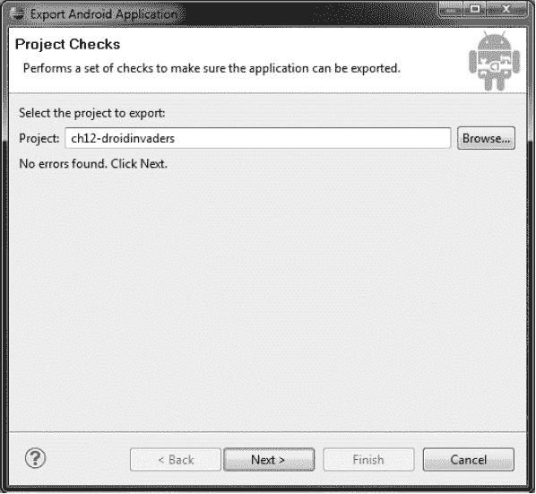

    图 15-1。签名导出对话框

2.  Click the Next button to move to the Keystore selection dialog, shown in Figure 15-2.

    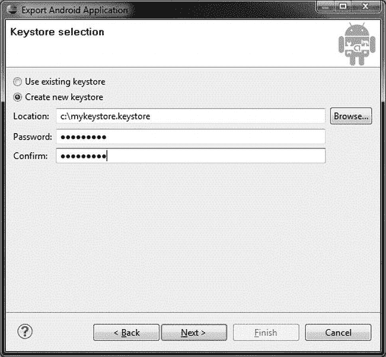

    图 15-2。选择或创建密钥库

3.  A *keystore*is a password-protected file that stores the key with which you sign your APK file. Since you haven’t created a keystore yet, you’ll do so now in this dialog. With the “Create new keystore” radio button selected, just provide the location where you want to store the keystore, along with the password that you will use to secure it. Click the Next button to move to the Key Creation dialog, shown in Figure 15-3.

    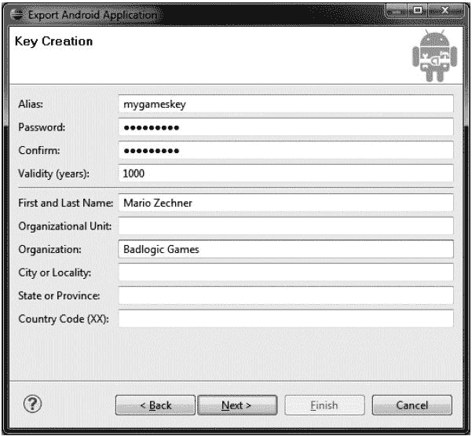

    图 15-3。创建用于签署 APK 的密钥

4.  To create a valid key, you have to complete the Alias, Password, and Validity (years) fields, as well as enter a name in the First and Last Name field. The rest of the fields are optional, but it’s a good idea to fill them out nevertheless. Click Next, and you are shown the final dialog (see Figure 15-4).

    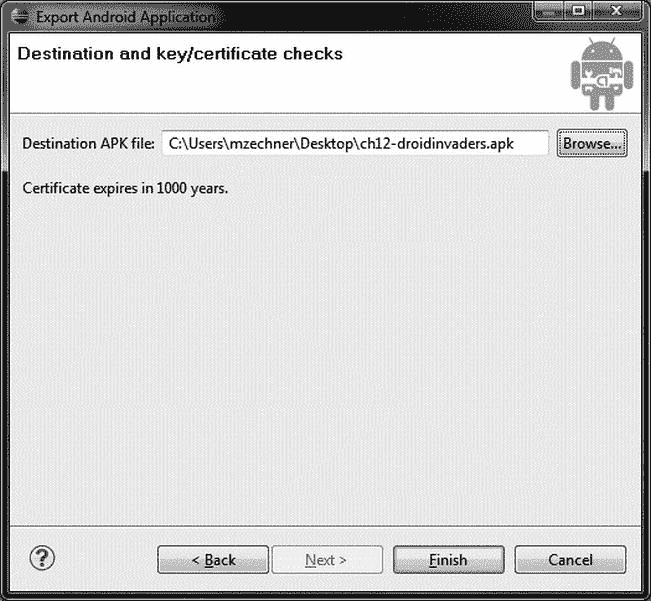

    图 15-4。指定目标文件

5.  指定存储导出的 APK 文件的位置，并确保记下路径。稍后，当您想要上传 APK 时，您将需要它。单击完成。

当您想要发布以前发布的应用的新版本时，您可以重用第一次使用向导时创建的密钥库。启动向导，当您到达图 15-2 中的所示的密钥库选择对话框时，选择“使用现有密钥库”单选按钮，提供您先前创建的密钥库文件的位置，并提供密钥库的密码。当你点击下一步，你会看到“键别名选择”对话框，如图图 15-5 所示。只需选择您之前创建的密钥，为其提供密码，单击 Next，然后像以前一样继续操作。在这两种情况下，结果将是一个签名的 APK 文件，可以上传到 Google Play。

**注意**一旦你上传了一个签名的 APK，你必须使用相同的密钥来签署同一应用的任何后续版本。

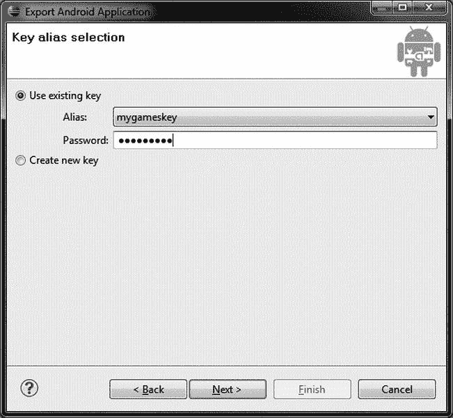

图 15-5。重用密钥

那么，你创造了你的第一个签名 APK——祝贺你！现在，我们将抛出一个扳手到工程，并通知您关于多 APK 支持。对于单个应用，您可以创建多个 apk，这些 apk 使用设备功能过滤来为安装您的应用的每个用户找到“最佳选择”。这是一个很棒的功能，因为这意味着您可以做如下事情:

*   提供与特定 GPU 兼容的特定映像集。
*   针对旧版本 Android 的有限功能集。
*   为更大的屏幕尺寸提供更大比例的图形，为所有其他屏幕尺寸提供常规比例的图形。

随着时间的推移，谷歌肯定会添加更多的过滤器，但这里概述的一套过滤器可以让你真正专注于目标设备(如平板电脑)，而不必通过太多的限制来保持第一代设备支持的合理下载量。

将您的游戏放入 Google Play

是时候在 Google Play 网站上登录您的开发者帐户了。只需前往[`play.google.com/apps/publish`](https://play.google.com/apps/publish)并登录即可。你会看到如图图 15-6 所示的界面。

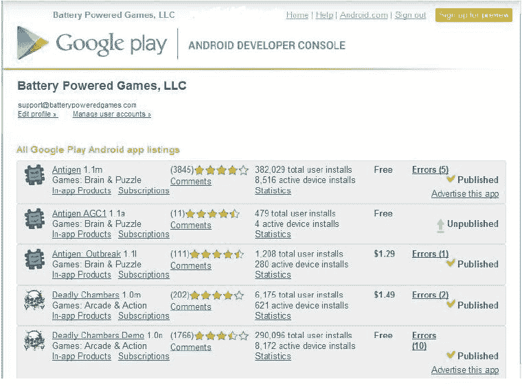

图 15-6。开发者，欢迎来到 Google Play！

这个界面就是谷歌所说的 *Android 开发者控制台*，也就是你最初注册时瞥见的。现在我们准备好实际使用它了。单击屏幕底部的上传应用按钮，您可以通过打开编辑应用屏幕来上传应用。让我们来看一下编辑应用屏幕的一些部分，第一部分，上传素材(在产品详细信息选项卡上)，如图图 15-7 所示。

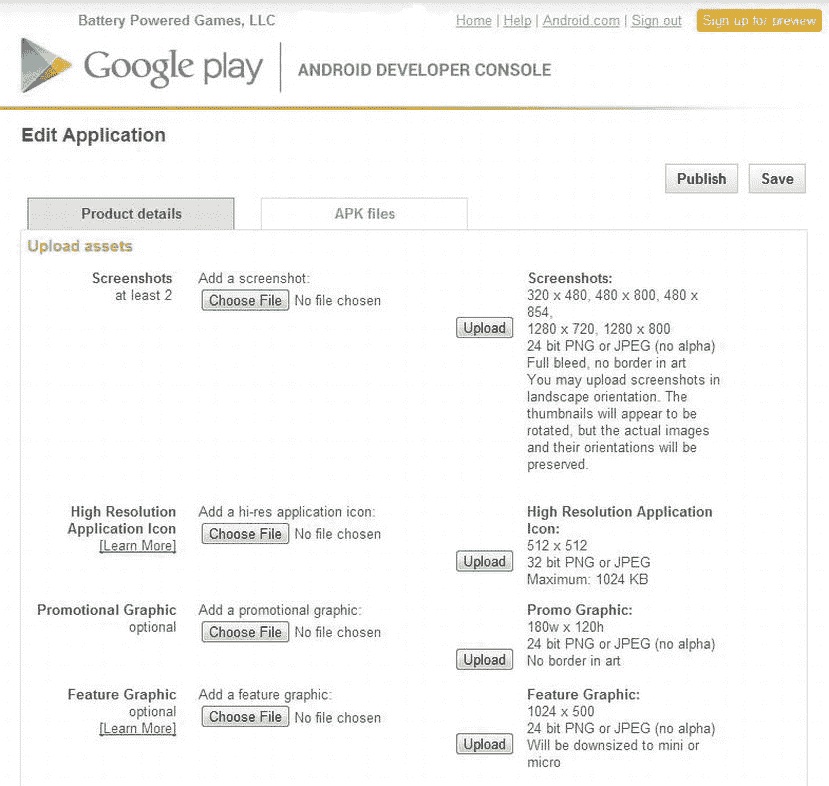

图 15-7。编辑 Android 开发者控制台的应用屏幕

上传素材

发布你的游戏需要大量的素材和信息。屏幕截图、图标、描述、类别等等，都有所需的大小和格式，在产品详情选项卡上列出。

如图图 15-7 所示，你必须提供至少两张你的应用的截图。它们必须是特定的格式(24 位 JPEG 或 PNG)和大小(320×480、480×800、480×854、1280×720 或 1280×800)。当用户在 Google Play 商店(手机应用和 http://play.google.com/storeT2 的官方网站)查看您的应用详情时，将会显示这些截图。

接下来，你必须上传一个 512×512、高分辨率、32 位的 PNG 或 JPEG 格式的应用图标。目前，只有当用户在 Google Play 商店网站上查看您的应用时，才会显示这一点。弄得花哨一点。

如果您的游戏是特色游戏，宣传图片(180w×120h，24 位 PNG 或 JPEG)和特色图片(1024×500，24 位 PNG 或 JPEG)会显示在 Google Play 商店中。成为特色是一件大事，因为这意味着当用户在移动应用或网站上打开 Google Play 商店时，你的游戏将是他们首先看到的应用之一。谁被选中取决于谷歌，只有他们知道这个决定的依据。

你可以提供一个应用的 YouTube 推广视频的链接。这将出现在 Google Play 商店网站上，这是一个重要的营销工具，因为它让用户在决定下载之前可以很好地预览你的游戏。这也是谷歌在考虑是否为你的游戏添加特色时可能会考虑的事情。

如果您的游戏有隐私政策，规定了如何存储、处理和发布用户信息，您可以在隐私政策字段中添加信息链接。如果您没有隐私政策，只需勾选“此时不提交隐私政策 URL”

请注意，Google Play 开发者界面会不断变化，可能会包括此处未列出的其他功能。

产品详情

向下滚动到编辑应用屏幕的列表细节部分，如图 15-8 所示。这些细节将在 Google Play 商店向用户显示。您可以指定语言，提供标题(最多 30 个字符)，还可以添加应用的描述(最多 4000 个字符)。额外的 500 个字符可用于通知用户应用最新版本中的最新更改。推广文本(最多 80 个字符)将仅在您的应用被 Google 选中时使用。

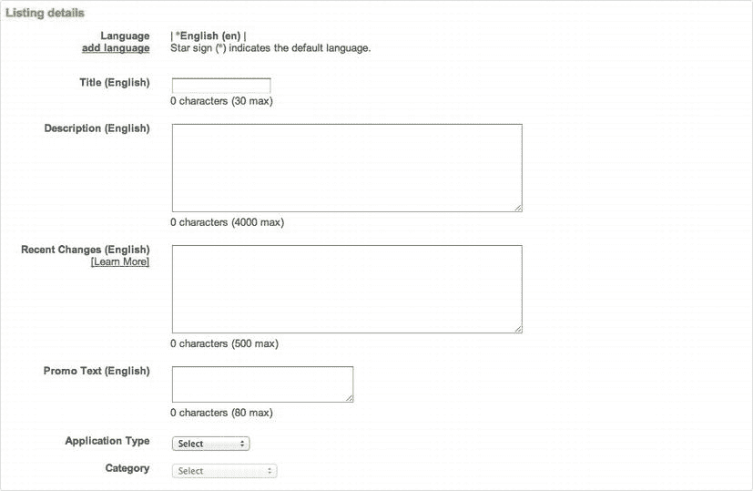

图 15-8。Android 开发人员控制台的列表详细信息部分

接下来，您必须指定您的应用的类型和类别。对于每种应用类型，都有一系列类别可供选择。对于游戏，您可以指定街机和行动，大脑和益智，纸牌和赌场，休闲，或赛车和体育。选项让分类有点混乱(赛车不是运动？)，他们可以更好地思考。希望未来能有所改变。

发布选项

“编辑应用”屏幕的“发布选项”部分允许您指定是否要复制保护应用、其内容分级以及希望其可用的位置。

复制保护功能已被否决，您不应该使用它，因为它不是有效的，而且会产生一些其他问题。相反，Google 提供了一个 API 来将许可服务集成到您的应用中。这项服务是为了让用户更难盗版你的游戏。评估这项服务超出了本书的范围；如果你对盗版有疑虑，我们建议你去 Android 开发者网站。与许多数字版权管理(DRM)方案一样，用户报告了无法运行或安装使用许可服务的应用的问题。当然，对此不能全信。如果你需要的话，这是你目前 DRM 的最佳选择。

内容分级允许您指定目标受众。您可以通过单击内容分级标题下的了解更多链接，找到对您自己的应用进行分级的指导原则。Google Play 将根据您给应用的内容评级对其进行过滤。所以，仔细评估适合你游戏的评分。Google 可能会决定您的应用需要更成熟的内容分级，在这种情况下，Google 团队将指定他们认为更合适的分级。

您可以选择应用可用的位置。当然，通常您希望它随处可用。然而，尽管这不太可能，但可能存在这样的情况，即您希望仅在选定的位置发布应用，这可能是出于法律原因。

现在你必须决定用户是否会为你的游戏付费。这是最终决定。一旦你实现了两个选项中的一个，你就不能改变它，除非你用不同的密钥重新发布你的游戏。如果你这样做，你会失去任何用户评论，你也会疏远你的用户。想想你的游戏要走的路线。我们不会给你游戏定价的建议，因为这取决于多种因素。0.99 美元的价格似乎是大多数游戏的标准，也是用户的期望。然而，没有什么能阻止你在这里尝试一下。如果你出售你的游戏，确保你了解这样做所涉及的法律问题。

最后，在发布选项部分的底部，您将获得一些关于您的应用支持的设备的信息。此处列出了屏幕布局支持和所需设备功能等属性。当您点击显示设备链接时，您将会看到图 15-9 中的屏幕。这将列出所有与您的 apk 兼容的设备。您可以在此对话框中搜索设备并手动排除设备。当某个设备被排除或不在支持列表中时，您的游戏将不会在该特定设备的 Google Play 商店中显示。如果你遇到游戏在特定设备上不显示的问题，这是用来调试问题的屏幕。

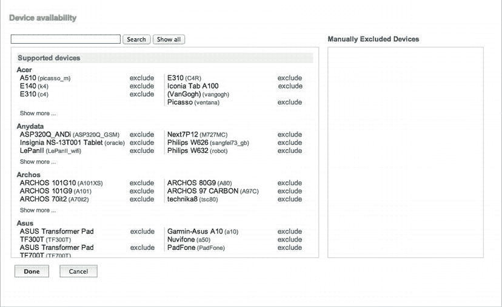

图 15-9。设备可用性

在完成“产品详细信息”选项卡的最后两个部分之前，请切换到“APK 文件”选项卡，阅读以下有关管理 APK 文件的信息。

APK 档案管理

编辑应用屏幕上的第二个选项卡， APK 文件，让您管理您的 APK，并提供一些关于正在应用的设备过滤的附加信息。图 15-10 显示了游戏《抗原:爆发》的 APK 文件标签。

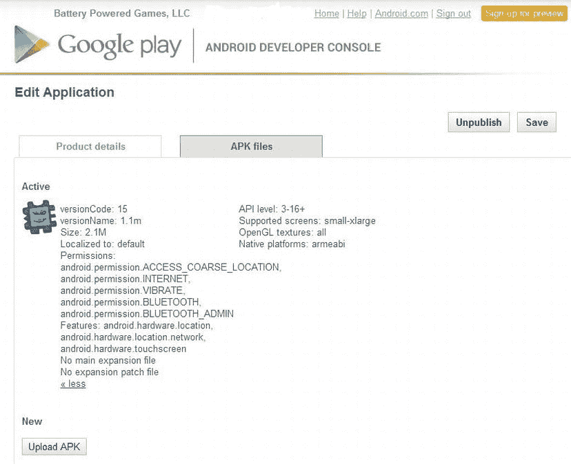

图 15-10。 APK 文件管理

虽然这里只有一个 APK 是活动的，但你可以清楚地看到，通过改变 API 级别、支持的屏幕、OpenGL 纹理以及不同 apk 的原生平台，可以支持多个 apk。这款 APK 支持 API 级别 3–16+，小到超大屏幕，所有 OpenGL 纹理，以及 armeabi)设备。

在点击应用图标下的“更多”后，正如我们已经在图 15-10 中所做的，你可以看到游戏的所有权限和功能。这个游戏需要球场位置、互联网、振动和蓝牙功能，用户在安装游戏之前将会看到这些要求。

在这里添加更多的 APK 就像点击上传 APK 一样简单。升级时，请记住，您只能有一个具有相同功能支持的活动 APK，因此请确保在完成之前停用您的旧 APK。

发布！

回到“产品详细信息”标签，您将指定的最后几件事情是您的联系信息、您对 Android 内容指南的同意(链接在同一页面上——阅读它们),以及确认您的应用符合所有美国出口法律，如果您的游戏是标准的 Android 应用，这是一个安全的赌注。

在提供了所有这些信息之后，是时候点击页面底部巨大的发布按钮，让你的游戏面向全球数百万人开放了！没有审查过程，因此在一两个小时的服务器传播时间后，您的游戏将在 Google Play 商店的所有支持设备上上线。

关于开发人员控制台的更多信息

一旦你的游戏在 Google Play 上发布，你会想要跟踪它的状态。到目前为止有多少人下载了？发生过撞车事故吗？用户在说什么？你可以在 Android 开发者控制台查看所有这些(见图 15-6 )。

对于您发布的每个应用，您可以获得一些信息:

*   您游戏的总体评分和评分数量
*   用户的评论(只需点击相应应用的评论链接)
*   应用安装的次数
*   应用的活动安装数量
*   错误报告

我们对错误报告特别感兴趣。图 15-11 显示了游戏《抗原:爆发》收到的错误报告。

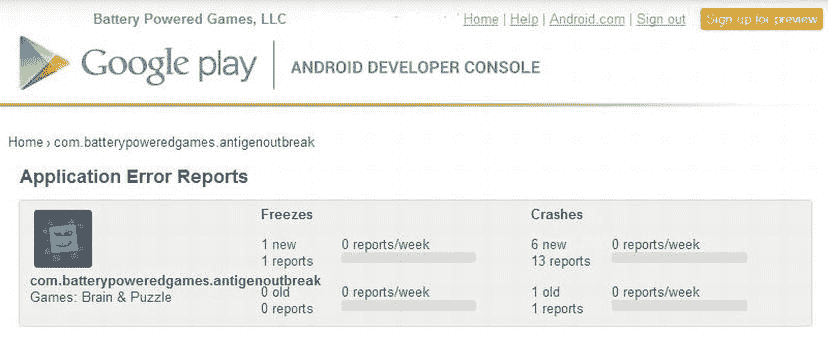

图 15-11。错误报告概述

总共有一次冻结和七次崩溃。抗原:Outbreak 上市一年多了，那还不错。当然，您可以进一步深入到具体的错误。开发人员控制台的错误报告功能将为您提供关于崩溃和冻结的详细信息，例如发生问题的设备型号、完整的堆栈跟踪等等。当你试图找出你的应用到底出了什么问题时，这可能会有很大的帮助。对市场的评论不会比一般的问题识别有更多的帮助。

**注意**错误报告是一项设备端功能，旧版 Android 不支持。如前所述，如果你想完全确信你已经发现了所有问题，我们建议你去看看 ACRA。

摘要

在 Google Play 上发布你的游戏轻而易举，而且准入门槛非常低。你现在已经掌握了在 Android 上设计、实现和发布你的第一个游戏的所有必要知识。愿原力与你同在！