# 一、为 Java 开发设置 Android 3.0

这本书教你为 Android 3.0 平板电脑创建自己的游戏。在阅读并完成其示例后，您将对许多新型平板电脑的传感器、触摸屏、网络功能和处理能力有所了解。这听起来令人生畏吗？它不是。不用去做开发定位商店或赠送优惠券的乏味的企业应用的苦差事，你将知道如何制作有趣和吸引人的游戏。如果你过去做过一些游戏开发，你可能会惊喜地发现，与传统的 PC 和主机游戏开发相比，Android 系统让这个过程变得如此简单。

虽然没有任何一本书可以让你从新手变成游戏编程大师，但本书中介绍的基础知识可以让你将 2D 游戏中的任何想法变成现实。这本书使编程尽可能简单，以便专注于游戏开发中更具创造性的方面。

### 安卓是什么？

Android 非常特别，当你开始编程时，你会对它更加欣赏。许多手机制造商开发运行 Android 操作系统的平板电脑的运动为你将要制作的游戏创造了一个巨大的市场。这一节给你一个 Android 的功能和历史的纲要。

#### Android 的开端

2003 年，Android 作为一家硅谷的小型创业公司成立，旨在为智能手机创造一个更具互动性和更有帮助的界面。谷歌在 2005 年迅速收购了该公司，作为其进军手机市场的一部分。在谷歌收购它之后，第一个 Android 操作系统很快在 2007 年发布。在随后的几年里，Android 经历了多次修改(超过七次重大变化)，使其成为智能手机的主要操作系统之一，有人说 Android 拥有近 50%的移动设备。

Android 的修订对于理解开发如何工作非常重要。谷歌努力确保其 Android 版本的向后兼容性；然而，应用通常被设计为适用于选定的几个 Android 版本，以保证最佳的性能和用户体验。名为 Froyo 的版本仍然是最受开发者欢迎的，但随着平板电脑等更现代的设备需要更强大的操作系统，后来的版本也越来越受欢迎。

下面的 Android 版本列表，以及它们当前的市场份额，说明了哪些版本仍然受欢迎，因此是开发者感兴趣的。谷歌给每个版本起的创意名就在版号旁边。开发者经常使用这些名字，而不仅仅是数字。请记住，除了 Android 3.0，所有版本的操作系统都是专为手机设计的:

> *   1.5 Android cupcakes (2.3%)
> *   Android 1.6 donuts (3.0%)
> *   是阿云 2.1 闪电(24.5%)
> *   Android 2.2 Froyo (65.9%)
> *   Android 2.3 gingerbread (1.0%)
> *   Android 2.3 gingerbread (3.0%)
> *   Android 3.0 Honeycomb (0.3%)

如果您有兴趣查看各种版本的当前市场份额，请前往`[`developer.android.com/resources/dashboard/platform-versions.html`](http://developer.android.com/resources/dashboard/platform-versions.html)`。

在检查了这个列表后，许多人会说你应该为 Froyo 制作游戏，因为它在市场份额上比其他版本领先很多。Froyo 流行的原因是它安装在许多更简单的旧手机上，这些手机只能通过复杂的过程获得更新版本。随着新版本占据中心舞台，这些设备将慢慢变得无关紧要。某种程度上，为广大用户做游戏是有意义的；然而，每天都有新用户购买使用最新版本的更现代的手机。此外，也许最重要的一点是，成千上万的应用可以在 Froyo 版本上玩，而且越来越难脱颖而出。

也就是说，这本书教你为最新版(蜂巢)设计游戏有两个原因。首先，Honeycomb 是唯一针对平板电脑优化的版本，比任何智能手机都更具沉浸感和乐趣。其次，随着越来越多的公司发布可以与苹果 iPad 竞争的平板电脑，Android 平板电脑正在以巨大的速度增长。随着 webOS 的失败，Android 和 iOS 是平板电脑市场唯一的竞争者。微软也推出了自己的操作系统，但还没有获得很大的市场份额。谷歌经常被引用的关于每天有 50 万台 Android 设备注册的声明让你感受到这个市场扩张的速度有多快。

#### 安卓 3.0 的特性

Honeycomb 相对于之前的 Android 版本是一个巨大的进步。Android 3.0 旨在利用更大的屏幕和更强大的处理器，让开发人员扩展他们通常适度的智能手机游戏。许多新功能都是用户界面的变化，使用户可以通过比智能手机屏幕大几倍的屏幕访问桌面。例如，典型的手机有两到三英寸的屏幕，而平板电脑拥有令人印象深刻的九到十英寸的屏幕。这些更新很方便；然而，游戏开发商更关注更新更快的图形渲染和操作系统的新传感器和网络能力。

并非所有游戏都使用所有这些功能，但在设计独特的游戏时，考虑它们的重要性是至关重要的。更大的屏幕本身就是一个值得注意的更新。高分辨率屏幕需要可缩放且视觉上吸引人的艺术品。很多安卓平板都登陆了 1280 × 800 作为屏幕尺寸。这与许多计算机屏幕仍在使用的分辨率相当。在这种情况下，图形必须接近计算机游戏中使用的图像。

表 1-1 列出了游戏开发者特别感兴趣的 Android 3.0 的主要变化。

在整本书中，我给出了如何充分利用 Android 平板电脑新功能的建议。如果你想把自己制作游戏作为一种爱好，那么请留意我的笔记，看看哪里可以免费获得高质量的声音和图像。我为我的游戏制作音乐和图形的工具也将在第二章中详细解释。

我希望在熟悉 Android 之后，你已经准备好开始使用了。不过，请仔细阅读下一部分，以确保你拥有为 Android 开发游戏的适当技能和硬件。

### 制作安卓游戏需要什么

那么，如何才能成为一名 Android 游戏开发者呢？让我们来看看你需要从本书中获得最多的技能，以及你需要通过它的例子来工作的系统。

#### 你需要知道的事情

安卓游戏编程有多难？这真的取决于你对 Java 和 Android 操作系统的经验。如果你有扎实的 Java 知识，那么这本书对你来说再合适不过了。如果你以前为 Android 写过代码，那么你可能不会被这里的任何代码所挑战，你可以自由地享受你的体验。在继续之前，请仔细阅读这一部分，这样您就能确切地知道您需要什么。

一般来说，有兴趣学习在安卓系统中为平板电脑创建游戏的人来自三种不同的背景。每一个背景都为你准备了本书中的例子，但是它们都需要一个稍微不同的方法。

如果你既懂 Java 又懂 Android，你就可以开始了。这里的代码类似于您以前看到的，但是它侧重于图形、游戏循环和对用户输入的快速响应，这些您可能没有处理过。不管你做过什么，这本书帮助你掌握平板电脑游戏的创作。

也许你对 Java 很熟悉，但是你从来没有用过 Android。这很好。阅读示例和代码不会有太大的困难。请记住，对于任何新的环境和 API，您都应该定期查找提供的函数和类。熟悉 Android 需要时间，但努力是值得的。

你可能从来没有用 Java 编写过一个`if`语句，更不用说用 Android 了。如果是这样的话，你还是可以用这本书，但是你得弄一本 Java 入门。我强烈推荐杰夫·弗里森(Apress，2010)的《学习 Android 开发的 Java》。当你有了 Java 的参考资料，熟悉 Java 的工作原理，然后直接进入本文。你在学习过程中学习语言。

理解 XML 是有益的；然而，XML 相对容易理解，您应该可以轻松掌握本书中对它的基本用法。资质不在话下，是时候考虑游戏创作使用的环境了。

#### 您需要什么样的平台

是时候动手了，看看开发 Android 游戏到底需要什么。幸运的是，你不应该买任何软件！唯一的费用是当你准备把你的游戏放到安卓市场时，要交 25 美元的注册费。首先，检查以确保您的计算机支持 Android 开发:

> *   Windows XP (32 bit), Vista (32 bit or 64 bit) or Windows 7 (32 bit or 64 bit)
> *   Mac x 10.5.8 or later (x86 only)
> *   Linux(在 Ubuntu Linux、Lucid Lynx 上测试)

这个列表是根据 Android 自己的系统需求编制的。查看`[`developer.android.com/sdk/requirements.html`](http://developer.android.com/sdk/requirements.html)`了解最低系统标准的最新变化。

虽然满足最低要求的系统可以让你创建 Android 应用，但是测试你的程序可能会相当慢。一般来说，如果你能在电脑上玩现代电子游戏，那你应该没问题。但是，如果你有更慢的机器，不要绝望；你完全有能力编写 Android 游戏，但你应该在 Android 平板电脑上测试它们，而不是在电脑上的模拟器上。

你不需要一台 Android 平板电脑来完成本书中的任何练习或程序，但在真实设备上测试你的创作是无可替代的。随着市场上平板电脑供过于求，更便宜的型号会让你花费大约 500 到 700 美元。如果你像我一样发现游戏编程令人上瘾，那么这些投资是非常值得的。摩托罗拉和三星生产一些最受欢迎的平板电脑；寻找他们的产品，以了解 Android 平板电脑方面的顶级产品。

如果你对自己的技能很有信心，并且已经决定在哪台机器上投入游戏开发，那么你已经准备好获得工具并配置你的开发环境了。

### 设置您的 Android 平板电脑编程环境

您就要进入有趣的部分了，但首先您必须确保您的计算机设置正确。您必须为您的工作下载并安装三个软件包:

> *   Java development kit (JDK)
> *   Eclipse, also known as Integrated Development Environment (IDE)
> *   Android Java SDK

如果您是 Java 开发人员，那么您可能有最新版本的 JDK，甚至可能安装了 Eclipse。在这种情况下，请跳到以下说明的 Android SDK 部分。如果您遇到问题，请仔细阅读前两节，因为您可能使用了错误的 JDK 或 Eclipse 版本。

在接下来的几节中，您将逐步安装这些软件包。完成后，您就可以创建您的第一个 Android 平板电脑程序了。在你准备好出发之前，整个过程不会超过 20 分钟。

#### 安装 Java JDK

第一步是为您的机器下载并安装最新版本的 JDK。以下是如何:

> 1.  To find the JDK required by your system, please go to `[www.oracle.com/technetwork/java/javase/downloads/index.html](http://www.oracle.com/technetwork/java/javase/downloads/index.html)`. You need JDK to allow you to use Java language on your computer. Find the big Java icon in the upper left corner of the page and select the JDK link, as shown in in Figure 1-1\. This link will take you to the JDK SE download page.  
> 2.  在 Java SE 下载页面的下载选项卡上，如图图 1-2 所示，接受许可协议，选择适合您操作系统的软件包，点击链接下载。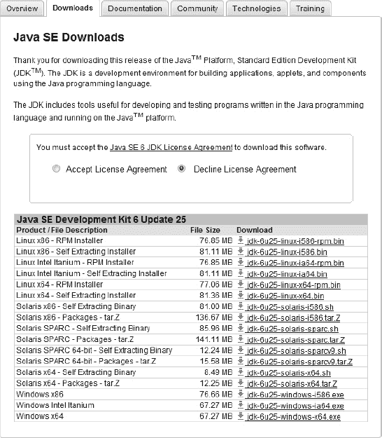
>     
>     ***图 1-2。**许可协议和爪哇版本选择*
>     
>     
> 3.  After the file is downloaded, run the installer. On some computers, the installer will start automatically. If this doesn't happen, please find the folder where you downloaded the files and sort the folders by the modification date. The last file is this installer. Double-click it, and you can start.
> 4.  A welcome dialog box of Java wizard installation appears, as shown in figure and figure 1-3 . Click the next button and follow the wizard prompts to complete the installation.

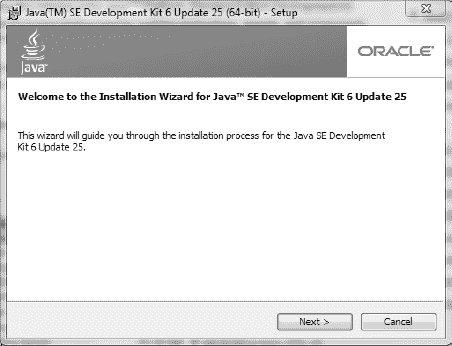

***图 1-3。** JDK 安装向导*

现在您已经准备好设置 Eclipse，这是您在本书中用来构建游戏的开发环境。如果没有 Eclipse，您将被迫使用命令行编译代码。开发环境为您节省了大量时间。

#### 安装 Eclipse IDE

安装 JDK 后，您现在可以设置您的开发人员环境。您将使用 Eclipse，这是一个免费的软件包，为 Java 和 Android 开发人员提供了很多强大的支持。请遵循以下步骤:

> 1.  To find the Eclipse package for your system, please go to `[www.eclipse.org/downloads/](http://www.eclipse.org/downloads/)`. On the Eclipse download page, as shown in in Figure 1-4, use the small drop-down menu to match your operating system. Then select Eclipse IDE for Java Developers and click the link of the required version of the operating system. You will be taken to a download page.  
> 2.  Download the compressed folder containing the selected version and unzip it. Click Install executable file. During the installation process, make sure that you select the check box to create Eclipse shortcuts on your desktop, so that we can access Eclipse conveniently in the future.
> 3.  After installation, you can start Eclipse by shortcut. You should see something similar to Figure 1-5 . This means that everything is working.

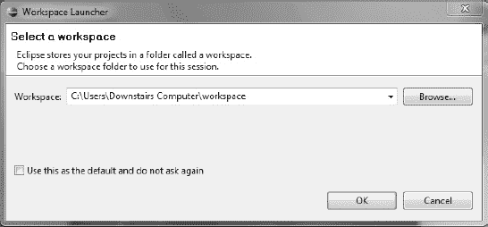

***图 1-5。**Eclipse 开始了*

安装好开发平台后，您就可以添加 Android SDK 了，它为您提供了构建游戏所需的库和工具。到目前为止，您只研究了基础知识，包括 Java 语言和开发环境。

#### 安装 Android SDK

您的平台需要的最后一个软件包是 Google 的 Android SDK:

> 1.  要找到您的系统需要的软件包，进入`[`developer.android.com/sdk/index.html`](http://developer.android.com/sdk/index.html)`，如图图 1-6 所示，点击链接选择为您的操作系统制作的 Android SDK 软件包。完成后，相应的文件开始下载。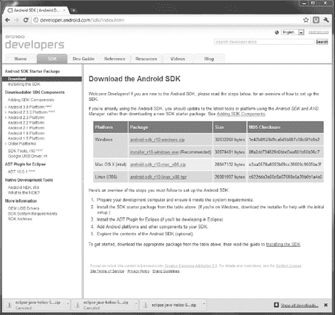
>     
>     *图 1-6。 Android SDK 下载页面*
>     
>     
> 2.  下载完文件夹或安装程序后，找到文件双击运行。出现 Android SDK 工具安装向导的欢迎页面，如图 1-7 所示。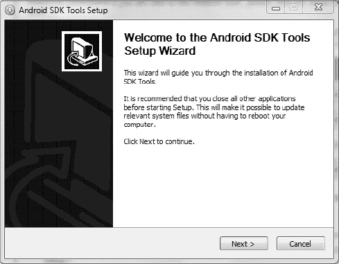
>     
>     *图 1-7。 Android SDK 安装向导*
>     
>     
>     
>      **注意**记住你安装软件开发工具包(Software Development Kit)的位置。我更喜欢用`C:\Android\android_sdk\`.无论您使用的是哪种操作系统,请记下它的安装位置。当我们将它连接到黯然失色时,我们将在接下来的步骤中需要它的位置
>     
>     
> 3.  点击下一步按钮，按照向导的提示安装 SDK。最终，你看到了最后一页。应选中启动 SDK 管理器复选框，如图图 1-8 所示。这将导致 SDK 管理器在安装完成后立即启动。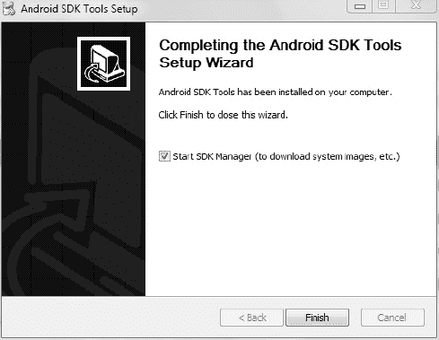
>     
>     ***图 1-8。** Android SDK 工具安装向导结束*
>     
>     
> 4.  当 Android SDK 和 AVD 管理器对话框打开后，如图图 1-9 所示，点击左侧导航面板中的可用软件包链接，然后点击安装选定的按钮。这一步接受并安装 Google 推荐的游戏默认 Android 包。如果不安装这些，您将无法使用一些工具和示例应用。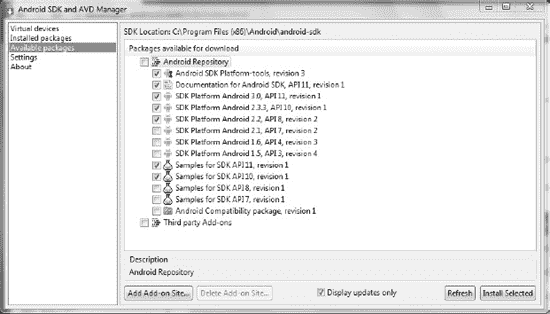
>     
>     *图 1-9。 Android SDK 管理器。请注意所选的默认包点击安装选定项时，会出现如图 1-10 所示的对话框，显示安装进度(这可能需要几分钟)。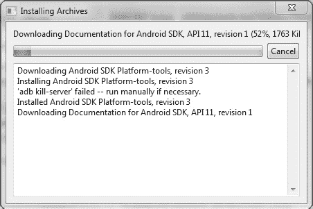*
>     
>     
>     
>     ***图 1-10。**包和档案的安装*

现在你有了 Java 语言、开发环境和 Android 工具。剩下的唯一步骤是将所有这些部分集成在一起。

#### 向 Eclipse 添加 Android 工具和虚拟设备

你要做的最后一项工作是让 Eclipse 与新的 Android 工具和程序相适应。这样做可以让您将代码输入到 Eclipse 中，然后从 Eclipse 本身进行测试。否则，你必须保存你的代码，并使用不同的程序来测试应用。请遵循以下步骤:

> 1.  要用将要使用的 Android 工具安装你的 Eclipse，打开 Eclipse 并选择帮助安装新软件。出现 Eclipse 安装对话框，如图图 1-11 所示。每次需要向 Eclipse 添加更多功能时，都要返回到这个安装对话框。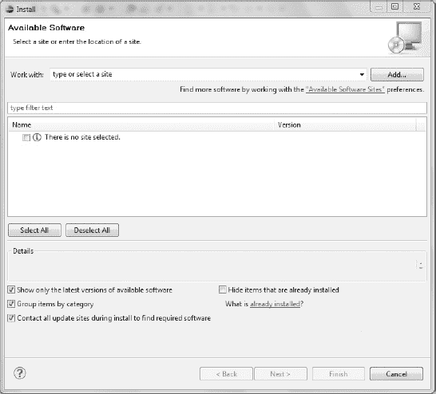
>     
>     ***图【月食】1-11 日的安装对话框.***
>     
>     
> 2.  你首先需要让 Eclipse 知道在哪里寻找你想要添加的工具。在安装屏幕上，单击右上角的添加按钮。添加存储库对话框打开，如图图 1-12 所示。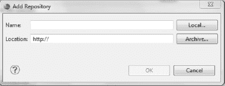
>     
>     ***图 1-12。**用于向黯然失色添加机器人工具的名称和位置框*
>     
>     
> 3.  Do the following:
>     1.  In the name box, type **Android tools** , which is the name of the tool you will use to refer to this step.
>     2.  For location, enter the URL **`[`dl-ssl.google.com/android/eclipse/`](https://dl-ssl.google.com/android/eclipse/)`** , which is the location of the tool you are adding.
> 4.  完成后，点击确定按钮，返回到图 1-13 所示的安装对话框。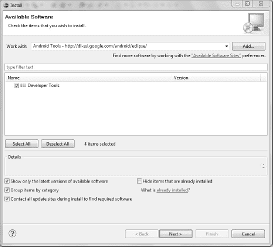
>     
>     ***图 1-13。**开发者工具软件*
>     
>     
> 5.  Select the developer tools check box and follow the prompts to install the update. Doing so can increase the tools needed for Android tablet development. Restart Eclipse when prompted by the dialog box.
> 6.  在 Eclipse 中，选择窗口首选项。打开侧窗格上的 Android 选项卡。你的屏幕应该看起来像图 1-14 。您将把 Eclipse 指向您的 Android SDK 的安装。这允许您在 Eclipse 中编译程序。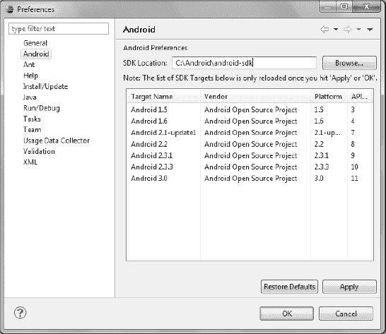
>     
>     ***图 1-14。**月食中机器人的配置选项在 SDK 位置字段中输入你下载 Android SDK 的准确位置名称。我的例子使用了`C:\Android\Android-sdk`。*

应用这些更改后，您就完成了设置过程！

从现在开始，你要专注于实际的 Android 应用的结构，以及如何实现你对游戏的愿景。这种背景使你很容易在游戏中尝试各种不同的工具和技术。能够快速地改变你的代码并看到你努力的结果，在你的努力中是无价的。

### 测试你的工具

到目前为止，你可能正在急切地期待一些有形的 Android 游戏。这一节讲述了如何使用你已经安装的工具来使用 Android 内置的示例程序库。它还介绍了设计应用外观的基础知识。未来的章节将对这些项目进行扩展，以制作一个全功能的游戏。

你的每一款 Android 游戏都将被开发成一个 Eclipse 项目，在一个位置保存所有的图像、声音和代码。随着您的深入，您将对 Eclipse 有更好的理解。了解资源的存储以及如何在这种环境中访问文件是您需要掌握的一项关键技能。

即使对于最高级的程序员来说，示例程序也是一个极好的资源。你编写的任何游戏所需要的大部分基本功能已经在这些程序中的一个或多个中实现了，而且很可能是免费的。网上粗略看一下，可以为你以后节省几十个小时的工作时间。可悲的是，大多数应用都是为旧版本的 Android 编写的，因此它们在大型平板电脑屏幕上显得非常小。作为补偿，您可以将他们的一些代码合并到您的项目中，但自己处理图形。

在本节的其余部分，您将逐步了解为平板电脑创建 Android 游戏的步骤。至少从头开始一次是很重要的，这样你才能看到一个游戏最基本的框架。首先用 Eclipse 创建第一个 Android 项目。

#### 创建 Android 项目

构建任何 Android 游戏的第一步是创建一个 Eclipse 项目:

> 1.  在 Eclipse 中，选择文件新建项目，选择 Android 文件夹下的 Android 项目，进入新建 Android 项目界面，如图图 1-15 所示。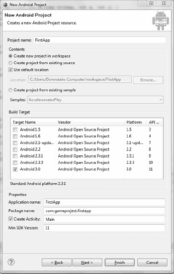
>     
>     *图 1-15。填写好的新机器人项目表*
>     
>     
> 2.  Fill in the missing information:
>     1.  Type the name **firstapp** or any project name you want.
>     2.  Keep the default values of other parts unchanged until you reach the construction target part. Here, you can decide which version of Android you want your application to be suitable for. Choose Android 3.0 because you want your application to run on the latest tablet. When you test your game, this name becomes crucial, and you want to make sure that it works well on the analog tablet, not on the small screen of the mobile phone.
>     3.  应用名称一般与项目名称相同。重新键入 **FirstApp** 或您为项目使用的名称。Java 开发人员对 Package Name 字段很熟悉，但是如果您不熟悉它，可能会感到困惑。这里你声明名字为 **`com.gameproject.firstapp`** 。
>         
>         包是爪哇组织代码的一种方式,使得使用以前编写的文件变得容易。你可以在`[`java.sun.com/docs/books/jls/third_edition/html/packages.html`](http://java.sun.com/docs/books/jls/third_edition/html/packages.html)`阅读更多关于爪哇包的内容,但是这对你来说并不重要。当您准备好稍后与世界分享您的应用时,您可以再次访问此页面.将
>         
>         
>     4.  写成 **Main** 作为你希望项目创建的活动。
>         
>         活动对于机器人程序来说是必不可少的,稍后我会更深入地讨论它们。现在,把这个活动看作是应用的主要功能。它被调用来设置游戏,然后通过处理输入和指导精灵的移动来运行游戏。活动应该根据它们的角色来命名,所以最初的活动通常被称为主要、主要活动或类似的名称.
>         
>         
>     5.  用编号 **11** 填写 Min SDK 版本字段。这意味着 Android 要求设备运行 Android 版本 11 才能正常运行你的游戏。
>         
>         你可能很好奇为什么我会突然跳到数字 11,当我之前谈到安卓 3.0 是最新的更新时。嗯，安卓有一个疯狂的版本命名系统。3.0 级指的是平台版本,它遵循正常的软件惯例,小的更新增加十分之一位,大的修订得到一个新的数字。为了保持一致，安卓为每个平台版本关联了一个代码安卓 3.0。被分配了 11,而安卓 2.3.3 得到了 10。因为您的项目是为最新版本的机器人设计的,所以您键入 **11** 作为最低软件开发工具包(Software Development Kit)版本
>         
>         
> 3.  Figure 1-15 shows a completed new Android project form. Check your name to make sure it is the same, because the remaining code and examples use the name provided in this walkthrough. When you're done, click Finish. You will see a blank Eclipse screen with a project folder on the far left.

现在让我们看看 Eclipse 创建的文件和代码。

#### 探索 Eclipse 中的 Android 项目

要查看项目创建了哪些文件，请展开`FirstApp`文件夹。然后进一步将`src`扩展到`com.gameproject.firstapp`到`Main.java`。双击`Main.java`在 Eclipse 编辑器中显示文件(中间的大查看窗格)。这是你游戏的核心；然而，目前它是一个基本的骨架。您看到的代码应该类似于清单 1-1 中的代码。

***清单 1-1。**??`Main.java`*

`package com.gameproject.firstapp;

import android.app.Activity;
import android.os.Bundle;

public class Main extends Activity {
    /** Called when the activity is first created. */
    @Override
    public void onCreate(Bundle savedInstanceState) {
        super.onCreate(savedInstanceState);
        setContentView(R.layout.main);
    }
}`

清单 1-1 中的代码创建了一个新的类，然后让这个类更新用户看到的视图。前三行定义包，然后导入应用需要使用的类。注意，这两个导入都引用了属于 Android SDK 的类。当你制作更多的功能游戏时，你将导入许多其他的类，让你执行各种各样的动作。

让我们一行一行地仔细看看清单中的代码:

`package com.gameproject.firstapp`

> 这个简单的介绍指定这个文件是`firstapp`包的一部分。包是 Java 对同一程序的文件进行分组的方式。

`import android.app.Activity;
import android.os.Bundle;`

> Import 语句向项目中添加功能。实际上，这些是您想要使用的其他包。`Activity`包括处理应用运行的方法。`Bundle`是为您的应用存储信息的一种特定方式。

`public class Main extends Activity`

> 这里，类`Main`被赋予了 Android 类`Activity`拥有的所有函数和变量。每当一个类扩展另一个类时，新的类继承或接收对其他类的所有功能的访问。

`public void onCreate(Bundle savedInstanceState)`

> 这里定义的函数实际上来自于`Activity`类。它处理应用启动时必须完成的所有过程。`Bundle`参数`savedInstanceState`保存应用的先前状态。第一次启动 app 的时候是`null`。

`super.onCreate(savedInstanceState);`

> 调用`Activity`类的`onCreate`方法。这将导致程序启动应用。注意函数前面的关键字`super`。`super`关键字意味着程序正在从 Android SDK 调用原来的`onCreate`方法，而不是您之前在代码行中创建的新的`onCreate`方法。

`SetContentView(R.layout.main);`

> 最后，应用通过将 Android 屏幕设置为一个 XML 文件来执行第一个真正的任务。`R`是表示*资源*的标识符，`layout`指定资源的类型，`main`表示文件的名称。很快您就可以编辑`main.xml`文件来改变程序的外观。

是时候运行这个程序了，看看它能做什么。不过，在此之前，您必须创建一个虚拟的 Android 设备来测试它。如果你有一台运行 Android 3.0 的 Android 平板电脑，你可以直接在上面测试程序。要了解如何做到这一点，请前往附录 A 。

#### 创建虚拟 Android 设备

在 Eclipse 中，创建自己的虚拟设备是一个非常简单的过程:

> 1.  On the Eclipse main menu bar, select windows Android SDK and AVD manager. An Android SDK and AVD manager screen similar to that shown in Figure 1-8 opens.
> 2.  因为您没有列出任何设备，点击左上角的新建按钮。弹出一个创建新的 Android 虚拟设备(AVD)对话框，让你定义新的模拟器，如图图 1-16 所示。完成表格如下:
>     1.  The device name doesn't matter; I chose the original name **tablet _ device** .
>     2.  Your target Android version is Android 3.0.
>     3.  For most applications, you don't need to worry about the size of SD card. However, if your game requires you to store high scores or other data on the device, please specify the size of the onboard data storage.
>     4.  And the skin and hardware parts do not need to be changed. However, it is worth noting the hardware specifications. When you make graphics for games, you should definitely use the LCD density of 160 (which is quite standard) to determine the resolution of your images. Compared with many tablet computers, the device RAM size of the simulator is actually quite low. However, the simulator cannot accurately represent the capabilities of RAM or processor. In order to truly show how your game will work, you must try it on a real device.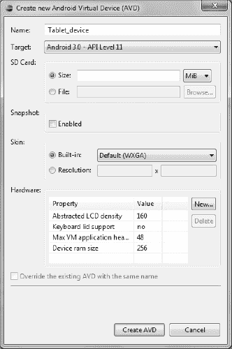
>     
>     *图 1-16。创建机器人虚拟设备(AVD)*
>     
>     
> 3.  Click the Create AVD button, and you can run your application.

如果你期待一个模拟器出现，你会失望的；新的虚拟设备仅在您运行应用时启动。下一部分启动设备。

#### 运行应用

按照以下快速步骤运行应用:

> 1.  In the center of the toolbar near the top of the Eclipse screen is a green play button. Click it, and your program will open a big black screen. This is your new simulator. After a while, when it is loaded, the word *Android* will be displayed on the screen. Then, with the completion of loading, the word *Android* with larger font scrolls upwards.
> 2.  When the loading screen is finished, move the small round knob to the right. If you wait long enough, the application may start automatically. In this case, the word *hello world, Main!* appears. If not, please continue to the next step. There is a Google search bar in the upper left corner of the main screen and several buttons at the bottom. Real devices use touch gestures to select applications, but the simulator lets you use the mouse cursor. To run your own program, click the application icon in the upper right corner of the screen.
> 3.  A list of all programs on the device appears. Your application uses the universal Android robot as its icon; The application name (FirstApp) appears below the icon. Click on it, and the screen will soon display Hello World, Main!

尽管可能很简单，但您已经启动了您的第一个 Android 应用。当你陶醉其中时，点击左下角指向屏幕左侧的箭头。你回到了桌面家庭。现在尝试模拟器中的其他一些应用。您可能会惊讶地发现，浏览器、电子邮件和其他程序的功能与您预期的完全一样。

AVD 与真实的东西非常相似，甚至允许你测试传感器和 GPS 数据。要测试这个模拟器的速度，你可以制作你自己的令人难以置信的应用。请看下一节，了解如何处理代码。

#### 对应用进行首次更改

尽管从技术上来说，你确实创建了自己的应用，但除了自动创建的应用之外，你并不需要操作代码。现在是时候改变程序的文本了:

> 在
> 
> `Res`
> 
> 2.  Open the `values` folder. You should find a file (strings.xml) there; Double-click it to display it in the viewing pane.
> 3.  List two string resources. One is the application name, and the other is called `hello`. Click `hello` to change the value to any string you want.
> 4.  Save your changes and rerun the program. When you open the FirstApp, you should see that you have changed the text on the screen.

要理解这是如何工作的，你需要知道*资源*的重要 Android 主题。您刚刚编辑的`strings.xml`文件是一个资源。大的`Res`文件夹中的每个文件也是如此。

如果你还记得`main.java`文件，我在代码中提到了一个资源文件:`main.xml`，在布局部分。您需要对此文件进行一些更改:

5.要查看文件，请展开`layout`文件夹并双击`main.xml`。出现一个 WYSIWYG 编辑器，在右上角有一个小屏幕和您创建的字符串。

6.不幸的是，屏幕是为手机设计的。您可以使用顶部带有 2.7 英寸 QVGA 的菜单快速更改这一点。向下滚动列表，直到到达 10.1 WXGA。这就使得屏幕布局十寸多一点，对于平板电脑来说很正常。

7 .。使用编辑器更新布局非常容易。左侧的窗格已经有几个不同的项目可以拖到应用上。试着在你写的文字下面放一个按钮。

8.尽管 WYSIWYG 编辑器很方便，但对于制作游戏来说并不是非常有用。您需要进入图像背后的实际文件。要查看这一点，点击`main.xml`(靠近屏幕底部，图形布局旁边)。

清单 1-2 显示了你在布局中添加一个按钮后应该看到的代码。

***清单 1-2。**??`Main.xml`*

`<?xml version="1.0" encoding="utf-8"?>
<LinearLayout xmlns:android="http://schemas.android.com/apk/res/android"
    android:orientation="vertical"
    android:layout_width="fill_parent"
    android:layout_height="fill_parent"
    android:id="@+id/Button">
<TextView  
    android:layout_width="fill_parent"
    android:layout_height="wrap_content"
    android:text="@string/hello"
    />
<Button android:text="Button"
        android:id="@+id/button1"
        android:layout_width="wrap_content"
        android:layout_height="wrap_content">
        </Button>
</LinearLayout>`

如果您不熟悉 XML，那么这可能看起来像希腊语，但实际上非常容易理解。第一行声明了您正在使用的 XML 类型。下一节创建一个特殊的布局类型，称为`LinearLayout`。其中，简单的指令告诉设备如何定位应用，以及它相对于整个设备屏幕的大小。接下来，一个`TextView`对象被创建为`fill_parent`(扩展以适合整个空间)，然后被定义为`wrap_content`，这将视图限制为仅需要的数量。

最后，通过调用名为`hello`的字符串资源将文本插入到屏幕中。这是您已经编辑过的`hello`字符串。

下一部分是您拖到应用上的`Button`信息。重要的是要记住，XML 布局并不创造功能，而仅仅是程序的外观。例如，点击你的按钮不会做任何事情，除非你专门设计了一个响应程序。

### 总结

这一章在让你的开发环境启动和运行方面肯定涵盖了很多内容。您讲述了 Android 背后的概念以及如何创建游戏。在接下来的章节中，你将会彻底地检查布局以及如何为游戏创建一个吸引人的背景。然后你创建精灵，并开始通过在屏幕上移动玩家来给你的应用添加一些味道。后面的章节添加用户输入、声音和人工智能来完成你的创作。