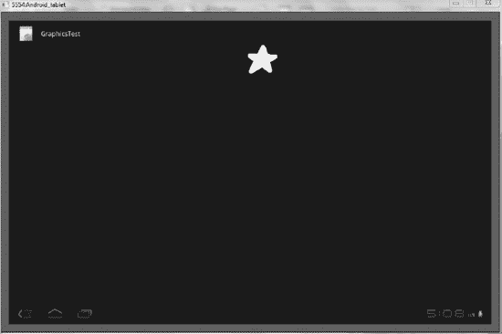
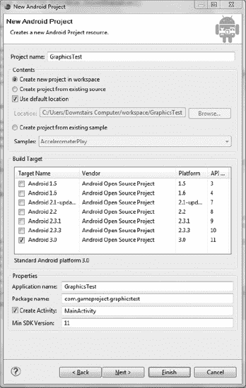
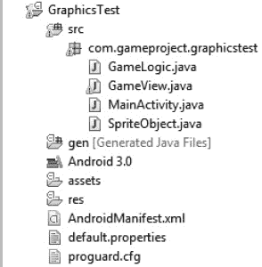

# 二、使用精灵和动作创造简单的游戏

祝贺您，您已经成功地设置了您的开发环境，并准备好继续进行更具创造性的游戏开发活动。当你想到你最喜欢的游戏时，你可以马上想象出它的样子，无论是怪物向你跑来还是汽车在赛道上跑来跑去。在本章中，您将为平板电脑屏幕注入活力。市场上有成千上万的游戏，你的游戏的外观和感觉可以决定它有多成功。

本章介绍在平板电脑屏幕上显示图像，然后移动图像的基础知识。你了解了*精灵*的概念。为了本章的目的，精灵是任何在游戏中可以移动的游戏物体。游戏中的主角或敌人通常是精灵，但游戏的背景却不是。

这一章的内容进展相当快，引入了许多新概念。

### 处理图像

精灵是游戏的基础，在你创建游戏之前，你需要能够在屏幕上画出它的卡片、角色和其他物体。在本节中，您将学习 Android 3.0 图形显示的基本组件。我们还将计算出精灵的组成部分，并在屏幕上移动我们的图像。这将成为我们未来项目的基础。看看图 2-1 看看我们的游戏会是什么样子。这个启动精灵实际上是来回跳动的。

***图 2-1。**完成的图形程序。*

 **注**如果你迷路了，从与这本书相连的谷歌代码项目中复制代码。然后回到课程中，你将能够通过操作它的某些方面来理解程序是如何工作的。

#### 创建图像显示表面

要开始，您需要打开一个新的 Eclipse 项目。在上一章中，您在 Eclipse 中创建了一个名为 FirstApp 的新项目。那个代码对你来说已经没用了。从一个全新的项目开始:

> 1.  Select File New Project Android Project from the Eclipse main menu.
> 
> 
> 
> ***图 2-2。**图形测试的项目创建窗口..*
> 
> 4.  Your app name is GraphicsTest. Make sure that the completed form looks like in Figure 2-2\. Getting used to creating new projects in Eclipse is very important, because if something goes wrong, this is usually the easiest way to start from scratch.
> 5.  When the form is finished, click Finish. If you need help filling in other fields, please refer to Chapter 1.

在平板电脑上显示图像之前，您需要一个画布来渲染图像。您在程序主例程中构建曲面。请遵循以下步骤:

> 第一个项目中的文件可能仍在您的主编辑面板中打开。通过右键单击文件选项卡旁边的并选择全部关闭来关闭它们。这不会删除代码，而是关闭显示代码的编辑屏幕。*   在 Eclipse Package Explorer(位于屏幕左侧)中打开 GraphicsTest 项目的文件树。您想检查 Java 代码，所以打开`src`文件夹，然后继续展开，直到看到`MainActivity.java`。图 2-3 显示了文件的位置。
>     
>     ***图 2-3。**用于图形测试的包资源管理器*
>     
>     *   Open `MainActivity.java` in the editing pane, and you will see the general code generated in the first chapter. In the first chapter, you use a Java code file and an XML file to handle the layout. Unfortunately, a game with a lot of movements and graphic changes can't be easily built in XML. Therefore, you need a Java file to run the graphics of the game.*   To this end, right-click `com.gameproject.graphicstest` in GraphicsTest Package Explorer to create a new class. Select a new category. A dialog box opens , asking how you want your new class to be named. Type **game view** , and pay attention to keep the default values of all other fields. When you are finished, you will find two files (`MainActivity` and `GameView`) in your `src` directory.*   Open the `GameView.java` file in the viewing pane. You should find the code in Listing 2-1 there.

***清单 2-1。**??`GameView.java`*

`package com.gameproject.graphicstest;

public class GameView {

}`

您可以添加到这个原始源代码中，将图像文件绘制到屏幕上。但是，在开始之前，您必须了解 Android 中视图和显示的基础知识。

##### Android 视图类是如何工作的

到目前为止，您只在项目中使用了两个 Android 类:`Activity`和`Bundle`。活动包含处理应用的创建、运行和关闭的功能。它们是任何安卓游戏的命脉。`Bundle`类仅仅是保存程序当前状态的一种方法。

然而，现在你看看`View`类。应用运行时，视图处理屏幕的图形和外观。你所有的游戏都将创建一个类来扩展`View`类并给你这个功能。通常，你的`View`类中的代码比`Activity`类中的多得多，因为游戏的大部分内容都是操纵屏幕上的对象。

所有函数类必须有两个不同的部分。第一个是构造函数方法。像任何类一样，当您创建它的实例时，您需要调用一个函数来定义对象的各个方面。在`View`类中，你可以加载你的图像并决定所有精灵的起始位置。

`View`类的下一个关键部分是将图像呈现到屏幕上的方法。每次移动图像时都会调用这个函数，因为图像必须在新的位置重新绘制。

尽管这是一种抽象的查看类的方式，但它有助于您理解代码。然而，在深入研究之前，让我们来看看实际获取一个文件并将其显示在屏幕上的机制。

 **提示**如果你对`View`类或任何其他 Android 类感到好奇，访问`[`developer.android.com/reference/packages.html`](http://developer.android.com/reference/packages.html)`并找到你正在寻找的包。在这里，Android 提供了关于如何使用这些类以及每个类包含的各种方法的文档。

##### Android 如何渲染图像

`View`类只是将图像呈现到屏幕上的整个方法的一部分。其他构建块包括图像、存储图像的方式、绘制图像的方法以及屏幕上的最终结果。

图像存储在项目中。下一节将介绍如何添加图像。一旦图像存储在应用中，你就可以通过将它分配给一个*位图*来访问它。位图是你描述图像的一种方式，并准备好将其传送到屏幕上。

在显示之前，必须通过*画布*进行渲染。画布包含绘制图像的方法。在视图内部，您调用画布来处理绘制过程。*视图*是他们控制的屏幕的指定部分。在您的例子中，视图拥有整个屏幕。然后画布将图像绘制到屏幕上。

#### 渲染一幅图像

为了真正理解 Android 中的`View`类是如何工作的，让我们用它来显示一个图像:

> 1.  你需要一个图像文件加载到屏幕上。您可能已经准备好了一个图像文件，或者您可能需要创建一个。您电脑上任何扩展名为`.png`或`.bmp`的图像都可以。
> 2.  如果你有一个现成的图像，确保它不超过 500 × 500 像素。
> 3.  如果你想画自己的图像，我通常使用 Inkscape ( `[`inkscape.org/`](http://inkscape.org/)`)或 GIMP ( `[www.gimp.org/](http://www.gimp.org/)`)作为我的图形编辑器，因为这两个都是免费的。如果你喜欢自己的图形编辑器，那也很好。
> 4.  将文件拖到 GraphicsTest 项目的`res` `drawable-mdpi`文件夹中。Eclipse 问你要不要复制；单击是，您就可以开始了。
> 5.  如果您仔细查看项目的`res`文件夹，您会看到它包含三个以单词`drawable`开头的文件夹。这些都指定了设备上图形的特定分辨率。对于为平板电脑构建的游戏，您使用中等清晰度文件夹；但是如果你是为手机开发的，你会希望每张图片都有三种分辨率的不同版本，以确保大多数手机能够尽可能快地渲染它们。
> 6.  在编辑窗格中打开`GameView.java`文件，用清单 2-2 中显示的代码替换清单 2-1 中的代码。这段代码将您的图像呈现到平板电脑的屏幕上。之后我会解释每一部分的作用。
> 
> ***清单 2-2。**??`GameView.java`*
> 
> `package com.gameproject.graphicstest;
> 
> import android.content.Context;
> import android.graphics.Bitmap;
> import android.graphics.BitmapFactory;
> import android.graphics.Canvas;
> import android.graphics.Color;
> import android.view.View;
> 
> class GameView extends View {
>     public GameView(Context context) {
>         super(context);
>     }`  `@Override
>     public void onDraw(Canvas canvas) {
>         Bitmap star = BitmapFactory.decodeResource(getResources(), R.drawable.star);
>         canvas.drawColor(Color.BLACK);
>         canvas.drawBitmap(star, 10, 10, null);
>     }
> }`*   哇，事情变得很复杂。清单 2-2 中的代码其实非常简单明了，不用多解释你大概就能理解大部分。*   第一个主要变化是增加了许多新的`import`语句。其中大多数调用 Android 的图形包，而最后一个调用`View`类。第一个导入涉及到您用作函数参数的`Context`类。*   实际代码的开头显示了您创建的类是如何扩展`View`类的功能的。这是 Java 中的一种常见做法，只是简单地继承了`View`类的方法和变量供自己使用。如果您不这样做，您将无法在屏幕上绘制图像。*   第一个函数`GameView`，是一个不启动任何东西的虚拟函数。你以后会用到它，但是现在，把它放在那里以满足 Java 对类的要求。*   最后，源代码的核心是处理屏幕变化的`onDraw`方法。您使用`@Override`符号来运行您自己版本的`onDraw`函数，而不是由`View`类提供的原始`onDraw()`。该方法的参数包括非常重要的负责图像绘制的`Canvas`。下一行简单地创建了一个新的`Bitmap`对象，并将您的图像文件上传到其中。因为我使用的图像文件被命名为`star.png`，我将它的位图命名为`star`。在这段代码中你看到的三个地方替换你的图片的名字。或者，您可以重命名您的图像`star.png`，而根本不需要更改代码。*   接下来，你让`Canvas`对象将整个屏幕涂成黑色。这是多余的，因为黑色是默认的，但保持这条线是一个好习惯。如果您喜欢不同的背景颜色，请用您的颜色名称替换`black`。注意，Android 接受大部分传统的颜色名称；但是如果你正在寻找一种特定的粉红色，你必须写出 RGB 值，如下面的语句所示:`canvas.drawColor(Color.argb(0, 100, 100, 100));`*   `argb`函数将 alpha、红色、绿色和蓝色的数量作为整数形式的参数。*   清单 2-2 的最后一行调用`drawBitmap`方法将图像绘制到屏幕上。注意这个函数的参数是`(Bitmap bitmap, float left, float top, Paint paint`。您不使用`Paint`对象，所以您传递一个`null`值给它。您可以通过编辑图像从顶部和左侧的距离值来更改图像的位置`n`。在这之后，你想看到你的劳动成果。虽然您有办法将图像呈现到屏幕上，但是您的应用永远不会使用它，因为程序的开始没有调用 drawing 方法。您可以通过在`MainActivity`中创建一个`GameView`的实例来改变这一点。要做到这一点，您必须在`MainActivity.java`文件中更改一行来指向您的`GameView`类。*   在 Eclipse 的顶部，打开`MainActivity.java`文件。找到类似这样的行:`setContentView(R.layout.main);`*   You likely remember this as the line that tells the device to load the `main.xml` file as the layout of the app. You want to replace that XML with `GameView.java`. This is readily done by adding the statement in Listing 2-3 inside the MainActivity constructor.
>     
>     ***清单 2-3。**使用`GameView.java`作为视图*
>     
>     `setContentView(new GameView(this));`*   这个语句的添加创建了一个`GameView`类的新实例，并将其作为应用的视图加载。你现在可以开始尝试你的作品了。*   单击 Eclipse 顶部的绿色 play 按钮，应用启动。当模拟器已经开始播放新的应用时，请遵循第一章中的步骤。如果一切顺利，你的图像(最初是一个`.png`文件)会在屏幕上生动地显示出来。

这个结果肯定不是很令人兴奋，所以你的下一个目标是移动屏幕上的图像。

#### 与精灵一起工作

你可以在屏幕上移动一个图像，你必须给它起个名字。游戏不会四处移动图像或形状，而是使用*精灵*——屏幕上的对象由图像表示，但其方法和属性提供了您需要控制和跟踪它们的功能和状态。创建一个专用的`Sprite`类有很多好处。你可以很容易地添加动画序列和旋转，甚至跟踪每个精灵的生命或弹药。在你创建一个`Sprite`类之前，让我们研究一个更好的方法来显示精灵和一个更高级的游戏循环来处理它们的一致移动和更新。

##### 渲染精灵

您需要对您创建的`View`类做一些重大的修改。首先，让我们使用`SurfaceView`类而不是`View`类。这是一个微妙的区别，但是`SurfaceView`类具有加快渲染速度的优势。当你在下一章看动画时，你会了解到`SurfaceView`类的来龙去脉。清单 2-4 显示了`GameView.java`的新代码。将您的当前代码更改为这个新版本。它为你更高级的图像和精灵应用奠定了基础。

***清单 2-4。**`GameView.java`*

`package com.gameproject.graphicstest;

import android.content.Context;
import android.graphics.BitmapFactory;
import android.graphics.Canvas;
import android.graphics.Color;
import android.view.SurfaceHolder;
import android.view.SurfaceView;

public class GameView extends SurfaceView implements
                SurfaceHolder.Callback {

     public GameView(Context context) {
        super(context);

        setFocusable(true);

        }

     @Override
     public void surfaceChanged(SurfaceHolder holder, int format, int width, int height) {
        }

        @Override
        public void surfaceCreated(SurfaceHolder holder) {

        }

        @Override
        public void surfaceDestroyed(SurfaceHolder holder) {
        }

        public void onDraw(Canvas canvas) {
                canvas.drawColor(Color.BLACK);
        }

        public void update() {
        }

}`

现在，`GameView.java`除了使画布变黑之外，不执行任何有意义的操作。您从类中移除了绘图函数，以便以后可以在您的`Sprite`和`Thread`类中实现它们。新的`GameView`类的第一个重要部分是它现在实现了`SurfaceHolder.Callback`。这是负责控制表面，并使您能够从它被创建时开始绘制，直到它被破坏。这样，您就有了三种可以覆盖的方法:`surfaceChanged`、`surfaceCreated`和`surfaceDestroyed`。你很快就可以用处理精灵和游戏循环的指令填充其中的一些。

当您需要初始化您的`Sprite`类的实例时，您也可以使用`GameView`的构造方法。在代码的最后，你有`onDraw`和`update`函数。在这一章的前面，你使用了`onDraw()`把你的图像放到屏幕上，所以看起来应该很熟悉。`update`功能新增；您可以用它来调用每个 sprite 来更新自己。有了处理图像的能力，你现在可以探索游戏是如何运行的。

##### 构建游戏循环

要运行好游戏，你需要利用 Java 的`Thread`类的能力。如果你用现代语言编程过，你可能以前遇到过线程。一个*线程*是设备执行的独立例程。在所谓的*多线程*中，线程几乎总是与其他线程一起使用。这基本上意味着线程是自主存在的，并且通常由一个程序同时运行以执行不同的功能。一个例子是在一个线程中运行游戏的图形，而在另一个线程中处理物理。显然，这两件事必须同时发生，所以你多线程的程序。

要构建 Android 游戏，您需要使用 Java `Thread`类。您可以在`Java.lang.Thread`中找到`Thread`类的源代码。您不必导入它，因为假设它是可用的；然而，记住这是您正在使用的类是很重要的。对于您的目的来说，线程非常简单。你创建一个扩展`Thread`的类，然后你覆盖`run`方法，把你的游戏循环放在那里。从那里，您可以改变视图或处理碰撞或收集输入。

既然您已经看到了我们在`GameView`中所做的更改，让我们创建`Thread`类的所有重要扩展:

> 1.  在 Eclipse 中新建一个类，命名为`GameLogic`。因为`GameView.java`处理游戏的外观，所以`GameLogic.java`处理幕后的计算才是合适的。
>     
>      **提示**当你创建越来越多的源代码文件时,给类起一个非常具体的名字会很有帮助。如果你的游戏包含不同类型的精灵或物体,不要给类标上`SpriteOne`、`SpriteTwo`等等。我总是试图根据一个类的确切功能来命名它,比如`EnemySprite`或者`FlyingSprite`.
>     
>     
> 2.  Listing 2-5 shows the entire listing of `GameLogic.java`. Similar to the implementation of your `SurfaceView` class, the current code is spartan. Copy the code in Listing 2-5 and replace the original code in `GameLogic`.

***清单 2-5。**`GameLogic.java`*

`package com.gameproject.graphicstest;

import android.graphics.Canvas;
import android.view.SurfaceHolder;

public class GameLogic extends Thread {

     private SurfaceHolder surfaceHolder;
     private GameView mGameView;
     private int game_state;
     public static final int PAUSE = 0;
     public static final int READY = 1;
     public static final int RUNNING = 2;

     public GameLogic(SurfaceHolder surfaceHolder, GameView mGameView) {
        super();
        this.surfaceHolder = surfaceHolder;
        this.mGameView = mGameView;
     }

     public void setGameState(int gamestate) {
        this.game_state = gamestate;
     }
     public int getGameState(){
        return game_state;
     }

     @Override
     public void run() {

        Canvas canvas;
        while (game_state == RUNNING) {
                canvas = null;
                try {
                        canvas = this.surfaceHolder.lockCanvas();
                        synchronized (surfaceHolder) {        
                                this.mGameView.update();
                                this.mGameView.onDraw(canvas);
                        }
                }
                finally {
                                if (canvas != null) {
                                        surfaceHolder.unlockCanvasAndPost(canvas);
                                }
                        }
                }
        }
}`

这里列出了`GameLogic.java`的重要方法以及每个方法的功能:

> *   **`SurfaceHolder()`** : Create a means to manipulate the canvas. In the code of `run()` function, it locks and unlocks the canvas you draw. *Locking the* canvas means that only this thread can write. You unlock it and allow any thread to use it.
> *   **`Gameview()`** : Create an instance of your `GameView` class and use it to call the `update` and `onDraw` methods you saw in the previous section.
> *   **`setGameState()`** : Create a system to store the state of the game at any given time. Later, you can use this when you have a pause screen or want to display a message when the player wins or loses the game. The game state also determines the time when you execute the game loop.
> *   **`run()`** : When the game is running, try to lock the canvas, then perform the operation you need, release the canvas, and prepare to restart the process.

虽然`GameLogic.java`可能看起来很简单，但它并没有解决游戏中的许多问题。首先，没有合适的计时系统。该循环将按照处理器允许的速度运行，因此快速的平板电脑将运行得很快，而较慢的平板电脑将具有明显较低的速度。稍后，这一章用一个非常简单的方法来解决这个问题，当你的目标是每秒 30 帧(fps)左右时，调节精灵的移动量。

`GameLogic.java`也不处理任何任务，如输入或碰撞检测，这些将在以后实现。目前，`GameLogic`是一个重复执行操作的工具，不会使`GameView`类复杂化。

##### 创建精灵

构建游戏的下一步是创建`Sprite`类。虽然你的游戏只需要一个`GameLogic`和`GameView`的实例，但是你的游戏里可以有几十个小精灵；所以代码必须是通用的，但是允许你在精灵上执行所有必要的操作。

因为在任何 Android 包中都没有真正的`Sprite`类的基础，所以您从头开始创建代码。基本变量是你的类的根。例如精灵的 x 和 y 坐标以及精灵的图像本身。您还想存储精灵在每个方向上的速度。最终，你的精灵的生命值和其他方面也会被保存在这里。为了保持`Sprite`类的原始性，您将所有这些变量标记为`private`，并使用一个函数来更改它们的值和检索它们的值。这是常见的做法，可以防止您在想要检索这些值时无意中更改它们，反之亦然。

清单 2-6 展示了你的`SpriteObject`类的代码。经历在 Eclipse 中创建新类的正常过程，然后用这段代码填充它。该代码执行一些非常简单的任务，因此理解它应该不会有太大的困难。

***清单 2-6。**??`SpriteObject.java`*

`package com.gameproject.graphicstest;

import android.graphics.Bitmap;
import android.graphics.Canvas;`  `public class SpriteObject {

        private Bitmap bitmap;
        private int x;                
        private int y;        
        private int x_move = 5;
        private int y_move = 5;

        public SpriteObject(Bitmap bitmap, int x, int y) {
                this.bitmap = bitmap;
                this.x = x;
                this.y = y;
        }

        public int getX() {
                return x;
        }

        public int getY() {
                return y;
        }

        public Bitmap getBitmap() {
                return bitmap;
        }

        public void setX(int x) {
                this.x = x;
        }

        public void setY(int y) {
                this.y = y;
        }
        public void setBitmap(Bitmap bitmap) {
                this.bitmap = bitmap;
        }

        public void draw(Canvas canvas) {
             canvas.drawBitmap(bitmap, x - (bitmap.getWidth() / 2), y - (bitmap.getHeight() /
2), null);
        }

        public void update() {` `                        x += (x_move);
                        y += (y_move);

        }

}`

这个类的最后两个方法——`draw()`和`update()`——是最有趣的。在`GameLogic.java`中从游戏循环中调用`draw`功能。在将图像渲染到屏幕上之前，使用`update`操作来增加 x 和 y 坐标。请注意，您可以通过手动改变变量来改变移动速度，或者您可以创建函数，让您根据碰撞或用户输入等事件来改变精灵的速度。

#### 运行游戏

通过对你的`GameView`类做一些快速的修正，你可以拥有一个完整的应用，它将你的精灵投射到屏幕上。首要任务是在`GameView`中创建`GameLogic`和`SpriteObject`类的实例，这样您就可以利用新创建的类了:

> 1.  Open the `GameView` class so that you can add some code to it.
> 2.  将你的类的两个实例(如清单 2-7 所示)放在`GameView`构造函数之前。
>     
>     ??**清单 2-7。**创建你的类的实例
>     
>     `private SpriteObject sprite;
>     private GameLogic mGameLogic;`
> 3.  在`GameView`类里面，你调用两个类的构造函数。然而，要格外注意论点的结构。最后一行让您能够使用设备。将清单 2-8 中的代码添加到`GameView`构造函数中。
>     
>     ***清单 2-8。**构造新的类*
>     
>     `sprite = new SpriteObject(BitmapFactory.decodeResource(getResources(), R.drawable.star), 50,
>     50);
>     mGameLogic = new GameLogic(getHolder(), this);
>     getHolder().addCallback(this);`
> 4.  `SpriteObject` Take the coordinates of bitmap and sprite. The method of obtaining bitmap resources is the same as what you did in the first example of this chapter. `GameLogic` Take a `SurfaceHolder` and a `GameView`. The function `getHolder()` is a part of the `SurfaceView` class, which allows you to send the current holder to the method.
> 5.  现在你可以利用`surfaceCreated`函数中的新对象了。清单 2-9 显示了应用一创建表面就开始游戏循环的代码。
>     
>     ??*清单 2-9。开始游戏循环*
>     
>     `@Override
>     public void surfaceCreated(SurfaceHolder holder) {
>             mGameLogic.setGameState(GameLogic.RUNNING);
>             mGameLogic.start();
>     }`
> 6.  随着你游戏的肉开始，你要把你的方法放进`onDraw`和`update`的套路里，如清单 2-10 所示。注意`GameView`类没有调用这些函数；它们是从`GameLogic`类中调用的。
>     
>     ***清单 2-10。**使用游戏中的物品*
>     
>     `public void onDraw(Canvas canvas) {
>             canvas.drawColor(Color.BLACK);
>             sprite.draw(canvas);
>     }
>     
>     public void update() {
>             sprite.update();
>     }`
> 7.  The `onDraw` method gets sprite to draw itself, and then the `update` function lets sprite execute its `update` function. Separating the `update` method from the `GameView` method reduces the confusion within the class. Whenever a specific task must be executed, complete it in a separate function to keep your main code clean and tidy. All your code is ready and the game can be executed now. Make sure that all Java source codes are saved, and then click the green Eclipse play button to start the simulator.

 **注意**如果您收到找不到类的错误消息，您可能已经在不同的文件夹中创建了 Java 文件。在左窗格的文件树中，确保所有四个文件都在`src`文件夹中。

如果一切顺利，您应该会看到图像从左上角到右下角快速穿过屏幕。正如你之前注意到的，根据运行该程序的计算机或设备，精灵可能会快速或缓慢地移动。有了控制精灵移动的能力，你可以改变`x_move`和`y_move`的值来加速或减速。接下来的部分是清理用户界面，为一些激烈的游戏做准备。

### 获得专业形象

游戏意味着尽可能沉浸其中。要在平板电脑或任何设备上实现这一点，你必须移除所有提醒玩家游戏之外世界的栏和菜单。Android 有一些功能使这变得有效，但是 Android 3.0 包括了实际上要求系统栏总是可见的功能。不管怎样，您可以在`MainActivity.java`文件中用一行简单的代码隐藏动作栏。清单 2-11 显示了应该紧跟在`super`命令之后的语句。

***清单 2-11。**移除动作条*

`getActionBar().hide();`

如果你现在运行这个项目，带有 Android 机器人图标的顶栏就会消失。图像应该正常地在屏幕上移动。为了让你的游戏看起来更专业，你可以把默认图标改成更适合你游戏的图标。当玩家想要打开你的游戏时，他们会进入他们的主页并选择应用。提供一个充满活力的图标来吸引他们的注意力是很重要的。

在创建你自己的图标之前，记下图标的尺寸。你需要有 72 × 72，48 × 48，32 × 32 的版本。在您的图形编辑器中，创建一个最大尺寸的图标，然后将其缩小以显示其他尺寸。当你有了这三个文件后，将它们命名为`icon.png`，并替换`res`文件夹下每个分辨率类别中的其他图标文件。

现在，唯一要做的工作就是在你的代码上加一个头文件，就像清单 2-12 中所示的那样，这样你就可以发布你的游戏，而不用担心别人在不认可你的情况下拿走你的作品。诚然，网上发布的任何东西都可能被不当使用，但是在你的作品上签名可以帮助人们向你提问，或者至少在该表扬的地方给予表扬。

***清单 2-12。**代码上方的示例注释头*

`/********************************************************************          
    * GraphicsTest – illustration of basic sprite principles        *  
    *                                                               *  
    * Author:  Kerfs, Jeremy                                        *  
    *                                                               *  
    * Last Modified: Jan 1st, 2000                                  *  
    *                                                               *    
    * Version: 1.0                                                  *  
    *                                                               *  
    ******************************************************************/`

如果你真的对保护你的作品感兴趣，你可以在许可下发布代码。例如，Android 代码本身是在 Apache License Version 2.0 下发布的，这非常自由，允许用户将代码主要用于他们可以想象的任何项目。如果你在网上发布你的代码，准备好在一个许可下提供它，保持它的开源，让其他人在上面开发。

提示关于知识共享许可和开源项目如何工作的更多信息，请访问`[`creativecommons.org/`](http://creativecommons.org/)`。

### 实现定时和复杂运动

现在，您可以继续创建一个系统，使您能够准确地设置游戏运行的速度。游戏循环将不再受制于设备的突发奇想。要做到这一点，你可以使用一个计时器，然后根据经过的时间调整移动。这意味着，如果一个周期花费很长时间，而另一个周期花费很短时间，精灵将根据该值移动一定的距离。查看代码是理解这种方法的最好方式。请遵循以下步骤:

> 1.  用清单 2-13 中的代码替换`GameLogic.java`中`synchronized`块中的代码。
>     
>     清单 2-13。测试恒定英国制药学会会员游戏
>     
>     `try {
>     Thread.sleep(30);
>     }
>     catch (InterruptedException e1) {
>     }
>     
>     long time_interim = System.currentTimeMillis();
>     int adj_mov = (int)(time_interim - time_orig);
>                   
>     mGameView.update(adj_mov);
>     time_orig = time_interim;
>     this.mGameView.onDraw(canvas);        `
> 2.  At first, the whole clip looked strange. In fact, it performs several simple tasks:
>     *   [-] blocks tell the tablet to wait 30 milliseconds before continuing. This operation may result in an exception that you cannot handle.
>     *   Previously, in the `run` function declared next to `Canvas` object, you created two long variables named `time_orig` and `time_interim`. Use `long time_orig = System.currentTimeMillis();` to set `Time_orig` to the current system time. Now, you set `time_interim` as time and determine how long it has passed. You store it in the integer `adj_mov`, which represents the adjusted movement of *. The `Update` function in the `GameView` class was changed to accept the integer as a parameter. After completion, the original time is set to the current time, and the view is refreshed by calling the `onDraw` method.*
> 3.  将清单 2-14 中的代码添加到`GameView`中的`update`方法中。
>     
>     *清单 2-14。的`GameView.java`与修改后的`update`功能*
>     
>     `public void update(int adj_mov) {
>             sprite.update(adj_mov);
>             }`
> 4.  清单 2-15 显示了`adj_mov`变量被传递给精灵，以便它被合并到运动中。
>     
>     ***清单 2-15。**的`SpriteObject.java`与修改后的`update`功能*
>     
>     `public void update(int adj_mov) {` `                x += (adj_mov * x_move);
>                     y += (adj_mov * y_move);
>     }`
> 5.  In this case, the sprite `update` method multiplies `x_move` and `y_move` by the change of time. I changed the speed constant to `1` in order to keep the movement at a reasonable speed. This makes sense, because if the calculation takes a long time, the movement will be multiplied by a larger number. If the processing speed is fast, the wizard won't move that far. The idea of controlling the number of frames per second in a game has many meanings, which you can use in future projects.

虽然你可能会想象大多数游戏都想要有时间元素，但是许多应用可以不用担心这个问题。想想象棋或井字游戏。在回合制游戏中，时机不是一个重要的方面。

 **注意**示例程序可从 Android 的参考指南中获得，你可以从不同类型的游戏中寻找灵感。查看该页面的代码源:`[`developer.android.com/resources/browser.html?tag=sample`](http://developer.android.com/resources/browser.html?tag=sample)`。需要注意的是，大多数程序是为早期版本的 Android 编写的，比如 2.2 或 2.3。如果您真的对示例感兴趣，您可能想创建一个特定于该版本的仿真器。将它们移植到 Android 3.0 并不困难；你可以通过放大图片和屏幕尺寸来实现。

### 检测碰撞

虽然你没有收集用户的输入，但你可以通过处理与平板电脑墙壁的简单碰撞来给游戏注入一定的响应能力。清单 2-16 中显示了一个快速简单的实现。

***清单 2-16。**碰撞代码*

`if (sprite.getX() >= getWidth()){
        sprite.setMoveX(-2);
}
if (sprite.getX() <= 0){
        sprite.setMoveX(2);
}`

将这段摘录添加到`GameView.java`文件的`update`方法中。在调用`sprite.update()`之前做这件事很重要，因为你必须在增加精灵的位置之前处理任何方向的改变。

您可能会注意到，您引用了一个尚未创建的函数。为了让这个函数工作，`SpriteObject`类需要两个函数，分别叫做`setMoveX`和`setMoveY`。这些的基本代码如清单 2-17 所示。

***清单 2-17** 。碰撞功能*

`public void setMoveX(int movex){
        x_move = movex;
}
public void setMoveY(int movey){
        y_move = movey;
}`

在你运行这个程序之前，我手动将`y_move`改为 0，这样你就可以消除任何上下移动。当你播放程序时，精灵会在屏幕的左右两边来回跳动。不过，这个运动应该有些奇怪:当精灵到达屏幕的最右侧时，它几乎消失了，因为你在精灵的位置上引用了你的碰撞，这是由其中心给出的。您可以通过考虑精灵的实际大小和尺寸来消除任何消失。

如果你想试验必要的改变，继续操作`if`语句来反映精灵的绝对左和绝对右。第七章深入讨论碰撞；您使用`RECT`元素来精确地找到不同精灵和墙壁或地板之间的交叉点。

 **注意**碰撞检测几乎是任何游戏的一个重要方面，有多种方法可以实现。当您稍后想要使用项目符号或其他不规则形状时，您可以使用各种多边形来寻找精灵的交集。快速搜索*不规则碰撞检测*会产生大量信息来继续这个话题。

### 总结

这一章讲述了渲染图像的方法，你制作了一个框架来管理精灵并以一致的速度在屏幕上移动它们。通过这项工作，大多数游戏应该可以在你当前的系统上运行。在接下来的几章中，添加用户输入和声音将使高质量的游戏成为可能。当您使用 OpenGL 来加速复杂游戏的图形并向您的`Sprite`类添加动画框架时，您将在稍后处理高级图形主题。所有这些代码都是以可重用和适用于任何数量的游戏为目标而编写的。

作为本章的结尾，请确保所有代码和示例都能在您的系统上正常运行。如果你犯了任何错误，你可以从这本书的相关网站下载第二章的代码。在继续前进之前，你需要理解这些信息，这样你就可以轻松地处理人工智能和高级物理学，它们根据时间表扩展了一致运动的思想。

下一章涵盖了一个完全不同的主题:用户输入。你的精灵可以活过来，对用户的行为做出反应。这是游戏开发中非常令人兴奋的部分，因为它是交互性的核心。否则你会设计一部复杂的电影。