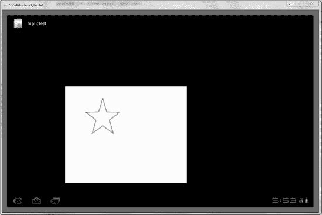
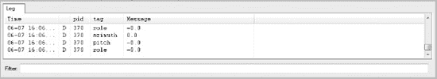

# 三、收集用户输入

到目前为止，你的作品缺乏游戏的互动性，主要是因为你没有办法让玩家与精灵和角色互动。在这一章中，你将解锁几种你最终用来控制游戏外观和动作的输入形式。这也是你在 Android 3.0 中解锁平板游戏编程的一些惊人特性的地方。以前，大多数这样的工作适用于旧的 Android 手机，但现在程序员严重依赖大触摸屏来收集触摸输入。

平板电脑的独特之处在于，用户可以进行大量选择；而作为开发者，你需要为此做好准备。除了这种显而易见的交互方法，您还会看到一些更不寻常的输入，比如加速度计数据和手势。除了输入，您还将介绍事件队列如何帮助您简化游戏。但让我们先来快速概述一下大多数 Android 平板电脑上的输入设备。

### 了解平板电脑输入选项

为了理解你的选择，你需要知道平板电脑在收集用户行为数据方面提供了什么。以下是许多平板电脑中存在的传感器的一个相当全面的列表。一些平板电脑不具备所有这些功能，而其他平板电脑则具备额外的功能:

> *   *Touch screen:* Most tablet computers have a multi-touch interface that allows you to input on the screen with several fingers at a time. Precision screens now allow you to create very small elves, and users can still drag them because of the precision of the screens. For most games, this is a user-controlled method. Almost every game needs this as its menu.
> *   *Microphone:* Tablet PCs running Android 3.0 often have built-in microphones that can be used as input. Examples include changing the height of the helicopter according to the pitch or volume of sound samples. Although there are many interesting applications, it is not used in most games.
> *   *Accelerometer:* This sensor measures the orientation change of the tablet computer. When you rotate the tablet from landscape to portrait, you may be familiar with this: the screen usually adjusts itself according to the accelerometer data. In flight games and racing games, this is an interesting way for users to control vehicles.
> *   *Gyroscope:* Similar to accelerometer, gyroscope measures the rotation rate along three axes of motion. This is for precise movement and can tell you the exact mode of rotation. Games that use accelerometers can also use gyroscopes.
> *   *Proximity:* The proximity sensor measures the distance between the object and the mobile phone. These are usually inaccurate and are mainly used to turn off the screen near your cheek (when you make a phone call with a touch-screen phone). However, few games use this.

虽然这个列表包括了游戏从玩家那里收集数据的大多数方式，但是您可以访问描述玩家所在区域和周围环境的其他传感器。这不能代替用户交互，但是它增加了游戏的真实性。以下是大多数平板电脑提供的获取这些信息的方式:

> *   *GPS:* The GPS positioning of a device can make the game map an image of the surrounding area or change the scene or characters of a game. It is not possible to consider all the different locations where a device may be located, but later you will study how to incorporate this point.
> *   *Ambient light:* This sensor is mainly used to adjust the brightness of the screen according to external light, but it does provide some advantages for game developers. If the user is in a dark place, one way to integrate it is to change the game to night scene.
> *   *Barometer:* This sensor is a joke rather than what it is. But in reality, the game may use it to estimate the altitude and adjust the game accordingly. I haven't seen a game that successfully integrates this sensor.

了解了平板电脑上可以找到的各种内部传感器，您也可以开始考虑可能想要连接到它的其他输入设备。Android 3.0 自带对任何 Android 版本蓝牙输入的最佳支持。每一个新版本都可能继续扩展这一点。虽然蓝牙输入可能令人兴奋，但为平板电脑编写游戏的目的是为用户提供独特的体验。如果他们仍然必须连接他们的游戏控制台，那么他们也可以使用电视。也就是说，Android 现在对操纵杆、键盘和游戏控制器提供了原生支持。

 **注意**随着运行 Android 和 Chrome 混合操作系统的电视的出现，将平板电脑用作控制器成为可能。将平板电脑连接到运行 Android 的电视上，可以让电视屏幕显示游戏，同时平板电脑还可以充当地图和控制器。Android 越广泛地用于驱动设备，你在输入方面就有越多的机会。

您几乎已经准备好为您的游戏设置一些输入了。然而，首先你要回顾一下收集信息背后的一些理论。快速获得输入对游戏来说至关重要，而传统应用(例如地图或地址簿)不需要这种速度。

### 了解平板电脑输入

对于传统的应用，程序通常依赖于输入事件。这意味着，在用户与应用交互之前，什么都不会发生。大多数应用有许多不同的菜单和文本，用户一按下按钮，代码就负责筛选。在这些情况下，传统的游戏循环是不必要的，因为在触摸事件发生之前没有任何事情要做。同样的原则也适用于没有触摸屏的手机的旧程序。

如果你想制作这种应用，Android 可以让你非常简单地为屏幕上的各种按钮和图像添加监听器。通过在按钮被按下时执行特定的动作，您可以操纵程序的屏幕和动作。令人惊讶的是，这种用平板电脑工作的方式与游戏有一定的关联。以回合制策略游戏(如国际象棋)为例:在玩家移动精灵之前，什么都不会发生。

所有收集用户输入的方法都不可避免地涉及到非常重要的*游戏过程*。这是应用经历的事件循环。有多少种游戏类型，就有多少种游戏过程。这些循环都处理输入，确定物理，并给用户反馈(通常通过改变游戏的显示)。图 3-1 显示了一款回合制策略游戏的游戏流程。

***图 3-1。**依赖输入游戏的游戏过程*

 **注意**如果你对回合制游戏感兴趣，你可以在网上查看几个例子。一个非常简单但优雅的演示是一个井字游戏的 Android 示例。可以在这里下载源码:`[`developer.android.com/resources/samples/TicTacToeMain/index.html`](http://developer.android.com/resources/samples/TicTacToeMain/index.html)`。

因为大多数现代游戏都是快节奏和输入密集型的，所以你在处理输入事件的同时还要执行图形和逻辑操作。为了做到这一点，你收集输入并处理它，以便不中断游戏的流程。你可能认为这是同时做不同的事情；但是更实际的情况是，您注意到一个输入事件，然后等待在进入下一个游戏周期时处理它。图 3-2 显示了输入事件是如何存储的，直到你准备好处理它们。

在第二章的中讨论的`Thread`类在处理输入事件中起着很大的作用。然而，`View`类是注册输入事件的方法的地方。事实上，`View`类有几个方法，您可以覆盖它们来执行您自己的触摸事件工作。

您实质上改变了您的`Sprite`类，因为您已经有了像`setX(int)`和`setY(int)`这样的方法，一旦输入事件发生，您就可以操纵 sprite。你创建新的事件来改变精灵的速度和方向。稍后，一个触摸事件可能会导致精灵重新装填弹药或施放特殊法术。在本章结束时，你将使用某些事件来产生一个全新的精灵。

为了清楚地了解示例游戏是如何工作的，图 3-2 展示了如果用户开始快速点击屏幕，你如何处理输入事件而不使游戏停止。请注意图 3-1 和图 3-2 之间的差异。

你使用的游戏流程版本有两个在回合制游戏中没有的附加功能，如图 3-1 所示。首先，应用路径不是线性的:输入事件在需要时被添加到游戏中。第二，游戏循环管理整个过程，而回合制游戏中的处理循环由输入控制。这是一个关键的区别，因为不管用户在做什么，你的游戏都需要继续，而图 3-1 中的游戏必须等待用户交互。

你的游戏的图形渲染也是不同的，因为它经常发生。在回合制游戏中，图形会在用户输入事件发生后改变。但是，即使什么都没有改变，您也将在循环的每个周期中更新图形。

***图 3-2。**连续游戏的游戏循环*

图 3-2 显示了一个通过图形和用户输入循环的连续游戏过程。任何不需要用户输入而继续的游戏循环都可以被称为*游戏循环*。请注意，一个输入事件会导致一个输入队列，事件会存储在该队列中，直到您准备好接受并响应它。因为您的游戏以每秒高帧数运行，所以您在输入响应方面不会有任何明显的延迟。

### 对触摸做出反应

Android 可以在各种设备上运行，因此它有办法收集所有类型的输入。然而，对你来说，最重要的事情是与触摸屏的互动。你的首选方法如下:

`Public boolean onTouchEvent(MotionEvent event){
}`

这个方法是从`View`类继承的，为了执行自己的操作，您可以覆盖它。这个函数的关键是它包含的参数。A `MotionEvent`是 Android 中的一个对象，描述了与平板电脑的各种交互。您可以通过调用`MotionEvent`类中的方法来找到关于该事件的很多信息。这个类有许多选项，但是重要的函数会在您使用它们时指出。如果你很好奇，可以在 Android 文档中查找该类:[`developer . Android . com/reference/Android/view/motion event . html`](http://developer.android.com/reference/android/view/MotionEvent.html)。

同样，这个方法和其他几个方法是从您的`GameView`类中调用的，因此您可以快速地将相关的更改传递给您的`Sprite`和`GameLogic`进程。您可能会用到的其他输入功能包括`onKeyDown()`、`onClick()`和`onKeyUp()`。如果您有兴趣使用它们，它们的实现方式几乎与处理一般触摸事件的方式相同。这些方法都返回一个布尔值。这意味着当您完成处理时，您返回`true`，以释放程序来收集下一个输入。

你可以想象，对于平板电脑来说，一次屏幕滑动对玩家来说可能相对简单；但是你的应用可能会将其误解为几个小动作，或者完全错过这个动作。随着游戏的进行，你要练习更复杂的手势，并确保即使是新玩家也能掌握游戏的控制。

让我们仔细看看如何处理触摸屏上的用户输入。在 Eclipse 中创建一个新项目来演示用户输入:

> 1.  Create a new  project  Android project . Type the name of the new project as **input test** , and make sure that the title of the activity is **main activity** . It is common practice to put items in the same root package.
> 2.  Because you will largely reuse the earlier classes, open the folder tree of GraphicsTest and copy all four `.java` files to the `src` folder of the InputTest project. Also close the window of each class in the editing panel to make sure that you are editing the file of the new project. Open all the classes of the InputTest project, and it's almost ready to start.
> 3.  If you still want the same image, please move the image file from `res`  `drawable_mdpi` to the folder of the new project. If you like, you can create a new image for this project, as long as you reference it correctly in the code.
> 4.  你已经知道输入收集发生在`GameView`类中，所以把清单 3-1 中的函数添加到游戏视图中。将此部分放在`surfacedestroyed()`方法的正下方。
>     
>      **注意**许多讨论的主题都需要在代码顶部添加额外的`import`语句。每个列表的标题包括必要的`import`语句。请确保将这些内容放在文件的顶部,否则将无法运行该应用
>     
>     
>     
>     ***清单 3-1。**添加输入采集到`GameView.java`(`import android.view.MotionEvent`)*
>     
>     `@Override
>     public boolean onTouchEvent(MotionEvent event){
>             return true;
>     }`
> 5.  这是`onTouchEvent`的完整实现；但是，它目前不执行任何有意义的操作。将清单 3-2 中所示的代码片段添加到`return`语句之前的函数代码中。
>     
>     *清单 3-2。基于触摸事件操纵精灵*
>     
>     `sprite.setX((int)event.getX());
>     sprite.setY((int)event.getY());`
> 6.  This code uses your `setX` and `setY` functions to move the sprite to the place where the touch event stopped or the last position of the finger. `Event.getX` is a method to retrieve the position of the last motion event. It returns a floating-point number, so you can convert it into an integer to satisfy your method.
> 7.  因为你的精灵一直在屏幕上快速移动，所以你移除了精灵的移动。清单 3-3 停止`GameView`类中被改变的`update()`方法。
>     
>     ***清单 3-3。**停止精灵运动*
>     
>     `public void update(int adj_mov) {
>             if (sprite.getX()  > = getWidth()){
>                     sprite.setMoveX(0);
>             }
>             if (sprite.getX() <= 0){
>                     sprite.setMoveX(0);
>             }
>             sprite.update(adj_mov);
>     
>     }`
> 8.  You must also stop the movement in the `SpriteObject` class by setting the value of the sprite-movement variable to zero.
> 9.  Your backstage work is finished. Save all files and run the application. If you click on the screen, the wizard will appear in the position where you moved last time.

也可以试着在数位板上拖动光标。你会看到精灵疯狂地试图跟上，即使如果你使用模拟器，它会明显滞后。真实设备的运动相当流畅。图 3-3 显示了你的工作结果。

***图 3-3。**通过在屏幕上拖动，将`star.png`精灵移动到不同的位置。*

当您在屏幕上移动光标时，您可能会注意到无论您从哪里开始移动，精灵都会移动。大多数允许你移动精灵的游戏都有几个精灵，所以你必须通过触摸来选择你想要移动的精灵。这就把你带到了触摸屏输入的主要话题之一:*手势*。尽管拖动事件本质上很简单，但它被认为是一种手势，因为它涉及持续的交互。其他手势包括滚动、挤压、旋转等。接下来，您将学习如何在游戏环境中创建手势并对其做出响应。

### 回应手势

要做到这一切，你需要对 Android SDK 中的`Gesture`类非常友好。在您在代码中使用它之前，让我们在 Android 开发团队创建的示例程序中体验一下手势。你可以在模拟器中访问这个应用:它被称为手势生成器。但是，在此之前，您必须对模拟器进行一些更改:

> 1.  GestureBuilder writes files into SD card of tablet. If your simulator doesn't have this, you can easily add it. Select the window  Android SDK and AVD manager.
> 2.  点击平板设备，并点击屏幕左侧的编辑按钮。弹出一个对话框(如图 3-4 所示),输入设备的内存大小。我一般用 1000 兆。
>     
>     ***图 3-4。**为手势生成器应用设置仿真器*
>     
>     
> 3.  Click edit AVD.
> 4.  你被带回 Android SDK 和 AVD 管理器。单击开始按钮；或者，如果开始按钮不可用，首先选择仿真器名称，如图图 3-5 所示。您从这里启动模拟器，因为您希望能够选择应用，而不是让应用默认启动。
>     
>     ***图 3-5。**从安卓 SDK 和主动脉瓣疾病管理器启动模拟器*
>     
>     
> 5.  When the simulator is up and running, go to the icon labeled Apps. Then, click the Gesture Generator program. Play with this application for a while and see how it works. Make a new gesture and give it a name. Do a series of slides to create your gestures. This application gives you a feeling of what a gesture looks like.

如果您创建了一个真正伟大的手势，并希望在游戏中使用，您可以从 SD 卡中获取该手势，并在您的游戏代码中引用它。这是一个高级话题，你现在只想体验手势；要完成这个过程，请遵循 Android 文档中的说明:`[`developer.android.com/resources/articles/gestures.html`](http://developer.android.com/resources/articles/gestures.html)`。

图 3-6 显示了我创建的一个星形手势。尽管你可以用多种方式画一颗星星，但手势是特定的，因为笔画的*顺序*非常关键。平板电脑正在寻找正确的序列。

***图 3-6。**做出独特的明星姿态*

Android 开发小组有自己的名为 GestureDemo 的程序，可以让你做出手势，让应用识别。这一章没有详细介绍这个应用是如何工作的，因为它与大多数游戏的相关性有限。不过，还是值得简单看一下，因为你可以看到手势是如何被识别的。通过改变手势的方式，你会发现平板电脑识别手势的准确度有多高:

7.从`[`code.google.com/p/apps-for-android/downloads/detail?name=GesturesDemos.zip&can=2&q=`](http://code.google.com/p/apps-for-android/downloads/detail?name=GesturesDemos.zip&can=2&q=)`下载项目。解压缩文件夹，并注意记住所有内容都是从哪里提取的。

8.打开 Eclipse，选择 File  Import  General 将已有的项目导入工作区。

9.找到您下载的文件夹`GestureDemo`，并填写表格。当您单击 Finish 时，您的工作区中就会有一个新项目。要了解这个项目的更多信息，可以访问网页[`developer . Android . com/resources/articles/gestures . html`](http://developer.android.com/resources/articles/gestures.html)。

10.运行新项目，并开始表演手势。如果你做一个闪电手势，它应该在底部显示雷霆咒语。

如果你在这个项目上玩的时间足够长，你可能会注意到它在识别一些手势方面不是很准确。这是意料之中的，也是创建自定义手势不常见的原因之一。人们已经熟悉的著名手势，如捏和拖，很容易被 Android 计算出来，导致更少的混乱。尽管如此，当你可以像在现实生活中一样用手做动作时，一些游戏还是非常令人兴奋的。你可以在 Android 文档中查找手势库来更好地理解手势，因为这是一个太复杂的主题，本章无法完全涵盖。

提示如果你创造了自己的手势，让它们简单而夸张。此外，将你的游戏限制在一两个彼此非常非常不同的新手势，以避免错误。

### 使用输入队列

早些时候，这一章讨论了大量的用户输入是如何冻结游戏并导致其停止的。您可以使用非常方便的`InputObject`类来解决这种可能性。基本上，当输入事件发生时，您试图限制主线程上的压力。回想一下图 3-2 展示了你如何在响应输入事件之前保持它们。这正是你在这里做的。您不必等待锁定整个线程，而是在后台完成大部分工作。

这个系统最初是由罗伯特·格林介绍给我的，它非常有效和简单，从那以后我一直在使用它。(你可以在`[www.rbgrn.net/](http://www.rbgrn.net/)`阅读罗伯特关于 Android 开发和其他沉思的博客。)An `ArrayBlockingQueue`负责输入处理的繁重工作。这基本上是一种存储对象并在以后遍历它们的方法。要使用一个`ArrayBlockingQueue`，您需要在使用它的每个 Java 文件的顶部导入它，如下所示:

`import java.util.concurrent.ArrayBlockingQueue;`

为了使用这种存储输入事件并在以后处理它们的方便方法，在 InputTest 项目中创建一个名为`InputObject`的新类。从现在开始，你引用`InputObject` s 而不是`MotionEvent` s 来获取关于发生了什么类型的事件的信息。除了加快处理速度之外，创建这样一个类还有多种原因。当您开始响应输入时，您会注意到处理有时很复杂的事件变得更加容易。

让我们试试这个技巧:

> 1.  创建`InputObject`类，并用清单 3-4 中的代码填充它。
> 
> ***清单 3-4。**??`InputObject.java`*
> 
> `import java.util.concurrent.ArrayBlockingQueue;
> import android.view.KeyEvent;
> import android.view.MotionEvent;
> 
> public class InputObject {
>         public static final byte EVENT_TYPE_KEY = 1;
>         public static final byte EVENT_TYPE_TOUCH = 2;
>         public static final int ACTION_KEY_DOWN = 1;
>         public static final int ACTION_KEY_UP = 2;
>         public static final int ACTION_TOUCH_DOWN = 3;
>         public static final int ACTION_TOUCH_MOVE = 4;
>         public static final int ACTION_TOUCH_UP = 5;` `public ArrayBlockingQueue<InputObject> pool;
>         public byte eventType;
>         public long time;
>         public int action;
>         public int keyCode;
>         public int x;
>         public int y;
> 
>         public InputObject(ArrayBlockingQueue<InputObject> pool) {
>                 this.pool = pool;
>         }
> 
>         public void useEvent(KeyEvent event) {
>                 eventType = EVENT_TYPE_KEY;
>                 int a = event.getAction();
>                 switch (a) {
>                 case KeyEvent.ACTION_DOWN:
>                         action = ACTION_KEY_DOWN;
>                         break;
>                 case KeyEvent.ACTION_UP:
>                         action = ACTION_KEY_UP;
>                         break;
>                 default:
>                         action = 0;
>                 }
>                 time = event.getEventTime();
>                 keyCode = event.getKeyCode();
>         }
> 
>         public void useEvent(MotionEvent event) {
>                 eventType = EVENT_TYPE_TOUCH;
>                 int a = event.getAction();
>                 switch (a) {
>                 case MotionEvent.ACTION_DOWN:
>                         action = ACTION_TOUCH_DOWN;
>                 break;
>                 case MotionEvent.ACTION_MOVE:
>                         action = ACTION_TOUCH_MOVE;
>                         break;
>                 case MotionEvent.ACTION_UP:
>                         action = ACTION_TOUCH_UP;
>                         break;
>                 default:
>                         action = 0;
>                 }
>                 time = event.getEventTime();
>                 x = (int) event.getX();
>                 y = (int) event.getY();
>         }
> 
>         public void useEventHistory(MotionEvent event, int historyItem) {
>                 eventType = EVENT_TYPE_TOUCH;` `                action = ACTION_TOUCH_MOVE;
>                 time = event.getHistoricalEventTime(historyItem);
>                 x = (int) event.getHistoricalX(historyItem);
>                 y = (int) event.getHistoricalY(historyItem);
>         }
> 
>         public void returnToPool() {
>                 pool.add(this);
>         }
> }`*   我们来解剖一下这个类。像`KeyEvent`或`MotionEvent`这样的输入事件由函数`useEvent()`处理，以创建具有动作类型以及相关数据的对象，如触摸屏事件的 x 和 y 坐标。需要理解的关键部分是`ArrayBlockingQueue`是如何工作的。*   在集成到你的其他类的上下文中更有意义；但是现在，让`InputObject`按照它们加入事件池的相反顺序存储就足够了。这意味着首先处理第一个发生的事件。显然，用户输入必须按照发生的顺序来处理。*   清单中特别值得注意的是`useEventHistory()`。像`getHistoricalEventTime()`和`getHistoricalX()`这样的方法被用来获取运动事件的原始数据。通常，屏幕上的滑动有几个相关联的坐标和时间，因此这是获取事件的原始位置与当前光标位置的方法。*   在继续之前，还要注意每个事件都有一个名为`action`的变量，它存储发生的事件的类型。当您想要对输入做出响应时，您可以查找它是什么类型的事件并做出相应的响应。这使您免于进行大量的猜测。*   To implement your new `InputObject` class, you need to make some major changes to `GameView.java`. Inside the `GameView` class, create the following variable shown in Listing 3-5.
>     
>     ***清单 3-5。**添加一个`inputObjectPool`对象*
>     
>     `private ArrayBlockingQueue<InputObject> inputObjectPool;`*   Under the `GameView(Context context)`, add the line in Listing 3-6.
>     
>     ***清单 3-6。**创建`InputObject`池*
>     
>     `createInputObjectPool();`*   You build this function in the `GameView` class with the code shown in Listing 3-7, which you place at the end of `GameView`.
>     
>     ***清单 3-7。**声明一个创建对象池的函数*
>     
>     `private void createInputObjectPool() {` `        inputObjectPool = new ArrayBlockingQueue<InputObject>(20);
>             for (int i = 0; i < 20; i++) {
>                     inputObjectPool.add(new InputObject(inputObjectPool));
>             }
>     }`*   在这里，您初始化存储输入对象的`inputObjectPool`。您将它设为 20 个单位长，因为您可能永远不会超过这个限制(输入事件只能发生得这么快)。`for`循环用所有元素填充池。*   To start sending information to the input object pool, you need to modify the `onTouchEvent` that you worked with before. Type the code from Listing 3-8 into the `onTouchEvent()` method.
>     
>     ***清单 3-8。**??`onTouchEvent(MotionEvent event)`*
>     
>     `@Override
>     public boolean onTouchEvent(MotionEvent event) {
>             try {
>                     int hist = event.getHistorySize();
>                     if (hist > 0) {
>                             for (int i = 0; i < hist; i++) {
>                                     InputObject input = inputObjectPool.take();
>                                     input.useEventHistory(event, i);
>                                     mGameLogic.feedInput(input);
>                             }
>                     }
>                     InputObject input = inputObjectPool.take();
>                     input.useEvent(event);
>                     mGameLogic.feedInput(input);
>             } catch (InterruptedException e) {
>             }
>             try {
>                     Thread.sleep(16);
>             } catch (InterruptedException e) {
>             }
>             return true;
>     }`*   请注意，根据触摸事件的位置，您会失去移动精灵的功能。你把这一块加回下一节。在`onTouchEvent`中，您使用一个`try`块来尝试将每个事件解析成一个`InputObject`，然后存储它以供以后处理。对`mGameLogic.feedInput(input)`的调用是当线程有机会时进一步访问事件的地方。最后，让主线程休眠 16 毫秒，以确保不会一次收集太多的输入。*   将`useEvent`和`useEventHistory`的调用引用到它们在`InputObject`类中的声明。您应该能够看到如何创建已经发生的输入事件的列表。*   You need to add two new methods to the `GameView` class in `GameView.java`; see Listing 3-9. They’re called by the `GameLogic` to work with the input objects. You disregard `KeyEvent` for now because tablets don’t often worry about keyboard input. `MotionEvent`, however, is handled just as you did earlier by instructing the sprite to move to wherever the user last touched.
>     
>     ***清单 3-9。**处理动作和按键事件*
>     
>     `public void processMotionEvent(InputObject input){
>             sprite.setX(input.x);
>             sprite.setY(input.y);
>     }
>     public void processKeyEvent(InputObject input){
>     
>     }`*   要设置 sprite 的 x 和 y 位置，可以访问输入对象的最后一个坐标。当您抽象出`MotionEvent`时，这个简单的过程可以让您更好地可视化您的操作。*   To finish your new input pipeline method, you add some code to the `GameLogic` class. Listing 3-10 declares two objects that you need to create. Place this code right beneath the variables that store the game state, such as `PAUSE`, `READY`, and `RUNNING`.
>     
>     ***清单 3-10。**为输入法声明新对象*
>     
>     `private ArrayBlockingQueue<InputObject> inputQueue = new ArrayBlockingQueue<InputObject>(20);
>     private Object inputQueueMutex = new Object();`*   You need to make only one change to the `run()` method, but it’s important that you place it in the correct location. Listing 3-11 shows the entire `run()` function with the addition highlighted.
>     
>     ***清单 3-11。**告诉主线程处理输入*
>     
>     `@Override
>     public void run() {
>             long time_orig = System.currentTimeMillis();
>             long time_interim;
>             Canvas canvas;
>     
>             while (game_state == RUNNING) {
>                     canvas = null;
>                     try {
>                             
>                             canvas = this.surfaceHolder.lockCanvas();
>                             
>                             synchronized (surfaceHolder) {
>                    try {
>                         Thread.sleep(30);` `                } catch (InterruptedException e1) {
>                     }
>                     time_interim = System.currentTimeMillis();
>                     int adj_mov = (int)(time_interim - time_orig);
>                     mGameView.update(adj_mov);
>                     processInput();  //this is the new way to process input.
>                     time_orig = time_interim;
>                     this.mGameView.onDraw(canvas);
>                     }
>                     }
>                     finally {
>                             if (canvas != null) {
>                                     surfaceHolder.unlockCanvasAndPost(canvas);
>                             }
>                     }
>     }
>     }`*   You must now define two functions because you’ve already created methods that call them. `ProcessInput()` is where the thread issues instructions about dealing with the input. `Feedinput()` handles the operation of the `ArrayBlockingQueue`. Place these methods, whose code appears in Listing 3-12, right below the `run()` function.
>     
>     ***清单 3-12。**进料和加工输入*
>     
>     `public void feedInput(InputObject input) {
>             synchronized(inputQueueMutex) {
>                     try {
>                             inputQueue.put(input);
>                     } catch (InterruptedException e) {
>                     }
>             }
>     }
>     
>     private void processInput() {
>             synchronized(inputQueueMutex) {
>                     ArrayBlockingQueue<InputObject> inputQueue = this.inputQueue;
>                     while (!inputQueue.isEmpty()) {
>                             try {
>                                     InputObject input = inputQueue.take();
>                                     if (input.eventType == InputObject.EVENT_TYPE_KEY) {
>                                             mGameView.processKeyEvent(input);
>                                     } else if (input.eventType == InputObject.EVENT_TYPE_TOUCH) {
>                                             mGameView.processMotionEvent(input);
>                                     }
>                                     input.returnToPool();
>                             } catch (InterruptedException e) {
>                             }
>                     }
>             }
>     }`

`FeedInput()`非常直白。它用`synchronized()`抓取线程，并将输入合并到`inputQueue`中。一旦输入对象被满意地分类，这个方法就会被`GameView`类调用。

`ProcessInput()`在处理`inputQueue`的方式上有些复杂。它还使用`synchronized()`来保持线程，同时它遍历`inputQueue`中的对象，并让`processKeyEvent()`或`processMotionEvent()`来处理它们。这两个函数都是在`GameView.java`中定义的，因为您希望能够向 sprite 对象发出指令。

在代码的巨大变化之后，你的程序现在完全按照本章开始时的方式运行。然而，如果你的游戏线程在处理输入时过于费力，用户可能会认为这是一个没有响应的程序，那么这个过程将会为你省去很多麻烦。

继续启动输入测试项目。如果所有代码都编译正确，那么您应该能够在平板电脑屏幕上拖动精灵。因为几乎没有任何物理或计算在后台进行，所以应用的行为应该没有明显的差异。当你添加人工智能程序和几十个带背景的精灵时，你将充分利用这种巧妙的方式来处理输入。

随着触摸屏事件的这些基本策略的消失，现在您可以检查使 Android 平板电脑有趣的更令人兴奋的传感器。

### 响应传感器数据

Android 提供了一种简单的方法来获取触摸事件，但传感器是一个更复杂的问题。这并不是说获取数据是棘手或困难的，但是以有意义的方式处理输入可能是一个真正的挑战。这里，我们将重点放在加速度计数据上，因为它是最常用的传感器，其他传感器(如陀螺仪)与之类似。

平板电脑传感器提供的数据非常精确，通常是 Java 长浮点数据类型。这是一件喜忧参半的事情，因为长浮点数据错综复杂，难以计算。让事情变得更加困难的是，平板电脑可以以多种方向握持。在纵向模式下握住平板电脑会完全改变旋转轴。为了暂时解决这个问题，您可以假设平板电脑处于横向模式。稍后，您将学习一种方法来检测平板电脑的方向，并指导用户为您的特定游戏选择正确的位置。

让我们在项目中添加一些代码，看看这些传感器数据是关于什么的:

> 1.  你需要再导入一个安卓库。为此，将清单 3-13 中的代码添加到`MainActivity.java`文件中。
>     
>     ***清单 3-13。**获取传感器数据*
>     
>     `import android.hardware.Sensor;
>     import android.hardware.SensorEvent;
>     import android.hardware.SensorEventListener;
>     import android.hardware.SensorManager;`
> 2.  You may notice that these imports are about hardware-specific information. The device running the game may lack the correct sensor.
> 3.  在你的`MainActivity`类中实现`SensorEventListener`类。为此，直接在`extends Activity`行后添加`implements SensorEventListener`。当出现错误消息时，双击它创建两个事件，如列表 3-14 所示。
>     
>     ***清单 3-14。**自动生成传感器方法*
>     
>     `@Override
>     public void onAccuracyChanged(Sensor arg0, int arg1) {
>             // TODO Auto-generated method stub
>     
>     }
>     @Override
>     public void onSensorChanged(SensorEvent arg0) {
>             // TODO Auto-generated method stub
>     
>     }        `
> 4.  This is quite self-evident: create a `SensorEventListener` and two methods, which register when the sensor changes its accuracy or its value. You are most concerned about `onSensorChanged()` because you are looking for data. In addition, there are many other functions that you can use when you want to get very specific information from the sensor.
> 5.  将清单 3-15 中的行放在`MainActivity`中的`onCreate()`方法之上。
>     
>     *清单 3-15。创建传感器对象*
>     
>     `private SensorManager mSensorManager;
>     private Sensor mAccelerometer;`
> 6.  用`onCreate()`方法初始化这些传感器对象，如清单 3-16 所示。
>     
>     ***清单 3-16。**初始化传感器对象*
>     
>     `mSensorManager = (SensorManager)getSystemService(SENSOR_SERVICE);
>     mAccelerometer = mSensorManager.getDefaultSensor(Sensor.TYPE_ACCELEROMETER);`
> 7.  要处理传感器，您需要添加两个基本方法，这两个方法在每个活动中都已经可用:`onPause()`和`onResume()`。您在这里需要它们，因为当设备已经处于某种睡眠模式时，您不想继续搜索传感器输入。清单 3-17 中的代码处理了这个问题。
>     
>     ***清单 3-17。** `onPause()`和`onResume()`*
>     
>     `protected void onResume() {
>     super.onResume();
>     mSensorManager.registerListener(this, mAccelerometer, SensorManager.SENSOR_DELAY_NORMAL);
>     }
>     
>     protected void onPause() {
>     super.onPause();
>     mSensorManager.unregisterListener(this);
>     }`
> 8.  你可以查看修改后的`onSensorChanged()`来确定俯仰、滚转和方位角的值。作为参考，*方位角*为绕 z 轴旋转，俯仰为绕 x 轴旋转，*滚动*为绕 y 轴旋转。为了表达加速度计的值，您引入了一种针对 Eclipse 和 Android 的调试技术。在顶部，导入`Android.util.Log`。然后将`onSensorChanged()`更改为清单 3-18 中所示的代码。
>     
>     ??**清单 3-18。**??`onSensorChanged (add import android.util.Log)`
>     
>     `@Override
>     public void onSensorChanged(SensorEvent event) {
>     
>     
>             float R[] = new float[9];
>             float orientation[] = new float[3];
>             SensorManager.getOrientation(R, orientation);
>     
>             Log.d("azimuth",Float.toString(orientation[0]));
>             Log.d("pitch",Float.toString(orientation[1]));
>             Log.d("role",Float.toString(orientation[2]));
>     
>     }`
> 9.  Basically, you create two arrays to store numerical values. Then call the sensor manager to get the direction of the device. Finally, get the direction array and print out the value. The `Log.d` function may seem novel to you, but it is just a way to send data to the debugger. Before running the program, you can set the view for reading these values by selecting the window  Display View  Other  Android  Logcat.

现在，您看到的不是控制台的输出，而是模拟器启动时闪烁的大量数据点。当应用开始运行时，您会看到加速度计的值。图 3-7 显示了当你在计算机上使用模拟器时会发生什么，它在运动中没有任何变化。

***图 3-7。**记录设备的方位、俯仰和滚动*

当我想处理传感器数据时，我总是在我的实际平板设备上进行测试，因为在不同位置持有设备非常简单。如果您还没有看过，附录 A 提供了有关设置平板电脑进行测试的信息。如果你更喜欢冒险或者没有设备，Android 有一个传感器模拟器可以在你编写代码时帮助你。

这里可以看到 Google code 项目:`[`code.google.com/p/openintents/wiki/SensorSimulator`](http://code.google.com/p/openintents/wiki/SensorSimulator)`。建立整个系统实际上是一个相当简单的提议，但是我不会在这里深入讨论。在某些情况下，只有真正的设备才能提供即时响应，并向您展示其处理能力。

与真实设备相比，传感器模拟器确实有一些优势。通过将准确的移动值与设备的响应方式相关联，您可以更好地感受到您的程序运行得有多好。对于大多数开发人员来说，仅仅通过手持平板电脑很难测量出完美的 37 度旋转。

### 使用传感器数据

要将传感器数据合并到游戏及其更新的逻辑中，您需要将数据传递到游戏的`View`类中。首先将它添加到`MainActivity`类中:

`GameView mGameView;`

您还必须将清单 3-19 中的代码添加到`onCreate()`方法中:

***清单 3-19** 。`GameView`实例*

`mGameView = new GameView(this);
setContentView(mGameView);`

您现在有了一个`GameView`实例，可以从中调用各种方法。接下来，在`GameView`中，您需要添加一个新的函数来传递您的方向数据。清单 3-20 显示了在`onSensorChanged()`中添加的调用。

***清单 3-20。**发送传感器数据*

`@Override
public void onSensorChanged(SensorEvent event) {

if(event.sensor.getType() == Sensor.TYPE_ACCELEROMETER){
        float orientation[] = new float[3];
        for(int i = 0; i < 3; i++){
                orientation[i] = event.values[i];
        }

        mGameView.processOrientationEvent(orientation);

        Log.d("azimuth",Float.toString(event.values[0]));
        Log.d("pitch",Float.toString(event.values[1]));
        Log.d("role",Float.toString(event.values[2]));
}

}`

代码的新部分是对 gameview 的`processOrientationEvent()`调用。请注意，您正在向它发送方向数据数组。清单 3-21 包含了`GameView.java`中`processOrientationEvent()`的代码。

***清单 3-21。**处理传感器数据*

`public void processOrientationEvent(float orientation[]){

        float roll = orientation[2];
        if (roll < -40) {
                sprite.setMoveX(2);
        } else if (roll > 40) {
                sprite.setMoveX(-2);
        }

}`

这里你只看到了设备的滚动。如果它足够低，那么你希望精灵移动到右边。如果滚动是高的，那么你有精灵移动到左边。为了让这更令人兴奋，注释掉`update()`函数的行。清单 3-22 显示了该零件现在的样子。

***清单 3-22。**让精灵自由移动*

`public void update(int adj_mov) {
        if (sprite.getX() >= getWidth()){
                //sprite.setMoveX(0);
        }
        if (sprite.getX() <= 0){
                //sprite.setMoveX(0);
        }
        sprite.update(adj_mov);

}`

在你的安卓平板设备上测试一下，你会很难将精灵保持在屏幕内。如果您愿意，可以在平板电脑保持相对平直时将移动量设置为零。这里您使用了一个非常简单的传感器数据实现，但是在最终的游戏项目中，您添加了一个摇动事件，让用户摇动平板电脑来重新开始关卡。现在，您可以使用平板电脑数据的滚动、方位和俯仰。

您必须了解传感器数据的几个方面才能让它们发挥作用。传统上，加速度计数据是基于重力来处理的。因此，平板静止时，加速度仍在 9.8 m/s².左右许多 Android 函数会为你处理这个问题，但是如果你遇到不处理的函数，你需要减去这个重力影响。查阅 Android 文档可以对此有所帮助。有趣的是，Android 内置了包括地球在内的所有行星的重力常数。这样，你可以根据你的设备当前所在的星球来调整加速度计的读数。

最后，坐标轴是独一无二的，因为它们既考虑了磁北，也考虑了传统的维度。这意味着 x 轴大致从东向西，而 y 轴指向北，z 轴指向地球的中心。图 3-8 中的图片来自 Android 自己的文档。

***图 3-8。**安卓平板电脑的坐标轴*

因为加速度计和陀螺仪的读数本来就是三维的，所以理解矩阵对于它们的一些数据非常重要。要解决这个问题，您应该只要求像`getOrientation()`这样的函数，其中您知道值是俯仰、方位角和滚动的数组。您可以通过查看 Android 文档来试验更多的传感器数据:`[`developer.android.com/reference/android/hardware/Sensor.html`](http://developer.android.com/reference/android/hardware/Sensor.html)`。在本文的顶部，您可以查看 Android 支持的所有传感器类型的列表。但是，在实现它们之前，请检查您的目标设备是否包含这些。

### 总结

将传感器和触摸屏输入的信息与您完成的图形工作相结合，您可以制作自己的游戏。当然，在通过碰撞使精灵正确交互和创建新的精灵实例方面还有很多工作要做。你还必须把你的游戏推向市场。

在你开始任何高级精灵和开发任务之前，你需要理解游戏的音乐和声音的基础。当你想到平板电脑和手机应用时，音乐可能很少被注意到，但这并不意味着它不重要。一个没有声音的游戏很无聊，会让人们试图在后台运行他们的音乐播放器，这会减慢你的游戏速度。Android 已经创建了几个奇妙的库来创建有趣的声音效果。你可以利用它们来增加游戏的刺激。