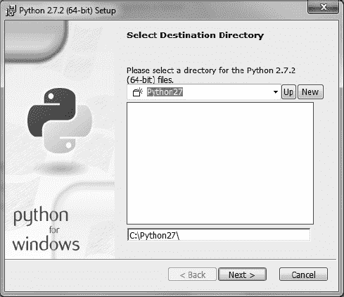
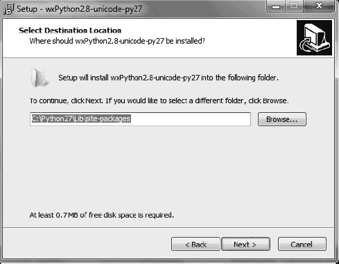
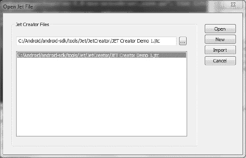
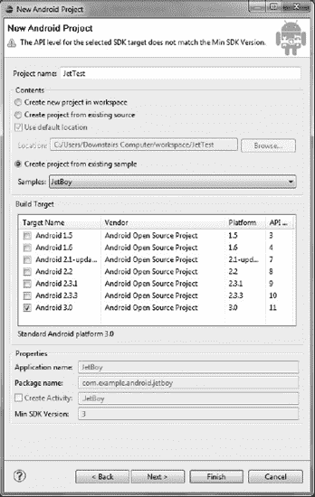

# 四、添加音效、音乐和视频

有了对如何使用精灵和处理用户交互的基本理解，你就离一个完整的、可玩的游戏更近了。现在，您可以添加一些沉浸式游戏体验所必需的元素:音效、音乐和视频。

令人惊讶的是，很多手机游戏都忽略了声音和音乐。也许开发人员很快添加了一些音效或者拼凑了一段简单的旋律，但仅此而已。游戏的音频部分真的可以让你的作品脱颖而出。没有理由在这方面表现不佳，因为这是最容易实现的 Android 游戏功能之一。真正的限制是你可以创作或购买的音乐。一些网站已经注意到了这一点，为商业和非商业项目提供了数千个免费的声音文件。

手机游戏中的视频也未能兑现承诺。这很大程度上可能是由于手机上的小硬盘空间或数据计划的成本。然而，平板电脑拥有千兆字节的存储空间，以及从网站和服务器快速加载媒体的能力。您可以使用快速电影来解释游戏或娱乐玩家，同时加载游戏资源。为游戏玩家提供可靠的乐谱和多媒体展示，无疑会让你的游戏在竞争中脱颖而出。

在本章中，您将创建一个新的 Eclipse 项目，将声音和媒体整合到您的游戏中。然而，首先你要解决处理声音的框架。

 **注**过去，游戏开发商不愿在音效上花费时间和金钱，因为他们认为手机游戏玩家希望能够安静地玩游戏。随着平板电脑的出现，游戏已经转变为一个更加多人和社交的场合，多人可以在屏幕上同时玩游戏；因此，噪音不再是一个问题。然而，游戏必须让玩家有可能关掉声音。

### 为声音做好准备

在你探索 Android 游戏中的声音之前，你需要找到一些可以使用的声音。Android 支持多种声音格式，最流行的有`.mp3`、`.wav`和`.mid`。就个人而言，我更喜欢用 MP3 文件来制作小音效，比如爆炸，用 MIDI 文件来制作乐谱。这是一种常见的做法，在使用流行的文件选择的同时，将文件大小保持在最小。如果你有其他文件格式的声音，你可以在这里访问 Android 的可接受媒体格式列表:`[`developer.android.com/guide/appendix/media-formats.html`](http://developer.android.com/guide/appendix/media-formats.html)`。

一些热爱音频和音乐的人特别感兴趣的是 Android 提供的免费无损音频编解码器(FLAC)支持。FLAC 是一种很像 MP3 的格式，但它保持了声音的原始质量。如果您有自己的录音设备或高质量的文件收藏，这是一个很好的格式。你可以在`[`flac.sourceforge.net`](http://flac.sourceforge.net)`了解更多。只有 Android 3.1 及更高版本支持这种格式。

声音和媒体文件不适合您当前拥有的图像资源文件。要存储它们，您可以将它们添加到您的`resources`文件夹中一个名为`raw`的新文件夹中。该文件夹不是默认创建的，所以您可以自己创建。 *Raw* 是您为任何非版面或图像文件的媒体或杂项文件指定的名称。

现在，让我们为你的 Android 游戏定位一些音效。

#### 寻找并添加音效

让我们测试一些声音；你可以在网上找到很多选择。可以说最好的资源是`[www.freesounds.org](http://www.freesounds.org)`。你必须先在这个网站上开一个账户，然后你就可以自由地浏览它庞大的收藏并下载它的声音文件。这些声音是在知识共享取样加许可证下发布的。基本上，你可以在你的项目中自由使用它们，只要你引用了它们的许可，并对它们的创造者给予了信任。

你不会在这个网站上找到很多完整的歌曲，但有任何可能的游戏的音效。对于本章的例子，我选择了一个 spacey 机器人噪声:`[www.freesound.org/samplesViewSingle.php?id=14259](http://www.freesound.org/samplesViewSingle.php?id=14259)`。是用户 Harri 上传的。

如果你检查网站上的文件格式，大多数都是`.wav`。您可以像使用`.mp3`一样使用它们。

要开始使用声音效果，请按照下列步骤操作:

> 1.  Download a sound file that you find interesting, and temporarily store it on your desktop or a place that you can easily access.
> 2.  Open Eclipse IDE and follow the steps to create a new project. It was named **sounds test** .
> 3.  Open the InputTest project you built in chapter 2 of , and copy all its files to the corresponding folders in SoundsTest, including `star.png` images and all `InputTest.java` codes. Make sure that `GameView.java` and `SpriteObject.java` are in the file you copied.
> 4.  Close the old source code in the edit pane and open the file from the new project.
> 5.  To incorporate new sounds into the SoundsTest project construction, you need to create a new file in its `res` folder. Remember, layout data and images are stored in this folder; But now you are dealing with different file formats for storing media files, so you use a new folder for it.
> 6.  Right-click the `res` folder, select New Folder, and create a new folder. Name the folder `raw`.
> 7.  Find your audio file, copy and paste it into the `raw` folder. As mentioned above, the `raw` folder is used to store resources such as sound and video files.

现在你可以为游戏添加一些声音了。这个过程在许多方面类似于显示图形，但与图像不同，声音有一个持续时间。正因为如此，你用一种简单的方式，播放一次声音，让它继续。

#### 播放声音效果

要访问 Android 播放声音的功能，您需要导入 Android MediaPlayer 库。它的名字准确地解释了它的作用——它被用来在你的游戏中播放声音和视频。这个类包含了很少你需要担心的方法。你在编写代码时会看到它们。

将清单 4-1 中的行添加到`GameView.java`文件的顶部。

***清单 4-1。**获得媒体播放能力*

`Import Android.media.MediaPlayer`

清单 4-2 展示了创建一个媒体播放器对象并发出声音的代码。游戏过程中播放音效只需要两行。不是在游戏启动时播放声音，而是在检测到运动事件时播放。因此，您将加粗的代码添加到函数`processMotionEvent`中；因为您仍然拥有控制图形的所有代码，所以您在屏幕上重新定位 sprite 的代码行下面添加了新代码。这样做有一些问题，你一测试完就知道了:也就是说，只要有动作，你的声音就会播放，即使声音已经在播放了。

***清单 4-2。**运动事件发生时播放声音*

`public void processMotionEvent(InputObject input){
        sprite.setX(input.x);
        sprite.setY(input.y);
        **MediaPlayer robotnoise = MediaPlayer.create(getContext(), R.raw.robot_noise);**
**            robotnoise.start();**
}`

`MediaPlayer`类与您创建的`SpriteObject`类非常相似。你初始化对象，然后给它分配声音——或者，在精灵的情况下，分配图像。然后，您可以自由调用它的各种函数，在本例中，这意味着启动噪声，同时可以移动 sprite。

要看到这一点，启动项目并等待游戏加载。当您拖动屏幕时，您会听到播放的声音。如果您使用的是 Android 模拟器，注意不要连续拖动多次，否则项目会因为使用太多资源反复播放声音而崩溃。

现在让我们来看看如何管理几种声音，每种声音都与特定的活动相关联。几乎没有游戏只用一种声音；而且每当涉及到多种声音的时候，你都要处理同时播放多种声音的可能性。下一节将介绍一个使这个命题变得简单的课程。

#### 管理多重音效

当您考虑与游戏活动(如获得健康或射击物体)相关的声音效果和噪音时，您看到的是可以同时出现或至少非常接近的声音。对于处理大量可以快速播放的声音来说,`MediaPlayer`类并没有很好的配置。为了处理这个难题，您使用了一个稍微复杂一点的名为`SoundPool`的类。把这个类想象成一个对象，当游戏运行时，它在后台监控声音的加载和播放。与调用`MediaPlayer`对象相比，它有几个好处。

清单 4-3 包含了更新`GameView`类以使用`SoundPool`类所需的所有代码。它添加了大量的函数和过程，因此您需要非常小心地正确编写整个文件。当您运行这个应用时，它的功能就像《??》第三章中的 InputTest 应用一样，但是增加了三种每当运动事件发生时播放的声音效果。你可以用一个简单的计数器来循环显示所有的噪音。

清单中的新代码以粗体突出显示。特别要注意你实现的新包以及`SoundPool`是如何工作的。所有这些都在`GameView.java`中完成，不需要操作任何其他类。清单 4-3 展示了`GameView.java`的全貌，所以你可以确信一切都很好。

***清单 4-3。**??`GameView.java`*

`package com.gameproject.soundtest;

import java.util.concurrent.ArrayBlockingQueue;

import android.content.Context;
import android.graphics.BitmapFactory;
import android.graphics.Canvas;
import android.graphics.Color;
**import android.media.AudioManager;**
**import android.media.SoundPool;**
import android.view.MotionEvent;
import android.view.SurfaceHolder;
import android.view.SurfaceView;

public class GameView extends SurfaceView implements
                SurfaceHolder.Callback {

        private SpriteObject sprite;
        private GameLogic mGameLogic;
        private ArrayBlockingQueue<InputObject> inputObjectPool;

**        private int sound_id;**
**        private Context context;**
**        private SoundPool soundPool;**
**        private int ID_robot_noise;**
**        private int ID_alien_noise;**
**        private int ID_human_noise;**

        public GameView(Context con) {
                super(con);
                 **context = con;**
                getHolder().addCallback(this);
                sprite = new SpriteObject(BitmapFactory.decodeResource(getResources(),
R.drawable.star), 50, 50);` `mGameLogic = new GameLogic(getHolder(), this);
                createInputObjectPool();

**                soundPool = new SoundPool(10, AudioManager.STREAM_MUSIC, 0);**

**                ID_robot_noise = soundPool.load(context, R.raw.robot_noise, 1);**
**                    ID_alien_noise = soundPool.load(context, R.raw.alien_noise, 1);**
**                    ID_human_noise = soundPool.load(context, R.raw.human_noise, 1);**

**                sound_id = ID_robot_noise;**

                setFocusable(true);
        }

        private void createInputObjectPool() {
                inputObjectPool = new ArrayBlockingQueue<InputObject>(20);
                for (int i = 0; i < 20; i++) {
                        inputObjectPool.add(new InputObject(inputObjectPool));
                }
        }

        @Override
        public boolean onTouchEvent(MotionEvent event) {
                try {
                        int hist = event.getHistorySize();
                        if (hist > 0) {
                                for (int i = 0; i < hist; i++) {
                                        InputObject input = inputObjectPool.take();
                                        input.useEventHistory(event, i);
                                        mGameLogic.feedInput(input);
                                }
                        }
                        InputObject input = inputObjectPool.take();
                        input.useEvent(event);
                        mGameLogic.feedInput(input);
                } catch (InterruptedException e) {
                }
                try {
                        Thread.sleep(16);
                } catch (InterruptedException e) {
                }
                return true;
        }

        @Override
        public void surfaceChanged(SurfaceHolder holder, int format, int width,
                        int height) {` `}

        @Override
        public void surfaceCreated(SurfaceHolder holder) {
                mGameLogic.setGameState(mGameLogic.RUNNING);
                mGameLogic.start();
        }

        @Override
        public void surfaceDestroyed(SurfaceHolder holder) {
                **soundPool.release();**
        }

        @Override
        public void onDraw(Canvas canvas) {
                canvas.drawColor(Color.BLACK);
                sprite.draw(canvas);
        }

        public void update(int adj_mov) {
                if (sprite.getX() >= getWidth()){
                        //sprite.setMoveX(0);
                }
                if (sprite.getX() <= 0){
                        //sprite.setMoveX(0);
                }
                sprite.update(adj_mov);

        }

        public void processMotionEvent(InputObject input){

**                soundPool.play(sound_id,1.0f,1.0f,10,0,1f);**
**                sound_id++;**
**                if (sound_id == 3){**
**                        sound_id = 0;**
**                }**

                sprite.setX(input.x);
                sprite.setY(input.y);
        }

        public void processKeyEvent(InputObject input){

        }

        public void processOrientationEvent(float orientation[]){

                float roll = orientation[2];
                if (roll < -40) {
                        sprite.setMoveX(2);` `                } else if (roll > 40) {
                        sprite.setMoveX(-2);
                }
        }
}`

它是这样工作的。您可以通过声明一系列变量来开始这个实现:

> *   `Sound_id`: Counter, which determines which sound needs to be played.
> *   `Context`: The method of transferring the instance of the main activity to the sound loading function. You have dealt with this variable before.
> *   `Soundpool`: The only object that controls all kinds of sounds you play.
> *   `ID_robot_noise`: Integer value of robot sound file.
> *   `ID_alien_noise`: Integer value of alien sound file.
> *   `ID_human_noise`: Integer value of voice file.

然后在`GameView`构造函数方法中初始化`soundPool`对象。`SoundPool`有三个参数:同步声音流的整数数量，音频流的整数类型(使用`AudioManager`来提供这个值)，以及一个当前没有使用的质量的整数。

流类型值得注意，因为您选择了最常见的选项。`AudioManager`有其他替代，如`STREAM_ALARM`和`STREAM_RING`；他们处理与其活动相关的音频文件。一个游戏可能永远不需要使用除了`STREAM_MUSIC`以外的任何东西。

接下来的三行加载三个不同的音频样本。当您创建这个项目时，您需要在您的`res` `raw`文件夹中有三个声音样本，它们对应于您传递给`load()`函数的资源 id。`load()`方法的参数非常简单:第一个是应用上下文，第二个是资源 id。最后一个在 Android 当前版本中没有使用。

`load()`函数返回声音的`id`。然后，这将用于调用您想要播放的精确音频文件。最后，你将`sound_ID`分配给第一个音的`id`，这样你就从列表的开头开始了。

在`processMotionEvent()`内，你让`soundPool`播放它的一个音频样本。参数概述如下:

> *   `Integer sounded`: Specify which sound to play.
> *   `Float Left Volume`: Use the maximum volume of 1.0.
> *   `Float Right Volume`: Use the maximum volume of 1.0.
> *   `Integer Priority`: Use 10 at will. The higher the number, the higher the priority.
> *   `Integer Loop`: Use 0 to disable the loop. -1 indicates an infinite loop, and a positive integer indicates a loop in which the value is added by 1 (for example, 5 loops for 6 times).
> *   `Float Playback rate`: Normal play is 1.0\. You can use 0.5 and 2.0 for half speed or double speed respectively.

下一段代码增加了`sound_ID`计数器，并在它遍历完整组声音后重置它。还要注意，在`onSurfaceDestroyed()`下，您为您的`soundPool`对象调用`release()`来解散该对象并清理它所使用的内存。

要了解这是如何工作的，请播放该应用。像以前一样沿着屏幕拖动。每次都会播放不同的声音。然后声音效果列表循环回到开始。

您可以在游戏中的各种应用中使用这种技术。例如，当不同的怪物被消灭时，它们可以发出不同的声音。下一节将介绍如何在特定事件发生时播放声音。

#### 将音效与事件相匹配

前面的例子对于声音循环来说很好，但是在大多数情况下，每个事件都有一个特定的声音。这很容易做到，只要想播放音频，就需要传递正确的声音 id。举个例子，想象一个场景，主角遇到一个恐怖的机器人。你通过播放机器人的声音来提醒玩家新的事件。

在你担心音效之前，你需要弄清楚机器人是否在角色附近。为此，您可以创建一个机器人精灵，并测试这两个精灵是否在一定的像素范围内。不过，对于这个例子，只要说您有办法检测到这种接近就足够了。在您的`GameView.java` `update()`函数中，您有一个`if`语句，如果为真，则调用一个新方法进行响应。下面是伪代码:

`Public void update(adj_mov){

        If(near_robot){

                playsound(robot_noise);
        }
}`

当你开发一个完整的游戏时，你的更新函数将会加载不同的测试来决定需要处理什么。您可以创建一个类似于`robot_encounter()`的独特函数来存放与该事件相关的所有操作，而不是直接播放来自`update()`函数的声音。现在，您需要快速创建一个`playsound()`函数。

`Playsound()`实际上是使用`soundPool.play()`方法的一种更快捷的方式。清单 4-4 显示了代码:将其添加到`GameView.java`。

***清单 4-4。**??`Playsound()`*

`public void playsound(int sound_id){
        soundPool.play(sound_id, 1.0f, 1.0f, 1, 0, 1.0f);
}`

当你在`GameView`类中时，无论你想在哪里播放一段音频，你都可以调用这个函数。当其他游戏需要更多的声音时，你可以创建新的声音 id，然后传递给这个方便的函数。

不用添加太多代码，你肯定增加了游戏的功能。因为声音在游戏过程中不像图像那样旋转或移动，所以它们可以被启动，然后就不动了。你添加到游戏中的新维度将帮助用户更加沉浸在游戏体验中。

### 添加音乐

安卓音乐令人兴奋。一些有趣的技术提供了惊人的功能。在您研究这些选项之前，让我们在游戏过程中播放一个 MIDI 歌曲文件。你的老朋友`MediaPlayer`类完美地实现了这一点，因为它被设计用来播放 Android 中的所有媒体文件。

尽管音乐通常比声音效果长，并且您使用了不同的文件格式，但它的处理方式与前面几节中的声音效果几乎相同。

为了得到免费的音效，你去了`[www.freesounds.org](http://www.freesounds.org)`。对于 MIDI 音频，我用的是`[www.midiworld.com](http://www.midiworld.com)`。该网站提供了一个大型的`.midi`文件库，你可以在自己的作品中使用。在流行类别下，我找到了 ABBA 的《给我一个机会》。让我们将其添加到您的应用中:

> 1.  Download Give me a chance (or the song of your choice) to your desktop. Note that if you have your own MIDI file, Android is very picky about using `.mid` extension instead of `.midi`. In the future, Android may support both of them, but this was a common source of problems in the past.
> 2.  Just like a sound effect, drag or copy the `.mid` file to the `res` `raw` folder of your project. Before you do this, please give it a reasonable name that is easy to retype. I now rename the file `background_music.mid`.
> 3.  With the resource stored correctly, you can view the simple code for running it. First, create a private `MediaPlayer` variable at the beginning of the `GameView` class: `**private MediaPlayer mp;**`
> 4.  Add the bold code below to the `surfaceCreated()` method. This is how you instruct the tablet to start playing music immediately after creating the screen image: `@Override
>     public void surfaceCreated(SurfaceHolder holder) {
>             mGameLogic.setGameState(mGameLogic.RUNNING);
>             mGameLogic.start();
>     
>     **        mp = MediaPlayer.create(getContext(), R.raw.background_music);**
>     **        mp.setLooping(true);**
>     **        mp.start();**
>     }`
> 5.  Because you have already handled a media player, this code should be self-evident. Create the `MediaPlayer` object by loading the appropriate file and passing the application context. You are doing this to prepare the music to be played. Then tell `MediaPlayer` to cycle the sample before starting.
> 6.  To clean up after completion, modify the `surfaceDestroyed()` function with the following code: `@Override
>     public void surfaceDestroyed(SurfaceHolder holder) {
>             soundPool.release();
>             mp.stop();
>             mp.release();
>     }`
> 7.  That's all.
> 8.  Run the SoundsTest application, and you should hear music at the beginning of the game. If you drag the cursor on the screen, the sound from `soundPool` will play along with the music. When you want to play music files in the game, you can use the method you created.

有了播放音效和音乐的能力，你已经完成了对 Android 游戏音频的探索。下一个重要的媒体对象当然是视频。以下部分介绍了如何在游戏中播放剪辑。因为电影是媒体，它们的处理方式和声音一样。

### 添加视频

在游戏中播放视频是不寻常的，但它们在介绍游戏或每个关卡之前有一个非常重要的目的。幸运的是，视频与音乐和其他音频的处理方式非常相似。其实测试一个视频，可以用一个`.3gp`文件代替`.mid`文件。然后，当创建表面时，将播放视频。

在互联网上快速搜索 3GP 视频提供了过多的选择。如果你有`.mp4`格式的音乐视频，你也可以把它们添加到你的`raw`资源文件夹中。清单 4-5 包含了播放这些文件的代码。

***清单 4-5。**播放视频*

`@Override
public void surfaceCreated(SurfaceHolder holder) {
        mGameLogic.setGameState(mGameLogic.RUNNING);
        mGameLogic.start();

        mp = MediaPlayer.create(context, R.raw.intro_video, **holder**);
        mp.setLooping(true);
        mp.start();
}`

请注意，`create()`方法的粗体参数与您播放声音的方式不同。这使用了传递给`surfaceCreated()`函数的`SurfaceHolder`。因为一个视频需要一个表面来播放，你把视频交给你的`SurfaceView`来使用。视频在平板电脑屏幕的左上角播放。

只需一个快速的改变，`MediaPlayer`就可以播放视频了。在播放基本媒体类型方面，您没有其他工作要做！您现在可以播放音效、音乐和视频。下一节回到音乐，并简要介绍了动态音频。这是一个很好的功能，可以让 Android 根据游戏的变化来改变播放的音乐。你不需要理解所有的内容，但这绝对是你在游戏中需要考虑的一个独特的功能。

### 管理音乐

游戏中的图像可以通过旋转、变换和移动来操作。相比之下，音乐是静态的:只能播放和暂停。在 Android 中，你有办法让音乐变得可以随时改变。这是一个相当复杂的技术，你可能需要一段时间才能适应并将其融入到游戏中。在这里，您将通过对该主题的简要概述触及到这个问题的表面。之后，您可以继续探索并将其添加到您的应用中。

以这种方式管理音乐的目的是创造一种更加身临其境的体验。当你看一部高质量的电影时，音乐会根据发生的事情而变化。例如，当主角准备战斗时，激动人心的音乐让你为史诗般的遭遇做好准备。在一个敏感的场景中播放缓慢浪漫的音乐。你可以在一场比赛中取得同样的成绩。理想的结果是游戏的音乐与动作并行。例如，当玩家到达一座岌岌可危的桥时，音乐应该转变成一种不祥的音调。当播放器接近尾声时，美妙的音乐响起。当乐谱不是固定的而是流动的时，游戏变得更加身临其境。

在这个例子中，您使用了`JetPlayer`类来实现这个目的。像`MediaPlayer`类一样，它可以用一些额外的特性来播放 MIDI 文件。它读取解释播放 MIDI 音频各部分的程序的 JET 文件。

在您试验`JetPlayer`如何工作之前，让我们看看如何创建您自己的 JET 内容。Android 的开发者为你创造了一个美好的环境。它叫做 JET Creator 要使用它，你需要在你的电脑上安装 Python。按照以下步骤进行设置:

> 1.  Download the Python version suitable for your computer at `[www.python.org/download/releases/2.7.2/](http://www.python.org/download/releases/2.7.2/)`.
> 2.  按照下载的安装程序的说明进行操作。在安装过程中，您可以选择 Python 的安装位置。参见图 4-1 。
>     
>     ***图 4-1。**一定要记住你把你的计算机编程语言发行版放在哪里.正确安装了 Python 的*
>     
>     
> 3.  wxPython: `[www.wxpython.org/download.php](http://www.wxpython.org/download.php)` needs to be installed. Select the version suitable for your computer again and start the installation process.
> 4.  在安装向导中，将 wxPython 指向您的 Python 安装，如图图 4-2 所示。
>     
>     ***图 4-2。**如果简介找不到您的计算机编程语言安装位置,您可能需要将它指向您安装中的文件夹`Lib\site-packages`.*??
>     
>     
>     
>     注 WxPython 是计算机编程语言编程语言中用于图形用户界面的工具。如果没有它,您将被迫在命令提示符下完成所有工作.
>     
>     
> 5.  Start JET Creator. To do this, please go to `android-sdk\tools\Jet\JetCreator\` in the Android installation directory and double-click `JetCreator.py`. The dialog box shown in Figure ?? and Figure 4-3 ?? appears.  ?? ?? 】 Figure 4-3\. If you don't see the folder path in the open Jet file dialog box, don't worry about clicking the import button on the far right in the open jet file dialog box.
> 6.  Find the path `android-sdk\tools\Jet\demo_content`. Select the ZIP folder named `democontent_1`.
> 7.  When prompted, the folder is allowed to decompress in the default location, usually in the `Jet` folder. You will see the JET Creator program, which lists several different MIDI files.

您可以自己探索 JET Creator 程序，但现在最重要的是知道每个 MIDI 片段可以被分配各种触发它的事件。事件是促使音乐从一首曲子转向另一首曲子的力量。如果您真的对创建自己的事件驱动音乐感兴趣，那么您需要熟练使用 JET Creator。最好的参考资料是在`[`developer.android.com/guide/topics/media/jet/jetcreator_manual.html`](http://developer.android.com/guide/topics/media/jet/jetcreator_manual.html)`的 Android 文档。从那里，你可以编辑演示喷气机的内容，使它适合你自己的游戏中可能发生的事件。

目前，你的游戏还没有现成的事件定义，所以让我们来看看一个名为 JetBoy 的 Android 示例项目中`JetPlayer`的实现。分析完代码后，您就可以在未来的项目中实现 JET Creator 了。

为了测试这个完整的游戏，进入 Eclipse，通过完成新的 Android 项目对话框创建一个新的项目，其内容如图 4-4 所示。

***图 4-4。**测试 Android 示例中的 JetBoy 项目*

在这个项目中，您还有几个值得关注的新文件和对象。因为这是一个完整的博弈，很复杂；然而，没有必要理解整个事情。你只需要处理`JetPlayer`类是如何实现的。以下是您正在处理的文件的快速分类:

> *   `JetBoy.zip`: found in `JetBoy_content` folder. Contains MIDI sequences and other information for playing streaming music.
> *   `Level1.jtc`: found in `res` `raw` folder. Generated by JET Creator, with instructions for playing audio.
> *   `Asteroid.java`: `Asteroid` class, which contains some variables.
> *   `Explosion.java`: Class for handling explosive variables.
> *   `JetBoy.java`: The main activity that pushes most of the logic processing to `JetBoyView.java`.
> *   `JetBoyView.java`: The largest piece of code, which handles `JetPlayer` music content and runs the game engineer.

为了充分理解这个实现，我将重要的方法从`JetBoyView.java`文件复制到了清单 4-6 。下面是一个简短的解释。

***清单 4-6。**??`JetPlayer`*

`private void initializeJetPlayer() {

    mJet = JetPlayer.getJetPlayer();

    mJetPlaying = false;

    mJet.clearQueue();

    mJet.setEventListener(this);

    Log.d(TAG, "opening jet file");

    mJet.loadJetFile(mContext.getResources().openRawResourceFd(R.raw.level1));

    Log.d(TAG, "opening jet file DONE");

    mCurrentBed = 0;
    byte sSegmentID = 0;

    Log.d(TAG, " start queuing jet file");

    mJet.queueJetSegment(0, 0, 0, 0, 0, sSegmentID);

    mJet.queueJetSegment(1, 0, 4, 0, 0, sSegmentID);

    mJet.queueJetSegment(1, 0, 4, 1, 0, sSegmentID);

    mJet.setMuteArray(muteMask[0], true);

    Log.d(TAG, " start queuing jet file DONE");

}`

下面是`JetPlayer`的工作方式。首先，`JetPlayer`从其队列中清除任何先前的文件或序列。这为接下来的操作提供了一个干净的石板。然后，它加载包含所需信息的文件，这一点我在前面已经指出。记住，这是使用 JET Creator 应用创建的。

起始序列设置为 0。激励元素是`queueJetSegment()`:该函数加载 MIDI 的序列。它有一长串用于改变音频的参数，如 Android SDK 的表 4-1 中所解释的。

当您查看实现时，添加这些段更有意义。清单 4-7 包含了`JetBoyView.java`中`run()`和`updateGameState()`函数的代码。

***清单 4-7。** JetBoy 游戏循环*

`public void run() {
                  while (mRun) {
                Canvas c = null;

                if (mState == STATE_RUNNING) {

                    updateGameState();

                    if (!mJetPlaying) {

                        mInitialized = false;` `Log.d(TAG, "------> STARTING JET PLAY");
                        mJet.play();

                        mJetPlaying = true;

                    }

                    mPassedTime = System.currentTimeMillis();

                    if (mTimerTask == null) {
                        mTimerTask = new TimerTask() {
                            public void run() {
                                doCountDown();
                            }
                        };

                        mTimer.schedule(mTimerTask, mTaskIntervalInMillis);

                    }

                }
                else if (mState == STATE_PLAY && !mInitialized)
                {
                    setInitialGameState();
                } else if (mState == STATE_LOSE) {
                    mInitialized = false;
                }

                try {
                    c = mSurfaceHolder.lockCanvas(null);
                    doDraw(c);
                } finally {
                    if (c != null) {
                        mSurfaceHolder.unlockCanvasAndPost(c);
                    }
                }
            }
        }

        /**
         * This method handles updating the model of the game state. No
         * rendering is done here only processing of inputs and update of state.
         * This includes positions of all game objects (asteroids, player,
         * explosions), their state (animation frame, hit), creation of new
         * objects, etc.
         */
        protected void updateGameState() {
            while (true) {
                GameEvent event = mEventQueue.poll();
                if (event == null)
                    break;`  `if (event instanceof KeyGameEvent) {

                    mKeyContext = processKeyEvent((KeyGameEvent)event, mKeyContext);

                    updateLaser(mKeyContext);

                }
                else if (event instanceof JetGameEvent) {
                    JetGameEvent jetEvent = (JetGameEvent)event;

                    if (jetEvent.value == TIMER_EVENT) {
                        mLastBeatTime = System.currentTimeMillis();

                        updateLaser(mKeyContext);

                        updateExplosions(mKeyContext);

                                            updateAsteroids(mKeyContext);
                    }

                    processJetEvent(jetEvent.player, jetEvent.segment, jetEvent.track,
                            jetEvent.channel, jetEvent.controller, jetEvent.value);
                }
            }
        }`

虽然这段代码很难，但实际上对`JetPlayer`做的事情很少；一旦添加了代码，其他游戏就不需要做很大的改动。回想一下，在`run()`函数中，你有`mjet.play()`。这将初始化任何需要播放的音频序列。

`updateGameState()`通过改变`jetEvent`触发`JetPlayer`的变化。在这一领域，你也与爆炸、激光和小行星打交道。更新当前事件非常简单:将事件转换成`JetGameEvent`格式。最后，最后一行调用决定音乐对新事件的响应的函数。

如果你理解了`JetPlayer`，那么你已经准备好通过编辑 JetBoy 游戏来实现它了。如果您不确定这段代码以及它是如何工作的，不要担心；JET audio 是 Android 媒体功能中一个很酷但并不重要的方面。

### 总结

在本章中，您探索了 Android 的多媒体功能，包括播放音效、音乐和视频的能力。你也看到了这些媒体是如何融入游戏的。

这是一次旋风式的旅行。随着您自己的游戏越来越先进，您将继续探索这些特性。你可以通过声音和音频以及视频的适当实现来使你的游戏更加身临其境。

有了更多令人兴奋的技术，让我们在下一章继续为游戏玩家建立一个更加身临其境的体验。