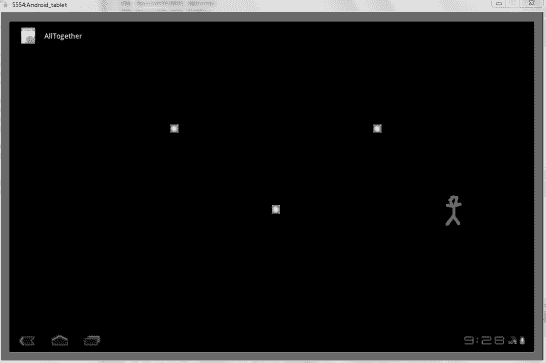
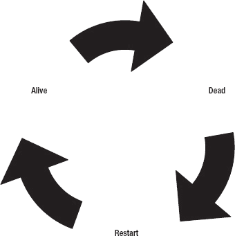

# 五、有障碍的单人游戏

在了解了平板电脑游戏的图形、声音和输入之后，您就拥有了一个简单游戏所必需的所有构件。在这一章中，你将它们放在一起，构建一个简单的游戏，并为一些真正令人敬畏的创作做好准备。但是，即使要构建最简单的游戏，你也需要能够跟踪精灵，让它们遵守一些基本的物理定律，并以一种吸引用户参与的方式将它们组合起来。

在这一章中，你建立了一个有一些障碍的单人游戏。结果是一个简单的游戏，吸引了玩家。所有这些都是通过使用精灵来完成的。用户和精灵之间的交互以及精灵到精灵的交互构成了本章的核心。下一节将介绍如何构思你的第一个真正的游戏。

### 计划一个单人游戏:AllTogether

对于您的第一个可玩游戏，您创建了一个未爆炸的炸弹场和一个角色，其目标是从一边到另一边，而不触及一个。为了让游戏更具挑战性，你要让炸弹动起来。让我们把这个游戏叫做 AllTogether，因为它包含了你到目前为止所做的一切。

在编写代码之前，您需要做一些规划。例如，这里有一些在大多数游戏中常见的元素。不是每个游戏都有这些，但在大多数情况下，你可以在一个典型的游戏中看到它们:

> *   A user-controlled character (protagonist) faces obstacles and challenges in the game and must overcome them.
> *   Terrible consequences, this is the result that the protagonist faces because he fails to overcome the obstacles in the game.
> *   Success reward

这些元素可能看起来太明显了，但是它们对于正确塑造你的游戏是至关重要的。请注意，第一个标准与玩家控制整个世界的策略游戏无关。你在第九章中使用了一个策略游戏，所以你可以看到它是如何完成的。

列表上的第一项是 90%的程序的来源。如果你想象你最喜欢的游戏，几乎所有的事情都是为了达到特定的目标和战胜特定的关卡。最后两项通常很快，仅仅是赋予游戏意义。失败可能意味着在水下耗尽空气，在这种情况下，你的角色会死亡。或者，你可能无法足够快地完成这一关，你必须重新开始。当你到达终点或者杀死最后的 boss 时，成功是显而易见的。

我为这个例子创建的游戏已经处理了前两个元素。你在这一章的后面添加最后一个。为了简单起见，我想创建一个游戏，其中用户必须导航三个上下滑动的物体。用户必须仔细计时炸弹，然后快速反应。

如果用户击中了其中一个炸弹，他们会被送回起点，并被允许再试一次。游戏一直继续，直到他们厌烦了，关掉游戏。在查看了原始代码之后，您添加了一些特性，比如显示胜利消息的能力，这样用户就可以认识到他们的成功。看一下图 5-1 中的成品。

***图 5-1。**击败游戏*

有了这个游戏的快速概览，你就可以把它变成现实了。

### 构建单人游戏

因为你已经在前几章做了这么多工作，你不需要改变很多东西来构建你的第一个真正的游戏。对于你的单人游戏，上一章中唯一需要修改的文件是`SpriteObject.java`和`GameView.java`:

> 1.  Open a new Eclipse project and name it **all together** .
> 2.  Copy all files of SoundTest project in chapter 4 of . Don't forget to copy Java source files in `src` folder and resource files in `rsc` folder.

在你开始改变之前，让我们回顾一下处理运动和碰撞的过程。

#### 升级游戏精灵

你首先升级你的精灵，这样你就可以更好地控制它们的运动，并检测它们之间或与游戏边界的碰撞。从现在开始，这个特性将会对你的所有工作有所帮助。

##### 增加更精细的运动控制

对于你的新游戏来说，你上一个应用的速度太快了。为了给你更大的控制，让我们增加变量的精度，控制精灵的位置和每次移动的大小。

通过将 movement 和 location 变量转换为 Java 类型`double`来完成更改。现在，当你想增加或减少一个精灵的速度时，你可以用一个小数来增加这些值，而不是局限于整数值。

当你想要更慢的速度时，这种能力是至关重要的。新游戏有 0.5 的移动调整，这在以前是不可能的——在第四章中，最低移动值是 1。为此，您需要更改 sprite 类中的函数以及变量声明。

要改变游戏精灵的运动和位置变量的精度，打开`SpriteObject.java`并将清单 5-1 中的代码添加到`SpriteObject`类的定义中。

***清单 5-1。**提高游戏位置精度和速度*

`private double x;
private double y;
private double x_move = 0;
private double y_move = 0;`

接下来，您需要一些新代码来检测对象之间的冲突。碰撞检测几乎是每个视频游戏的一个关键方面。

##### 检测精灵之间的碰撞

下一个大的变化需要在`SpriteObject`类中有一个全新的函数来处理冲突。如果你以前做过 2D 碰撞检测，这个解决方案看起来会很熟悉。该函数测试两个矩形的冲突。回想一下，因为 Android 中的屏幕的原点在左上角，所以如果第一个 sprite 的底部小于另一个 sprite 的顶部，那么就不会发生碰撞，因为第一个 sprite 位于屏幕上第二个 sprite 的上方。

如果两个精灵之间有冲突，那么新方法返回 true。有趣的是，当您搜索碰撞时，您使用位图来收集宽度。sprite 类不直接存储宽度或高度，因为它已经包含在位图中。您可以使用这种方法在以后为与墙壁的碰撞获取精灵的尺寸。

与任何需要一系列`if`语句的函数一样，您的碰撞检测在处理方面是相当昂贵的。如果可能的话，您希望消除不必要的冲突例程。然而，这比逐像素检测要好得多，逐像素检测会导致游戏几乎停止。

将清单 5-2 中的函数添加到`SpriteObject`类中。

***清单 5-2。**sprite object 类中的碰撞检测功能*

`public boolean collide(SpriteObject entity){
                double left, entity_left;
                double right, entity_right;
                double top, entity_top;
                double bottom, entity_bottom;

                left = x;
                entity_left = entity.getX();

                right = x + bitmap.getWidth();
                entity_right = entity.getX() + entity.getBitmap().getWidth();

                top = y;
                entity_top = entity.getY();

                bottom = y + bitmap.getHeight();
                entity_bottom = entity.getY() + entity.getBitmap().getHeight();

                if (bottom < entity_top) {
                        return false;
                }
                if (top > entity_bottom){
                        return false;
                }
                if (right < entity_left) {
                        return false;
                }
                if (left > entity_right){
                        return false;
                }

                return true;
        }`

在清单 5-2 中，你为两个精灵的每个角收集 x 和 y 坐标。请记住，一个 sprite 调用函数，并使用第二个 sprite 作为参数。哪个精灵调用这个函数并不重要。结果将是一样的:不是对就是错。一旦你有了数据，你进入四个`if`陈述。它们检查第一个精灵的底部是否低于另一个精灵的顶部。如果这是真的，那么第一个精灵将在另一个精灵之上，碰撞将是不可能的。接下来的`if`语句在检查两个精灵的位置时是相似的。如果没有一个`if`陈述是有效的，那么事实上就有冲突。

##### 添加多个精灵

您的修改主要发生在`GameView`类中，在那里您对更新函数进行了一些重大修改。创建一个名为`bomb[]`的`SpriteObject`数组可能是最重要的修改。因为炸弹的行为都是一样的，这样分组比单独处理要方便得多。这样做也消除了不必要的代码重复。

每个新炸弹精灵的初始化也很有趣，因为它们在屏幕上的位置。第一个和最后一个精灵在屏幕的底部开始，而第二个精灵在顶部附近。这在游戏过程中产生了交错运动，增加了难度。当您移动到`surfaceCreated`功能时，第一个和最后一个炸弹向屏幕顶部移动，中间的炸弹向底部移动。

当你定义炸弹的运动时，你使用了 sprite 类中可以处理小数的新变量。做了一些测试，发现 1 的速度移动太快了，就减半用. 5。为了把你的炸弹放在屏幕上，`onDraw()`功能使用一个快速循环来循环三个炸弹。

`update`功能蕴含了游戏的魔力。在这里你定义了炸弹和玩家之间的关系以及炸弹的行为。前两个`for`循环防止炸弹超出游戏边界；你想让炸弹在 y 坐标 100 和 500 之间来回反弹。下一个`for`循环检查你的主精灵是否与任何炸弹相撞。如果发生碰撞，精灵会在课程开始时重置。

通过将`update`函数改为清单 5-3 中的代码来完成它。

***清单 5-3。**新的 update()函数来控制炸弹。*

`//check for bombs going too low
for(int i = 0; i < 3; i++){
        if(bomb[i].getY() > 500){
                bomb[i].setMoveY(-.5);
        }
}

//check for bombs going too high
for(int i = 0; i < 3; i++){
        if(bomb[i].getY() < 100){
                bomb[i].setMoveY(.5);
        }
}

//check for collisions with the sprite
for(int i = 0; i < 3; i++){
        if(spritecharacter.collide(bomb[i])){
                charactersprite.setX(100);
        }
}

//perform specific updates
for(int i = 0; i < 3; i++){
        bomb[i].update(adj_mov);
}                
        spritecharacter.update(adj_mov);`

最后，调用炸弹和精灵的`update`函数。清单 5-4 中的所示的`processMotionEvent`也有一些关键的特征变化。两个`if`语句寻找用户占用和脱离屏幕的信号事件。当用户触摸屏幕时，精灵向前移动。否则，精灵将停留在屏幕上的当前位置。这种移动方式类似于你试图在洞穴中导航的直升机游戏:直升机向地面移动，除非你点击屏幕让它上升。

***清单 5-4。** processMotionEvent()方法处理触摸和释放*

`if(input.action == InputObjectinput .ACTION_TOUCH_DOWN){
        spritecharacter.setMoveX(.5);
}
if(input.action == InputObjectinput .ACTION_TOUCH_UP){
        charactersprite.setMoveX(0);
}`

您的工作的代码部分已经完成。现在让我们来处理游戏中的图形。

##### 为精灵添加图像

你的努力就要开花结果了。但是在编译项目之前，必须向项目中添加两个资源:一个炸弹图像和一个表示角色(或玩家)的图形。它们都被保存为`.png`文件，角色使用透明背景，所以看起来不像一个移动的斑点。炸弹尺寸为 30 × 30，字符尺寸为 70 × 120。

 **小贴士**如果你的图片给人的印象不深刻，不要担心；关键是要有东西可以用。在普通纸上画画，然后扫描图像是提高工作质量的一个简单策略。用绘图程序润色这幅画。或者，学习使用基于矢量的程序可以给你的艺术一个巨大的提升。

像处理任何其他应用一样，在模拟器中编译并运行这个项目。如果一切顺利，按住屏幕，你应该推动你的角色前进。如果你撞上了炸弹，你要重新开始。好好享受！

下一节通过引入奖励使兴奋度更高。

#### 增加赢得游戏的奖励

这个简单的应用有几个关键点:

> *   You added an obstacle in the form of a bomb. This is aggravated by eccentric control, which can't give users precise movement.
> *   The response of failure returns to the beginning of the game. If you are caught by the last bomb, it will be even more serious.
> *   Having characters similar to people can increase players' interest. You don't do this by moving stars on the screen as in previous chapters.

你可以通过提供获胜的实际好处来使这个游戏变得更好。要做到这一点，试着制作一个如图图 5-2 所示的精灵，当玩家达到某个 x 值时调用它的`draw()`函数。将一个变量设置为`true`,这样标志会继续呈现，让用户沉浸在他们的荣耀中。这一点在本章的最终代码中没有涉及，因为它不是核心概念之一。但是，您可以自由添加它。

***图 5-2。**奖励玩家*

#### 跟踪游戏精灵的状态

因为精灵或整个游戏可能处于不同的位置或状态，所以您需要开发一种方法来跟踪它们。为了概念化状态，请看图 5-3 。它显示了三种不同状态的循环。

***图 5-3。**循环状态*

如图 5-3 所示，在游戏过程中，状态很容易改变。游戏也经历生命周期，包括启动、循环和结束阶段。在 Android 和许多其他环境中，状态被定义为可以从各种其他类中访问的整数。

 **注意**当你试图找出什么类型的`motionevent`发生时，你已经使用了状态。`if`语句决定了`eventtype`是向上还是向下动作，两者都是在`InputObject`类中定义的整数值。

所有这些代码都放入您的`SpriteObject`类，在那里您处理每个 sprite 的状态。炸弹之类的精灵不一定有不同的状态，所以你不用为它们使用这些特性。在您自己的游戏中，您可能更喜欢创建独立的 sprite 类，这些类继承了高级类的基本特性，然后使用更具体的方法和变量来区分 sprite 子类。

请遵循以下步骤:

> 1.  在`SpriteObject.java`顶部创建四个基本状态作为整数(见清单 5-5 )。
>     
>     ***清单 5-5。**代表精灵状态的常数*
>     
>     `public int DEAD = 0;
>     public int ALIVE = 1;
>     public int JUMPING = 2;
>     public int CROUCHING = 3;`
> 2.  我个人的偏好一直是将`DEAD`赋值为 0，因为你经常会有默认状态等于 0，为了让精灵活下来而执行某种动作(比如初始化关卡)是有意义的。国家的另一个重要方面是它们应该是排他性的。这意味着角色不能同时处于一种以上的状态。在初始化之前，角色一开始总是死的。从那时起，他们默认是活着的，直到一个动作被执行，如跳跃或被杀死..你需要创建两个快速函数来处理精灵状态。将清单 5-6 中显示的函数放入`SpriteObject.java`中。
>     
>     ***清单 5-6。** getstate()和 setstate()函数*
>     
>     `**public** **int** getstate(){
>             **return** state;
>     }
>     
>     **public** **void** setstate(**int** s){
>             state = s;
>     }`
> 3.  These functions should look familiar, because this is how you access the X and Y coordinates of the wizard.
> 4.  因为你定义的状态是公共整数，你可以用清单 5-7 中的代码在`GameView.java`中测试一个 sprite 是否死了。将此代码添加到`update`函数中。
>     
>     ***清单 5-7。**如果角色死了就重置角色*
>     
>     `if(character.getstate() == SpriteObject.DEAD){
>             character.setX(100);
>             character.setY(400);
>     }`
> 5.  Pay attention to how simple it is to deal with basic information, such as what is happening to elves at present. It becomes more and more important when you see a complicated state like jumping. The elf was the fastest when he first left the ground. Then it gradually decreases until sprite reaches its peak height, and then it gradually accelerates. The change speed of sub-picture must be controlled within `update` function. You need to find out what state the elves are in, so as to change `moveY` at the right rate. For example, a normal jump will last for a predictable period of time. But what if the jump is interrupted by hitting the platform? You use the status to quickly evaluate the new situation.
> 6.  In order to completely merge the states in the game, put the code lines in Listing 5-8 into `if` statement to test the collision between characters and bombs. This is an alternative method to reset the position of the character when the bomb is hit, rather than being executed immediately in the conditional collision test.

***清单 5-8。**开始把人物当成死人。*

`Character.setState(SpriteObject.DEAD);`

所有这些功能都包含在清单 5-9 和清单 5-10 的代码中。如果你迷路了，在你的项目中使用这段代码，你应该会得到一个可用的游戏。

***清单 5-9。**??`SpriteObject.java`*

`package com.gameproject.alltogether;

import android.graphics.Bitmap;
import android.graphics.Canvas;

public class SpriteObject {

        **public int <ins>DEAD</ins> = 0;**
        **public int <ins>ALIVE</ins> = 1;**
        **public int <ins>JUMPING</ins> = 2;**
        **public int <ins>CROUCHING</ins> = 3;**

private Bitmap bitmap;
**        private double x;**
**        private double y;**
**        private double x_move = 0;**
**        private double y_move = 0;**`  `public SpriteObject(Bitmap bitmap, int x, int y) {
                this.bitmap = bitmap;
                this.x = x;
                this.y = y;
        }

        public double getX() {
                return x;
        }
        public double getY() {
                return y;
        }

        public Bitmap getBitmap() {
                return bitmap;
        }

        public void setMoveX(**double** speedx){
                x_move = speedx;
        }
        public void setMoveY(**double** speedy){
                y_move = speedy;
        }
        public void setX(int x) {
                this.x = x;
        }

        public void setY(int y) {
                this.y = y;
        }
        public void setBitmap(Bitmap bitmap) {
                this.bitmap = bitmap;
        }

**        public int getstate(){**
**                return state;**
**        }**

**        public void setstate(int s){**
**                state = s;**
**        }**

        public void draw(Canvas canvas) {
                canvas.drawBitmap(bitmap, (int)x - (bitmap.getWidth() / 2), (int)y - (bitmap.getHeight() / 2), null);
        }`  `public void update(int adj_mov) {
                        x += (adj_mov * x_move);
                        y += (adj_mov * y_move);
        }

**        public boolean collide(SpriteObject entity){**
**                double left, entity_left;**
**                double right, entity_right;**
**                double top, entity_top;**
**                double bottom, entity_bottom;**

**                left = x;**
**                entity_left = entity.getX();**

**                right = x + bitmap.getWidth();**
**                entity_right = entity.getX() + entity.getBitmap().getWidth();**

**                top = y;**
**                entity_top = entity.getY();**

**                bottom = y + bitmap.getHeight();**
**                entity_bottom = entity.getY() + entity.getBitmap().getHeight();**

**                if (bottom < entity_top) {**
**                        return false;**
**                }**
**                if (top > entity_bottom){**
**                        return false;**
**                }**
**                if (right < entity_left) {**
**                        return false;**
**                }**
**                if (left > entity_right){**
**                        return false;**
**                }**

**                return true;**
**        }**

}`

我们现在来看看`GameView.java`中的代码，它将这些新赋予的精灵付诸行动。

***清单 5-10。** `GameView.java`*

`package com.gameproject.alltogether;`  `import java.util.concurrent.ArrayBlockingQueue;

import android.content.Context;
import android.graphics.BitmapFactory;
import android.graphics.Canvas;
import android.graphics.Color;
import android.media.AudioManager;
import android.media.MediaPlayer;
import android.media.SoundPool;
import android.util.Log;
import android.view.MotionEvent;
import android.view.SurfaceHolder;
import android.view.SurfaceView;

public class GameView extends SurfaceView implements
                SurfaceHolder.Callback {

        private SpriteObject character;
**        private SpriteObject[] bomb;**

        private GameLogic mGameLogic;
        private ArrayBlockingQueue<InputObject> inputObjectPool;

        private int sound_id;
        private Context context;
        private SoundPool soundPool;
        private int ID_robot_noise;
        private int ID_alien_noise;
        private int ID_human_noise;
        private MediaPlayer mp;

        public GameView(Context con) {
                super(con);
                context = con;
                getHolder().addCallback(this);
                character = new SpriteObject(BitmapFactory.decodeResource(getResources(),
R.drawable.sprite), 100, 400);

**                bomb = new SpriteObject[3];**
**                bomb[0] = new SpriteObject(BitmapFactory.decodeResource(getResources(),**
**R.drawable.bomb), 400, 500);**
**                bomb[1] = new SpriteObject(BitmapFactory.decodeResource(getResources(),**
**R.drawable.bomb), 650, 100);**
**                bomb[2] = new SpriteObject(BitmapFactory.decodeResource(getResources(),**
**R.drawable.bomb), 900, 500);**

                mGameLogic = new GameLogic(getHolder(), this);
                createInputObjectPool();`  `soundPool = new SoundPool(10, AudioManager.STREAM_MUSIC, 0);

                ID_robot_noise = soundPool.load(context, R.raw.robot_noise, 1);
            ID_alien_noise = soundPool.load(context, R.raw.alien_noise, 2);
            ID_human_noise = soundPool.load(context, R.raw.human_noise, 3);

                sound_id = ID_robot_noise;

                setFocusable(true);
        }

        private void createInputObjectPool() {
                inputObjectPool = new ArrayBlockingQueue<InputObject>(20);
                for (int i = 0; i < 20; i++) {
                        inputObjectPool.add(new InputObject(inputObjectPool));
                }
        }

                @Override
                public boolean onTouchEvent(MotionEvent event) {
                        try {
                                int hist = event.getHistorySize();
                                if (hist > 0) {
                                        for (int i = 0; i < hist; i++) {
                                                InputObject input = inputObjectPool.take();
                                                input.useEventHistory(event, i);
                                                mGameLogic.feedInput(input);
                                        }
                                }
                                InputObject input = inputObjectPool.take();
                                input.useEvent(event);
                                mGameLogic.feedInput(input);
                        } catch (InterruptedException e) {
                        }
                        try {
                                Thread.sleep(16);
                        } catch (InterruptedException e) {
                        }
                        return true;
                }

        @Override
        public void surfaceChanged(SurfaceHolder holder, int format, int width,
                        int height) {
        }`  `@Override
        public void surfaceCreated(SurfaceHolder holder) {
                mGameLogic.setGameState(mGameLogic.RUNNING);
                mGameLogic.start();
                **bomb[0].setMoveY(-.5);**
                **bomb[1].setMoveY(.5);**
                **bomb[2].setMoveY(-.5);**
                 mp = MediaPlayer.create(context, R.raw.background_music);
                mp.setLooping(true);
                mp.start();
        }

        @Override
        public void surfaceDestroyed(SurfaceHolder holder) {
                soundPool.release();
                mp.stop();
                mp.release();
        }

        @Override
        public void onDraw(Canvas canvas) {
                canvas.drawColor(Color.GRAY);
                character.draw(canvas);
                **for(int i = 0; i < 3; i++){**
                        **bomb[i].draw(canvas);**
                **}**
        }

**        public void update(int adj_mov) {**
                if(character.getstate() == SpriteObject.DEAD){
                character.setX(100);
                character.setY(400);
                }

**                //check for bombs going too low**
**                for(int i = 0; i < 3; i++){**
**                        if(bomb[i].getY() > 500){**
**                                bomb[i].setMoveY(-.5);**
**                        }**
**                }**

**                //check for bombs going too high**
**                for(int i = 0; i < 3; i++){**
**                        if(bomb[i].getY() < 100){**
**                                bomb[i].setMoveY(.5);**
**                        }**
**                }**

**                //check for collisions with the sprite**
**                for(int i = 0; i < 3; i++){**` `**                        if(character.collide(bomb[i])){**
**                                character.setState(SpriteObject.DEAD);**
**                        }**
**                }**

**                //perform specific updates**
**                for(int i = 0; i < 3; i++){**
**                        bomb[i].update(adj_mov);**
**                }**
                character.update(adj_mov);

        }

        public void processMotionEvent(InputObject input){

**                if(input.action == InputObject.ACTION_TOUCH_DOWN){**
**                        sprite.setMoveX(.5);**
**                }**
**                if(input.action == InputObject.ACTION_TOUCH_UP){**
**                        sprite.setMoveX(0);**
**                }**

        }

        public void processKeyEvent(InputObject input){

        }

        public void processOrientationEvent(float orientation[]){

                float roll = orientation[2];
                if (roll < -40) {
                        character.setMoveX(2);
                } else if (roll > 40) {
                        character.setMoveX(-2);
                }

        }

        public void playsound(int sound_id){
                soundPool.play(sound_id, 1.0f, 1.0f, 1, 0, 1.0f);
        }

}`

经历了所有这些变化后，你已经掌握了状态的概念，也处理了碰撞和精确的运动。

### 总结

你终于完成了你的第一个游戏。恭喜你！您还创建了可以在未来游戏中使用的代码。添加精灵状态正是你需要的功能，让你的玩家更好地控制他们的角色。几乎任何 2D 游戏现在都在你的掌握之中。您未来的项目将大量使用高效的碰撞检测方法。

接下来的几章调查了几种不同的游戏类型，它们利用了平板电脑的屏幕空间、处理能力和输入功能。第六章讲述了一个更复杂的游戏，玩家可以用球拍将球击成方块:著名的突围游戏。那里的主要问题是处理物理学。