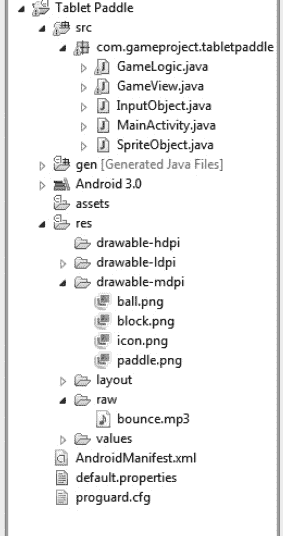
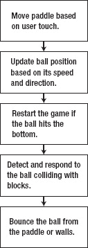
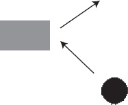
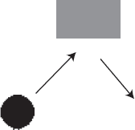
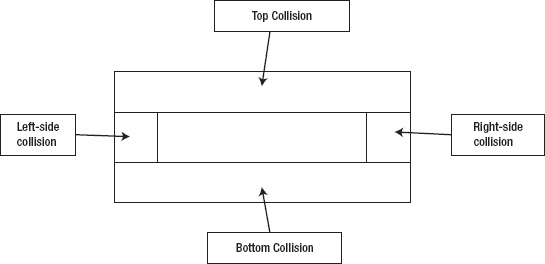
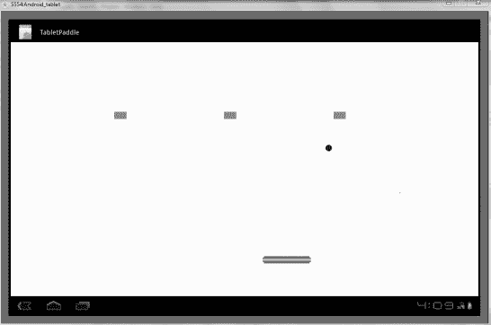

# 六、球和球拍的游戏

在第五章中，你构建了一个简单的游戏，玩家躲避移动的炸弹。这给了你一个借口来使用许多在 Android 平板电脑上创建游戏的核心功能和编程概念。在这一章中，你将构建一个更复杂的游戏。

你在这一章的主要任务是建立一个 pong 类型的游戏，在这个游戏中，玩家使用一个球拍来保持球的弹跳，同时他们试图用球撞击和破坏方块。我第一次体验手机游戏是在一台旧的黑莓手机上，当时唯一的产品就是这个简单的游戏。我不得不用笨拙的黑莓轨迹球来控制球拍，小屏幕和低分辨率使这种努力不太令人满意。令人惊讶的是，这个游戏是用功能强大的 Java 语言编写的，您可以用它来创建更吸引人、更有趣的游戏。

当您构建球拍游戏时，您将掌握新的技能，并将其添加到您的工具箱中。向资源文件中添加额外的图像。你用球拍和木块替换了第五章的角色和炸弹。为了让球保持运动，您需要管理精灵的交互并检测更多的碰撞。你必须在游戏中加入一些额外的物理元素，需要更多的即时计算。你也可以用声音和消失的方块更有效地奖励玩家。最后，您将学习用单个 XML 布局文件初始化多个块的技术。

我们开始吧。

### 开始使用

让我们从收集你将在游戏中使用的图片和其他资源开始，然后为你的工作打开一个新的项目。

#### 收集游戏资源

因为 pong 风格的游戏使用相当普通的形状和物体，所以制作图形应该不会有太大的困难。当然，最重要的考虑是每个元素的相对比例和大小。球拍必须足够大，能够始终如一地击球，但又足够小，这对球员来说是一个挑战。你可以看到，如果你想让能量和奖金出现在屏幕上，可以添加其他图像。

图 6-1 显示了你在这个游戏中使用的图片和尺寸。注意，它们都是不同的`.png`文件。对于我的实现，我自己用 GIMP 画的，GIMP 是第二章提到的一个开源工具。

除了常规的图形和声音之外，第七章将结合使用一种新的资源来存储关卡的布局。不用在每个块的位置编码，而是用 XML 布局指定它。这是这个项目的棘手部分，所以我把它留到下一章。第一次演示仅使用了三个模块，没有任何额外的放置资源。

***图 6-1。**方块(上图)为 30 × 50 像素，球(中图)为 30 × 30 像素，球拍(下图)为 30 × 200 像素。*

如果你担心使用黑球(因为背景传统上是黑色的)，不要害怕。你可以很容易地改变背景的颜色。事实上，使用更浅的颜色会让游戏对玩家更有吸引力。

 **提示**球拍和球的图像是半透明的。您可以通过在 GIMP 程序中选择白色透明来做到这一点。我强烈建议你也这样做，因为如果你不完全处理方块，这个游戏会显得更专业。当其他语言需要代码使元素透明时，您很幸运能够使用带有透明层的图像。

如果你在玩游戏的时候有一些好听的声音，这个游戏会更加令人身临其境。因为乒乓球游戏不会发出一系列不同的声音，所以你可以随心所欲地使用任何声音。我选择只使用一种声音:每当球与砖块碰撞时都会播放的一小段 MP3“twang”。代码不包括任何其他噪音或音乐，但你可以自由添加它们。当你开始一个新游戏时，它越简单，就越容易发现你代码中的错误和 bug。

#### 创建新项目

因为你的游戏是完整的(也就是它有用户交互，有目标，有获胜的能力)，所以你应该把它当作一个专业的 app，而不是一个练习。因此，最好对元素和代码使用特定的名称。所以，我们就把这个 app 命名为 TabletPaddle 吧。虽然没有创意，但这个名字描述了你对 pong 风格游戏的新看法。

要开始，请按照下列步骤操作:

> 1.  Make an Eclipse project with your name, and copy the code in the AllTogether project to your new project. Create a new folder in `res` and name it `raw` to store the new sounds you added.
> 2.  Upload your assets to its specific folder. Figure 6-2 shows what the project settings look like.  ?? * ?? 】 Figure 6-2\. Correct setting of test pad items*
> 3.  If there is an error at the beginning of the project, it is because the graphics and sound files that the code is looking for are missing. When you use the application, you can solve this problem in the code.
> 4.  Open the `SpriteObject.java` and `GameView.java` files in the edit pane. You can leave other source files alone.

现在你已经收集了资源，并为 TabletPaddle 打开了一个新项目，你可以编写你需要的游戏元素了，准备好使用它们的界面，并调整游戏循环。

### 准备游戏环境

在处理的游戏循环之前，您必须启动所有这些新精灵——球拍、球和方块——每个精灵都有不同的属性和特性。你还必须准备好使用精灵的环境——游戏界面。让我们从更改您在上一节中打开的源文件开始，为您的新游戏做准备。

#### 修改 SpriteObject.java

`SpriteObject.java`需要一个额外的函数来返回`MoveX`和`MoveY`值，它们是存储精灵水平和垂直速度的变量。通过这种方式，您可以轻松地反转它们，使球改变方向。在其他类型的游戏中，你可能想要检查精灵的速度，以确保它不会太快。

请遵循以下步骤:

> 1.  Add the following two methods in `SpriteObject.java`: `public double getMoveY(){
>             return y_move;
>     }
>     public double getMoveX(){
>             return x_move;
>     }`
> 2.  You can make another change to `SpriteObject.java` to make your programming more convenient. Instead of worrying about the `adj_mov` variable that keeps the game at a constant speed, let the game run as fast as possible. This avoids the trouble of dealing with very small moving values and adds unpredictability to normal games. To make this change, please go to `update()` function and change the code as follows: `public void update(int adj_mov) {
>                     x += x_move;
>                     y += y_move;
>     }`

有了这些小的修正，你在游戏循环中的工作将会更加轻松。在接下来的几页里，你会看到这些碎片拼凑在一起。

#### 修改 GameView.java

一旦你在`GameView.java`中制定出你的流程和更新，你的游戏就可以最终成型了。请记住，这是您存储改变游戏性能和功能的代码的地方。以下是步骤:

> 1.  Because this game didn't use the noise of the previous game, so from `GameView.java`: `private SoundPool soundPool;
>     private int sound_id;
>     private int ID_robot_noise;
>     private int ID_alien_noise;
>     private int ID_human_noise;`
> 2.  Remove these variable declarations in, carefully check your code, and remove any references to these elements, because they will generate errors. You also need to change the two elf objects used in your previous game. The bigger your game is, the more likely you are to use a group of elves. This game is no exception. Later, you will study how to fill the block array with XML documents. You can remove the elves from the last chapter, because you don't have a bomb in this game! Declare your new elf in `GameView.java`: `private SpriteObject paddle;
>             private SpriteObject[] block;
>             private SpriteObject ball;`
> 3.  添加以下变量，当测试球是否接触到边缘时，你可以使用这些变量来访问屏幕大小:`private int game_width;
>     private int game_height;`
>     
>      **注意**如果这一切删除和重新键入都很麻烦,你可以通过这本书的网站(`[`code.google.com/p/android-tablet-games/`](http://code.google.com/p/android-tablet-games/)`)下载一个空白的机器人项目。从那里,你可以从头开始创建游戏.必须彻底重做
>     
>     
> 4.  `GameView`的构造函数方法，才能让你的新 app 工作。清单 6-1 展示了新的构造函数方法，并附有简要说明。确保你的代码与清单 6-1 中的代码一致。
>     
>     *清单 6-1。游戏视图构造器*
>     
>     `public GameView(Context con) {
>             super(con);
>             context = con;
>             getHolder().addCallback(this);
>             paddle = new SpriteObject(BitmapFactory.decodeResource(getResources(), R.drawable.paddle), 600, 600);
>     
>             block = new SpriteObject[3];
>     
>             block[0] = new SpriteObject(BitmapFactory.decodeResource(getResources(),
>     R.drawable.block), 300, 200);`  `block[1] = new SpriteObject(BitmapFactory.decodeResource(getResources(),
>     R.drawable.block), 600, 200);
>     
>             block[2] = new SpriteObject(BitmapFactory.decodeResource(getResources(),
>     R.drawable.block), 900, 200);
>     
>             ball = new SpriteObject(BitmapFactory.decodeResource(getResources(), R.drawable.ball),
>     600, 300);
>     
>             mGameLogic = new GameLogic(getHolder(), this);
>             createInputObjectPool();        
>             setFocusable(true);
>     }`
> 5.  If you look back at the last project, this should look familiar. The `soundPool` object was deleted from the code, and new coordinates were inserted for the wizard during the initial rendering. Sometimes this can be tricky, so I like to create a blank image in GIMP, whose size is the size of the screen (1280 × 1040). Then, you can collect the coordinates that look suitable for your game.
> 6.  之前的游戏涉及到三个炸弹，这里你基本上用三块来代替。显然，您希望将来有更多的块，但是这样您就可以重用所有的`for`循环来遍历这些块。因为您现在已经熟悉了 sprite 对象，所以请注意，您唯一需要更改的是 sprite 的位置和要使用的图像资源。你需要让球动起来。下一个必须更改的功能是`surfaceCreated()`，只需对 ball 功能做一些更改就可以简化它。您还可以添加两行代码，将画布或屏幕的高度和宽度分配给更新函数中使用的变量。将清单 6-2 中所示的代码添加到项目中。
>     
>     ??**清单 6-2** .`surfaceCreated()`功能覆盖
>     
>     `@Override
>     public void surfaceCreated(SurfaceHolder holder) {
>             mGameLogic.setGameState(mGameLogic.RUNNING);
>             mGameLogic.start();
>             ball.setMoveY(-10);
>             ball.setMoveX(10);
>             Canvas c = holder.lockCanvas();
>             game_width = canvas.getWidth();
>             game_height = canvas.getHeight();
>             holder.unlockCanvasAndPost(c);
>     
>     }`
> 7.  This makes the ball start to move to the upper right, which should give the player enough time to track the movement of the ball and prepare for the reaction. If the starting speed you set here seems too fast or too slow, `surfaceCreated()` is where you come back to change it, because you will get the speed from the ball object later.
> 8.  You also need to change the function of `onDraw()`, but again it is not a very complicated change. The cycle of drawing all bricks is the same as the cycle you used to update the bomb before. Overwrite your `onDraw()` function, as shown in Listing 6-3 .

***清单 6-3。** `onDraw()`功能覆盖*

`@Override
public void onDraw(Canvas canvas) {
        canvas.drawColor(Color.WHITE);
        ball.draw(canvas);
        paddle.draw(canvas);
        for(int i = 0; i < 3; i++){
                block[i].draw(canvas);
        }
}`

你已经解决了基本问题。现在，您将继续为之前的碰撞和事件工作添加一些附加功能。

### 增加碰撞检测和事件处理

可能没有什么比在一项编码任务上极其努力地工作，然后意识到这是不必要的更糟糕的了。为了避免这个问题，我花了大量的时间绘制图表，并弄清楚程序将如何工作，它看起来会是什么样子。图 6-3 是一个图表，显示了需要做什么以及游戏循环必须如何工作。

如果你和一个团队一起开发你的应用，每个人分享一个完成项目的愿景就更加重要了。这时，您可能想要创建概念艺术，以便每个人在处理代码或素材时都有东西可看。

***图 6-3。**游戏循环中你必须处理的事件。每个框代表从几行代码到处理变化的整个方法。*

在你之前的作品中，你测试了碰撞，然后重置了游戏。TabletPaddle 增加了一层复杂性，因为您必须以多种方式响应碰撞。最重要的是，反应必须是即时的，以避免奇怪的行为，如球穿过球拍或离开屏幕。

好消息是，在这个游戏中，与墙壁、砖块和球拍的碰撞都会导致球反向运动。例如，当你把球扔向墙壁时，球会反弹回来。如果你把同一个球扔向桌子，它也会反弹。一旦你理解了这个概念，它很容易应用到所有的游戏元素中。

然而，并不是所有的反弹都是一样的。有时你需要翻转水平速度，而其他时候你需要翻转垂直速度。球的*运动*的交替是指球的*方向*。你的`MoveX`和`MoveY`值实际上是向量，当它们放在一起时，代表球的速度和方向。改变其中一个值的符号(如果它是正的，就变成负的；如果它是负的，就变成正的),这与球的前进方向相反。

图 6-4 和 6-5 说明了这是如何工作的。诀窍是检测球何时需要改变其水平方向，何时需要改变其垂直运动。这就是您必须在`update()`函数中使用大量代码和`if`语句的原因。

***图 6-4。**如果球从右侧撞上了木块，那么球会偏向右侧。这里水平运动发生变化，而垂直运动保持不变。*

***图 6-5。**在这种情况下，球从底部撞到木块，然后又弹回来。因为球还是向右运动，只有垂直运动发生了变化。*

你能够计算出两个精灵碰撞的时间，但是你从来没有指定物体的哪一侧被另一个精灵击中。清单 6-4 中的代码通过测试球的 x、y、右侧和底部与球拍、墙和木块的对比来解决这个问题。请注意，您在方块被击中后将其设置为`dead`，但是您没有做任何事情将它们从游戏中移除。一旦你测试了你当前的工作，这个问题就会得到解决。

清单 6-4 显示了你用来修改`update()`冲突的代码。

***清单 6-4。** `Update()`同碰撞物理学*

`public void update(int adj_mov) {

        int ball_bottom = (int)(ball.getY() + ball.getBitmap().getHeight());
        int ball_right = (int)(ball.getX() + ball.getBitmap().getWidth());
        int ball_y = (int) ball.getY();
        int ball_x = (int) ball.getX();

        //Bottom Collision
        if(ball_bottom > game_height){
                ball.setMoveY(-ball.getMoveY());` `//player loses
        }

        //Top collision
        if(ball_y < 0){
                ball.setMoveY(-ball.getMoveY());
        }

        //Right-side collision
        if(ball_right > game_width){
                ball.setMoveX(-ball.getMoveX());
        }

        //Left-side collision
        if(ball_x < 0){
                ball.setMoveX(-ball.getMoveX());
        }                        

        //paddle collision
        if(paddle.collide(ball)){
                if(ball_bottom > paddle.getY() && ball_bottom < paddle.getY() + 20){
                        ball.setMoveY(-ball.getMoveY());
                }
        }

        //check for block collisions
        for(int i = 0; i < 3; i++){
                if(ball.collide(block[i])){
                        block[i].setstate(block[i].DEAD);

                        int block_bottom = (int)(block[i].getY() + 
block[i].getBitmap().getHeight());

                        int block_right =(int)(block[i].getX() + 
block[i].getBitmap().getWidth());

                        //hits bottom of block
                        if(ball_y > block_bottom - 10){
                                ball.setMoveY(ball.getMoveY());
                        }
                        //hits top of block
                        else if(ball_bottom < block[i].getY() + 10){
                                ball.setMoveY(-ball.getMoveY());
                        }
                        //hits from right
                        else if(ball_x > block_right - 10){` `                                ball.setMoveX(ball.getMoveX());
                        }
                        //hits from left
                        else if(ball_right < block[i].getX() + 10){
                                ball.setMoveX(-ball.getMoveX());
                        }

                }
        }

        //perform specific updates
        for(int i = 0; i < 3; i++){
                block[i].update(adj_mov);
        }                
        paddle.update(adj_mov);
        ball.update(adj_mov);

}`

在开始测试碰撞之前，您需要定义球的点。这样可以节省你每次需要使用球的宽度和位置时获取球的宽度和位置的时间。我建议你尽可能地这样做，因为这确实能清理你的代码，让其他人更容易阅读。

接下来的四个`if`语句完成了相当简单的任务，检查球是否击中了屏幕的一个边缘。你在`SpriteObject`中创建的方法`getMoveX()`和`getMoveY()`被使用了几次，因为你想反转球之前的任何运动。与侧壁的碰撞显然会改变水平运动，而顶部和底部会导致球在垂直方向上的移动。

你可能已经敏锐地注意到，你只是把球从屏幕底部弹开，而不是因此惩罚球员。这使得编辑游戏变得更容易，因为你不必一直担心重新启动它。

 **提示**通常，当我创建一个游戏时，我会给自己留些“遗漏”或作弊的信息，这样我就不必在整个游戏中测试一个单独的部分。例如，我不想为了测试最终的挑战而战斗通过一个游戏的 10 个级别；相反，我需要跳到这一部分。

检查球与球拍碰撞的代码看起来似乎很简单，因为你只想知道球是否碰到了球拍的顶部。虽然可以想象球会撞到球拍的侧面，但这只会改变球的水平运动，仍然会导致球撞到屏幕底部，从而结束游戏。为了避免不必要的处理，我们不要担心与侧面的碰撞。没有附加方面更容易看出概念。

球拍的代码确保球在球拍顶部 20 个像素以内。因为球一次只能向任何方向移动十个单位，它永远不会越过这个窗口。始终确保该区域超过精灵的最大移动量，这样你就不必处理卡在另一个精灵里面的球或其他物品。

与积木的碰撞是一个不同的故事。要处理那些必须能够从四面八方被击中的木块，你必须做更多的工作。主要的一点是，首先分配一些变量，以便更容易地访问块的位置和尺寸。然后，首先测试最有可能发生的顶部和底部碰撞。然后你测试左右两边的打击。请注意，您查看碰撞的顺序会影响球的整体行为。

一旦其中一个条件为真，游戏将停止搜索更多可能的碰撞。图 6-6 说明了这个概念。左右碰撞框相当小，因为你不想冒险搞砸顶部或底部碰撞。

***图 6-6。**球在哪里会与木块相撞*

### 添加触摸、声音和奖励

现在，您已经准备好完成应用了。你需要让用户控制游戏手柄，并添加声音和一些回报来吸引玩家。

#### 增加拨片的触摸控制

AllTogether 项目使用平板电脑屏幕的触摸和释放来推动角色前进。在 TabletPaddle 中，根据用户在屏幕上的拖动，面板会水平移动。为了测试碰撞，你让用户在屏幕上拖动整个球拍。当你完成游戏时，你可以通过不允许用户自由拖动球拍来锁定球拍的 y 位置。

请遵循以下步骤:

> 1.  Here is the new `processMotionEvent()`, which updates the position of the paddle according to the position of the last finger touch. Modify the project code accordingly: `public void processMotionEvent(InputObject input){
>             paddle.setX(input.x);
>             paddle.setY(input.y);
>     }`
> 2.  The code also needs some minor cleaning. Do you remember `playsound()` function and `processOrientationEvent` code? You can safely comment these out.
> 3.  With the ability to control paddle, you are finally ready to try TabletPaddle. Run programs and play games as usual. This may not be very interesting, but it is an amazing functional game for very limited code. Figure 6-7 shows the expected results.

***图 6-7。**桌面板*

#### 添加声音

游戏可以玩，但远未完成。下一步是给游戏添加声音。您可以按照前面章节中的步骤来完成此操作。因为您只想要一种声音，所以您可以使用`MediaPlayer`类，而不是使用`SoundPool` s:

> 1.  Add this variable to the list of variables at the beginning of the program: `Private MediaPlayer mp;`
> 2.  Insert this code into the constructor of `GameView.java`: `mp = MediaPlayer.create(context, R.raw.bounce);`
> 3.  Listing 6-5 shows the part of the `update()` function where the sound instruction is placed. Recall that no matter which side of the building block the ball touches, you will make a sound.

***清单 6-5。** `Update()`同声*

`//check for brick collisions
for(int i = 0; i < 3; i++){
        if(ball.collide(block[i])){
                block[i].setstate(block[i].DEAD);

                **mp.start();**
                int block_bottom = (int)(block[i].getY() + block[i].getBitmap().getHeight());
                int block_right =(int)(block[i].getX() + block[i].getBitmap().getWidth());

                //hits bottom of block
                if(ball_y > block_bottom - 10){
                        ball.setMoveY(ball.getMoveY());
                }
                //hits top of block
                else if(ball_bottom < block[i].getY() + 10){
                        ball.setMoveY(-ball.getMoveY());
                }
                //hits from right
                else if(ball_x > block_right - 10){
                        ball.setMoveX(ball.getMoveX());
                }
                //hits from left
                else if(ball_right < block[i].getX() + 10){
                        ball.setMoveX(-ball.getMoveX());
                }
}
}`

#### 实例化块

随着一些噪音的继续，你可以找到一种方法来添加更多的块，使游戏变得有趣。您可以将 x 和 y 位置放入一个 XML 文档中，而不必经历对每个块的位置进行硬编码的艰苦过程。在将数据存储到另一个 XML 文件时，Android 非常聪明。事实上，这种做法是非常值得鼓励的，因为它使代码更具可读性和可编辑性，性能上只有轻微的滞后，这通常是不明显的。

以下是步骤:

> 1.  Right-click the `values` folder in the `res` folder, select New, and then select "File" to create `blockposition.xml`. Type the name `blockposition.xml`. Here is the starting code for typing this new file. The goal is to keep the blocks in the same position, but allow you to add more as you think fit: `<resources>
>         <integer name="blocknumber">3</integer>
>     
>         <integer-array name="x">
>         <item>300</item>
>         <item>600</item>` `    <item>900</item>
>         </integer-array>
>     
>         <integer-array name="y">
>         <item>200</item>
>         <item>200</item>
>         <item>200</item>
>         </integer-array>
>     
>     </resources>`
> 2.  All this code does is create an integer value of 3, which specifies how many blocks there will be. Then, the two arrays handle the X and Y positions of the block respectively. When adding more blocks, update the `blocknumber` value and add more positions for the blocks.
> 3.  To access the data stored in the XML file, at `GameView.java`: `private Resources res;
>     private int[] x_coords;
>     private int[] y_coords;
>     private int block_count;`
> 4.  Declare these variables at the top of the. You are using the `Resources` class, so add the following line of code to your import set: `import android.content.res.Resources;`
> 5.  In the constructor of `GameView.java`, delete the lines of code that handle these blocks. You have to completely redo that part. The following is the improved new code, which extracts data from the XML document you created: `res = getResources();
>     block_count = res.getInteger(R.integer.blocknumber);
>     x_coords = res.getIntArray(R.array.x);
>     y_coords = res.getIntArray(R.array.y);
>     block = new SpriteObject[block_count];
>     for(int i = 0; i < block_count; i++){
>     block[i] = new SpriteObject(BitmapFactory.decodeResource(getResources(), R.drawable.block), x_coords[i], y_coords[i]);
>     }`
> 6.  `res` is basically a handler for you to call functions `getInteger()` and `getIntArray()` from XML files. The array and integer are stored, and then a `for` loop is executed to create each new block. You no longer need to specify the number of blocks in the code, so it is very easy to change the number of blocks.
> 7.  Unfortunately, the number of blocks you originally specified was 3\. Now you need to replace the values in the `onDraw()` and `update()` functions. Find these points and insert `block_count` in the `for` ring where you see 3\. The `update()` method must be changed in two places, because it calls the `update()` function of each wizard at the end and needs to check the collision between each block and the ball.

 **注意**我喜欢在 XML 文件中存储块的布局和位置的原因之一是能够容易地比较每个块在哪里。例如，您首先使用的三个块的 y 值都是 200。这使得慢慢增加 x 值变得容易，因为您可以注意到垂直位置的趋势。因为块的高度为 30 像素，所以可以在垂直位置 y = 230 处制作下一组块。

#### 移除死块

在认真对待这个游戏之前，必须解决一个主要问题:方块必须在被击中后消失。您已经将它们的状态设置为`dead`，但是您没有以任何方式对状态做出响应。为了解决这个问题，您需要在`SpriteObject.java`文件中做一些工作。

基本上，每个函数都必须有一个检查其状态的初始`if`语句。如果块是活动的，那么动作继续。如果不是，函数返回`null`，不担心死 sprite。

请遵循以下步骤:

> 1.  Add this statement to the `SpriteObject` constructor to ensure that all created wizards are active. It is useless to initialize a dead sprite: `state = ALIVE;`
> 2.  看清单 6-6 中的代码为`draw()`、`update()`、`collide()`。一个简单的`if`语句只有在 sprite 活动时才继续。
>     
>     ***清单 6-6**:`draw()``update()``collide()`*
>     
>     `public void draw(Canvas canvas) {
>             if(state == ALIVE){
>                     canvas.drawBitmap(bitmap, (int)x - (bitmap.getWidth() / 2), (int)y -
>     (bitmap.getHeight() / 2), null);
>             }
>     }
>     
>     public void update(int adj_mov) {
>             if(state == ALIVE){
>                     x += x_move;
>                     y += y_move;
>             }
>     }
>     
>     public boolean collide(SpriteObject entity){
>             if(state == ALIVE){
>                     double left, entity_left;
>                     double right, entity_right;
>                     double top, entity_top;
>                     double bottom, entity_bottom;`  `left = x;
>                     entity_left = entity.getX();
>                     right = x + bitmap.getWidth();
>                     entity_right = entity.getX() + entity.getBitmap().getWidth();
>                     top = y;
>                     entity_top = entity.getY();
>                     bottom = y + bitmap.getHeight();
>                     entity_bottom = entity.getY() + entity.getBitmap().getHeight();
>     
>                     if (bottom < entity_top) {
>                             return false;
>                     }
>                     else if (top > entity_bottom){
>                             return false;
>                     }
>                     else if (right < entity_left) {
>                             return false;
>                     }
>                     else if (left > entity_right){
>                             return false;
>                     }
>                     else{
>                             return true;
>                     }
>             }
>                     
>             else{
>                     return false;
>             }
>                     
>     }`

唯一真正的技巧是，`collide()`函数需要在末尾有一个`else`语句，因为必须从该方法返回一个值。否则，你已经集成了一个非常简单的程序，使你的块消失，只要他们被击中。您仍然可以访问块的 x、y、位图和状态，但是没有必要这样做。

### 总结

你在这一章完成了很多。就目前情况来看，TabletPaddle 是一款不错的游戏，有很大的发展和改进空间。困难和核心功能是存在的，物理处理碰撞流畅，游戏反应迅速和正确。我已经整理了一个列表，列出了一些可能会引起你兴趣的游戏创意。它们都不涉及 Android touch 编程，但它们确实涉及逻辑和创造力:

> *   *Reset the game when the ball lands:* At this time, the ball just keeps bouncing. What about the image with the word "Game over"?
> *   *Keep score:* You can detect when a ball is hit, so why not track the number of hits? Users can see how well they are doing.
> *   *Add levels:* This task may be quite laborious, but please remember that the only difference between levels in this game is the layout of the squares.

在`brickposition.xml`文件中，您可以创建整数集和整数数组来存储每个级别中块的位置。读完这一章后，你就可以开发一些杀手级应用了。在处理球、球拍和木块之间的碰撞时，你学到了一些新的技能。您还学习了一些游戏逻辑，并开发了一种有趣的方法来处理复杂的冲突。在对用户输入做出反应这一至关重要的世界中，你提供声音并让方块消失以奖励用户的工作。

在未来，你增加了平板电脑操作的复杂性。具体来说，在下一章，处理器将有自己的思想。代码可以自己创建事件，并使玩家对不可预测的行为做出反应，而不是只处理玩家的动作。