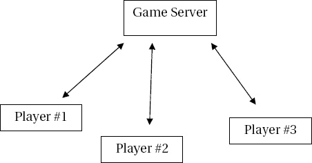
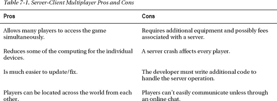
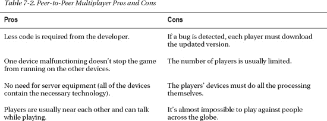

# 七、构建双人游戏

你在 Android 平板电脑游戏上做了一些了不起的工作。现在，您将通过允许一个人与附近的其他人进行游戏来为工作添加另一个级别。这是制作拥有大量粉丝的游戏的关键一步。如果你看看现在众多流行的游戏，绝大多数主要是为了在用户自己的家里玩朋友和陌生人的游戏。

添加连接多个设备的功能变得相当复杂。幸运的是，Android 文档提供了一些示例，您可以对其进行修改以实现您的目标，因此您所要做的就是理解代码是如何工作的，然后将它整合到您的游戏中。

在这一章中，你将学习多人游戏的各个方面，包括不同的类型和实现。然后，你继续专注于 Android。在本章的结尾，你会明白如何创建和改编你自己的游戏来获得多人游戏的体验。在你开始之前，让我们先看看不同类型的多人游戏模式，以及它们通常是如何实现的。

 **注意**如果你对这一章中的任何一部分代码感到困惑，请继续阅读，它们会一起出现。如果你还是不明白，可以上网查询解决方案，或者运行程序，只修改你需要的部分。Android 文档总是一个很好的起点:`[`developer.android.com/guide/index.html`](http://developer.android.com/guide/index.html)`。通常，只要你理解它是如何工作的，就没有必要编写所有的代码。

### 了解多人游戏

你曾经通过电子游戏机或者你的个人电脑和别人玩第一人称射击游戏吗？这些游戏每年为视频游戏公司带来数亿美元的收入，因为它们能够吸引其他玩家，而不仅仅是电脑创造的角色。

涉及整个世界的在线游戏也非常受欢迎(想想魔兽世界)。平板电脑和手机也抓住了这股越来越多的连接热潮。可能最新类型的多人游戏是社交游戏。Farmville、Mafia Wars 和其他各种产品连接到社交网站(最著名的是脸书),将您的进度信息传输到您的朋友正在玩的游戏中。

#### 通过服务器进行多人游戏

刚才提到的所有游戏都涉及到通过服务器连接玩家。这意味着设备或玩家不是直接相互连接，而是通过另一个实体连接。事实上，互联网上的网站使用同样的方法:你(客户端)从网站(服务器)获取网页材质。

图 7-1 是一个简单的图表，展示了几个人为了玩多人游戏而连接到一个服务器。

***图 7-1。**一群来自不同地方的玩家登录一个中央服务器，然后就可以互相对战。*

在您研究服务器类型的多人游戏的优缺点之前，能够将这种方法与其他方法进行比较是有帮助的。我们来看对等方法。

#### 点对点多人游戏

当玩家彼此直接连接时，他们使用的是点对点(P2P)网络。对手在几英尺之内玩的 P2P 游戏通常使用蓝牙实现，蓝牙是大多数 Android 平板电脑上可用的局域网协议。这意味着没有实体控制所有的通信。如果你使用过 P2P 文件共享网络(例如，使用 torrents 从其他用户而不是单一服务器下载大文件)，那么你已经连接到其他像你一样的计算机来下载文件；你不需要每个人都连接的大型服务器。许多大型游戏机视频游戏不使用点对点模式，因为一次只能有几个玩家玩。

要了解服务器-客户端游戏和点对点游戏的区别，请看一下图 7-2 。

***图 7-2。**为了在游戏中竞争，两个玩家直接相互连接。*

显然，多人游戏的这两种策略非常不同，但你可能想知道哪种更好。没有正确的答案；相反，存在一个优于另一个的情况。

#### 选择多人游戏方式

表 7-1 和表 7-2 列出了两种多人游戏方式的主要优缺点。这不是一个官方列表(有些人可能不同意某件事是积极的还是消极的)，但它给了你一个如何选择解决方案的非常重要的把握。

如果您仔细查看了这些表，您应该已经注意到服务器-客户机方法的优点列是对等方法的缺点列，而对等方法的优点是服务器-客户机的缺点。然而，将每种类型的优缺点相加并不能得出正确的选择。相反，你必须为你想要创造的东西制定一个计划，然后选择最能让你实现目标的方法。

在本章的剩余部分，您将改编您在第六章中为两个玩家构建的平板划球拍游戏，每个玩家都可以控制平板电脑上显示的两个划球拍中的一个。因为多人游戏编程可能很复杂，这一章将介绍主要概念。这里有完整的代码供您使用:`[`code.google.com/p/android-tablet-games/`](http://code.google.com/p/android-tablet-games/)`。

因为你一次只需要容纳两个玩家，而你又想用最高效的手段打造这样一个游戏，所以你使用了点对点的多人游戏模式。你可以使用大多数 Android 设备上的蓝牙网络直接连接玩家，而不是通过 3G 或 Wi-Fi 网络连接。通过选择这种方式，您可以节省大量的时间，而这些时间本来是用来设置服务器架构和确保设备能够正确连接的。

 **提示**对于初学游戏编程的人来说，最好远离服务器-客户端多人游戏，因为它们几乎总是要复杂得多。不要因此而气馁；您可以通过蓝牙连接创建大量优秀的游戏。在这种情况下，玩家的额外兴奋是他们几乎总是在彼此附近，可以通过棘手的关卡互相交谈，或者进行一些有趣的垃圾交谈。

### 构建一个双人点对点游戏

作为一名开发人员，您可以合理地确信，大多数 Android 平板设备都支持蓝牙。几乎所有现代手机都支持蓝牙连接无线耳机，实现免提通话。这项技术在平板电脑中实现，以允许使用相同的耳机以及键盘和各种其他外围设备。

虽然有些人使用术语*蓝牙*来指代耳机和他们用来连接电话的设备，但实际上蓝牙是一种无线电广播系统，各种设备都用它来连接和共享照片、音乐、视频和几乎所有其他类型的数据。蓝牙最大的优点是速度快得令人难以置信。如果你可以用蓝牙耳机不间断地打电话，那么你可以确信它对大多数游戏来说足够快了。

在接下来的几节中，您将改编第六章中的平板球拍游戏，供两名玩家使用。首先添加代码，使用内置的蓝牙无线电连接两个 Android 平板电脑，然后添加第二个球拍和代码，允许球员争夺球的控制权。

我们开始吧。首先打开一个新的 Eclipse 项目，并将其命名为 TwoPlayerPaddleGame。

#### 增加蓝牙连接

因为连接多个设备是一项复杂的任务，在 Android 平板电脑上支持这种交互的代码更难解释。本例中的片段摘自 Android samples 中一个更大的蓝牙项目:BluetoothChat。您在这里使用它们来探索主要概念。这些变量还没有全部初始化，但它们仍然传达了基本信息。在深入这个例子之前，让我们先来看看构成一个成功的蓝牙应用的大部分元素。

首先，您必须初始化与平板电脑内蓝牙连接器的链接。请遵循以下步骤:

> 1.  将清单 7-1 所示的代码包含在`MainActivity.java`的`onCreate()`函数中。
>     
>     ***清单 7-1。**`onCreate()`*
>     
>     `BlueAdapter = BluetoothAdapter.getDefaultAdapter();
>     
>     if (BlueAdapter == null) {` `    Toast.makeText(this, "Bluetooth is not available", Toast.LENGTH_LONG).show();
>         return;
>     }`

`BlueAdapter`成为设备中蓝牙功能的手柄。`if`语句用于确定蓝牙是否可用。然后，该函数向用户发布消息，提醒他们不能使用该程序。

2.你的启动的另一部分发生在一个你以前没有处理过的方法中:在`MainActivity.java`中，紧随`onCreate()`之后的`onState()`函数；参见清单 7-2 。您还需要导入`android.intent.Intent`，它让活动发送消息。

***清单 7-2。**??`onStart()`*

`    @Override
    public void onStart() {
        super.onStart();

        if (!BlueAdapter.isEnabled()) {
            Intent enableIntent = new Intent(BluetoothAdapter.ACTION_REQUEST_ENABLE);
            startActivityForResult(enableIntent, REQUEST_ENABLE_BT);
        }
else {
            if (game_running == null) startgame();
        }
    }`

清单 7-2 中的代码检查蓝牙设备看它是开着还是关着。它通过调用来启动蓝牙设备。(您很快就会看到这个新活动的表现。)如果蓝牙打开，你检查游戏是否已经开始。如果没有，你调用一个新的函数来初始化游戏。请注意，您的大部分额外代码都围绕着这样一个事实，即游戏的许多方面都必须在开始之前等待正确的蓝牙连接。

3.当活动被发送消息时，使用清单 7-3 中的代码。

***清单 7-3。**??`onActivityResult()`*

`public void onActivityResult(int requestCode, int resultCode, Intent data) {
    switch (requestCode) {
    case REQUEST_CONNECT_DEVICE:

        if (resultCode == Activity.RESULT_OK) {

            String address = data.getExtras()
                                 .getString(DeviceListActivity.EXTRA_DEVICE_ADDRESS);

            BluetoothDevice device = BlueAdapter.getRemoteDevice(address);

            mGameView.connect(device);
        }
        break;`  `case REQUEST_ENABLE_BT:

        if (resultCode == Activity.RESULT_OK) {

            startgame();
        } else {

        Toast.makeText(this, “Bluetooth failed to initiate”, Toast.LENGTH_SHORT).show();
            finish();
        }
    }
}`

上面的代码做了两件简单的事情。首先，如果您用连接另一个设备的请求来调用它，它会完成收集另一个设备的地址并创建一个到它的蓝牙设备的链接的步骤。然后它调用`mGameView`中的一个新函数将两个设备绑定在一起。

4.现在你有了一个非常简短的`startgame()`函数。清单 7-4 展示了游戏是如何开始的。

***清单 7-4。**??`startgame()`*

`    private void startgame() {

        mGameView = new GameView(this, mHandler);
        setContentView(mGameView);

}`

这个函数很大程度上并不令人兴奋，但是需要注意的是，您正在向`GameView`构造函数发送一个新的参数。处理程序是你从蓝牙通道向游戏发送数据的手段。理解这是如何工作的可能是蓝牙编程最重要的方面。

5.清单 7-5 中的代码围绕着处理发送和接收数据的不同任务的处理器。

***清单 7-5。**处理经办人*

`private final Handler mHandler = new Handler() {
    @Override
    public void handleMessage(Message msg) {
        switch (msg.what) {
        case MESSAGE_STATE_CHANGE:
            switch (msg.arg1) {
            case BluetoothChatService.STATE_CONNECTED:
                break;
            case BluetoothChatService.STATE_CONNECTING:
                Toast.makeText(this, “Connecting to Bluetooth”, Toast.LENGTH_SHORT).show();

                break;
            case BluetoothChatService.STATE_LISTEN:
            case BluetoothChatService.STATE_NONE:
                Toast.makeText(this, “Not Connected to Bluetooth”, Toast.LENGTH_SHORT).show();
               break;
           }
           break;

       case SEND_DATA:
           byte[] writeBuf = (byte[]) msg.obj;

           String writeMessage = new String(writeBuf);

           break;
        case RECEIVE_DATA:
            byte[] readBuf = (byte[]) msg.obj;

            String readMessage = new String(readBuf, 0, msg.arg1);

            break;
        case MESSAGE_DEVICE_NAME:

            mConnectedDeviceName = msg.getData().getString(DEVICE_NAME);
            Toast.makeText(getApplicationContext(), "Connected to "
                           + mConnectedDeviceName, Toast.LENGTH_SHORT).show();
            break;
        case MESSAGE_TOAST:
            Toast.makeText(getApplicationContext(), msg.getData().getString(TOAST),
                           Toast.LENGTH_SHORT).show();
            break;
        }
    }
};`

因为处理程序的初始化做了很多工作，所以下面列出了各种活动供您查看。一旦你真正创建了自己的项目，你就会回到这个问题上来。基本上，处理程序被传递一个特定的消息或事件，它必须处理或忽略。它有各种各样的反应，你必须编码。请记住，这些是从`GameView`类发送的:

> *   `MESSAGE_STATE_CHANGE`: The first case is the change of Bluetooth connection status. In most cases, if the status becomes disconnected, you will remind the user. For example, if the service is trying to connect, you will remind the user of this. If the connection cannot be established in an unfortunate event, you can also remind the user by explaining the problem. This also helps to debug problems.
> *   `SEND_DATA`: The next event is to send data to the other device. Here, you have collected the code string and are ready to send it to another device. You didn't actually send it here; You can come back later to add this feature.
> *   `RECEIVE_DATA`: Similar to you calling to write messages to the other device, you also accept data from the other device. Similarly, when you decide what you want to accomplish, there will be more code in this area.
> *   `MESSAGE_DEVICE_NAME`: The penultimate message is a call, which just reminds the user that they have connected to a specific device. You remind the user through a small pop-up box.
> *   `MESSAGE_TOAST`: Finally, you have a general method to send messages from the `GameView` class to users.

#### 管理蓝牙连接

随着`GameView.java`的增加，你将回到更熟悉的领域。请记住，您需要将大部分代码放在这里，因为您可以在这里根据平板电脑之间来回发送的数据来更改精灵的位置。

清单 7-6 、 7-7 和 7-8 显示了三个小线程的代码，您必须将它们添加到`GameView`中，以处理两个玩家交互时出现的各种蓝牙操作:`AcceptThread`、`ConnectThread`和`ConnectedThread`。`AcceptThread`处理初始连接，`ConnectThread`处理复杂的设备配对，`ConnectedThread`是设备在一起时的正常程序。

***清单 7-6。**??`AcceptThread`*

`private class AcceptThread extends Thread {
    // The local server socket
    private final BluetoothServerSocket mmServerSocket;

    public AcceptThread() {
        BluetoothServerSocket tmp = null;

        // Create a new listening server socket
        try {
            tmp = mAdapter.listenUsingRfcommWithServiceRecord(NAME, MY_UUID);
        } catch (IOException e) {
            Log.e(TAG, "listen() failed", e);
        }
        mmServerSocket = tmp;
    }`  `public void run() {
        if (D) Log.d(TAG, "BEGIN mAcceptThread" + this);
        setName("AcceptThread");
        BluetoothSocket socket = null;

        // Listen to the server socket if you're not connected
        while (mState != STATE_CONNECTED) {
            try {
                // This is a blocking call and will only return on a
                // successful connection or an exception
                socket = mmServerSocket.accept();
            } catch (IOException e) {
                Log.e(TAG, "accept() failed", e);
                break;
            }

            // If a connection was accepted
            if (socket != null) {
                synchronized (BluetoothChatService.this) {
                    switch (mState) {
                    case STATE_LISTEN:
                    case STATE_CONNECTING:
                        // Situation normal. Start the connected thread.
                        connected(socket, socket.getRemoteDevice());
                        break;
                    case STATE_NONE:
                    case STATE_CONNECTED:
                        // Either not ready or already connected. Terminate new socket.
                        try {
                            socket.close();
                        } catch (IOException e) {
                            Log.e(TAG, "Could not close unwanted socket", e);
                        }
                        break;
                    }
                }
            }
        }
        if (D) Log.i(TAG, "END mAcceptThread");
    }

    public void cancel() {
        if (D) Log.d(TAG, "cancel " + this);
        try {
            mmServerSocket.close();
        } catch (IOException e) {
            Log.e(TAG, "close() of server failed", e);
        }
    }
}`

`AcceptThread`是一段复杂的代码，但实际上它只是等待一个连接被接受。请注意，关键字`socket`频繁出现。这是设备或实体之间任何类型连接的标准，指的是交换信息的能力。这个代码不是我的；它是从 Android 文档的一个例子中重复使用的。一些 it 方法和代码块非常高效，不需要重做。

***清单 7-7。**??`ConnectThread`*

`private class ConnectThread extends Thread {
    private final BluetoothSocket mmSocket;
    private final BluetoothDevice mmDevice;

    public ConnectThread(BluetoothDevice device) {
        mmDevice = device;
        BluetoothSocket tmp = null;

        // Get a BluetoothSocket for a connection with the
        // given BluetoothDevice
        try {
            tmp = device.createRfcommSocketToServiceRecord(MY_UUID);
        } catch (IOException e) {
            Log.e(TAG, "create() failed", e);
        }
        mmSocket = tmp;
    }

    public void run() {
        Log.i(TAG, "BEGIN mConnectThread");
        setName("ConnectThread");

        // Always cancel discovery because it will slow down a connection
        mAdapter.cancelDiscovery();

        // Make a connection to the BluetoothSocket
        try {
            // This is a blocking call and will only return on a
            // successful connection or an exception
            mmSocket.connect();
        } catch (IOException e) {
            connectionFailed();
            // Close the socket
            try {
                mmSocket.close();
            } catch (IOException e2) {
                Log.e(TAG, "unable to close() socket during connection failure", e2);
            }
            // Start the service over to restart listening mode
            GameView.this.start();
            return;
        }

        // Reset the ConnectThread because you're done` `        synchronized (BluetoothChatService.this) {
            mConnectThread = null;
        }

        // Start the connected thread
        connected(mmSocket, mmDevice);
    }

    public void cancel() {
        try {
            mmSocket.close();
        } catch (IOException e) {
            Log.e(TAG, "close() of connect socket failed", e);
        }
    }
}`

这个线程与前一个线程相似，它处理连接到另一个设备的尝试。Android 的例子也包括这个，所以我没有对它做任何修改。如果你好奇的话，它会尝试*ping*或者与另一个设备建立连接。如果失败，它可以通过`try`块调用继续尝试，失败会导致重启。

幸运的是，您真的只对来回发送数据感兴趣，不需要改变连接的建立方式。

***清单 7-8。**??`ConnectedThread`*

`private class ConnectedThread extends Thread {
    private final BluetoothSocket mmSocket;
    private final InputStream mmInStream;
    private final OutputStream mmOutStream;

    public ConnectedThread(BluetoothSocket socket) {
        Log.d(TAG, "create ConnectedThread");
        mmSocket = socket;
        InputStream tmpIn = null;
        OutputStream tmpOut = null;

        // Get the BluetoothSocket input and output streams
        try {
            tmpIn = socket.getInputStream();
            tmpOut = socket.getOutputStream();
        } catch (IOException e) {
            Log.e(TAG, "temp sockets not created", e);
        }

        mmInStream = tmpIn;
        mmOutStream = tmpOut;
    }

    public void run() {
        Log.i(TAG, "BEGIN mConnectedThread");
        byte[] buffer = new byte[1024];` `        int bytes;

        // Keep listening to the InputStream while connected
        while (true) {
            try {
                // Read from the InputStream
                bytes = mmInStream.read(buffer);

                // Send the obtained bytes to the UI Activity
                mHandler.obtainMessage(MainActivity.MESSAGE_READ, bytes, -1, buffer)
                        .sendToTarget();
            } catch (IOException e) {
                Log.e(TAG, "disconnected", e);
                connectionLost();
                break;
            }
        }
    }

    /**
     * Write to the connected OutStream.
     * @param buffer  The bytes to write
     */
    public void write(byte[] buffer) {
        try {
            mmOutStream.write(buffer);

            // Share the sent message back to the UI Activity
            mHandler.obtainMessage(MainActivity.MESSAGE_WRITE, -1, -1, buffer)
                    .sendToTarget();
        } catch (IOException e) {
            Log.e(TAG, "Exception during write", e);
        }
    }

    public void cancel() {
        try {
            mmSocket.close();
        } catch (IOException e) {
            Log.e(TAG, "close() of connect socket failed", e);
        }
    }
}`

类做了大量的工作。每当设备处于连接状态时，此代码都会运行。请注意，它首先收集输入和输出流，以便可以从其他设备访问数据，然后再发送自己的信息。

接下来，`run()`方法进入一个循环，不断检查它可以处理的新数据。大多数数据都是以整数的形式发送的，但是发送字符串作为设备之间的交换还是有一些好处的。首先，在一个复杂的游戏中，可能有许多数字需要发送，如生命值、弹药、位置和库存。仅仅发送数字意义不大。相反，可以快速解析像“a:10”这样的字符串，以查找冒号后面的数字和冒号前面的字符，从而确定必要的更改。

在循环之外，线程有一个方法将缓冲区上的消息发送到另一个设备。它是不言自明的，并按原样发送消息。

在这些线程之前，添加一些用于发送数据和调用线程来执行某些操作的方法。请记住，您还没有以任何方式初始化或利用线程。清单 7-9 中的代码启动了它们。

***清单 7-9。**连接到蓝牙设备*

`public synchronized void start() {
    if (D) Log.d(TAG, "start");

    // Cancel any thread attempting to make a connection
    if (mConnectThread != null) {mConnectThread.cancel(); mConnectThread = null;}

    // Cancel any thread currently running a connection
    if (mConnectedThread != null) {mConnectedThread.cancel(); mConnectedThread = null;}

    // Start the thread to listen on a BluetoothServerSocket
    if (mAcceptThread == null) {
        mAcceptThread = new AcceptThread();
        mAcceptThread.start();
    }
    setState(STATE_LISTEN);
}
public synchronized void connect(BluetoothDevice device) {
    if (D) Log.d(TAG, "connect to: " + device);

    // Cancel any thread attempting to make a connection
    if (mState == STATE_CONNECTING) {
        if (mConnectThread != null) {mConnectThread.cancel(); mConnectThread = null;}
    }

    // Cancel any thread currently running a connection
    if (mConnectedThread != null) {mConnectedThread.cancel(); mConnectedThread = null;}

    // Start the thread to connect with the given device
    mConnectThread = new ConnectThread(device);
    mConnectThread.start();
    setState(STATE_CONNECTING);
}

public synchronized void connected(BluetoothSocket socket, BluetoothDevice device) {
    if (D) Log.d(TAG, "connected");

    // Cancel the thread that completed the connection
    if (mConnectThread != null) {mConnectThread.cancel(); mConnectThread = null;}

    // Cancel any thread currently running a connection
    if (mConnectedThread != null) {mConnectedThread.cancel(); mConnectedThread = null;}`  `// Cancel the accept thread because you only want to connect to one device
    if (mAcceptThread != null) {mAcceptThread.cancel(); mAcceptThread = null;}

    // Start the thread to manage the connection and perform transmissions
    mConnectedThread = new ConnectedThread(socket);
    mConnectedThread.start();

    Message msg = mHandler.obtainMessage(MainActivity.MESSAGE_DEVICE_NAME);
    Bundle bundle = new Bundle();
    bundle.putString(BluetoothChat.DEVICE_NAME, device.getName());
    msg.setData(bundle);
    mHandler.sendMessage(msg);

    setState(STATE_CONNECTED);
}

public synchronized void stop() {
    if (D) Log.d(TAG, "stop");
    if (mConnectThread != null) {mConnectThread.cancel(); mConnectThread = null;}
    if (mConnectedThread != null) {mConnectedThread.cancel(); mConnectedThread = null;}
    if (mAcceptThread != null) {mAcceptThread.cancel(); mAcceptThread = null;}
    setState(STATE_NONE);
}

public void write(byte[] out) {
    // Create temporary object
    ConnectedThread r;
    // Synchronize a copy of the ConnectedThread
    synchronized (this) {
        if (mState != STATE_CONNECTED) return;
        r = mConnectedThread;
    }
    // Perform the write unsynchronized
    r.write(out);
}

private void connectionFailed() {
    setState(STATE_LISTEN);

    // Send a failure message back to the Activity
    Message msg = mHandler.obtainMessage(MainActivity.MESSAGE_TOAST);
    Bundle bundle = new Bundle();
    bundle.putString(BluetoothChat.TOAST, "Unable to connect device");
    msg.setData(bundle);
    mHandler.sendMessage(msg);
}

private void connectionLost() {
    setState(STATE_LISTEN);

    // Send a failure message back to the Activity
    Message msg = mHandler.obtainMessage(MainActivity.MESSAGE_TOAST);` `    Bundle bundle = new Bundle();
    bundle.putString(MainActivity.TOAST, "Device connection was lost");
    msg.setData(bundle);
    mHandler.sendMessage(msg);
}`

一旦你看到了线程，你就会明白这些函数主要用来启动线程。前三个函数启动三个线程(`AcceptThread`、`ConnectThread`和`ConnectedThread`)。当你的游戏遇到终点(也就是角色死亡)时，会调用`stop()`函数来确保没有线程继续。当你想发送一些东西到另一个设备时，你也可以使用`write()`方法。

最后，另外两种方法使用`Handler`在连接丢失或失败时显示消息。

#### 为两个玩家改编游戏代码

您已经完成了处理建立连接并维护它们的大部分代码。现在你需要弄清楚你的游戏将如何使用蓝牙。这个示例游戏的整个代码太大了，不适合本书的篇幅，但是你可以从 http://code.google.com/p/android-tablet-games/下载。一个完整的其他源文件处理你如何选择你想要连接的设备(这对你现在的工作并不重要)。

事不宜迟，你想在游戏过程中在屏幕上有两个球拍:一个在顶部，一个在底部。清单 7-10 包含了来自`GameView`的`update()`方法的重要代码。请注意，您必须在前面的函数中初始化`paddle_other`精灵，并将其添加到`draw()`函数中。它被放置在屏幕的顶部，与另一个球拍的图像相同。

***清单 7-10。**增加了球拍和碰撞检测，并更新了游戏状态*

`//paddle input
int val=0;
for (int i=latest_input.length-1, j = 0; i >= 0; i--,j++)
        {
                val += (latest_input[i] & 0xff) << (8*j);
        }
paddle_other.setX(val);

//paddle_other collision
int paddle_other_bottom = paddle_other.getBitmap().getHeight();
if(paddle_other.collide(ball)){
        if(ball_y < paddle_other_bottom && ball_y < paddle_other_bottom + 20){
                ball.setMoveY(-ball.getMoveY());
        }
}

//paddle output
byte[] paddle_output;
ByteBuffer bb = ByteBuffer.allocate(4);
bb.putInt((int)paddle.getX());
paddle_output = bb.array();
write(paddle_output);`

清单 7-10 中的代码做了三件事。首先，它根据控制它的其他设备的输入将`paddle_other`移动到该位置。第二，它检测碰撞。第三，它将你控制的球拍的位置发送到另一个设备，这样你的对手就可以看到你最近的移动。

稍微分解一下，`for`循环将您作为输入获得的字节数组转换成一个整数，用于移动拨片。幸运的是，您还不需要将`byte[]`解析成更复杂的值。

碰撞检测与另一个球拍的碰撞检测类似，但是您颠倒了检测，因为您只对球撞击底部感兴趣，而不是顶部。如果你愿意，当球碰到顶部时，你可以使游戏重置或结束，给玩家 2 同样的强度。

最后，您将 paddle 的位置转换为一个字节数组，并将其发送到您的`write()`函数，该函数又将它发送到`connectedThread`进行处理。

#### 测试游戏

测试一个使用蓝牙的多人游戏应用可能有点棘手。如果你有两个 Android 平板电脑，那么你可以利用它们的内置功能相互连接。然后将程序加载到两台设备上。如果你没有或者不想要几个平板，你必须做不同的安排。

显然，测试这些程序的另一种可能方式是借用别人的平板电脑，并将其与自己的平板电脑配对。请注意，要在另一台平板电脑上安装软件，您需要遵循附录 A 中针对所有平板电脑的说明。在你开始实验之前，确保你的朋友或亲戚明白你在对他们的平板电脑做什么！

将蓝牙 USB 加密狗插入您的计算机并期望您的仿真器能够处理蓝牙可能很有诱惑力。可悲的是，事实并非如此；模拟器目前不具备处理蓝牙的能力。在添加此功能之前，您必须使用真实设备进行测试。

### 总结

再次祝贺你:你在 Android 游戏开发的一些有趣的蓝牙和多人游戏方面取得了成功。这个话题是你在游戏编程中会遇到的最困难的话题之一。现在你已经准备好在这本书结尾的大型游戏上工作了。准备好接受更多的精灵和声音，以及更多的代码。