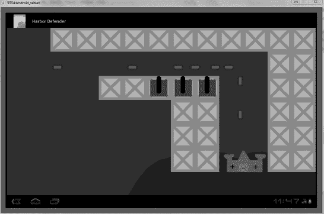
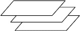
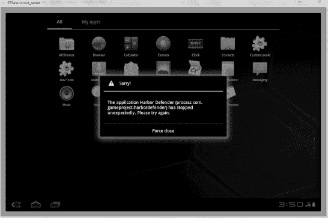
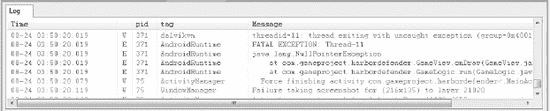

# 八、单人策略游戏第一部分：构建游戏

是时候做你的最后一个游戏了，一个单人策略游戏——Harbor Defender——在这个游戏中，你使用了你在前面章节中开发的概念和代码。大多数内容都是我们已经学过的东西。你利用你已经知道的东西。一些游戏开发书籍喜欢以华丽的 3D 游戏结尾。我选择不走这条路，因为没有足够的时间来教你添加第三维度的所有细微差别。编写一个 3D 游戏并不容易:当你在智能手机或平板电脑上玩一个游戏时，你可以相当肯定它是由一个大型团队创作的。我在这本书里的目标是教你如何创建你可以自己编程的游戏。这样，您不必与任何人分享您的利润，也不必与其他开发人员争论您的设计和实现决策！

在你构建的战略游戏中，用户必须保卫一个堡垒，防止敌人从海上攻击。游戏的设计允许你通过增加新类型的防御和增加敌人的数量来增加它的难度。还可以添加布局来创建更具挑战性的游戏关卡。

在这一章，两章中的第一章，你的重点是设置游戏和它的元素，并创建一个系统，使一切顺利运行。在下一章中，你将通过实现一个点计数器和一些有趣的用户控件来使游戏更加精彩。

 **注意**因为你在为平板电脑开发游戏，你需要记住让它的开发不同于手机或桌面游戏的方面。这些差异包括使用触摸屏、应对屏幕尺寸以及设计直观的用户控件。一些不熟悉平板电脑的开发人员很想把他们以前的项目移植到平板电脑上。这可以很好地工作，但浏览一下 app store 会让你相信，那里的大多数游戏都是为平板电脑定制的，不能在任何其他硬件上很好地工作。通常情况下，用户只是在他们的游戏系统上玩原版游戏，他们希望他们的平板电脑体验有一个特殊的游戏。

让我们先来看看战略游戏的布局，然后组装构建它所需的元素。

### 介绍港湾卫士

港口保卫者是我为你在本章开始的游戏选择的名字。游戏表面由一个堡垒，一个由码头定义的港口，攻击船和可以用子弹击沉攻击者的大炮组成。图 8-1 是你在本章结束时组装的游戏面的图像。在第九章中，你添加了用户控件，但是现在你需要一个玩家最终会与之交互的界面。它让你知道机械是如何工作的。

***图 8-1。**港湾保卫者的测试版*

港口守卫者的目标是在船只入侵要塞之前，摧毁通过港口接近要塞的船只。玩家通过发射位于港口周围的码头上的大炮来击退船只。每个桥墩都可以容纳一门大炮，但是使用者必须将它瞄准正确的方向。为了让游戏更具挑战性，用户不能制造无限数量的大炮。相反，用户得到的加农炮数量是有限的，因此他们必须明智地选择加农炮的位置。如前所述，在这一章你设置游戏环境；在下一章中，您将添加用户交互。

你可以让船以更快的速度靠近，为了最大化它们的效率，用户必须快速删除和移动加农炮。现在，让我们来看看为了使这个游戏成功，你必须创建的物品和活动。

### 集结港湾卫士

这里是一个港口防御者需要什么的细目分类。在本节中，您将探索这些元素以及如何处理它们:

> *   *Wharf:* The stones of the wharf support your cannon and define the port through which the invading ships must pass. The pier itself doesn't do anything, but it is used for reference cannon placement. You use XML data to quickly encode the location of each item. Each part is realized as an elf; Sprite objects give you more functions than just displaying images on the screen.
> *   *Ground:* The ground is part of the background, so you don't test it or use it. However, it is important for you to use it, because when the blue background is enough, it makes you unnecessary to use larger and resource-intensive images.
> *   *Castle:* The castle will not react until it is hit by a boat. Otherwise, it is an immovable object that is relatively easy to implement. Similarly, you can choose to put the ground and the castle in an elf, but you use this method because it makes more sense in the game by limiting the size of the image.
> *   *Ship:* The ship is one of only two mobile elves in the whole game. You create them according to a random number generator, adding some unpredictability to the game. You have to set their route and speed in advance. Bullet is another moving elf that you dealt with in Chapter 9.
> *   *Artillery:* A cannon has a simple function, that is, it fires at ships. Their location is unique because players can make and destroy cannons in the game. Similarly, the function of the cannon will be realized in the next chapter.

这个游戏编码中最有趣的部分是船只和大炮没有固定的位置和数量。这意味着不是所有的精灵都像你习惯的那样在开始时被初始化。

在开始构建游戏环境之前，您需要打开一个新的 Eclipse 项目:

> 1.  Open a new Eclipse project named **harbor defender** .
> 2.  Copy all the files of PaddleGame (see Chapter 7 ) into your new project. This includes art, XML files and, of course, code.

#### 建造桥墩

在您的上一个游戏中，您使用了一个 XML 页面来存储方块的位置。您可以重用这个页面来存储大量的码头坐标。因为你有这么多的码头，有些人会说一个循环可以处理快速排列的碎片。这是真的，但是桥墩的不规则形状适合这种手工编码。另外，请记住，如果您创建了另一个级别，更改这些数据是非常容易的。

请遵循以下步骤:

> 1.  清单 8-1 显示了文件`blocklocation.xml`(与你用于 TabletPaddle 的文件完全相同)的内容，但是它包含了所有墩块的位置，而不是 Paddle 游戏中的方块。将该文件的内容添加到位于`res`下的`blocklocation.xml`中。我强烈建议从网站(`[`code.google.com/p/android-tablet-games/`](http://code.google.com/p/android-tablet-games/)`)下载这个文件，而不是输入这些代码。
>     
>     ***清单 8-1。**码头平台位置*
>     
>     `<resources>
>             <integer name=*"blocknumber"*>32</integer>
>     
>             <integer-array name=*"x"*>
>     
>             <item>180</item>
>             <item>280</item>
>             <item>380</item>
>             <item>480</item>
>             <item>580</item>
>             <item>680</item>
>             <item>780</item>
>             <item>880</item>
>             <item>980</item>
>             <item>1080</item>
>             <item>1180</item>
>             <item>1080</item>
>             <item>1180</item>
>             <item>380</item>
>             <item>480</item>
>             <item>580</item>
>             <item>680</item>
>             <item>780</item>
>             <item>1080</item>
>             <item>1180</item>
>             <item>680</item>
>             <item>780</item>
>             <item>1080</item>
>             <item>1180</item>
>             <item>680</item>
>             <item>780</item>
>             <item>1080</item>
>             <item>1180</item>
>             <item>680</item>
>             <item>780</item>
>             <item>1080</item>
>             <item>1180</item>
>     
>             </integer-array>
>     
>             <integer-array name=*"y"*>
>     
>             <item>0</item>
>             <item>0</item>
>             <item>0</item>
>             <item>0</item>
>             <item>0</item>
>             <item>0</item>
>             <item>0</item>` `        <item>0</item>
>             <item>0</item>
>             <item>0</item>
>             <item>0</item>
>             <item>100</item>
>             <item>100</item>
>             <item>200</item>
>             <item>200</item>
>             <item>200</item>
>             <item>200</item>
>             <item>200</item>
>             <item>200</item>
>             <item>200</item>
>             <item>300</item>
>             <item>300</item>
>             <item>300</item>
>             <item>300</item>
>             <item>400</item>
>             <item>400</item>
>             <item>400</item>
>             <item>400</item>
>             <item>500</item>
>             <item>500</item>
>             <item>500</item>
>             <item>500</item>
>     
>             </integer-array>
>     
>         </resources>`
> 2.  你用和以前一样的技巧解析这个文件。第一个项目列表是 x 坐标；y 坐标在第二个列表中。通过将 x 列表中的第一个条目与 y 列表中的第一个条目配对来创建每个 sprite，然后向下移动，直到创建了每个块。请注意，您必须在 XML 文件的顶部键入总块数——在本例中，您有 32 个桥墩。这个游戏需要一些新的精灵对象、整数和数组。在实现它们之前，您需要将它们添加到`GameView`类的顶部。清单 8-2 包含了新的声明；将它们放在文件的顶部。
>     
>     *清单 8-2。初始化项目的对象/变量*
>     
>     `//SpriteObjects
>     private SpriteObject[] pier;
>     private SpriteObject[] cannon;
>     private SpriteObject ground;
>     private SpriteObject castle;
>     private SpriteObject[] boat;
>     
>     //Variables
>     private Resources res;` `private int[] x_coords;
>     private int[] y_coords;
>     private int boat_count = 0;
>     private int cannon_count = 3;
>     private int pier_count;`
> 3.  Although these elves and integers look similar to those you created before, it should be noted that `boat_count` is set to 0\. This allows you to start the game without any boats, and add boats during the game. Similarly, you set `cannon_count` to 3, because initially you only handled three cannons.
> 4.  将清单 8-3 中的代码添加到`GameView`构造函数中。这段代码看起来应该非常像 TabletPaddle 代码；除了您正在创建的对象的名称之外，它们是相同的。然后，在`onDraw()`函数中，循环遍历每个桥墩，并将其绘制到屏幕上。
>     
>     ***清单 8-3。**建造码头*
>     
>     `//pier sprites
>     pier_count = res.getInteger(R.integer.blocknumber);
>     x_coords = res.getIntArray(R.array.x);
>     y_coords = res.getIntArray(R.array.y);
>     pier = new SpriteObject[pier_count];
>     for(int i = 0; i < pier_count; i++){
>             pier[i] = new SpriteObject(BitmapFactory.decodeResource(getResources(),
>     R.drawable.pier), x_coords[i], y_coords[i]);
>     }`
> 5.  将清单 8-4 中的代码放到`GameView`的`onDraw()`方法中。
>     
>     ??**清单 8-4。**绘制桥墩
>     
>     `for(int i = 0; i < pier_count; i++){
>             pier[i].draw(canvas);
>     }`

因为 pier 块不需要做任何事情，所以您不需要在`update()`函数中为它们创建代码。让我们继续到地面和城堡。

#### 添加地面和城堡

地面和城堡是更无生命的物体。你照顾他们就像你照顾码头一样。幸运的是，每种数据只有一个，这意味着您不需要使用更多的 XML 数据:

> 1.  清单 8-5 显示了您在`GameView`构造函数中为两个精灵使用的代码。现在添加。
>     
>     ***清单 8-5。**创建地面和城堡*
>     
>     `ground = new SpriteObject(BitmapFactory.decodeResource(getResources(), R.drawable.ground),
>     480, 500);` `castle = new SpriteObject(BitmapFactory.decodeResource(getResources(), R.drawable.castle),
>     890, 500);`
> 2.  这两个精灵的诀窍是确保他们都在正确的地方。它们的绘制顺序也很重要。图 8-2 显示了调用`onDraw()`函数时发生的情况。您可以看到正在绘制的图像层。
>     
>     ***图 8-2。**图像图层*
>     
>     
> 3.  The ground must be lower than the pier and higher than the blue background. Similarly, the castle must be on the ground. In order to get the correct sequence, Listing 8-6 contains a new `onDraw()` routine. Make sure the order is correct: if the ground appears above the castle, then you will have an underground fortress that is not easy to use in the game!

***清单 8-6。**绘制城堡和地面*

`canvas.drawColor(Color.BLUE);
ground.draw(canvas);
castle.draw(canvas);

for(int i = 0; i < pier_count; i++){
        pier[i].draw(canvas);
}`

您创建的下一个精灵对象将在绘制完桥墩后添加。这是有道理的，因为大炮必须在桥墩的顶部；船只沿着水面滑行，可能会撞到城堡。

#### 制造船只

船是你必须对付的最复杂的精灵。用户无法控制它们，因此它们的运动必须按照特定的路线进行预编程。更复杂的是，你必须根据精灵的方向改变它的图像。这些都集中在`update()`函数中。但是现在，您可以创建一个数组来保存船只，而不必实际制作它们:

> 1.  将清单 8-7 中的片段放到你的`GameView`构造函数方法中。
>     
>     ??**清单 8-7。**创造 12 个船精灵
>     
>     `//boat sprites
>     boat = new SpriteObject[12];`
> 2.  清单 8-8 显示了循环绘制可用船只的程序。在绘制完其他精灵后，将这段代码放入`onDraw()`函数中。
>     
>     *清单 8-8。画船*
>     
>     `for(int i = 0; i < boat_count; i++){
>             boat[i].draw(canvas);
>     }`
> 3.  Here comes the wonderful part. Before you go forward, you need to understand the variable `boat_count`. Back to the `GameView` variable declaration, you initialize this integer by setting it to 0\. Therefore, in the initial state, no ship spirit is drawn, because `i` is not less than `boat_count`. You can think of ?? as a collection of available ships.
> 4.  因为你一开始没有船，所以他们的创作方法就有点复杂了。清单 8-9 包含了你需要添加到`update()`函数中的代码。之后我把它分解成关键部分。为了让它工作，在`GameView.java`的顶部导入`java.util,Random`。
>     
>     ??**清单 8-9。**创建船只和随机间隔
>     
>     `Random random_boat = new Random();
>     int check_boat = random_boat.nextInt(100);
>     
>     if(check_boat > 97 && boat_count < 12){
>             int previous_boat = boat_count - 1;
>             if(boat_count == 0 || boat[previous_boat].getX() > 150){
>                     boat[boat_count] = new
>     SpriteObject(BitmapFactory.decodeResource(getResources(), R.drawable.boat), 100, 150);
>                     boat[boat_count].setMoveX(3);
>                     boat_count++;
>             }
>     }`
> 5.  首先，你做一个随机数生成器。您调用一个`nextInt()`方法，该方法在 0 和参数之间选择一个整数。测试了`check_boat`变量，以便您以随机间隔创建船只。
>     
>      **注意**创建一个随机数发生器,并得到一个介于零和你自己的值之间的整数,这是给你的游戏增加一些随机性的完美方法。你不再需要担心小数,因为整数更容易处理。如果你使用随机元素,请记住在测试中多次运行你的游戏,因为如果随机数与你预期的不同,你可能会发现意想不到的行为第一个`if`语句只有在随机数大于 97 的情况下才继续执行，这种情况不太可能发生，但可以将船只的冲击降到最低。然后你要求`boat_count`小于 12。这可以防止许多船只同时出现在赛场上。如果这对玩家来说太容易了，你可以增加这个数字，让游戏更有挑战性。
>     
>     
> 6.  The second `if` statement checks whether the new ship is the first ship or whether it has a certain distance from the previous ship. Therefore, add 1 to `boat_count` and test whether the X coordinate of the previous ship is greater than 150\. Otherwise, these boats may appear on top of each other, which is detrimental to the appearance of the game (although it may make the game more challenging! ).
> 7.  If the ship passes all the `if` statements, it is initialized to the starting x position 100\. You move it at a slow speed of three pixels per `update()` function. This is another good opportunity to increase the difficulty. When the player reaches a certain score or other achievements, slowly increase the speed of the boat.
> 8.  最后，`boat_count`递增，让`draw()`函数处理新添加的船。你的舰队扩大了。你需要改变船只的方向，让它们能够适当地转向它们的目的地:城堡。清单 8-10 中的代码就是这样做的；将其添加到`update()`方法中。
>     
>     ??**清单 8-10。**改变船的方向
>     
>     `for(int i = 0; i < boat_count; i++){
>             if((int)boat[i].getX() > 950){
>                     boat[i].setMoveX(0);
>                     boat[i].setMoveY(3);
>                     boat[i].setBitmap(BitmapFactory.decodeResource(getResources(),
>     R.drawable.boatdown));
>             }
>     }`
> 9.  When the ship reaches the X position of 950 pixels, it stops moving to the right and begins to descend. Notice the last line: you changed the sprite image, because ships rarely move without changing direction. Therefore, the original ship image is rotated by 90 degrees and saved as a new resource named `boatdown`.

就是这样。当你添加加农炮时，你会看到船只随机出现并驶向你的城堡。

#### 加农炮

对船来说也是如此，大炮的数量在游戏中会发生变化。现在，你只担心证明这个概念。请遵循以下步骤:

> 1.  将清单 8-11 中的代码放入`GameView`创建器中。你可以在声明中改变`cannon_count`的值来创建更多的加农炮。不是响应用户输入，而是让加农炮出现在三个连续的墩上，每次快速循环移动加农炮 100 个单位。
>     
>     ***清单 8-11。**改变加农炮计数的数值*
>     
>     `//cannon sprites
>     cannon = new SpriteObject[cannon_count];
>     for(int i = 0; i < cannon_count; i++){
>             cannon[i] = new SpriteObject(BitmapFactory.decodeResource(getResources(),
>     R.drawable.cannonup), (580 + i * 100), 200);
>     }`
> 2.  In order to prepare yourself for creating additional cannon elves, name the original picture `cannonup`. When the user wants to change the direction of the cannon, it will be easier.
> 3.  Add the code in Listing 8-12 to the `onDraw()` function, and your cannonball will appear when the game is running.

***清单 8-12。**拉炮*

`for(int i = 0; i < cannon_count; i++){
        cannon[i].draw(canvas);
}`

你有一些简单的遗留问题要处理。游戏的框架完成了。

#### 添加图像

我使用的图片可以在[`code.google.com/p/android-tablet-games/`](http://code.google.com/p/android-tablet-games/)买到，或者你可以自己创作。图 8-3 到图 8-7 显示了我用来构建 Harbor Defender 的图片；它们的尺寸在图标题中有规定。后来，我提出了一些关于如何创建你的图像的建议。请记住，有时您需要旋转或翻转它们，以交替状态显示它们。

***图 8-3。** `Castle` : 200 × 100*

*图 8-4**。** `Boat`和`boatdown`:分别为 50 × 30 和 30×50*

***图 8-5。** `Ground` : 800 × 250*

***图 8-6。** `Pier` : 100 × 100*

***图 8-7。** `Cannon` : 100 × 100*

### 调试海港卫士

通过一个简单的游戏外观方法，你就可以开始尝试了。像任何游戏一样加载它，你会看到船只慢慢出现并向城堡游去。如果你等得够久，他们会穿过城堡，离开屏幕。

如果事情不是这样，或者你得到一个类似于图 8-8 中显示的错误，或者游戏在启动时关闭，那么你需要做一些工作。本节致力于解决 Android 游戏开发中的常见问题。它没有深入到具体的问题中，因为没有办法预测每一个错误。如果 Eclipse 捕捉到错误，如何修复代码中的错误应该是相当明显的，但是运行时问题可能更加困难。

以下是要使用的流程:

> 1.  Make sure you are using `LogCat` to get the information on the simulator. When you use `Log.d` in the program to remind you that certain events have been triggered, this is very important. `LogCat` A fairly detailed report on errors is also displayed.
> 2.  出错时不要关闭模拟器。查看图 8-2 中的问题。你可能很想立即平仓，但这样做会抹去`LogCat`的结果。相反，请等待，以便您可以诊断问题。
>     
>     ***图 8-8。**海港保卫者运行时出错*
>     
>     
> 3.  向上滚动`LogCat`读数，如图图 8-9 所示，你应该可以找到红色字体的短语，表示错误发生的位置。幸运的是，该错误指出了问题所在的确切行号。
>     
>     *图 8-9 **.**??`NullPointerException`??*
>     
>     
> 4.  In most cases, you only need to pay attention to the previous error line. In this case, when the cannon is pulled out, the `onDraw()` function fails. The reason is that I commented out the initialization of the cannon elf. This is a common problem when you deal with a game where elves are created and destroyed. Please make sure that all the wizards you refer to for drawing or updating really exist. The last suggestion for handling errors is to make your simulator smaller. If you have a relatively small screen size, then your simulator may occupy most of the screen. This can prevent you from looking at `LogCat` at work. To solve this problem, choose to run Run_configuration. Then go to the target tab and scroll down. In the command line option, type **scale.8** . This reduces the simulator to 80% of its original size.

 **注意**如果你解决问题的最大努力没有成功，尝试在 stack overflow([`stackoverflow.com/`](http://stackoverflow.com/))上搜索解决方案。不过，将来在测试之间做些小的改变。通过这种方式，您可以回到以前的工作状态。准备好总是回到你知道有效的事情上来。

下一章涉及到游戏的许多不同的修正和更新。最值得注意的是，你使用户能够移动和旋转大炮。在你以前的游戏中，玩家从来没有这么多的选择，这将是一个独特的练习。

另一个增加的是一个积分系统，玩家每摧毁一艘船就获得奖励。物理也必须更新，因为一旦船撞上城堡，你需要结束游戏，而不是让船直接通过。

你还得担心一个新的因素:不恰当的用户交互。对于用户来说，点击码头的一部分来放置大炮是有意义的，但是如果他们错过了码头而点击了海洋呢？这就要求你快速有效地评估每一个输入，并立即对用户做出反应，同时还要防止大炮出现在不该出现的地方。

为了完成你的工作，你添加输入和逻辑来润色游戏的整体外观。

### 总结

你已经经历了设置一个真实游戏的过程。有了这些元素，你就可以添加让游戏成为有趣的用户体验的特性了。你应该习惯于计划一个游戏和组织处理精灵和组成它的物体的方式。

当你展望未来时，你会更加关注玩家的体验，而不是你技术能力的极限。为一个游戏创作美术作品通常也是一个限制因素，但是一个有趣和有创意的游戏可以弥补许多缺点。现在，让我们为您的游戏部署做好准备。