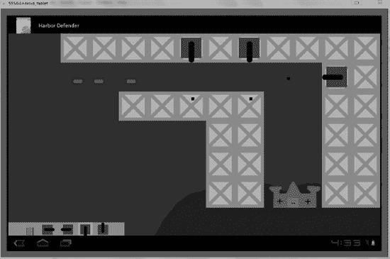

# 九、单人策略游戏第二部分：游戏编程

有了框架，现在你可以编写代码来创建一个可玩的游戏。这里的诀窍是让你的代码尽可能高效。当游戏变得越来越复杂，涉及到更多的精灵时，它们可能会因为处理器难以跟上而开始变慢。你可以用一些巧妙的技术来减轻负担，从而避免这种情况。

随着你的进展，牢记最终目标也很重要，因为你必须有一个正常运行的游戏，然后才能添加使你的工作与众不同的附加功能。事实上，以我的经验来看，知道何时停止开发一款游戏并发布它总是最棘手的部分。太简单的游戏和不可玩的游戏之间有一条细微的界限，因为它的功能和附加功能太多了，普通用户没有时间去学习。

 **注意**当你阅读本章中的代码时，回想一下，将`Log.d`语句放入代码中有助于澄清正在发生的事情和正在调用的函数。有些代码可能相当复杂，我仍然使用这种技术来帮助我逐步完成这些方法，尤其是当我没有得到想要的行为时。

以下是你必须在本章中完成的功能列表，以便拥有一个可用的游戏:

> *   Augmented elf object
> *   Shoot a bullet from a cannon
> *   Destroy the hit ship.
> *   Restart the game when the ship hits the castle.

其中一些——比如当子弹击中一艘船时降低它的健康——很容易完成，但是其他的需要一些思考和聪明的编码。为了简化你的编辑，我已经贴出了这一章的全部方法。这样可以保证你之前的作品正是最终游戏所需要的。这也有助于您了解每个函数如何调用其他函数，以及它们之间共享哪些信息。

下一节从我们对`SpriteObject.java`的改进开始。您只做了很少的修改，但是您所做的更改将会简化您在`GameView.java`中的工作。

### 增强游戏精灵

在这个游戏中，你对你的精灵要求很多。为了处理新功能，您需要一些所有精灵都使用的新方法和变量。虽然实际上只有一个精灵可以利用一个特定的特性，而不是创建额外的类，但是你可以让每个游戏精灵从`SpriteObject`继承，因为精灵在很大程度上是相同的——没有必要混淆项目。

然而，如果你扩展游戏，你想让船能够开火还击，改变方向，或者产生更小的船，那么你可能想创建一个特殊的船类来体现这些能力。每当一个精灵或对象使用两个或更多独特的函数时，我通常会为它创建一个新类。

按照以下步骤修改`SpriteObject.java`:

1.清单 9-1 显示了要添加的新变量以及你赋予它们的值。将这段代码添加到`SpriteObject.java`的顶部。

***清单 9-1。** `SpriteObject`变数*

`private int health = 3;
private int Orientation = -1;
public int LEFT = 0;
public int RIGHT = 1;
public int UP = 2;
public int DOWN = 3;
private boolean stack = false;`

2.清单 9-1 中变量的使用在清单 9-2 中所示的函数中显而易见。在`SpriteObject`的末尾键入所有这些代码。新方法被你的精灵们自由地使用。

***清单 9-2。**新增功能为`SpriteObject`*

`public boolean cursor_selection(int cursor_x, int cursor_y){

        int sprite_right = (int)(getBitmap().getWidth() + getX());
        int sprite_bottom = (int)(getBitmap().getHeight() + getY());
        if(cursor_x > getX() && cursor_x < sprite_right && cursor_y > getY() && cursor_y <
sprite_bottom){
                return true;
        }
        else{
                return false;
        }

}

public void setStacked(boolean s){
        stack = s;
}
public boolean getStacked(){
        return stack;
}`  `public void diminishHealth(int m){
        health -= m;
}
public int getHealth(){
        return health;
}
public void setOrientation(int o){
        Orientation = o;
}
public int getOrientation(){
        return Orientation;
}`

`cursor_selection()`函数是一个非常强大的方法，如果用户触摸了一个 sprite，它将返回 true，如果用户没有触摸，它将保持 false。它基本上是一个简单版本的`collide()`方法，但是它只关心用户给出的输入。您通过用户选择要添加的加农炮类型来实现它。

与子画面是否堆叠相关的函数用于确定一块桥墩上是否已经有大炮。如果那里有一门加农炮，你要阻止用户在它上面放置另一门。有些地方比其他地方更好，所以让玩家放置大炮是不公平的。

添加两个函数来处理精灵的健康状况。游戏中唯一健康的精灵是船。当他们被击中三次时，他们将被移出游戏。

3.你需要修改`SpriteObject` `update()`函数来检查一个精灵是否已经失去了所有的健康。用清单 9-3 中的代码替换现有代码。

***清单 9-3。**改变`update()`方法*

`public void update(int adj_mov) {
        if(state == ALIVE){
                x += x_move;
                y += y_move;
                if(health <= 0){
                        state = DEAD;
                }
        }
}`

最后一个加法检查精灵面向哪个方向。你用这个装大炮。例如，如果一门大炮朝下，你必须向屏幕底部发射子弹，而一门指向右边的大炮应该向屏幕右侧发射子弹。

让我们把这些功能付诸行动吧！

### 创建用户控件

`GameView.java`的构造器方法有几个新人。本节剖析了主要用于用户交互的新精灵，并向您展示了一个新概念。不是创建四个不同的指向所有主要方向的大炮图标，而是为四个不同的精灵旋转一个图像。这可以节省机器上的空间，但也会在启动时导致一些额外的处理器工作。

为了证明这一点，主炮都是不需要旋转的独立精灵。在这种情况下，您使用的方法取决于您的资源和磁盘空间。

请遵循以下步骤:

1.在开始使用新精灵之前，必须先在构造函数之前声明对象。将清单 9-4 中的代码放到`GameView.java`中。

***清单 9-4。** `SpriteObject` s 为海港保卫者*

`private SpriteObject trash;
private SpriteObject dock;
private SpriteObject marker;
private SpriteObject cannonrightsmall;
private SpriteObject cannonleftsmall;
private SpriteObject cannonupsmall;
private SpriteObject cannondownsmall;`

2.在`GameView`构造函数中，初始化`trash`、`dock`和`marker`图标，如清单 9-5 所示。这三个精灵创建了用户控件的基础。在屏幕右下角，有一个存放选项的 dock。在码头的前面是垃圾桶，让用户摧毁他们建造的大炮。标记精灵在图标后面跳来跳去，向玩家显示当前选择的是哪一个。

***清单 9-5。**设置图标*

`trash = new SpriteObject(BitmapFactory.decodeResource(getResources(), R.drawable.trash), 50,
650);
dock = new SpriteObject(BitmapFactory.decodeResource(getResources(), R.drawable.dock), 0,
650);
marker = new SpriteObject(BitmapFactory.decodeResource(getResources(), R.drawable.marker), 50,
650);`

3.下一步是创建小炮图标。将清单 9-6 中的代码添加到`GameView`构造函数中。这是你的码头的基础。

***清单 9-6。**制作微型大炮图标*

`Bitmap bcannonupsmall = BitmapFactory.decodeResource(getResources(),
R.drawable.cannonupsmall);
int w = bcannonupsmall.getWidth();
int h = bcannonupsmall.getHeight();
Matrix mtx = new Matrix();
mtx.postRotate(90);

Bitmap bcannonrightsmall = Bitmap.createBitmap(bcannonupsmall, 0, 0, h, w, mtx, true);
Bitmap bcannondownsmall = Bitmap.createBitmap(bcannonrightsmall, 0, 0, w, h, mtx, true);
Bitmap bcannonleftsmall = Bitmap.createBitmap(bcannondownsmall, 0, 0, h, w, mtx, true);

cannonrightsmall = new SpriteObject(bcannonrightsmall, 110, 650);` `cannonleftsmall = new SpriteObject(bcannonleftsmall, 180, 650);
cannondownsmall = new SpriteObject(bcannondownsmall, 240, 650);
cannonupsmall = new SpriteObject(bcannonupsmall, 300, 650);`

如果你觉得这段代码有点像希腊语，不用担心。你创建了微型加农炮精灵，并收集其高度和宽度。然后你启动一个新的矩阵，旋转 90 度。通过旋转`cannondownsmall`三次创建三个新位图。然后用新图像创建精灵。位置非常具体，将所有图标放在屏幕左下方的小 dock 上。

4.要使 dock 有用，您需要用变量存储用户的选择(换句话说，如果用户选择正面朝下的大炮，您需要知道如何创建该类型的大炮)。你可以通过将清单 9-7 中的变量放在`GameView`的顶部来实现。`User_choice`存储用户的选择。

***清单 9-7。**存储用户选择的变量*

`Private int TRASH = 1;
Private int CANNON_LEFT = 2;
Private int CANNON_RIGHT = 3;
Private int CANNON_UP = 4;
Private int CANNON_DOWN = 5;
Private int user_choice;`

5.您已经创建了一个不错的 dock，有几个选项供用户选择，但是您需要跟踪用户指向的位置。您使用四个变量来引用用户的选择。将清单 9-8 中的变量添加到`GameView.java`的顶部。

***清单 9-8。**收集关于最后一次触摸事件的位置的数据*

`private int cursor_x;
private int cursor_y;
private boolean selection_changed;
private boolean addboat;`

6.编辑`ProcessMotionEvent()`看起来像清单 9-9 中的代码。这包含了您在步骤 5 中声明的前三个变量。

***清单 9-9。**存储用户的输入*

`public void processMotionEvent(InputObject input){
        selection_changed = true;
        cursor_x = input.x;
        cursor_y = input.y;

}`

有了这些代码，当平板电脑上发生触摸时，将`selection_changed`设置为`true`，并用变量`cursor_x`和`cursor_y`存储触摸的位置。

7.在`update()`函数中，您使用来自步骤 6 的数据来确定是否需要处理用户输入事件以及用户在哪里交互。将清单 9-10 中的代码添加到`GameView.java`的`update()`方法中。这就是处理用户输入的方式。

***清单 9-10。**在`update()`功能中处理用户输入*

`if(selection_changed){
        selection_changed = false;
        if(trash.cursor_selection(cursor_x, cursor_y)){
                user_choice = TRASH;
                marker.setX(50);
                addboat = false;
        }
        if(cannonrightsmall.cursor_selection(cursor_x, cursor_y)){
                user_choice = CANNON_RIGHT;
                marker.setX(110);
                addboat = true;
        }
        if(cannonleftsmall.cursor_selection(cursor_x, cursor_y)){
                user_choice = CANNON_LEFT;
                marker.setX(180);
                addboat = true;
        }
        if(cannondownsmall.cursor_selection(cursor_x, cursor_y)){
                user_choice = CANNON_DOWN;
                marker.setX(240);
                addboat = true;
        }
        if(cannonupsmall.cursor_selection(cursor_x, cursor_y)){
                user_choice = CANNON_UP;
                marker.setX(300);
                addboat = true;
        }
        else if(addboat){
                if(cannon_count < 10){
                        for(int i = 0; i < pier_count; i++){
                                if(pier[i].cursor_selection(cursor_x, cursor_y)){
                                        if(pier[i].getStacked() == false){
                                                switch(user_choice){
                                                case 2:
                                                        cannon[cannon_count] = new
SpriteObject(BitmapFactory.decodeResource(getResources(), R.drawable.cannonleft),
(int)pier[i].getX(), (int)pier[i].getY());

cannon[cannon_count].setOrientation(cannon[cannon_count].LEFT);
                                                        break;

                                                case 3:
                                                        cannon[cannon_count] = new
SpriteObject(BitmapFactory.decodeResource(getResources(), R.drawable.cannonright),
(int)pier[i].getX(), (int)pier[i].getY());

cannon[cannon_count].setOrientation(cannon[cannon_count].RIGHT);` `                                                        break;

                                                case 4:
                                                        cannon[cannon_count] = new
SpriteObject(BitmapFactory.decodeResource(getResources(), R.drawable.cannonup),
(int)pier[i].getX(), (int)pier[i].getY());

cannon[cannon_count].setOrientation(cannon[cannon_count].UP);
                                                        break;

                                                case 5:
                                                        cannon[cannon_count] = new
SpriteObject(BitmapFactory.decodeResource(getResources(), R.drawable.cannondown),
(int)pier[i].getX(), (int)pier[i].getY());

cannon[cannon_count].setOrientation(cannon[cannon_count].DOWN);
                                                        break;
                                                }

                                                cannon_count++;
                                                pier[i].setStacked(true);
                                        }
                                        else if(pier[i].getStacked() == true){
                                                if(user_choice == 1){
                                                        for(int u = 0; u < cannon_count; u++){
                                                                        if(cannon[u].getX() ==
pier[i].getX() && cannon[u].getY() == pier[i].getY()){

cannon[u].setstate(cannon[u].DEAD);
                                                                }
                                                        }
                                                }
                                        }
                                }
                        }
                }
        }
}`

这段代码处理的是 dock 图标。用户交互的另一面是船在屏幕上的实际位置。当玩家选择任何一艘船或垃圾桶时，他们设置`addboat`到`true`。这意味着你需要寻找用户在游戏中做什么。变量`user_choice`存储用户选择的最后一个停靠图标。

处理器循环通过墩件；当它发现用户触摸了墩块时就停止。然后，它会询问码头是否堆叠。你早些时候看到，在这种情况下，被*堆叠*意味着码头已经容纳了一门大炮。如果不是，那么用户可以自由添加一门大炮到那个码头。然后代码进入一个`switch`语句。

`switch`的事例编号对应于您在构造函数方法中分配的变量(例如，大炮是否指向左边)。当你找到玩家想要的加农炮的方向时，你使用码头的位置创建新的精灵。很重要的一点是，你的码头和大炮要占同一个面积(100 × 100)。这使得定位变得很简单。

然而，放置大炮并不是玩家唯一能做的事情。他们还可以选择值为 1 的垃圾桶。垃圾的表现与你之前看到的相反:它寻找一个堆放的墩块，找到放在那里的大炮，然后移走它。

就这样。用户现在可以控制你的游戏了。接下来的部分将为你的子弹和船只添加新的功能。

### 把一切都显示在屏幕上

现在你已经有了很多很棒的特性，比如你的用户界面控件和船只，你需要把它们添加到屏幕上。为此，`onDraw()`功能需要调整。清单 9-11 包含了这个函数的全部代码。

确保你的 onDraw 函数看起来与清单 9-11 中的完全一样，否则图像不会被绘制到屏幕上。

***清单 9-11。**??`onDraw()`*

`@Override
public void onDraw(Canvas canvas) {
        canvas.drawColor(Color.BLUE);
        ground.draw(canvas);

        //the user controls
        dock.draw(canvas);
        marker.draw(canvas);
        trash.draw(canvas);
        cannonleftsmall.draw(canvas);
        cannonrightsmall.draw(canvas);
        cannondownsmall.draw(canvas);
        cannonupsmall.draw(canvas);

        for(int i = 0; i < pier_count; i++){
                pier[i].draw(canvas);
        }
        for(int i = 0; i < boat_count; i++){
                boat[i].draw(canvas);
        }
        for(int i = 0; i < cannon_count; i++){
                cannon[i].draw(canvas);
        }
        for(int i = 0; i < 50; i++){
                bullets[i].draw(canvas);
        }
        castle.draw(canvas);
}`

查看标题为“用户控件”的精灵组。这些图标包括用户可以选择的 dock、标记以及垃圾桶和大炮图标。这里需要注意的是，dock 显然是先画的，然后是标记，然后是图标。这样就可以一直在背景中看到 dock。然后，标记可以自由地从后面高亮显示所有图标。图 9-1 显示了码头的样子。

***图 9-1。**包含用户控件的 dock，用户可以与之交互*

在函数的最后，四个`for`循环遍历精灵列表。最后画出城堡。

你总是画出每一颗子弹，即使它们可能正在移动，也可能不在移动。这是由`SpriteObject`类负责的，它在绘制精灵之前检查以确保精灵是活的。随着子弹准备摧毁船只，我们必须创造和跟踪即将到来的敌人。下一节将介绍操纵船只的来龙去脉。

### 部署和管理攻击艇

清单 9-12 包含了处理船只的整个`GameView.java` `update()`方法的代码..如果你不明白它的一部分，键入它的全部并运行游戏。你可以根据游戏的行为来看它是如何工作的。

1.确保您的 update()方法包含这里的所有代码。上市后，你会发现它的解释。

***清单 9-12。**在`update()`功能中设置船只*

`public void update(int adj_mov) {

        for(int i = 0; i < boat_count; i++){
                if((int)boat[i].getX() > 950){
                        boat[i].setMoveX(0);
                        boat[i].setMoveY(3);
                        boat[i].setBitmap(BitmapFactory.decodeResource(getResources(),
R.drawable.boatdown));
                }
        }

        Random random_boat = new Random();
        int check_boat = random_boat.nextInt(100);

        if(check_boat > 97 && boat_count < 12){
                int previous_boat = boat_count - 1;
                if(boat_count == 0 || boat[previous_boat].getX() > 150){
                        boat[boat_count] = new SpriteObject(BitmapFactory.decodeResource(getResources(), R.drawable.boat), 100, 150);
                        boat[boat_count].setMoveX(3);
                        boat_count++;
                }
        }`

来自清单 9-12 的代码在第八章中完成..第一个`for`循环确定船只是否向右移动过多。如果有，那么使用一个新的精灵图像，它开始沿着屏幕向城堡移动。

下一个块处理随机船的创建。最重要的部分是使用一个`if`语句来确保前一艘船与新船充分分离。同样，你增加船只的数量，并设置新船上路，如清单 9-12 所示。

现在我们将检查与城堡的碰撞，这将导致玩家的损失。

2.在 update()方法中添加清单 9-13 中的 for 循环。

***清单 9-13。**测试与城堡的碰撞，重置游戏*

`for(int i = 0; i < boat_count; i++){
        if(boat[i].collide(castle)){
                reset();
        }
}`

如果用户失败，船撞上了城堡，那么你调用一个名为`reset()`的新函数。你看一下这个简单的函数做了什么。(我本可以在这里包含所有的代码，但是我发现添加额外的函数来处理不同的任务在视觉上更容易。)

随着船只的航行和子弹的准备发射，我们需要研究我们的大炮。没有它们你无法打败船。看看下一节，我们如何操纵和使用加农炮。

### 开炮

在用户输入之后，子弹是游戏中最复杂的部分。跟踪 50 个可以向四个不同方向移动的精灵是一件棘手的事情，这些精灵目前可能活着，也可能不活着。大炮将会变得更加精彩。在本节中，您将添加子弹并编写代码来处理大炮如何以及何时发射炮弹。

请遵循以下步骤:

1.将清单 9-14 中的代码添加到`GameView`构造函数中。这个代码处理大炮发射的新子弹。为了简单起见，屏幕上的项目符号数量限制为 50 个。有两个数组:一个包含子弹精灵(`bullets[]`)，另一个包含当前没有使用的子弹列表(`available_bullet[]`)。

***清单 9-14。**`Additions to the onCreate() method that handle the bullets.`*

`available_bullet = new int[50];
for(int i = 0; i < 50; i++){
        available_bullet[i] = i;
}

bullets = new SpriteObject[50];
for(int i = 0; i < 50; i++){
        bullets[i] = new SpriteObject(BitmapFactory.decodeResource(getResources(), R.drawable.bullet), 10, 10);
        bullets[i].setState(bullets[i].DEAD);
}`

您声明了一个整数数组，其中包含所有可用的子弹，因为您知道还没有子弹射出。项目符号精灵也被初始化。您将它们的状态设置为`DEAD`,因为您不希望子弹没有发射就出现。

2.将清单 9-15 中的代码添加到`update()`方法中。首先，你设置`available_bullet`数组等于零；这将使你进行计算时更容易。然后你创建了一个非常重要的变量:`g = 0`。`g`用于指定哪些项目符号可用，哪些不可用。

***清单 9-15。**重置可用子弹列表*

`for(int f = 0; f < 50; f++){
        available_bullet[f] = 0;
}

int g = 0;`

3.在清空数组后，立即将清单 9-16 中的代码放到`update()`方法中。

***清单 9-16。**处理子弹的变化*

`for(int i = 0; i < 50; i++){

if(bullets[i].getY() > 800 || bullets[i].getX() > 1280 || bullets[i].getY() < 0 || bullets[i].getX() < 0){
                bullets[i].setstate(bullets[i].DEAD);
        }

        for(int b = 0; b < boat_count; b++){
                if(bullets[i].collide(boat[b])){
                        boat[b].diminishHealth(1);
                        bullets[i].setstate(bullets[i].DEAD);
                }
        }

bullets[i].update(adj_mov);`  `if(bullets[i].getstate() == bullets[i].DEAD){
                available_bullet[g] = i;
                g++;
        }

}`

每个子弹精灵都有一个循环。第一个`if`语句检查子弹是否已经离开屏幕；如果有，就将其状态设置为`DEAD`。这意味着它可以在下一次迭代中作为可用的项目符号被重用。一个`for`回路处理船只碰撞。如果船被击中，那么它的健康就会下降一，你就摧毁了子弹。同样，子弹现在可以重复使用。一个简单的`update()`调用根据它的`moveX`和`moveY`改变了子弹的位置。

如果子弹是死的，那么你把它列为可用子弹。如果仔细观察`if`语句，您会注意到第一个失效的项目符号被赋予了`available_bullet`数组中的第一个位置，`g`被递增，下一个失效的项目符号被赋予了下一个位置。

4.子弹准备好了，该担心发射机制了。五十次迭代的`update()`函数从比赛场上的每一门大炮中释放一颗子弹。清单 9-17 中的代码通过调用新函数`createBullet()`来执行这些操作，这个函数有四个参数。将这段代码放在已经添加到方法中的代码之后的`update()`方法中。

***清单 9-17。**计算何时发射一排子弹*

`shooting_counter++;
if(shooting_counter >= 50){
        shooting_counter = 0;
        int round = 0;
        for(int i = 0; i < cannon_count; i++){
                if(cannon[i].getOrientation() == cannon[i].LEFT){
                        int x = (int)(cannon[i].getX());
                        int y = (int)(cannon[i].getY() + cannon[i].getBitmap().getHeight()/2);
                        createBullet(x,y,cannon[i].LEFT, round);
                        round++;
                }
                if(cannon[i].getOrientation() == cannon[i].RIGHT){
                        int x = (int)(cannon[i].getX() + cannon[i].getBitmap().getWidth());
                        int y = (int)(cannon[i].getY() + cannon[i].getBitmap().getHeight()/2);
                        createBullet(x,y,cannon[i].RIGHT, round);
                        round++;
                }
                if(cannon[i].getOrientation() == cannon[i].UP){
                        int x = (int)(cannon[i].getX() + cannon[i].getBitmap().getWidth()/2);
                        int y = (int)(cannon[i].getY());
                        createBullet(x,y,cannon[i].UP, round);
                        round++;
                }
        if(cannon[i].getOrientation() == cannon[i].DOWN){
                        int x = (int)(cannon[i].getX() + cannon[i].getBitmap().getWidth()/2);
                        int y = (int)(cannon[i].getY() + cannon[i].getBitmap().getHeight());
                        createBullet(x,y,cannon[i].DOWN, round);` `                        round++;
                }
        }
}`

这段代码创建了变量`round`，它跟踪哪颗子弹已经发射。第一门大炮发射第一轮，第二门大炮发射第二轮，以此类推。这一系列的`if`语句使用了您在`SpriteObject.java`中创建的新的`getOrientation()`函数。然后将每门加农炮炮管末端的 x 和 y 坐标传递给`createBullet()`方法。得到坐标需要一些计算，因为你知道枪管在大炮的中心。

子弹的结构在`createBullet()`中更有意义，你将在下一节中写它；清单 9-17 中的代码只是将必要的信息发送给那个方法。因为你已经初始化了所有的子弹精灵，这不会浪费处理时间，因为你只是在更新精灵。

5.要完成`update()`方法，确保调用了各种精灵的`update()`函数，如清单 9-18 所示。

***清单 9-18。**包括基本的`update()`功能*

`castle.update(adj_mov);
ground.update(adj_mov);
for(int i = 0; i < boat_count; i++){
        boat[i].update(adj_mov);
}        

}`

接下来的部分通过处理游戏重置和发射子弹来解决遗留问题。

### 管理游戏结果

当玩家输掉游戏，一艘船撞上城堡，你呼叫`reset()`。这是一个简单快捷的功能。

请遵循以下步骤:

1.将清单 9-19 中的代码添加到`GameView`中其他函数的下面。

***清单 9-19。** `reset()`法*

`private void reset(){
        for(int i = 0; i < boat_count; i++){
                boat[i].setstate(boat[i].DEAD);
        }
        boat_count = 0;

}`

你所做的就是毁掉那些船。这实际上重新开始了游戏，因为船又一次被随机创建了。你不移除大炮，因为没有必要担心它们。如果用户愿意，他们可以删除它们。如果您想向用户显示一条消息，您可以创建一个 sprite 并在此时将其绘制在屏幕上。在`update()`功能中，等待大约 30 个周期，然后删除消息。

2.`createBullet()`方法有点复杂，正如你在清单 9-20 中看到的，但它绝对是可管理的。把这个方法直接放在`reset()`函数下面。

***清单 9-20。** `createBullet()`法*

`private void createBullet(int x, int y, int direction, int r){
        if(r >= 0){
                int index = available_bullet[r];
                if(direction == bullets[index].RIGHT){
                        bullets[index].setMoveX(10);
                        bullets[index].setMoveY(0);
                        bullets[index].setX(x);
                        bullets[index].setY(y);
                        bullets[index].setstate(bullets[index].ALIVE);
                }
                if(direction == bullets[index].LEFT){
                        bullets[index].setMoveX(-10);
                        bullets[index].setMoveY(0);
                        bullets[index].setX(x);
                        bullets[index].setY(y);
                        bullets[index].setstate(bullets[index].ALIVE);
                }
                if(direction == bullets[index].UP){
                        bullets[index].setMoveY(-10);
                        bullets[index].setMoveX(0);
                        bullets[index].setX(x);
                        bullets[index].setY(y);
                        bullets[index].setstate(bullets[index].ALIVE);
                }
                if(direction == bullets[index].DOWN){
                        bullets[index].setMoveY(10);
                        bullets[index].setMoveX(0);
                        bullets[index].setX(x);
                        bullets[index].setY(y);
                        bullets[index].setstate(bullets[index].ALIVE);
                }
        }

}`

子弹精灵是对称的，所以你不用担心它们的方位，只需要担心它们移动的方向。别忘了每个`if`块的最后一行，让子弹活起来。否则，它们将永远不会被绘制出来，并且您将很难找出哪里出错了。

你终于完成了游戏项目。下一节给你一些未来计划的想法。

### 分析游戏

如果你还没有，运行游戏。当船开始来的时候，放置你的大炮保卫城堡。祝你在战斗中好运。

以下是您用来构建 Harbor Defender 的功能和技术列表。为你在代码、错误和工作中坚持不懈的努力感到自豪:

> *   Game cycle
> *   Multiple elves
> *   Draw an image on the screen
> *   Bitmap manipulation
> *   User interaction
> *   Some AI
> *   Collision detection
> *   XML data parsing
> *   And more.

写完整个游戏后，你可以放松，把游戏改成你想要的样子。如果你做了足够多的改变，也许你可以在 Android 市场上赚点钱。本书的最后一章讨论了这种可能性。

拥有一款可扩展的游戏至关重要。如果游戏开发商不得不从头开始制作每一款游戏，他们永远不会发布足够的游戏来支付租金。相反，他们将框架转化为许多独特的、看似不同的创造。你所做的有潜力转化为迷宫游戏，平台游戏，回合制策略游戏，或者其他许多可能性。

`SpriteObject`类是完全可重用的，并且`GameView`可以很容易地调整成其他类型。如果你需要想法，我觉得浏览其他游戏开发书籍并为 Android 创建它们的样本很有趣。任何语言的任何游戏都可能在 Android 上创建。如果游戏是为电脑设计的，并且使用键盘控制，这可能是一个挑战。要有创造性，我相信你能写出一些非常不同的程序。

图 9-2 显示完成的游戏。看看你能否想象它被转化成十几个不同的项目。

***图 9-2。**你完成的项目*

### 总结

你的辛苦完成了，你也学到了很多。在本章的最近部分，你看到了如何使用矩阵来旋转位图。您还了解了如何跟踪 50 个精灵并维护另一个列表，其中列出了哪些精灵已经死亡并准备再次创建。这一章也标志着你第一次尝试创建一个用户界面，它包括几个图标和一个标记来显示用户当前选择的内容。

如果你厌倦了代码，有一个好消息:下一章处理发布你的游戏，提供更新，并处理业务结束。你看看什么游戏卖得好，平板电脑如何改变计算领域。当你理解了商业方面，就轮到你创造自己的杰作了！