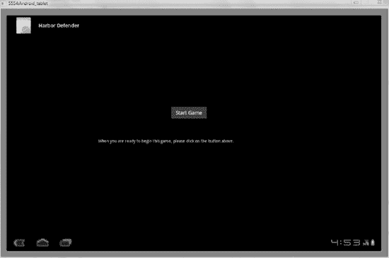
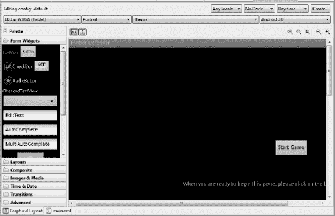
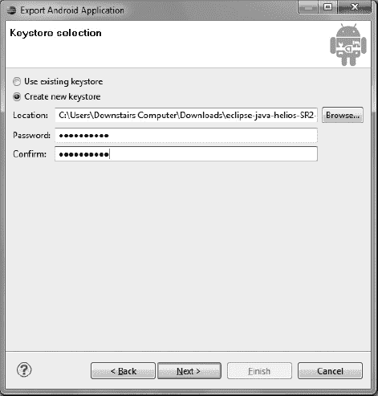
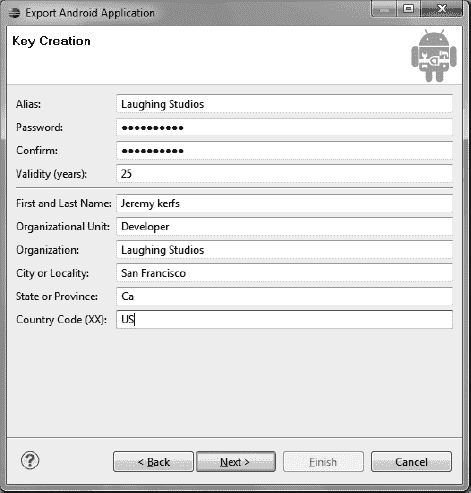
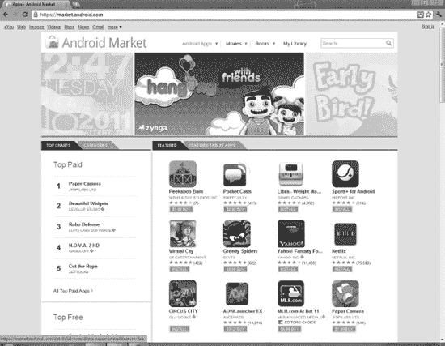
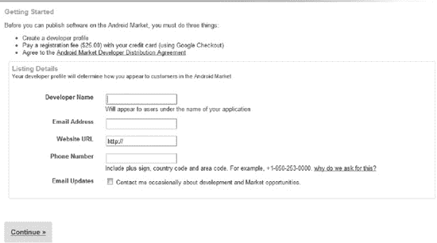
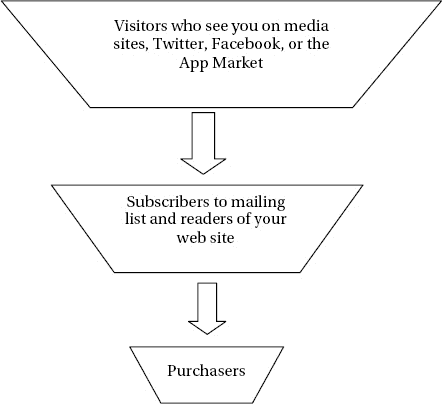

# 十、发布游戏

你的游戏已经为大众做好了准备，但是在应用被大众消费之前，你还有几个步骤。对代码有几处修改，可以用来润色您的工作。然后这一章讲述了出售或赠送游戏的步骤。最后，您将了解如何确保在竞争激烈的移动应用市场中取得成功。

制作一款高质量的游戏只是在 Android 应用市场获得畅销地位的第一步。到目前为止，你所做的一切都可以融入到你展示最终产品的过程中。这款应用的图形、声音和外观都融入了你向消费者销售的方式中。

### 打磨应用

虽然你的游戏可以玩，但它可能需要一些润色。欢迎屏幕将是一个很好的补充，这样玩家可以在进入游戏之前了解游戏。当谈到添加这个功能时，你有很多选择，但制作一个基本的入口屏幕很容易，你可以针对每个游戏进行微调。在本节中，您将添加一个屏幕，然后添加一个按钮来启动游戏。

#### 添加闪屏

因为`GameView.java`负责实际的游戏及其外观，所以你的启动页面由`MainActivity.java`处理。不是设置屏幕显示`GameView`，而是呈现一个快速布局，然后给用户进入游戏的能力。这使您的工作更专业，对用户来说也更容易。为了扩展这个概念，你可以播放一小段视频来介绍这个游戏，但是我会留给你自己去想象。

看看图 10-1 看看你的闪屏是什么样子的。如果你想要一个更完整的介绍界面，这一节将讨论添加特性和项目的方法。

***图 10-1。**游戏简介*

为了达到图 10-1 中的效果，让我们回到第一章中的概念。应用的外观是在`main.xml`中生成的，在这里你可以通过拖动按钮和文本到屏幕上来创建界面。然后编辑文本和元素。以下步骤显示了如何做到这一点:

> 1.  Navigate to the folder: `res` `layout` `main.xml` to find your main.xml file in the Harbor Defender project.
> 2.  Open `main.xml` and select "10.1-inch WXGA" from the drop-down menu near the top. The first task is to check the code of the main.xml file.
> 3.  Select `main.xml` on the small tab near the bottom of the screen. Replace the existing code with the code in Listing 10-1 .

***清单 10-1** 。`Main.xml`*

`<?xml version=*"1.0"* encoding=*"utf-8"*?>

<AbsoluteLayout
          xmlns:android=*"http://schemas.android.com/apk/res/android"*` `          android:orientation=*"vertical"*
          android:layout_width=*"fill_parent"*
          android:layout_height=*"fill_parent"*
        >

</AbsoluteLayout>`

你用一个`AbsoluteLayout`替换现有的`LinearLayout`。这两者都是可以添加布局元素的框架。然而，`AbsoluteLayout`让您快速指定元素的确切位置，而`LinearLayout`将所有项目向左对齐。当您添加欢迎屏幕的各个部分时，这一点非常重要。

5.选择屏幕底部的小图形布局选项卡，返回图形布局。

6.您可以使用左侧的项目面板来创建您的布局。图 10-2 显示了这将会是什么样子。将一个`Button`和一个`TextView`拖到您的屏幕上。它们现在包含填充文本，但是您很快就会编辑它。

*图 10-2**。**使用左边的调色板拖动`TextView`和`Button`对象到屏幕上*

7.是时候回到代码的视图了。选择屏幕底部的`main.xml`选项卡。您应该观察到两个新元素(`Button`和`TextView`)已经出现在您的`AbsoluteLayout`元素中。

8。您需要插入文本并更改按钮的`id`。查看清单 10-2 中的粗体代码。您可以使用不同的词，但重要的是记住您分配给按钮的`id`的名称或其他标识符。

***清单 10-2** 。`Main.xml`*

`<?xml version=*"1.0"* encoding=*"utf-8"*?>

<AbsoluteLayout
          xmlns:android="http://schemas.android.com/apk/res/android"
          android:orientation=*"vertical"*
          android:layout_width=*"fill_parent"*
          android:layout_height=*"fill_parent"*
        >

    <Button
android:text=*"***Start Game***"*
android:layout_width=*"wrap_content"*
android:id=*"@+id/***startgame***"*
android:layout_height=*"wrap_content"*
android:layout_x=*"557dip"*
android:layout_y=*"249dip"*></Button>

    <TextView
android:layout_width=*"wrap_content"*
android:layout_height=*"wrap_content"*
android:text=**"When you are ready to begin this game, please click on the button above."**
android:id=*"@+id/textView1"*
android:layout_x=*"310dip"*
android:layout_y=*"361dip"*></TextView>

</AbsoluteLayout>`

`layout_x`和`layout_y`行指定项目的位置。如果您想要精确地确定按钮和文本的位置，您可以编辑这些值。您使用`id`标签来引用代码中的对象，就像您在下一节中所做的那样。

#### 响应开始游戏按钮的按下

现在你已经有了一个很好的展示给用户，你需要让它具有交互性。让玩家快速开始游戏至关重要。这对于一个回归的玩家来说尤其重要。请记住，如果这个人回来玩你的游戏，他们希望很快开始玩，不希望看到说明或被介绍视频打扰。

为了显示你的新布局，然后让用户导航到真正的游戏，让我们回到`MainActivity.java`。这里你做一个简单的输入测试，然后展示实际的游戏。然而，最初你需要把`Main.xml`而不是`GameView.java`作为游戏的视图。请遵循以下步骤:

> 1.  Open `MainActivity.java` in the edit pane of Eclipse.
> 2.  Add the following `import` statement to the top of the file:

`import android.widget.Button;`

3.更改`MainActivity.java`的`onCreate()`方法，使其看起来像清单 10-3 中的。粗体部分是对你之前作品的修改。你必须进口`Android.view.View`才能让它工作。

***清单 10-3。**??`MainActivity.java`*

`@Override
public void onCreate(Bundle savedInstanceState) {
    super.onCreate(savedInstanceState);

    mGameView = new GameView(this);

    **setContentView(R.layout.*main*);**

    mSensorManager = (SensorManager)getSystemService(*SENSOR_SERVICE*);
    mAccelerometer = mSensorManager.getDefaultSensor(Sensor.*TYPE_ACCELEROMETER*);

    **final Button button = (Button) findViewById(R.id.*startgame*);**
    **button.setOnClickListener(new View.OnClickListener() {**
        **public void onClick(View v) {**

            **setContentView(mGameView);**
        **}**
    **});**

}`

第一个`setContentView()`告诉应用加载`main.xml`作为布局。按钮部分监听按钮的点击。一旦发生这种情况，你调用另一个`setContentView()`在屏幕上显示`GameView`。这是你用来初始化游戏的简单方法。

当你给按钮赋值时，使用函数`findViewById`；作为参数，您使用按钮的`id`。这就是为什么你要把`id`按钮设计成一个很容易识别的启动游戏的物品。

4.运行游戏，你会看到一个欢迎界面。按下开始游戏按钮继续，应用正常运行。

恭喜你:你终于完成了这本书的代码部分！下一部分处理游戏的最终编译和发行的准备工作。您离与其他用户共享您的创作越来越近了。

### 包装游戏

在游戏完成并准备发布之前，你必须注意几件事情。这一节讲述了如何清理代码，并最终将产品编译成一个 APK 文件，以备分发。APK 是包含所有游戏代码、图像和资源的包装。

请遵循以下步骤:

> 1.  The first thing to do is to delete any `Log.d` statements in the code. I usually perform global search and replacement to delete them. You don't want the retail version to waste processing power and send our debugging warning. You must fix the code version in the Android manifest file. Find this file by going to the root directory of `HarborDefender` folder and opening `AndroidManifest.xml`. The code should be similar to the tag shown in Listing 10-4 .

***清单 10-4。**??`AndroidManifest.xml`*

`<?xml version=*"1.0"* encoding=*"utf-8"*?>
<manifest xmlns:android=*"http://schemas.android.com/apk/res/android"*
      package=*"com.gameproject.harbordefender"*
      android:versionCode=*"**1**"*
      android:versionName=*"**1.0**"*>
    <uses-sdk android:minSdkVersion=*"**11**"* />

    <application android:icon=*"@drawable/icon"* android:label=*"@string/app_name"*>
        <activity android:name=*".MainActivity"*
                  android:label=*"@string/app_name"*>
            <intent-filter>
                <action android:name=*"android.intent.action.MAIN"* />
                <category android:name=*"android.intent.category.LAUNCHER"* />
            </intent-filter>
        </activity>

    </application>
</manifest>`

注意粗体部分。你可以设置自己的版本代码和版本名称，但这是惯例，因为这是你的第一个游戏，使用 1.0 作为版本。还要确保 SDK 的最低版本是 11。

3.在 Eclipse 中选择文件>导出。

4.选择导出 Android 应用作为您要执行的导出类型。

5.在下一页，输入你最终项目的名称: **Harbor Defender** 。

6.您必须创建一个密钥库，这是保护您的应用的安全性所必需的，并且被 Android 应用市场用作标识符。选择创建新的密钥库，如图图 10-3 所示，并使用浏览按钮打开一个窗口，让您将文件放入文件夹中..键入类似于 **harbordefenderkey** 的文件名，并接受默认位置。

***图 10-3。**生成密钥的提示*

7.创建一个唯一且难懂的密码来保护自己，如图图 10-3 所示。

8.在图 10-4 所示的密钥创建页面中填写适用信息。(图为我是如何完成的。)密码可以与您在上一页中使用的密码相同。

***图 10-4。**填写开发商信息*

9.下一页是最后一页。单击浏览，并输入 **HarborDefender** 作为 APK 目的地。关闭对话框，并完成该过程。

就这样，你完成了这个项目。下一节将讨论如何将这个项目引入应用市场并送到消费者手中。你还将讲述如何在拥挤的应用市场中做最好的营销和工作。

### 部署游戏

我希望你对你的游戏感到满意，并且相信其他人也会喜欢它。本节介绍如何使用 Android 应用市场。您将了解如何上传应用以及营销和定价的基本原理。有了这些信息，您就可以继续制作更多的待售应用。

首先，看一下图 10-5 ，图中显示了`[`market.android.com/`](https://market.android.com/)`的 Android 应用市场主页。

***图 10-5。**安卓应用市场*

在这个页面上，Android 移动设备和平板电脑的用户可以下载和购买应用。特别值得注意的是标签上写着特色平板电脑应用。Android 正在大力吸引平板电脑的买家，因此它将专门为平板电脑设计的应用与手机应用分开。这对你来说是个好消息，因为你面临的竞争少了很多。

在如何提供课程方面有很大的自由。你可以为你的应用设定一个介于 1 美元到 200 美元之间的价格，或者免费赠送。当一个顾客买了它，你得到了销售额的 70%;剩下的就是将应用发送到设备上的费用。谷歌不收取任何收益，但设备制造商和在线分销商收取处理交易的费用，就像信用卡公司对每笔交易收取费用一样。iPhone 和 iPad 应用只给开发者 60%的收入，所以从这个意义上说，Android 比苹果应用商店还有一个优势。

安卓市场上 57%的应用是免费的。竞争应用商店的免费应用比例要低得多。对你的暗示是，你必须意识到，要求用户付费的节目必须表现出优越的质量，并提供许多小时的播放时间。

你现在知道了应用市场的基本情况。您必须创建一个 Android 应用市场帐户，才能看到您自己的作品。下一节将介绍如何创建帐户并上传您的第一个应用。

#### 开设谷歌开发者账户

没有什么比看到自己的工作掌握在他人手中更让应用开发人员高兴的了。在这里，您可以创建您的 Android 应用市场帐户，并向全世界发布您的程序:

> 1.  Go to `[`market.android.com/`](https://market.android.com/)`. At the bottom of the screen, click Developer.
> 2.  Select the option to publish the application.
> 3.  Log in to your Google account, or create a new account. You should create a new account specifically for your application business, which is different from your regular email or Google+ activities.
> 4.  The next screen is shown in Figure 10-6 . Fill in with accurate and professional information. If you don't have a website, that's fine, but you might want one.  ?? * ?? 】 Figure 10-6\. Create your robot application market account*
> 5.  You are prompted to pay the registration fee. This is $25, which must be paid through Google checkout.

注册完成后，您的帐户就有了一个分类配置文件。你可以做很多事情，从添加一个谷歌结账账户以便获得付款，到上传一个应用。

现在你可以将你的游戏上传到谷歌市场了。

#### 上传游戏到谷歌市场

虽然大多数开发人员都想出售他们的应用，但这一部分介绍了如何将您的应用免费上传给公众。如果你想收到付款并为你的工作收费，请访问这个关于市场的惊人指南:[www . Google . com/support/androidmarket/developer/bin/topic . py？topic=15866](http://www.google.com/support/androidmarket/developer/bin/topic.py?topic=15866) 。

在完成上传游戏的简单过程之前，您必须准备好几个项目，包括:

> *   Include applications
> *   Two beautiful application screenshots of APK file highlight its characteristics.
> *   A high-resolution icon that users choose to play your game.

上传游戏是一个简单的命题。在您的在线开发人员控制台上，单击上传应用。在这里，您将看到一个向导，询问刚才列出的项目。在您存储文件的目录中找到这些文件。

关键是要有一个有吸引力的截图和描述，以及任何你想显示的附加图表；你的成功将关系到你的游戏吸引了多少用户。下一部分着眼于如何准备在市场上取得最大的成功。

### 营销您的游戏

营销你的应用需要将你的产品展示给尽可能多的人。如果你创造了一个像样的游戏，那么如果人们有机会看到它，他们就会购买。第一个问题是如何让你的应用脱颖而出。与 iPads 和 iPhones 的应用商店不同，Android 程序可以从任何网站下载，而不仅仅是谷歌官方市场。这意味着拥有自己网站的开发者更容易销售他们的产品，因为他们不会与市场上过多的类似应用混淆。用户可以直接来到他们的网站，看到视频、图片和程序说明，这些在 Android Market 上的简短描述中是不可能的。

利用这一事实，创建自己的网站，吸引潜在买家。创建一个脸书页面或推特账户也能增加关注度。不要把读者引向你在 Android 应用市场上的页面，而是把他们引向你自己网站上的一个页面，这样就不会那么混乱了。

如果你做过网上营销，你就会知道邮件列表有多有用。在您的网站上，为访问者提供注册更新您的应用和免费附加服务的机会。这样，即使他们没有立即购买，你也可以继续吸引他们，说服他们购买你的产品。看看 AWeber ( `[www.aweber.com/](http://www.aweber.com/)`)网站，它提供了一个很棒的邮件系统，你可以用它来向你的用户分发时事通讯。它每月收费，但许多营销人员发现，客户从简讯中获得的收益超过了成本。

最后，通过将你的公司或游戏放入更传统或可信的媒体来解决营销问题。请关注技术的杂志对其进行评论，或将相关信息发送给在线新闻来源。当你这样做的时候，确保你的游戏提供一些非常独特的东西。也许输入控制是完全创新的，或者游戏发生在零重力室内。让应用有新闻价值。这也可以由你的公司整体来做。举例来说，如果你所有游戏中的艺术作品都来自一位著名的画家，那绝对是一个值得一个网站谈论的独特故事。

所有这些技术都可以追溯到广告中使用的基本漏斗方法。它在各种各样的初级营销和公共关系书籍中有所阐述，但也需要包括在这里。你吸引的用户越多，时间越长，你的销售额就越多。图 10-7 显示了这是如何工作的。

***图 10-7。**将你的访客引向买家*

这就是营销技巧。通过反复试验，你会找到最适合你的方法。我发现在应用市场上的成功很少是在你的第一款甚至第二款游戏上实现的。你必须坚持下去，在获得金牌之前，建立对你的产品的期待和兴奋。

### 总结

恭喜你！你已经完成了这本书。你从发现什么是 Android 以及如何在其中编程，到编写一个完整的游戏，再到将你的工作投入应用市场。

这是一本有趣的书，我希望你也喜欢。从事一项发展如此迅速的技术工作既令人畏惧又令人振奋；理想情况下，这本书给了你一些关于如何为 Android 平板电脑创建自己的游戏的想法。

凭借 Android 过去的成功和光明的未来，我相信平板电脑对更好游戏的需求将会持续很长一段时间。确保你在那里抓住这个令人兴奋的浪潮。