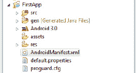

# 十一、在真实设备上测试 Android 游戏

如果你打算为 Android 平板电脑制作游戏，你肯定需要在真实的东西上测试它们。Android 有一个内置的方法来做到这一点，消除了开发人员过去在视频游戏机和其他移动平台上测试他们的创作时遇到的许多障碍。应用市场很难容忍那些有缺陷或问题的程序，而这些缺陷或问题在产品测试中很容易被修复。

本附录指导您快速设置平板电脑进行测试。要跟进，你需要一台 Android 3.0 平板电脑。在我写这篇文章的时候，市场上有很多平板电脑，每周都会有更多的上市，所以不可能一一列出。当我选择设备时，我很少寻找最先进的平板电脑，而是寻找最受欢迎的一款。如果大多数人使用你所使用的设备，那么你的结果将与大多数用户的结果相似。

选择一款拥有广泛认可的品牌名称和众多追随者的平板电脑。如果你有平板电脑的朋友，你应该在所有的平板电脑上测试你的应用。这里描述的过程不需要很长时间，所以你应该没有问题。

因为您将进行调试，所以硬件接口要求您将应用指定为*可调试的*。您可以通过在 Android 清单文件`AndroidManifest.xml`中设置一个参数来实现这一点。当您在 Eclipse project explorer 中查看您的项目文件夹时，您不会在其中看到清单文件。图 AppA-1 显示了在哪里可以找到这个文件。

***图 AppA-1。**安卓清单文件*

向 XML 中添加一个非常简单的参数，将项目定义为可调试的程序。清单 AppA-1 包含整个清单的代码，必须插入的部分用粗体显示。

***清单 AppA-1。**安卓清单文件*

`<?xml version=*"1.0"* encoding=*"utf-8"*?>
<manifest xmlns:android=*"http://schemas.android.com/apk/res/android"*
      package=*"com.gameproject.firstapp"*
      android:versionCode=*"1"*
      android:versionName=*"1.0"*>
    <uses-sdk android:minSdkVersion=*"11"* />

    <application android:icon=*"@drawable/icon"* android:label=*"@string/app_name"*
**android:debuggable="true">**

        <activity android:name=*".Main"*
                  android:label=*"@string/app_name"*>
            <intent-filter>
                <action android:name=*"android.intent.action.MAIN"* />
                <category android:name=*"android.intent.category.LAUNCHER"* />
            </intent-filter>
        </activity>

    </application>
</manifest>`

接下来的步骤因设备而异。谷歌推荐去平板上的`Application`文件夹，然后去`Development`文件夹，选择 USB 调试。如果这对你的平板电脑不起作用，快速搜索一下，看看如何打开这种类型的调试。

现在你需要一个特定 USB 设备的驱动程序。这与您在将平板电脑连接到电脑进行常规使用时安装的不同。你需要从谷歌 Android 开发者页面的 USB 驱动列表中选择一个:`[`developer.android.com/sdk/oem-usb.html`](http://developer.android.com/sdk/oem-usb.html)`。安装这些的过程非常简单。

以我拥有的摩托罗拉平板电脑为例。我点击链接进入摩托罗拉的开发者驱动主页。因为我在 64 位版本的 Windows 上运行程序，所以我选择了最新的手机 USB 驱动程序。(平板电脑是否是手机尚有争议，但驱动因素是一样的。)我按照设置流程做好了准备。

 **注意**如果你正在麦金塔电脑上开发，你不需要担心 USB 驱动程序:你已经准备好了。然而，Linux 用户手头有些工作要做。有关更多信息，请查看 Android 官方文档，了解如何设置开发设备:
`[`developer.android.com/guide/developing/device.html#setting-up`](http://developer.android.com/guide/developing/device.html#setting-up)`。

如果您正确地遵循这些指示，现在您可以在设备上测试您的程序。进入 Eclipse，像往常一样运行程序。您应该可以在添加的设备和模拟器之间进行选择，而不是默认使用模拟器。选择你插入的设备，你就可以像你的用户一样与你的应用互动。

请特别注意，有些应用只能在物理设备上运行。其中包括依赖加速度计数据或蓝牙连接的应用。