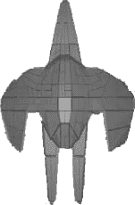

# 十、Blob Hunter：创建 3d 游戏

在这本书的前半部分，你花了很多时间来建立你的 OpenGL ES 技能，创造了*星际战士*。诚然，*星际战士*不会让玩家敲你的门来玩它。然而，这个游戏为你做了什么远比这个更重要。你在创建一个 2-D、自上而下的射击游戏时磨练出来的技能可以很容易地转化为创建一些令人惊叹的 3-D 游戏所需的技能。

在本书的剩余部分，您将构建一个 3d 环境，用于创建任意数量的引人入胜的 3d 游戏。让我们从讨论 2d 游戏和 3d 游戏的区别开始。

### 比较二维和三维游戏

视觉上，我们都可以区分二维游戏和三维游戏。2d 游戏看起来是平面的，很像动画片，而 3d 游戏在动态空间中具有多面物体的外观。2d 游戏无关紧要吗？当然不是。随着令人上瘾的手机游戏的出现，如*愤怒的小鸟*，以及令人眼花缭乱的其他 iPhone、Android 和脸书游戏，2-D 游戏市场仍然活跃并且相当不错。你可以继续扩展你的 2-D 游戏技能，创造一些令人惊奇的游戏。然而，如果你更喜欢更复杂的 3d 游戏，你需要从学习本书剩余章节中解释的内容开始。

当你创建你的 2d 游戏*星际战士*时，你创建了平面正方形(用平面三角形)。然后，您将一个精灵映射到该正方形的表面来创建您的角色。然而，拿起一张纸，看看它。即使它是平面的，但它在你手中仍然是立体的。您可以转动、旋转或弯曲它。拿六张纸，创建一个立方体。现在，三维形状更清晰了，但你真正改变的只是平面纸片的数量以及它们的排列方式。

这是一个非常基本的解释，说明你在*星际战士*中学到的技能和你开始构建一个新的 3d 游戏*斑点猎人*所需要的技能之间的简单过渡。你看到了吧，在没有意识到的情况下，你一直在做 3d 工作。您忽略了 z 轴的任何值，并告诉 OpenGL 在 2d 中渲染您的场景，从而展平了一切。

就 OpenGL 而言，2d 或 3d 游戏在空间上是一样的。区别在于你如何对待对象，以及你如何告诉 OpenGL 渲染它们。您需要创建更有说服力的复杂多边形，成为您的角色和环境，而不是创建有精灵映射的平面正方形。

在这一章中，你将创建一个新的 Android 项目来保存 *Blob Hunter* ，它将成为你学习一些重要的 3d 游戏开发技能的沙箱。您还将设置开始三维开发所需的几个文件。

### 创建您的三维项目

在本节中，您将开始创建将在本书的其余部分中使用的项目。创建 3-D 项目的过程将与您创建*星际战士*游戏项目的过程相同。

按照您在第 2 章中使用的相同步骤，创建一个名为`blobhunter`的新项目。这个项目将包含本书剩余部分的所有例子。你不会创建另一个像*星际战士*一样完整的项目，你将学习把你在 2d 工作的知识转换成 3d 环境的秘密。

一旦创建了新的`blobhunter`项目，就用一些启动文件填充它。虽然这个项目不会有*星际战士*的所有 flash 和菜单，但你仍然有一些启动游戏的基本文件。

在本书的前面，你学习了如何制作菜单和闪屏。事实是，无论游戏是二维还是三维的，用来创建游戏关键部分的过程都是一样的。因此，这里不再赘述。

但是，在接下来的部分中，您将向项目中添加四个基本文件来创建和显示渲染器。这就是你在这里所做的一切。你将不会有任何菜单，或任何优雅的代码杀死程序，就像你在*星际战士*中做的那样。

#### BlobhunterActivity.java

您需要在新的`blobhunter`项目中创建的第一个文件是`BlobhunterActivity.java`。在*星际战斗机*项目中，`StarfighterActivity.java`启动了闪屏，闪屏又启动了主菜单。然而，由于这里没有这些组件，`BlobhunterActivity`可以简单地启动`gameview`。

**提示:**你将在本章看到的大部分代码对你来说应该非常熟悉。从本质上来说，它都是取自*星际战斗机*项目。不同的是，它已经被严格地剥离和重新命名。

`package com.proandroidgames;

import android.app.Activity;
import android.os.Bundle;

public class BlobhunterActivity extends Activity {
/** Called when the activity is first created. */

**private BHGameView gameView;**

@Override
public void onCreate(Bundle savedInstanceState) {
super.onCreate(savedInstanceState);
**gameView = new BHGameView(this);**
setContentView(gameView);
BHEngine.context = this;
}
@Override
protected void onResume() {
super.onResume();
**gameView.onResume();**
}

@Override
protected void onPause() {
super.onPause();
**gameView.onPause();**
}
}`

注意，在突出显示的部分，这段代码引用了一个名为`BHGameView`的类。`BHGameView`级扩展了`GLSurfaceView`，与*星际战斗机*中的`SFGameView`用途相同。直到在下一节中创建了`BHGameView`，前面的代码才会编译。

#### BHGameView

创建`BHGameView`类的代码非常简单，应该如下所示:

`package com.proandroidgames;

import android.content.Context;
import android.opengl.GLSurfaceView;

public class BHGameView extends GLSurfaceView {
**private BHGameRenderer renderer;**

public BHGameView(Context context) {`
`super(context);

**renderer = new BHGameRenderer();**

**this.setRenderer(renderer);**

}

}`

再次注意，在突出显示的部分中，您引用了另一个类。是这个项目的游戏循环，将持有大部分代码。

#### 游戏渲染器

现在，创建一个名为`BHGameRenderer`的新文件类。

`package com.proandroidgames;

import javax.microedition.khronos.egl.EGLConfig;
import javax.microedition.khronos.opengles.GL10;

import android.opengl.GLSurfaceView.Renderer;

public class BHGameRenderer implements Renderer{

private long loopStart = 0;
private long loopEnd = 0;
private long loopRunTime = 0 ;

@Override
public void onDrawFrame(GL10 gl) {
loopStart = System.currentTimeMillis();
try {
if (loopRunTime < BHEngine.GAME_THREAD_FPS_SLEEP){
Thread.sleep(BHEngine.GAME_THREAD_FPS_SLEEP - loopRunTime);
}
} catch (InterruptedException e) {
e.printStackTrace();
}
gl.glClear(GL10.GL_COLOR_BUFFER_BIT | GL10.GL_DEPTH_BUFFER_BIT);
gl.glLoadIdentity();

loopEnd = System.currentTimeMillis();
loopRunTime = ((loopEnd - loopStart));

}

@Override
public void onSurfaceChanged(GL10 gl, int width, int height) {

gl.glViewport(0, 0, width,height);
gl.glMatrixMode(GL10.GL_PROJECTION);
gl.glLoadIdentity();`

`gl.glMatrixMode(GL10.GL_MODELVIEW);
gl.glLoadIdentity();
}

@Override
public void onSurfaceCreated(GL10 gl, EGLConfig config) {

gl.glEnable(GL10.GL_TEXTURE_2D);
gl.glClearDepthf(1.0f);
gl.glEnable(GL10.GL_DEPTH_TEST);
gl.glDepthFunc(GL10.GL_LEQUAL);
gl.glHint(GL10.GL_PERSPECTIVE_CORRECTION_HINT, GL10.GL_NICEST);
gl.glDisable(GL10.GL_DITHER);
}

}`

同样，如果你看一下`BHGameRenderer`的代码，你会注意到它只是你在*星际战斗机*中使用的代码的精简版。这将是足够让你真正进入 3d 游戏开发的代码。

#### BHEngine

建立项目需要创建的最后一个文件是`BHEngine`。在*星际战斗机*项目中，你创建了`SFEngine`文件，保存了游戏的所有全局常量、变量和方法。在 *Blob Hunte* r 项目中需要创建相同的文件来保存任何游戏引擎相关的代码。

`package com.proandroidgames;
import android.content.Context;
import android.view.Display;

public class BHEngine {
/*Constants that will be used in the game*/
public static final int GAME_THREAD_DELAY = 4000;
public static final int GAME_THREAD_FPS_SLEEP = (1000/60);
/*Game Variables*/

public static Context context;
}`

就是这样。现在，您应该有足够的代码来让您的项目脱离代码。然而，代码——以及包含它的项目——并没有真正做任何事情。让我们创建一个小型的三维测试来展示这个新项目可以做什么。

### 创建三维对象测试

在本节中，您将使用在上一节中设置的 *Blob Hunter* 项目，并向其中添加一些代码以生成一个 3-D 测试。你将使用*星际战士*中的一个精灵图像来创建一个围绕玩家旋转的快速图像。

首先拍摄侦察员的图像，如[图 10–1](#fig_10_1)所示，并将其添加到*斑点猎人*项目的`drawable-nodpi`文件夹中。

**图 10–1。** *侦察兵形象*

将图像添加到项目中后，在`BHEngine`类中为它创建一个常量。

注意:创建这个三维测试的步骤对你来说应该是非常熟悉的，并且在前几章中还记忆犹新。因此，对于一些基本的(之前已经介绍过的)技术，就不多解释了。然而，如果有些东西没有意义，试着回到前面的章节。

#### 创建常数

打开`BHEngine.java`文件，添加以下突出显示的代码行:

`package com.proandroidgames;

import android.content.Context;
import android.view.Display;

public class BHEngine {
/*Constants that will be used in the game*/
public static final int GAME_THREAD_DELAY = 4000;
public static final int GAME_THREAD_FPS_SLEEP = (1000/60);
**public static final int BACKGROUND = R.drawable.scout;**
/*Game Variables*/

public static Context context;
public static Display display;
}`

你现在要创建一个平面正方形，就像你为*星际战士*所做的一样，然后将这张侦察图像作为纹理映射到它上面。

#### 创建 BHWalls 类

在项目中创建一个名为`BHWalls`的新类。`BHWalls`类将在以后的章节中被用来创建墙壁，但是它在这里将作为一种创建平面正方形的方法。所有`BHWalls`类的代码都来自你为*星际战士*创建的`SFBackground`类；什么都没有改变。

`package com.proandroidgames;

import java.io.IOException;
import java.io.InputStream;
import java.nio.ByteBuffer;
import java.nio.ByteOrder;
import java.nio.FloatBuffer;

import javax.microedition.khronos.opengles.GL10;

import android.content.Context;
import android.graphics.Bitmap;
import android.graphics.BitmapFactory;
import android.opengl.GLUtils;

public class BHWalls {

private FloatBuffer vertexBuffer;
private FloatBuffer textureBuffer;
private ByteBuffer indexBuffer;

private int[] textures = new int[1];

private float vertices[] = {
0.0f, 0.0f, 0.0f,
1.0f, 0.0f, 0.0f,
1.0f, 1.0f, 0.0f,
0.0f, 1.0f, 0.0f,
};

private float texture[] = {
0.0f, 0.0f,
1.0f, 0f,
1f, 1.0f,
0f, 1f,
};

private byte indices[] = {
0,1,2,
0,2,3,
};

public BHWalls() {
ByteBuffer byteBuf = ByteBuffer.allocateDirect(vertices.length * 4);
byteBuf.order(ByteOrder.nativeOrder());
vertexBuffer = byteBuf.asFloatBuffer();
vertexBuffer.put(vertices);
vertexBuffer.position(0);`

`byteBuf = ByteBuffer.allocateDirect(texture.length * 4);
byteBuf.order(ByteOrder.nativeOrder());
textureBuffer = byteBuf.asFloatBuffer();
textureBuffer.put(texture);
textureBuffer.position(0);

indexBuffer = ByteBuffer.allocateDirect(indices.length);
indexBuffer.put(indices);
indexBuffer.position(0);
}

public void draw(GL10 gl) {
gl.glBindTexture(GL10.GL_TEXTURE_2D, textures[0]);

gl.glFrontFace(GL10.GL_CCW);

gl.glEnableClientState(GL10.GL_VERTEX_ARRAY);
gl.glEnableClientState(GL10.GL_TEXTURE_COORD_ARRAY);

gl.glVertexPointer(3, GL10.GL_FLOAT, 0, vertexBuffer);
gl.glTexCoordPointer(2, GL10.GL_FLOAT, 0, textureBuffer);

gl.glDrawElements(GL10.GL_TRIANGLES, indices.length, GL10.GL_UNSIGNED_BYTE, indexBuffer);

gl.glDisableClientState(GL10.GL_VERTEX_ARRAY);
gl.glDisableClientState(GL10.GL_TEXTURE_COORD_ARRAY);
gl.glDisable(GL10.GL_CULL_FACE);
}

public void loadTexture(GL10 gl,int texture, Context context) {
InputStream imagestream =
context.getResources().openRawResource(texture);
Bitmap bitmap = null;
try {
bitmap = BitmapFactory.decodeStream(imagestream);
}catch(Exception e){

}finally {
try {
imagestream.close();
imagestream = null;
} catch (IOException e) {
}
}

gl.glGenTextures(1, textures, 0);
gl.glBindTexture(GL10.GL_TEXTURE_2D, textures[0]);

gl.glTexParameterf(GL10.GL_TEXTURE_2D, GL10.GL_TEXTURE_MIN_FILTER, GL10.GL_NEAREST);
gl.glTexParameterf(GL10.GL_TEXTURE_2D, GL10.GL_TEXTURE_MAG_FILTER, GL10.GL_LINEAR);

gl.glTexParameterf(GL10.GL_TEXTURE_2D, GL10.GL_TEXTURE_WRAP_S, GL10.GL_REPEAT);
gl.glTexParameterf(GL10.GL_TEXTURE_2D, GL10.GL_TEXTURE_WRAP_T, GL10.GL_REPEAT);`

`GLUtils.texImage2D(GL10.GL_TEXTURE_2D, 0, bitmap, 0);

bitmap.recycle();
}
}`

现在您已经创建了一个类来构建您的对象，您将在游戏循环中实例化它。

#### 实例化 BHWalls 类

当您创建`BHWalls`的实例化时，您也将创建两个 floats。这些将被用来在三维空间中移动飞船的图像。

**注意:**需要明确的是，您并没有用这个代码创建一个 3d 的船。你将只拍摄上一个项目中的一幅图像，并在三维空间中旋转它——这在*星际战斗机*中是不可能做到的。

`package com.proandroidgames;

import javax.microedition.khronos.egl.EGLConfig;
import javax.microedition.khronos.opengles.GL10;

import android.opengl.GLSurfaceView.Renderer;

public class BHGameRenderer implements Renderer{
**private BHWalls background = new BHWalls();**
**private float rotateAngle = .25f;**
**private float rotateIncrement = .25f;**

private long loopStart = 0;
private long loopEnd = 0;
private long loopRunTime = 0 ;

@Override
public void onDrawFrame(GL10 gl) {
loopStart = System.currentTimeMillis();
try {
if (loopRunTime < BHEngine.GAME_THREAD_FPS_SLEEP){
Thread.sleep(BHEngine.GAME_THREAD_FPS_SLEEP - loopRunTime);
}
} catch (InterruptedException e) {
e.printStackTrace();
}
gl.glClear(GL10.GL_COLOR_BUFFER_BIT | GL10.GL_DEPTH_BUFFER_BIT);
gl.glLoadIdentity();

loopEnd = System.currentTimeMillis();
loopRunTime = ((loopEnd - loopStart));`

`}

@Override
public void onSurfaceChanged(GL10 gl, int width, int height) {

gl.glViewport(0, 0, width,height);
gl.glMatrixMode(GL10.GL_PROJECTION);
gl.glLoadIdentity();

gl.glMatrixMode(GL10.GL_MODELVIEW);
gl.glLoadIdentity();
}

@Override
public void onSurfaceCreated(GL10 gl, EGLConfig config) {

gl.glEnable(GL10.GL_TEXTURE_2D);
gl.glClearDepthf(1.0f);
gl.glEnable(GL10.GL_DEPTH_TEST);
gl.glDepthFunc(GL10.GL_LEQUAL);
gl.glHint(GL10.GL_PERSPECTIVE_CORRECTION_HINT, GL10.GL_NICEST);
gl.glDisable(GL10.GL_DITHER);
}

}`

`BHWalls`类已经被实例化，是时候调用`loadTexture()`方法了。

#### 映射图像

在本节中，您将使用`loadTexture()`方法，它是在*星际战士*游戏中引入的。回想一下，`loadTexture()`方法会将图像映射到`BHWalls`的顶点上。

`package com.proandroidgames;

import javax.microedition.khronos.egl.EGLConfig;
import javax.microedition.khronos.opengles.GL10;

import android.opengl.GLSurfaceView.Renderer;

public class BHGameRenderer implements Renderer{
private BHWalls background = new BHWalls();
private float rotateAngle = .25f;
private float rotateIncrement = .25f;

private long loopStart = 0;
private long loopEnd = 0;
private long loopRunTime = 0 ;

@Override
public void onDrawFrame(GL10 gl) {
loopStart = System.currentTimeMillis();
try {
if (loopRunTime < BHEngine.GAME_THREAD_FPS_SLEEP){`
`Thread.sleep(BHEngine.GAME_THREAD_FPS_SLEEP - loopRunTime);
}
} catch (InterruptedException e) {
e.printStackTrace();
}
gl.glClear(GL10.GL_COLOR_BUFFER_BIT | GL10.GL_DEPTH_BUFFER_BIT);
gl.glLoadIdentity();

loopEnd = System.currentTimeMillis();
loopRunTime = ((loopEnd - loopStart));

}

@Override
public void onSurfaceChanged(GL10 gl, int width, int height) {

gl.glViewport(0, 0, width,height);
gl.glMatrixMode(GL10.GL_PROJECTION);
gl.glLoadIdentity();

gl.glMatrixMode(GL10.GL_MODELVIEW);
gl.glLoadIdentity();
}

@Override
public void onSurfaceCreated(GL10 gl, EGLConfig config) {

gl.glEnable(GL10.GL_TEXTURE_2D);
gl.glClearDepthf(1.0f);
gl.glEnable(GL10.GL_DEPTH_TEST);
gl.glDepthFunc(GL10.GL_LEQUAL);
gl.glHint(GL10.GL_PERSPECTIVE_CORRECTION_HINT, GL10.GL_NICEST);
gl.glDisable(GL10.GL_DITHER);
**background.loadTexture(gl,BHEngine.BACKGROUND, BHEngine.context);**
}

}`

在这一点上，你可能想知道使用 OpenGL ES 进行 2-D 和 3-D 的最大区别在哪里，因为到目前为止，你使用的所有代码都来自 2-D *Star Fighter* 项目。

OpenGL 处理二维和三维的主要区别在于你如何告诉系统渲染你的世界。在*星际战士*游戏中，你告诉 Open GL 使用`glOrthof()`方法将你的世界渲染成一个扁平的 2d 环境。

`glOrthof()`方法丢弃了 z 轴值的含义。也就是说，当你使用`glOrthof()`时，所有的东西都以同样的尺寸呈现，不管它离玩家有多远。

为了在 3d 中渲染你的对象，你将使用`gluPerspective()`，这将在下面讨论。

#### 使用 gluPerspective()

`gluPerspective()`方法将考虑对象在 z 轴上与玩家的距离，然后以相对于其位置的正确大小和视角呈现对象。

`gluPerspective()`方法的参数与`glOrthof()`略有不同。要调用`gluPerspective()`，你需要给它传递一个有效的`GL10`实例，一个视角，一个方向，一个近的和一个远的 z 轴裁剪平面。

`gluPerspective(gl10, angle, aspect, nearz, farz)`

传递给`gluPerspective()`的角度指定了您希望 OpenGL 渲染的视角；任何超出该视角的东西都不会被看到。`aspect`参数是一个宽度/高度的浮点数。最后，近 z 裁剪平面和远 z 裁剪平面告诉 OpenGL 在哪里停止渲染。任何比近 z 平面更近或比远 z 平面更远的物体都将从渲染中被裁剪掉。

在`BHGameRender`的`onSurfaceChanged()`方法中，您将添加对`gluPerspective()`的调用。

`package com.proandroidgames;

import javax.microedition.khronos.egl.EGLConfig;
import javax.microedition.khronos.opengles.GL10;

import android.opengl.GLSurfaceView.Renderer;

public class BHGameRenderer implements Renderer{
private BHWalls background = new BHWalls();
private float rotateAngle = .25f;
private float rotateIncrement = .25f;

private long loopStart = 0;
private long loopEnd = 0;
private long loopRunTime = 0 ;`

`@Override
public void onDrawFrame(GL10 gl) {
loopStart = System.currentTimeMillis();
try {
if (loopRunTime < BHEngine.GAME_THREAD_FPS_SLEEP){
Thread.sleep(BHEngine.GAME_THREAD_FPS_SLEEP - loopRunTime);
}
} catch (InterruptedException e) {
e.printStackTrace();
}
gl.glClear(GL10.GL_COLOR_BUFFER_BIT | GL10.GL_DEPTH_BUFFER_BIT);
gl.glLoadIdentity();

loopEnd = System.currentTimeMillis();
loopRunTime = ((loopEnd - loopStart));

}

@Override
public void onSurfaceChanged(GL10 gl, int width, int height) {

gl.glViewport(0, 0, width,height);
gl.glMatrixMode(GL10.GL_PROJECTION);
gl.glLoadIdentity();

**GLU.gluPerspective(gl, 45.0f, (float) width / height, .1f, 100.f);**

gl.glMatrixMode(GL10.GL_MODELVIEW);
gl.glLoadIdentity();
}

@Override
public void onSurfaceCreated(GL10 gl, EGLConfig config) {

gl.glEnable(GL10.GL_TEXTURE_2D);
gl.glClearDepthf(1.0f);
gl.glEnable(GL10.GL_DEPTH_TEST);
gl.glDepthFunc(GL10.GL_LEQUAL);
gl.glHint(GL10.GL_PERSPECTIVE_CORRECTION_HINT, GL10.GL_NICEST);
gl.glDisable(GL10.GL_DITHER);
**background.loadTexture(gl,BHEngine.BACKGROUND, BHEngine.context);**
}
}`

在下一节中，您将使用名为`drawBackground()`的方法绘制背景平面。

#### 创建 drawBackground()方法

你需要一个新的方法来将`BHWalls`顶点绘制到屏幕上，并移动它们来展示 OpenGL 的 3d 渲染。现在，创建一个`drawBackground()`方法，它将使用`glRotatef()`方法在 z 轴上围绕玩家旋转侦察员的图像。

OpenGL 方法`glRotatef()`有四个参数。第一个指定旋转的角度。第二个、第三个和第四个参数是 x、y 和 z 轴的标志，指示要对哪个轴应用旋转角度。

以下代码显示了上下文中的`drawBackground()`方法:

`package com.proandroidgames;

import javax.microedition.khronos.egl.EGLConfig;
import javax.microedition.khronos.opengles.GL10;

import android.opengl.GLSurfaceView.Renderer;

public class BHGameRenderer implements Renderer{
private BHWalls background = new BHWalls();
private float rotateAngle = .25f;
private float rotateIncrement = .25f;

private long loopStart = 0;`
`private long loopEnd = 0;
private long loopRunTime = 0 ;

@Override
public void onDrawFrame(GL10 gl) {
loopStart = System.currentTimeMillis();
try {
if (loopRunTime < BHEngine.GAME_THREAD_FPS_SLEEP){
Thread.sleep(BHEngine.GAME_THREAD_FPS_SLEEP - loopRunTime);
}
} catch (InterruptedException e) {
e.printStackTrace();
}
gl.glClear(GL10.GL_COLOR_BUFFER_BIT | GL10.GL_DEPTH_BUFFER_BIT);
gl.glLoadIdentity();

loopEnd = System.currentTimeMillis();
loopRunTime = ((loopEnd - loopStart));

}

**private void drawBackground(GL10 gl){**

**GLU.gluLookAt(gl, 0f, 0f, 5f, 0f, 0f, 0f, 0f, 1f, 0f);**
**gl.glRotatef(rotateAngle, 0.0f, 1.0f, 0.0f);**
**gl.glTranslatef(0.0f, 0.0f, -3f);**

**background.draw(gl);**
**rotateAngle += rotateIncrement;**

}

@Override
public void onSurfaceChanged(GL10 gl, int width, int height) {

gl.glViewport(0, 0, width,height);
gl.glMatrixMode(GL10.GL_PROJECTION);
gl.glLoadIdentity();

**GLU.gluPerspective(gl, 45.0f, (float) width / height, .1f, 100.f);**

gl.glMatrixMode(GL10.GL_MODELVIEW);
gl.glLoadIdentity();
}

@Override
public void onSurfaceCreated(GL10 gl, EGLConfig config) {

gl.glEnable(GL10.GL_TEXTURE_2D);
gl.glClearDepthf(1.0f);
gl.glEnable(GL10.GL_DEPTH_TEST);
gl.glDepthFunc(GL10.GL_LEQUAL);
gl.glHint(GL10.GL_PERSPECTIVE_CORRECTION_HINT, GL10.GL_NICEST);
gl.glDisable(GL10.GL_DITHER);
**background.loadTexture(gl,BHEngine.BACKGROUND, BHEngine.context);**
}
}`

注意这个例子中有一个新的方法调用。这个`gluLookAt()`调用告诉“摄像机”在世界的哪个地方寻找。如果您曾经使用过 3-D 渲染软件，如 Maya 或 3-D Studio Max，您可能会熟悉这样一个概念，即在渲染场景时，摄影机充当场景的查看者。OpenGL 并没有真正把相机作为一个独立的对象。然而，`gluLookAt()`方法是一种指向渲染以查看世界上特定位置的方法。

`gluLookAt()`方法接受一个有效的`GL10`对象加上三组三个参数。这三组三个参数是眼睛的 x、y 和 z 值(渲染器正在看的地方)；“相机”中心(渲染器位于世界中的位置)的 x、y 和 z 值；以及表示哪个轴向上的 x、y 和 z 位置。如本例所述，您正在告诉“摄像机”查看位于`0x`、`0y`和`5z`的一个点，将其自身集中在`0x`、`0y`和`0z`点上，并且向上的方向朝向`1y`。

#### 画龙点睛

现在，调用`drawBackground()`方法，编译你的游戏。你应该看到一个侦察船的图像在你的前方和后方旋转。

`package com.proandroidgames;

import javax.microedition.khronos.egl.EGLConfig;
import javax.microedition.khronos.opengles.GL10;

import android.opengl.GLSurfaceView.Renderer;

public class BHGameRenderer implements Renderer{
private BHWalls background = new BHWalls();
private float rotateAngle = .25f;
private float rotateIncrement = .25f;

private long loopStart = 0;
private long loopEnd = 0;
private long loopRunTime = 0 ;

@Override
public void onDrawFrame(GL10 gl) {
loopStart = System.currentTimeMillis();
try {
if (loopRunTime < BHEngine.GAME_THREAD_FPS_SLEEP){
Thread.sleep(BHEngine.GAME_THREAD_FPS_SLEEP - loopRunTime);
}
} catch (InterruptedException e) {
e.printStackTrace();
}
gl.glClear(GL10.GL_COLOR_BUFFER_BIT | GL10.GL_DEPTH_BUFFER_BIT);
gl.glLoadIdentity();

**drawBackground(gl);**

loopEnd = System.currentTimeMillis();`
`loopRunTime = ((loopEnd - loopStart));

}

**private void drawBackground(GL10 gl){**

**GLU.gluLookAt(gl, 0f, 0f, 5f, 0f, 0f, 0f, 0f, 1f, 0f);**
**gl.glRotatef(rotateAngle, 0.0f, 1.0f, 0.0f);**
**gl.glTranslatef(0.0f, 0.0f, -3f);**

**background.draw(gl);**
**rotateAngle += rotateIncrement;**

}

@Override
public void onSurfaceChanged(GL10 gl, int width, int height) {

gl.glViewport(0, 0, width,height);
gl.glMatrixMode(GL10.GL_PROJECTION);
gl.glLoadIdentity();

**GLU.gluPerspective(gl, 45.0f, (float) width / height, .1f, 100.f);**

gl.glMatrixMode(GL10.GL_MODELVIEW);
gl.glLoadIdentity();
}

@Override
public void onSurfaceCreated(GL10 gl, EGLConfig config) {

gl.glEnable(GL10.GL_TEXTURE_2D);
gl.glClearDepthf(1.0f);
gl.glEnable(GL10.GL_DEPTH_TEST);
gl.glDepthFunc(GL10.GL_LEQUAL);
gl.glHint(GL10.GL_PERSPECTIVE_CORRECTION_HINT, GL10.GL_NICEST);
gl.glDisable(GL10.GL_DITHER);
**background.loadTexture(gl,BHEngine.BACKGROUND, BHEngine.context);**
}
}`

在下一章中，你将为 *Blob Hunter* 创建一个 3d 环境。这将是一个基于走廊的环境，很像早期的*末日*和*雷神之锤* FPS 游戏。

### 总结

在这一章中，你为 3d 游戏 *Blob Hunter* 创建了项目。您还了解了 OpenGL ES 渲染二维和三维环境的不同之处。从二维环境创建三维环境的关键在于你告诉 OpenGL 渲染你的对象的方式。OpenGL 通过允许你使用相同的顶点和纹理，并且只改变几行代码，使得从 2d 游戏到 3d 游戏的过程变得非常容易。当你创建一个物体在三维空间旋转的快速演示时，这个过程就清楚了。