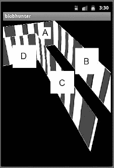
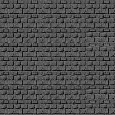
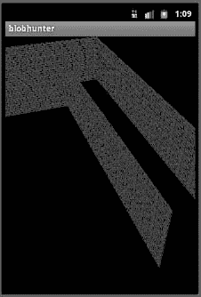

# 十一、创造身临其境的环境

在前一章中，你学习了如何将一些新的 2d 游戏开发技巧应用到 3d 游戏中。您了解了 OpenGL ES 如何以三维方式呈现对象，以及如何移动这些对象以获得三维效果。

在这一章中，你将为你的 3d 游戏建立一个环境。因为这是一个 3d 开发的初级读本，你将学习如何创建所有 FPS 游戏的标准-走廊。您将使用在前面章节中学到的技术来创建一个 L 形走廊供玩家导航。

最后，在本书的最后一章，你将了解到你的玩家如何通过这个走廊，并实施一些碰撞检测，以防止他们穿墙而过。

让我们从你在第十章中创建的`BHWalls`类开始。

### 使用 BHWalls 类

在前一章中，您创建了一个小型的三维测试。作为这个测试的一部分，您创建了一个`BHWalls`类，它创建了一个方形的墙壁形状并对其应用了纹理。这如何应用到你要创建的 3d 游戏中呢？让我们来看看一个 3d 世界来找出答案。在本节中，您将学习如何从上一章的小型`BHWalls`测试转移到 3d 走廊。

现在看看你的周围；你看到了什么？走到外面；向上看，向下看。

如果你在室内环顾四周，你可能会看到一些墙。你看不到墙外的房间或环境，因为墙的结构挡住了你的视线。你可能知道你在一所房子或一栋大楼里，但是你的眼睛只能看到环境中没有遮挡的部分。

如果你搬到外面，这同样适用；是的，环境大了很多，你能看到的也多了很多，但你看到的依然是有限的空间。总有一些东西会限制你的视野——可能是房子，树木，甚至是你站的地方。

现在将您的注意力转移到计算机环境。直到你放置物体到你的环境中，你的玩家将拥有一个 360 度无阻碍的视野。由您决定将视图限制在您希望他们体验特定区域。在本书前面你创作的 2d 游戏*星际战士*中，很容易控制玩家的世界观。您创建了场景的单一静态视图。游戏的所有动作都发生在这一个视图中。

在 3d 游戏中，控制玩家看到的东西有点困难，因为玩家可以控制他们对世界的看法。因此，你必须以这样一种方式放置物体和创造环境，即你控制玩家可以看到什么，即使他们将控制如何看到它。

在 3d 第一人称游戏的早期，对游戏环境的控制是通过走廊来实现的。回想一下一些最受欢迎的早期第一人称射击游戏，如*末日*、*雷神之锤*和*沃尔芬斯坦城堡*。他们都使用房间和走廊来引导你去你需要去的地方，但让你感觉好像你在一个更大的，自由漫游的环境中。

您已经具备了创建有效的三维走廊所需的所有技能。不管任何一条走廊有多长，它都可以由一系列的墙组成。在第十章中，你建了一堵墙，并在玩家周围移动。你可以简单地多建 5、10 或 15 堵这样的墙，把它们放在特定的位置，创造出一条长长的转弯走廊。

#### 从多个 BHWalls 实例创建走廊

让我们来看看`BHWalls`到底创造了什么。

`…

private float vertices[] = {
0.0f, 0.0f, 0.0f,
1.0f, 0.0f, 0.0f,
1.0f, 1.0f, 0.0f,
0.0f, 1.0f, 0.0f,
};

…`

这段代码是`BHWalls`级的一部分——你应该还记得*星际战士*中非常重要的一部分。这个数组表示一个可以呈现到屏幕上的正方形。虽然这个正方形理论上可以代表任何东西，但对你来说，它是一面墙。

您可以渲染多面墙，然后使用`glTranslatef()`，您可以将每面墙移动到位。代码看起来会像这样:

`…`

`**gl.glTranslatef(0.0f, 0.0f, 0f);**
**gl.glRotatef( 45.0f, 0.0f,1.0f, 0.0f);**
corridor.draw(gl);

gl.glTranslatef(0.0f, 0.0f, 1f);
gl.glRotatef( 45.0f, 0.0f,1.0f, 0.0f);
corridor.draw(gl);

gl.glTranslatef(-1.0f, 0.0f, 0f);
gl.glRotatef( 45.0f, 0.0f,1.0f, 0.0f);
corridor.draw(gl);

gl.glTranslatef(-1.0f, 0.0f, 1f);
gl.glRotatef( 45.0f, 0.0f,1.0f, 0.0f);
corridor.draw(gl);

gl.glTranslatef(0.0f, 0.0f, 0f);
gl.glRotatef( 0.0f, 0.0f,0.0f, 0.0f);
corridor.draw(gl);

…`

虽然这比你可以在游戏中直接使用的任何东西都要更加伪代码，但你可以看到如何通过渲染几面墙并使用 OpenGL 来平移和旋转它们来创建一个走廊；你可以拼凑出一条走廊。

然而，这种方法有其缺点。首先，这很费时间。要建造一个相当大的走廊需要很长时间才能砌好所有的墙。第二，由于要跟踪这么多独立的对象，搞砸一些事情会非常容易。你可能会弄不清哪堵墙通向哪里，把某些东西转错方向。最后，有那么多的对象需要 OpenGL 来创建、移动和渲染，你的游戏将不会尽可能的高效。

有更好的方法来创造游戏环境。您可以用一个对象一次构建整个走廊。

### 使用 BHCorridor 类

在本节中，您将创建一个新的类，`BHCorridor`。`BHCorridor`类将负责从多个多边形创建一条走廊。然后，您将能够将该道路视为单个对象。

在下一章，也是最后一章，能够把走廊当作一个单独的物体将会非常方便，你将允许玩家在走廊中导航。这将需要四处移动对象，当您要跟踪的对象较少时，这将容易得多。

让我们构建`BHCorridor`类。我们将遍历整个类，因为在`BHCorridor`和你在上一章中使用的`BHWalls`类之间会有一些不同。

#### 建造 BHCorridorClass

在本节中，您将开始构建`BHCorridor`类。这个类将用于一次创建一个完整的三维走廊，而不是将许多独立的墙拼凑在一起。首先，在你的 *Blob Hunter* 项目中创建一个名为`BHCorridor`的新类。

`package com.proandroidgames;

public class BHCorridor {

}`

接下来，您需要设置您的阵列。

`package com.proandroidgames;

**import java.nio.FloatBuffer;**

public class BHCorridor {
private FloatBuffer vertexBuffer;
**private FloatBuffer textureBuffer;**

**private int[] textures = new int[1];**

**private float vertices[] = {**

**};**

**private float texture[] = {**

**};**

**}**`

在`BHWalls`类中，甚至在本书前面的`SFBackground`中，`vertices[]`数组将保存 12 个值，如下所示:

`private float vertices[] = {
0.0f, 0.0f, 0.0f,
1.0f, 0.0f, 0.0f,
1.0f, 1.0f, 0.0f,
0.0f, 1.0f, 0.0f,
};`

这些值表示正方形角的 x、y 和 z 轴坐标(更准确地说，是构成正方形的两个三角形的角)。

您将通过向数组中一次性输入构建整个走廊所需的所有坐标来构建此逻辑(而不是实例化多个墙对象并将它们粘贴在一起)。你将要建造的走廊将是 L 形的，如图图 11–1 所示。

**图 11–1。**?? 完工的走廊形状

Figure 11–1 中的图像展示了您将要创建的走廊的形状。这个图像中添加了一个任意的纹理来帮助你看清形状。请注意，走廊呈 L 形，向左弯曲，由四个主要的墙段组成。这些部分被标记为 A、B、C 和 D，我们在建造墙壁时将参考这些字母。

##### 用 vertices[]数组构建多面墙

让我们设置`vertices[]`数组来创建多面墙。您可以从墙段 a 开始。这是一面平墙，正对着站在走廊尽头的玩家。

`private float vertices[] = {
-2.0f, 0.0f, 0.0f,
1.0f, 0.0f, 0.0f,
-2.0f, 1.0f, 0.0f,
1.0f, 1.0f, 0.0f,`

接下来，您将为墙段 b 添加顶点。此段与右侧的 A 相连，并在 z 轴上向玩家延伸。

`private float vertices[] = {
-2.0f, 0.0f, 0.0f,
1.0f, 0.0f, 0.0f,
-2.0f, 1.0f, 0.0f,
1.0f, 1.0f, 0.0f,

**1.0f, 0.0f, 0.0f,**
**1.0f, 0.0f, 5.0f,**
**1.0f, 1.0f, 0.0f,**
**1.0f, 1.0f, 5.0f,**`

现在，为墙段 c 添加顶点。该墙段与墙段 B 相对，也向玩家延伸。

`private float vertices[] = {
-2.0f, 0.0f, 0.0f,
1.0f, 0.0f, 0.0f,
-2.0f, 1.0f, 0.0f,
1.0f, 1.0f, 0.0f,

1.0f, 0.0f, 0.0f,
1.0f, 0.0f, 5.0f,
1.0f, 1.0f, 0.0f,
1.0f, 1.0f, 5.0f,

**0.0f, 0.0f, 1.0f,**
**0.0f, 0.0f, 5.0f,**
**0.0f, 1.0f, 1.0f,**
**0.0f, 1.0f, 5.0f,**`

最后，添加墙段 d 的顶点。这是与墙段 A 相对的墙段，从墙段 C 的末端向屏幕左侧延伸。

`private float vertices[] = {
-2.0f, 0.0f, 0.0f,
1.0f, 0.0f, 0.0f,
-2.0f, 1.0f, 0.0f,
1.0f, 1.0f, 0.0f,

1.0f, 0.0f, 0.0f,
1.0f, 0.0f, 5.0f,
1.0f, 1.0f, 0.0f,
1.0f, 1.0f, 5.0f,

**0.0f, 0.0f, 1.0f,**
**0.0f, 0.0f, 5.0f,**
**0.0f, 1.0f, 1.0f,**
**0.0f, 1.0f, 5.0f,**

**-2.0f, 0.0f, 1.0f,**
**0.0f, 0.0f, 1.0f,**
**-2.0f, 1.0f, 1.0f,**
**0.0f, 1.0f, 1.0f,**
**};**`

就是这样。这些都是建造走廊所需的顶点。

**注意:**因为您使用的是 Java，所以像这样在其他`.java`文件中存储大型数据数组并非不可能。然后，您可以加载这些文件并从中读取数组。

随着`vertices[]`数组的完成，您可以创建`texture[]`数组。像`vertices[]`阵列一样，`texture[]`阵列需要一些小的调整，然后才能用于对走廊应用纹理。

##### 创建纹理[]数组

在前面的章节中，您构建了一个类似如下的`texture[]`数组:

`private float texture[] = {
-1.0f, 0.0f,
1.0f, 0f,
-1f, 1f,
1f, 1.0f,
};`

`texture[]`数组包含映射点，它告诉 OpenGL 纹理如何适合顶点。既然您已经创建了一个新的有四组不同顶点的`vertices[]`数组，那么您还需要一个包含映射点集的`texture[]`数组:每组顶点一个。

尽量不要纠结于如何在没有 z 轴坐标的情况下将纹理映射到走廊墙壁上。在`texture[]`数组中的映射点对应于纹理的角落，而不是墙的顶点。因此，因为您将把整个纹理映射到每面墙上，所以四组纹理映射点将是相同的。

`private float texture[] = {
-1.0f, 0.0f,
1.0f, 0f,
-1f, 1f,
1f, 1.0f,

**-1.0f, 0.0f,**
**1.0f, 0f,**
**-1f, 1f,**
**1f, 1.0f,**

**-1.0f, 0.0f,**
**1.0f, 0f,**
**-1f, 1f,**
**1f, 1.0f,**

**-1.0f, 0.0f,**
**1.0f, 0f,**
**-1f, 1f,**
**1f, 1.0f,**

**};**`

现在，您的`BHCorridor`类应该是这样的:

`package com.proandroidgames;

import java.nio.FloatBuffer;

public class BHCorridor {
**private FloatBuffer vertexBuffer;**
**private FloatBuffer textureBuffer;**

**private int[] textures = new int[1];**`

`private float vertices[] = {
s
**-2.0f, 0.0f, 0.0f,**
**1.0f, 0.0f, 0.0f,**
**-2.0f, 1.0f, 0.0f,**
**1.0f, 1.0f, 0.0f,**

**1.0f, 0.0f, 0.0f,**
**1.0f, 0.0f, 5.0f,**
**1.0f, 1.0f, 0.0f,**
**1.0f, 1.0f, 5.0f,**

**0.0f, 0.0f, 1.0f,**
**0.0f, 0.0f, 5.0f,**
**0.0f, 1.0f, 1.0f,**
**0.0f, 1.0f, 5.0f,**

**-2.0f, 0.0f, 1.0f,**
**0.0f, 0.0f, 1.0f,**
**-2.0f, 1.0f, 1.0f,**
**0.0f, 1.0f, 1.0f,**

**};**

private float texture[] = {

**-1.0f, 0.0f,**
**1.0f, 0f,**
**-1f, 1f,**
**1f, 1.0f,**

**-1.0f, 0.0f,**
**1.0f, 0f,**
**-1f, 1f,**
**1f, 1.0f,**

**-1.0f, 0.0f,**
**1.0f, 0f,**
**-1f, 1f,**
**1f, 1.0f,**

**-1.0f, 0.0f,**
**1.0f, 0f,**
**-1f, 1f,**
**1f, 1.0f,**

};

}`

接下来，添加一个将创建缓冲区的构造函数，就像您对`BHWalls`和`SFBackground`所做的那样。

`public BHCorridor() {
ByteBuffer byteBuf = ByteBuffer.allocateDirect(vertices.length * 4);
byteBuf.order(ByteOrder.nativeOrder());
vertexBuffer = byteBuf.asFloatBuffer();
vertexBuffer.put(vertices);
vertexBuffer.position(0);

byteBuf = ByteBuffer.allocateDirect(texture.length * 4);
byteBuf.order(ByteOrder.nativeOrder());
textureBuffer = byteBuf.asFloatBuffer();
textureBuffer.put(texture);
textureBuffer.position(0);
}`

之后，添加`loadTexture()`方法。这里也没有什么大的变化，所以不需要进一步的解释(如果你不确定`loadTexture()`方法是如何工作的，回头查看第四章中的详细解释)。

`public void loadTexture(GL10 gl,int texture, Context context) {
InputStream imagestream = context.getResources().openRawResource(texture);
Bitmap bitmap = null;
try {

bitmap = BitmapFactory.decodeStream(imagestream);

}catch(Exception e){

}finally {

try {
imagestream.close();
imagestream = null;
} catch (IOException e) {
}
}

gl.glGenTextures(1, textures, 0);
gl.glBindTexture(GL10.GL_TEXTURE_2D, textures[0]);

gl.glTexParameterf(GL10.GL_TEXTURE_2D, GL10.GL_TEXTURE_MIN_FILTER, GL10.GL_NEAREST);
gl.glTexParameterf(GL10.GL_TEXTURE_2D, GL10.GL_TEXTURE_MAG_FILTER, GL10.GL_LINEAR);

gl.glTexParameterf(GL10.GL_TEXTURE_2D, GL10.GL_TEXTURE_WRAP_S, GL10.GL_REPEAT);
gl.glTexParameterf(GL10.GL_TEXTURE_2D, GL10.GL_TEXTURE_WRAP_T, GL10.GL_REPEAT);

GLUtils.texImage2D(GL10.GL_TEXTURE_2D, 0, bitmap, 0);

bitmap.recycle();
}`

最后，在下一节中，您将创建`draw()`方法。记住，渲染器调用`draw()`方法来绘制走廊。在`BHCorridor.draw()`中有一些变化来解释`vertices[]`数组中的多组顶点。

##### 创建 draw()方法

您将使用指向墙段顶点的指针的`glDrawArrays()`方法。看看你的`vertices[]`阵。该阵列在视觉上被分成四组，每组四个顶点——墙段的每个角一个顶点。你需要告诉 OpenGL 每个墙段的开始和结束位置。因此，您将把每个墙段的起点和顶点数传递到`glDrawArrays()`中。

墙段 A 的`glDrawArrays()`调用将如下所示:

`gl.glDrawArrays(GL10.GL_TRIANGLE_STRIP, 0,4);`

这一行告诉 OpenGL 从数组中的位置 0 开始，读取四个顶点。按照这种逻辑，墙段 2 将从数组中的位置 4 开始，延伸到另外四个顶点，依此类推。

由于对`glDrawArrays()`的调用是`draw()`方法与`BHCorridor`的唯一区别，您的方法应该如下所示:

`public void draw(GL10 gl) {

gl.glBindTexture(GL10.GL_TEXTURE_2D, textures[0]);
gl.glFrontFace(GL10.GL_CCW);

gl.glVertexPointer(3, GL10.GL_FLOAT, 0, vertexBuffer);
gl.glTexCoordPointer(2, GL10.GL_FLOAT, 0, textureBuffer);

gl.glEnableClientState(GL10.GL_VERTEX_ARRAY);
gl.glEnableClientState(GL10.GL_TEXTURE_COORD_ARRAY);

gl.glDrawArrays(GL10.GL_TRIANGLE_STRIP, 0,4);

gl.glDrawArrays(GL10.GL_TRIANGLE_STRIP, 4,4);

gl.glDrawArrays(GL10.GL_TRIANGLE_STRIP, 8,4);

gl.glDrawArrays(GL10.GL_TRIANGLE_STRIP, 12,4);

gl.glDisableClientState(GL10.GL_VERTEX_ARRAY);
gl.glDisableClientState(GL10.GL_TEXTURE_COORD_ARRAY);
gl.glDisable(GL10.GL_CULL_FACE);

}`

你完成的`BHCorridor`类显示在清单 11–1 中。

**清单 11-1。BHCorridor.java**??

`package com.proandroidgames;

import java.io.IOException;
import java.io.InputStream;
import java.nio.ByteBuffer;
import java.nio.ByteOrder;
import java.nio.FloatBuffer;`

`import javax.microedition.khronos.opengles.GL10;

import android.content.Context;
import android.graphics.Bitmap;
import android.graphics.BitmapFactory;
import android.opengl.GLUtils;

public class BHCorridor {
private FloatBuffer vertexBuffer;
private FloatBuffer textureBuffer;

private int[] textures = new int[1];

private float vertices[] = {

-2.0f, 0.0f, 0.0f,
1.0f, 0.0f, 0.0f,
-2.0f, 1.0f, 0.0f,
1.0f, 1.0f, 0.0f,

1.0f, 0.0f, 0.0f,
1.0f, 0.0f, 5.0f,
1.0f, 1.0f, 0.0f,
1.0f, 1.0f, 5.0f,

0.0f, 0.0f, 1.0f,
0.0f, 0.0f, 5.0f,
0.0f, 1.0f, 1.0f,
0.0f, 1.0f, 5.0f,

-2.0f, 0.0f, 1.0f,
0.0f, 0.0f, 1.0f,
-2.0f, 1.0f, 1.0f,
0.0f, 1.0f, 1.0f,

};

private float texture[] = {

-1.0f, 0.0f,
1.0f, 0f,
-1f, 1f,
1f, 1.0f,

-1.0f, 0.0f,
1.0f, 0f,
-1f, 1f,
1f, 1.0f,

-1.0f, 0.0f,
1.0f, 0f,
-1f, 1f,
1f, 1.0f,

-1.0f, 0.0f,
1.0f, 0f,
-1f, 1f,`
`1f, 1.0f,

};

public BHCorridor() {
ByteBuffer byteBuf = ByteBuffer.allocateDirect(vertices.length * 4);
byteBuf.order(ByteOrder.nativeOrder());
vertexBuffer = byteBuf.asFloatBuffer();
vertexBuffer.put(vertices);
vertexBuffer.position(0);

byteBuf = ByteBuffer.allocateDirect(texture.length * 4);
byteBuf.order(ByteOrder.nativeOrder());
textureBuffer = byteBuf.asFloatBuffer();
textureBuffer.put(texture);
textureBuffer.position(0);
}

public void draw(GL10 gl) {

gl.glBindTexture(GL10.GL_TEXTURE_2D, textures[0]);
gl.glFrontFace(GL10.GL_CCW);

gl.glVertexPointer(3, GL10.GL_FLOAT, 0, vertexBuffer);
gl.glTexCoordPointer(2, GL10.GL_FLOAT, 0, textureBuffer);

gl.glEnableClientState(GL10.GL_VERTEX_ARRAY);
gl.glEnableClientState(GL10.GL_TEXTURE_COORD_ARRAY);

gl.glDrawArrays(GL10.GL_TRIANGLE_STRIP, 0,4);

gl.glDrawArrays(GL10.GL_TRIANGLE_STRIP, 4,4);

gl.glDrawArrays(GL10.GL_TRIANGLE_STRIP, 8,4);

gl.glDrawArrays(GL10.GL_TRIANGLE_STRIP, 12,4);

gl.glDisableClientState(GL10.GL_VERTEX_ARRAY);
gl.glDisableClientState(GL10.GL_TEXTURE_COORD_ARRAY);
gl.glDisable(GL10.GL_CULL_FACE);

}

public void loadTexture(GL10 gl,int texture, Context context) {
InputStream imagestream =
context.getResources().openRawResource(texture);
Bitmap bitmap = null;
try {

bitmap = BitmapFactory.decodeStream(imagestream);

}catch(Exception e){

}finally {

try {
imagestream.close();`
`imagestream = null;
} catch (IOException e) {
}
}

gl.glGenTextures(1, textures, 0);
gl.glBindTexture(GL10.GL_TEXTURE_2D, textures[0]);

gl.glTexParameterf(GL10.GL_TEXTURE_2D, GL10.GL_TEXTURE_MIN_FILTER, GL10.GL_NEAREST);
gl.glTexParameterf(GL10.GL_TEXTURE_2D, GL10.GL_TEXTURE_MAG_FILTER, GL10.GL_LINEAR);

gl.glTexParameterf(GL10.GL_TEXTURE_2D, GL10.GL_TEXTURE_WRAP_S, GL10.GL_REPEAT);
gl.glTexParameterf(GL10.GL_TEXTURE_2D, GL10.GL_TEXTURE_WRAP_T, GL10.GL_REPEAT);

GLUtils.texImage2D(GL10.GL_TEXTURE_2D, 0, bitmap, 0);

bitmap.recycle();
}

}`

#### 添加墙壁纹理

随着`BHCorridor`类的创建并能够将纹理映射到墙壁上，是时候添加一个漂亮的墙壁纹理来替换图 11–1 中显示的临时纹理了。图 11–2 展示了你将要映射到走廊墙壁上的墙壁纹理。

**图 11–2。** *墙壁纹理*

首先将这张图片添加到您的`drawable.nodpi`文件夹中。然后，在`BHEngine`中添加对它的引用，如下所示:

`public static final int BACK_WALL = R.drawable.walltexture256;`

当这个新纹理被应用时，你完成的墙将会出现如图 Figure 11–3 所示。

**图 11–3。** *带纹理的墙壁*

在下一节中，你将实例化一个`BHCorridor`类的副本，并用你刚刚添加到*斑点猎人*的新纹理将它绘制到屏幕上。

### 呼叫 BHCorridor

正如本书前面的*星际战士*项目，所有*斑点猎人*的渲染都在游戏渲染类中执行。在第十章中，你创建了这个类，`BHGameRenderer`。在本节中，您将添加一个将在游戏循环中调用的`drawCorridor()`方法。打开`BHGameRenderer.java`文件，添加一个`BHCorridor`的新实例，如下所示:

`private BHCorridor corridor = new BHCorridor();`

现在，您可以创建一个`drawCorridor()`方法。该方法将设置`gluLookAt()`(参见第十章了解如何工作的描述)，并在其 x 和 y 轴上旋转走廊，如图图 11–3 所示。

`private void drawCorridor(GL10 gl){

GLU.gluLookAt(gl, 0f, 0f, 5f, 0f, 0f, 0, 0, 1, 0);
gl.glRotatef( 40.0f, 1.0f,0.0f, 0.0f);
gl.glRotatef( 20.0f, 0.0f,1.0f, 0.0f);
gl.glTranslatef(0.0f, 0.0f, -3f);

corridor.draw(gl);

}`

再次强调，所有这些代码看起来都应该非常熟悉。到这本书的这一点，应该很少有新的代码。你只是把你在创建的 2d 游戏中学到的代码和技能应用到 3d 环境中。

### 总结

在本章中，您学习了如何在一次调用中创建一个多多边形对象-走廊。然后，你给走廊添加了一个纹理，并用`BHGamerRenderer`渲染到屏幕上。这是你学习曲线上的一个尖峰，因为它教会你如何管理一些非常复杂的对象。几乎任何你能想到的 3d 环境，从广阔的城市景观到复杂的迷宫，都可以用这种技术建造。

在本书的最后一章，第十二章，你将创建穿越这个 3d 走廊所需的控件，包括碰撞检测，以确保玩家不会穿过你的墙壁。