# 二、如何开始

事不宜迟，让我们为您提供构建 Android 应用所需的各种组件。

**注意:**在撰写本文时，此处提供的说明是准确的。然而，工具变化很快，所以当您读到本文时，这些说明可能已经过时了。请参考 Android 开发者网站以获得最新的指导，并以此作为预期的基本指南。

### 第一步:设置 Java

当您编写 Android 应用时，您通常会用 Java 源代码编写它们。然后，Java 源代码被转换成 Android 实际运行的东西(Android 包[APK]文件中的 Dalvikbytecode)。

因此，您需要做的第一件事是建立一个 Java 开发环境，以便为开始编写 Java 类做好准备。

#### 安装 JDK

您需要获得并安装官方的 Oracle Java SE 开发工具包(JDK)。您可以从适用于 Windows 和 Linux 的 Oracle Java 网站以及适用于 Mac OS X 的 Apple 网站上获得该文件。普通的 JDK(没有任何“捆绑包”)应该足够了。按照 Oracle 或 Apple 提供的说明将其安装到您的机器上。在撰写本文时，Android 支持 Java 5 和 Java 6，而在您阅读本文时，可能会支持 Java 7。

可选的 JAVA 编译器

原则上，你应该使用官方的 JDK 神谕。实际上，OpenJDK 似乎也能工作，至少在 Ubuntu 上是这样。然而，离正式的 Oracle 实现越远，它就越不可能工作。例如，GNU Java 编译器(GCJ)可能无法在 Android 上运行。

#### 学习 Java

像大多数关于 Android 的书籍和文档一样，这本书假设您有基本的 Java 编程经验。如果你缺乏这些，你真的应该考虑在钻研 Android 之前花点时间在 Java 基础上。否则，你可能会觉得这种经历令人沮丧。

如果你需要参加 Java 速成班来参与 Android 开发，以下是你需要学习的概念，排名不分先后:

*   语言基础(流量控制等。)
*   类别和对象
*   方法和数据成员
*   公共、私有和受保护
*   静态和实例范围
*   例外
*   线程和并发控制
*   收集
*   无商标消费品
*   文件输入输出
*   反射
*   接口

获取这些知识最简单的方法之一就是阅读 Jeff Friesen 的*Learn Java for Android Development*(a press，2010)。

### 第二步:安装 Android SDK

Android SDK 为您提供了创建和测试 Android 应用所需的所有工具。它由两部分组成:基础工具和特定于版本的 SDK 以及相关的附加组件。

#### 安装基础工具

你可以在 Android 开发者网站上找到 Android 开发者工具，网址是`[`developer.android.com`](http://developer.android.com)`。下载适用于您的平台的 ZIP 文件，并将其解压缩到您机器上的一个逻辑位置—不需要特定的路径。Windows 用户还可以选择运行自动安装的 EXE 文件。

#### 安装 SDK 和附加软件

在上一步安装的 Android SDK 的`tools/`目录中，您将看到一个`android`批处理文件或 shell 脚本。如果你运行它，你会看到 Android SDK 和 AVD 管理器，如图图 2–1 所示。

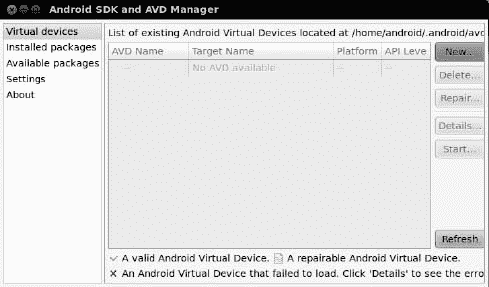

**图 2–1。** *Android SDK 和 AVD 管理器*

此时，您已经有了一些构建工具，但是缺少编译 Android 应用所必需的 Java 文件。您还缺少一些额外的构建工具，以及运行 Android 模拟器所需的文件。要解决这个问题，单击左侧的可用包选项，打开图 2–2 所示的屏幕。

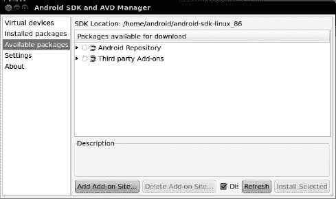

**图 2–2。** *安卓 SDK 和 AVD 管理器可用包*

打开树的 Android 存储库分支。短暂停顿后，您将看到类似于图 2–3 的屏幕。

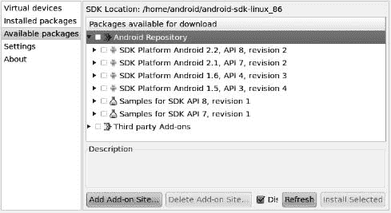

**图 2–3。** *Android SDK 和 AVD 管理器可用 Android 软件包*

选中以下项目的复选框:

*   针对您想要测试的所有 Android SDK 版本的“SDK 平台”
*   最新 Android SDK 版本的“Android SDK 文档”
*   最新 Android SDK 版本的“SDK 示例”,如果您愿意，也可以是旧版本

然后，打开树的第三方附加组件分支。短暂停顿后，您将看到类似于图 2–4 的屏幕。

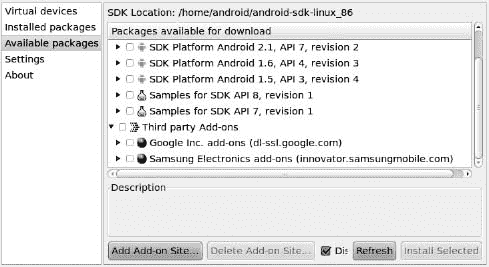

**图 2–4。**??【安卓 SDK 和 AVD 管理器】可用第三方插件

点击“Google Inc. add-ons”分支将其打开，如图 2–5 所示。

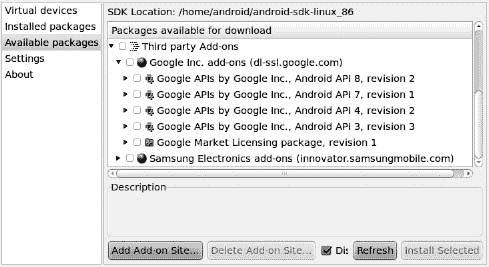

**图 2–5。** *安卓 SDK 和 AVD 管理器可用谷歌插件*

最有可能的情况是，您需要选中与您在 Android Repository 分支中选择的 SDK 版本相匹配的“Google APIs by Google Inc .”项目的复选框。Google APIs 包括对众所周知的 Google 产品的支持，比如 Google Maps，既来自您的代码，也来自 Android 模拟器。

检查完所有要下载的项目后，单击安装选定项目按钮，这将弹出一个许可确认对话框，如图 2–6 所示。

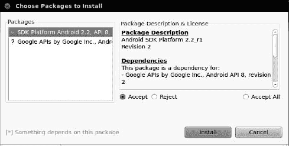

**图 2–6。** *Android SDK 和 AVD Manger 许可协议屏幕*

如果您同意条款，请检查并接受许可，然后单击安装按钮。在这一点上，这是一个很好的时间去吃午饭或晚饭。除非你有一个坚实的互联网连接，否则下载所有这些数据并解压将需要相当多的时间。

下载完成后，如果你愿意，你可以关闭 SDK 和 AVD 管理器，尽管你将在本章的第 5 步中使用它来设置模拟器。

### 步骤 3:为 Eclipse 安装 ADT

如果您不打算在 Android 开发中使用 Eclipse，可以跳到下一节。如果您将使用 Eclipse，但还没有安装它，那么您需要先安装它。Eclipse 可以从 Eclipse 网站`[www.eclipse.org/](http://www.eclipse.org)`下载。Eclipse IDE for Java Developers 包可以很好地工作。

接下来，您需要安装 Android 开发者工具(ADT)插件。为此，打开 Eclipse 并选择帮助 安装新软件。然后，在 Install 对话框中，单击 Add 按钮添加新的插件源。给它起个名字(比如 Android)并提供下面的 URL: `[`dl-ssl.google.com/android/eclipse/`](https://dl-ssl.google.com/android/eclipse/)`。这应该会触发 Eclipse 从该站点下载可用的插件列表(参见图 2–7)。

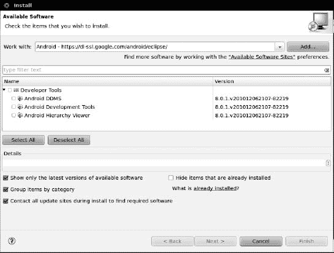

**图 2–7。** *Eclipse ADT 插件安装*

选中开发工具复选框，然后单击下一步按钮。按照向导的其余步骤查看要下载的工具，并查看和接受它们各自的许可协议。当 Finish 按钮被激活时，单击它，Eclipse 将下载并安装插件。完成后，Eclipse 会要求重启；让它这样做吧。

然后，您需要向 ADT 展示在哪里可以找到前面小节中的 Android SDK 安装。为此，从 Eclipse 主菜单中选择窗口 首选项(或 Mac OS X 的等效首选项选项)。在首选项对话框的列表窗格中点击 Android 条目，如图 Figure 2–8 所示。

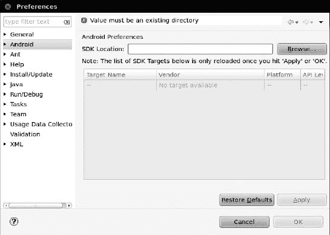

**图 2–8。**Eclipse ADT 配置

然后，单击 Browse 按钮找到安装 SDK 的目录。选择它之后，在首选项对话框中单击应用，您应该会看到您之前安装的 Android SDK 版本。然后，单击 OK，ADT 就可以使用了。

### 步骤 4:安装 Apache Ant

如果您将从 Eclipse 进行所有的开发，那么您可以跳到下一节。如果您希望使用命令行构建工具进行开发，您需要安装 Apache Ant。您可能已经在以前的 Java 开发工作中安装了这个，因为它在 Java 项目中相当常见。但是，您需要 Ant 版本 1.8.1 或更高版本，因此请检查您的当前副本(例如，`ant -version`)。

如果您没有 Ant 或者没有正确的版本，您可以从 Apache Ant 网站`[`ant.apache.org/`](http://ant.apache.org)`获得它。Ant 手册中提供了完整的安装说明，但基本步骤如下:

1.  将 ZIP 存档文件解压到机器上的逻辑位置。
2.  添加一个`JAVA_HOME`环境变量，指向你的 JDK 的安装位置，如果你还没有的话。
3.  添加一个`ANT_HOME`环境变量，指向您在步骤 1 中解包 Ant 的目录。
4.  将`$JAVA_HOME/bin`和`$ANT_HOME/bin`添加到您的`PATH`中。
5.  运行`ant -version`确认 Ant 安装正确。

### 第五步:设置仿真器

Android 工具包括一个*模拟器*，一个伪装成 Android 设备的软件。这对于开发非常有用，因为它不仅使您能够在没有设备的情况下开始 Android 开发，还使您能够为您不拥有的设备测试设备配置。

Android 模拟器可以模拟一个或几个 Android 设备。你想要的每个配置都存储在一个 Android 虚拟设备(AVD)中。您在本章前面用来下载 SDK 组件的 Android SDK 和 AVD 管理器是您创建这些 AVD 的地方。

如果您没有运行 SDK 和 AVD 管理器，您可以通过 SDK 的`tools/`目录中的`android`命令运行它，或者通过 Eclipse 中的窗口运行 SDK 和 AVD 管理器。它会打开一个屏幕，列出您可以使用的 AVDs 最初，列表将为空，如图图 2–9 所示。

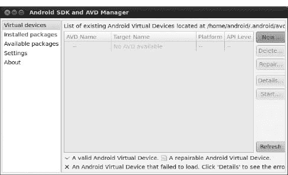

**图 2–9。** *Android SDK 和 AVD 管理器 Android 虚拟设备列表*

单击“新建”按钮创建新的 AVD 文件。这将打开如图图 2–10 所示的对话框，您可以在其中配置 AVD 的外观和工作方式。

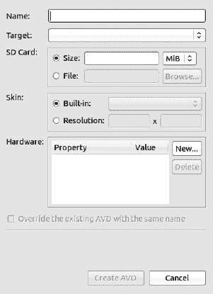

**图 2–10。**增加一个新的 AVD

您需要提供以下信息:

*   *AVD 的一个名字*:因为这个名字存在于你的开发机器上的文件中，所以你受到你的操作系统的文件名约定的限制(例如，在 Windows 上没有反斜杠)。
*   *您希望仿真器运行的 Android 版本(目标)*:通过目标下拉列表选择一个您安装的 SDK。请注意，除了“纯”Android 环境，您还可以选择基于您选择的第三方附加组件的选项。例如，您可能有一些选项来设置包含 Google APIs 的 AVD，并且您将需要这样的 AVD 来测试使用 Google Maps 的应用。
*   *仿真器应该仿真的 SD 卡的详细信息*:由于 Android 设备总是有某种形式的外部存储，您可能希望通过在相关字段中提供一个大小来设置 SD 卡。然而，由于将在您的开发机器上创建一个您为卡指定的任何大小的文件，您可能不希望创建一个 2GB 的仿真 SD 卡。32MB 是一个不错的起点，不过如果需要的话，你可以更大。
*   *模拟器应该在*中运行的“皮肤”或分辨率:您可以使用的皮肤选项取决于您选择的目标。皮肤让你选择一个典型的 Android 屏幕分辨率(例如，800×480 的 WVGA800)。当您想要测试非标准配置时，也可以手动指定分辨率。

您现在可以跳过对话框的硬件部分，因为通常只有高级配置才需要更改这些设置。

产生的对话框看起来可能类似于 Figure 2–11。

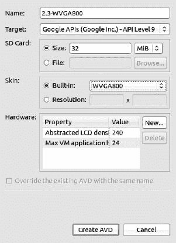

**图 2–11。** *添加新的 AVD(续)*

单击 Create AVD 按钮，您的 AVD 存根将被创建。

要启动模拟器，请在 Android 虚拟设备列表中选择它，然后单击 start。你现在可以跳过启动选项，只需点击启动。第一次启动新的 AVD 时，需要很长时间才能启动。第二次和以后启动 AVD 时，速度会快一点，通常每天只需要启动一次(例如，当您开始开发时)。在大多数情况下，每次想要测试应用时，不需要停止并重新启动模拟器。

仿真器将经历几个启动阶段，第一个阶段显示一个纯文本 ANDROID 标签，如图 Figure 2–12 所示。

**图 2–12。** *安卓模拟器，初始启动段*

第二阶段显示一个图形化的 Android 徽标，如图图 2–13 所示。

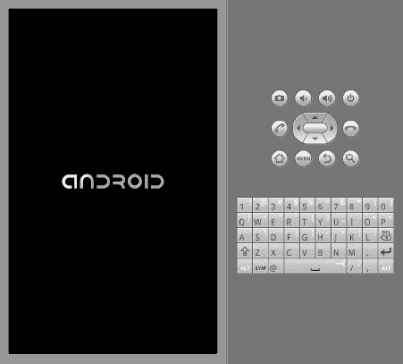

**图 2–13。** *安卓模拟器，二次启动段*

最后，模拟器到达主屏幕(第一次运行 AVD 参见图 2–14 或键帽(参见图 2–15)。

**图 2–14。** *安卓主屏幕*

如果你有键盘守卫，按下菜单按钮或滑动屏幕上的绿色锁到右边，到模拟器的主屏幕。

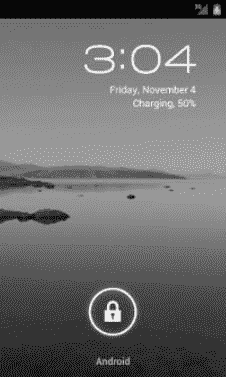

**图 2-15。** *Android keyguard*

### 第六步:设置设备

有了模拟器，您不需要 Android 设备就可以开始 Android 应用开发。在尝试发布应用(例如，将它上传到 Android Market)之前，拥有一个应用是一个好主意。但是也许你已经有了一台设备——也许这就是激发你开发 Android 的兴趣的原因。

让您的设备准备好用于开发的第一步是进入设备上的设置应用。在那里，选择应用，然后选择开发。这将为您提供一组用于选择发展相关选项的复选框，类似于图 2–16 中所示。

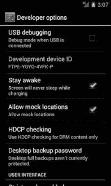

**图 2–16。** *安卓设备开发设置*

通常，您会希望启用 USB 调试，这样您就可以使用 Android 构建工具来使用您的设备。如果你愿意，你可以暂时不设置其他设置，尽管你可能会发现保持清醒选项很方便，因为它让你不必在手机插入 USB 时重复解锁。

接下来，您需要设置您的开发机器来与您的设备对话。该过程因您的开发机器的操作系统而异，如以下部分所述。

#### 窗口

当你第一次插入 Android 设备时，Windows 会尝试为它找到一个驱动程序。由于您已经安装了其他软件，驱动程序可能已经可以使用了。如果 Windows 找到了驱动程序，您就可以开始了。

如果 Windows 找不到驱动程序，以下是获取驱动程序的一些选项:

*   *Windows Update* :某些版本的 Windows(例如 Vista)会提示您在 Windows Update 中搜索驱动程序。这当然值得一试，尽管不是每个设备制造商都会向微软提供其设备的驱动程序。
*   *标准 Android 驱动*:在你的 Android SDK 安装中，你会发现一个`google-usb_driver`目录，包含一个 Android 设备通用的 Windows 驱动。您可以尝试将驱动程序向导指向这个目录，看看它是否认为这个驱动程序适合您的设备。
*   *制造商提供的驱动程序*:如果您仍然没有驱动程序，请搜索设备附带的光盘(如果有)或搜索设备制造商的网站。例如，摩托罗拉可以在一个地方下载所有设备的驱动程序。

#### Mac OS X 和 Linux

很有可能只要插上你的设备就能“正常工作”你可以通过在一个 shell(例如 OS X 终端)中运行`adb devices`来查看 Android 是否识别你的设备，其中`adb`位于你的 SDK 的`platform-tools/`目录中。如果您得到类似如下的输出，Android 检测到您的设备:

`List of devices attached
HT9CPP809576  device`

如果您运行的是 Ubuntu(或者另一个 Linux 版本)并且这个命令不起作用，您可能需要添加一些`udev`规则。例如，这里有一个`51-android.rules`文件，它将处理一些制造商的设备:

`SUBSYSTEM=="usb", SYSFS{idVendor}=="0bb4", MODE="0666"
SUBSYSTEM=="usb", SYSFS{idVendor}=="22b8", MODE="0666"
SUBSYSTEM=="usb", SYSFS{idVendor}=="18d1", MODE="0666"
SUBSYSTEMS=="usb", ATTRS{idVendor}=="18d1", ATTRS{idProduct}=="0c01", MODE="0666",
 OWNER="[me]"
SUBSYSTEM=="usb", SYSFS{idVendor}=="19d2", SYSFS{idProduct}=="1354", MODE="0666"
SUBSYSTEM=="usb", SYSFS{idVendor}=="04e8", SYSFS{idProduct}=="681c", MODE="0666"`

将它放到 Ubuntu 上的`/etc/udev/rules.d`目录中，然后重启计算机或者重新加载`udev`规则(例如`sudo service udev reload`)。然后，拔下设备，再插上，看是否检测到。