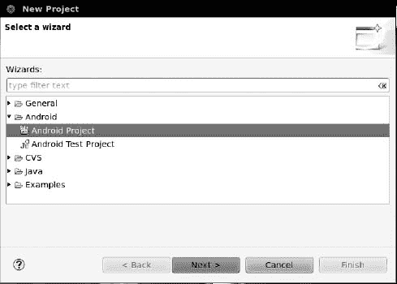
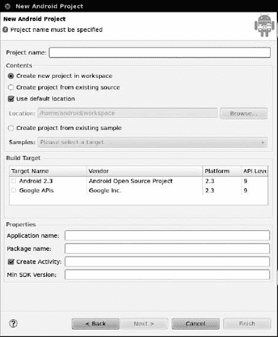
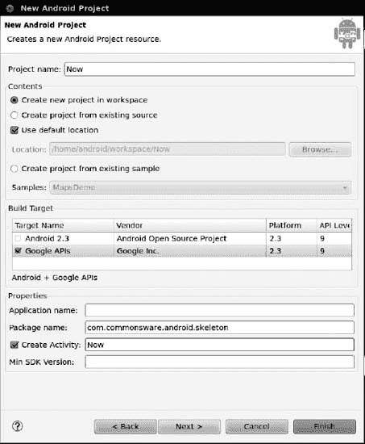
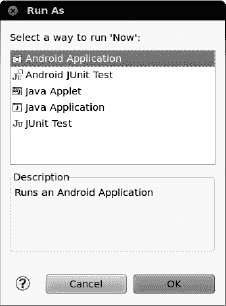
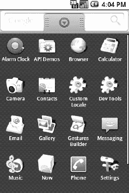

# 三、你的第一个 Android 项目

现在你有了 Android SDK，是时候做你的第一个 Android 项目了。好消息是这不需要任何代码——Android 的工具创建了一个“你好，世界！”作为创建新项目的一部分。您所需要做的就是构建它，安装它，并在您的仿真器或设备上观察它的打开。

### 第一步:创建新项目

Android 的工具可以为你创建一个完整的骨架项目，拥有一个完整(虽然很琐碎)的 Android 应用所需的一切。根据您使用的是 Eclipse 之类的 IDE 还是命令行，这个过程会有所不同。

#### 月食

从 Eclipse 主菜单中，选择`**File**`  `**New**`   `**Project**`以打开新建项目对话框，该对话框提供了可供选择的项目类型向导列表。展开 Android 选项，点击 Android 项目，如图 Figure 3–1 所示。

**图 3–1。** *在 Eclipse 新项目对话框中选择向导*

点击下一步进入新 Android 项目向导的第一页，如图 3–2 所示。

**图 3–2。** *Eclipse 新建 Android 项目向导，准备填写*

填写以下内容，否则保留默认设置(该项目的完整示例见图 3–3):

*   *项目名称*:项目名称(如 Now)
*   *构建目标*:您希望编译的 Android SDK(例如，Android 2.3.3 的 Google APIs)
*   *应用名称*:应用的显示名称，将用于启动器中图标下的标题(如现在)
*   *包名*:该项目所属 Java 包的名称(如 com . common sware . Android . skeleton)
*   *创建活动*:要创建的初始活动的名称(如 Now)

**图 3–3。** *Eclipse 新建 Android 项目向导，已完成*

此时，单击 Finish 创建您的 Eclipse 项目。

#### 命令行

下面是一个从命令行创建 Android 项目的示例命令:

`android create project --target "Google Inc.:Google APIs:7" --path Skeleton/Now
 --activity Now --package com.commonsware.android.skeleton`

这为您创建了一个应用框架，其中包含了构建您的第一个 Android 应用所需的一切:Java 源代码、构建指令等等。但是，您可能需要对此进行一些定制。这些命令行开关的含义如下:

*   `--target`:表示你的构建过程针对的是哪个版本的 Android。您需要提供一个安装在您的开发机器上的目标的 ID，它是您通过 Android SDK 和 AVD 管理器下载的。您可以通过`android list targets`命令找出哪些目标可用。通常情况下，你的构建过程会以你现有的最新版本的 Android 为目标。
*   `--path`:表示希望项目文件生成的位置。如果您指定的目录不存在，Android 将创建一个目录。例如，在前面的命令中，将在当前工作目录下创建一个`Skeleton/Now/`目录(或者使用它),项目文件将存储在那里。
*   `--activity`:表示这个项目的第一个活动的 Java 类名。不要包含包名，并确保该名称符合 Java 类命名约定。
*   `--package`:表示第一个活动所在的 Java 包。这个包名也可以在你安装它的任何设备上唯一地标识你的项目，如果你计划在 Android Market 上发布你的应用，它必须是唯一的。因此，通常情况下，您应该基于您自己的域名(例如，`com.commonsware.android.skeleton`)来构建您的包，以减少意外包名与其他人冲突的几率。

对于你的开发机，需要挑一个合适的目标，不妨换个路径。您现在可以忽略活动和包。

### 步骤 2:在您的模拟器或设备中构建、安装并运行应用

拥有一个项目固然很好，但如果你能构建并运行它，无论是在 Android 模拟器上还是在你的 Android 设备上，那就更好了。同样，根据您使用的是 Eclipse 还是命令行，这个过程会有所不同。

#### 月食

在 Eclipse 的 Package Explorer 面板上选中您的项目后，单击 Eclipse 工具栏中绿色的 play 按钮来运行您的项目。第一次这样做时，您必须经历几个步骤来设置运行配置，因此 Eclipse 知道您想要做什么。

首先，在运行方式对话框中，选择 Android 应用，如图 Figure 3–4 所示。

**图 3–4。** *在 Eclipse 运行方式对话框中选择作为 Android 应用运行*

单击确定。如果你有一个以上的模拟器 AVD 或设备可用，你会得到一个选项来选择你想运行的应用。否则，如果您没有插入设备，模拟器将使用您之前创建的 AVD 启动。然后，Eclipse 将在您的设备或模拟器上安装应用并启动它。

#### 命令行

对于没有使用 Eclipse 的开发人员，在您的终端中，切换到`Skeleton/Now`目录，然后运行以下命令:

`ant clean install`

基于 Ant 的构建应该发出安装过程中涉及的步骤列表，如下所示:

`Buildfile: /home/some-balding-guy/projects/Skeleton/Now/build.xml
    [setup] Android SDK Tools Revision 10
    [setup] Project Target: Android 1.6
    [setup] API level: 4
    [setup]
    [setup] ------------------
    [setup] Resolving library dependencies:
    [setup] No library dependencies.
    [setup]
    [setup] ------------------
    [setup]
    [setup] WARNING: No minSdkVersion value set. Application will install on all Android
versions.
    [setup]
    [setup] Importing rules file: tools/ant/main_rules.xml

clean:` `[delete] Deleting directory /home/some-balding-guy/projects/Skeleton/Now/bin
   [delete] Deleting directory /home/some-balding-guy/projects/Skeleton/Now/gen

-debug-obfuscation-check:

-set-debug-mode:

-compile-tested-if-test:

-pre-build:

-dirs:
     [echo] Creating output directories if needed...
    [mkdir] Created dir: /home/some-balding-guy/projects/Skeleton/Now/bin
    [mkdir] Created dir: /home/some-balding-guy/projects/Skeleton/Now/gen
    [mkdir] Created dir: /home/some-balding-guy/projects/Skeleton/Now/bin/classes

-aidl:
     [echo] Compiling aidl files into Java classes...

-renderscript:
     [echo] Compiling RenderScript files into Java classes and RenderScriptbytecode...

-resource-src:
     [echo] Generating R.java / Manifest.java from the resources...

-pre-compile:

compile:
    [javac] /opt/android-sdk-linux/tools/ant/main_rules.xml:384: warning:
'includeantruntime' was not set, defaulting to build.sysclasspath=last; set to false for
repeatable builds
    [javac] Compiling 2 source files to /home/some-balding-
guy/projects/Skeleton/Now/bin/classes

-post-compile:

-obfuscate:

-dex:
     [echo] Converting compiled files and external libraries into /home/some-balding-
guy/projects/Skeleton/Now/bin/classes.dex...

-package-resources:
     [echo] Packaging resources
     [aapt] Creating full resource package...

-package-debug-sign:
[apkbuilder] Creating Now-debug-unaligned.apk and signing it with a debug key...

debug:
     [echo] Running zip align on final apk...
     [echo] Debug Package: /home/some-balding-guy/projects/Skeleton/Now/bin/Now-debug.apk

install:` `     [echo] Installing /home/some-balding-guy/projects/Skeleton/Now/bin/Now-debug.apk
onto default emulator or device...
     [exec] 98 KB/s (4626 bytes in 0.045s)
     [exec] pkg: /data/local/tmp/Now-debug.apk
     [exec] Success

BUILD SUCCESSFUL
Total time: 10 seconds`

注意底部的`BUILD SUCCESSFUL`消息——这就是你如何知道应用编译成功。

当你有了一个干净的构建，在你的仿真器或设备中，打开应用启动器，如 Figure 3–5 所示，它通常位于主屏幕的底部。

**图 3–5。** *安卓模拟器应用启动器*

请注意，您的`Now`应用有一个图标。点按它以打开它，并查看您的第一个活动。要离开应用并返回到启动器，请按 Back 按钮，它位于菜单按钮的右侧，看起来像一个指向左侧的箭头。