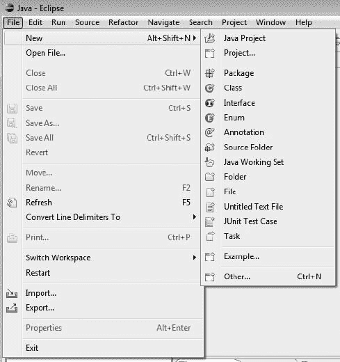
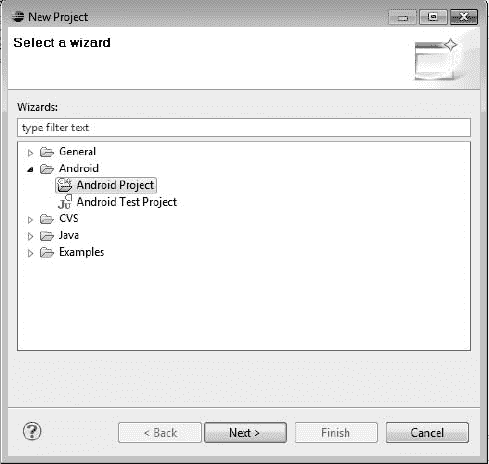
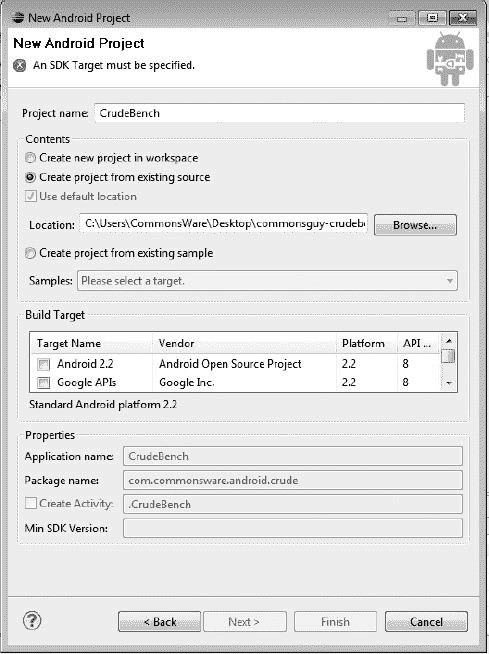
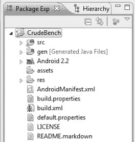
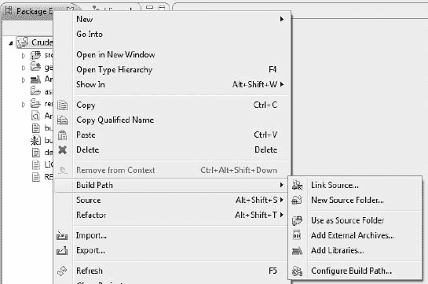
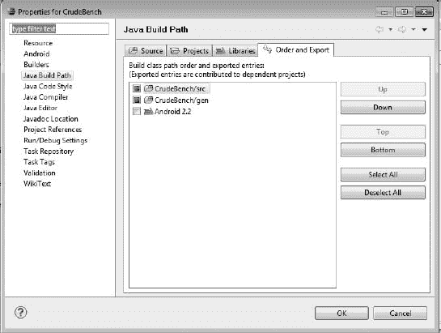
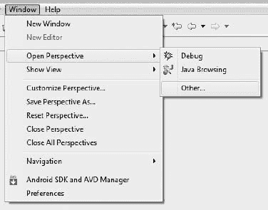
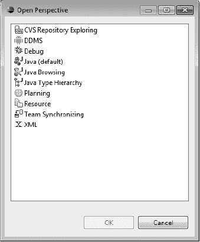
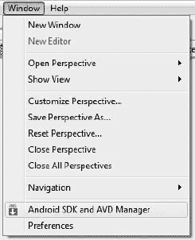
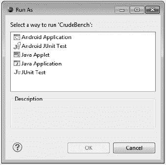

# 五、关于 Eclipse 的一点信息

Eclipse 是一个非常流行的集成开发环境(IDE)，尤其是对于 Java 开发。它还被设计成可通过附加系统扩展。最重要的是，Eclipse 是开源的，这要感谢 IBM 多年前决定向全世界发布 Eclipse 的恩惠。这种组合使它成为核心 Android 开发团队的 IDE 的理想选择。

具体来说，为了配合 Android SDK，Google 已经为 Eclipse 环境发布了一些插件。其中最主要的是 Android Developer Tools (ADT)插件，它为 Eclipse it 提供了 Android 的核心意识。

### ADT 给了你什么

本质上，ADT 插件接受常规的 Eclipse 操作，并将其扩展到 Android 项目。例如，使用 Eclipse，您可以获得以下特性(以及其他特性):

*   用于创建常规 Android 项目、Android 测试项目等的新项目向导
*   能够像运行常规 Java 应用一样运行 Android 项目——通过工具栏中的绿色 run 按钮——尽管这实际上涉及将 Android 应用推送到仿真器或设备上，甚至可能在仿真器不运行时启动它
*   Android 类和方法的工具提示支持

此外，最新版本的 ADT 为您提供了对拖放式 GUI 编辑的初步支持。虽然这本书将重点介绍 Eclipse 生成的 XML 文件，但是 Eclipse 现在允许您通过在屏幕上拖动 GUI 组件来组装这些 XML 文件，并随时调整属性。拖放式 GUI 编辑是相当新的，所以当社区和 Google 发现当前实现的问题和限制时，可能会有一些粗糙的边缘。

### 应对月食

Eclipse 是一个强大的工具。像许多强大的工具一样，Eclipse 有时令人困惑。决定如何解决一些特定的开发问题可能是一个挑战，Android 本身的新奇性加剧了这一挑战。

这一节提供了一些技巧来处理在 Android 上使用 Eclipse 时的一些常见问题。

#### 如何导入非 Eclipse 项目

并非所有的 Android 项目都附带 Eclipse 项目文件，例如与本书相关的示例项目。但是，如果您愿意，可以很容易地将它们添加到您的 Eclipse 工作区中。下面是怎么做的！

首先，从 Eclipse 主菜单中选择`**File**`   `**New**`   `**Project**`，如图图 5–1 所示。

**图 5–1。**Eclipse 中的*文件菜单*

然后从可用项目类型树中选择`**Android**`   `**Android Project**`，如图图 5–2 所示，点击下一步。

**图 5–2。***Eclipse 中的新建项目向导*

**注意:**如果你没有看到这个选项，说明你没有安装 Android 开发者工具。

然后，在 New Android Project 向导的第一页上，选择“Create Project from existing source”单选按钮，单击 Browse 按钮，打开包含项目的`AndroidManifest.xml`文件的目录。这将填充向导页面的大部分剩余部分，尽管您可能还需要从表中指定一个构建目标，如 Figure 5–3 所示。

**图 5–3。***Eclipse 中新的 Android 项目向导*

然后，单击完成。这将使您返回到 Eclipse，导入的项目在您的工作区中，如 Figure 5–4 所示。

**图 5–4。***Eclipse 中的 Android 项目树*

接下来，右键单击项目名称，从上下文菜单中选择`**Build Path**`   `**Configure Build Path**`，如图图 5–5 所示。

**图 5–5。***Eclipse 中的项目上下文菜单*

这将打开项目属性窗口的 Java 构建路径部分，如 Figure 5–6 所示。

**图 5–6。**Eclipse 中的*项目属性窗口*

如果没有选中 Android JAR(图 5–6 中的 Android 2.2 条目)，请选中它，然后单击确定关闭属性窗口。此时，您的项目应该可以使用了。

#### 如何去 DDMS

很多时候，您会被告知查看 DDMS 中的一些东西，比如 LogCat 选项卡来检查 Java 堆栈跟踪。在《月蚀》中，DDMS 是一个视角。要在您的工作区中打开这个透视图，从主菜单中选择`**Window**`   `**Open Perspective**`   `**Other**`，如图图 5–7 所示。

**图 5–7。** *月食中的透视菜单*

然后，在如图 Figure 5–8 所示的透视图列表中，选择 DDMS。

**图 5–8。** *月食中的视角花名册*

这将把 DDMS 透视图添加到您的工作区，并在您的 Eclipse IDE 中打开它。

DDMS 将在本书后面的章节中详细介绍。

#### 如何创建仿真器

默认情况下，您的 Eclipse 环境没有设置 Android 模拟器。在成功运行项目之前，您需要一个。

为此，首先从主菜单中选择`**Window**`   `**Android SDK and AVD Manager**`，如图图 5–9 所示。

**图 5–9。***Eclipse 中的 Android SDK 和 AVD 管理器菜单选项*

这将打开与从命令行运行`android`相同的窗口。

现在，您可以按照第二章的“步骤 5:设置仿真器”一节中的说明来定义一个 Android 虚拟设备(AVD)

#### 如何运作一个项目

假设您已经定义了 AVD，或者您已经设置了用于调试的设备并连接到您的开发计算机，您可以在模拟器中运行您的项目。

首先，单击运行工具栏按钮，或者从主菜单中选择`**Project**`   `**Run**`。这将在您第一次运行项目时弹出运行方式对话框，如图图 5–10 所示。

**图 5–10。***Eclipse 中的运行方式对话框*

选择 Android 应用，然后单击确定。如果您有多个可用的 AVD 或设备，将会出现一个窗口，您可以在其中选择所需的目标环境。然后，模拟器将启动运行您的应用。请注意，如果模拟器(或设备)上的锁定屏幕被锁定，您需要将其解锁。

#### 如何不运行你的项目

当您运行项目时，请确保 XML 文件不是编辑器中的活动选项卡。试图“运行”这将导致在 XML 文件所在的任何目录中创建一个`.out`文件(例如，`res/layout/main.xml.out`)。要恢复，只需删除有问题的`.out`文件，并尝试再次运行，这一次用一个 Java 文件作为活动标签。

### 替代 IDEs

如果你真的喜欢 Eclipse 和 ADT，你可能会考虑 MOTODEV Studio for Android。这是 Eclipse 的另一组插件，增强了 ADT，并提供了许多其他与 Android 相关的开发特性，包括以下(以及许多其他特性):

*   更多帮助你创建 Android 类的向导
*   集成的 SQLite 浏览，因此您可以直接从 IDE 中操作模拟器中的 SQLite 数据库
*   更多的验证器来检查常见的错误，以及一个代码片段库来减少一开始的错误
*   协助将您的申请翻译成多种语言

虽然 MOTODEV Studio for Android 是由摩托罗拉发布的，但你可以用它来为所有 Android 设备构建应用，而不仅仅是摩托罗拉自己制造的设备。随着谷歌即将收购摩托罗拉，MOTODEV 的未来肯定会很有趣。

其他 ide 也在慢慢地获得 ADT 的等价物，尽管谷歌只提供了很少的帮助。比如 IntelliJ 的 IDEA 有一个针对 Android 的模块。它最初是商业性的，但现在从版本 10 开始，它是 IDEA 开源社区版的一部分。

当然，您根本不需要使用 IDE。虽然对一些人来说这听起来可能是亵渎，但是 ide 并不是构建应用的唯一方式。通过 ADT 完成的大部分工作都可以通过等效的命令行来完成，这意味着您真正需要的只是一个 shell 和一个编辑器。例如，本书的作者目前不使用 IDE，也不打算很快采用 Eclipse。

### IDEs 和这本书

欢迎您在阅读本书时使用 Eclipse。如果您愿意，欢迎使用另一个 IDE。您甚至可以直接跳过 IDE，直接使用编辑器。

这本书的重点是展示 Android 的能力和利用这些能力的 API。它的目的不是教授任何一个 IDE 的使用。因此，所示的示例代码应该可以在任何 IDE 中工作，特别是如果您按照本章中的说明将非 Eclipse 项目导入 Eclipse 的话。