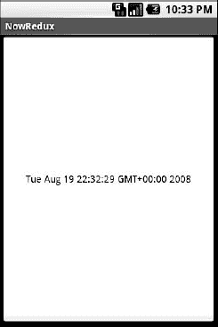

# 七、重写你的第一个项目

您在第三章中创建的项目仅由 Android 构建工具生成的默认文件组成——您自己没有编写任何 Java 代码。在本章中，您将修改该项目，使其更具交互性。在这个过程中，您将研究组成 Android 活动的基本 Java 代码。

**注意:**本章中的说明假设您在包和文件的名称方面遵循了第三章中的原始说明。如果您使用了不同的名称，您将需要在以下步骤中调整名称以匹配您的名称。

### 活动

您的项目的`src`目录包含基于您创建项目时使用的 Java 包的标准 Java 风格的目录树(例如，`com.commonsware.android`导致`src/com/commonsware/android/`)。在最里面的目录中，您应该会找到一个名为`Now.java`的预生成源文件，这是您的第一个活动所在的位置。

在您的编辑器中打开`Now.java`并粘贴以下代码(或者，如果您从 Apress 网站下载了源文件，您可以直接使用`Skeleton/Now`项目):

`packagecom.commonsware.android.skeleton;

importandroid.app.Activity;
importandroid.os.Bundle;
importandroid.view.View;
importandroid.widget.Button;
importjava.util.Date;` `public class Now extends Activity implements View.OnClickListener {
  Button btn;

  @Override
  public void **onCreate**(Bundle icicle) {
    super.**onCreate**(icicle);
    btn=new **Button**(this);
    btn.**setOnClickListener**(this);
    **updateTime**();
    **setContentView**(btn);
  }

  public void **onClick**(View view) {
    **updateTime**();
  }

  private void **updateTime**() {
    btn.**setText**(new Date().toString());
  }
}`

### 解剖活动

让我们一段一段地检查这段 Java 代码，从包声明和导入的类开始:

`packagecom.commonsware.android.skeleton;

importandroid.app.Activity;
importandroid.os.Bundle;
importandroid.view.View;
importandroid.widget.Button;
importjava.util.Date;`

包声明需要与创建项目时使用的声明相同。然后，与任何其他 Java 项目一样，您需要导入您引用的任何类。大多数 Android 特有的类都在`android`包中。

**注意:**并不是每个 Java SE 类都可供 Android 程序使用。请访问 Android 类参考，了解哪些是可用的，哪些是不可用的。

活动是公共类，继承自`android.app.Activity`基类。在这种情况下，活动持有一个按钮(`btn`):

`public class Now extends Activity implements View.OnClickListener {
  Button btn;`

为了简单起见，我们希望将所有的按钮点击都捕获在活动本身中，因此我们也使用了 activity 类 implement `OnClickListener`。

当活动开始时，调用`onCreate()`方法。您应该做的第一件事是向上链接到超类，这样就可以完成股票 Android 活动初始化:

`@Override
public void **onCreate**(Bundle icicle) {
  super.**onCreate**(icicle);

  btn=new **Button**(this);
  btn.**setOnClickListener**(this);
  **updateTime**();
  **setContentView**(btn);
}`

在我们的实现中，然后我们创建按钮实例`btn`(通过`new Button(this)`)，告诉它将所有的按钮点击发送给活动实例本身(通过`setOnClickListener()`)，调用私有的`updateTime()`方法，然后将活动的内容视图设置为按钮本身(通过`setContentView()`)。我们将在后面的章节中看看那个神奇的`Bundle icicle`。目前，将它视为一个不透明的句柄，所有活动在创建时都会收到它。

`public void **onClick**(View view) {
  **updateTime**();
}`

在 Java 传统的 Swing UI 世界中，单击`JButton`会引发一个`ActionEvent`，该 ?? 被传递给为按钮配置的`ActionListener`。在 Android 中，点击一个按钮会导致为按钮配置的`OnClickListener`实例中的`onClick()`被调用。侦听器将触发单击的视图(在本例中是按钮)传递给它。我们在这里所做的就是调用私有的`updateTime()`方法:

`private void **updateTime**() {
  btn.**setText**(new **Date**().**toString**());
}`

当我们打开活动(`onCreate()`)或点击按钮(`onClick()`)时，我们通过`setText()`将按钮的标签更新为当前时间，其功能与`JButton`相当。

### 构建和运行活动

要构建活动，使用 IDE 内置的 Android 打包工具，或者在项目的基础目录中运行`ant clean install`(如第三章中所述)。然后，运行活动。如果您正在使用 Eclipse，它应该会自动为您启动；否则，在主屏幕启动器中查找活动。您应该会看到类似于图 7–1 中所示的活动。

**图 7–1。** *现在示威活动*

点击按钮——换句话说，点击设备屏幕上的任何地方——都会更新按钮标签上显示的时间。

请注意，标签水平和垂直居中，因为这些是应用于按钮标题的默认样式。我们可以控制这种格式，这将在后面的章节中介绍。

在您完成了对高级按钮技术的惊叹之后，您可以单击模拟器上的 Back 按钮返回到启动器。