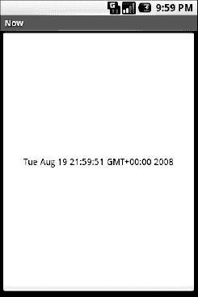

# 八、使用基于 XML 的布局

虽然从技术上讲，完全通过 Java 代码创建小部件并将其附加到您的活动是可能的，就像我们在上一章中所做的那样，但是更常见的方法是使用基于 XML 的布局文件。小部件的动态实例化是为更复杂的场景保留的，在这些场景中，小部件在编译时是未知的(例如，基于从互联网检索的数据来填充一列单选按钮)。

考虑到这一点，是时候分解 XML 并学习如何以这种方式展示 Android 活动视图了。

### 什么是基于 XML 的布局？

顾名思义，基于 XML 的布局是以 XML 格式编码的小部件之间以及与容器之间关系的规范。具体来说，Android 将基于 XML 的布局视为资源，因此，布局文件存储在 Android 项目内的`reslayout`目录中。

每个 XML 文件包含一个元素树，指定组成一个`View`的小部件和容器的布局。XML 元素的属性是描述小部件外观或容器行为的属性。例如，如果一个`Button`元素有一个属性值`android:textStyle = "bold"`，这意味着出现在按钮表面的文本应该以粗体显示。

Android 的 SDK 附带了一个使用这些布局的工具(`aapt`)。这个工具应该被你的 Android 工具链自动调用(比如 Eclipse 或者 Ant 的`build.xml`)。作为一名开发人员，对你来说特别重要的是，`aapt`在你的项目的`gen`目录中生成`R.java`源文件，允许你直接从你的 Java 代码中访问布局和布局中的小部件，这将在本章后面演示。

### 为什么要使用基于 XML 的布局？

使用 XML 布局文件做的几乎所有事情都可以通过 Java 代码实现。例如，您可以使用`setTypeface()`让按钮以粗体显示文本，而不是使用 XML 布局中的属性。由于 XML 布局是您需要跟踪的另一个文件，我们需要使用这种文件的充分理由。

也许最大的原因是帮助创建视图定义的工具，比如 Eclipse 这样的 IDE 中的 GUI 生成器或 DroidDraw 这样的专用 Android GUI 设计器。原则上，这样的 GUI 生成器可以生成 Java 代码，而不是 XML。挑战是在设计工具中重新读取定义以支持编辑，当数据是像 XML 这样的结构化格式而不是编程语言时，这要简单得多。此外，将生成的位与手写代码分开，使得当生成的位重新生成时，某人定制的源代码不太可能被意外破坏。XML 在工具编写者易于使用的东西和程序员易于根据需要手工操作的东西之间形成了一个很好的中间地带。

此外，XML 作为 GUI 定义格式变得越来越普遍。微软的可扩展应用标记语言(XAML)、Adobe 的 Flex、谷歌的谷歌网络工具包(GWT)和 Mozilla 的 XML 用户界面语言(XUL)都采用了与 Android 类似的方法:将布局细节放在 XML 文件中，将编程智能放在源文件中(例如 XUL 的 JavaScript)。许多不太知名的 GUI 框架，比如 ZK，也使用 XML 进行视图定义。虽然“随大流”不一定是最好的策略，但它确实有助于简化从任何其他以 XML 为中心的视图描述语言到 Android 的过渡。

### 好的，那它看起来像什么？

下面是来自上一章示例应用的`Button`，它被转换成一个 XML 布局文件，位于`Layouts/NowRedux`示例项目中:

`<?xml version="1.0" encoding="utf-8"?>
<Button xmlns:android="http://schemas.android.com/apk/res/android"
    android:id="@+id/button"
    android:text=""
    android:layout_width="fill_parent"
    android:layout_height="fill_parent"/>`

小部件的类名`Button`，构成了 XML 元素的名称。由于`Button`是 Android 提供的小部件，我们可以只使用裸类名。如果你创建自己的小部件作为`android.view.View`的子类，你也需要提供一个完整的包声明(例如`com.commonsware.android.MyWidget`)。

根元素需要声明 Android XML 名称空间:

`xmlns:android="http://schemas.android.com/apk/res/android"`

所有其他元素都将是根的子元素，并将继承该名称空间声明。

因为我们想从 Java 代码中引用这个按钮，所以我们需要通过`android:id`属性给它一个标识符。我们将在下一节更详细地介绍这个概念。

其余的属性是这个`Button`实例的属性:

*   `android:text`:表示显示在按钮表面的初始文本(本例中为空字符串)
*   `android:layout_width`和`android:layout_height`:告诉 Android 让按钮的宽度和高度填充父按钮，在本例中是整个屏幕

这些属性将在第十章中详细介绍。

由于这个小部件是活动视图中唯一的内容，所以我们只需要这个元素。复杂的视图需要一个完整的元素树，代表控制其位置的小部件和容器。本书的其余章节将尽可能使用 XML 布局形式，因此还有许多其他更复杂布局的例子供您阅读。

### @符号是怎么回事？

许多小部件和容器只需要出现在 XML 布局文件中，不需要在 Java 代码中引用。例如，静态标签(`TextView`)经常需要出现在布局文件中，只是为了指示它应该出现的位置。XML 文件中这些种类的元素不需要用`android:id`属性来命名。

然而，你*做*想在你的 Java 源代码中使用的任何事情都需要一个`android:id`。

约定是使用`@+id/...`作为`id`值，其中`...`代表您的小部件在本地的唯一名称，表示给定的`id`值在布局文件中的第一次出现。在上一节的 XML 布局示例中，`@+id/button`是`Button`小部件的标识符。在同一个布局文件中第二次和随后的出现应该去掉`+`符号——我们将在第十章中使用这个特性。

Android 提供了一些特殊的`android:id`值，形式为`@android:id/...`。你会在本书的各种例子中看到这些价值观。

### 我们如何将这些附加到 Java 上呢？

假设您已经在存储于`res/layout`中的名为`main.xml`的 XML 布局文件中为您的视图精心设置了小部件和容器，那么您所需要的只是活动的`onCreate()`回调中的一条语句来使用该布局:

`**setContentView**(R.layout.main);`

这与我们之前使用的`setContentView()`相同，传递给它一个`View`子类的实例(在这种情况下，是一个`Button`)。从我们的布局构建的 Android 构建的`View`，可以从代码生成的`R`类访问。所有布局都可以在`R.layout`下访问，由布局文件的基本名称键入；例如，`res/layout/main.xml`导致`R.layout.main`。

要访问您标识的小部件，使用`findViewById()`，向其传递有问题的小部件的数字标识符。这个数字标识符由 Android 在`R`类中生成为`R.id.something`(其中`something`是您正在寻找的特定小部件)。那些小部件只是`View`的子类，就像我们在前一章中创建的`Button`实例一样。

### 故事的其余部分

在最初的`Now`演示中，按钮的表面将显示当前时间，这将反映按钮最后一次被按下的时间(或者活动第一次显示的时间，如果按钮还没有被按下的话)。即使在这个修改后的演示中，大多数逻辑仍然有效。然而，我们可以引用 XML 布局中的回调函数，而不是在活动的`onCreate()`回调函数中实例化`Button`:

`packagecom.commonsware.android.layouts;

importandroid.app.Activity;
importandroid.os.Bundle;
importandroid.view.View;
importandroid.widget.Button;
importjava.util.Date;

public class NowRedux extends Activity
  implementsView.OnClickListener {
  Button btn;

  @Override
  public void **onCreate**(Bundle icicle) {
    super.**onCreate**(icicle);

    **setContentView**(R.layout.main);

    btn=(Button)**findViewById**(R.id.button);
    btn.**setOnClickListener**(this);
    **updateTime**();
  }

  public void **onClick**(View view) {
    **updateTime**();
  }

  private void **updateTime**() {
    btn.**setText**(new **Date**().**toString**());
  }
}`

第一个区别是，我们没有将内容视图设置为用 Java 代码创建的视图，而是将其设置为引用 XML 布局(`setContentView(R.layout.main)`)。当我们重新构建这个项目时，`R.java`源文件将被更新，以包含对我们布局文件的引用(在我们项目的`res/layout`目录中存储为`main.xml`)。

另一个区别是我们需要得到我们的`Button`实例，为此我们使用了`findViewById()`调用。因为我们将按钮标识为`@+id/button`，所以可以将按钮的标识符引用为`R.id.button`。现在，有了`Button`实例，我们可以根据需要设置回调和标签。

结果看起来与原始的`Now`演示相同，如图图 8–1 所示。

**图 8–1。***NowRedux 样本活动*