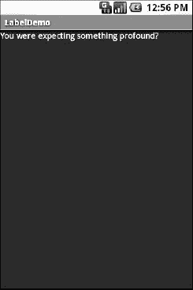
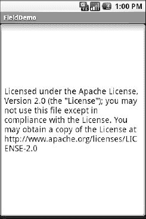
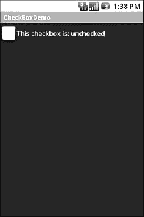
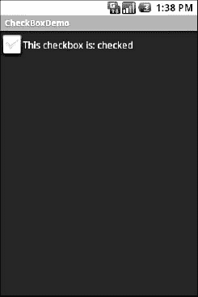
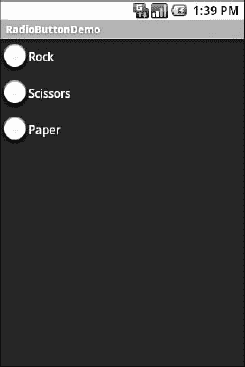

# 九、使用基本小部件

每个 GUI 工具包都有一些基本的小部件:字段、标签、按钮等等。Android 的工具包在范围上没有什么不同，基本的小部件很好地介绍了小部件如何在 Android 活动中工作。

### 分配标签

最简单的小部件是标签，在 Android 中称为`TextView`。和大多数 GUI 工具包一样，标签是用户不能直接编辑的文本。通常，标签用于标识相邻的窗口小部件(例如，用户填写名称的字段旁边的“名称:”标签

在 Java 中，可以通过创建一个`TextView`实例来创建标签。不过，更常见的是，通过向布局添加一个`TextView`元素，用一个`android:text`属性来设置标签本身的值，从而在 XML 布局文件中创建标签。如果您需要基于某些标准交换标签，比如国际化，您可能希望使用 XML 中的字符串资源引用，这将在本书的后面进行描述。

`TextView`具有许多与标签相关的其他属性，例如

*   `android:typeface`:设置标签使用的字体(如`monospace`)
*   `android:textStyle`:表示字体应该加粗(`bold`)、斜体(`italic`)或加粗加斜体(`bold_italic`)
*   `android:textSize`:指定字体大小，采用以下几种度量之一:`sp`(缩放像素)、`dip`(与密度无关的像素)、`px`(原始像素)、`in`(英寸)、`mm`(毫米)。推荐的做法是使用`sp`，并且这是追加到大小的，比如`12sp`。
*   `android:textColor`:以 RGB 十六进制格式设置标签文本的颜色(如`#FF0000`表示红色)

例如，在`Basic/Label`项目中，您会发现以下布局文件:

`<?xml version="1.0" encoding="utf-8"?>
<TextView xmlns:android="http://schemas.android.com/apk/res/android"
  android:layout_width="fill_parent"
  android:layout_height="wrap_content"
  android:text="You were expecting something profound?"
  />`

仅仅是这个布局，加上 Android 的项目构建器(例如，`android create project`)提供的存根 Java 源代码，就可以得到如图图 9–1 所示的结果。

**图 9–1。***label demo 示例应用*

在我们负责`LabelDemo`的 XML 中，您会注意到我们使用了两个宽度和高度指令。第一个，`fill_parent`，表示我们希望我们的 UI 元素完全填充它的父空间，减去任何填充或边框。第二个，`wrap_content`，确保在父节点中只使用足够的空间来显示我们的内容，而不是更多。随着我们在接下来的章节中逐步学习更多的例子，这些将会变得更加清晰。

### 按钮，按钮，谁拿了按钮？

在前两章中，您已经看到了`Button`小部件的使用。事实证明，`Button`是`TextView`的子类，所以上一节讨论的所有内容也适用于格式化按钮的表面。

Android 为你提供了两种方法来处理点击收听者的问题。第一种选择是定义一些对象(比如活动)作为实现`View.OnClickListener`接口的“经典”方式。比经典的方法更好的是当代机器人简化事物的方式。这个简单的选项有两个步骤:

1.  在你的`Activity`上定义一些方法来保存这个按钮，它接受一个`View`参数，有一个`void`返回值，并且是`public`。
2.  在您的布局 XML 中，在`Button`元素上，包含带有您在上一步中定义的方法名称的`android:onClick`属性。

例如，我们可能在我们的`Activity`上有一个如下所示的方法:

`public void **someMethod**(View theButton) {
 // do something useful here
}`

然后，我们可以将这个 XML 声明用于`Button`本身，包括`android:onClick`:

`<Button
 android:onClick="someMethod"
 ...
/>`

这足以让 Android 将`Button`与点击处理程序连接在一起。起初你可能不会觉得这比传统方法简单。但是，考虑一下这种方法通过 XML 规范中不同的选项(例如，在不同的语言环境、屏幕大小等条件下)打开选项来改变给定的`Button`的`Activity`是多么容易。我们将在接下来的章节中详细讨论这些选项。

### 转瞬即逝的影像

Android 有两个小部件可以帮助你在活动中嵌入图片:`ImageView`和`ImageButton`。顾名思义，它们分别类似于`TextView`和`Button`。

每个小部件都有一个`android:src`属性(在 XML 布局中)来指定使用哪张图片。这些属性通常引用一个可提取的资源，在讨论资源的第二十三章中有更详细的描述。

`ImageView`的子类`ImageButton`，混合了标准的`Button`行为，用于响应点击等等。例如，看看来自`Basic/ImageView`示例项目的`main.xml`布局:

`<?xml version="1.0" encoding="utf-8"?>
<ImageView xmlns:android="http://schemas.android.com/apk/res/android"
    android:id="@+id/icon"
    android:layout_width="fill_parent"
    android:layout_height="fill_parent"
    android:adjustViewBounds="true"
    android:src="@drawable/molecule"
    />`

仅仅使用代码生成的活动，结果就是图像，如图 Figure 9–2 所示。

**图 9–2。***imageview demo 示例应用*

### 绿色或其他颜色的田野

除了按钮和标签，字段是大多数 GUI 工具包的第三个支柱。在 Android 中，它们是通过`EditText`小部件实现的，它是用于标签的`TextView`的子类。

除了标准的`TextView`属性(例如`android:textStyle` ), `EditText`还有许多其他属性在构建字段时会很有用，包括:

*   `android:autoText`:控制字段是否应提供自动拼写帮助
*   `android:capitalize`:控制字段是否应自动大写输入文本的首字母(例如，在姓名和城市字段中)
*   `android:digits`:将字段配置为只接受某些数字
*   `android:password`:将字段配置为在字段中键入字符时显示密码点，隐藏键入的字符
*   `android:singleLine`:控制该字段是用于单行输入还是多行输入(例如，按 Enter 键是移动到下一个小部件还是添加一个新行？)

大多数前述属性也可以从新的`android:inputType`属性中获得，该属性是在 Android 1.5 中添加的，作为向 Android 添加“软键盘”的一部分(在第十一章中讨论)。

例如，来自`Basic/Field`项目的一个 XML 布局文件显示了一个`EditText`小部件:

`<?xml version="1.0" encoding="utf-8"?>
<EditText xmlns:android="http://schemas.android.com/apk/res/android"
  android:id="@+id/field"
  android:layout_width="fill_parent"
  android:layout_height="fill_parent"
  android:singleLine="false"
  />`

请注意，`android:singleLine`被设置为`"false"`，因此用户将能够输入几行文本。

对于这个项目，`FieldDemo.java`文件用一些散文填充输入字段:

`package com.commonsware.android.field;

import android.app.Activity;
import android.os.Bundle;
import android.widget.EditText;

public class FieldDemo extends Activity {
  @Override
  public void **onCreate**(Bundle icicle) {
      super.**onCreate**(icicle);
      **setContentView**(R.layout.main);

      EditText fld=(EditText)**findViewById**(R.id.field);
      fld.**setText**("Licensed under the Apache License, Version 2.0 " +
              "(the \"License\"); you may not use this file " +
              "except in compliance with the License. You may " +
              "obtain a copy of the License at " +
              "http://www.apache.org/licenses/LICENSE-2.0");
  }
}`

一旦构建并安装到仿真器中，结果如图 9–3 所示。

field 的另一种风格是提供自动完成功能，帮助用户在不输入整个文本的情况下提供一个值。这在 Android 中作为`AutoCompleteTextView`小部件提供，在第十二章中有更详细的讨论。

**图 9–3。***field demo 示例应用*

### 只是另一个检查框

经典复选框有两种状态:选中和未选中。单击复选框可在这些状态之间切换，以指示选择(例如，“将紧急交付添加到我的订单”)。

在 Android 中，有一个`CheckBox` widget 可以满足这个需求。它有`TextView`作为祖先，所以您可以使用`TextView`属性如`android:textColor`来格式化小部件。

在 Java 中，您可以调用以下内容:

*   `isChecked()`:确定复选框是否已被选中
*   `setChecked()`:强制复选框处于选中或未选中状态
*   `toggle()`:切换复选框，就像用户选中它一样

此外，您可以注册一个监听器对象(在本例中是一个`OnCheckedChangeListener`的实例),以便在复选框的状态改变时得到通知。

例如，在`Basic/CheckBox`项目中，有一个简单的复选框布局:

`<?xml version="1.0" encoding="utf-8"?>
<CheckBox xmlns:android="http://schemas.android.com/apk/res/android"
    android:id="@+id/check"
    android:layout_width="wrap_content"
    android:layout_height="wrap_content"
    android:text="This checkbox is: unchecked" />`

对应的`CheckBoxDemo.java`检索并配置复选框的行为:

`public class CheckBoxDemo extends Activity
  implements CompoundButton.OnCheckedChangeListener {
  CheckBox cb;

  @Override
  public void **onCreate**(Bundle icicle) {
    super.**onCreate**(icicle);
    **setContentView**(R.layout.main);

    cb=(CheckBox)**findViewById**(R.id.check);
    cb.**setOnCheckedChangeListener**(this);
  }

  public void **onCheckedChanged**(CompoundButton buttonView,
                                 boolean isChecked) {
      if (isChecked) {
        cb.**setText**("This checkbox is: checked");
      }
      else {
        cb.**setText**("This checkbox is: unchecked");
    }
  }
}`

注意，活动充当复选框状态改变的监听器，因为它实现了`OnCheckedChangeListener`接口(通过`cb.setOnCheckedChangeListener(this)`)。监听器的回调是`onCheckedChanged()`，它接收状态已经改变的复选框和新的状态。在这种情况下，我们更新复选框的文本以反映实际框中包含的内容。

结果呢？点击复选框会立即更新其文本，如图图 9–4 和 9–5 所示。

**图 9–4。**??【复选框 Demo 示例应用，复选框未选中

**图 9–5。** *同样的申请，现在用复选框勾选了*

### 扳动开关，伊果

Android 4.0 的新功能(冰激凌三明治)是`CheckBox`的变体。这是一个双态开关`Switch`,使用户能够用手指滑动或拖动，就像他们在开关电灯一样。他们还可以像点击`CheckBox`一样点击`Switch`小部件来改变其状态。

`Switch`提供了一个`android:text`属性来显示与`Switch`状态相关的文本，通过`Switch`的`setTextOn()`和`setTextOff()`方法来控制。

其他对`Switch`有用的方法包括:

*   `getTextOn()`:返回`Switch`打开时使用的文本
*   `getTextOff()`:返回`Switch`关闭时使用的文本
*   `setChecked()`:将当前`Switch`状态变为开(如同`CheckBox`)

例如，在`Basic/Switch`项目中，这里有一个简单的`Switch`布局:

`<?xml version="1.0" encoding="utf-8"?>
<Switch xmlns:android="http://schemas.android.com/apk/res/android"
    android:id="@+id/switchdemo"
    android:layout_width="wrap_content"
    android:layout_height="wrap_content"
    android:text="This switch is: off" />`

注意，由于 Java 中的保留字约定，我们不能将小部件称为“switch”。相应的`SwitchActivity.java`检索并配置开关的行为我们再次配置我们的类来实现`OnCheckChangedListener`接口，它负责调用我们的`onCheckedChanged`方法:

`public class SwitchDemo extends Activity
  implements CompoundButton.OnCheckedChangeListener {
  Switch sw;

  @Override
  public void **onCreate**(Bundle icicle) {
    super.**onCreate**(icicle);
    **setContentView**(R.layout.main);

    sw=(Switch)**findViewById**(R.id.switchdemo);
    sw.**setOnCheckedChangeListener**(this);
  }

  public void **onCheckedChanged**(CompoundButton buttonView,
                                 boolean isChecked) {
    if (isChecked) {
      sw.**setTextOn**("This switch is: on");
    }
    else {
      sw.**setTextOff**("This switch is: off");
    }
  }` `}`

从总体结构、父方法的使用和行为可以看出，`Switch`的操作方式与`CheckBox`非常相似。我们的结果显示在图 9–6 和 9–7 中，开关处于每个可能的状态。

**图 9–6。** *开关关闭的 SwitchDemo 示例应用*

**图 9–7。** *同样的应用，现在换上了*

### 打开收音机

与其他工具包中单选按钮的其他实现一样，Android 的单选按钮是两种状态的，就像复选框和开关一样，但可以分组，以便在任何时候都只能选中组中的一个单选按钮。

和`CheckBox`一样，`RadioButton`继承了`CompoundButton`，后者又继承了`TextView`。因此，字体、风格、颜色等所有标准的`TextView`属性都可以用来控制单选按钮的外观。类似地，您可以在`RadioButton`上调用`isChecked()`来查看它是否被选中，调用`toggle()`来选择它，以此类推，就像您可以使用`CheckBox`一样。

大多数时候，你会想把你的`RadioButton`部件放在一个`RadioGroup`里面。`RadioGroup`表示一组状态为绑定的单选按钮，意味着在任何时候只能选择该组中的一个按钮。如果您在 XML 布局中为您的`RadioGroup`分配了一个`android:id`，那么您可以从您的 Java 代码中访问该组并调用以下代码:

*   `check()`:通过 ID 检查特定的单选按钮(如`group.check(R.id.radio1)`)
*   `clearCheck()`:清除所有单选按钮，因此组中没有被选中
*   `getCheckedRadioButtonId()`:获取当前选中的单选按钮的 ID(如果没有选中，则为`-1`)

注意，`RadioGroup`的互斥特性只适用于`RadioGroup`的直接子控件`RadioButton`。在`RadioGroup`和它的`RadioButton`小部件之间不能有其他容器——将在下一章讨论。

例如，来自`Basic/RadioButton`示例应用的 XML 布局显示了一个`RadioGroup`包装了一组`RadioButton`小部件:

`<?xml version="1.0" encoding="utf-8"?>
<RadioGroup
  xmlns:android="http://schemas.android.com/apk/res/android"
  android:orientation="vertical"
  android:layout_width="fill_parent"
  android:layout_height="fill_parent"
  >
    <RadioButton android:id="@+id/radio1"
      android:layout_width="wrap_content"
      android:layout_height="wrap_content"
      android:text="Rock" />

    <RadioButton android:id="@+id/radio2"
      android:layout_width="wrap_content"
      android:layout_height="wrap_content"
      android:text="Scissors" />

    <RadioButton android:id="@+id/radio3"
      android:layout_width="wrap_content"
      android:layout_height="wrap_content"
      android:text="Paper" />
</RadioGroup>`

使用 Android 为项目生成的 Java 和这个布局，您会得到如图 Figure 9–8 所示的结果。

请注意，单选按钮组最初被设置为完全未选中。要预设要检查的单选按钮之一，请在活动的`onCreate()`回调中使用`RadioButton`上的`setChecked()`或`RadioGroup`上的`check()`。

**图 9–8。**??【单选按钮演示】示例应用

### 景色真美

所有的部件，包括前面几节中显示的部件，都扩展了`View`，这为所有的部件提供了一系列已经描述过的有用的属性和方法。

#### 填充

微件有一个最小尺寸，这可能会受到其内部内容的影响。因此，举例来说，`Button`将扩展以适应其标题的大小。您可以使用填充来控制这个大小。添加填充将增加内容(例如，`Button`的标题)和小部件边缘之间的空间。

可以在 XML 中为所有四个边(`android:padding`)或在每个边的基础上(`android:paddingLeft`等)设置一次填充。).填充也可以通过`setPadding()`方法在 Java 中设置。

其中任何一个的值都是一个维度，是度量单位和计数的组合。所以，`5px`是 5 个像素，`10dip`是 10 个与密度无关的像素，`2mm`是 2 毫米。我们将在第二十五章的中更详细地检查维度。

#### 其他有用的属性

除了本章和下一章中介绍的属性外，`View`最有可能使用的其他属性包括:

*   `android:visibility`:控制小工具最初是否可见
*   `android:nextFocusDown`、`android:nextFocusLeft`、`android:nextFocusRight`和`android:nextFocusUp`:如果用户使用 D-pad、轨迹球或类似的定点设备，则控制聚焦顺序
*   `android:contentDescription`:大致相当于 HTML ``标签上的`alt`属性，辅助工具使用它来帮助看不到屏幕的人导航应用

#### 有用的方法

您可以通过`setEnabled()`切换微件是否启用，并通过`isEnabled()`查看微件是否启用。一种常见的使用模式是基于`CheckBox`或`RadioButton`选择禁用一些小部件。

你可以通过`requestFocus()`给一个小部件焦点，然后通过`isFocused()`查看它是否被聚焦。您可以将它与禁用小部件配合使用，以确保在禁用操作完成后，正确的小部件获得焦点。

为了帮助导航构成活动总体视图的小部件和容器树，您可以使用:

*   `getParent()`:查找父部件或容器
*   `findViewById()`:查找具有特定 ID 的子部件
*   `getRootView()`:获取树的根(例如，您通过`setContentView()`提供给活动的内容)

#### 颜色

Android 小部件中有两种颜色属性。有些，像`android:background`，采用单一颜色(或图形图像作为背景)。其他的，像`TextView`上的`android:textColor`(以及子类)，可以带一个`ColorStateList`，包括通过 Java setter(在这里是`setTextColor()`)。

一个`ColorStateList`允许你为不同的条件指定不同的颜色。例如，`TextView`在列表中被选中时可以有一种文本颜色，在未被选中时可以有另一种颜色(第十二章介绍了选择部件)。这通过与`TextView`相关联的默认`ColorStateList`来处理。

如果您希望在 Java 代码中更改`TextView`小部件的颜色，您有两个主要选择:

*   使用`ColorStateList.valueOf()`，它返回一个`ColorStateList`，其中所有状态都被认为具有相同的颜色，您将它作为参数提供给`valueOf()`方法。这是 Java 中相当于`android:textColor`的方法，使`TextView`总是一种特定的颜色，不管情况如何。
*   通过构造函数或者通过一个 XML drawable 资源，为不同的状态创建一个具有不同值的`ColorStateList`，这个概念在第二十三章中讨论过。