# 十、使用容器

容器将一组小部件(可能还有子容器)放入您选择的特定结构中。如果你想要一个左边有标签，右边有字段的表单，你需要一个容器。如果您希望 OK 和 Cancel 按钮位于表单的下面，彼此相邻，并与屏幕右侧对齐，您需要一个容器。仅从纯 XML 的角度来看，如果您有多个小部件(在一个`RadioGroup`中有超过`RadioButton`个小部件)，您需要一个容器来放置小部件。

大多数 GUI 工具包都有一些布局管理的概念，经常被组织到容器中。例如，在 Java/Swing 中，有像`BoxLayout`这样的布局管理器和使用它们的容器(例如`Box`)。一些工具包，如 XUL 和 Flex，严格遵循盒子模型，认为任何想要的布局都可以通过嵌套盒子的正确组合来实现。通过`LinearLayout`，Android 也提供了一个盒子模型，但是除此之外还支持一系列提供不同布局规则的容器。

在这一章中，我们将看看四个常用的容器，`LinearLayout`(盒子模型)、`RelativeLayout`(基于规则的模型)、和`TableLayout`(网格模型)，以及与冰淇淋三明治(ICS)一起发布的全新的`GridLayout`(无限细线模型)。我们还将看看`ScrollView`，一个用来帮助实现滚动容器的容器。

### 线性思维

如前所述，`LinearLayout`是一个盒子模型——小部件或子容器排成一列或一行，一个接一个。这类似于 Java/Swing 中的`FlowLayout`，Flex 和 XUL 中的`vbox`和`hbox`，等等。

Flex 和 XUL 使用方框作为布局的主要单位。如果你愿意，你可以用同样的方式使用`LinearLayout`，避开其他一些容器。获得您想要的可视化表示主要是确定框应该嵌套在哪里以及这些框应该具有哪些属性，例如它们相对于其他框的对齐方式。

#### LinearLayout 概念和属性

要配置一个`LinearLayout`，除了容器的内容之外，您还有五个主要的控制区域:方向、填充模型、重量、重力和填充。

##### 方向

方向表示`LinearLayout`代表一行还是一列。只需将`android:orientation`属性添加到 XML 布局中的`LinearLayout`元素，并将值设置为行的`horizontal`或列的`vertical`。

通过调用`LinearLayout`上的`setOrientation()`，提供`HORIZONTAL`或`VERTICAL`，可以在运行时修改方向。

##### 填充模型

想象一排小部件，比如一对单选按钮。这些小部件根据它们的文本有一个“自然”的大小。它们的总尺寸可能与 Android 设备的屏幕宽度不完全匹配——特别是因为屏幕有各种尺寸。然后，我们面临如何处理剩余空间的问题。

一个`LinearLayout`中的所有小部件必须提供`android:layout_width`和`android:layout_height`属性来帮助解决这个问题。这些属性值有三种风格:

*   您可以提供一个特定的维度，比如`125dip`，来指示小部件应该占据特定的大小。
*   您可以提供`wrap_content`，这意味着小部件应该填满它的自然空间，除非它太大，在这种情况下，Android 可以根据需要使用自动换行来使它适合。
*   您可以提供`fill_parent`，这意味着在处理完所有其他小部件之后，小部件应该填满其封闭容器中的所有可用空间。

后两种风格是最常见的，因为它们与屏幕大小无关，允许 Android 调整您的视图以适应可用空间。

**注:**在 API level 8 (Android 2.2)中，`fill_parent`更名为`match_parent`，原因不明。您仍然可以使用`fill_parent`，因为在可预见的未来它将得到支持。然而，在你只支持 API 等级 8 或更高的时候(例如，在你的清单中的`android:minSdkVersion="8"`，你可能应该切换到`match_parent`。

##### 体重

但是，如果我们有两个应该分割可用空间的小部件，会发生什么呢？例如，假设我们在一个列中有两个多行字段，我们希望在所有其他小部件都被分配了空间之后，它们占用列中的剩余空间。

要实现这一点，除了将`android:layout_width`(对于行)或`android:layout_height`(对于列)设置为`fill_parent`，还必须设置`android:layout_weight`。此属性指示应该归该小部件所有的可用空间的比例。例如，如果您为一对窗口小部件(如`1`)设置`android:layout_weight`为相同的非零值，自由空间将在它们之间平均分配。如果您为一个小部件设置为`1`,为另一个小部件设置为`2`,第二个小部件将使用第一个小部件两倍的可用空间。等等。默认情况下，小部件的权重是`0`。

使用权重的另一种模式是基于百分比分配大小。例如，要将此技术用于水平布局，请执行以下操作:

*   对于布局中的小部件，将所有的`android:layout_width`值设置为`0`。
*   将`android:layout_weight`值设置为布局中每个小部件所需的百分比大小。
*   确保所有重量加起来等于`100`。

##### 重力

默认情况下，`LinearLayout`中的所有内容都是左对齐和上对齐的。因此，如果你通过一个水平的`LinearLayout`创建一行小部件，这一行将从屏幕左侧开始齐平。如果这不是你想要的，你需要指定一个重力值。在小部件上使用`android:layout_gravity`(或者在运行时在小部件的 Java 对象上调用`setGravity()`，你可以告诉小部件及其容器如何将*与*屏幕对齐。

对于一列小部件，常见的重力值分别是左对齐、居中和右对齐小部件的`left`、`center_horizontal`和`right`。

对于一行小部件，默认情况下它们是对齐的，因此它们的文本在基线上对齐(字母似乎“坐在”这条看不见的线上)。您可以指定一个重力值`center_vertical`,使小部件沿着行的垂直中点居中。

##### 利润

默认情况下，小部件紧密地排列在一起。你可以通过使用边距来改变这一点，这是一个类似于填充的概念，在第九章中有描述。

空白和边距之间的区别只有在背景不透明的小部件上才明显。对于具有透明背景的小部件——像`TextView`的默认外观——填充和边距具有相似的视觉效果，增加了小部件和相邻小部件之间的空间。对于具有不透明背景的小部件，如`Button`，填充被认为是在背景内，而边距被认为是在背景外。换句话说，添加填充会增加内容(例如，`Button`的标题)和边缘之间的空间，而添加边距会增加边缘和相邻小部件之间的空白空间。

可以在 XML 中设置边距，可以基于每条边(如`android:layout_marginTop`)设置，也可以通过`android:layout_margin`设置所有边的边距。和填充一样，任何一个值都是一个维度——一个度量单位和一个计数的组合，例如 5 像素的`5px`。

#### 线性布局示例

让我们看一个例子(`Containers/Linear`)，它显示了在 XML 布局文件中和运行时设置的`LinearLayout`属性。布局如下:

`<?xml version="1.0" encoding="utf-8"?>
<LinearLayout
  xmlns:android="http://schemas.android.com/apk/res/android"
  android:orientation="vertical"
  android:layout_width="fill_parent"
  android:layout_height="fill_parent"
  >
  <RadioGroup android:id="@+id/orientation"
    android:orientation="horizontal"
    android:layout_width="wrap_content"
    android:layout_height="wrap_content"
    android:padding="5dip">
    <RadioButton
      android:id="@+id/horizontal"
      android:text="horizontal" />
    <RadioButton
      android:id="@+id/vertical"
      android:text="vertical" />
  </RadioGroup>
  <RadioGroup android:id="@+id/gravity"
    android:orientation="vertical"
    android:layout_width="fill_parent"
    android:layout_height="wrap_content"
    android:padding="5dip">
    <RadioButton
      android:id="@+id/left"
      android:text="left" />
    <RadioButton
      android:id="@+id/center"
      android:text="center" />
    <RadioButton
      android:id="@+id/right"
      android:text="right" />
  </RadioGroup>
</LinearLayout>`

注意，我们有一个`LinearLayout`包装两个`RadioGroup`集。`RadioGroup`是`LinearLayout`的子类，所以我们的例子展示了嵌套的盒子，就好像它们都是`LinearLayout`容器一样。

顶部的`RadioGroup`设置了一排`RadioButton`小部件(`android:orientation = "horizontal"`)。`RadioGroup`的四周都有填充的`5dip`，将它与另一个`RadioGroup`分开，其中`dip`代表与密度无关的像素(现在把它们想象成普通像素——我们将在本书的后面讨论这种区别)。宽度和高度都设置为`wrap_content`，所以单选按钮将只占据它们需要的空间。

底部的`RadioGroup`是三个`RadioButton`小部件的一列(`android:orientation = "vertical"`)。同样，我们在所有的边上都有`5dip`的衬垫和自然的高度(`android:layout_height = "wrap_content"`)。但是，我们已经将`android:layout_width`设置为`fill_parent`，这意味着单选按钮列占据了整个屏幕宽度。

为了在运行时根据用户输入调整这些设置，我们需要一些 Java 代码:

`package com.commonsware.android.linear;

import android.app.Activity;
import android.os.Bundle;
import android.view.Gravity;
import android.text.TextWatcher;
import android.widget.LinearLayout;
import android.widget.RadioGroup;
import android.widget.EditText;

public class LinearLayoutDemo extends Activity
  implements RadioGroup.OnCheckedChangeListener {
  RadioGroup orientation;
  RadioGroup gravity;

  @Override
  public void **onCreate**(Bundle icicle) {
    super.**onCreate**(icicle);
    **setContentView**(R.layout.main);

    orientation=(RadioGroup)**findViewById**(R.id.orientation);
    orientation.**setOnCheckedChangeListener**(this);
    gravity=(RadioGroup)**findViewById**(R.id.gravity);
    gravity.**setOnCheckedChangeListener**(this);
  }

  public void **onCheckedChanged**(RadioGroup group, int checkedId) {
    switch (checkedId) {
      case R.id.horizontal:
        orientation.**setOrientation**(LinearLayout.HORIZONTAL);
        break;

      case R.id.vertical:
        orientation.**setOrientation**(LinearLayout.VERTICAL);
        break;` `      case R.id.left:
        gravity.**setGravity**(Gravity.LEFT);
        break;

      case R.id.center:
        gravity.**setGravity**(Gravity.CENTER_HORIZONTAL);
        break;

      case R.id.right:
        gravity.**setGravity**(Gravity.RIGHT);
        break;
    }
  }
}`

在`onCreate()`中，我们查找我们的两个`RadioGroup`容器，并在每个容器上注册一个监听器，所以当单选按钮改变状态时我们会得到通知(`setOnCheckedChangeListener(this)`)。由于活动实现了`OnCheckedChangeListener`，活动本身就是监听器。

在`onCheckedChanged()`(监听器的回调)中，我们看到哪个`RadioButton`发生了状态变化。基于点击的项目，我们调整第一个`LinearLayout`的方向或者第二个`LinearLayout`的重心。

Figure 10–1 显示了演示首次在仿真器中启动时的结果。

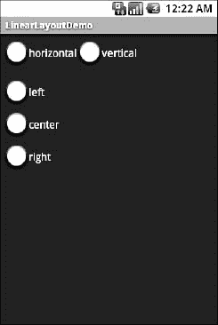

**图 10–1。** *最初启动的 LinearLayoutDemo 示例应用*

如果我们打开“垂直”单选按钮，顶部的`RadioGroup`会相应调整，如图 10–2 中的所示。

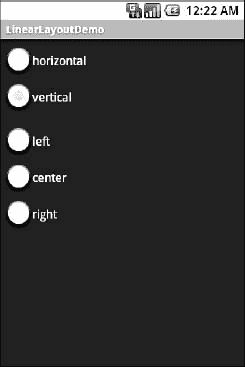

**图 10–2。** *同样的应用，用垂直单选按钮选中*

如果我们切换“中心”或“右”单选按钮，底部的`RadioGroup`会调整以匹配，如图图 10–3 和图 10–4 所示。

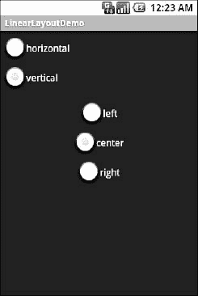

**图 10–3。** *同一个应用，选择了垂直和居中单选按钮*

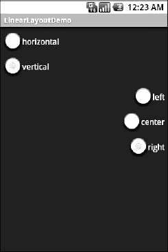

**图 10–4。** *同样的应用，用垂直和右单选按钮选中*

#### 盒子模型

正如本章前面提到的，一些 GUI 框架把所有东西都当作盒子 Android 称之为`LinearLayout`容器。例如，在 Flex 和 XUL 中，你创建盒子并指出它们应该有多大，占可用空间的百分比，然后你在盒子中放入小部件。类似的模式也存在于 Android 中的`LinearLayout`，正如在`Containers\LinearPercent`项目中所展示的。

这里我们有一个布局 XML 文件，它包含一个垂直的`LinearLayout`包装三个`Button`小部件:

`<?xml version="1.0" encoding="utf-8"?>
<LinearLayout
  xmlns:android="http://schemas.android.com/apk/res/android"
  android:orientation="vertical"
  android:layout_width="fill_parent"
  android:layout_height="fill_parent"
  >
  <Button
    android:text="Fifty Percent"
    android:layout_width="fill_parent"
    android:layout_height="0dip"
    android:layout_weight="50"
  />
  <Button
    android:text="Thirty Percent"
    android:layout_width="fill_parent"
    android:layout_height="0dip"` `    android:layout_weight="30"
  />
  <Button
    android:text="Twenty Percent"
    android:layout_width="fill_parent"
    android:layout_height="0dip"
    android:layout_weight="20"
  />
</LinearLayout>`

三个小部件中的每一个都将为`LinearLayout`占据一定比例的垂直空间。由于`LinearLayout`被设置为填充屏幕，这意味着三个小部件将根据它们请求的百分比来划分屏幕。

要请求百分比，每个`Button`执行以下操作:

*   将它的`android:layout_height`设置为`0dip`(注意，我们在这里使用高度，因为它是我们正在细分的垂直`LinearLayout`
*   将其`android:layout_weight`设置为所需的百分比(如`android:layout_weight="50"`)

只要权重之和为`100`，就像在这种情况下一样，您将得到您想要的百分比细分，如图图 10–5 所示。

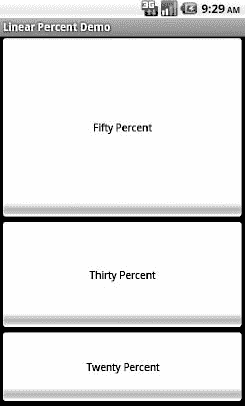

**图 10–5。** *按百分比在三个按钮之间分割的线形布局*

### 一切事物都是相对的

`RelativeLayout`顾名思义，根据部件与容器和父容器中其他部件的关系来布局部件。您可以将小部件 X 放在小部件 Y 的左下方，让小部件 Z 的下边缘与容器的下边缘对齐，等等。这让人想起了 James Elliot 的用于 Java/Swing 的`RelativeLayout`。

#### 相对布局概念和属性

为了完成所有这些工作，我们需要在 XML 布局文件中引用其他小部件的方法，以及指示这些小部件的相对位置的方法。

##### 相对于容器的位置

最容易设置的关系是那些使用以下属性将小部件的位置与其容器的位置联系起来的关系:

*   `android:layout_alignParentTop`:将小工具的顶部与容器的顶部对齐
*   `android:layout_alignParentBottom`:将小工具的底部与容器的底部对齐
*   `android:layout_alignParentLeft`:将小工具的左侧与容器的左侧对齐
*   `android:layout_alignParentRight`:将小工具的右侧与容器的右侧对齐
*   `android:layout_centerHorizontal`:将小工具水平放置在容器的中心
*   `android:layout_centerVertical`:将小工具垂直放置在容器的中心
*   `android:layout_centerInParent`:将小工具水平和垂直放置在容器的中心

所有这些属性都采用一个简单的布尔值(`true`或`false`)。

请注意，在执行这些不同的对齐时，会考虑小部件的填充。对齐基于小部件的整个单元格(其自然空间加上填充的组合)。

##### 属性中的相对符号

与`RelativeLayout`相关的其余属性将容器中的小部件的身份作为一个值。为此:

1.  将标识符(`android:id`属性)分配给所有需要寻址的元素。
2.  使用相同的标识符值引用其他小部件。

第一次出现的`id`值应包含加号(`@+id/widget_a`)；在布局文件中第二次及以后使用`id`值时，应省略加号(`@id/widget_a`)。这使得构建工具可以更好地帮助您捕捉小部件`id`值中的拼写错误——如果您的小部件`id`值没有加号，这在编译时会被捕捉到。

例如，如果小部件 A 被标识为`@+id/widget_a`，小部件 B 可以通过标识符`@id/widget_a`在它自己的一个属性中引用小部件 A。

##### 相对于其他部件的位置

以下四个属性控制小部件相对于其他小部件的位置:

*   `android:layout_above`:表示小部件应该放在属性中引用的小部件上面
*   `android:layout_below`:表示小部件应该放在属性中引用的小部件下面
*   `android:layout_toLeftOf`:表示小部件应该放在属性中引用的小部件的左边
*   `android:layout_toRightOf`:表示小部件应该放在属性中引用的小部件的右边

除了这四个属性之外，还可以使用另外五个属性来控制一个小部件相对于另一个小部件的对齐:

*   `android:layout_alignTop`:表示小工具的上边缘应该与属性中引用的小工具的上边缘对齐
*   `android:layout_alignBottom`:表示小工具的下边缘应该与属性中引用的小工具的下边缘对齐
*   `android:layout_alignLeft`:表示小工具的左边缘应该与属性中引用的小工具的左边缘对齐
*   `android:layout_alignRight`:表示小工具的右边缘应该与属性中引用的小工具的右边缘对齐
*   `android:layout_alignBaseline`:表示两个部件的基线应该对齐(基线是文本所在的不可见线)

属性对于对齐标签和字段很有用，这样文本看起来很自然。因为字段周围有一个框，而标签没有，所以`android:layout_alignTop`会将字段框的上边缘与标签的上边缘对齐，使标签的文本在屏幕上比输入到字段中的文本高。

因此，如果我们希望小部件 B 位于小部件 A 的右侧，在小部件 B 的 XML 元素中，我们需要包含`android:layout_toRightOf = "@id/widget_a"`(假设`@id/widget_a`是小部件 A 的标识)。

##### 评估顺序

Android 以前使用单路处理`RelativeLayout`定义的规则。这意味着只有在 XML 中声明了小部件之后，才能引用它(例如，通过`android:layout_above`)。这使得定义一些布局有点复杂。从 Android 1.6 开始，Android 使用两次传递来处理规则，所以现在您可以安全地向前引用尚未定义的小部件。

#### RelativeLayout 示例

记住所有这些，让我们检查一个带有一个字段、一个标签和一对标记为 OK 和 Cancel 的按钮的典型表单。下面是来自`Containers/Relative`示例项目的 XML 布局:

`<?xml version="1.0" encoding="utf-8"?>
<RelativeLayout
  xmlns:android="http://schemas.android.com/apk/res/android"
  android:layout_width="fill_parent"
  android:layout_height="wrap_content">
  <TextView android:id="@+id/label"
    android:layout_width="wrap_content"
    android:layout_height="wrap_content"
    android:text="URL:"
    android:layout_alignBaseline="@+id/entry"
    android:layout_alignParentLeft="true"/>
  <EditText
    android:id="@id/entry"
    android:layout_width="fill_parent"
    android:layout_height="wrap_content"
    android:layout_toRightOf="@id/label"
    android:layout_alignParentTop="true"/>
  <Button
    android:id="@+id/ok"` `    android:layout_width="wrap_content"
    android:layout_height="wrap_content"
    android:layout_below="@id/entry"
    android:layout_alignRight="@id/entry"
    android:text="OK" />
  <Button
    android:id="@+id/cancel"
    android:layout_width="wrap_content"
    android:layout_height="wrap_content"
    android:layout_toLeftOf="@id/ok"
    android:layout_alignTop="@id/ok"
    android:text="Cancel" />
</RelativeLayout>`

首先，我们打开`RelativeLayout`。在这种情况下，我们希望使用屏幕的整个宽度(`android:layout_width = "fill_parent"`)和我们需要的高度(`android:layout_height = "wrap_content"`)。

接下来，我们将标签定义为一个`TextView`。我们指出，我们希望它的左边缘与`RelativeLayout` ( `android:layout_alignParentLeft="true"`)的左边缘对齐，它的基线与尚未定义的`EditText`的基线对齐。由于`EditText`尚未声明，我们在 ID ( `android:layout_alignBaseline="@+id/entry"`)中使用`+`符号。

之后，我们添加字段作为`EditText`。我们希望该字段位于标签的右侧，使该字段与`RelativeLayout`的顶部对齐，并使该字段占据布局中该“行”的剩余部分。这些要求分别由以下三个属性处理:

*   `android:layout_toRightOf = "@id/label"`
*   `android:layout_alignParentTop = "true"`
*   `android:layout_width = "fill_parent"`

然后，确定按钮被设置在字段的下方(`android:layout_below = "@id/entry"`)，并使其右侧与字段的右侧对齐(`android:layout_alignRight = "@id/entry"`)。取消按钮设置在确定按钮(`android:layout_toLeft = "@id/ok"`)的左侧，其顶部与确定按钮(`android:layout_alignTop = "@id/ok"`)对齐。

在不改变自动生成的 Java 代码的情况下，仿真器给出了如图 Figure 10–6 所示的结果。

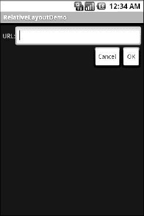

**图 10–6。***RelativeLayoutDemo 示例应用*

#### 重叠

`RelativeLayout`还有一个`LinearLayout`没有的特性——让小部件相互重叠的能力。一个`RelativeLayout`的后面的子元素比前面的子元素“在 Z 轴上更高”，这意味着如果后面的子元素被设置为占据布局中的相同空间，那么它们将与前面的子元素重叠。

这一点用一个例子会更清楚。这是一个布局，从`Containers/RelativeOverlap`开始，一个`RelativeLayout`持有两个`Button`部件:

`<?xml version="1.0" encoding="utf-8"?>
<RelativeLayout
  xmlns:android="http://schemas.android.com/apk/res/android"
  android:layout_width="fill_parent"
  android:layout_height="fill_parent"
  >
  <Button
    android:text="I AM BIG"
    android:textSize="120dip"
    android:textStyle="bold"
    android:layout_width="fill_parent"
    android:layout_height="fill_parent"
  />
  <Button
    android:text="I am small"
    android:layout_width="wrap_content"
    android:layout_height="wrap_content"
    android:layout_centerInParent="true"
  />` `</RelativeLayout>`

第一个`Button`设置为满屏。第二个`Button`被设置为在父对象内部居中，并且只占据标题所需的空间。因此，第二个`Button`看起来会浮在第一个`Button`上方，如图图 10–7 所示。

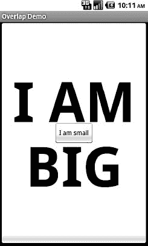

**图 10–7。** *相对重叠样本应用*

两个`Button`小部件仍然可以被点击，尽管点击较小的`Button`不会同时点击较大的`Button`。在这种重叠的情况下，您的点击将由顶部的小部件处理。

### 白板

如果你喜欢 HTML 表格、电子表格网格和类似的布局选项，你会喜欢 Android 的`TableLayout`，它允许你根据自己的要求在网格中放置你的小部件。您可以控制行数和列数，哪些列可以收缩或拉伸以容纳它们的内容，等等。

`TableLayout`与`TableRow`协同工作。`TableLayout`控制容器的整体行为，小部件本身被放入一个或多个`TableRow`容器中，网格中每行一个。

#### 表格布局概念和属性

为了让您的表格布局如您所愿地工作，您需要理解小部件如何处理行和列，以及如何处理位于行之外的小部件。

##### 将单元格成行排列

作为开发人员，您通过将小部件作为一个`TableRow`的子部件放入整个`TableLayout`中来声明行。因此，您可以直接控制表中显示的行数。

列数由 Android 决定；您以间接的方式控制列的数量。首先，在最长的一行中，每个小部件至少有一列。因此，如果有三行——一行有两个小部件，一行有三个小部件，一行有四个小部件——那么至少有四列。但是，通过包含`android:layout_span`属性，您可以让一个小部件占用多列，以指示小部件跨越的列数。这类似于在 HTML 的表格单元格中发现的`colspan`属性。在这个 XML 布局片段中，该字段跨越三列:

`<TableRow>
  <TextView android:text="URL:" />
  <EditText
    android:id="@+id/entry"
    android:layout_span="3"/>
</TableRow>`

通常，小部件被放在第一个可用的列中。在前面的片段中，标签将放在第一列中(列`0`，因为列是从`0`开始计数的)，字段将放入一个由三列组成的跨区集合中(列`1`到`3`)。但是，您可以通过`android:layout_column`属性将小部件放入不同的列，指定小部件所属的基于`0`的列:

`<TableRow>
  <Button
    android:id="@+id/cancel"
    android:layout_column="2"
    android:text="Cancel" />
  <Button android:id="@+id/ok" android:text="OK" />
</TableRow>`

在前面的 XML 布局片段中，Cancel 按钮位于第三列(列`2`)。然后，OK 按钮进入下一个可用列，即第四列。

##### TableLayout 的非行子级

通常，`TableLayout`只包含`TableRow`元素作为直接子元素。但是，也可以在行之间放置其他小部件。对于那些小部件，`TableLayout`的行为有点像垂直方向的`LinearLayout`。窗口小部件自动将它们的宽度设置为`fill_parent`，因此它们将填充与最长一行相同的空间。

一种模式是使用普通的`View`作为分隔符。例如，您可以使用`<View android:layout_height = "2dip" android:background = "#0000FF" />`作为横跨表格宽度的两个像素高的蓝色条。

##### 拉伸、收缩和折叠

默认情况下，每列将根据该列中最宽的小部件的自然大小来调整大小(将跨区列考虑在内)。但是，有时这并不太好，您需要对列行为进行更多的控制。

您可以在`TableLayout`上放置一个`android:stretchColumns`属性。该值应该是单个列号(同样基于`0`)或逗号分隔的列号列表。这些列将被拉伸以占据行上的任何可用空间。如果您的内容比可用空间窄，这很有帮助。

相反，您可以在`TableLayout`上放置一个`android:shrinkColumns`属性。同样，这应该是单个列号或逗号分隔的列号列表。此属性中列出的列将尝试对其内容进行自动换行，以减少列的有效宽度—默认情况下，小部件不进行自动换行。如果您的列可能包含冗长的内容，这将有助于将一些列从屏幕右侧推开。

您还可以利用`TableLayout`上的`android:collapseColumns`属性，同样使用列号或逗号分隔的列号列表。这些列将开始折叠，这意味着它们将是表信息的一部分，但不可见。通过编程，您可以通过调用`TableLayout`上的`setColumnCollapsed()`来折叠和取消折叠列。您可以使用它来允许用户控制哪些列对他们很重要，应该显示哪些列，哪些列不太重要，可以隐藏。

您还可以通过`setColumnStretchable()`和`setColumnShrinkable()`控制运行时的拉伸和收缩。

#### 表格布局示例

前面显示的 XML 布局片段组合在一起，给了我们一个为`RelativeLayout`创建的表单的`TableLayout`呈现，在标签/字段和两个按钮之间添加了一条分隔线(在`Containers/Table`演示中可以找到):

`<?xml version="1.0" encoding="utf-8"?>
<TableLayout
  xmlns:android="http://schemas.android.com/apk/res/android"
  android:layout_width="fill_parent"
  android:layout_height="fill_parent"
  android:stretchColumns="1">
  <TableRow>
    <TextView` `        android:text="URL:" />
    <EditText android:id="@+id/entry"
      android:layout_span="3"/>
  </TableRow>
  <View
    android:layout_height="2dip"
    android:background="#0000FF" />
  <TableRow>
    <Button android:id="@+id/cancel"
      android:layout_column="2"
      android:text="Cancel" />
    <Button android:id="@+id/ok"
      android:text="OK" />
  </TableRow>
</TableLayout>`

当针对生成的 Java 代码进行编译并在模拟器上运行时，我们会得到如图 Figure 10–8 所示的结果。

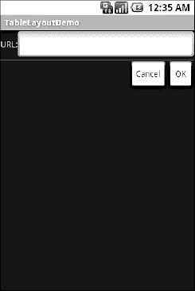

**图 10–8。***TableLayoutDemo 示例应用*

### 卷轴

手机屏幕往往很小，这就需要开发者使用一些技巧，在有限的可用空间里呈现大量信息。做到这一点的一个技巧是使用滚动，这样一次只能看到部分信息，其余的可以通过上下滚动来查看。

`ScrollView`是一个提供内容滚动的容器。你可以选择一个对于某些屏幕来说可能太大的布局，将其包装在一个`ScrollView`中，并且仍然使用你的现有的布局逻辑。用户一次只能看到你布局的一部分，通过滚动可以看到其余部分。

例如，这里有一个在 XML 布局文件中使用的`ScrollView`(来自`Containers/Scroll`演示):

`<?xml version="1.0" encoding="utf-8"?>
<ScrollView
  xmlns:android="http://schemas.android.com/apk/res/android"
  android:layout_width="fill_parent"
  android:layout_height="wrap_content">
  <TableLayout
    android:layout_width="fill_parent"
    android:layout_height="fill_parent"
    android:stretchColumns="0">
    <TableRow>
      <View
        android:layout_height="80dip"
        android:background="#000000"/>
      <TextView android:text="#000000"
        android:paddingLeft="4dip"
        android:layout_gravity="center_vertical" />
    </TableRow>
    <TableRow>
      <View
        android:layout_height="80dip"
        android:background="#440000" />
      <TextView android:text="#440000"
        android:paddingLeft="4dip"
        android:layout_gravity="center_vertical" />
    </TableRow>
    <TableRow>
      <View
        android:layout_height="80dip"
        android:background="#884400" />
    <TextView android:text="#884400"
        android:paddingLeft="4dip"
        android:layout_gravity="center_vertical" />
    </TableRow>
    <TableRow>
      <View
        android:layout_height="80dip"
        android:background="#aa8844" />
      <TextView android:text="#aa8844"
        android:paddingLeft="4dip"
        android:layout_gravity="center_vertical" />
    </TableRow>
    <TableRow>
      <View
        android:layout_height="80dip"
        android:background="#ffaa88" />
      <TextView android:text="#ffaa88"
        android:paddingLeft="4dip"
        android:layout_gravity="center_vertical" />
    </TableRow>
    <TableRow>
      <View` `        android:layout_height="80dip"
        android:background="#ffffaa" />
      <TextView android:text="#ffffaa"
        android:paddingLeft="4dip"
        android:layout_gravity="center_vertical" />
    </TableRow>
    <TableRow>
      <View
        android:layout_height="80dip"
        android:background="#ffffff" />
    <TextView android:text="#ffffff"
        android:paddingLeft="4dip"
        android:layout_gravity="center_vertical" />
    </TableRow>
  </TableLayout>
</ScrollView>`

如果没有`ScrollView`，表格将占用至少 560 个像素(基于`View`声明，7 行每行 80 个像素)。一些设备的屏幕能够显示那么多信息，如平板电脑，但许多设备的屏幕会更小。`ScrollView`让我们保持表格不变，但是一次只显示一部分。

在普通的 Android 模拟器上，当第一次查看活动时，会出现如图 Figure 10–9 所示的内容。

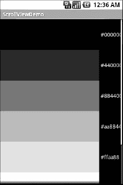

**图 10–9。***ScrollViewDemo 示例应用*

请注意，只有五行和第六行的一部分是可见的。通过按下 D-pad 上的向上/向下按钮，您可以上下滚动来查看剩余的行。还要注意滚动条是如何剪切内容的右侧的——一定要在那一侧放置一些填充，或者确保您自己的内容不会以这种方式被剪切。

Android 1.5 推出了`HorizontalScrollView`，工作方式类似于`ScrollView`，但是是横向的。这对于可能太宽而不是太高的表单非常有用。注意`ScrollView`和`HorizontalScrollView`都不会给你双向滚动，所以你必须选择垂直或水平。

另外，请注意，您不能将可滚动项目放入`ScrollView`中。例如，一个`ListView`小部件——我们将在接下来的章节中看到——已经知道如何滚动。如果你把一个`ListView`放在一个`ScrollView`里，它不会工作得很好。

### 带他们去电网

A `TableLayout`吸引了那些渴望 HTML 或 CSS 风格的像素精度(或缺乏像素精度)的人。通常你会发现你知道你希望你的布局中的元素相对于其他元素如何出现，或者在指定你的布局中的小部件的位置时需要更多的技巧。进入全新的`GridLayout`，与 Android 4 冰淇淋三明治(ICS)一同发布。

`GridLayout`是一种布局，它将子元素放在一个由无限细线条组成的网格上，这些线条将区域分隔成单元格。`GridLayout`精细控制的关键是单元格的数量，或者更准确地说，用于描述单元格的网格线没有限制或阈值——您可以使用`rowSpec`和`columnSpec`属性指定`GridLayout`应该有多少网格线。这意味着您可以创建一个布局，模拟一个具有几个单元格(即行和列)的简单表格，或者，对于那些需要非常精确的精度的苛刻情况，您可以疯狂地指定数千甚至数百万个单元格。

**注意:**为了补充`GridLayout`对 UI 世界的不同看法，它用`android:layout_gravity`代替了`android:layout_weight`。

例如，这里有一个在 XML 布局文件中使用的`GridLayout`(来自`Containers/Grid`演示):

`<?xml version="1.0" encoding="utf-8"?>
<GridLayout
 xmlns:android="http://schemas.android.com/apk/res/android"
 android:orientation="vertical"
 android:layout_width="fill_parent"
 android:layout_height="fill_parent"
>
  <Button
    android:text="Defying gravity!"
    android:layout_gravity="top"
  />
  <Button
    android:text="Falling like an apple"
    android:layout_gravity="bottom"
  />
</GridLayout>`

在 ICS Android 模拟器中，我们使用`GridLayout`查看活动，如图图 10–10 所示。

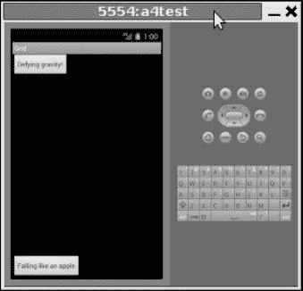

**图 10–10。***GridDemo 示例应用*

我们的按钮按照它们不同的重力方向将自己放置在`GridLayout`上，使用默认的`rowSpec`和`columnSpec`计数。通过在`main.xml`的声明中添加另一个按钮，我们可以观察到`GridLayout`的效用，它不需要`TableLayout`有些乏味的静态布局指令

`...
  <Button
    android:text="Defying gravity!"
    android:layout_gravity="top"
  />
  <**Button**
    **android:text="Floating middle right"**
    **android:layout_gravity="right|center_vertical"**
  **/>**
  <Button
    android:text="Falling like an apple"
    android:layout_gravity="bottom"
  />
...`

图 10–11 显示了我们的`GridLayout`如何适应显示其子节点。

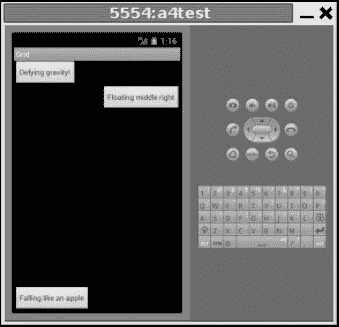

**图 10–11。**??【GridDemo】修订版