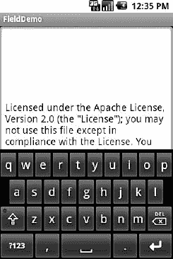
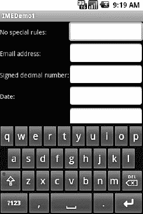
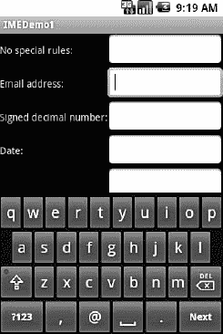
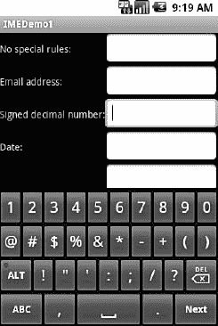
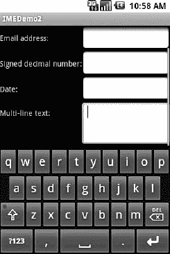

# 十一、输入法框架

Android 1.5 推出了输入法框架(IMF)，也就是通常所说的*软键盘*。然而，这一术语不一定准确，因为 IMF 可用于手写识别或通过屏幕接受文本输入的其他手段。

### 键盘，硬键盘和软键盘

一些 Android 设备有一个有时可见的硬件键盘(当它滑出时)。一些 Android 设备有一个总是可见的硬件键盘(所谓的“条形”或“平板”手机)。然而，大多数安卓设备根本没有硬件键盘。国际货币基金组织处理所有这些情况。

简而言之，如果没有硬件键盘，当用户点击一个启用的`EditText`小部件时，一个输入法编辑器(IME)将对用户可用。如果您想要提供 IME 的默认功能，则无需对应用进行任何代码更改。幸运的是，Android 在猜测您想要什么方面相当聪明，所以您可能只需要用 IME 进行测试，而不需要进行特定的代码更改。

但是 IME 可能不会像您希望的那样运行。例如，在`Basic/Field`示例项目中，`FieldDemo`活动的 IME 覆盖了多行`EditText`，如图图 11–1 所示。如果能对这种情况有更多的控制，并且能够控制 IME 的其他行为，那就太好了。幸运的是，正如本章所述，国际货币基金组织作为一个整体给了你很多选择。

**图 11–1。** *输入法编辑器，参见 FieldDemo 示例应用*

### 根据您的需求量身定制

Android 1.1 和更早的版本在`EditText`小工具上提供了许多属性来控制它们的输入风格，例如`android:password`指示一个字段应该用于密码输入(遮住密码键盘以免被窥探)。从 Android 1.5 开始，有了 IMF，这些属性中的许多被合并成一个单一的`android:inputType`属性。

`android:inputType`属性接受一个类加修饰符，在一个管道分隔的列表中(其中`|`是管道字符)。该类通常描述允许用户输入的内容，这决定了软键盘上可用的基本键集。可用的类别如下:

*   `text`(默认)
*   `number`
*   `phone`
*   `datetime`
*   `date`
*   `time`

这些类中有许多提供了一个或多个修饰符来进一步细化允许用户输入的内容。为了更好地理解这些修改器是如何工作的，请看一下来自`InputMethod/IMEDemo1`项目的`res/layout/main.xml`文件:

`<?xml version="1.0" encoding="utf-8"?>
<TableLayout xmlns:android="http://schemas.android.com/apk/res/android"
  android:layout_width="fill_parent"
  android:layout_height="fill_parent"
  android:stretchColumns="1"
  >
  <TableRow>
    <TextView    
      android:text="No special rules:"
    />
    <EditText
    />
  </TableRow>
  <TableRow>
    <TextView    
      android:text="Email address:"
    />
    <EditText    
      android:inputType="text|textEmailAddress"
    />
  </TableRow>
  <TableRow>
    <TextView
      android:text="Signed decimal number:"
    />
    <EditText
      android:inputType="number|numberSigned|numberDecimal"
    />
  </TableRow>
  <TableRow>
    <TextView
      android:text="Date:"
    />
    <EditText
      android:inputType="date"
    />
  </TableRow>
  <TableRow>
    <TextView
      android:text="Multi-line text:"
    />
    <EditText
      android:inputType="text|textMultiLine|textAutoCorrect"
      android:minLines="3"
      android:gravity="top"
    />
  </TableRow>
</TableLayout>`

这显示了一个包含 5 行的`TableLayout`，每一行展示了一个略有不同的`EditText`风格:

*   第一行在`EditText`上没有任何属性，这意味着您得到的是一个纯文本输入字段。
*   第二行有`android:inputType = "text|textEmailAddress"`，这意味着它是一个专门查找电子邮件地址的文本输入字段。
*   第三行允许通过`android:inputType = "number|numberSigned|numberDecimal"`输入带符号的十进制数字。
*   第四行设置为允许数据输入日期(`android:inputType = "date"`)。
*   最后一行允许多行输入，自动纠正可能的拼写错误(`android:inputType = "text|textMultiLine|textAutoCorrect"`)。

类和修饰符定制键盘。例如，一个纯文本输入字段会产生一个纯软键盘，如图 Figure 11–2 所示。

**图 11–2。** *标准输入法编辑器(又称软键盘)*

一个电子邮件地址域可能会把`@`符号放在软键盘上，代价是一个更小的空格键，如图 Figure 11–3 所示。

**图 11–3。** *电子邮件地址的输入法编辑器*

请注意，此行为特定于 IME。有些编辑可能会在主键盘上为电子邮件字段放置`@`符号。有些人可能会在主键盘上放一个`.com`按钮。有些人可能根本没有反应。这取决于 IME 的实现——您所能做的就是提供提示。

数字和日期字段将键限制为数字键，加上一组在给定字段上可能有效也可能无效的符号，如图 Figure 11–4 所示。

**图 11–4。**??【有符号十进制数字输入法编辑器】??

这些只是可能的 ime 的几个例子。通过选择合适的`android:inputType`，您可以为用户提供一个最适合他们应该输入的数据类型的软键盘。

### 告诉安卓它能去哪里

你可能已经注意到图 11–2 中所示的 IME 和图 11–3 中所示的 IME 之间的细微差别，除了增加了`@`键。图 11–3 中软键盘的右下角有一个 Next 按钮，而图 11–2 中的软键盘有一个换行按钮。这指出了两件事:

*   如果不指定`android:inputType`，默认情况下`EditText`小部件是多行的。
*   你可以控制右下角的按钮，称为*附件*按钮。

默认情况下，在您指定了`android:inputType`的`EditText`微件上，附件按钮将是下一个，按顺序将您移动到下一个`EditText`微件，或者如果您在屏幕上的最后一个`EditText`微件上，则完成。您可以通过`android:imeOptions`属性手动指定附件按钮的标签。例如，在来自`InputMethod/IMEDemo2`的`res/layout/main.xml`文件中，您将看到上一个示例的增强版本，其中两个输入字段指定了它们的附件按钮应该是什么样子:

`<?xml version="1.0" encoding="utf-8"?>
<ScrollView xmlns:android="http://schemas.android.com/apk/res/android"
  android:layout_width="fill_parent"
  android:layout_height="fill_parent"
>
  <TableLayout
    android:layout_width="fill_parent"
    android:layout_height="fill_parent"
    android:stretchColumns="1"
    >
    <TableRow>
      <TextView
        android:text="No special rules:"
      />
      <EditText
      />
    </TableRow>
    <TableRow>
      <TextView
        android:text="Email address:"
      />
      <EditText
        android:inputType="text|textEmailAddress"
        android:imeOptions="actionSend"
      />
    </TableRow>
    <TableRow>
      <TextView
        android:text="Signed decimal number:"
      />
      <EditText
        android:inputType="number|numberSigned|numberDecimal"
        android:imeOptions="actionDone"
      />
    </TableRow>
    <TableRow>
      <TextView
        android:text="Date:"
      />
      <EditText
        android:inputType="date"
      />
    </TableRow>
    <TableRow>
      <TextView
        android:text="Multi-line text:"
      />
      <EditText
        android:inputType="text|textMultiLine|textAutoCorrect"
        android:minLines="3"
        android:gravity="top"
      />
    </TableRow>
  </TableLayout>
</ScrollView>`

在这里，我们为电子邮件地址的附件按钮(`android:imeOptions = "actionSend"`)附加了一个发送动作，并为中间字段(`android:imeOptions = "actionDone"`)附加了一个完成动作。

默认情况下，Next 将焦点移动到下一个`EditText`，Done 关闭 IME。然而，对于那些动作，或者任何其他类似 Send 的动作，您可以使用`EditText`上的`setOnEditorActionListener()`(技术上来说，是在`TextView`超类上)来获得当附件按钮被点击或者用户按下回车键时的控制权。为您提供了一个指示所需操作的标志(例如，`IME_ACTION_SEND`)，然后您可以做一些事情来处理该请求(例如，向所提供的电子邮件地址发送一封电子邮件)。

### 融入

请注意，上一节中显示的`IMEDemo2`布局与其`IMEDemo1`前身有另一个不同之处:使用`ScrollView`集装箱包裹`TableLayout`。这与您对《时代》的另一个控制层次有关:当 IME 出现时，您的活动本身的布局会发生什么。根据具体情况，有三种可能性:

*   Android 可以“平移”你的活动，有效地向上滑动整个布局以适应 IME，或者覆盖你的布局，这取决于正在编辑的`EditText`是在顶部还是底部。这实际上隐藏了用户界面的一部分。
*   Android 可以调整你的活动大小，有效地使其缩小到更小的屏幕尺寸，允许 IME 位于活动本身的下方。当布局可以很容易地缩小时，这是很好的(例如，它由一个列表或多行输入字段控制，不需要整个屏幕都起作用)。
*   Android 可能会全屏显示 IME，遮住你的整个活动。这允许更大的键盘和更容易的数据输入。

Android 使用其历史默认设置控制全屏选项。默认情况下，Android 会根据你的布局选择平移和调整大小模式。如果你想在平移和调整大小之间做出选择，你可以通过`AndroidManifest.xml`文件中`<activity>`元素的`android:windowSoftInputMode`属性来实现。例如，下面是来自`IMEDemo2`的清单:

`<?xml version="1.0" encoding="utf-8"?>
<manifest xmlns:android="http://schemas.android.com/apk/res/android" package="com.commonsware.android.imf.two" android:versionCode="1" android:versionName="1.0">
    <application android:label="@string/app_name" android:icon="@drawable/cw">
        <activity android:name=".IMEDemo2" android:label="@string/app_name" android:windowSoftInputMode="adjustResize">
            <intent-filter>
                <action android:name="android.intent.action.MAIN"/>
                <category android:name="android.intent.category.LAUNCHER"/>
            </intent-filter>` `        </activity>
    </application>
  <supports-screens android:largeScreens="true" android:normalScreens="true" android:smallScreens="true" android:anyDensity="true"/>
</manifest>`

因为我们指定了 resize，Android 将缩小我们的布局以适应 IME。当`ScrollView`就位时，这意味着滚动条将根据需要出现，如图 11–5 所示。

**图 11–5。** *缩小的、可滚动的布局*

您可以通过使用 Honeycomb 中引入的附加方法来控制 Android 的行为，以最大化屏幕空间，并在 Ice Cream Sandwich 中进行完善。使用 Java 方法`setSystemUiVisibility()`和`STATUS_BAR_HIDDEN`选项来隐藏系统栏，允许更大的全屏模式，或者使用方法`setDimAmount()`来调整主页按钮的亮度，以消除对您定期调整大小的全屏布局的干扰。

### 简，停止这疯狂的事情！

有时候，你需要 IME 走开。例如，如果您将附件按钮设置为搜索按钮，当用户点击该按钮时，IME 不会自动隐藏，而您可能希望隐藏它。要隐藏 IME，您需要调用`InputMethodManager`，这是一个控制这些 ime 的系统服务:

`InputMethodManager mgr=(InputMethodManager)getSystemService(INPUT_METHOD_SERVICE);

mgr.**hideSoftInputFromWindow(fld.getWindowToken**(), 0);`

(在前一行中，`fld`是您要隐藏其 IME 的`EditText`。)

这将始终关闭指定的 IME。但是，请记住，用户首先可以通过两种方式打开 IME:

*   如果用户的设备没有暴露硬件键盘，并且用户点击`EditText`，IME 应该会出现。
*   如果用户之前关闭了 IME，或者正在使用通常不会弹出窗口的小部件的 IME(例如`ListView`)，并且用户按下了菜单按钮，则 IME 应该会出现。

如果您只想在第一种情况下关闭 IME，而不想在第二种情况下关闭，那么使用`InputMethodManager.HIDE_IMPLICIT_ONLY`作为调用`hideSoftInputFromWindow()`的第二个参数的标志，而不是前面例子中的`0`。