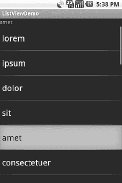
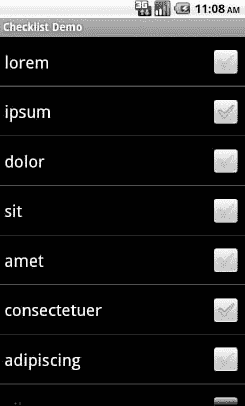
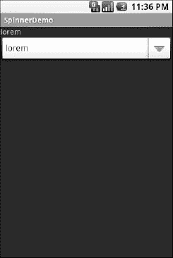
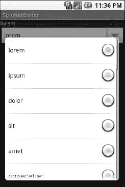
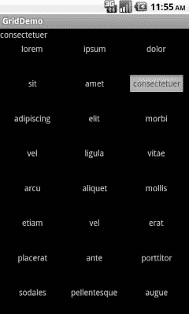
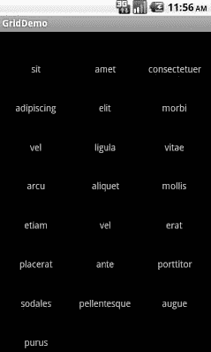
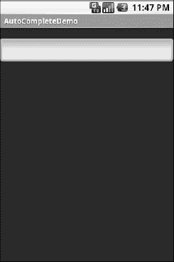
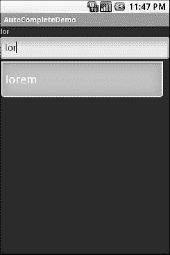
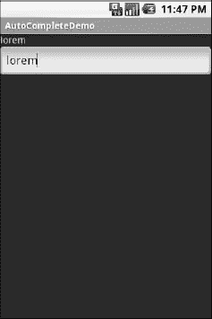

# 十二、使用选择小部件

在第十一章的中，您看到了如何对字段进行约束以限制可能的输入，比如只能输入数字或只能输入电话号码。这些约束帮助用户在输入信息时“正确无误”，尤其是在键盘狭窄的移动设备上。

当然，约束输入的最终目的是只允许从一组项目中进行选择，比如一组单选按钮。经典的 UI 工具包有列表框、组合框、下拉列表等等，就是为了这个目的。Android 提供了许多相同种类的小工具，加上其他移动设备特别感兴趣的小工具(例如，用于检查保存的照片的`Gallery`)。

此外，Android 提供了一个灵活的框架来确定这些小部件中哪些选项可用。具体来说，Android 提供了一个数据适配器框架，为选择列表提供了一个公共接口，范围从静态数组到数据库内容。选择视图——用于呈现选项列表的小部件——有一个适配器来提供实际的选项。

### 适应环境

抽象地说，适配器为多个不同的 API 提供了一个公共接口。更具体地说，在 Android 的情况下，适配器为选择样式的小部件(如列表框)背后的数据模型提供了一个公共接口。Java 接口的这种使用相当普遍(例如，Java/Swing 的模型适配器用于`JTable`)，Java 远不是唯一提供这种抽象的环境(例如，Flex 的 XML 数据绑定框架接受 XML 作为静态数据内联或从互联网检索)。

Android 的适配器不仅负责为选择小部件提供数据列表，还负责将单个数据元素转换成特定的视图，在选择小部件中显示。适配器系统的后一个方面听起来可能有点奇怪，但实际上，它与其他 GUI 工具包覆盖默认显示行为的方式没有什么不同。例如，在 Java/Swing 中，如果您希望一个由`JList`支持的列表框实际上是一个检查列表(其中每一行都是一个复选框加标签，单击调整复选框的状态)，那么您不可避免地要调用 `setCellRenderer()`来提供您自己的`ListCellRenderer`，这又会将列表的字符串转换成`JCheckBox` -plus- `JLabel`复合小部件。

最容易使用的适配器是`ArrayAdapter`。您只需将其中一个封装在 Java 数组或`java.util.List`实例中，您就有了一个全功能的适配器:

`String[] items={"this", "is", "a",
                "really", "silly", "list"};
new ArrayAdapter<String>(this,
  android.R.layout.simple_list_item_1, items);`

一种风格的`ArrayAdapter`构造函数有三个参数:

*   要使用的`Context`(通常这将是您的活动实例)
*   要使用的视图的资源 ID(如前面示例中所示的内置系统资源 ID)
*   要显示的实际项目数组或列表

默认情况下，`ArrayAdapter`将对列表中的对象调用`toString()`,并将这些字符串包装在由提供的资源指定的视图中。`android.R.layout.simple_list_item_1`只是将这些字符串转换成`TextView`对象。这些`TextView`小部件将依次显示在列表、微调器或任何使用这个`ArrayAdapter`的小部件中。如果你想看看`android.R.layout.simple_list_item_1`是什么样子，你可以在你的 SDK 安装中找到它的副本——只需搜索`simple_list_item_1.xml`。

在第十三章中，你将看到如何子类化一个适配器并覆盖行创建，给你更多的控制行如何出现。

### 淘气和乖孩子的名单

Android 中经典的列表框小部件被称为`ListView`。在您的布局中包含其中一个，调用`setAdapter()`提供您的数据和子视图，并通过`setOnItemSelectedListener()`附加一个监听器来发现选择何时改变。这样，你就有了一个功能齐全的列表框。

但是，如果您的活动由一个列表控制，您可以考虑将您的活动创建为`ListActivity`的子类，而不是常规的`Activity`基类。如果你的主视图只是列表，你甚至不需要提供布局— `ListActivity`会为你构建一个全屏列表。如果您确实想定制布局，您可以，只要您将您的`ListView`标识为`@android:id/list`，这样`ListActivity`就知道哪个小部件是活动的主列表。

例如，这里有一个来自`Selection/List`示例项目的布局，一个简单的列表，顶部有一个标签显示当前的选择:

`<?xml version="1.0" encoding="utf-8"?>
<LinearLayout
  xmlns:android="http://schemas.android.com/apk/res/android"
  android:orientation="vertical"
  android:layout_width="fill_parent"
  android:layout_height="fill_parent" >
  <TextView
    android:id="@+id/selection"
    android:layout_width="fill_parent"
    android:layout_height="wrap_content"/>
  <ListView
    android:id="@android:id/list"
    android:layout_width="fill_parent"
    android:layout_height="fill_parent"
    android:drawSelectorOnTop="false"
    />
</LinearLayout>`

配置列表并将列表与标签连接起来的 Java 代码如下:

`public class ListViewDemo extends ListActivity {
  private TextView selection;
  private static final String[] items={"lorem", "ipsum", "dolor",
          "sit", "amet",
          "consectetuer", "adipiscing", "elit", "morbi", "vel",
          "ligula", "vitae", "arcu", "aliquet", "mollis",
          "etiam", "vel", "erat", "placerat", "ante",
          "porttitor", "sodales", "pellentesque", "augue", "purus"};

  @Override
  public void **onCreate**(Bundle icicle) {
    super.**onCreate**(icicle);
    **setContentView**(R.layout.main);
    **setListAdapter**(new ArrayAdapter<String>(this,
                       android.R.layout.simple_list_item_1,
                       items));
    selection=(TextView)**findViewById**(R.id.selection);
  }

  public void **onListItemClick**(ListView parent, View v, int position,
                               long id) {
   selection.setText(items[position]);
  }
}`

使用`ListActivity`，您可以通过`setListAdapter()`设置列表适配器——在这种情况下，提供一个`ArrayAdapter`来包装一组无意义的字符串。为了找出列表选择何时改变，覆盖`onListItemClick()`并根据提供的子视图和位置采取适当的步骤——在本例中，用该位置的文本更新标签。结果如图 12–1 所示。

**图 12–1。**??【listview demo】示例应用

我们的`ArrayAdapter`、`android.R.layout.simple_list_item_1`的第二个参数控制行的外观。上例中使用的值提供了标准的 Android 列表行:大字体、大量填充和白色文本。

### 选择模式

默认情况下，`ListView`被设置为简单地收集列表条目的点击量。如果您想要一个跟踪用户选择的列表，或者可能是多个选择的列表，`ListView`也可以处理，但是需要做一些修改。

首先，您需要在 Java 代码中调用`ListView`上的`setChoiceMode()`来设置选择模式，提供`CHOICE_MODE_SINGLE`或`CHOICE_MODE_MULTIPLE`作为值。你可以通过`getListView()`从`ListActivity`得到你的`ListView`。您也可以通过布局 XML 中的`android:choiceMode`属性来声明这一点。

然后，不使用`android.R.layout.simple_list_item_1`作为`ArrayAdapter`构造函数中列表行的布局，而是需要使用`android.R.layout.simple_list_item_single_choice`或`android.R.layout.simple_list_item_multiple_choice`分别用于单选或多选列表。

例如，下面是来自`Selection/Checklist`示例项目的活动布局:

`<?xml version="1.0" encoding="utf-8"?>
<ListView
xmlns:android="http://schemas.android.com/apk/res/android"
  android:id="@android:id/list"
  android:layout_width="fill_parent"
  android:layout_height="fill_parent"
  android:drawSelectorOnTop="false"
  android:choiceMode="multipleChoice"
/>`

它是一个全屏的`ListView`，用`android:choiceMode="multipleChoice"`属性表示我们想要多选支持。

我们的活动只是在我们的无意义单词列表中使用一个标准的`ArrayAdapter`，但是使用`android.R.layout.simple_list_item_multiple_choice`作为行布局:

`package com.commonsware.android.checklist;

import android.os.Bundle;
import android.app.ListActivity;
import android.widget.ArrayAdapter;
import android.widget.ListView;

public class ChecklistDemo extends ListActivity {
  private static final String[] items={"lorem", "ipsum", "dolor",
          "sit", "amet",
          "consectetuer", "adipiscing", "elit", "morbi", "vel",
          "ligula", "vitae", "arcu", "aliquet", "mollis",
          "etiam", "vel", "erat", "placerat", "ante",
          "porttitor", "sodales", "pellentesque", "augue", "purus"};

  @Override
   public void **onCreate**(Bundle icicle) {
    super.**onCreate**(icicle);
    **setContentView**(R.layout.main);
    **setListAdapter**(new ArrayAdapter<String>(this,
                       android.R.layout.simple_list_item_multiple_choice,
                       items));
  }
}`

用户在左边看到单词列表，右边有复选框，如图 Figure 12–2 所示。

**图 12–2。** *多选模式*

如果我们愿意，我们可以在我们的`ListView`上调用`getCheckedItemPositions()`来找出用户检查了哪些条目，或者我们自己调用`setItemChecked()`来检查(或取消检查)一个特定的条目。

### 旋转控制

在 Android 中，`Spinner`相当于其他工具包中的下拉选择器(例如，Java/Swing 中的`JComboBox`)。按下键盘上的中央按钮会弹出一个选择对话框，用户可以从中选择一个项目。`Spinner`基本上提供列表选择功能，而不会占用`ListView`的所有屏幕空间，代价是额外的点击或屏幕点击来做出改变。

与`ListView`一样，您通过`setAdapter()`为数据和子视图提供适配器，并通过`setOnItemSelectedListener()`为选择挂接一个监听器对象。

如果您想定制显示下拉透视图时使用的视图，您需要配置适配器，而不是`Spinner`小部件。使用`setDropDownViewResource()`方法提供要使用的视图的资源 ID。

例如，从`Selection/Spinner`示例项目中挑选出来的，下面是一个带有`Spinner`的简单视图的 XML 布局:

`<?xml version="1.0" encoding="utf-8"?>
<LinearLayout
  xmlns:android="http://schemas.android.com/apk/res/android"` `  android:orientation="vertical"
  android:layout_width="fill_parent"
  android:layout_height="fill_parent"
  >
  <TextView
    android:id="@+id/selection"
    android:layout_width="fill_parent"
    android:layout_height="wrap_content"
    />
  <Spinner android:id="@+id/spinner"
    android:layout_width="fill_parent"
    android:layout_height="wrap_content"
    android:drawSelectorOnTop="true"
  />
</LinearLayout>`

这是与上一节所示相同的视图，但是用`Spinner`代替了`ListView`。`Spinner`属性`android:drawSelectorOnTop`控制是否在`Spinner` UI 右侧的选择器按钮上绘制箭头。

为了填充和使用`Spinner`，我们需要一些 Java 代码:

`public class SpinnerDemo extends Activity
  implements AdapterView.OnItemSelectedListener {
  private TextView selection;
  private static final String[] items={"lorem", "ipsum", "dolor",
          "sit", "amet",
          "consectetuer", "adipiscing", "elit", "morbi", "vel",
          "ligula", "vitae", "arcu", "aliquet", "mollis",
          "etiam", "vel", "erat", "placerat", "ante",
          "porttitor", "sodales", "pellentesque", "augue", "purus"};

  @Override
  public void **onCreate**(Bundle icicle) {
    super.**onCreate**(icicle);
    **setContentView**(R.layout.main);
    selection=(TextView)**findViewById**(R.id.selection);

    Spinner spin=(Spinner)**findViewById**(R.id.spinner);
    spin**.setOnItemSelectedListener**(this);

    ArrayAdapter<String> aa=new ArrayAdapter<String>(this,
                             android.R.layout.simple_spinner_item,
                             items);

    aa.**setDropDownViewResource**(
      android.R.layout.simple_spinner_dropdown_item);
    spin**.setAdapter**(aa);
  }

  public void **onItemSelected**(AdapterView<?> parent,
                               View v, int position, long id) {
    selection**.setText**(items[position]);
  }

  public void **onNothingSelected**(AdapterView<?> parent) {
    selection**.setText**("");` `  }
}`

这里，我们将活动本身附加为选择监听器(`spin.setOnItemSelectedListener(this)`)。这是因为活动实现了`OnItemSelectedListener`接口。我们不仅用假词列表来配置适配器，还用特定的资源来用于下拉视图(通过`aa.setDropDownViewResource()`)。还要注意使用`android.R.layout.simple_spinner_item`作为内置的`View`来显示微调器中的项目。

最后，我们实现了`OnItemSelectedListener`所需的回调，以根据用户输入调整选择标签。图 12–3 和 12–4 显示了结果。

**图 12–3。** *最初启动的 SpinnerDemo 示例应用*

**图 12–4。** *同样的应用，用微调器下拉列表显示*

### 给你的狮子网格(或者类似的东西...)

顾名思义，`GridView`为您提供了一个可供选择的二维项目网格。您可以适度控制列的数量和大小；行数是根据提供的适配器所说的可供查看的项目数动态确定的。

有几个属性组合在一起决定了列的数量及其大小:

*   `android:numColumns`:表示有多少列，或者，如果您提供一个值`auto_fit`，Android 将根据可用空间和列表中的以下属性计算列数。
*   `android:verticalSpacing`和`android:horizontalSpacing`:指示网格中的项目之间应该存在多少空白。
*   `android:columnWidth`:表示每列应该有多少像素宽。
*   `android:stretchMode`:对于`auto_fit`代表`android:numColumns`的网格，表示任何未被列或间距占据的可用空间应该发生的情况。这可以是`columnWidth`，让列占据可用空间，或者是`spacingWidth`，让列之间的空白空间吸收额外的空间。

否则，`GridView`的工作方式与任何其他选择小部件非常相似——使用`setAdapter()`来提供数据和子视图，调用`setOnItemSelectedListener()`来注册选择监听器，等等。

例如，下面是来自`Selection/Grid`示例项目的 XML 布局，显示了一个`GridView`配置:

`<?xml version="1.0" encoding="utf-8"?>
<LinearLayout
  xmlns:android="http://schemas.android.com/apk/res/android"
  android:orientation="vertical"
  android:layout_width="fill_parent"
  android:layout_height="fill_parent"
  >
  <TextView
    android:id="@+id/selection"
    android:layout_width="fill_parent"
    android:layout_height="wrap_content"
    />
  <GridView
    android:id="@+id/grid"
    android:layout_width="fill_parent"
    android:layout_height="fill_parent"
    android:verticalSpacing="40dip"
    android:horizontalSpacing="5dip"
    android:numColumns="auto_fit"
    android:columnWidth="100dip"
    android:stretchMode="columnWidth"
    android:gravity="center"
    />
</LinearLayout>`

对于这个网格，除了我们的选择标签所要求的以外，我们占据了整个屏幕。Android ( `android:numColumns = "auto_fit"`)根据我们的水平间距(`android:horizontalSpacing = "5dip"`)和列宽(`android:columnWidth = "100dip"`)计算列数，列吸收任何剩余的“倾斜”宽度(`android:stretchMode = "columnWidth"`)。

配置`GridView`的 Java 代码如下:

`package com.commonsware.android.grid;

import android.app.Activity;
import android.content.Context;
import android.os.Bundle;
import android.view.View;
import android.widget.AdapterView;
import android.widget.ArrayAdapter;
import android.widget.GridView;
import android.widget.TextView;

public class GridDemo extends Activity
  implements AdapterView.OnItemSelectedListener {
  private TextView selection;
  private static final String[] items={"lorem", "ipsum", "dolor",
          "sit", "amet",` `          "consectetuer", "adipiscing", "elit", "morbi", "vel",
          "ligula", "vitae", "arcu", "aliquet", "mollis",
          "etiam", "vel", "erat", "placerat", "ante",
          "porttitor", "sodales", "pellentesque", "augue", "purus"};

  @Override
  public void **onCreate**(Bundle icicle) {
    super.**onCreate**(icicle);
    **setContentView**(R.layout.main);
    selection=(TextView)**findViewById**(R.id.selection);

    GridView g=(GridView) **findViewById**(R.id.grid);
    g**.setAdapter**(new ArrayAdapter<String>(this,
                       R.layout.cell,
                       items));
    g**.setOnItemSelectedListener**(this);
  }

  public void **onItemSelected**(AdapterView<?> parent, View v,
                             int position, long id) {
    selection**.setText**(items[position]);
  }

  public void **onNothingSelected**(AdapterView<?> parent) {
    selection**.setText**("");
  }
}`

网格单元由一个单独的`res/layout/cell.xml`文件定义，在我们的`ArrayAdapter`中称为`R.layout.cell`:

`<?xml version="1.0" encoding="utf-8"?>
<TextView
  xmlns:android="http://schemas.android.com/apk/res/android"
  android:layout_width="wrap_content"
  android:layout_height="wrap_content"
  android:textSize="14dip"
/>`

通过与 XML 布局(`android:verticalSpacing = "40dip"`)的垂直间距，网格溢出模拟器屏幕的边界，如图图 12–5 和 12–6 所示。

**图 12–5。***GridDemo 示例应用，最初启动时为*

**图 12–6。** *同一个应用，滚动到网格底部*

### 字段:现在减少了 35%的打字量！

`AutoCompleteTextView`是`EditText`(场)和`Spinner`的混合体。使用自动完成功能，当用户键入时，文本被视为前缀过滤器，将输入的文本作为前缀与候选列表进行比较。匹配项显示在从字段下拉的选择列表中(与`Spinner`一样)。用户可以键入完整的条目(例如，列表中没有的内容)，或者从列表中选择一个项目作为字段的值。

`AutoCompleteTextView`子类`EditText`，这样你就可以配置所有的标准外观，比如字体和颜色。此外，`AutoCompleteTextView`有一个`android:completionThreshold`属性，用来指示用户在列表过滤开始之前必须输入的最少字符数。

您可以通过`setAdapter()`给`AutoCompleteTextView`一个包含候选值列表的适配器。然而，由于用户可以输入列表中没有的内容，`AutoCompleteTextView`不支持选择监听器。相反，您可以注册一个`TextWatcher`，就像您可以注册任何一个`EditText`小部件一样，当文本改变时，您会得到通知。这些事件会因为手动键入或从下拉列表中选择而发生。

下面是一个熟悉的 XML 布局，这次包含一个`AutoCompleteTextView`(来自`Selection/AutoComplete`示例应用):

`<?xml version="1.0" encoding="utf-8"?>
<LinearLayout
  xmlns:android="http://schemas.android.com/apk/res/android"
  android:orientation="vertical"
  android:layout_width="fill_parent"
  android:layout_height="fill_parent"
  >
  <TextView
    android:id="@+id/selection"
    android:layout_width="fill_parent"
    android:layout_height="wrap_content"
    />
  <AutoCompleteTextView android:id="@+id/edit"
      android:layout_width="fill_parent"
      android:layout_height="wrap_content"
      android:completionThreshold="3"/>
</LinearLayout>`

相应的 Java 代码如下:

`package com.commonsware.android.auto;

import android.app.Activity;
import android.os.Bundle;
import android.text.Editable;
import android.text.TextWatcher;
import android.view.View;
import android.widget.AdapterView;
import android.widget.ArrayAdapter;
import android.widget.AutoCompleteTextView;` `import android.widget.TextView;

public class AutoCompleteDemo extends Activity
  implements TextWatcher {
  private TextView selection;
  private AutoCompleteTextView edit;
  private static final String[] items={"lorem", "ipsum", "dolor",
          "sit", "amet",
          "consectetuer", "adipiscing", "elit", "morbi", "vel",
          "ligula", "vitae", "arcu", "aliquet", "mollis",
          "etiam", "vel", "erat", "placerat", "ante",
          "porttitor", "sodales", "pellentesque", "augue", "purus"};

  @Override
  public void **onCreate**(Bundle icicle) {
    super.**onCreate**(icicle);
    **setContentView**(R.layout.main);
    selection=(TextView)**findViewById**(R.id.selection);
    edit=(AutoCompleteTextView)**findViewById**(R.id.edit);
    edit**.addTextChangedListener**(this);

    edit**.setAdapter**(new ArrayAdapter<String>(this,
                         android.R.layout.simple_dropdown_item_1line,
                         items));
  }

  public void **onTextChanged**(CharSequence s, int start, int before,
                             int count) {
    selection.setText(edit.**getText**());
  }

  public void **beforeTextChanged**(CharSequence s, int start,
                                 int count, int after) {
    // needed for interface, but not used
  }

  public void **afterTextChanged**(Editable s) {
    // needed for interface, but not used
  }
}`

这次，我们的活动实现了`TextWatcher`，这意味着我们的回调是`onTextChanged()`、`beforeTextChanged()`和`afterTextChanged()`。在这种情况下，我们只对`onTextChanged()`感兴趣，我们更新选择标签以匹配`AutoCompleteTextView`的当前内容。图 12–7、12–8 和 12–9 显示了结果。

**图 12–7。***autocompleted emo 示例应用，如同最初启动的*

**图 12–8。** *同一个应用，输入几个匹配的字母后，显示自动完成下拉框*

**图 12–9。** *同样的应用，在自动完成值被选中后*

### 画廊，给予或接受艺术

`Gallery`小部件在 GUI 工具包中并不常见。实际上，它是一个水平布局的列表框。在水平面上，一个选项接着一个选项，当前选定的项目高亮显示。在 Android 设备上，用户通过左右方向键在选项间旋转。

与`ListView`相比，`Gallery`占用更少的屏幕空间，同时仍然可以一次显示多个选项(假设它们足够短)。与`Spinner`相比，`Gallery`总是一次显示多个选择。

用于`Gallery`的典型例子是图像预览。给定一组照片或图标，`Gallery`让人们在选择一个的过程中预览图片。

就代码而言，`Gallery`的工作方式很像`Spinner`或`GridView`。在 XML 布局中，有几个属性供您使用:

*   `android:spacing`:控制列表中条目之间的像素数。
*   `android:spinnerSelector`:控制用来表示选择的内容。这既可以是对一个`Drawable`(参见参考资料章节)的引用，也可以是一个用`#AARRGGBB`或类似符号表示的 RGB 值。

`android:drawSelectorOnTop`:表示选择条(或`Drawable`)是画在`false`之前还是`true`之后。如果你选择`true`，确保你的选择器有足够的透明度，通过选择器显示子；否则，用户将无法阅读选择。