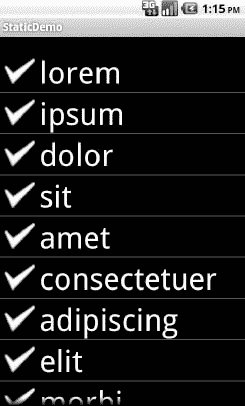
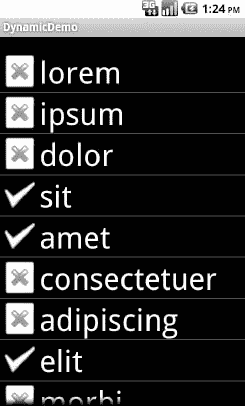
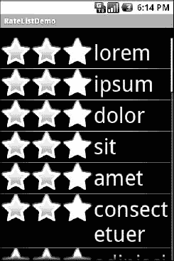
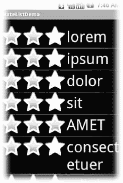

# 十三、喜欢上列表

不起眼的`ListView`是所有安卓系统中最重要的部件之一，因为它被频繁使用。无论是选择要呼叫的联系人、要转发的电子邮件还是要阅读的电子书，`ListView` widgets 被广泛应用于各种活动中。当然，如果它们不仅仅是纯文本就好了。

好消息是，安卓列表可以随心所欲，当然是在移动设备屏幕的限制范围内。然而，让它们变得有趣需要一些工作，需要本章中提到的 Android 的特性。

### 到达一垒

经典的 Android `ListView`是一个简单的文本列表——坚实但缺乏灵感。基本上，我们把一串单词放在一个数组中交给`ListView`，并告诉 Android 使用一个简单的内置布局将这些单词放入一个列表中。

然而，我们可以有一个列表，它的行由图标、图标和文本、复选框和文本或者我们想要的任何东西组成。它仅仅是向适配器提供足够的数据，并帮助适配器为每一行创建一组更丰富的`View`对象。

例如，假设我们想要一个`ListView`，它的条目由一个图标和一些文本组成。我们可以为行构建一个布局，如下所示，在`FancyLists/Static`示例项目的`res/layout/row.xml`中可以找到:

`<?xml version="1.0" encoding="utf-8"?>
<LinearLayout
               xmlns:android="http://schemas.android.com/apk/res/android"
               android:orientation="vertical"
               android:layout_width="fill_parent"
               android:layout_height="fill_parent" >
              <TextView
                             android:id="@+id/selection"
                             android:layout_width="fill_parent"
                             android:layout_height="wrap_content"/>
              <ListView
                             android:id="@android:id/list"
                             android:layout_width="fill_parent"` `                             android:layout_height="fill_parent"
                             android:drawSelectorOnTop="false"
                             />
</LinearLayout>`

这个布局使用一个`LinearLayout`来设置一行，图标在左边，文本(用漂亮的大字体)在右边。

然而，在默认情况下，Android 并不知道我们想要将这种布局用于我们的`ListView`。为了建立连接，我们需要向我们的`Adapter`提供前面显示的定制布局的资源 ID:

`public class StaticDemo extends ListActivity {
  private TextView selection;
  private static final String[] items={"lorem", "ipsum", "dolor",
          "sit", "amet",
          "consectetuer", "adipiscing", "elit", "morbi", "vel",
          "ligula", "vitae", "arcu", "aliquet", "mollis",
          "etiam", "vel", "erat", "placerat", "ante",
          "porttitor", "sodales", "pellentesque", "augue", "purus"};

  @Override
  public void **onCreate**(Bundle icicle) {
    super.**onCreate**(icicle);
    **setContentView**(R.layout.main);
    **setListAdapter**(new ArrayAdapter<String>(this,
                       R.layout.row, R.id.label,
                       items));
    selection=(TextView)**findViewById**(R.id.selection);
  }

  public void **onListItemClick**(ListView parent, View v,
                             int position,  long id) {
   selection**.setText**(items[position]);
  }
}`

这遵循前一个`ListView`样本的一般结构。这里的关键区别是，我们已经告诉`ArrayAdapter`我们想要使用我们的自定义布局(`R.layout.row`)，而单词应该出现的`TextView`在自定义布局中被称为`R.id.label`。

**注意:**记住，要引用一个布局(`row.xml`)，使用`R.layout`作为布局 XML 文件(`R.layout.row`)的基本名称的前缀。

结果是一个左侧带有图标的`ListView`；在这个例子中，所有的图标都是一样的，如图 Figure 13–1 所示。

**图 13–1。***static demo 应用*

### 动态演示

如前一节所示，提供用于行的替代布局的技术非常好地处理了简单的情况。但是，如果我们想让图标根据行数据改变呢？例如，假设我们想对小单词使用一个图标，对大单词使用不同的图标。在`ArrayAdapter`的例子中，我们需要扩展它，创建我们自己的定制子类(例如，`IconicAdapter`)，合并我们的业务逻辑。特别是，它需要超越`getView()`。

`Adapter`的`getView()`方法是`AdapterView`(像`ListView`或`Spinner`)在需要与`Adapter`管理的给定数据相关联的`View`时调用的方法。在使用`ArrayAdapter`的情况下，根据需要为数组中的每个位置调用`getView()`——“为第一行获取`View`，“为第二行获取`View`”，依此类推。

例如，让我们重新编写上一节中的代码以使用`getView()`，这样我们可以为不同的行显示不同的图标——在本例中，一个图标代表短词，一个代表长词(来自`FancyLists/Dynamic`示例项目):

`public class DynamicDemo extends ListActivity {
  TextView selection;
  private static final String[] items={"lorem", "ipsum", "dolor",
          "sit", "amet",
          "consectetuer", "adipiscing", "elit", "morbi", "vel",` `          "ligula", "vitae", "arcu", "aliquet", "mollis",
          "etiam", "vel", "erat", "placerat", "ante",
          "porttitor", "sodales", "pellentesque", "augue", "purus"};

  @Override
  public void **onCreate**(Bundle icicle) {
    super.**onCreate**(icicle);
    **setContentView**(R.layout.main);
    **setListAdapter**(new **IconicAdapter**());
    selection=(TextView)**findViewById**(R.id.selection);
  }

  public void **onListItemClick**(ListView parent, View v,
                             int position, long id) {
   selection**.setText**(items[position]);
  }

  class IconicAdapter extends ArrayAdapter<String> {
    **IconicAdapter**() {
      super(DynamicDemo.this, R.layout.row, R.id.label, items);
    }

    public View **getView**(int position, View convertView,
                       ViewGroup parent) {
      View row=super**.getView**(position, convertView, parent);
      ImageView icon=(ImageView)row**.findViewById**(R.id.icon);

      if (items[position]**.length**()>4) {
        icon**.setImageResource**(R.drawable.delete);
      }
      else {
        icon**.setImageResource**(R.drawable.ok);
      }

      return(row);
    }
  }
}`

我们的`IconicAdapter`——活动的内部类——有两个方法。首先，它有一个构造函数，简单地将我们在`StaticDemo`的`ArrayAdapter`构造函数中使用的相同数据传递给`ArrayAdapter`。第二，它有我们的`getView()`实现，它做两件事:

*   它链接到超类的实现`getView()`，它返回给我们一个由`ArrayAdapter`准备的行`View`的实例。特别是，我们的字已经放入了`TextView`，因为`ArrayAdapter`通常会这样做。
*   它找到我们的`ImageView`，并应用业务规则来设置应该使用哪个图标，引用两个可绘制资源(`R.drawable.ok`和`R.drawable.delete`)中的一个。

我们修改后的示例结果如图图 13–2 所示。

**图 13–2。**??【dynamic demo】应用

### 给我们自己充气

先前版本的`DynamicDemo`应用运行良好。然而，有时`ArrayAdapter`甚至不能用于设置我们行的基础。例如，有可能有一个`ListView`，其中的行实际上是不同的，比如分类标题散布在常规的行中。在这种情况下，我们可能需要自己做所有的工作，从膨胀我们的行开始。我们将在简要介绍通货膨胀之后再做那件事。

#### 关于通货膨胀的补充报道

“膨胀”指的是将 XML 布局规范转换成 XML 表示的实际的`View`对象树的行为。这无疑是一段乏味的代码:获取一个元素，创建一个指定的`View`类的实例，遍历属性，将这些属性转换成属性设置器调用，遍历所有子元素，生成、清洗并重复。

好消息是，Android 团队的优秀人员将所有这些打包成了一个名为`LayoutInflater`的类，我们可以自己使用它。例如，当涉及到漂亮的列表时，我们希望为列表中显示的每一行增加一个`View`,这样我们就可以使用 XML 布局的简便简写来描述这些行应该是什么样子。

例如，让我们看一下`FancyLists/DynamicEx`项目中`DynamicDemo`类的一个稍微不同的实现:

`public class DynamicDemo extends ListActivity {
  TextView selection;
  private static final String[] items={"lorem", "ipsum", "dolor",
          "sit", "amet",
          "consectetuer", "adipiscing", "elit", "morbi", "vel",
          "ligula", "vitae", "arcu", "aliquet", "mollis",
          "etiam", "vel", "erat", "placerat", "ante",
          "porttitor", "sodales", "pellentesque", "augue", "purus"};

  @Override
  public void **onCreate**(Bundle icicle) {
    super.**onCreate**(icicle);
    **setContentView**(R.layout.main);
    **setListAdapter**(new **IconicAdapter**());
    selection=(TextView)**findViewById**(R.id.selection);
  }

  public void **onListItemClick**(ListView parent, View v,
                             int position, long id) {
   selection**.setText**(items[position]);
  }

  class IconicAdapter extends ArrayAdapter<String> {
    **IconicAdapter**() {
      super(DynamicDemo.this, R.layout.row, items);
    }

    public View **getView**(int position, View convertView,
                       ViewGroup parent) {
      LayoutInflater inflater=**getLayoutInflater**();
      View row=inflater**.inflate**(R.layout.row, parent, false);
      TextView label=(TextView)row**.findViewById**(R.id.label);

      label**.setText**(items[position]);

      ImageView icon=(ImageView)row**.findViewById**(R.id.icon);

      if (items[position]**.length**()>4) {
        icon**.setImageResource**(R.drawable.delete);
      }
      else {
        icon**.setImageResource**(R.drawable.ok);
      }

      return(row);
    }
  }
}`

在这里，我们通过使用一个通过`getLayoutInflater()`从我们的`Activity`获得的`LayoutInflater`对象来扩展我们的`R.layout.row`布局。这给了我们一个`View`对象，实际上，它是我们的`LinearLayout`，带有一个`ImageView`和一个`TextView`，正如`R.layout.row` 所指定的。然而，XML 和`LayoutInflater`为我们处理“重担”,而不是必须自己创建所有这些对象并将它们连接在一起。

#### 现在，回到我们的故事

所以我们用`LayoutInflater`给我们一个代表行的`View`。这一行是“空的”，因为静态布局文件不知道实际有什么数据进入这一行。我们的工作是在返回行之前，按照我们认为合适的方式定制和填充行，如下所示:

*   在提供的位置使用单词，为我们的标签小部件填充文本标签
*   查看单词是否超过四个字符，如果是，找到我们的`ImageView`图标小部件，用一个不同的替换股票资源

用户看不到任何不同——我们只是改变了这些行的创建方式。显然，这是一个相当不自然的例子，但是您可以看到这种技术可以用于基于任何类型的标准定制行。

### 更好。更强。更快。

在`FancyLists/DynamicEx`项目中显示的`getView()`实现可以工作，但是效率很低。每当用户滚动时，我们必须创建一堆新的`View`对象来容纳新显示的行。这在开销和感知性能方面都很糟糕。

如果列表看起来很慢，可能会影响用户的即时体验。然而，更有可能的是，由于电池的使用，它会变坏 CPU 的每一点使用都会耗尽电池。垃圾收集器需要做额外的工作来清除我们创建的所有额外的对象，这就更复杂了。所以我们的代码效率越低，手机的电池消耗得越快，用户就越不高兴。我们想要快乐的用户，对吗？

所以，让我们来看看一些技巧，让我们的花哨的`ListView`小部件更有效率。

#### 使用 convertView

按照惯例，`getView()`方法接收一个名为`convertView`的`View`作为其参数之一。有时候，`convertView`会是`null`。在这些情况下，我们需要从头开始创建一个新行`View`(例如，通过膨胀)，就像我们在前面的例子中所做的那样。但是，如果`convertView`不是`null`，那么它其实就是我们之前创建的`View`对象之一！这主要发生在用户滚动`ListView`的时候。随着新行的出现，Android 将尝试回收滚动到列表另一端的行的视图，以使我们不必从头开始重建它们。

假设我们的每一行都有相同的基本结构，我们可以使用`findViewById()`来获取组成我们的行的各个小部件并改变它们的内容，然后从`getView()`返回`convertView`，而不是创建一个全新的行。例如，下面是前面例子中的`getView()`实现，现在通过`convertView`(来自`FancyLists/Recycling`项目)进行了优化:

`public class RecyclingDemo extends ListActivity {
  private TextView selection;
  private static final String[] items={"lorem", "ipsum", "dolor",
          "sit", "amet",
          "consectetuer", "adipiscing", "elit", "morbi", "vel",
          "ligula", "vitae", "arcu", "aliquet", "mollis",
          "etiam", "vel", "erat", "placerat", "ante",
          "porttitor", "sodales", "pellentesque", "augue", "purus"};

  @Override
  public void **onCreate**(Bundle icicle) {
    super.**onCreate**(icicle);
    **setContentView**(R.layout.main);
    **setListAdapter**(new **IconicAdapter**());
    selection=(TextView)**findViewById**(R.id.selection);
  }

  public void **onListItemClick**(ListView parent, View v,
                             int position, long id) {
   selection**.setText**(items[position]);
  }

  class IconicAdapter extends ArrayAdapter<String> {
    **IconicAdapter**() {
      super(RecyclingDemo.this, R.layout.row, items);
    }

    public View **getView**(int position, View convertView,
                       ViewGroup parent) {
      View row=convertView;

      if (row==null) {                        
        LayoutInflater inflater=**getLayoutInflater**();

        row=inflater**.inflate**(R.layout.row, parent, false);
      }

      TextView label=(TextView)row**.findViewById**(R.id.label);

      label**.setText**(items[position]);

      ImageView icon=(ImageView)row**.findViewById**(R.id.icon);

      if (items[position]**.length**()>4) {
        icon**.setImageResource**(R.drawable.delete);
      }
      else {
        icon**.setImageResource**(R.drawable.ok);
      }

      return(row);
    }
  }
}`

在这里，我们检查一下`convertView`是否是`null`。如果是这样，我们膨胀我们的行；否则，我们只是重复使用它。在这两种情况下，填充内容(图标图像和文本)的工作是相同的。好处是我们避免了潜在的昂贵的通货膨胀步骤。事实上，根据谷歌在 2010 年谷歌 I|O 大会上引用的统计数据，使用回收的`ListView`比不使用回收的`ListAdapter`运行速度快 150%。对于复杂的行，这甚至可能低估了好处。

这不仅更快，而且使用的内存也更少。每个小部件或容器——换句话说，`View`的每个子类——保存高达 2kB 的数据，这还不包括`ImageView`小部件中的图像。因此，我们的每一行可能有 6kB 那么大。对于我们的 25 个无意义单词的列表，消耗 150kB 的非循环列表(25 行，每行 6kB)将是低效的，但不是一个大问题。然而，一个包含 1000 个无意义单词的列表会消耗多达 6MB 的内存，这将是一个更大的问题。请记住，您的应用可能只有 16MB 的 Java 堆内存可供使用，特别是当您的目标是资源有限的旧设备时。回收允许我们处理任意长度的列表，只消耗屏幕上可见行所需的`View`内存。

请注意，只有当我们自己创建行时，行回收才是一个问题。如果我们让`ArrayAdapter`通过利用`getView()`的实现来创建行，如`FancyLists/Dynamic`项目所示，那么它处理回收。

#### 使用固定器模式

另一个有点昂贵的操作是调用`findViewById()`。这将深入到我们展开的行中，并根据分配给它们的标识符提取小部件，这样我们就可以定制小部件的内容(例如，更改`TextView`的文本或`ImageView`中的图标)。由于`findViewById()`可以在该行的根`View`的子树中的任何地方找到小部件，这可能需要相当数量的指令来执行，特别是如果我们需要重复找到相同的小部件。

在一些 GUI 工具包中，这个问题是通过让复合的`View`对象(比如行)完全在程序代码中声明(在本例中是 Java)来避免的。然后，访问单个小部件仅仅是调用一个 getter 或访问一个字段的问题。我们当然可以用 Android 做到这一点，但代码变得相当冗长。最好是一种方法，使我们仍然能够使用布局 XML，同时缓存我们的行的关键子部件，这样我们只需要找到它们一次。这就是 holder 模式发挥作用的地方，在一个我们称为`ViewHolder`的类中。

所有的`View`对象都有`getTag()`和`setTag()`方法。这些允许我们将任意对象与小部件相关联。holder 模式使用那个“标签”来保存一个对象，该对象又保存每个感兴趣的子部件。通过将该容器附加到行`View`，每次我们使用该行时，我们已经可以访问我们关心的子部件，而不必再次调用`findViewById()`。

因此，让我们来看看其中一个 holder 类(取自`FancyLists/ViewHolder`示例项目):

`package com.commonsware.android.fancylists.five;

import android.view.View;
import android.widget.ImageView;

class ViewHolder {
  ImageView icon=null;

  **ViewHolder**(View base) {
    this.icon=(ImageView)base**.findViewById**(R.id.icon);
  }
}`

`ViewHolder`持有子部件，通过其构造函数中的`findViewById()`初始化。小部件只是受包保护的数据成员，可以从这个项目中的其他类访问，比如一个`ViewHolderDemo`活动。在这种情况下，我们只持有一个小部件——图标——因为我们将让`ArrayAdapter`为我们处理标签。

使用`ViewHolder`就是每当我们膨胀一行时创建一个实例，并通过`setTag()`将所述实例附加到行`View`，如在`ViewHolderDemo`中找到的`getView()`的重写所示:

`public View **getView**(int position, View convertView,
                    ViewGroup parent) {
  View row=super**.getView**(position, convertView, parent);
  ViewHolder holder=(ViewHolder)row.**getTag**();

  if (holder==null) {
    holder=new **ViewHolder**(row);
    row**.setTag**(holder);
  }

  if (**getModel**(position)**.length**()>4) {
    holder.icon**.setImageResource**(R.drawable.delete);
  }
  else {
    holder.icon**.setImageResource**(R.drawable.ok);
  }

  return(row);
}`

在这里，我们回到让`ArrayAdapter`为我们处理我们的行膨胀和回收。如果对行上的`getTag()`的调用返回`null`，我们知道我们需要创建一个新的`ViewHolder`，然后通过`setTag()`将它附加到行上，供以后重用。然后，访问子部件仅仅是访问容器上的数据成员。第一次显示`ListView`时，所有新行都需要膨胀，我们最终为每个行创建了一个`ViewHolder`。当用户滚动时，行被回收，我们可以重用它们对应的`ViewHolder`小部件缓存。

使用固定器有助于提高性能，但效果并不明显。虽然回收可以让你的性能提高 150%，但增加一个支架可以让性能提高 175%。因此，虽然您可能希望在创建适配器时预先实现回收，但是添加一个容器可能是您以后要处理的事情，当您专门从事性能调优工作时。

在这种特殊情况下，我们当然可以通过跳过`ViewHolder`并直接使用`getTag()`和`setTag()`以及`ImageView`来简化这一切。这个例子是为了演示如何处理一个更复杂的场景，在这个场景中，您可能有几个小部件需要通过 holder 模式进行缓存。

### 交互式行

旁边有漂亮图标的列表都很好。但是，我们可以创建行中包含交互式子部件的`ListView`部件，而不仅仅是像`TextView`和`ImageView`这样的被动部件吗？例如，有一个`RatingBar`小部件，允许用户通过点击一组星形图标来分配评级。我们能不能将`RatingBar`和文本结合起来，让人们滚动一个列表，比如说，歌曲列表，并在列表中对它们进行评分？有好消息也有坏消息。

好消息是，成排的交互式小部件工作得很好。坏消息是这有点棘手，特别是当交互式小部件的状态改变时(例如，在字段中键入一个值)，需要采取行动。我们需要将该状态存储在某个地方，因为当滚动`ListView`时，我们的`RatingBar`小部件将被回收。当`RatingBar`被回收时，我们需要能够基于被查看的实际单词来设置`RatingBar`状态，并且我们需要在它改变时保存状态，以便当这个特定的行被滚动回视图时它可以被恢复。

有趣的是，默认情况下，`RatingBar`完全不知道它代表的是`ArrayAdapter`中的哪一项。毕竟，`RatingBar`只是一个小部件，在一排`ListView`中使用。我们需要告诉行它们当前显示的是`ArrayAdapter`中的哪个项目，这样当它们的`RatingBar`被选中时，它们就知道要修改哪个项目的状态。

因此，让我们使用`FancyLists/RateList`示例项目中的活动来看看这是如何完成的。我们将使用与上一个例子中相同的基本类。我们正在显示一个无意义单词的列表，然后可以对其进行评级。此外，获得最高评级的单词全部大写。

`package com.commonsware.android.fancylists.six;

import android.app.Activity;
import android.os.Bundle;
import android.app.ListActivity;
import android.view.View;
import android.view.ViewGroup;
import android.view.LayoutInflater;
import android.widget.AdapterView;
import android.widget.ArrayAdapter;
import android.widget.RatingBar;
import android.widget.LinearLayout;
import android.widget.ListView;
import android.widget.TextView;
import java.util.ArrayList;`  `public class RateListDemo extends ListActivity {
  private static final String[] items={"lorem", "ipsum", "dolor",
          "sit", "amet",
          "consectetuer", "adipiscing", "elit", "morbi", "vel",
          "ligula", "vitae", "arcu", "aliquet", "mollis",
          "etiam", "vel", "erat", "placerat", "ante",
          "porttitor", "sodales", "pellentesque", "augue", "purus"};

  @Override
  public void **onCreate**(Bundle icicle) {
    super.**onCreate**(icicle);

    ArrayList<RowModel> list=new ArrayList<RowModel>();

    for (String s : items) {
      list.**add**(new **RowModel**(s));
    }

    **setListAdapter**(new **RatingAdapter**(list));
  }

  private RowModel **getModel**(int position) {
    return(((RatingAdapter)**getListAdapter**()).**getItem**(position));
  }

  class RatingAdapter extends ArrayAdapter<RowModel> {
    **RatingAdapter**(ArrayList<RowModel> list) {
      super(RateListDemo.this, R.layout.row, R.id.label, list);
    }

    public View **getView**(int position, View convertView,
                       ViewGroup parent) {
      View row=super.**getView**(position, convertView, parent);
      ViewHolder holder=(ViewHolder)row.**getTag**();

      if (holder==null) {
        holder=new **ViewHolder**(row);
        row.**setTag**(holder);

        RatingBar.OnRatingBarChangeListener l=
                    new RatingBar.**OnRatingBarChangeListener**() {
          public void **onRatingChanged**(RatingBar ratingBar,
                                       float rating,
                                       boolean fromTouch)  {
            Integer myPosition=(Integer)ratingBar.**getTag**();
            RowModel model=**getModel**(myPosition);

            model.rating=rating;

            LinearLayout parent=(LinearLayout)ratingBar.**getParent**();
            TextView label=(TextView)parent.**findViewById**(R.id.label);

            label.**setText**(model.**toString**());
          }
        };`  `holder.rate.**setOnRatingBarChangeListener**(l);
      }

      RowModel model=**getModel**(position);

      holder.rate.**setTag**(new **Integer**(position));
      holder.rate.**setRating**(model.rating);

      return(row);
    }
  }

  class RowModel {
    String label;
    float rating=2.0f;

    **RowModel**(String label) {
      this.label=label;
    }

    public String **toString**() {
      if (rating>=3.0) {
        return(label.**toUpperCase**());
      }

      return(label);
    }
  }
}`

以下列表解释了本活动和`getView()`实施与之前的不同之处:

*   我们仍然使用`String` []项作为无意义单词的列表，但是我们没有将那个`String`数组直接注入一个`ArrayAdapter`，而是将它转化为一个`RowModel`对象的列表。`RowModel`是可变模型:它保存无意义单词和当前选中状态。在真实的系统中，这些可能是从数据库中填充的对象，并且这些属性将具有更多的业务意义。
*   我们更新了效用方法，比如`onListItemClick()`，以反映从纯`String`模型到使用`RowModel`的变化。
*   在`getView()`中的`ArrayAdapter`子类(`RatingAdapter`，让`ArrayAdapter`膨胀并回收行，然后检查行的标签中是否有`ViewHolder`。如果没有，我们创建一个新的`ViewHolder`并将它与该行相关联。对于该行的`RatingBar`，我们添加了一个匿名的`onRatingChanged()`监听器，它查看该行的标签(`getTag()`)并将其转换成一个`Integer`，表示该行在`ArrayAdapter`中显示的位置。使用它，评级栏可以获得该行的实际`RowModel`,并根据评级栏的新状态更新模型。选中时，它还会更新与`RatingBar`相邻的文本，以匹配评级栏状态。
*   我们总是确保`RatingBar`有正确的内容，并且有一个标签(通过`setTag()`)指向适配器中行显示的位置。

行布局很简单，一个`LinearLayout`里面就一个`RatingBar`和一个`TextView`:

`<?xml version="1.0" encoding="utf-8"?>
<LinearLayout xmlns:android="http://schemas.android.com/apk/res/android"
  android:layout_width="fill_parent"
  android:layout_height="wrap_content"
  android:orientation="horizontal"
>
  <RatingBar
    android:id="@+id/rate"
    android:layout_width="wrap_content"
    android:layout_height="wrap_content"
    android:numStars="3"
    android:stepSize="1"
    android:rating="2" />
  <TextView
    android:id="@+id/label"
    android:padding="2dip"
    android:textSize="18sp"
    android:layout_gravity="left|center_vertical"
    android:layout_width="fill_parent"
    android:layout_height="wrap_content"/>
</LinearLayout>`

`ViewHolder`同样简单，只是从行`View`中提取出`RatingBar`用于缓存:

`package com.commonsware.android.fancylists.six;

import android.view.View;
import android.widget.RatingBar;

class ViewHolder {
  RatingBar rate=null;

  **ViewHolder**(View base) {
    this.rate=(RatingBar)base.**findViewById**(R.id.rate);
  }
}`

从视觉上看，结果就是你所期望的，如图 Figure 13–3 所示。

**图 13–3。***RateListDemo 应用，如同最初启动的*

Figure 13–4 显示了一个切换的分级栏，它将单词全部转换成大写字母。

**图 13–4。** *同一个应用，显示一个置顶词*