# 十四、更多的小部件和容器

到目前为止，这本书已经介绍了许多小部件和容器。本章是最后一章，专门讨论小部件和容器，涵盖了许多流行的选项，从日期和时间小部件到选项卡。后续章节偶尔会介绍新的小部件，但是是在一些其他主题的背景下，比如在第二十章中介绍`ProgressBar`(涵盖线程)。

### 挑选

对于像手机这样输入受限的设备，拥有能够感知用户应该输入的内容类型的小工具和对话框是非常有帮助的。它们最大限度地减少了击键和屏幕点击，并减少了用户犯某种错误的机会(例如，在只需要数字的地方输入字母)。

如第九章中的所示，`EditText`具有输入数字和文本的内容感知功能。Android 还支持小工具(`DatePicker`和`TimePicker`)和对话框(`DatePickerDialog`和`TimePickerDialog`)来帮助用户输入日期和时间。

`DatePicker`和`DatePickerDialog`允许您设置选择的开始日期，以年、月和月中的某一天值的形式。请注意，月份是从一月的`0`到十二月的`11`。最重要的是，`DatePicker`和`DatePickerDialog`都允许您提供一个回调对象(`OnDateChangedListener`或`OnDateSetListener`)，以便在用户选择了新日期时通知您。由您决定是否将该日期存储在某个地方，尤其是在使用对话框的情况下，因为您没有其他方法可以在以后访问所选择的日期。

类似地，`TimePicker`和`TimePickerDialog`让您执行以下操作:

*   设置用户可以调整的初始时间，以小时(`0`到`23`)和分钟(`0`到`59`)的形式
*   指出选择应该是 12 小时模式(带 AM/PM 切换)还是 24 小时模式(在美国被认为是“军事时间”，在世界其他地方被认为是“正常时间”)
*   提供一个回调对象(`OnTimeChangedListener`或`OnTimeSetListener`)，当用户选择了一个新的时间时，它会被通知，以小时和分钟的形式提供给你

作为使用日期和时间选取器的一个例子，来自`Fancy/Chrono`示例项目，这里有一个包含一个标签和两个按钮的简单布局，它将弹出日期和时间选取器风格的对话框:

`<?xml version="1.0" encoding="utf-8"?>
<LinearLayout
  xmlns:android="http://schemas.android.com/apk/res/android"
  android:orientation="vertical"
  android:layout_width="fill_parent"
  android:layout_height="fill_parent"
  >
  <TextView android:id="@+id/dateAndTime"  
    android:layout_width="fill_parent"
    android:layout_height="wrap_content"
    />
  <Button android:id="@+id/dateBtn"  
    android:layout_width="fill_parent"
    android:layout_height="wrap_content"
    android:text="Set the Date"
    android:onClick="chooseDate"
    />
  <Button android:id="@+id/timeBtn"  
    android:layout_width="fill_parent"
    android:layout_height="wrap_content"
    android:text="Set the Time"
    android:onClick="chooseTime"
    />
</LinearLayout>`

更有趣的东西来自 Java 源代码:

`package com.commonsware.android.chrono;

import android.app.Activity;
import android.os.Bundle;
import android.app.DatePickerDialog;
import android.app.TimePickerDialog;
import android.view.View;
import android.widget.DatePicker;
import android.widget.TimePicker;
import android.widget.TextView;
import java.text.DateFormat;
import java.util.Calendar;

public class ChronoDemo extends Activity {
  DateFormat fmtDateAndTime=DateFormat.**getDateTimeInstance**();
  TextView dateAndTimeLabel;
  Calendar dateAndTime=Calendar.**getInstance**();`  `@Override
  public void **onCreate**(Bundle icicle) {
    super.**onCreate**(icicle);
    **setContentView**(R.layout.main);

    dateAndTimeLabel=(TextView)**findViewById**(R.id.dateAndTime);

    **updateLabel**();
  }

  public void **chooseDate**(View v) {
    new **DatePickerDialog**(ChronoDemo.this, d,
                         dateAndTime.**get**(Calendar.YEAR),
                         dateAndTime.**get**(Calendar.MONTH),
                         dateAndTime.**get**(Calendar.DAY_OF_MONTH))
      .**show**();
  }

  public void **chooseTime**(View v) {
    new **TimePickerDialog**(ChronoDemo.this, t,
                         dateAndTime.**get**(Calendar.HOUR_OF_DAY),
                         dateAndTime.**get**(Calendar.MINUTE),
                         true)
      .**show**();
  }

  private void **updateLabel**() {
    dateAndTimeLabel.**setText**(fmtDateAndTime
                             .**format**(dateAndTime.**getTime**()));
  }

  DatePickerDialog.OnDateSetListener d=new DatePickerDialog.**OnDateSetListener**() {
    public void **onDateSet**(DatePicker view, int year, int monthOfYear,
                         int dayOfMonth) {
      dateAndTime.**set**(Calendar.YEAR, year);
      dateAndTime.**set**(Calendar.MONTH, monthOfYear);
      dateAndTime.**set**(Calendar.DAY_OF_MONTH, dayOfMonth);
      **updateLabel**();
    }
  };

  TimePickerDialog.OnTimeSetListener t=new TimePickerDialog.**OnTimeSetListener**() {
    public void **onTimeSet**(TimePicker view, int hourOfDay,
                         int minute) {
      dateAndTime.**set**(Calendar.HOUR_OF_DAY, hourOfDay);
      dateAndTime.**set**(Calendar.MINUTE, minute);
      **updateLabel**();
    }
  };
}`

这个活动的模型只是一个`Calendar`实例，最初设置为当前日期和时间。我们通过一个`DateFormat`格式化程序将其注入视图。在`updateLabel()`方法中，我们获取当前的`Calendar`，对其进行格式化，并将其放入`TextView`。

每个按钮都有一个对应的方法，当用户点击它时会得到控制(`chooseDate()`和`chooseTime()`)。点击按钮时，会显示`DatePickerDialog`或`TimePickerDialog`。对于`DatePickerDialog`，我们给它一个`OnDateSetListener`回调，用新的日期(年、月、日)更新`Calendar`。我们还给对话框最后选择的日期，从`Calendar`中获取值。在`TimePickerDialog`的情况下，它得到一个`OnTimeSetListener`回调来更新`Calendar`的时间部分、最后选择的时间和一个值`true`，该值指示我们想要时间选择器上的 24 小时模式。

将所有这些连接在一起，最终的活动如图 14–1、14–2 和 14–3 所示。

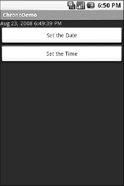

**图 14–1。***chrono demo 示例应用，最初启动时*

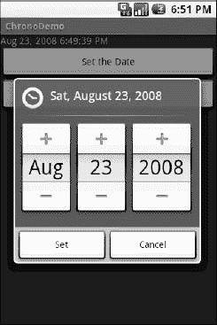

**图 14–2。** *同样的应用，显示日期选择器对话框*

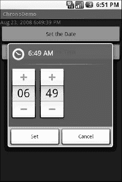

**图 14–3。** *同样的应用，显示时间选择器对话框*

### 时间像河流一样不停地流淌

如果您想显示时间，而不是让用户输入时间，您可能希望使用`DigitalClock`小部件或`AnalogClock`小部件。这些小部件非常容易使用，因为它们会随着时间的推移自动更新。你所需要做的就是把它们放到你的布局中，让它们做自己的事情。

例如，在`Fancy/Clocks`示例应用中，有一个包含`DigitalClock`和`AnalogClock`的 XML 布局:

`<?xml version="1.0" encoding="utf-8"?>
<RelativeLayout xmlns:android="http://schemas.android.com/apk/res/android"
  android:layout_width="fill_parent"
  android:layout_height="fill_parent"
  >
  <AnalogClock android:id="@+id/analog"
    android:layout_width="fill_parent"
    android:layout_height="wrap_content"
    android:layout_centerHorizontal="true"
    android:layout_alignParentTop="true"
    />
  <DigitalClock android:id="@+id/digital"
    android:layout_width="wrap_content"
    android:layout_height="wrap_content"
    android:layout_centerHorizontal="true"
    android:layout_below="@id/analog"
    />
</RelativeLayout>`

除了生成的存根之外，没有任何 Java 代码，我们可以构建这个项目并获得如图 Figure 14–4 所示的活动。

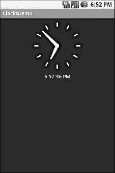

**图 14–4。***clocks demo 示例应用*

如果你正在寻找更多的计时器，`Chronometer`可能会感兴趣。使用`Chronometer`，您可以从一个起点开始跟踪经过的时间，如图 14–5 中的示例所示。您只需告诉它何时执行`start()`和`stop()`，并可能覆盖显示文本的格式字符串。

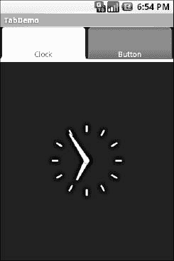

**图 14–5。** *来自 Android SDK 的 Views/Chronometer API 演示*

### 求解析

`SeekBar`是一个输入小部件，允许用户从一系列可能的值中选择一个值。图 14–6 显示了一个例子。

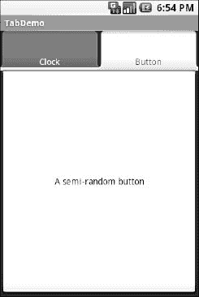

**图 14–6。** *来自 Android SDK 的 Views/SeekBar API 演示*

用户可以拖动拇指或单击拇指的任一侧来重新定位它。然后拇指指向一个范围内的特定值。这个范围将会是`0`到某个最大值，默认情况下是`100`，你可以通过调用`setMax()`来控制它。你可以通过`getProgress()`找到当前位置，或者通过`setOnSeekBarChangeListener()`注册一个监听器找到用户何时改变了拇指的位置。

我们在第十三章的中看到了这个主题的一个变化。

### 记在我的账上

一般的 Android 哲学是保持活动简短和甜蜜。如果有更多的信息超出了一个屏幕的合理容纳范围，尽管可能需要滚动，那么它可能属于通过`Intent`开始的另一个活动，正如将在第二十二章中描述的。然而，这可能是复杂的设置。此外，有时确实需要收集大量信息，以作为原子操作进行处理。

在传统的 UI 中，您可能会使用选项卡来收集和显示信息，例如 Java/Swing 中的`JTabbedPane`。在 Android 中，你现在可以选择以同样的方式使用一个`TabHost` 容器。活动屏幕的一部分被标签占据，当点击标签时，会换出视图的一部分并用其他内容替换。例如，您可能有一个活动，其中一个选项卡用于输入位置，另一个选项卡用于显示该位置的地图。

一些 GUI 工具包称“标签”为用户点击从一个视图切换到另一个视图的东西。其他 GUI 工具包将“选项卡”称为可点击的按钮状元素和选择该元素时出现的内容的组合。Android 将选项卡按钮和内容视为离散的实体，因此在本节中它们被称为“选项卡按钮”和“选项卡内容”。

#### 片段

您可以使用以下小部件和容器来设置视图的选项卡部分:

*   `TabHost`:标签按钮和标签内容的总体容器。
*   `TabWidget`:实现标签按钮行，包含文本标签和图标(可选)。
*   `FrameLayout`:标签内容的容器。每个选项卡内容都是`FrameLayout`的子级。

这类似于 Mozilla 的 XUL 采取的方法。在 XUL 的例子中，`tabbox`元素对应安卓的`TabHost`,`tabs`元素对应`TabWidget`,`tabpanels`对应`FrameLayout`。

例如，下面是一个选项卡式活动的布局定义，来自`Fancy/Tab`:

`<?xml version="1.0" encoding="utf-8"?>
<TabHost xmlns:android="http://schemas.android.com/apk/res/android"
  android:id="@+id/tabhost"
  android:layout_width="fill_parent"
  android:layout_height="fill_parent">
  <LinearLayout
    android:orientation="vertical"
    android:layout_width="fill_parent"
    android:layout_height="fill_parent">
    <TabWidget android:id="@android:id/tabs"
      android:layout_width="fill_parent"
      android:layout_height="wrap_content"
    />
    <FrameLayout android:id="@android:id/tabcontent"
      android:layout_width="fill_parent"
      android:layout_height="fill_parent">
      <AnalogClock android:id="@+id/tab1"
        android:layout_width="fill_parent"
        android:layout_height="fill_parent"
      />
      <Button android:id="@+id/tab2"
        android:layout_width="fill_parent"
        android:layout_height="fill_parent"
        android:text="A semi-random button"` `      />
    </FrameLayout>
  </LinearLayout>
</TabHost>`

注意，`TabWidget`和`FrameLayout`是`TabHost`的间接子节点，`FrameLayout`本身有代表不同选项卡的子节点。在本例中，有两个选项卡:一个时钟和一个按钮。在一个更复杂的场景中，选项卡可以是某种形式的容器(例如，`LinearLayout`)，有自己的内容。

#### 将它们连接在一起

您可以将这些小部件放在常规的`Activity`或`TabActivity`中。`TabActivity`和`ListActivity`一样，将一个通用的 UI 模式(一个完全由选项卡组成的活动)包装成一个模式感知的活动子类。如果你想使用`TabActivity`，你必须给`TabHost`一个`@android:id/tabhost`的`android:id`。相反，如果您不希望使用`TabActivity`，您需要通过`findViewById()`获得`TabHost`，然后在进行其他操作之前，在`TabHost`上调用`setup()`。

其余的 Java 代码需要告诉`TabHost`哪些视图代表了选项卡内容，以及选项卡按钮应该是什么样子。这些都被包装在`TabSpec`对象中。您通过`newTabSpec()`从主机获得一个`TabSpec`实例，填充它，然后按照正确的顺序将其添加到主机。

`TabSpec`有两个关键方法:

*   `setContent()`:表示该标签页的标签内容，通常是选择该标签页时希望显示的视图的`android:id`
*   `setIndicator()`:设置标签按钮的标题，在这种方法的某些风格中，提供一个`Drawable`来表示标签的图标

请注意，如果您需要比简单的标签和可选图标更多的控制，选项卡“指示器”实际上可以是它们自己的视图。

还要注意，在配置任何这些`TabSpec`对象之前，您必须调用`TabHost`上的`setup()`。如果您的活动使用的是`TabActivity`基类，那么就不需要调用`setup()`。

例如，下面是将前面布局示例中的选项卡连接在一起的 Java 代码:

`package com.commonsware.android.fancy;

import android.app.Activity;
import android.os.Bundle;
import android.widget.TabHost;

public class TabDemo extends Activity {
  @Override
  public void **onCreate**(Bundle icicle) {
    super.**onCreate**(icicle);
    **setContentView**(R.layout.main);`  `TabHost tabs=(TabHost)**findViewById**(R.id.tabhost);

    tabs.**setup**();

    TabHost.TabSpec spec=tabs.**newTabSpec**("tag1");

    spec.**setContent**(R.id.tab1);
    spec.**setIndicator**("Clock");
    tabs.**addTab**(spec);

    spec=tabs.**newTabSpec**("tag2");
    spec.**setContent**(R.id.tab2);
    spec.**setIndicator**("Button");
    tabs.**addTab**(spec);
  }
}`

我们通过熟悉的`findViewById()`方法找到我们的`TabHost`，然后通过`setup()`设置它。之后，我们通过`newTabSpec()`得到一个`TabSpec`，提供一个标签，这个标签的目的现在还不知道。给定规范，我们调用`setContent()`和`setIndicator()`，然后调用`TabHost`上的`addTab()`来注册标签为可用。最后，我们可以通过`setCurrentTab()`选择显示哪个选项卡，提供基于`0`的选项卡索引。

结果如图图 14–7 和图 14–8 所示。

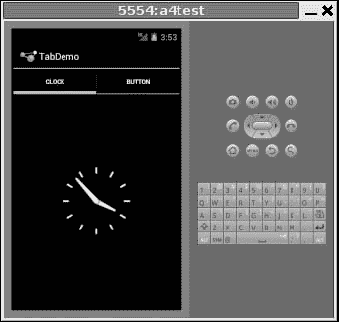

**图 14–7。***tab demo 示例应用，显示第一个选项卡*

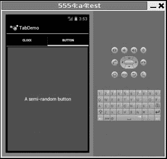

**图 14–8。** *同样的应用，显示第二个标签页*

请注意，如果您的应用运行在较旧的 SDK 级别下，在 Honeycomb 和 Ice Cream Sandwich 发布之前，那么您的菜单将以老式的“按钮”样式出现，如图 Figure 14–9 所示。通过在您的`AndroidManifest.xml`中指定`android:targetSdkVersion`和`android:minSdkVersion`，您可以控制是使用旧行为还是新行为。第二十九章有一个有用的 SDK 版本列表。

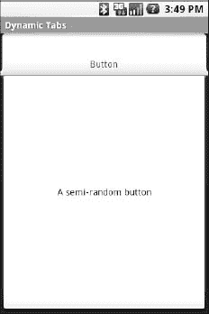

**图 14–9。***tab demo 示例应用，显示了第一个带有旧式 UI 的选项卡*

#### 相加

`TabWidget`的设置是为了让你在编译时轻松定义制表符。但是，有时您可能希望在运行时向活动添加选项卡。例如，设想一个电子邮件客户端，它在自己的选项卡中打开每个单独的电子邮件，以便在邮件之间轻松切换。在这种情况下，直到运行时，当用户选择打开一条消息时，您才知道需要多少选项卡或者它们的内容是什么。幸运的是，Android 还支持在运行时动态添加标签。

在运行时动态添加选项卡的工作方式与前面描述的编译时选项卡非常相似，只是您使用了另一种风格的`setContent()`，它采用了一个`TabHost.TabContentFactory`实例。这只是一个将被调用的回调。您提供了一个`createTabContent()`的实现，并使用它来构建和返回成为选项卡内容的`View`。

我们来看一个例子(`Fancy/DynamicTab`)。首先，下面是一个活动的布局 XML，它设置了选项卡并定义了一个选项卡，包含一个按钮:

`<?xml version="1.0" encoding="utf-8"?>
<TabHost xmlns:android="http://schemas.android.com/apk/res/android"
  android:id="@+id/tabhost"
  android:layout_width="fill_parent"
  android:layout_height="fill_parent">
  <LinearLayout
    android:orientation="vertical"
    android:layout_width="fill_parent"
    android:layout_height="fill_parent">
    <TabWidget android:id="@android:id/tabs"
      android:layout_width="fill_parent"
      android:layout_height="wrap_content"
    />
    <FrameLayout android:id="@android:id/tabcontent"
      android:layout_width="fill_parent"
      android:layout_height="fill_parent">
      <Button android:id="@+id/buttontab"
        android:layout_width="fill_parent"
        android:layout_height="fill_parent"
        android:text="A semi-random button"
        android:onClick="addTab"
      />
    </FrameLayout>
  </LinearLayout>
</TabHost>`

每当单击按钮时，我们都希望添加新的选项卡，这可以通过下面的代码来实现:

`package com.commonsware.android.dynamictab;

import android.app.Activity;
import android.os.Bundle;
import android.view.View;
import android.widget.AnalogClock;
import android.widget.TabHost;`  `public class DynamicTabDemo extends Activity {
  private TabHost tabs=null;

  @Override
  public void **onCreate**(Bundle icicle) {
    super.**onCreate**(icicle);
    **setContentView**(R.layout.main);

    tabs=(TabHost)**findViewById**(R.id.tabhost);
    tabs.**setup**();

    TabHost.TabSpec spec=tabs.**newTabSpec**("buttontab");

    spec.**setContent**(R.id.buttontab);
    spec.**setIndicator**("Button");
    tabs.**addTab**(spec);
  }

  public void **addTab**(View v) {
    TabHost.TabSpec spec=tabs.**newTabSpec**("tag1");

    spec.**setContent**(new TabHost.**TabContentFactory**() {
      public View **createTabContent**(String tag) {
        return(new **AnalogClock**(DynamicTabDemo.this));
      }
    });

    spec.**setIndicator**("Clock");
    tabs.**addTab**(spec);
  }
}`

在我们的按钮的`addTab()`回调中，我们创建了一个`TabHost.TabSpec`对象，并给它一个匿名的`TabHost.TabContentFactory`。工厂依次返回用于选项卡的`View`——在本例中，只是一个`AnalogClock`。构建选项卡的`View`的逻辑可以更加复杂，比如使用`LayoutInflater`从布局 XML 构建一个视图。

最初，当活动启动时，我们只有一个选项卡，如图 Figure 14–10 所示。图 14–11 显示了三个动态创建的选项卡。

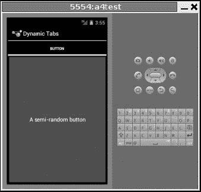

**图 14–10。**??【dynamic tab】应用，带单个初始标签

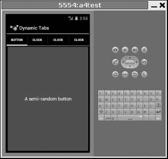

**图 14–11。***dynamic tab 应用，有三个动态创建的选项卡*

表格处理是真正动态的，适应你的屏幕大小。Android 将表格格式化，以适应平板电脑甚至电视等更大尺寸的屏幕。图 14–12 在一个更大的平板电脑大小的屏幕上显示了四个动态创建的选项卡。

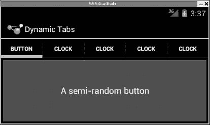

**图 14–12。***dynamic tab 应用，在平板电脑大小的屏幕上展示适应性*

### 把它们翻过来

有时，您想要选项卡的整体效果(一次只有一些`View`可见)，而不是选项卡的实际 UI 实现。也许标签占据了太多的屏幕空间。也许你想根据一个手势或一个设备摇动来切换视角。或者你只是喜欢与众不同。Android 4.0 冰淇淋三明治提供了在空间允许的情况下，将标签“推”到动作栏的空白空间的能力，例如当你旋转到横向时，但这并不能满足你可能会有的疯狂的“摇晃、拨浪鼓和滚动”想法。

好消息是选项卡的视图翻转逻辑的核心可以在`ViewFlipper`容器中找到，它可以以传统选项卡之外的其他方式使用。

`ViewFlipper`继承自`FrameLayout`，就像我们用它来描述`TabWidget`的内部一样。然而，最初，`ViewFlipper`只是显示第一个子视图。您可以通过用户交互手动或通过计时器自动安排视图的翻转。

例如，下面是一个使用`Button`和`ViewFlipper`的简单活动(`Fancy/Flipper1`)的布局:

`<?xml version="1.0" encoding="utf-8"?>
<LinearLayout xmlns:android="http://schemas.android.com/apk/res/android"
    android:orientation="vertical"
    android:layout_width="fill_parent"
    android:layout_height="fill_parent"
    >
  <Button android:id="@+id/flip_me"  
      android:layout_width="fill_parent"
      android:layout_height="wrap_content"
      android:text="Flip Me!"
      android:onClick="flip"
      />
  <ViewFlipper android:id="@+id/details"
    android:layout_width="fill_parent"` `    android:layout_height="fill_parent"
    >
    <TextView
      android:layout_width="fill_parent"
      android:layout_height="wrap_content"
      android:textStyle="bold"
      android:textColor="#FF00FF00"
      android:text="This is the first panel"
    />
    <TextView
      android:layout_width="fill_parent"
      android:layout_height="wrap_content"
      android:textStyle="bold"
      android:textColor="#FFFF0000"
      android:text="This is the second panel"
    />
    <TextView
      android:layout_width="fill_parent"
      android:layout_height="wrap_content"
      android:textStyle="bold"
      android:textColor="#FFFFFF00"
      android:text="This is the third panel"
    />
  </ViewFlipper>
</LinearLayout>`

注意，布局为`ViewFlipper`定义了三个子视图，每个视图都是一条简单的消息。当然，如果你愿意，你可以有非常复杂的孩子视图。

要手动翻转视图，我们需要挂入`Button`并在点击按钮时自己翻转它们:

`package com.commonsware.android.flipper1;

import android.app.Activity;
import android.os.Bundle;
import android.view.View;
import android.widget.ViewFlipper;

public class FlipperDemo extends Activity {
  ViewFlipper flipper;

  @Override
  public void **onCreate**(Bundle icicle) {
    super.**onCreate**(icicle);
    **setContentView**(R.layout.main);

    flipper=(ViewFlipper)**findViewById**(R.id.details);
  }

  public void **flip**(View v) {
    flipper.**showNext**();
  }
}`

这只是在`ViewFlipper`上调用`showNext()`的问题，就像在任何`ViewAnimator`类上一样。结果是一个简单的活动:单击按钮，显示序列中的下一个`TextView`，在查看完最后一个后返回到第一个，如图图 14–13 和 14–14 所示。

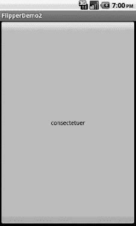

**图 14–13。***flipper demo 应用，显示第一个面板*

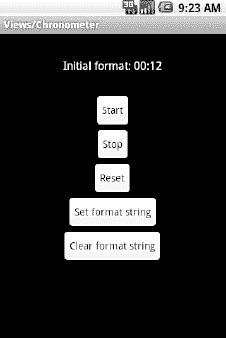

**图 14–14。** *同样的应用，切换到第二个面板后*

当然，这可以通过使用一个`TextView`并在每次点击时改变文本和颜色来更简单地处理。然而，您可以想象一下，`ViewFlipper`的内容可能更复杂，比如您可能放入`TabView`的内容。

与`TabWidget`一样，有时在编译时可能不知道`ViewFlipper`的内容。和`TabWidget`一样，你可以轻松地随时添加新内容。

例如，让我们看看另一个示例活动(`Fancy/Flipper2`)，使用以下布局:

`<?xml version="1.0" encoding="utf-8"?>
<LinearLayout xmlns:android="http://schemas.android.com/apk/res/android"
    android:orientation="vertical"
    android:layout_width="fill_parent"
    android:layout_height="fill_parent"
    >
  <ViewFlipper android:id="@+id/details"
    android:layout_width="fill_parent"
    android:layout_height="fill_parent"
    >
  </ViewFlipper>
</LinearLayout>`

注意,`ViewFlipper`在编译时没有内容。还要注意，没有用于在内容之间翻转的`Button`——稍后会详细介绍。

对于`ViewFlipper`内容，我们将创建大的`Button`小部件，每个小部件包含本书许多章节中使用的一个随机单词。并且，我们将设置`ViewFlipper`在`Button`部件之间自动旋转。

`package com.commonsware.android.flipper2;

import android.app.Activity;
import android.os.Bundle;
import android.view.View;
import android.view.ViewGroup;
import android.widget.Button;
import android.widget.ViewFlipper;

public class FlipperDemo2 extends Activity {
  static String[] items={"lorem", "ipsum", "dolor", "sit", "amet",
                         "consectetuer", "adipiscing", "elit",
                         "morbi", "vel", "ligula", "vitae",
                         "arcu", "aliquet", "mollis", "etiam",
                         "vel", "erat", "placerat", "ante",
                         "porttitor", "sodales", "pellentesque",
                         "augue", "purus"};
  ViewFlipper flipper;

  @Override
  public void **onCreate**(Bundle icicle) {
    super.**onCreate**(icicle);
    **setContentView**(R.layout.main);

    flipper=(ViewFlipper)**findViewById**(R.id.details);

    for (String item : items) {` `      Button btn=new **Button**(this);

      btn.**setText**(item);

      flipper.**addView**(btn,
                     new ViewGroup.**LayoutParams**(
                             ViewGroup.LayoutParams.FILL_PARENT,
                             ViewGroup.LayoutParams.FILL_PARENT));
    }

    flipper.**setFlipInterval**(2000);
    flipper.**startFlipping**();
  }
}`

在迭代完时髦的单词后，将每个单词变成一个`Button`，并将`Button`添加为`ViewFlipper`的子单词，我们设置 flipper 在子单词(`flipper.setFlipInterval(2000);`)之间自动翻转，并开始翻转(`flipper.startFlipping(    `)。

结果是一系列无止境的按钮，每个按钮都会出现，如图图 14–15 所示，然后在 2 秒钟后被下一个按钮依次替换，在最后一个按钮出现后返回到第一个按钮。

**图 14–15。***flipper demo 2 应用*

自动滑动`ViewFlipper`对于状态面板或其他有大量信息要显示但没有足够空间显示的情况很有用。然而，由于它自动在视图之间切换，期望用户与单个视图交互是冒险的，因为视图可能会在交互过程中中途切换。

### 进入某人的抽屉

很长一段时间以来，Android 开发人员渴望有一个滑动抽屉容器，像主屏幕上那样工作，包含启动应用的图标。官方实现在开源代码中，但不是 SDK 的一部分，直到 Android 1.5，开发者发布了`SlidingDrawer`供其他人使用。

与大多数其他 Android 容器不同，`SlidingDrawer`可以移动，从关闭位置切换到打开位置。这就对哪个容器可以容纳`SlidingDrawer`提出了一些限制。它需要放在一个容器中，允许多个小部件相互叠加。`RelativeLayout`和`FrameLayout`满足这个要求。`FrameLayout`是一个纯粹的容器，用来堆叠小部件。另一方面，`LinearLayout`不允许小部件堆叠(它们在一行或一列中一个接一个地落下)，所以你不应该将`SlidingDrawer`作为`LinearLayout`的直接子元素。

这里是一个布局，显示了来自`Fancy/DrawerDemo`项目的`FrameLayout`中的`SlidingDrawer`:

`<?xml version="1.0" encoding="utf-8"?>
<FrameLayout xmlns:android="http://schemas.android.com/apk/res/android"
    android:layout_width="fill_parent"
    android:layout_height="fill_parent"
    android:background="#FF4444CC"
    >
  <SlidingDrawer
    android:id="@+id/drawer"
    android:layout_width="fill_parent"
    android:layout_height="fill_parent"
    android:handle="@+id/handle"
    android:content="@+id/content">
    <ImageView
      android:id="@id/handle"
      android:layout_width="wrap_content"
      android:layout_height="wrap_content"
      android:src="@drawable/tray_handle_normal"
    />
    <Button
      android:id="@id/content"
      android:layout_width="fill_parent"
      android:layout_height="fill_parent"
      android:text="I'm in here!"
    />
  </SlidingDrawer>
</FrameLayout>`

`SlidingDrawer`应该包含两件事:

*   一个句柄，通常是一个`ImageView`或类似的东西，比如这里使用的，来自 Android 开源项目
*   抽屉本身的内容，通常是某种容器，但在本例中是一个`Button`

此外，`SlidingDrawer`需要知道句柄和内容的`android:id`值，分别通过`android:handle`和`android:content`属性。这些告诉抽屉如何在滑动打开和关闭时显示动画。

图 14–16 显示了`SlidingDrawer`关闭时的样子，使用提供的手柄，图 14–17 显示了打开时的样子。

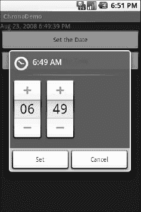

**图 14–16。** *抽屉滑动，关闭*

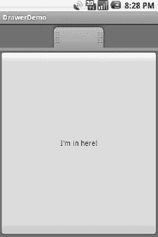

**图 14–17。** *一个滑动抽屉，打开*

正如您所料，您可以通过 Java 代码以及用户触摸事件来打开和关闭抽屉。然而，你有两组这样的方法:一组是即时发生的(`open()`、`close()`和`toggle()`)，另一组是使用动画的(`animateOpen()`、`animateClose()`和`animateToggle()`)。你也可以`lock()`和`unlock()`抽屉；锁定时，抽屉不会响应触摸事件。

如果愿意，您还可以注册三种类型的回调:

*   抽屉打开时要调用的侦听器
*   抽屉关闭时要调用的侦听器
*   当抽屉“滚动”(即用户拖动或投掷手柄)时调用的侦听器

例如，Android launcher 的`SlidingDrawer`将手柄上的图标从打开切换到关闭再切换到“删除”(如果你长按桌面上的某个东西)。它实现这一点，部分是通过像这样的回调。

`SlidingDrawer`可以是垂直的也可以是水平的。不过，请注意，不管屏幕方向如何，它都会保持自己的方向。换句话说，如果你旋转运行`DrawerDemo`的 Android 设备或模拟器，抽屉总是从底部打开——它并不总是“粘”在它打开的原始一侧。这意味着如果你希望抽屉总是从同一边打开，就像启动器一样，你将需要单独的纵向和横向布局，这是在第二十三章中讨论的话题。

### 其他好东西

Android 提供`AbsoluteLayout`，内容根据具体坐标位置进行布局。你告诉`AbsoluteLayout`在精确的 x 和 y 坐标上把一个孩子放在哪里，Android 就放在那里，不问任何问题。从好的方面来说，这给了你精确的定位。不利的一面是，这意味着您的视图只能在特定尺寸的屏幕上看起来合适，或者您需要编写一堆代码来根据屏幕大小调整坐标。由于 Android 屏幕可能会有各种尺寸，新尺寸会定期出现，使用`AbsoluteLayout`可能会变得相当烦人。另外，请注意`AbsoluteLayout`已被正式否决，这意味着尽管您可以使用它，但不鼓励使用它。

安卓也有`ExpandableListView`。这提供了简化的树表示，支持两个深度级别:组和孩子。群组包含孩子；孩子是树的“叶子”。这需要一组新的适配器，因为`ListAdapter`系列没有为列表中的项目提供任何类型的组信息。

除了本书中提到的，Android 中还有一些其他可用的小部件:

*   `CheckedTextView`:一个`TextView`，旁边可以有一个复选框或单选按钮，用于单选和多选列表
*   `Chronometer`:秒表式倒计时器
*   `Gallery`:水平滚动选择小工具，设计用于图像的缩略图预览(例如，相机照片和相册封面)
*   `MultiAutoCompleteTextView`:类似于`AutoCompleteTextView`，除了用户可以从下拉列表中进行多项选择，而不是只有一项
*   `QuickContactBadge`:给定来自用户联系人数据库的联系人的身份，显示代表将对该联系人执行的动作(拨打电话、发送文本消息、发送电子邮件等)的图标列表。)
*   `ToggleButton`:两种状态的按钮，用“灯”和散文(“开”、“关”)来表示状态，而不是复选标记
*   `ViewSwitcher`(以及`ImageSwitcher`和`TextSwitcher`子类):像一个简化的`ViewFlipper`，用于在两个视图之间切换