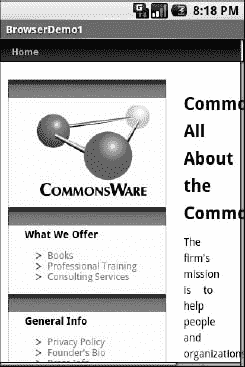
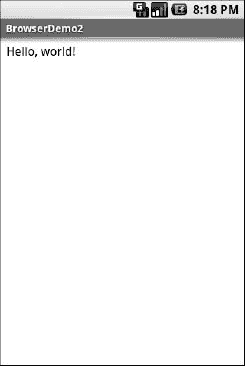
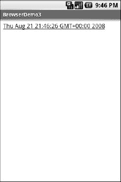

# 十五、嵌入 WebKit 浏览器

其他 GUI 工具包允许您使用 HTML 来呈现信息，从有限的 HTML 呈现器(例如 Java/Swing 和 wxWidgets)到将 Internet Explorer 嵌入。NET 应用。Android 也是如此，你可以将内置的网络浏览器作为一个小部件嵌入到你自己的活动中，用于显示 HTML 或全面的浏览。Android 浏览器基于 WebKit，与苹果的 Safari 和谷歌的 Chrome 等网络浏览器使用的引擎相同。

Android 浏览器足够复杂，它有自己的 Java 包(`android.webkit`)。根据您的需求，使用`WebView` widgetitself 可以是简单的，也可以是强大的。

### 浏览器，小字体

对于简单的东西来说，`WebView`与 Android 中的任何其他小部件没有明显的不同——将它弹出到一个布局中，通过 Java 代码告诉它要导航到哪个 URL，然后就完成了。

例如，下面是一个带有`WebView`(来自`WebKit/Browser1`)的简单布局:

`<?xml version="1.0" encoding="utf-8"?>
<WebViewxmlns:android="http://schemas.android.com/apk/res/android"
  android:id="@+id/webkit"
  android:layout_width="fill_parent"
  android:layout_height="fill_parent"
/>`

与任何其他小部件一样，您需要告诉它应该如何填充布局中的空间(在这种情况下，它填充所有剩余的空间)。

Java 代码同样简单:

`package com.commonsware.android.browser1;

importandroid.app.Activity;` `importandroid.os.Bundle;
importandroid.webkit.WebView;

public class BrowserDemo1 extends Activity {
  WebView browser;

  @Override
  public void **onCreate**(Bundle icicle) {
    super.**onCreate**(icicle);
    **setContentView**(R.layout.main);
    browser=(WebView)**findViewById**(R.id.webkit);

    browser.loadUrl("http://commonsware.com");
  }
}`

这个版本的`onCreate()`唯一不同寻常的地方是我们调用了`WebView`小部件上的`loadUrl()`，告诉它加载一个网页(在这个例子中，是某个随机公司的主页)。

然而，我们还需要对`AndroidManifest.xml`做一个修改，请求访问互联网的许可:

`<?xml version="1.0"?>
<manifestxmlns:android="http://schemas.android.com/apk/res/android"
package="com.commonsware.android.browser1">
  <uses-permission android:name="android.permission.INTERNET"/>
  <applicationandroid:icon="@drawable/cw">
    <activityandroid:name=".BrowserDemo1" android:label="BrowserDemo1">
      <intent-filter>
        <actionandroid:name="android.intent.action.MAIN"/>
        <categoryandroid:name="android.intent.category.LAUNCHER"/>
      </intent-filter>
    </activity>
  </application>
  <supports-screens android:largeScreens="true"
android:normalScreens="true" android:smallScreens="true" android:anyDensity="true"/>
</manifest>`

如果我们未能添加此权限，浏览器将拒绝加载页面。权限将在第三十八章中详细介绍。

最终的活动看起来像一个网络浏览器，但是带有隐藏的滚动条，如图 Figure 15–1 所示。

**图 15–1。**??【browser demo 1 示例应用】??

与常规的 Android 浏览器一样，你可以通过拖动它来浏览页面，而 D-pad 可以让你浏览页面上所有可聚焦的元素。缺少的是组成网络浏览器的所有额外的东西，比如导航工具栏。

现在，您可能想用依赖于 JavaScript 的东西来替换源代码中的 URL，比如 Google 的主页。默认情况下，JavaScript 在`WebView`小部件中是关闭的。如果您想启用 JavaScript，在`WebView`实例上调用`getSettings().setJavaScriptEnabled(true);`。本章稍后会更详细地介绍这个选项。

### 装载完毕

将内容放入`WebView`有两种主要方式。一种方法是为浏览器提供一个 URL，并让浏览器通过`loadUrl()`显示该页面。浏览器将通过特定设备当前可用的任何方式(Wi-Fi、2G、3G、4G、WiMAX、EDGE、HSDPA、HSPA、训练有素的小信鸽等)访问互联网。).

另一种方法是使用`loadData()`。在这里，您提供 HTML 供浏览器查看。您可以使用它来执行以下操作:

*   显示作为应用包文件安装的手册
*   显示作为其他处理的一部分检索到的 HTML 片段，例如 Atom 提要中的条目描述
*   使用 HTML 生成一个完整的用户界面，而不是使用 Android widget 集

`loadData()`有两种口味。更简单的方法允许您以字符串的形式提供内容、MIME 类型和编码。通常，对于普通的 HTML，你的 MIME 类型是`text/html`，你的编码是`UTF-8`。

例如，您可以用以下代码替换前面示例中的`loadUrl()`调用:

`browser.loadData("<html><body>Hello, world!</body></html>",
                  "text/html", "UTF-8");`

您将得到如图图 15–2 所示的结果。

**图 15–2。***browser demo 2 示例应用*

这也是一个完全可构建的示例，如`WebKit/Browser2`。

### 在水中航行

如前所述，`WebView`小部件没有导航工具栏。这允许你在这样的工具栏毫无意义和浪费屏幕空间的地方使用它。也就是说，如果你想提供导航功能，你可以，但你必须提供用户界面。

`WebView`提供了执行普通浏览器导航的方法，包括以下方法:

*   `reload()`:刷新当前查看的网页
*   `goBack()`:在浏览器历史中后退一步
*   `canGoBack()`:确定是否有任何历史可以返回
*   `goForward()`:在浏览器历史中前进一步
*   `canGoForward()`:确定是否有任何要前进的历史
*   `goBackOrForward()`:在浏览器历史中后退或前进，负数作为参数表示后退多少步，正数表示前进多少步
*   `canGoBackOrForward()`:确定浏览器是否可以后退或前进指定的步数(遵循与`goBackOrForward()`相同的正/负约定)
*   `clearCache()`:清除浏览器资源缓存
*   `clearHistory()`:清除浏览历史

### 招待客户

如果你打算将`WebView`用作本地 UI(而不是浏览网页),你将希望能够在关键时刻获得控制权，尤其是当用户点击链接时。你需要确保这些链接得到正确的处理，要么将你自己的内容加载回`WebView`，要么向 Android 提交一个`Intent`以在一个完整的浏览器中打开 URL，要么通过其他方式(见第二十二章)。

您对`WebView`活动的挂钩是通过`setWebViewClient()`实现的，它将一个`WebViewClient`实现的实例作为参数。所提供的回调对象将被通知各种各样的事件，从页面的部分被检索时开始(`onPageStarted()`等等)。)到当您作为主机应用需要处理某些用户或环境发起的事件时，例如`onTooManyRedirects()`或`onReceivedHttpAuthRequest()`。

一个常见的钩子是`shouldOverrideUrlLoading()`，在这里你的回调被传递一个 URL(加上`WebView`本身)，如果你要处理请求，你返回`true`，或者如果你想要默认处理，你返回`false`(例如，实际获取 URL 引用的网页)。例如，对于提要阅读器应用，您可能没有内置导航功能的完整浏览器。在这种情况下，如果用户点击一个 URL，你可能想使用一个`Intent`来请求 Android 在一个完整的浏览器中加载那个页面。但是如果你在 HTML 中插入了一个“假”的 URL，代表了一些活动提供的内容的链接，你可以自己更新`WebView`。

举个例子，让我们修改第一个浏览器演示，使它成为一个点击后显示当前时间的应用。从`WebKit/Browser3`开始，这里是修改后的 Java:

`public class BrowserDemo3 extends Activity {
  WebView browser;

  @Override
  public void **onCreate**(Bundle icicle) {
    super.**onCreate**(icicle);
    **setContentView**(R.layout.main);
    browser=(WebView)**findViewById**(R.id.webkit);
    browser.**setWebViewClient**(new **Callback**());

    **loadTime**();
  }

  void **loadTime**() {
    String page="<html><body><a href=\"clock\">"
            +new **Date**().**toString**()
            +"</a></body></html>";

    browser.**loadData**(page, "text/html", "UTF-8");
  }

  private class Callback extends WebViewClient {
    public boolean **shouldOverrideUrlLoading**(WebView view, String url) {
      **loadTime**();

      return(true);
    }
  }
}`

这里，我们在浏览器(`loadTime()`)中加载一个简单的网页，其中包含当前时间，并制作成一个到`/clock` URL 的超链接。我们还附加了一个`WebViewClient`子类的实例，提供了我们的`shouldOverrideUrlLoading()`实现。在这种情况下，不管 URL 是什么，我们只想通过`loadTime()`重新加载`WebView`。

运行该活动会产生如图 Figure 15–3 所示的结果。

**图 15–3。**??【browser demo 3 示例应用】??

选择该链接并单击 D-pad 中心按钮将“单击”该链接，从而使用新时间重建页面。

### 设置、首选项和选项(哦，天哪！)

有了你最喜欢的桌面网络浏览器，你就有了某种设置、偏好或选项窗口。在这个和工具栏控件之间，你可以调整和旋转浏览器的行为，从偏好的字体到 JavaScript 的行为。类似地，您可以通过调用小部件的`getSettings()`方法返回的`WebSettings`实例，调整您的`WebView`小部件的设置。

在`WebSettings`上有很多选项可以玩。大多数看起来相当深奥(例如`setFantasyFontFamily()`)。然而，这里有一些你可能会发现更有用的:

*   通过`setDefaultFontSize()`(使用磅值)或`setTextZoom()`(使用常量表示相对大小，如`LARGER`和`SMALLEST`)控制字体大小
*   通过`setJavaScriptEnabled()`(彻底禁用它)和`setJavaScriptCanOpenWindowsAutomatically()`(仅仅阻止它打开弹出窗口)控制 JavaScript
*   通过`setUserAgent()`控制 web 站点的呈现，这样您就可以提供自己的用户代理字符串，让 web 服务器认为您是一个桌面浏览器、另一个移动设备(例如，iPhone)或者其他什么
*   你改变的设置不是持久的，所以如果你允许你的用户决定设置，你应该把它们存储在某个地方(比如通过 Android 偏好引擎),而不是硬连接到你的应用中。