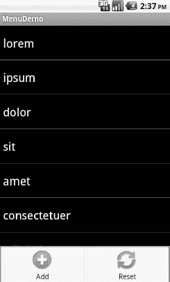
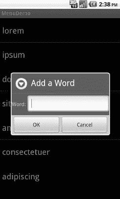
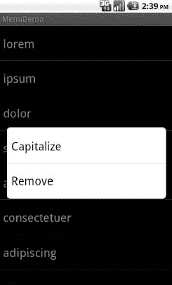

# 十六、应用菜单

像桌面应用和一些移动操作系统一样，Android 支持应用菜单的活动。大部分安卓手机都有弹出菜单的专用菜单键；其他设备提供了触发菜单出现的替代方法，如 Archos 5 Android 平板电脑使用的屏幕按钮。

此外，与许多 GUI 工具包一样，您可以为 Android 应用创建上下文菜单。在传统的 GUI 上，用户点击鼠标右键可能会触发上下文菜单。在移动设备上，当用户点击并按住特定的小部件时，通常会出现上下文菜单。例如，如果一个`TextView`有一个上下文菜单，并且该设备是为基于手指的触摸输入而设计的，那么你可以用手指按下`TextView`，按住一两秒钟，就会出现一个弹出菜单。

### 菜单的口味

Android 将前一节描述的两种类型的菜单称为选项菜单和上下文菜单。选项菜单是通过按下设备上的硬件菜单按钮来触发的，而上下文菜单是通过点击并按住显示菜单的小工具来启动的。

此外，选项菜单以两种模式之一运行:图标或展开。当用户第一次按下菜单按钮时，将出现图标模式，在屏幕底部的网格中以手指友好的大按钮形式显示前六个菜单选项。如果菜单有六个以上的选项，第六个按钮将标记为“更多”。点击更多选项将调出扩展模式，显示常规菜单中不可见的其余选项。该菜单是可滚动的，因此用户可以滚动到任何菜单选项。

### 菜单的选项

你需要实现`onCreateOptionsMenu()`，而不是在`onCreate()`期间构建活动的选项菜单，这是你连接 UI 其余部分的方式。这个回调接收一个`Menu`的实例。

你应该做的第一件事是链接到超类(`super.onCreateOptionsMenu(menu)`)，这样 Android 框架就可以添加任何它认为必要的菜单选项。然后，您可以着手添加您自己的选项，如本节所述。

如果您需要在活动的使用过程中调整菜单(例如，禁用现在无效的菜单选项)，只需保留在`onCreateOptionsMenu()`中收到的`Menu`实例。或者，您可以实现`onPrepareOptionsMenu()`，它在每次请求显示菜单之前被调用。

假设您已经通过`onCreateOptionsMenu()`收到了一个`Menu`对象，您可以通过调用`add()`来添加菜单选项。这种方法有多种形式，需要以下参数的某种组合:

*   一个组标识符(`int`)，它应该是`NONE`，除非你正在创建一个特定的菜单选项组，用于`setGroupCheckable()`(稍后描述)
*   一个选项标识符(也是一个`int`)，用于在选择菜单选项时在`onOptionsItemSelected()`回调中标识该选项
*   一个订单标识符(另一个`int`)，用于指示如果菜单中有 Android 提供的选项和你自己的选项，那么这个菜单选项应该放在哪里；现在，就用`NONE`
*   菜单选项的文本，如`String`或资源 ID

`add()`系列方法都返回一个`MenuItem`的实例，您可以在其中调整已经设置的任何菜单项设置(例如，菜单选项的文本)。

您还可以设置菜单选项的快捷键，这些快捷键是单字符助记符，当菜单可见时，它们会选择菜单项。Android 支持一组字母快捷键和一组数字快捷键。这些分别通过调用`setAlphabeticShortcut()`和`setNumericShortcut()`来单独设置。通过使用`true`参数调用菜单上的`setQwertyMode()`，菜单进入字母快捷方式。

选项和组标识符是用于解锁附加菜单功能的按键，如下所示:

*   使用选项标识符调用`MenuItem#setCheckable()`,以控制菜单选项是否在标题旁边有一个双态复选框，当用户选择该菜单项时，复选框值被切换
*   用组标识调用`Menu#setGroupCheckable()`,将一组菜单选项变成相互排斥的单选按钮，这样在任何时候组中只能有一项处于选中状态

您可以通过调用`addSubMenu()`，提供与`addMenu()`相同的参数来创建弹出子菜单。Android 最终会调用`onCreatePanelMenu()`，传递给它子菜单的选择标识符，以及另一个代表子菜单本身的`Menu`实例。与`onCreateOptionsMenu()`一样，您应该向上链接到超类，然后将菜单选项添加到子菜单中。一个限制是不能无限嵌套子菜单，一个菜单可以有子菜单，但是子菜单不能有子菜单。

最后，您甚至可以将菜单项推到操作栏中，这使您的用户更容易发现您的选项，更重要的是，更好地利用平板电脑和更大设备上的所有可用屏幕空间。当我们关注动作栏本身时，我们将在第二十七章中更深入地探讨这个功能。

如果用户选择了一个菜单，那么您的活动将会通过`onOptionsItemSelected()`回调得到一个菜单被选中的通知。您将获得与所选菜单选项相对应的`MenuItem`对象。一个典型的模式是对菜单 ID ( `item.getItemId()`)进行`switch()`，并采取适当的行为。请注意，无论选择的菜单项是在基本菜单还是子菜单中，都会使用`onOptionsItemSelected()`。

### 上下文中的菜单

总的来说，上下文菜单和选项菜单使用相同的元素。两个主要的区别是你如何填充菜单和你如何被告知菜单选择。

首先，您需要指出活动中的哪个或哪些小部件有上下文菜单。为此，从活动中调用`registerForContextMenu()`，提供需要上下文菜单的小部件`View`。

接下来，您需要实现`onCreateContextMenu()`，它通过您在`registerForContextMenu()`中提供的`View`传递。假设您的活动有多个菜单，您可以使用它来决定构建哪个菜单。

`onCreateContextMenu()`方法获得了`ContextMenu`本身、与上下文菜单相关联的`View`以及一个`ContextMenu.ContextMenuInfo`，它告诉您用户点击并按住了列表中的哪个项目，以防您想要基于该信息定制上下文菜单。例如，您可以根据项目的当前状态切换可检查的菜单选项。

值得注意的是，每次请求上下文菜单时都会调用`onCreateContextMenu()`。与选项菜单(每个活动只构建一次)不同，上下文菜单在使用或取消后会被丢弃。因此，您不想保留提供的`ContextMenu`对象；您只需根据用户的操作，根据需求重新构建菜单，以满足您的活动需求。

要找出何时选择了上下文菜单选项，请在活动上实现`onContextItemSelected()`。注意，您只获得在这个回调中选择的`MenuItem`实例。因此，如果您的活动有两个或更多的上下文菜单，您可能希望确保它们的所有选择都有唯一的菜单项标识符，这样您就可以在这个回调中区分它们。还有，你可以在`MenuItem`上呼叫`getMenuInfo()`来获得你在`onCreateContextMenu()`收到的`ContextMenu.ContextMenuInfo`。否则，这个回调的行为与前面部分描述的`onOptionsItemSelected()`相同。

### 偷看一眼

在示例项目`Menus/Menus`中，您会发现带有相关菜单的`ListView`示例(`List`)的修改版本。由于菜单不影响布局，XML 布局文件不需要更改，因此在此不再重印。然而，Java 代码有一些新的行为:

`packagecom.commonsware.android.menus;

importandroid.app.AlertDialog;
importandroid.app.ListActivity;
importandroid.content.DialogInterface;
importandroid.os.Bundle;
importandroid.view.ContextMenu;
importandroid.view.Menu;
importandroid.view.MenuItem;
importandroid.view.View;
importandroid.widget.AdapterView;
importandroid.widget.ArrayAdapter;
importandroid.widget.EditText;
importandroid.widget.ListView;
importandroid.widget.TextView;
importjava.util.ArrayList;

public class MenuDemo extends ListActivity {
  private static final String[] items={"lorem", "ipsum", "dolor",
          "sit", "amet", "consectetuer", "adipiscing", "elit",
          "morbi", "vel", "ligula", "vitae", "arcu", "aliquet",
          "mollis", "etiam", "vel", "erat", "placerat", "ante",
          "porttitor", "sodales", "pellentesque", "augue", "purus"};
  public static final int MENU_ADD = Menu.FIRST+1;
  public static final int MENU_RESET = Menu.FIRST+2;
  public static final int MENU_CAP = Menu.FIRST+3;
  public static final int MENU_REMOVE = Menu.FIRST+4 ;
  private ArrayList<String> words=null;

  @Override
  public void **onCreate**(Bundle icicle) {
    super.**onCreate**(icicle);

    **initAdapter**();
    **registerForContextMenu**(**getListView**());
  }`  `@Override
  public boolean **onCreateOptionsMenu**(Menu menu) {
    menu
    .**add**(Menu.NONE, MENU_ADD, Menu.NONE, "Add")
    .**setIcon**(R.drawable.ic_menu_add);
  menu
    .**add**(Menu.NONE, MENU_RESET, Menu.NONE, "Reset")
    .**setIcon**(R.drawable.ic_menu_refresh);

  return(super.**onCreateOptionsMenu**(menu));
  }

  @Override
  public void **onCreateContextMenu**(ContextMenu menu, View v,
                                   ContextMenu.ContextMenuInfo menuInfo) {
    menu.**add**(Menu.NONE, MENU_CAP, Menu.NONE, "Capitalize");
    menu.**add**(Menu.NONE, MENU_REMOVE, Menu.NONE, "Remove");
  }

  @Override
  public booleanon **OptionsItemSelected**(MenuItem item) {
    switch (item.**getItemId**()) {
      case MENU_ADD:
        **add**();
        return(true);

      case MENU_RESET:
        **initAdapter**();
        return(true);
    }

    return(super.**onOptionsItemSelected**(item));
  }

  @Override
  public boolean **onContextItemSelected**(MenuItem item) {
    AdapterView.AdapterContextMenuInfo info=
      (AdapterView.AdapterContextMenuInfo)item.**getMenuInfo**();
    ArrayAdapter<String> adapter=(ArrayAdapter<String>)**getListAdapter**();

    switch (item.**getItemId**()) {
      case MENU_CAP:
        String word=words.**get**(info.position);

        word=word.**toUpperCase**();

        adapter.**remove**(words.**get**(info.position));
        adapter.**insert**(word, info.position);

        return(true);

      case MENU_REMOVE:
        adapter.**remove**(words.**get**(info.position));

        return(true);
    }`  `return(super.**onContextItemSelected**(item));
  }

  private void **initAdapter**() {
    words=new ArrayList<String>();

    for (String s : items) {
      words.**add**(s);
    }

    **setListAdapter**(new ArrayAdapter<String>(this,
                    android.R.layout.simple_list_item_1, words));
  }

  private void **add**() {
    final View addView=**getLayoutInflater**().**inflate**(R.layout.add, null);

    newAlertDialog.**Builder**(this)
      .**setTitle**("Add a Word")
      .**setView**(addView)
      .**setPositiveButton**("OK",
                         new DialogInterface.**OnClickListener**() {
        public void **onClick**(DialogInterface dialog,
                             int whichButton) {
          ArrayAdapter<String> adapter=(ArrayAdapter<String>)**getListAdapter**();
          EditText title=(EditText)addView.**findViewById**(R.id.title);

          adapter.**add**(title.**getText**().**toString**());
        }
      })
      .**setNegativeButton**("Cancel", null)
      .**show**();
  }
}`

在`onCreate()`中，我们将`ListView`小部件注册为具有上下文菜单。我们还将加载适配器委托给一个`initAdapter()`私有方法，该方法将数据从我们的静态`String`数组中复制出来，并将其倒入一个`ArrayList`，对`ArrayAdapter`使用`ArrayList`。我们这样做的原因是我们希望能够动态地改变列表的内容，如果我们使用一个`ArrayList`而不是一个普通的`String`数组，这就容易多了。

对于选项菜单，我们覆盖了`onCreateOptionsMenu()`并添加了两个菜单项，一个向列表中添加新单词，另一个将单词重置为初始状态。这些菜单项的 id 在本地被定义为静态数据成员(`MENU_ADD`和`MENU_RESET`)，它们还带有从 Android 开源项目中复制的图标。如果用户显示菜单，看起来如图图 16–1 所示。

**图 16–1。***MenuDemo 示例应用及其选项菜单*

我们还覆盖了`onOptionsItemSelected()`，如果用户从菜单中做出选择，就会调用它。提供的`MenuItem`有一个`getItemId()`方法，应该映射到`MENU_ADD`或`MENU_RESET`。在`MENU_ADD`的情况下，我们调用一个私有的`add()`方法，该方法显示一个`AlertDialog`，它的内容是一个自定义的`View`，从`res/layout/add.xml`开始膨胀:

`<?xml version="1.0" encoding="utf-8"?>
<LinearLayoutxmlns:android="http://schemas.android.com/apk/res/android"
    android:orientation="horizontal"
    android:layout_width="fill_parent"
    android:layout_height="wrap_content"
    >
  <TextView
      android:text="Word:"
      android:layout_width="wrap_content"
      android:layout_height="wrap_content"
      />
  <EditText
      android:id="@+id/title"
      android:layout_width="fill_parent"
      android:layout_height="wrap_content"
      android:layout_marginLeft="4dip"
      />
</LinearLayout>`

这将产生一个类似于图 16–2 所示的对话框。

**图 16–2。** *同样的应用，显示出*的添加单词对话框

如果用户点击 OK 按钮，我们得到我们的`ArrayAdapter`并在上面调用`add()`，将输入的单词添加到列表的末尾。

如果用户选择了`MENU_RESET`，我们再次调用`initAdapter()`，建立一个新的`ArrayAdapter`，并将其附加到我们的`ListActivity`。

对于上下文菜单，我们覆盖了`onCreateContextMenu()`。我们再一次用本地 id 定义了一对菜单项，`MENU_CAP`(大写长点击的单词)和`MENU_REMOVE`(删除单词)。因为上下文菜单没有图标，我们可以跳过这一部分。如果用户长按一个单词，就会得到如图图 16–3 所示的上下文菜单。

**图 16–3。** *同样的应用，显示出*的快捷菜单

我们也覆盖了`onContextMenuSelected()`。由于这是一个`ListView`的上下文菜单，我们的`MenuItem`为我们提供了一些额外的信息——特别是，列表中哪个项目被长时间点击了。为此，我们在`MenuItem`上调用`getMenuInfo()`，并将结果转换为`AdapterView.AdapterContextMenuInfo`。该对象又有一个位置数据成员，它是用户选择的单词在数组中的索引。从那里，我们按照要求，用我们的`ArrayAdapter`来大写或删除这个单词。

### 更多通货膨胀

第十三章解释了如何通过 XML 文件描述`View`并在运行时将它们“膨胀”成实际的`View`对象。Android 还允许你通过 XML 文件描述菜单，并在需要菜单时放大菜单。这有助于将菜单结构从菜单处理逻辑的实现中分离出来，并为开发菜单创作工具提供了更简单的方法。

#### 菜单 XML 结构

菜单 XML 放在项目树的`res/menu/`中，与项目可能使用的其他类型的资源放在一起。与布局一样，项目中可以有几个菜单 XML 文件，每个文件都有自己的文件名和扩展名`.xml`。

例如，在`Menus/Inflation`示例项目中，这里有一个名为`option.xml`的菜单:

`<?xml version="1.0" encoding="utf-8"?>
<menu xmlns:android="http://schemas.android.com/apk/res/android">
  <item android:id="@+id/add"
    android:title="Add"
    android:icon="@drawable/ic_menu_add" />
  <item android:id="@+id/reset"
    android:title="Reset"
    android:icon="@drawable/ic_menu_refresh" />
</menu>`

请注意以下几点:

*   您必须以一个`menu`根元素开始。
*   在一个`menu`元素中有`item`元素和`group`元素，后者代表可以作为一个组操作的菜单项的集合。
*   通过添加一个`menu`元素作为`item`元素的子元素来指定子菜单，使用这个新的`menu`元素来描述子菜单的内容。
*   如果您想检测一个项目何时被选择，或者从 Java 代码中引用一个项目或组，请确保应用一个`android:id`，就像您使用`View`布局 XML 一样。

#### 菜单选项和 XML

在`item`和`group`元素中，可以指定各种选项，与`Menu`或`MenuItem`上的相应方法相匹配，如下所示:

*   *标题*:菜单项的标题是通过`item`元素上的`android:title`属性提供的。这可以是文字字符串，也可以是对字符串资源的引用(例如，`@string/foo`)。
*   *图标*:菜单项可选有图标。要以引用可绘制资源的形式提供图标(例如，`@drawable/eject`)，请使用`item`元素上的`android:icon`属性。
*   *顺序*:默认情况下，菜单项在菜单中的顺序由它们在菜单 XML 中出现的顺序决定。您可以通过在`item`元素上指定`android:orderInCategory`属性来改变这个顺序。这是一个基于`0`的与当前类别相关的商品订单索引。有一个隐含的默认类别；组可以提供一个`android:menuCategory`属性来为该组中的项目指定一个不同的类别。不过，一般来说，最简单的方法是将 XML 中的项目按照您希望它们出现的顺序排列。
*   *Enabled* :可以启用或禁用项目和组，在 XML 中通过`item`或`group`元素上的`android:enabled`属性来控制。默认情况下，项目和组处于启用状态。禁用的项目和组出现在菜单中，但不能被选择。你可以通过`MenuItem`上的`setEnabled()`方法在运行时改变一个项目的状态，或者通过`Menu`上的`setGroupEnabled()`改变一个组的状态。
*   *Visible* :条目和组可以是可见的或不可见的，在 XML 中通过`item`或`group`元素上的`android:visible`属性来控制。默认情况下，项目和组是可见的。不可见的项目和群组不会出现在菜单中。你可以通过`MenuItem`上的`setVisible()`方法在运行时改变一个项目的状态，或者通过`Menu`上的`setGroupVisible()`改变一个组的状态。
*   *快捷方式*:项目可以有快捷方式——单个字母(`android:alphabeticShortcut`)或数字(`android:numericShortcut`)，可以按下这些快捷方式来选择项目，而不必使用触摸屏、D-pad 或轨迹球来导航整个菜单。

#### 膨胀菜单

实际上，一旦用 XML 定义了菜单，使用它就很容易了。只需创建一个`MenuInflater`并告诉它膨胀你的菜单。

项目`Menus/Inflation`是项目`Menus/Menus`的克隆，菜单创建转换为使用菜单 XML 资源和`MenuInflater`。选项菜单已转换为本节前面显示的 XML 以下是上下文菜单:

`<?xml version="1.0" encoding="utf-8"?>
<menu xmlns:android="http://schemas.android.com/apk/res/android">
  <item android:id="@+id/cap"
    android:title="Capitalize" />
   item android:id="@+id/remove"
    android:title="Remove" />
</menu>`

Java 代码几乎是相同的，主要变化在于`onCreateOptionsMenu()`和`onCreateContextMenu()`的实现:

`@Override
public boolean **onCreateOptionsMenu**(Menu menu) {
  new **MenuInflater**(this).**inflate**(R.menu.option, menu);

  return(super.**onCreateOptionsMenu**(menu));
}

@Override
public void **onCreateContextMenu**(ContextMenu menu, View v,
                                 ContextMenu.ContextMenuInfomenuInfo) {
  new **MenuInflater**(this).**inflate**(R.menu.context, menu);
}`

在这里，我们看到`MenuInflater`如何将菜单资源中指定的菜单项(如`R.menu.option`)注入到提供的`Menu`或`ContextMenu`对象中。

我们还需要更改`onOptionsItemSelected()`和`onContextItemSelected()`以使用 XML 中指定的`android:id`值:

`@Override
public boolean **onOptionsItemSelected**(MenuItem item) {
  switch (item.**getItemId**()) {
    case R.id.add:
      **add**();
      return(true);

    case R.id.reset:
      **initAdapter**();
      return(true);
  }

  return(super.**onOptionsItemSelected**(item));
}

@Override
public boolean **onContextItemSelected**(MenuItem item) {
  AdapterView.AdapterContextMenuInfo info=
    (AdapterView.AdapterContextMenuInfo)item.**getMenuInfo**();
  ArrayAdapter<String> adapter=(ArrayAdapter<String>)**getListAdapter**();

  switch (item.**getItemId**()) {
    caseR.id.cap:
      String word=words.**get**(info.position);

      word=word.**toUpperCase**();

      adapter.**remove**(words.**get**(info.position));
      adapter.**insert**(word, info.position);

      return(true);

    case R.id.remove:
      adapter.**remove**(words.**get**(info.position));

      return(true);
  }

  return(super.**onContextItemSelected**(item));
}`

### 当巨型菜单在地球上行走

随着 Android 3.x 和 4.0 的推出，处理平板电脑和大显示器的新方法被引入并融入到平台的核心。特别是选项菜单，从菜单按钮触发变成了动作栏的下拉菜单。幸运的是，这是向后兼容的，所以您现有的菜单不需要改变来采用这种新的外观。我们将在第二十六章中讲述使用更大设备的整体含义，动作栏本身将在第二十七章的中讲述。