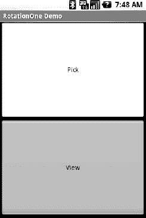
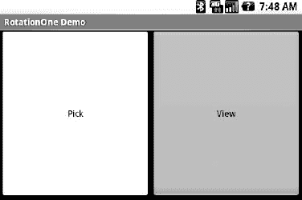
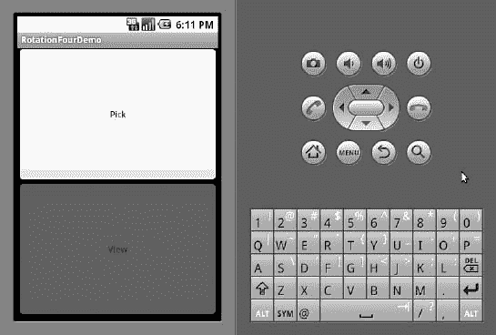
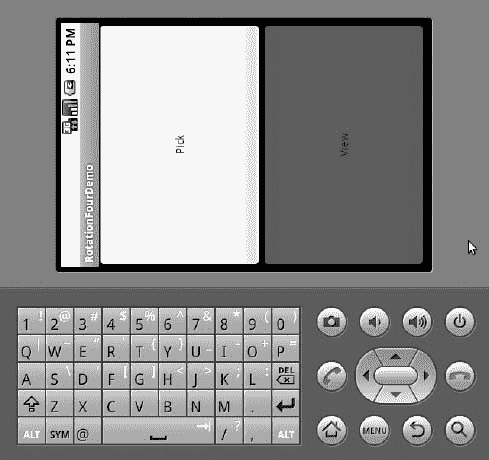

# 十九、处理旋转

一些 Android 设备提供滑出式键盘，可以触发屏幕从纵向旋转到横向。其他设备使用加速度计来确定屏幕何时旋转。因此，有理由假设从纵向到横向的切换可能是您的应用的用户想要做的事情。

正如本章所描述的，Android 有很多方法可以让你处理屏幕旋转，这样你的应用就可以正确地处理任何一个方向。但是请记住，这些工具只能帮助您检测和管理旋转过程——您仍然必须确保您的布局和片段在每个方向上都看起来不错。

### 毁灭的哲学

默认情况下，当设备配置发生可能影响资源选择的变化时，Android 将在下次查看时销毁并重新创建任何正在运行或暂停的活动。各种不同的配置更改都会发生这种情况，包括:

*   旋转屏幕(即方向改变)
*   在具有滑动键盘的设备上扩展或隐藏物理键盘
*   将设备放入汽车或桌面坞站，或从坞站中移除
*   更改区域设置，从而更改首选语言

屏幕旋转是最容易出错的变化，因为方向的变化会导致应用加载一组不同的资源(例如布局)。

这里的关键是，Android 的默认行为破坏并重新创建任何正在运行或暂停的活动，这可能是最适合您的大多数活动的行为。不过，您确实可以控制这件事，并且可以定制您的活动如何响应方向变化或类似的配置切换。

### 都一样，只是不同

由于默认情况下，Android 会在循环中销毁并重新创建您的活动，因此您可能只需要连接到相同的`onSaveInstanceState()`，如果您的活动因任何其他原因被销毁(例如，内存不足或我们在第十八章中讨论的其他原因)。在您的活动中实现该方法，并在提供的`Bundle`中填入足够的信息，让您回到当前状态。然后，在`onCreate()`(或者`onRestoreInstanceState()`，如果你喜欢的话)，从`Bundle`中挑选数据，用它来恢复你的活动。

为了证明这一点，我们来看一下`Rotation/RotationOne`项目。本章中的这个和其他示例项目使用一对`main.xml`布局，一个在`res/layout/`中用于纵向模式，一个在`res/layout-land/`中用于横向模式。以下是纵向布局:

`<?xml version="1.0" encoding="utf-8"?>
<LinearLayout xmlns:android="http://schemas.android.com/apk/res/android"
  android:orientation="vertical"
  android:layout_width="fill_parent"
  android:layout_height="fill_parent"
  >
  <Button android:id="@+id/pick"
    android:layout_width="fill_parent"
    android:layout_height="fill_parent"
    android:layout_weight="1"
    android:text="Pick"
    android:enabled="true"
    android:onClick="pickContact"
  />
  <Button android:id="@+id/view"
    android:layout_width="fill_parent"
    android:layout_height="fill_parent"
    android:layout_weight="1"
    android:text="View"
    android:enabled="false"
    android:onClick="viewContact"
  />
</LinearLayout>`

这里是类似的景观布局:

`<?xml version="1.0" encoding="utf-8"?>
<LinearLayout xmlns:android="http://schemas.android.com/apk/res/android"
  android:orientation="horizontal"
  android:layout_width="fill_parent"
  android:layout_height="fill_parent"
  >
  <Button android:id="@+id/pick"
    android:layout_width="fill_parent"
    android:layout_height="fill_parent"
    android:layout_weight="1"
    android:text="Pick"
    android:enabled="true"
    android:onClick="pickContact"` `  />
  <Button android:id="@+id/view"
    android:layout_width="fill_parent"
    android:layout_height="fill_parent"
    android:layout_weight="1"
    android:text="View"
    android:enabled="false"
    android:onClick="viewContact"
  />
</LinearLayout>`

基本上，这两种布局都包含一对按钮，每个按钮占据半个屏幕。在纵向模式下，按钮是堆叠的；在横向模式下，它们是并排的。

如果您只是创建一个项目，放入这两个布局，然后编译它，应用看起来工作得很好——旋转(模拟器中的 Ctrl+F12)将导致布局改变。虽然按钮没有状态，但是如果你正在使用其他小部件(例如`EditText`)，你甚至会发现 Android 为你保留了一些小部件的状态(例如在`EditText`中输入的文本)。

Android 不能自动帮助你的是小部件之外的任何东西。

#### 选择并查看联系人

该应用允许用户选择一个联系人，然后通过单独的按钮查看该联系人。仅当用户通过挑选按钮挑选联系人后，查看按钮才被启用。让我们仔细看看这一壮举是如何完成的。

当用户点击 Pick 按钮时，我们调用`startActivityForResult()`。这是`startActivity()`的一个变体，设计用于返回某种结果的活动——用户选择的文件、联系人或其他。相对来说，很少有活动是这样安排的，所以你不能指望打电话给`startActivityForResult()`并从你选择的任何活动中得到答案。

在这种情况下，我们要选择一个联系人。Android 中有一个`ACTION_PICKIntent`动作就是为这种场景设计的。一个`ACTION_PICKIntent`向 Android 表示我们要挑选…某样东西。那个“某物”是由我们放入`Intent`的`Uri`决定的。

在我们的例子中，我们可以使用一个`ACTION_PICKIntent`作为某些系统定义的`Uri`值，让用户从设备的联系人列表中选择一个联系人。特别是在 Android 2.0 及更高版本上，我们可以使用`android.provider.ContactsContract.Contacts.CONTENT_URI`来实现这个目的:

`public void **pickContact**(View v) {
  Intent i=new **Intent**(Intent.ACTION_PICK,
                     Contacts.CONTENT_URI);

  **startActivityForResult**(i, PICK_REQUEST);
}`

对于 Android 1.6 和更早的版本，我们可以使用一个单独的`android.provider.Contacts.CONTENT_URI`。

`startActivityForResult()`的第二个参数是一个标识号，帮助我们将这个对`startActivityForResult()`的调用与我们可能进行的任何其他调用区分开来。用`ACTION_PICKIntent`呼叫`Contacts.CONTENT_URI`的`startActivityForResult()`将会调出一个由 Android 提供的联系人选择活动。

当用户点击一个联系人时，picker 活动结束(例如，通过`finish()`)，并且控制返回到我们的活动。此时，我们的活动用`onActivityResult()`调用。Android 为我们提供了三条信息:

*   我们提供给`startActivityForResult()`的标识号，因此我们可以将这个结果与其原始请求进行匹配
*   结果状态`RESULT_OK`或`RESULT_CANCELED`，指示用户是否做出了肯定的选择或放弃了选取器(例如，通过按下后退按钮)
*   对于`RESULT_OK`响应，代表结果数据本身的`Intent`

您调用的活动需要记录`Intent`中的详细内容。在`Contacts.CONTENT_URI`的`ACTION_PICKIntent`的情况下，返回的`Intent`有它自己的`Uri`(通过`getData()`)来代表选择的联系人。在`RotationOne`示例中，我们将它放在活动的数据成员中，并启用 View 按钮:

`@Override
protected void **onActivityResult**(int requestCode, int resultCode,
                                 Intent data) {
  if (requestCode==PICK_REQUEST) {
    if (resultCode==RESULT_OK) {
      contact=data**.getData**();
      viewButton**.setEnabled**(true);
    }
  }
}`

如果用户点击现在启用的视图按钮，我们在联系人的`Uri`上创建一个`ACTION_VIEWIntent`，并在那个`Intent`上调用`startActivity()`:

`public void **viewContact**(View v) {
  **startActivity**(new **Intent**(Intent.ACTION_VIEW, contact));
}`

这将弹出一个 Android 提供的活动来查看该联系人的详细信息。

#### 保存您的状态

假设我们已经使用了`startActivityForResult()`来选择一个联系人，现在我们需要在屏幕方向改变时保持这个联系人。在`RotationOne`示例中，我们通过`onSaveInstanceState()`来实现:

`package com.commonsware.android.rotation.one;

import android.app.Activity;` `import android.content.Intent;
import android.net.Uri;
import android.os.Bundle;
import android.provider.ContactsContract.Contacts;
import android.view.View;
import android.widget.Button;
import android.util.Log;

public class RotationOneDemo extends Activity {
  static final int PICK_REQUEST=1337;
  Button viewButton=null;
  Uri contact=null;

  @Override
  public void **onCreate**(Bundle savedInstanceState) {
    super**.onCreate**(savedInstanceState);
    **setContentView**(R.layout.main);

    viewButton=(Button)**findViewById**(R.id.view);
    **restoreMe**(savedInstanceState);

    viewButton**.setEnabled**(contact!=null);
  }

  @Override
  protected void **onActivityResult**(int requestCode, int resultCode,
                                   Intent data) {
    if (requestCode==PICK_REQUEST) {
      if (resultCode==RESULT_OK) {
        contact=data**.getData**();
        viewButton**.setEnabled**(true);
      }
    }
  }

  public void **pickContact**(View v) {
    Intent i=new **Intent**(Intent.ACTION_PICK,
                       Contacts.CONTENT_URI);

    **startActivityForResult**(i, PICK_REQUEST);
  }

  public void **viewContact**(View v) {
    **startActivity**(new **Intent**(Intent.ACTION_VIEW, contact));
  }

  @Override
  protected void **onSaveInstanceState**(Bundle outState) {
    super**.onSaveInstanceState**(outState);

    if (contact!=null) {
      outState**.putString**("contact", contact**.toString**());
    }
  }

  private void **restoreMe**(Bundle state) {` `    contact=null;

    if (state!=null) {
      String contactUri=state**.getString**("contact");

      if (contactUri!=null) {
        contact=Uri**.parse**(contactUri);
      }
    }
  }
}`

总的来说，这看起来像一个正常的活动…因为它是。最初，“模型”——一个名为`contact`的`Uri`——是`null`。它被设置为生成`ACTION_PICK`子活动的结果。它的字符串表示保存在`onSaveInstanceState()`中，并在`restoreMe()`(从`onCreate()`调用)中恢复。如果联系人不是`null`，查看按钮被激活，可用于查看所选联系人。

从视觉上看，它看起来和你想象的差不多，如图图 19–1 和 19–2 所示。

**图 19–1。** *纵向模式下的 RotationOne 应用*

**图 19–2。***rotation one 应用，在风景模式下*

这种实现的好处是，它处理许多系统事件，而不仅仅是旋转，比如由于内存不足而被 Android 关闭。

出于好玩，注释掉`onCreate()`中的`restoreMe()`调用，并尝试运行应用。当你旋转仿真器或设备时，你会看到应用“忘记”在一个方向选择的一个触点。

### 现在节省更多！

`onSaveInstanceState()`的问题在于，你被限制在一个`Bundle`之内。这是因为这个回调也用于整个进程可能被终止的情况(例如，内存不足)，所以要保存的数据必须是可以序列化的，并且不依赖于正在运行的进程。

对于某些活动，这种限制不是问题。对其他人来说，就更烦了。以网上聊天为例。您无法在`Bundle`中存储套接字，因此默认情况下，您必须断开与聊天服务器的连接，然后重新建立连接。这不仅可能会影响性能，还可能会影响聊天本身，例如在聊天日志中显示您正在断开连接和重新连接。

解决这个问题的一个方法是使用`onRetainNonConfigurationInstance()`而不是`onSaveInstanceState()`来表示“光”的变化，比如旋转。您的活动的`onRetainNonConfigurationInstance()`回调可以返回一个`Object`，稍后您可以通过`getLastNonConfigurationInstance()`检索它。`Object`可以是你想要的任何东西。通常，它是某种保存活动状态的“上下文”对象，如运行线程、打开套接字等。你的活动的`onCreate()`可以调用`getLastNonConfigurationInstance()`，如果你得到一个非`null`的响应，你现在就有了你的套接字、线程等等。最大的限制是，您不希望在保存的上下文中放置任何可能引用将被换出的资源的内容，比如从资源中加载的`Drawable`。

让我们看看`Rotation/RotationTwo`示例项目，它使用这种方法来处理旋转。布局和视觉外观与`Rotation/RotationOne`相同。略有不同的是 Java 代码:

`package com.commonsware.android.rotation.two;

import android.app.Activity;
import android.content.Intent;
import android.net.Uri;
import android.os.Bundle;
import android.provider.ContactsContract.Contacts;
import android.view.View;
import android.widget.Button;
import android.util.Log;

public class RotationTwoDemo extends Activity {
  static final int PICK_REQUEST=1337;
  Button viewButton=null;
  Uri contact=null;

  @Override
  public void **onCreate**(Bundle savedInstanceState) {
    super**.onCreate**(savedInstanceState);
    **setContentView**(R.layout.main);

    viewButton=(Button)**findViewById**(R.id.view);
    **restoreMe**();

    viewButton**.setEnabled**(contact!=null);
  }

  @Override
  protected void **onActivityResult**(int requestCode, int resultCode,
                                   Intent data) {
    if (requestCode==PICK_REQUEST) {
      if (resultCode==RESULT_OK) {
        contact=data**.getData**();
        viewButton**.setEnabled**(true);
      }
    }
  }

  public void **pickContact**(View v) {
    Intent i=new **Intent**(Intent.ACTION_PICK,
                       Contacts.CONTENT_URI);

    **startActivityForResult**(i, PICK_REQUEST);
  }

  public void **viewContact**(View v) {
    **startActivity**(new **Intent**(Intent.ACTION_VIEW, contact));
  }

  @Override
  public Object **onRetainNonConfigurationInstance**() {
    return(contact);` `  }

  private void **restoreMe**() {
    contact=null;

    if (**getLastNonConfigurationInstance**()!=null) {
      contact=(Uri)**getLastNonConfigurationInstance**();
    }
  }
}`

在这种情况下，我们覆盖了`onRetainNonConfigurationInstance()`，返回联系人的实际`Uri`，而不是它的字符串表示。反过来，`restoreMe()`呼叫`getLastNonConfigurationInstance()`，如果不是`null`，我们将它作为联系人并启用查看按钮。

这里的优点是我们传递的是`Uri`而不是字符串表示。在这种情况下，这不是一个很大的节省。但是我们的状态可能要复杂得多，包括线程、套接字和其他我们无法打包到`Bundle`中的东西。

然而，即使是处理旋转的`onRetainNonConfigurationInstance()`方法也可能对您的应用造成太大的干扰。例如，假设您正在创建一个实时游戏，例如第一人称射击游戏。当你的活动被破坏和重新创建时，你的用户所经历的“打嗝”可能足以让他们中枪，但他们可能不欣赏。虽然这在 T-Mobile G1 上不是什么问题，但由于旋转需要滑动打开键盘，因此不太可能在游戏中途完成，其他设备可能会仅根据加速计确定的设备位置进行旋转。对于这样的应用，还有第三种处理旋转的可能性，那就是告诉 Android 你将自己处理它们，而不需要框架的任何帮助。

### DIY 旋转

要在没有 Android 帮助的情况下处理旋转，请执行以下操作:

1.  在您的`AndroidManifest.xml`文件中放入一个`android:configChanges`条目，列出您想要自己处理的配置更改和让 Android 为您处理的配置更改。
2.  在您的`Activity`中实现`onConfigurationChanged()`,当您在`android:configChanges`中列出的配置变化之一发生时，将会调用它。

现在，对于您想要的任何配置更改，您可以绕过整个活动销毁过程，只需获得一个回调，让您知道更改。

要了解这一点，请转到`Rotation/RotationThree`示例应用。同样，我们的布局是相同的，因此应用看起来与前两个示例相同。然而，Java 代码有很大的不同，因为我们不再关心保存我们的状态，而是更新我们的 UI 来处理布局。

但是首先，我们需要对我们的清单做一个小小的改动:

`<?xml version="1.0" encoding="utf-8"?>
<manifest xmlns:android="http://schemas.android.com/apk/res/android"
 package="com.commonsware.android.rotation.three" android:versionCode="1"
 android:versionName="1.0.0">
  <uses-sdk android:minSdkVersion="5" android:targetSdkVersion="6"/>
    <application android:label="@string/app_name" android:icon="@drawable/cw">
        <activity android:name=".RotationThreeDemo" android:label="@string/app_name"
 android:configChanges="keyboardHidden|orientation">
            <intent-filter>
                <action android:name="android.intent.action.MAIN"/>
                <category android:name="android.intent.category.LAUNCHER"/>
            </intent-filter>
        </activity>
    </application>
  <supports-screens android:largeScreens="true" android:normalScreens="true"
  android:smallScreens="true" android:anyDensity="true"/>
  </manifest>`

这里，我们声明我们将自己处理`keyboardHidden`和`orientation`配置变更。这涵盖了任何原因的旋转，无论是滑动键盘还是物理旋转。请注意，这是在活动上设置的，而不是在应用上。如果你有几项活动，你将需要为每一项活动决定你希望使用本章概述的哪一种策略。

此外，我们需要向我们的`LinearLayout`容器添加一个`android:id`，如下所示:

`<?xml version="1.0" encoding="utf-8"?>
<LinearLayout xmlns:android="http://schemas.android.com/apk/res/android"
  android:id="@+id/container"
  android:orientation="vertical"
  android:layout_width="fill_parent"
  android:layout_height="fill_parent"
  >
  <Button android:id="@+id/pick"
    android:layout_width="fill_parent"
    android:layout_height="fill_parent"
    android:layout_weight="1"
    android:text="Pick"
    android:enabled="true"
    android:onClick="pickContact"
  />
  <Button android:id="@+id/view"
    android:layout_width="fill_parent"
    android:layout_height="fill_parent"
    android:layout_weight="1"
    android:text="View"
    android:enabled="false"
    android:onClick="viewContact"
  />
</LinearLayout>`

这个项目的 Java 代码如下所示:

`package com.commonsware.android.rotation.three;`  `import android.app.Activity;
import android.content.Intent;
import android.content.res.Configuration;
import android.net.Uri;
import android.os.Bundle;
import android.provider.ContactsContract.Contacts;
import android.view.View;
import android.widget.Button;
import android.widget.LinearLayout;

public class RotationThreeDemo extends Activity {
  static final int PICK_REQUEST=1337;
  Button viewButton=null;
  Uri contact=null;

  @Override
  public void **onCreate**(Bundle savedInstanceState) {
    super**.onCreate**(savedInstanceState);

    **setContentView**(R.layout.main);
    viewButton=(Button)**findViewById**(R.id.view);
    viewButton**.setEnabled**(contact!=null);
  }

  @Override
  protected void **onActivityResult**(int requestCode, int resultCode,
                                   Intent data) {
    if (requestCode==PICK_REQUEST) {
      if (resultCode==RESULT_OK) {
        contact=data**.getData**();
        viewButton**.setEnabled**(true);
      }
    }
  }

  public void **pickContact**(View v) {
    Intent i=new **Intent**(Intent.ACTION_PICK,
                       Contacts.CONTENT_URI);

    **startActivityForResult**(i, PICK_REQUEST);
  }

  public void **viewContact**(View v) {
    **startActivity**(new **Intent**(Intent.ACTION_VIEW, contact));
  }

  public void **onConfigurationChanged**(Configuration newConfig) {
    super**.onConfigurationChanged**(newConfig);

    LinearLayout container=(LinearLayout)**findViewById**(R.id.container);

    if (newConfig.orientation==Configuration.ORIENTATION_LANDSCAPE) {
      container**.setOrientation**(LinearLayout.HORIZONTAL);
    }
    else {` `      container**.setOrientation**(LinearLayout.VERTICAL);
    }
  }
}`

我们的`onConfigurationChanged()`需要更新 UI 来反映方向的变化。在这里，我们找到我们的`LinearLayout`,并告诉它改变方向，以匹配设备的方向。`Configuration`对象上的`orientation`字段将告诉我们设备是如何定向的。

**…但是谷歌不推荐这个**

你可能认为`onConfigurationChanged()`和`android:configChanges`是处理旋转的最终解决方案。毕竟，随着旧活动被破坏，我们不再需要担心将数据杂乱地传递给新活动。`onConfigurationChanged()`的做法非常性感。

但是，谷歌并不推荐。

主要担心的是忘记资源。使用`onConfigurationChanged()`方法，您必须确保由于这种配置变化而可能发生变化的每个资源都得到更新。这包括字符串、布局、可绘制性、菜单、动画、偏好、尺寸、颜色和所有其他内容。如果你不能确保所有的东西都被完全更新，你的应用将会有一系列的小错误。

允许 Android 破坏和重新创建您的活动保证您将获得适当的资源。您需要做的就是安排将适当的数据从旧活动传递到新活动。

`onConfigurationChanged()`方法仅适用于用户会直接受到破坏-创建循环影响的情况。例如，想象一个正在播放视频流的视频播放器应用。销毁并重新创建活动必然会导致应用必须重新连接到流，并在此过程中丢失缓冲数据。如果意外的移动导致设备改变方向并中断他们的视频播放，用户会感到沮丧。在这种情况下，由于用户会察觉到破坏-创建循环的问题，`onConfigurationChanged()`是一个合适的选择。

### 强行提出问题

有些活动根本不是为了改变方向。例如，游戏、相机预览、视频播放器等可能仅在横向方向有意义。虽然大多数活动应该允许用户在任何期望的方向上工作，但是对于只有一个方向有意义的活动，您可以控制它。

要阻止 Android 旋转您的活动，您需要做的就是将`android:screenOrientation = "portrait"`(或`"landscape"`，随您喜欢)添加到您的`AndroidManifest.xml`文件中，如下所示(来自`Rotation/RotationFour`示例项目):

`<?xml version="1.0" encoding="utf-8"?>
<manifest xmlns:android="http://schemas.android.com/apk/res/android"
 package="com.commonsware.android.rotation.four" android:versionCode="1"` ` android:versionName="1.0.0">
  <uses-sdk android:minSdkVersion="5" android:targetSdkVersion="6"/>
    <application android:label="@string/app_name" android:icon="@drawable/cw">
        <activity android:name=".RotationFourDemo" android:screenOrientation=
"portrait" android:label="@string/app_name">
            <intent-filter>
                <action android:name="android.intent.action.MAIN"/>
                <category android:name="android.intent.category.LAUNCHER"/>
            </intent-filter>
        </activity>
    </application>
  <supports-screens android:largeScreens="true" android:normalScreens="true"
 android:smallScreens="true" android:anyDensity="true"/>
</manifest>`

由于这是在每个活动的基础上应用的，您将需要决定您的哪些活动可能需要打开它。

此时，无论您做什么，您的活动都被锁定在您指定的方向。图 19–3 和 19–4 显示了与前三节相同的活动，但是使用了前面的清单，并且模拟器设置为纵向和横向。请注意，UI 没有移动一点，而是保持在纵向模式。

**图 19–3。** *在纵向模式下旋转四个应用*

**图 19–4。**??【rotation four】应用，在风景模式下

请注意，Android 仍然会破坏和重新创建您的活动，即使您将方向设置为特定值，如下所示。如果您希望避免这种情况，您还需要在清单中设置`android:configChanges`，如本章前面所述。或者，您仍然可以使用`onSaveInstanceState()`或`onRetainNonConfigurationInstance()`来保存活动的可变状态。

### 理解这一切

正如本章开头所提到的，带有滑出式键盘的设备(如 T-Mobile G1、摩托罗拉 DROID/Milestone 等。)在键盘暴露或隐藏时改变屏幕方向，而其他设备基于加速度计改变屏幕方向。如果你有一个基于加速度计改变方向的活动，即使这个设备有一个滑出式键盘，只需将`android:screenOrientation = "sensor"`添加到`AndroidManifest.xml`文件中，如下所示(来自`Rotation/RotationFive`示例项目):

`<?xml version="1.0" encoding="utf-8"?>
<manifest xmlns:android="http://schemas.android.com/apk/res/android"
 package="com.commonsware.android.rotation.five" android:versionCode="1"
 android:versionName="1.0.0">` `  <uses-sdk android:minSdkVersion="5" android:targetSdkVersion="6"/>
    <application android:label="@string/app_name" android:icon="@drawable/cw">
      <activity android:name=".RotationFiveDemo" android:screenOrientation="sensor"
 android:label="@string/app_name">
            <intent-filter>
                <action android:name="android.intent.action.MAIN"/>
                <category android:name="android.intent.category.LAUNCHER"/>
            </intent-filter>
        </activity>
    </application>
  <supports-screens android:largeScreens="true" android:normalScreens="true"
 android:smallScreens="true" android:anyDensity="true"/>
</manifest>`

在这种情况下，传感器告诉 Android 您希望加速度计控制屏幕方向，因此设备方向的物理移动控制了屏幕方向。

Android 2.3 为`android:screenOrientation`增加了许多其他可能的值:

*   `reverseLandscape`和`reversePortrait`:分别表示您希望屏幕处于横向或纵向，但与正常的横向和纵向相比，屏幕上下颠倒
*   `sensorLandscape`和`sensorPortrait`:分别表示您希望屏幕锁定在横向或纵向，但传感器可用于确定哪一侧“向上”
*   `fullSensor`:允许传感器将屏幕置于四个可能的方向(纵向、反向纵向、横向、反向横向)，而`sensor`只能在纵向和横向之间切换

更高版本的 Android 增加了更多的可能性:

*   `behind`:匹配此活动背后的方向
*   `user`:采用用户手机范围内的定向行为偏好(这显然依赖于使用提供全局设置选项的设备)

您的偏好和选项通过使用片段得到进一步扩展，这将在第二十八章中的专门章节中讨论。