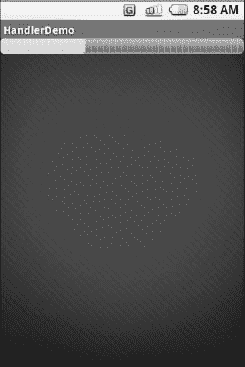
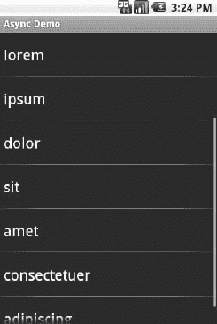

# 二十、处理线程

用户喜欢简洁的应用。用户不喜欢感觉迟钝的应用。让你的应用让用户感觉爽快的方法是使用 Android 内置的标准线程功能。本章将带你了解 Android 中线程管理的相关问题，以及一些保持 UI 简洁和响应的选项。

### 主应用线程

你可能会认为，当你在一个`TextView`上调用`setText()`时，屏幕会立即更新你提供的文本。事情不是这样的。相反，所有修改基于小部件的 UI 的事情都要经过一个消息队列。对`setText()`的调用不更新屏幕；他们只是在队列中弹出一条消息，告诉操作系统更新屏幕。操作系统将这些消息从队列中弹出，并执行消息要求的操作。

队列由一个线程处理，分别称为*主应用线程*和 *UI 线程*。只要该线程能够继续处理消息，屏幕就会更新，用户输入就会被处理，等等。

然而，主应用线程也用于对活动的几乎所有回调。你的`onCreate()`、`onClick()`、`onListItemClick()`以及类似的方法都是在主应用线程上调用的。当您的代码在这些方法中执行时，Android 不会处理队列中的消息，这意味着屏幕不会更新，用户输入不会被处理，等等。

这当然是不好的。事实上，糟糕的是，如果你在主应用线程上花费超过几秒钟的时间，Android 可能会显示可怕的“应用没有响应”(ANR)错误，你的活动可能会被终止。因此，您希望确保您在主应用线程上的所有工作快速进行。这意味着任何缓慢的事情都应该在后台线程中完成，以免占用主应用线程。这包括以下活动:

*   互联网访问，如向 web 服务发送数据或下载图像
*   重要的文件操作，因为闪存存储有时会非常慢
*   任何复杂的计算

幸运的是，Android 支持使用来自 Java 的标准`Thread`类的线程，以及所有你能想到的包装器和控制结构，比如`java.util.concurrent`类包。

然而，有一个很大的限制:您不能从后台线程修改 UI。您只能从主应用线程修改 UI。因此，您需要将长期运行的工作转移到后台线程中，但是这些线程需要做一些事情来安排使用主应用线程更新 UI。Android 提供了大量的工具来做到这一点，这些工具是本章的主要焦点。

### 使用进度条取得进展

如果您打算派生后台线程来代表用户工作，您应该考虑让用户知道工作正在进行。如果用户实际上在等待后台工作完成，这一点尤其正确。

让用户了解进度的典型方法是某种形式的进度条，就像你在许多桌面操作系统中将一堆文件从一个地方复制到另一个地方时看到的那样。Android 通过`ProgressBar`小部件支持这一点。

一个`ProgressBar`跟踪进度，定义为一个整数，`0`表示没有取得任何进展。您可以通过`setMax()`定义范围的最大值——该值表示进度已完成。默认情况下，`ProgressBar`以进度`0`开始，尽管您可以通过`setProgress()`从其他位置开始。如果你希望你的进度条不确定，使用`setIndeterminate()`并将其设置为`true`。

在您的 Java 代码中，您可以积极地设置已经取得的进展量(通过`setProgress()`)或者从当前量增加进展量(通过`incrementProgressBy()`)。你可以通过`getProgress()`了解进展情况。

还有其他显示进度的方法——`ProgressDialog`,活动标题栏中的进度指示器，等等——但是`ProgressBar`是一个很好的起点。

### 通过处理程序

制作 Android 友好的后台线程最灵活的方法是创建一个`Handler`子类的实例。每个活动只需要一个`Handler`对象，不需要手工注册。仅仅创建实例就足以将它注册到 Android 线程子系统。

您的后台线程可以与`Handler`通信，它将在活动的 UI 线程上完成所有工作。这一点很重要，因为 UI 更改(比如更新小部件)应该只发生在活动的 UI 线程上。

与`Handler`通信有两种选择:消息和`Runnable`对象。

#### 消息

要将一个`Message`发送给一个`Handler`，首先调用`obtainMessage()`将`Message`对象从池中取出。有几种风格的`obtainMessage()`，允许您创建空的`Message`对象或填充了消息标识符和参数的对象。您的`Handler`处理需要越复杂，您就越有可能需要将数据放入`Message`来帮助`Handler`区分不同的事件。

然后，通过消息队列将`Message`发送到`Handler`,使用`sendMessage...()`系列方法之一，如下所示:

*   `sendMessage()`:立即将消息放入队列
*   `sendMessageAtFrontOfQueue()`:立即将消息放入队列，并将其放在消息队列的前面(而不是后面，这是默认设置)，因此您的消息优先于所有其他消息
*   `sendMessageAtTime()`:在指定的时间将消息放入队列，根据系统正常运行时间以毫秒表示(`SystemClock.uptimeMillis()`)
*   `sendMessageDelayed()`:延迟一段时间后将消息放入队列，以毫秒表示
*   `sendEmptyMessage()`:向队列发送一个空的`Message`对象，如果您打算让它为空，就可以跳过`obtainMessage()`步骤

为了处理这些消息，您的`Handler`需要实现`handleMessage()`，它将被出现在消息队列中的每条消息调用。在那里，`Handler`可以根据需要更新 UI。然而，它仍然应该很快完成这项工作，因为其他 UI 工作会暂停，直到`Handler`完成。

例如，让我们创建一个`ProgressBar`并通过一个`Handler`更新它。下面是来自`Threads/Handler`示例项目的布局:

`<?xml version="1.0" encoding="utf-8"?>
<LinearLayout xmlns:android="http://schemas.android.com/apk/res/android"
  android:orientation="vertical"
  android:layout_width="fill_parent"
  android:layout_height="fill_parent"
  >
  <ProgressBar android:id="@+id/progress"
    style="?android:attr/progressBarStyleHorizontal"`
`    android:layout_width="fill_parent"
    android:layout_height="wrap_content" />
</LinearLayout>`

除了正常设置宽度和高度之外，`ProgressBar`还使用了`style`属性。这种特殊的风格表明`ProgressBar`应该被绘制成传统的水平条，显示已经完成的工作量。

这是 Java:

`package com.commonsware.android.threads;

import android.app.Activity;
import android.os.Bundle;
import android.os.Handler;
import android.os.Message;
import android.widget.ProgressBar;
import java.util.concurrent.atomic.AtomicBoolean;

public class HandlerDemo extends Activity {
  ProgressBar bar;
  Handler handler=new **Handler**() {
    @Override
    public void **handleMessage**(Message msg) {
      bar.**incrementProgressBy**(5);
    }
  };
  AtomicBoolean isRunning=new **AtomicBoolean**(false);

  @Override
  public void **onCreate**(Bundle icicle) {
    super.**onCreate**(icicle);
    **setContentView**(R.layout.main);
    bar=(ProgressBar)**findViewById**(R.id.progress);
  }

  public void **onStart**() {
    super.**onStart**();
    bar.**setProgress**(0);

    Thread background=new Thread(new **Runnable**() {
      public void **run**() {
        try {
          for (int i=0;i<20 && isRunning.**get**();i++) {
            Thread.**sleep**(1000);
            handler.sendMessage(handler.**obtainMessage**());
          }
        }
        catch (Throwable t) {
          // just end the background thread
        }
      }
    });

    isRunning.**set**(true);
    background.**start**();`
`  }

  public void **onStop**() {
    super.**onStop**();
    isRunning.**set**(false);
  }
}`

作为构建`Activity`的一部分，我们用`handleMessage()`的实现创建了一个`Handler`的实例。基本上，对于收到的任何消息，我们通过`5`点更新`ProgressBar`，然后退出消息处理程序。

然后我们利用`onStart()`和`onStop()`。在`onStart()`中，我们设置了一个后台线程。在真实的系统中，这个线程会做一些有意义的事情。在这里，我们只需休眠 1 秒钟，向`Handler`发送一个`Message`，并重复总共`20`次。由于`ProgressBar`的默认最大值是`100`，这与`ProgressBar`位置的 5 点增加相结合，将使该条在屏幕上清晰行进。您可以通过`setMax()`调整最大值。例如，您可以将最大值设置为正在处理的数据库行数，并且每行更新一次。

注意，我们接着*离开* `onStart()`。这一点至关重要。在活动 UI 线程上调用了`onStart()`方法，因此它可以更新小部件等。然而，这意味着我们需要离开`onStart()`，既要让`Handler`完成工作，又要告诉 Android 我们的活动没有停滞。

产生的活动只是一个水平进度条，如图 Figure 20–1 所示。

**图 20–1。***handler demo 样本应用*

请注意，虽然像这样的`ProgressBar`示例显示了您的代码安排更新 UI 线程的进度，但对于这个特定的小部件，这不是必需的。至少从 Android 1.5 开始，`ProgressBar`现在是 UI 线程安全的，因为你可以从任何线程更新它，它将处理在 UI 线程上执行实际 UI 更新的细节。

#### 不可执行

如果您不想对`Message`对象大惊小怪，您也可以将`Runnable`对象传递给`Handler`，它将在活动 UI 线程上运行这些`Runnable`对象。`Handler`提供了一组`post...()`方法来传递`Runnable`对象进行最终处理。

正如`Handler`支持`post()`和`postDelayed()`将`Runnable`对象添加到事件队列中一样，您可以在任何`View`(即任何小部件或容器)上使用相同的方法。这稍微简化了您的代码，因为您可以跳过`Handler`对象。

### 我的 UI 线程去哪里了？

有时，您可能不知道您当前是否正在应用的 UI 线程上执行。例如，如果您将一些代码打包在一个 JAR 中供其他人重用，您可能不知道您的代码是在 UI 线程上执行还是从后台线程执行。

为了帮助解决这个问题，`Activity`提供了`runOnUiThread()`。这类似于`Handler`和`View`上的`post()`方法，如果你现在不在 UI 线程上，它将一个`Runnable`排队在 UI 线程上运行。如果您已经在 UI 线程上，它会立即调用`Runnable`。这给了你两全其美的好处:如果你在 UI 线程上，没有延迟；如果你不在，也很安全。

### 令人激动的感觉

Android 1.5 引入了后台操作的新思路:`AsyncTask`。在一个(相当)方便的类中，Android 处理所有在 UI 线程和后台线程上工作的杂务。此外，Android 本身会分配和删除那个后台线程。而且，它保持了一个小的工作队列，进一步强调了“一劳永逸”的感觉。

#### 理论

有一种说法在营销界很流行，“当一个人在五金店买 1/4 英寸的钻头时，他想要的不是 1/4 英寸的钻头，而是 1/4 英寸的孔。”五金店不能卖洞，所以他们卖退而求其次的东西:让打洞变得容易的设备(钻子和钻头)。

同样，一直纠结于后台线程管理的 Android 开发者，严格来说也不是想要后台线程。相反，他们希望工作在 UI 线程之外完成，这样用户就不会陷入等待，活动也不会出现可怕的 ANR 错误。虽然 Android 不能神奇地让工作不消耗 UI 线程时间，但它可以提供一些东西，使这种后台操作更容易、更透明。`AsyncTask`就是这样一个例子。

要使用`AsyncTask`，您必须执行以下操作:

*   创建`AsyncTask`的子类，通常作为使用任务的私有内部类(例如，活动)
*   覆盖一个或多个`AsyncTask`方法来完成后台工作，以及与需要在 UI 线程上完成的任务相关的任何工作(例如，更新进度)
*   需要时，创建一个`AsyncTask`子类的实例并调用`execute()`让它开始工作

你需要做的是

*   创建自己的后台线程
*   在适当时候终止后台线程
*   调用各种方法来安排在 UI 线程上完成的处理

#### AsyncTask、泛型和 Varargs

创建`AsyncTask`的子类不像实现`Runnable`接口那么简单。`AsyncTask`使用泛型，因此需要指定三种数据类型:

*   处理任务所需的信息类型(例如，要下载的 URL)
*   在任务中传递以指示进度的信息类型
*   任务完成时传递给任务后代码的信息类型

更令人困惑的是，前两个数据类型实际上被用作 varargs，这意味着在您的`AsyncTask`子类中使用了这些类型的数组。

当我们朝着一个例子前进时，这一点会变得更加清楚。

#### 异步任务的各个阶段

你可以在`AsyncTask`中忽略四种方法来实现你的目标。

为了使任务类有用，您必须覆盖的是`doInBackground()`。这将由`AsyncTask`在后台线程上调用。只要有必要，它就可以运行，以完成这个特定任务需要完成的任何工作。不过，请注意，任务是有限的；不建议对无限循环使用`AsyncTask`。

`doInBackground()`方法将接收一个 varargs 数组作为参数，该数组是上一节中列出的三种数据类型中的第一种——处理任务所需的数据。因此，如果您的任务是下载一组 URL，`doInBackground()`将接收这些 URL 进行处理。`doInBackground()`方法必须返回前一节中列出的第三种数据类型的值——后台工作的结果。

您可能希望覆盖`onPreExecute()`。在后台线程执行`doInBackground()`之前，从 UI 线程调用这个方法。在这里，您可以初始化一个`ProgressBar`，或者指示后台工作正在开始。

此外，您可能希望覆盖`onPostExecute()`。在`doInBackground()`完成之后，从 UI 线程调用这个方法。它接收由`doInBackground()`返回的值作为参数(例如，成功或失败标志)。在这里，您可以关闭`ProgressBar`并利用后台完成的工作，比如更新列表的内容。

此外，您可能希望覆盖`onProgressUpdate()`。如果`doInBackground()`调用任务的`publishProgress()`方法，传递给该方法的对象被提供给`onProgressUpdate()`，但是在 UI 线程中。这样，`onProgressUpdate()`可以提醒用户后台工作的进展，比如更新`ProgressBar`或者继续播放动画。`onProgressUpdate()`方法将从前面的列表中接收第二种数据类型的 varargs 由`doInBackground()`通过`publishProgress()`发布的数据。

#### 一个示例任务

如前所述，实现一个`AsyncTask`不像实现一个`Runnable`那么容易。然而，一旦你过了泛型和 varargs 这一关，就不会太糟糕了。

例如，下面是一个来自`Threads/Asyncer`示例项目的`ListActivity`的实现，它使用了一个`AsyncTask`:

`package com.commonsware.android.async;

import android.app.ListActivity;
import android.os.AsyncTask;
import android.os.Bundle;
import android.os.SystemClock;
import android.widget.ArrayAdapter;
import android.widget.Toast;
import java.util.ArrayList;`

`public class AsyncDemo extends ListActivity {
  private static final String[] items={"lorem", "ipsum", "dolor",
                                     "sit", "amet", "consectetuer",
                                     "adipiscing", "elit", "morbi",
                                     "vel", "ligula", "vitae",
                                     "arcu", "aliquet", "mollis",
                                     "etiam", "vel", "erat",
                                     "placerat", "ante",
                                     "porttitor", "sodales",
                                     "pellentesque", "augue",
                                     "purus"};
  @Override
  public void **onCreate**(Bundle savedInstanceState) {
    super.**onCreate**(savedInstanceState);
    **setContentView**(R.layout.main);

    **setListAdapter**(new ArrayAdapter<String>(this,
                       android.R.layout.simple_list_item_1,
                       new **ArrayList**()));

    new AddStringTask().**execute**();
  }

  class AddStringTask extends AsyncTask<Void, String, Void> {
    @Override
    protected Void **doInBackground**(Void... unused) {
      for (String item : items) {
        **publishProgress**(item);
        SystemClock.**sleep**(200);
      }

      return(null);
    }

    @Override
    protected void **onProgressUpdate**(String... item) {
      ((ArrayAdapter)getListAdapter()).**add**(item[0]);
    }

    @Override
    protected void **onPostExecute**(Void unused) {
      Toast
        **.makeText**(AsyncDemo.this, "Done!", Toast.LENGTH_SHORT)
        **.show**();
    }
  }
}`

这是本书中频繁使用的词汇列表的另一个变体。这一次，我们不是简单地将单词列表交给一个`ArrayAdapter`，而是模拟使用我们的`AsyncTask`实现`AddStringTask`在后台创建这些单词。

让我们一段一段地检查这个项目的代码。

##### addstring task 声明

`AddStringTask`声明如下:

`class AddStringTask extends AsyncTask<Void, String, Void> {`

这里，我们使用泛型来设置我们将在`AddStringTask`中利用的特定数据类型:

*   在这种情况下，我们不需要任何配置信息，所以我们的第一个类型是`Void`。
*   我们希望将我们的后台任务生成的每个字符串传递给`onProgressUpdate()`，以允许我们将它添加到我们的列表中，所以我们的第二个类型是`String`。
*   严格地说，我们没有任何结果(除了更新)，所以我们的第三种类型是`Void`。

##### doInBackground()方法

代码中的下一步是`doInBackground()`方法:

`@Override
protected Void **doInBackground**(Void... unused) {
  for (String item : items) {
    **publishProgress**(item);
    SystemClock.**sleep**(200);
  }

  return(null);
}`

在后台线程中调用`doInBackground()`方法。因此，我们喜欢多久就多久。在一个生产应用中，我们可能会做一些类似于遍历一个 URL 列表并下载每个 URL 的事情。在这里，我们迭代我们的静态列表 *lorem ipsum* 单词，为每个单词调用`publishProgress()`，然后休眠 200 毫秒来模拟正在完成的实际工作。

既然我们选择了没有配置信息，我们应该不需要参数来`doInBackground()`。然而，与`AsyncTask`的约定说我们必须接受第一个数据类型的 varargs，这就是为什么我们的方法参数是`Void... unused`。

既然我们选择了没有结果，我们应该不需要返回任何东西。尽管如此，与`AsyncTask`的契约说我们必须返回第三种数据类型的对象。由于数据类型是`Void`，我们返回的对象是`null`。

##### onProgressUpdate()方法

接下来是`onProgressUpdate()`方法:

`@Override
protected void **onProgressUpdate**(String... item) {
  ((ArrayAdapter)getListAdapter()).**add**(item[0]);
}`

在 UI 线程上调用了`onProgressUpdate()`方法，我们想做一些事情让用户知道我们在加载这些字符串方面取得了进展。在这种情况下，我们简单地将字符串添加到`ArrayAdapter`中，因此它被追加到列表的末尾。

`onProgressUpdate()`方法接收一个`String...` varargs，因为这是我们的类声明中的第二个数据类型。因为我们每次调用`publishProgress()`只传递一个字符串，所以我们只需要检查 varargs 数组中的第一个条目。

##### onPostExecute()方法

下一个方法是`onPostExecute()`:

`@Override
protected void **onPostExecute**(Void unused) {
  Toast
    .**makeText**(AsyncDemo.this, "Done!", Toast.LENGTH_SHORT)
    .**show**();
}`

在 UI 线程上调用了`onPostExecute()`方法，我们想做一些事情来表示后台工作已经完成。在一个真实的系统中，可能会有一些`ProgressBar`被解除或者一些动画被停止。在这里，我们简单地举一个`Toast`。

既然我们选择了没有结果，我们应该不需要任何参数。与`AsyncTask`的合同规定我们必须接受第三种数据类型的单个值。因为数据类型是`Void`，我们方法参数是`Void unused`。

##### 活动

该活动如下:

`new AddStringTask().**execute**();`

要使用`AddStringTask`，我们只需创建一个实例并在其上调用`execute()`。这启动了一系列事件，最终导致后台线程完成其工作。

如果`AddStringTask`需要配置参数，我们将不会使用`Void`作为我们的第一个数据类型，构造函数将接受零个或多个已定义类型的参数。这些价值最终会传递给`doInBackground()`。

##### 结果

如果您构建、安装并运行这个项目，您将会看到列表在几秒钟内被实时填充，然后是一个表示完成的`Toast`，如图 20–2 中的所示。

**图 20–2。***async demo，中途加载单词列表*

### 螺纹和旋转

活动在方向改变时经历的默认破坏-创建循环的一个问题来自后台线程。如果活动已经开始了一些后台工作——例如，通过一个`AsyncTask`——然后活动被销毁并重新创建，那么`AsyncTask`需要以某种方式知道这一点。否则，`AsyncTask`很可能会将更新和最终结果发送给旧的活动，而新的活动对此一无所知。事实上，新活动可能会再次开始后台工作*，浪费资源。*

 *处理这个问题的一种方法是通过接管配置更改来禁用销毁-创建循环，如前一节所述。另一个选择是进行更聪明的活动。您可以在`Rotation/RotationAsync`示例项目中看到这样的例子。如下所示，这个项目使用了一个`ProgressBar`，很像本章前面的`Handler`演示。它还有一个`TextView`来指示后台工作何时完成，最初是不可见的。

`<?xml version="1.0" encoding="utf-8"?>
<LinearLayout xmlns:android="http://schemas.android.com/apk/res/android"
    android:orientation="vertical"`
`    android:layout_width="fill_parent"
    android:layout_height="fill_parent"
    >
  <ProgressBar android:id="@+id/progress"
    style="?android:attr/progressBarStyleHorizontal"
    android:layout_width="fill_parent"
    android:layout_height="wrap_content"
  />
  <TextView android:id="@+id/completed"
      android:layout_width="fill_parent"
      android:layout_height="wrap_content"
      android:text="Work completed!"
      android:visibility="invisible"
  />
</LinearLayout>`

“业务逻辑”是让一个`AsyncTask`在后台做一些(假的)工作，一路更新`ProgressBar`，并在完成时使`TextView`可见。更重要的是，如果屏幕被旋转，它需要以这样的方式正确地运行。这意味着:

*   我们不能“失去”我们的`AsyncTask`，让它继续工作并更新错误的活动。
*   我们不能开始第二个`AsyncTask`，从而加倍我们的工作量。
*   我们需要让 UI 正确地反映我们工作的进度或完成情况。

#### 手工活动协会

前面，本章展示了作为`Activity`类的常规内部类实现的`AsyncTask`的使用。当你不关心旋转时，这很有效。例如，如果`AsyncTask`不影响 UI——比如上传照片——旋转对你来说就不是问题。将`AsyncTask`作为`Activity`的内部类意味着您可以随时访问任何需要`Context`的地方的活动。

然而，对于旋转场景，常规的内部类将很难工作。`AsyncTask`会认为它知道应该与哪个`Activity`一起工作，但实际上它会保持对旧活动的隐式引用，而不是在方向改变后。

所以，在`RotationAsync`中，`RotationAwareTask`类是一个静态内部类。这意味着`RotationAwareTask`没有任何对任何`RotationAsyncActivity`(旧的或新的)的隐式引用:

`import android.app.Activity;
import android.os.AsyncTask;
import android.os.Bundle;
import android.os.SystemClock;
import android.util.Log;
import android.view.View;
import android.widget.ProgressBar;`

`public class RotationAsync extends Activity {
  private ProgressBar bar=null;
  private RotationAwareTask task=null;

  @Override
  public void **onCreate**(Bundle savedInstanceState) {
    super.**onCreate**(savedInstanceState);
    **setContentView**(R.layout.main);

    bar=(ProgressBar)**findViewById**(R.id.progress);

    task=(RotationAwareTask)**getLastNonConfigurationInstance**();

    if (task==null) {
      task=new **RotationAwareTask**(this);
      task.**execute**();
    }
    else {
      task.**attach**(this);
      updateProgress(task.**getProgress**());

      if (task.**getProgress**()>=100) {
        **markAsDone**();
      }
    }
  }

  @Override
  public Object **onRetainNonConfigurationInstance**() {
    task.**detach**();

    return(task);
  }

  void **updateProgress**(int progress) {
    bar.**setProgress**(progress);
  }

  void **markAsDone**() {
    findViewById(R.id.completed).**setVisibility**(View.VISIBLE);
  }

  static class RotationAwareTask extends AsyncTask<Void, Void, Void> {
    RotationAsync activity=null;
    int progress=0;

    **RotationAwareTask**(RotationAsync activity) {
      **attach**(activity);
    }

    @Override
    protected Void **doInBackground**(Void... unused) {
      for (int i=0;i<20;i++) {
        SystemClock.**sleep**(500);
        **publishProgress**();
      }`

`      **return(null);**
    }

    **@Override**
    protected void **onProgressUpdate**(Void... unused) {
      if (activity==null) {
        Log.w("RotationAsync", "onProgressUpdate() skipped – no activity");
      }
      else {
        progress+=5;
        activity.**updateProgress**(progress);
      }
    }

    @Override
    protected void **onPostExecute**(Void unused) {
      if (activity==null) {
        Log.w("RotationAsync", "onPostExecute() skipped – no activity");
      }
      else {
        activity.**markAsDone**();
      }
    }

    void **detach**() {
      activity=null;
    }

    void **attach**(RotationAsync activity) {
      this.activity=activity;
    }

    int **getProgress**() {
      return(progress);
    }
  }
}`

因为我们希望`RotationAwareTask`更新当前的`RotationAsyncActivity`，所以我们在创建任务时通过构造函数提供了那个`Activity`。`RotationAwareTask`也有`attach()`和`detach()`方法来改变任务所知道的`Activity`，我们很快就会看到。

#### 事件的流程

当`RotationAsync`第一次启动时，它创建一个`RotationAwareTask`类的新实例并执行它。在这一点上，任务有了对`RotationAsyncActivity`的引用，并且可以做它的(假的)工作，告诉`RotationAsync`在这个过程中更新进度。

现在，假设在`doInBackground()`处理过程中，用户旋转屏幕。我们的`Activity`将用`onRetainNonConfigurationInstance()`来称呼。在这里，我们想做两件事:

*   由于这个`Activity`实例正在被销毁，我们需要确保任务不再持有对它的引用。因此，我们调用`detach()`，使任务将其`RotationAsync`数据成员(`activity`)设置为`null`。
*   我们返回`RotationAwareTask`对象，这样我们的新`RotationAsync`实例就可以访问它。

最终，新的`RotationAsync`实例将被创建。在`onCreate()`中，我们试图通过`getLastNonConfigurationInstance()`访问任何当前的`RotationAwareTask`实例。如果那是`null`，那么我们知道这是一个新创建的活动，因此我们创建了一个新任务。然而，如果`getLastNonConfigurationInstance()`从旧的`RotationAsync`实例中返回了任务对象，我们就保留它并更新我们的 UI 以反映当前已经取得的进展。我们还将新的`RotationAsync`添加到`RotationAwareTask`中，这样随着进一步的进展，任务可以通知适当的活动。

最终结果是我们的`ProgressBar`平稳地从`0`进展到`100`，即使轮换正在进行。

#### 为什么会这样

Android 中的大多数回调方法都是由主应用线程正在处理的消息队列中的消息驱动的。通常，只要主应用线程不忙，比如运行我们的代码，就会处理这个队列。然而，当配置发生变化时，比如屏幕旋转，这就不再成立了。在调用旧活动的`onRetainNonConfigurationInstance()`实例和完成新活动的`onCreate()`之间，消息队列保持不变。

所以，让我们假设，在`onRetainNonConfigurationInstance()`活动和随后的`onCreate()`之间，我们的`AsyncTask`的后台工作完成了。这将触发`onPostExecute()`被调用...最终。然而，由于`onPostExecute()`实际上是从消息队列中的一条消息启动的，所以在我们的`onCreate()`完成之前`onPostExecute()`不会被调用。因此，我们的`AsyncTask`可以在配置更改期间保持运行，只要我们做两件事:

*   在新活动实例的`onCreate()`中，我们更新了`AsyncTask`,让它与我们的新活动一起工作，而不是与旧活动一起工作。
*   我们不尝试使用来自`doInBackground()`的活动。

### 现在，注意事项

背景线程，虽然使用 Android `Handler`系统非常可能，但并不都是快乐和温暖的小狗。后台线程不仅增加了复杂性，而且在可用内存、CPU 和电池寿命方面也有实际成本。因此，你需要用你的后台线程考虑各种各样的场景，包括如下:

*   当后台线程运行时，用户可能会与您的活动的 UI 进行交互。如果后台线程正在做的工作被用户输入改变或无效，您需要将这一情况通知后台线程。Android 在`java.util.concurrent`包中包含了许多类，可以帮助你安全地与后台线程通信。
*   当后台工作正在进行时，活动被取消的可能性。例如，在开始你的活动后，用户可能有一个电话进来，接着是一条短信，然后需要查找一个联系人——所有这些可能足以将你的活动踢出记忆。第十八章涵盖了 Android 将带你的活动经历的各种事件；挂钩到正确的线程，并确保在有机会时干净地关闭后台线程。
*   如果你浪费了大量的 CPU 时间和电池寿命却没有任何回报，用户可能会被激怒。从战术上来说，这意味着使用`ProgressBar`或其他方式让用户知道有事情正在发生。从战略上来说，这意味着您仍然需要高效地工作——后台线程不是处理缓慢或无意义代码的灵丹妙药。
*   在后台处理过程中遇到错误的可能性。例如，如果您从互联网上收集信息，设备可能会失去连接。通过一个通知来提醒用户这个问题(在第三十七章中有介绍)并关闭后台线程可能是你最好的选择。*