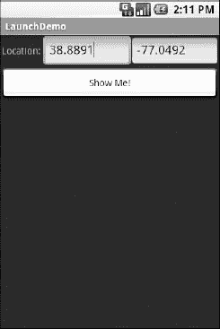
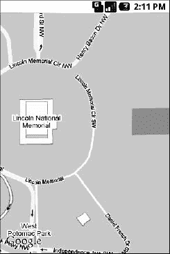

# 二十二、启动活动和子活动

Android UI 架构背后的理论是，开发人员应该将他们的应用分解成不同的活动。例如，日历应用可以具有用于查看日历、查看单个事件、编辑事件(包括添加新事件)、在同一屏幕上查看和编辑事件以进行更大显示等活动。这意味着您的一个活动有办法启动另一个活动。例如，如果用户从视图-日历活动中选择了一个事件，您可能希望显示该事件的视图-事件活动。这意味着您需要能够启动 view-event 活动并显示特定的事件(用户选择的事件)。

这可以进一步分为两种情况:

*   您知道要启动哪个活动，可能是因为它是您自己的应用中的另一个活动。
*   您有一个内容`Uri`来做一些事情，并且您希望您的用户能够用它来做一些事情，但是您事先不知道选项是什么。

本章涵盖了第一种情况；第二个超出了本书的范围。

### 同级和下级

当你决定发起一项活动时，你需要回答的一个关键问题是:你的活动需要知道发起的活动何时结束吗？

例如，假设您想要生成一个活动来收集您正在连接的某个 web 服务的身份验证信息——为了使用 OAuth 服务，您可能需要使用 OpenID 进行身份验证。在这种情况下，您的主活动将需要知道身份验证何时完成，以便它可以开始使用 web 服务。

另一方面，想象一下 Android 中的电子邮件应用。当用户选择查看附件时，您和用户都不一定希望主活动知道用户何时完成了对附件的查看。

在第一个场景中，已启动的活动显然从属于启动活动。在这种情况下，您可能希望将子活动作为子活动启动，这意味着当子活动完成时，您的活动将得到通知。

在第二个场景中，启动的活动更像是您的活动的对等体，因此您可能希望像启动常规活动一样启动子活动。孩子做完了你的活动不会被通知，但是，话说回来，你的活动真的不需要知道。

### 启动它们

开始一项活动的两个要素是一个意图和你如何开始的选择。

#### 制定一个意图

正如前一章所讨论的，intents 封装了对 Android 的请求，请求一些活动或其他接收者做一些事情。如果您想要启动的活动是您自己的，您可能会发现创建一个明确的意图是最简单的，命名您想要启动的组件。例如，在您的活动中，您可以创建如下意图:

`new **Intent**(this, HelpActivity.class);`

这规定了你要发射`HelpActivity`。这个活动需要在您的`AndroidManifest.xml`文件中命名，尽管不需要任何意图过滤器，因为您试图直接请求它。

或者，您可以为某个`Uri`组织一个意图，请求一个特定的操作:

`Uri uri=Uri.**parse**("geo:"+lat.**toString**()+","+lon.**toString**());
Intent i=new **Intent**(Intent.ACTION_VIEW, uri);`

这里，假设您有类型为`Double`的某个位置的纬度和经度(分别为`lat`和`lon`，您构建了一个`geo`方案`Uri`，并创建了一个请求查看这个`Uri` ( `ACTION_VIEW`)的意图。

#### 打电话

一旦你有了你的意图，你需要把它传递给 Android 并启动子活动。您有两个主要选项(以及一些更高级/更专业的变体):

*   最简单的选择是用`Intent`调用`startActivity()`。这将导致 Android 找到最匹配的活动，并将意图传递给它进行处理。当子活动完成时，您的活动不会得到通知。
*   您可以调用`startActivityForResult()`，向其传递`Intent`和一个数字(对于调用活动是唯一的)。Android 将找到最匹配的活动，并将意图传递给它进行处理。当子活动完成时，您的活动将通过`onActivityResult()`回调得到通知。
*   在某些情况下，您可能希望或需要条件启动、批量启动等。的活动。像`startActivities()`、`startActivityFromFragment()`和`startActivityIfNeeded()`这样的附加方法可以帮助处理这些情况。

如上所述，使用`startActivityForResult()`，您可以实现`onActivityResult()`回调，以便在子活动完成其工作时得到通知。回调接收提供给`startActivityForResult()`的唯一编号，因此您可以确定哪个子活动已经完成。您还会得到以下内容:

*   一个结果代码，来自调用`setResult()`的子活动。通常，这是`RESULT_OK`或`RESULT_CANCELED`，尽管您可以创建自己的返回代码(选择一个以`RESULT_FIRST_USER`开头的数字)。
*   可选的`String`包含一些结果数据，可能是一些内部或外部资源的 URL。例如，`ACTION_PICK`意图通常通过这个数据字符串返回内容的选定位。
*   可选的`Bundle`包含结果代码和数据字符串之外的附加信息。

为了演示如何启动一个 peer 活动，请看一下`Activities/Launch`示例应用。XML 布局相当简单:两个纬度和经度字段，外加一个按钮。

`<?xml version="1.0" encoding="utf-8"?>
<LinearLayout xmlns:android="http://schemas.android.com/apk/res/android"
  android:orientation="vertical"
  android:layout_width="fill_parent"
  android:layout_height="fill_parent"
  >
  <TableLayout
    android:layout_width="fill_parent"
    android:layout_height="wrap_content"
    android:stretchColumns="1,2"
  >
    <TableRow>
      <TextView
        android:layout_width="wrap_content"
        android:layout_height="wrap_content"
        android:paddingLeft="2dip"
        android:paddingRight="4dip"
        android:text="Location:"
      />
      <EditText android:id="@+id/lat"
        android:layout_width="fill_parent"
        android:layout_height="wrap_content"
        android:cursorVisible="true"
        android:editable="true"
        android:singleLine="true"` `        android:layout_weight="1"
      />
      <EditText android:id="@+id/lon"
        android:layout_width="fill_parent"
        android:layout_height="wrap_content"
        android:cursorVisible="true"
        android:editable="true"
        android:singleLine="true"
        android:layout_weight="1"
      />
    </TableRow>
  </TableLayout>
  <Button android:id="@+id/map"
    android:layout_width="fill_parent"
    android:layout_height="wrap_content"
    android:text="Show Me!"
    android:onClick="showMe"
  />
</LinearLayout>`

按钮的`showMe()`回调方法简单地获取纬度和经度，将它们倒入一个`geo`方案`Uri`，然后开始活动:

`packagecom.commonsware.android.activities;

import android.app.Activity;
import android.content.Intent;
import android.net.Uri;
import android.os.Bundle;
import android.view.View;
import android.widget.EditText;

public class LaunchDemo extends Activity {
  private EditText lat;
  private EditText lon;

  @Override
  public void **onCreate**(Bundle icicle) {
    super.**onCreate**(icicle);
    **setContentView**(R.layout.main);

    lat=(EditText)**findViewById**(R.id.lat);
    lon=(EditText)**findViewById**(R.id.lon);
  }

  public void **showMe**(View v) {
    String _lat=lat.**getText**().**toString**();
    String _lon=lon.**getText**().**toString**();
    Uri uri=Uri.**parse**("geo:"+_lat+","+_lon);

    **startActivity**(new Intent(Intent.ACTION_VIEW, uri));
  }
}`

我们保持了非常基本的活动，以便将重点放在处理地理意图的主题上。我们开始如图 22–1 所示。

**图 22–1。***launch demo 示例应用，位置填写为*

如果你填写一个位置(如纬度 38.8891，经度-77.0492)并点击按钮，得到的地图会更有趣，如图图 22–2 所示。请注意，这是内置的 Android 地图活动——我们没有创建自己的活动来显示该地图。

**图 22–2。***launch demo 推出的地图，显示了 DC 的林肯纪念堂*

在第四十章中，你将看到如何在自己的活动中创建地图，以防你需要更好地控制地图的显示方式。

**注意:**这个`geo:Intent`只能在安装了谷歌地图的设备或模拟器上运行，或者在安装了其他支持`geo:` URL 的地图应用的设备上运行。

### 类似于标签式浏览

现代桌面网络浏览器的主要特征之一是选项卡式浏览，其中单个浏览器窗口可以显示跨越一系列选项卡的几个页面。在移动设备上，这可能没有太大意义，因为你失去了选项卡本身的屏幕空间。然而，在本书中，我们不会让感性这样的小事阻止我们，所以这一节使用`TabActivity`和`Intent`对象演示了一个选项卡式浏览器。

您可能还记得第十四章的“将它放在我的选项卡上”一节，一个选项卡可以有一个`View`或一个`Activity`作为它的内容。如果您想使用一个`Activity`作为选项卡的内容，您提供一个`Intent`，它将启动所需的`Activity`；Android 的标签管理框架会将`Activity`的用户界面注入到标签中。

你的本能可能是使用`http: Uri`，就像我们在前面的例子中使用`geo: Uri`一样:

`Intent i=new **Intent**(Intent.ACTION_VIEW);
i.**setData**(Uri.**parse**("http://commonsware.com"));`

这样，您可以使用内置的浏览器应用，并获得它提供的所有功能。唉，这不管用。您不能在选项卡中主持其他应用的活动；出于安全原因，只允许您自己的活动。所以，我们从第十五章中掸掉我们的`WebView`演示，并使用它们，重新包装成`Activities/IntentTab`。

下面是主活动的源代码，它托管了`TabView`:

`package com.commonsware.android.intenttab;

import android.app.Activity;
import android.app.TabActivity;
import android.content.Intent;
import android.net.Uri;
import android.os.Bundle;
import android.webkit.WebView;
import android.widget.TabHost;

public class IntentTabDemo extends TabActivity {
  @Override
  public void **onCreate**(Bundle savedInstanceState) {
    super.**onCreate**(savedInstanceState);

    TabHost host=**getTabHost**();` `    Intent i=new **Intent**(this, CWBrowser.class);

    i.**putExtra**(CWBrowser.URL, "http://commonsware.com");
    host.**addTab**(host.**newTabSpec**("one")
            .**setIndicator**("CW")
            .**setContent**(i));

    i=new **Intent**(i);
    i.**putExtra**(CWBrowser.URL, "http://www.android.com");
    host.**addTab**(host.**newTabSpec**("two")
            .**setIndicator**("Android")
            .**setContent**(i));
  }
}`

如您所见，我们使用`TabActivity`作为基类，因此我们不需要自己的布局 XML— `TabActivity`为我们提供了它。我们所做的就是访问`TabHost`并添加两个选项卡，每个选项卡指定一个直接引用另一个类的`Intent`。在这种情况下，我们的两个选项卡将各自拥有一个`CWBrowser`，通过一个额外的`Intent`提供一个 URL 来加载。

`CWBrowser`活动是对早期浏览器演示的简单修改:

`package com.commonsware.android.intenttab;

import android.app.Activity;
import android.content.Intent;
import android.net.Uri;
import android.os.Bundle;
import android.webkit.WebView;

public class CWBrowser extends Activity {
  public static final String URL="com.commonsware.android.intenttab.URL";
  private WebView browser;

  @Override
  public void **onCreate**(Bundle icicle) {
    super.**onCreate**(icicle);

    browser=new **WebView**(this);
    **setContentView**(browser);
    browser.**loadUrl**(**getIntent**().**getStringExtra**(URL));
  }
}`

他们只需在浏览器中加载不同的 URL:一个是 CommonsWare 主页，另一个是 Android 主页。

由此产生的用户界面显示了标签式浏览在 Android 上的样子，如图图 22–3 和图 22–4 所示。

**图 22–3。**??【IntentTabDemo 示例应用，显示第一个选项卡

**图 22–4。***IntentTabDemo 示例应用，显示第二个选项卡*

然而，这种方法相当浪费。创建一个活动有相当大的开销，您不需要仅仅填充`TabHost`中的选项卡。特别是，它增加了你的应用所需的堆栈空间，堆栈空间的耗尽是 Android 中的一个重大问题，这将在后面的章节中描述。