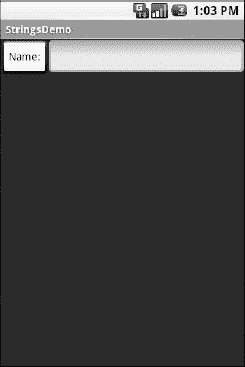
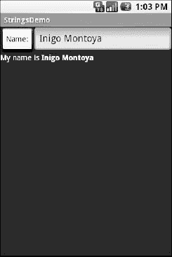
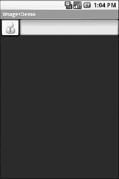
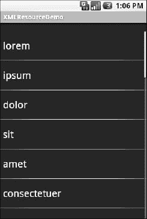

# 二十三、使用资源

资源是保存在 Java 源代码之外的静态信息。你已经在本书的例子中经常看到一种类型的资源——布局。还有许多其他类型的资源，比如图像和字符串，您可以在 Android 应用中加以利用。

### 资源阵容

资源作为文件存储在 Android 项目布局中的`res/`目录下。除了原始资源(`res/raw/`)，所有其他类型的资源都由 Android 打包系统或设备或仿真器上的 Android 系统为您解析。因此，例如，当您通过布局资源(`res/layout/`)布局一个活动的 UI 时，您不必自己解析布局 XML，因为 Android 会为您处理。

除了布局资源(在第八章的中介绍)，还有其他几种类型的资源可供您使用，包括:

*   图像(`res/drawable-mdpi/`、`res/drawable-ldpi`等)。)，用于在用户界面中放置静态图标、图像、照片或其他图片
*   Raw ( `res/raw/`)，用于对您的应用有意义但对 Android 框架不一定有意义的任意文件
*   字符串、颜色、数组和维度(`res/values/`)，用于给这些类型的常量赋予符号名称，并使它们与代码的其余部分分开(例如，用于国际化和本地化)
*   XML ( `res/xml/`)，用于包含您自己的数据和结构的静态 XML 文件

### 弦论

将标签和其他文本放在应用的主要源代码之外通常被认为是一个非常好的主意。特别是，它有助于国际化和本地化，这将在本章后面的“不同人使用不同的笔画”一节中讨论。即使你不打算把你的字符串翻译成其他语言，如果所有的字符串都在一个地方而不是分散在你的源代码中，修改起来会更容易。

Android 支持常规的外部化字符串，以及*字符串格式*，其中字符串有动态插入信息的占位符。最重要的是，Android 支持简单的文本格式，称为*风格的文本*，因此你可以将你的文字加粗或斜体与普通文本混合在一起。

#### 普通字符串

一般来说，对于普通字符串，您所需要的只是一个位于`res/values`目录中的 XML 文件(通常命名为`res/values/strings.xml`)，带有一个`resources`根元素，以及一个针对您希望编码为资源的每个字符串的子`string`元素。`string`元素采用了一个`name`属性(该属性是该字符串的唯一名称)和一个包含该字符串文本的文本元素，如下例所示:

`<resources>
  <string name="quick">The quick brown fox...</string>
  <string name="laughs">He who laughs last...</string>
</resources>`

唯一棘手的部分是字符串值是否包含引号(`"`)或撇号(`'`)。在这种情况下，您可能希望通过在这些值前面加一个反斜杠来对它们进行转义(例如，`These are the times that try men\'s souls.`)。或者，如果它只是一个撇号，您可以用引号将值括起来(例如，`"These are the times that try men's souls."`)。

然后，您可以从布局文件中引用该字符串(如`@string/...`，其中省略号是唯一的名称，如`@string/laughs`)。或者您可以通过使用字符串资源的资源 ID 调用`getString()`从您的 Java 代码中获取字符串，该资源 ID 是以`R.string.`为前缀的唯一名称(例如`getString(R.string.quick)`)。

#### 字符串格式

与 Java 语言的其他实现一样，Android 的 Dalvik 虚拟机支持字符串格式。这里，字符串包含占位符，表示在运行时将被变量信息替换的数据(例如，`My name is %1$s`)。存储为资源的普通字符串可以用作字符串格式:

`String strFormat=**getString**(R.string.my_name);
String strResult=String.**format**(strFormat, "Tim");
((TextView)**findViewById**(R.id.some_label)).**setText**(strResult);`

还有一种`getString()`的味道，那就是`String.format()`在召唤你:

`String strResult=**getString**(R.string.my_name, "Tim");
((TextView)**findViewById**(R.id.some_label)).**setText**(strResult);`

使用带索引的占位符版本— `%1$s`而不仅仅是`%s`是非常重要的。从策略上讲，字符串资源的翻译可能会导致您以不同于原始翻译的顺序应用变量数据，并且使用无索引占位符会将您锁定在特定的顺序。从战术上讲，你的项目将无法编译，因为现在 Android 构建工具拒绝无索引占位符。

#### 样式化文本

如果您想要真正丰富的文本，您应该拥有包含 HTML 的原始资源，然后将这些资源注入一个 WebKit 小部件。然而，对于轻量级的 HTML 格式，使用诸如`<b>`、`<i>`和`<u>`之类的行内元素，您可以在字符串资源中使用它们:

`<resources>
  <string name="b">This has <b>bold</b> in it.</string>
  <string name="i">Whereas this has <i>italics</i>!</string>
</resources>`

您可以通过`getText()`来访问它们，这给了您一个支持`android.text.Spanned`接口的对象，因此应用了所有的格式:

`((TextView)**findViewById**(R.id.another_label))
            **.setText(getText**(R.string.b));`

#### 样式化的文本和格式

样式化的文本变得棘手的地方是样式化的字符串格式，因为`String.format()`作用于`String`对象，而不是带有格式指令的`Spanned`对象。如果您真的想拥有样式化的字符串格式，以下是解决方法:

1.  实体-转义字符串资源中的尖括号(如`this is &lt;b&gt;%1$s&lt;/b&gt;`)。
2.  正常检索字符串资源，尽管此时不会对其进行样式化(例如，`getString(R.string.funky_format)`)。
3.  生成格式结果，确保转义您替换的任何字符串值，以防它们包含尖括号或&符号:`String.**format(getString**(R.string.funky_format),
                  TextUtils.**htmlEncode**(strName));`
4.  通过`Html.fromHtml()` : `someTextView.setText(Html
                         **.fromHtml**(resultFromStringFormat));`将实体转义的 HTML 转换成`Spanned`对象

要了解这一点，我们来看一下`Resources/Strings`演示。以下是布局文件:

`<?xml version="1.0" encoding="utf-8"?>
<LinearLayout xmlns:android="http://schemas.android.com/apk/res/android"
  android:orientation="vertical"
  android:layout_width="fill_parent"
  android:layout_height="fill_parent"
  >
  <LinearLayout
    android:orientation="horizontal"
    android:layout_width="fill_parent"
    android:layout_height="wrap_content"
    >
    <Button android:id="@+id/format"
      android:layout_width="wrap_content"
      android:layout_height="wrap_content"
      android:text="@string/btn_name"
      android:onClick="applyFormat"
      />
    <EditText android:id="@+id/name"
      android:layout_width="fill_parent"
      android:layout_height="wrap_content"
      />
  </LinearLayout>
  <TextView android:id="@+id/result"
    android:layout_width="fill_parent"
    android:layout_height="wrap_content"
    />
</LinearLayout>`

如您所见，它只是一个按钮、一个字段和一个标签。这个想法是让用户在字段中输入他们的名字，然后单击按钮，用包含他们名字的格式化消息更新标签。

布局文件中的`Button`引用了一个字符串资源(`@string/btn_name`)，所以我们需要一个字符串资源文件(`res/values/strings.xml`):

`<?xml version="1.0" encoding="utf-8"?>
<resources>
  <string name="app_name">StringsDemo</string>
  <string name="btn_name">Name:</string>
  <string name="funky_format">My name is &lt;b&gt;%1$s&lt;/b&gt;</string>
</resources>`

`app_name`资源由`android create project`命令自动创建。`btn_name`字符串是`Button`的标题，而我们样式化的字符串格式在`funky_format`中。

最后，为了将所有这些联系在一起，我们需要一些 Java:

`package com.commonsware.android.strings;

import android.app.Activity;
import android.os.Bundle;
import android.text.TextUtils;
import android.text.Html;
import android.view.View;
import android.widget.EditText;` `import android.widget.TextView;

public class StringsDemo extends Activity {
  EditText name;
  TextView result;

  @Override
  public void **onCreate(Bundle** icicle) {
    super.**onCreate**(icicle);
    **setContentView**(R.layout.main);

    name=(EditText)**findViewById**(R.id.name);
    result=(TextView)**findViewById**(R.id.result);
  }

  public void **applyFormat**(View v) {
    String format=**getString**(R.string.funky_format);
    String simpleResult=String.**format**(format,
                     TextUtils.**htmlEncode**(name.**getText**().**toString**()));
    result.setText(Html.**fromHtml**(simpleResult));
  }
}`

字符串资源操作可以在`applyFormat()`中找到，点击按钮时调用。首先，我们通过`getString()`获得我们的格式——为了效率，我们可以在`onCreate()`时间完成。接下来，我们使用这种格式格式化字段中的值，返回一个`String`，因为字符串资源是实体编码的 HTML。注意使用`TextUtils.htmlEncode()`对输入的名字进行实体编码，以防有人决定使用“与”号或其他符号。最后，我们通过`Html.fromHtml()`将简单的 HTML 转换成样式化的文本对象，并更新我们的标签。

当活动首次启动时，我们有一个空标签，如 Figure 23–1 所示。

**图 23–1。***strings demo 示例应用，如同最初启动的*

如果我们填写一个名称并点击按钮，我们会得到如图图 23–2 所示的结果。

**图 23–2。** *同样的申请，在填写一些英雄人物的名字后*

### 拿到图了？

Android 支持 PNG、JPEG、BMP、WEBP 和 GIF 格式的图像。然而，官方不鼓励使用 GIF。PNG 是最常见的格式，因为它在 Android 的早期版本中更受欢迎，而且在网络上也越来越受欢迎。冰淇淋三明治新支持 WEBP。这是一种基于 VP8 技术的编解码器，谷歌在 2010 年收购了 On2 Technologies。对于相同的图像质量，WEBP(通常读作“weppy”)提供了比 JPEG 好大约 40%的压缩率。图像可以用在任何需要`Drawable`的地方，比如`ImageView`的图像和背景。

使用图像只需将图像文件放在`res/drawable/`中，然后作为资源引用它们。在布局文件中，图像被引用为`@drawable/...`，其中省略号是文件的基本名称(例如，对于`res/drawable/foo.png`，资源名称是`@drawable/foo`)。在 Java 中，当您需要一个图像资源 ID 时，使用`R.drawable.`加上基本名称(例如`R.drawable.foo`)。

因此，让我们更新前面的例子，使用按钮的图标代替字符串资源。这个可以找到`Resources/Images`。我们稍微调整了布局文件，使用了一个`ImageButton`并引用了一个名为`@drawable/icon`的 drawable，该 drawable 引用了`res/drawable`中一个基本名为`icon`的图像文件。在这种情况下，我们使用 Nuvola 图标集中的 32×32 像素 PNG 文件。

`<?xml version="1.0" encoding="utf-8"?>
<LinearLayout xmlns:android="http://schemas.android.com/apk/res/android"
  android:orientation="vertical"
  android:layout_width="fill_parent"
  android:layout_height="fill_parent"
  >
  <LinearLayout
    android:orientation="horizontal"
    android:layout_width="fill_parent"
    android:layout_height="wrap_content"
    >
    <ImageButton android:id="@+id/format"
      android:layout_width="wrap_content"
      android:layout_height="wrap_content"
      android:src="@drawable/icon"
      android:onClick="applyFormat"
      />
    <EditText android:id="@+id/name"
      android:layout_width="fill_parent"
      android:layout_height="wrap_content"
      />
  </LinearLayout>
  <TextView android:id="@+id/result"
    android:layout_width="fill_parent"
    android:layout_height="wrap_content"
    />
</LinearLayout>`

现在，我们的按钮有了想要的图标，如图 23–3 所示。

**图 23–3。**??【图片】Demo 示例应用

### XML:资源之道

如果希望将静态 XML 打包到应用中，可以使用 XML 资源。只需将 XML 文件放在`res/xml/`中，就可以通过`Resources`对象上的`getXml()`来访问它，为它提供一个资源 ID`R.xml.`和 XML 文件的基本名称。例如，在一个活动中，对于一个 XML 文件`words.xml`，您可以调用`getResources().getXml(R.xml.words)`。这将返回一个在`org.xmlpull.v1` Java 名称空间中找到的`XmlPullParser`的实例。

XML 拉解析器是事件驱动的:您不断调用解析器上的`next()`来获取下一个事件，可能是`START_TAG`、`END_TAG`、`END_DOCUMENT`等等。在一个`START_TAG`事件中，你可以访问标签的名称和属性；单个`TEXT`事件表示作为该元素直接子元素的所有文本节点的连接。通过循环、测试和调用每个元素的逻辑，您可以解析文件。

为了看到这一点，让我们为示例项目`Files/Static`重写 Java 代码，以使用 XML 资源。这个新项目`Resources/XML`要求您将`Static`中的`words.xml`文件放在`res/xml/`而不是`res/raw/`中。布局保持不变，因此需要替换的只是 Java 源代码:

`package com.commonsware.android.resources;

import android.app.Activity;
import android.os.Bundle;
import android.app.ListActivity;
import android.view.View;
import android.widget.AdapterView;` `import android.widget.ArrayAdapter;
import android.widget.ListView;
import android.widget.TextView;
import android.widget.Toast;
import java.io.InputStream;
import java.util.ArrayList;
import org.xmlpull.v1.XmlPullParser;
import org.xmlpull.v1.XmlPullParserException;

public class XMLResourceDemo extends ListActivity {
  TextView selection;
  ArrayList<String> items=new ArrayList<String>();

  @Override
  public void **onCreate**(Bundle icicle) {
    super.**onCreate**(icicle);
    **setContentView**(R.layout.main);
    selection=(TextView)**findViewById**(R.id.selection);

    try {
      XmlPullParser xpp=**getResources**().**getXml**(R.xml.words);

      while (xpp.**getEventType**()!=XmlPullParser.END_DOCUMENT) {
        if (xpp.**getEventType**()==XmlPullParser.START_TAG) {
          if (xpp.**getName**().**equals**("word")) {
            items.**add**(xpp.**getAttributeValue**(0));
          }
        }

        xpp.next();
      }
    }
    catch (Throwable t) {
      Toast
        **.makeText**(this, "Request failed: "+t.**toString**(), Toast.LENGTH_LONG)
        .**show**();
    }

    **setListAdapter**(new ArrayAdapter<String>(this,
                           android.R.layout.simple_list_item_1,
                           items));
  }

  public void **onListItemClick**(ListView parent, View v, int position,
                  long id) {
    selection.**setText**(items.**get**(position).**toString**());
  }
}`

现在，在我们的`try...catch`块中，我们得到了我们的`XmlPullParser`,并循环直到文档结束。如果当前事件是`START_TAG`，元素的名称是`word` ( `xpp.getName().equals("word")`)，那么我们获得唯一的属性，并将其放入选择小部件的项目列表中。因为我们对 XML 文件有完全的控制权，所以假设只有一个属性是足够安全的。在其他情况下，如果您不确定 XML 是否被正确定义，您可能会考虑检查属性计数(`getAttributeCount()`)和属性名称(`getAttributeName()`)，而不是假设`0` -index 属性就是您所认为的那样。

结果看起来和以前一样，只是标题栏中的名称不同，如图 Figure 23–4 所示。

**图 23–4。***XML resource demo 示例应用*

### 杂项值

在`res/values/`目录中，除了字符串资源，还可以放置一个或多个描述其他简单资源的 XML 文件，比如维度、颜色和数组。在前面的例子中，您已经看到了尺寸和颜色的使用，它们作为简单的字符串(例如，`"10dip"`)作为参数传递给调用。您可以将它们设置为 Java static final 对象，并使用它们的符号名称，但是这只能在 Java 源代码中使用，而不能在布局 XML 文件中使用。通过将这些值放在资源 XML 文件中，您可以从 Java 和 layouts 中引用它们，并且将它们放在中心位置以便于编辑。

资源 XML 文件的根元素为`resources`；其他一切都是这个根的孩子。

#### 尺寸

Android 中有几个地方使用维度来描述距离，比如小部件的填充。您可以使用几种不同的测量单位:

*   `in`和`mm`分别为英寸和毫米。这些是基于屏幕的实际尺寸。
*   `pt`为积分。在出版术语中，一个点是 1/72 英寸(同样，基于屏幕的实际物理尺寸)
*   `dip`和`sp`分别用于与设备无关的像素和与比例无关的像素。对于 160 dpi 分辨率的屏幕，一个像素等于一个`dip`，比例缩放基于实际的屏幕像素密度。与比例无关的像素也考虑了用户偏好的字体大小。

要将一个维度编码为一个资源，添加一个`dimen`元素，用一个`name`属性表示该资源的唯一名称，并用一个子文本元素表示值:

`<resources>
  <dimen name="thin">10px</dimen>
  <dimen name="fat">1in</dimen>
</resources>`

在布局中，可以将维度引用为`@dimen/...`，其中省略号是资源的唯一名称的占位符(例如，前面示例中的`thin`和`fat`)。在 Java 中，通过以`R.dimen.`为前缀的惟一名称来引用维度资源(例如`Resources.getDimen(R.dimen.thin)`)。

#### 颜色

Android 中的颜色是十六进制的 RGB 值，还可以选择指定一个 alpha 通道。您可以选择单字符十六进制值或双字符十六进制值，提供四种样式:

*   `#RGB`
*   `#ARGB`
*   `#RRGGBB`
*   `#AARRGGBB`

它们的工作方式与级联样式表(CSS)中的类似。

当然，您可以将这些 RGB 值作为字符串放在 Java 源代码或布局资源中。但是，如果您希望将它们转换成资源，您所需要做的就是将`color`元素添加到资源文件中，用一个`name`属性作为该颜色的唯一名称，以及一个包含 RGB 值本身的文本元素:

`<resources>
  <color name="yellow_orange">#FFD555</color>
  <color name="forest_green">#005500</color>
  <color name="burnt_umber">#8A3324</color>
</resources>`

在布局中，您可以将颜色引用为`@color/...`，将省略号替换为该颜色的唯一名称(例如`burnt_umber`)。在 Java 中，通过以`R.color.`为前缀的惟一名称来引用颜色资源(例如`Resources.getColor(R.color.forest_green)`)。

#### 数组

数组资源被设计用来保存简单字符串的列表，比如一个尊称列表(先生、夫人、女士、博士等)。).

在资源文件中，每个数组需要一个`string-array`元素，其中一个`name`属性代表您赋予数组的惟一名称。然后，添加一个或多个子`item`元素，每个子元素都有一个文本元素，包含数组中该条目的值:

`<?xml version="1.0" encoding="utf-8"?>
<resources>
  <string-array name="cities">
    <item>Philadelphia</item>
    <item>Pittsburgh</item>
    <item>Allentown/Bethlehem</item>
    <item>Erie</item>
    <item>Reading</item>
    <item>Scranton</item>
    <item>Lancaster</item>
    <item>Altoona</item>
    <item>Harrisburg</item>
  </string-array>
  <string-array name="airport_codes">
    <item>PHL</item>
    <item>PIT</item>
    <item>ABE</item>
    <item>ERI</item>
    <item>RDG</item>
    <item>AVP</item>
    <item>LNS</item>
    <item>AOO</item>
    <item>MDT</item>
  </string-array>
</resources>`

从您的 Java 代码中，您可以使用`Resources.getStringArray()`来获得列表中项目的`String[]`。`getStringArray()`的参数是数组的唯一名称，以`R.array.`为前缀(例如`Resources.getStringArray(R.array.honorifics)`)。

### 因人而异

一组资源可能不适合应用可能使用的所有情况。一个明显的领域是字符串资源和处理国际化(I18N)和本地化(L10N)。将所有字符串放在一种语言中很好——至少对开发人员来说是这样——但是只涵盖一种语言。

然而，这并不是资源可能需要不同的唯一场景。以下是其他内容:

*   *屏幕方向*:屏幕是纵向还是横向？或者屏幕是方形的，因此没有方向？
*   *屏幕尺寸*:屏幕有多少像素，这样你就可以相应地调整你的资源(例如，大图标还是小图标)？
*   *触摸屏*:设备有触摸屏吗？如果是，触摸屏是设置为使用手写笔还是手指？
*   *键盘*:用户有哪种键盘(QWERTY，数字，两者都没有)，现在有还是作为一个选项？
*   *其他输入*:设备是否有其他形式的输入，比如 D-pad 或点击轮？

Android 目前处理这一问题的方式是拥有多个资源目录，每个目录的标准都嵌入在其名称中。

例如，假设您希望同时支持英语和西班牙语的字符串。通常，对于单语言设置，您应该将字符串放在一个名为`res/values/strings.xml`的文件中。为了同时支持英语和西班牙语，您将创建两个文件夹，`res/values-en/`和`res/values-es/`，其中连字符后的值是该语言的 ISO 639-1 双字母代码。你的英语琴弦会放在`res/values-en/strings.xml`里，西班牙语琴弦会放在`res/values-es/strings.xml`里。Android 会根据用户的设备设置选择合适的文件。

更好的方法是将某种语言作为默认语言，并将这些字符串放入`res/values/strings.xml`中。然后，为您的翻译创建其他资源目录(例如，`res/values-es/strings.xml`代表西班牙语)。Android 会尝试匹配特定语言的资源集；如果做不到这一点，它将退回到`res/values/strings.xml`的违约状态。

看起来很简单，对吧？

当您需要对您的资源使用多个不同的标准时，事情就变得复杂了。例如，假设您想为以下设备开发:

*   HTC Nexus 1，拥有正常尺寸的高密度屏幕，没有硬件键盘
*   三星 Galaxy Tab，它有一个大尺寸、高密度的屏幕，没有硬件键盘
*   摩托罗拉的魅力，它有一个小尺寸、中等密度的屏幕和一个硬件键盘

您可能希望这些设备的布局有所不同，以利用不同的屏幕空间和不同的输入选项。具体来说，您可能需要以下内容:

*   每种大小、方向和键盘组合的不同布局
*   每种密度都有不同的图案

然而，一旦你进入这种情况，各种各样的规则就开始起作用了，比如下面这些:

*   配置选项(如`-en`)有特定的优先顺序，它们必须以该顺序出现在目录名中。Android 文档概述了这些选项出现的具体顺序。就本例而言，屏幕尺寸比屏幕方向更重要，屏幕方向比屏幕密度更重要，屏幕密度比设备是否有键盘更重要。
*   每个目录的每个配置选项类别只能有一个值。
*   选项区分大小写。

因此，对于示例场景，理论上，我们需要以下目录，代表可能的组合:

*   `res/layout-large-port-mdpi-qwerty`
*   `res/layout-large-port-mdpi-nokeys`
*   `res/layout-large-port-hdpi-qwerty`
*   `res/layout-large-port-hdpi-nokeys`
*   `res/layout-large-land-mdpi-qwerty`
*   `res/layout-large-land-mdpi-nokeys`
*   `res/layout-large-land-hdpi-qwerty`
*   `res/layout-large-land-hdpi-nokeys`
*   `res/layout-normal-port-mdpi-qwerty`
*   `res/layout-normal-port-mdpi-nokeys`
*   `res/layout-normal-port-finger-qwerty`
*   `res/layout-normal-port-hdpi-nokeys`
*   `res/layout-normal-land-mdpi-qwerty`
*   `res/layout-normal-land-mdpi-nokeys`
*   `res/layout-normal-land-hdpi-qwerty`
*   `res/layout-normal-land-hdpi-nokeys`
*   `res/drawable-large-port-mdpi-qwerty`
*   `res/drawable-large-port-mdpi-nokeys`
*   `res/drawable-large-port-hdpi-qwerty`
*   `res/drawable-large-port-hdpi-nokeys`
*   `res/drawable-large-land-mdpi-qwerty`
*   `res/drawable-large-land-mdpi-nokeys`
*   `res/drawable-large-land-hdpi-qwerty`
*   `res/drawable-large-land-hdpi-nokeys`
*   `res/drawable-normal-port-mdpi-qwerty`
*   `res/drawable-normal-port-mdpi-nokeys`
*   `res/drawable-normal-port-finger-qwerty`
*   `res/drawable-normal-port-hdpi-nokeys`
*   `res/drawable-normal-land-mdpi-qwerty`
*   `res/drawable-normal-land-mdpi-nokeys`
*   `res/drawable-normal-land-hdpi-qwerty`
*   `res/drawable-normal-land-hdpi-nokeys`

别慌！我们将很快缩短此列表！

请注意，没有什么可以阻止您使用不带修饰的基本名称(`res/layout`)的目录。事实上，这确实是一个好主意，以防 Android 运行时的未来版本引入您没有考虑到的其他配置选项——拥有默认布局可能会影响您的应用在新设备上的工作或失败。

正如承诺的那样，我们可以大幅削减所需目录的数量。我们通过解码 Android 用于确定一组候选目录中哪个是正确的资源目录的规则来做到这一点:

1.  Android 会丢弃特别无效的目录。因此，举例来说，如果设备的屏幕尺寸是`normal`，Android 会放弃`-large`目录作为候选目录，因为它们需要其他尺寸。
2.  Android 统计每个文件夹的匹配数，只关注匹配数最多的文件夹。
3.  Android 按照选项的优先顺序进行；换句话说，它在目录名中是从左到右的。

此外，我们的 drawables 只随密度而变化，而我们的布局不会随密度而变化，因此我们可以通过只关注相关平台的差异来清除许多组合。

因此，我们可以只用以下配置滑行:

*   `res/layout-large-land-qwerty`
*   `res/layout-large-qwerty`
*   `res/layout-large-land`
*   `res/layout-large`
*   `res/layout-normal-land-qwerty`
*   `res/layout-normal-qwerty`
*   `res/layout-normal-land`
*   `res/layout`
*   `res/drawable-hdpi`
*   `res/drawable`

这里，我们利用了特定匹配优先于未指定值的事实。因此，带有 QWERTY 键盘的设备将选择目录中带有`qwerty`的资源，而不是没有指定其键盘类型的资源。

我们可以进一步细化，仅涵盖我们针对的特定设备(例如，没有带`qwerty`的`large`设备):

*   `res/layout-large-land`
*   `res/layout-large`
*   `res/layout-land-qwerty`
*   `res/layout-qwerty`
*   `res/layout-land`
*   `res/layout`
*   `res/drawable-hdpi`
*   `res/drawable`

如果我们不在乎根据设备是否有硬件键盘而有不同的布局，我们可以删除两个`-qwerty`资源集。

我们将在第二十五章中再次看到这些资源集，其中描述了如何支持多种屏幕尺寸。

### RTL 语言:双向发展

Android 2.3 增加了对更多语言的支持，超过了之前版本的平台。因此，您现在有更多的机会在需要的地方本地化您的应用。

特别是，Android 2.3 增加了对从右向左(RTL)语言的支持，尤其是希伯来语和阿拉伯语。以前 Android 只支持从左到右水平书写的语言，比如英语。这意味着你可以为 RTL 语言创建本地化版本，但是首先你需要考虑你的 UI 是否能为 RTL 语言正常工作。例如:

*   你的`TextView`小部件是否在左侧与其他小部件或容器对齐？如果是，这是适合您的 RTL 用户的配置吗？
*   当用户开始输入 RTL 文本时，你的`EditText`窗口小部件会有什么问题吗，比如因为你没有适当地限制`EditText`窗口小部件的宽度而导致不适当的滚动？
*   如果你在`EditText`和输入法框架之外创建了自己的文本输入形式(例如，自定义屏幕虚拟键盘)，它们会支持 RTL 语言吗？