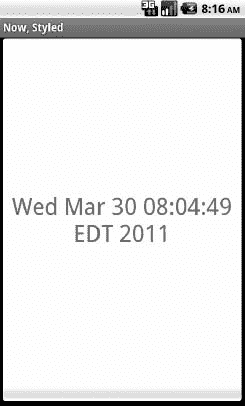

# 二十四、定义和使用样式

有时，您会在布局元素中发现一些带有神秘样式属性的代码。例如，在关于线程的章节中，出现了以下`ProgressBar`:

`<?xml version="1.0" encoding="utf-8"?>
<LinearLayoutxmlns:android="http://schemas.android.com/apk/res/android"
  android:orientation="vertical"
  android:layout_width="fill_parent"
  android:layout_height="fill_parent"
  >
  <ProgressBarandroid:id="@+id/progress"
    style="?android:attr/progressBarStyleHorizontal"
    android:layout_width="fill_parent"
    android:layout_height="wrap_content" />
</LinearLayout>`

神奇的`style`属性将我们的`ProgressBar`从一个普通的圆形变成了一个单杠。

本章简要探讨了样式的概念，包括如何创建样式以及如何将样式应用到自己的小部件中。

### 款式:DIY 干爽

样式的目的是封装一组您打算重复使用、有条件使用或与您的布局保持分离的属性。主要用例是“不要重复自己”(DRY)——如果你有一堆看起来一样的小部件，使用一个样式来使用“看起来一样”的单一定义，而不是从一个小部件复制到另一个小部件。

如果我们看一个例子，特别是`Styles/NowStyled`示例项目，这一段会更有意义。这是我们在前面章节中检查过的同一个项目，它有一个全屏按钮，显示活动启动或按钮被按下的日期和时间。在这个例子中，我们想要改变按钮表面的文本外观，这将通过使用一个样式来实现。

这个项目中的`res/layout/main.xml`文件与第二十章中的文件相同，但是增加了一个`style`属性:

`<?xml version="1.0" encoding="utf-8"?>
<Button xmlns:android="http://schemas.android.com/apk/res/android"
  android:id="@+id/button"
  android:text=""
  android:layout_width="fill_parent"
  android:layout_height="fill_parent"
  style="@style/bigred"
/>`

**注意:**因为`style`属性是股票 XML 的一部分，因此不在`android`名称空间中，它没有得到`android:`前缀。

值`@style/bigred`指向一个样式资源。样式资源是值资源，可以在项目中的`res/values/`目录中找到，或者在其他资源集中找到(例如，`res/values-v11/`用于仅在 API 级别 11 或更高级别上使用的值资源)。惯例是将样式资源保存在一个`styles.xml`文件中，比如下面来自`NowStyled`项目的:

`<?xml version="1.0" encoding="utf-8"?>
<resources>
  
</resources>`

元素提供了样式的名称，这是我们从布局中引用样式时使用的名称。`
</resources>`

在这里，我们表明我们希望从 Android 内部继承`Theme.Holo`风格。因此，除了指定我们自己的所有属性定义，我们还指定我们想要来自`Theme.Holo`的所有属性定义。

在许多情况下，这是不必要的。如果您没有指定父对象，那么您的属性定义将被混合到应用于小部件或容器的任何默认样式中。

#### 可能的值

通常，你在样式中赋予属性的值将是某个常量，比如`30sp`或`#FFFF0000`。但是，有时您可能希望执行一点间接操作，从您继承的主题中应用一些其他属性值。在这种情况下，您需要使用有点神秘的`?android:attr/`语法，以及一些相关的魔法咒语。

例如，让我们再来看看这个样式资源:

`<?xml version="1.0" encoding="utf-8"?>
<resources>
  
</resources>`

这里，我们指出`android:background`的值不是某个常数值，甚至不是对可提取资源的引用(例如`@drawable/my_background`)。相反，我们从我们继承的主题中引用了一些其他属性的值——??。无论主题如何定义为`activatedBackgroundIndicator`都是我们的背景。

有时这适用于整体风格。例如，让我们再来看看`ProgressBar`:

`<?xml version="1.0" encoding="utf-8"?>
<LinearLayoutxmlns:android="http://schemas.android.com/apk/res/android"
  android:orientation="vertical"
  android:layout_width="fill_parent"
  android:layout_height="fill_parent"
  >
  <ProgressBarandroid:id="@+id/progress"
    style="?android:attr/progressBarStyleHorizontal"
    android:layout_width="fill_parent"
    android:layout_height="wrap_content" />
</LinearLayout>`

这里，我们的样式属性——不是样式资源——指向主题提供的属性(`progressBarStyleHorizontal`)。如果你翻翻 Android 的源代码，你会发现这被定义为一个样式资源，确切地说是`@android:style/Widget.ProgressBar.Horizontal`。因此，我们对 Android 说，我们希望我们的`ProgressBar`通过`?android:attr/progressBarStyleHorizontal`的间接方式被命名为`@android:style/Widget.ProgressBar.Horizontal`。

Android 风格系统的这一部分仍然很少被记录，即使是最新发布的 Android 4.0 冰淇淋三明治——整个继承主题是三个简短的段落。谷歌自己建议你看看列出各种风格的 Android 源代码，看看有什么是可能的。

这是继承风格变得重要的一个地方。在本节显示的第一个例子中，我们从`Theme.Holo`继承，因为我们特别想要来自`Theme.Holo`的 `activatedBackgroundIndicator`值。该值可能不存在于其他样式中，或者它可能没有我们想要的值。

### 主题:任何其他名称的风格…

主题是通过`<activity>`或`<application>`元素上的`android:theme`属性应用于活动或应用的样式。如果你正在应用的主题是你自己的，简单地引用它为`@style/…`，就像你在一个小部件的`style`属性中一样。但是，如果你应用的主题来自 Android，通常你会使用一个以`@android:style/`为前缀的值，比如`@android:style/Theme.Dialog`或`@android:style/Theme.Light`。

在一个主题中，你的重点不是设计小部件，而是设计活动本身。比如下面是`@android:style/Theme.NoTitleBar.Fullscreen`的定义:

`<!-- Variant of the default (dark) theme that has no title bar and
 fills the entire screen -->
`

它指定活动应该接管整个屏幕，移除 Android 1.x 和 2.x 设备上的状态栏(`android:windowFullscreen`设置为`true`)，以及 Android 3.x 和 4.x 设备上的动作栏。它还指定内容覆盖图——环绕活动内容视图的布局——应该设置为 nothing ( `android:windowContentOverlay`设置为`@null`),具有移除标题栏的效果。

主题还可能指定应用于特定小部件的其他样式。例如，我们在根主题(`Theme`)中看到以下内容:

`<item name="progressBarStyleHorizontal">@android:style/Widget.ProgressBar
.Horizontal</item>`

这里，`progressBarStyleHorizontal`是指向`@android:style/ Widget.ProgressBar.Horizontal`的。这就是我们如何能够在我们的`ProgressBar`小部件中引用`?android:attr/progressBarStyleHorizontal`，并且我们可以创建我们自己的主题，重新定义`progressBarStyleHorizontal`以指向一些其他的样式(例如，如果我们想要改变用于实际进度条图像本身的圆角矩形)。