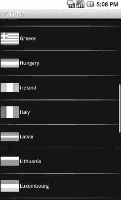

# 二十五、处理多种屏幕尺寸

在 Android 1.0 发布后的第一年左右，所有生产的 Android 设备都有相同的屏幕分辨率(HVGA，320×480 像素)和尺寸(大约 3.5 英寸，或 9 厘米)。然而，从 2009 年末开始，设备开始出现各种不同的屏幕尺寸和分辨率，从微小的 QVGA (240×320)屏幕到更大的 WVGA (480×800)屏幕。2010 年末，平板电脑和谷歌电视设备出现，提供了更多的屏幕尺寸，随着蜂巢和冰淇淋三明治的发布，平板电脑和更大的屏幕尺寸爆炸式增长。

当然，用户会希望你的应用在所有这些屏幕上都能正常工作，也许会利用更大的屏幕尺寸来增加更大的价值。为此，Android 1.6 增加了新的功能，以帮助更好地支持这些不同的屏幕尺寸和分辨率，这些功能在后续的 Android 版本中得到了扩展。随着 Android 3.0 的发布，可选的片段系统作为一种处理不同屏幕尺寸的更强大——尽管更复杂——的方式被引入。Android 文档广泛介绍了使用传统方法和片段方法处理多种屏幕尺寸的机制。我们鼓励你在阅读本章(以及第二十八章)的同时阅读该文档，以充分理解如何最好地应对，或者利用多种屏幕尺寸。

这一章将处理更多的理论和抽象的设计思想，用一些章节讨论屏幕尺寸的选择和理论。然后，我们将深入探讨如何让一个相当简单的应用很好地处理多种屏幕尺寸。这一章将避免增加片段的复杂性，但是不要害怕:我们将回到第二十八章的主题和片段。

### 采取默认

让我们假设你一开始完全忽略了屏幕尺寸和分辨率的问题。会发生什么？

如果你的应用是为 Android 1.5 或更低版本编译的，Android 会认为你的应用在传统的屏幕尺寸和分辨率下看起来很好。Android 将自动执行以下操作:

*   如果你的应用安装在屏幕更大的设备上，Android 将在兼容模式下运行你的应用，根据实际屏幕大小缩放一切。因此，假设你有一个 24 像素的方形 PNG 文件，Android 在一个标准物理尺寸但具有 WVGA 分辨率的设备上安装并运行你的应用(所谓的高密度屏幕)。Android 可能会在显示 PNG 文件时将其缩放为 36 像素，因此它在屏幕上占据相同的可视空间。有利的一面是，Android 会自动处理这个问题；不利的一面是，位图缩放算法会使图像有点模糊。
*   如果你的应用安装在屏幕较小的设备上，Android 会阻止你的应用运行。因此，QVGA 设备，如 HTC Tattoo，将无法获得您的应用，即使它在 Android 市场上可用。

为了举例说明这如何影响你的应用，Figure 25–1 展示了在 HTC 纹身上看到的`Containers/Table`示例应用，带有 QVGA 屏幕。

**图 25–1。** *通过兼容模式在 QVGA 中的表样*

如果您的应用是为 Android 1.6 或更高版本编译的，Android 会假设您可以正确处理所有屏幕尺寸，因此不会在兼容模式下运行您的应用。考虑到后续版本的巨大改进，尤其是 Android 2.2、3.0 和 4.0，很少有开发者会将 1.6 之前的版本作为目标。这意味着你几乎总是会自己处理屏幕尺寸管理。在后面的部分中，您将看到如何对其进行定制。

### 整体合一

在 Android 中处理多种屏幕尺寸的最简单的方法是设计你的用户界面(UI ),使其自动根据屏幕尺寸进行缩放，而不需要任何特定尺寸的代码或资源。换句话说，“它只是工作。”

然而，这意味着你在 UI 中使用的一切都可以被 Android 优雅地缩放，一切都将适合，即使是在 QVGA 屏幕上。

以下部分提供了实现这种一体化解决方案的一些提示。

#### 考虑规则，而不是立场

一些开发人员，也许是那些来自 UI 开发拖放学校的开发人员，首先考虑的是小部件的位置。他们认为他们希望特定的部件在特定的固定位置具有特定的固定大小。他们对 Android 布局管理器(容器)感到失望，并倾向于用他们习惯的方式来设计 ui。

这种方法很少能很好地工作，即使是在桌面上，这可以在不能很好地处理窗口大小调整的应用中看到。同样，这种方法也不适用于移动设备，尤其是 Android，因为它们的屏幕尺寸和分辨率差异很大。

不要想立场，要想规则。你需要教会 Android 关于小部件的大小和位置的“商业规则”，然后 Android 将根据设备屏幕在分辨率方面实际支持的内容来解释这些规则。

最简单的规则是`android:layout_width`和`android:layout_height`的`fill_parent`和`wrap_content`值。它们不指定具体的尺寸，而是适应可用的空间。

最容易指定规则的环境是`RelativeLayout`。虽然表面上很复杂，`RelativeLayout`做得很好，让你控制你的布局，同时仍然适应其他屏幕尺寸。例如，您可以执行以下操作:

*   明确地将窗口小部件锚定在屏幕的底部或右侧，而不是希望它们会因为其他布局而出现在那里
*   控制连接的小部件之间的距离(例如，字段的标签应该在字段的左侧)，而不必依赖填充或边距

指定规则的最好方法是创建自己的布局类。例如，假设您正在创建一系列实现纸牌游戏的应用。您可能希望有一个布局类，它知道关于扑克牌的以下内容:它们如何重叠，面朝上还是面朝下，处理不同数量的牌应该有多大，等等。虽然你可以用一个`RelativeLayout`来实现你想要的外观，但是实现一个`PlayingCardLayout`或者一个`HandOfCardsLayout`或者更明确地为你的应用定制的东西可能会更好。不幸的是，创建自定义布局类目前还没有被记录下来。

#### 考虑物理尺寸

Android 提供了大量可用的尺寸测量单位。最流行的是 pixel ( `px`)，因为它很容易让人理解这个概念。毕竟，每个 Android 设备都有一个每个方向都有一定数量像素的屏幕。

但是，随着屏幕密度的变化，像素开始变得麻烦。随着给定屏幕尺寸中像素数量的增加，像素实际上会缩小。传统 Android 设备上的 32 像素图标可能对手指友好，但在高密度设备上(比如手机外形的 WVGA)，32 像素对于手指来说可能有点小。

如果你有某种本质上可缩放的东西(例如，`Button`)，你可以考虑使用毫米(`mm`)或英寸(`in`)作为度量单位。无论屏幕分辨率还是屏幕尺寸，10 毫米就是 10 毫米。这样，您可以确保小部件的大小适合手指，而不管可能需要多少像素。

#### 避免“真实”像素

在某些情况下，使用毫米表示尺寸没有意义。在这种情况下，您可能需要考虑使用其他度量单位，同时避免使用“真实”像素。

Android 提供了以密度无关像素(`dip`)测量的尺寸。这些 1:1 映射到 160 dpi 屏幕(例如，经典的 HVGA Android 设备)的像素，并从那里缩放。例如，在 240 dpi 的设备(例如，手机大小的 WVGA 设备)上，该比率是 2:3，因此`50dip` = `50px`在 160 dpi，而= `75px`在 240 dpi。用户使用`dip`的好处是尺寸的实际大小保持不变，因此显然 160 dpi 的`50dip`和 240 dpi 的`50dip`没有区别。

Android 还提供按比例像素测量的尺寸(`sp`)。理论上，缩放像素是根据用户选择的字体大小进行缩放的(`System.Settings`中的`FONT_SCALE`值)。

#### 选择可伸缩的抽屉

传统位图——PNG、JPG、BMP 和 GIF——本质上不可扩展，Android 4.0 也不支持最新的图像格式——WEBP。如果你不是在兼容模式下运行，Android 甚至不会尝试根据屏幕分辨率和尺寸来缩放这些内容。无论你提供的位图大小是多少，即使这会使图像在某些屏幕上变得过大或过小。

解决这个问题的一个方法是尽量避免静态位图，使用九补丁位图和 XML 定义的 drawables(如`GradientDrawable`)作为替代。九片位图是一种 PNG 文件，经过特殊编码，具有指示如何拉伸图像以占据更多空间的规则。XML 定义的 drawables 使用一种准 SVG XML 语言来定义形状、它们的笔画和填充等等。

### 量身定做，只为你(还有你，还有你，还有……)

有时，您会希望根据屏幕大小或密度拥有不同的外观或行为。Android 提供了一些技术，您可以使用这些技术根据应用运行的环境来切换资源或代码块。当这些技术与上一节描述的技术结合使用时，实现屏幕尺寸和密度独立是完全可能的，至少对于运行 Android 1.6 和更新版本的设备来说是如此。

#### 增加<支撑屏>元素

主动支持不同屏幕尺寸的第一步是将`<supports-screens>`元素添加到`AndroidManifest.xml`文件中。这指定了应用明确支持和不支持的屏幕尺寸。它没有明确支持的那些将由自动兼容模式处理，如前所述。

下面是一个包含`<supports-screens>`元素的清单:

`<?xml version="1.0" encoding="utf-8"?>
<manifest xmlns:android="http://schemas.android.com/apk/res/android"
  package="com.commonsware.android.eu4you"
  android:versionCode="1"
  android:versionName="1.0">
  <supports-screens
    android:largeScreens="true"
    android:normalScreens="true"
    android:smallScreens="true"
    android:anyDensity="true"
  />
  <application android:label="@string/app_name"
    android:icon="@drawable/cw">
    <activity android:name=".EU4You"
              android:label="@string/app_name">
      <intent-filter>
        <action android:name="android.intent.action.MAIN" />
        <category android:name="android.intent.category.LAUNCHER" />
      </intent-filter>
    </activity>
  </application>
</manifest>`

`android:smallScreens`、`android:normalScreens`和`android:largeScreens`属性是不言自明的:每一个属性都有一个布尔值，表明你的应用是明确支持那个尺寸的屏幕(`true`)还是需要兼容模式帮助(`false`)。Android 2.3 还为更大的平板电脑、电视等增加了`android:xlargeScreens`(剧院，有人吗？).

`android:anyDensity`属性表示您是否在计算中考虑了密度(`true`)或不考虑密度(`false`)。如果是`false`，Android 将会把你的所有尺寸(例如`4px`)都当作普通密度(160-dpi)的屏幕来处理。如果你的应用运行在更低或更高密度的屏幕上，Android 会相应地缩放你的尺寸。如果你指出`android:anyDensity = "true"`，你就是在告诉 Android 不要这么做，让你承担使用密度无关单位的责任，比如`dip`、`mm`或`in`。

#### 资源和资源集

基于屏幕大小或密度切换不同事物的主要方法是创建资源集。通过创建特定于不同设备特性的资源集，您可以教会 Android 如何渲染每一个资源集，然后 Android 会自动在这些资源集中进行切换。

##### 默认缩放

默认情况下，Android 会缩放所有可提取的资源。那些本质上可伸缩的，如前所述，将会很好地伸缩。普通位图使用普通的缩放算法进行缩放，这可能会也可能不会给你很好的结果。这也可能会降低应用的速度。为了避免这种情况，您需要设置单独的包含不可缩放位图的资源集。

##### 基于密度的集合

如果您希望基于不同的屏幕密度拥有不同的布局、尺寸等，您可以使用`-ldpi`、`-mdpi`、`-hdpi`和`-xhdpi`资源集标签。例如，`res/values-hdpi/dimens.xml`将包含高密度设备中使用的尺寸。

请注意，在使用这些屏幕密度资源集时，Android 1.5 (API level 3)中有一个 bug。尽管所有的 Android 1.5 设备都是中等密度，但 Android 1.5 可能会意外地选择其他密度。如果您打算支持 Android 1.5 并使用屏幕密度资源集，您需要克隆您的`-mdpi`集的内容，克隆名为`-mdpi-v3`。这个基于版本的集合将在本节稍后详细描述。

##### 基于大小的集合

同样，如果你希望根据屏幕大小拥有不同的资源集，Android 提供了`-small`、`-normal`、`-large`和`-xlarge`资源集标签。创建`res/layout-large-land/`将指示在横向大屏幕(如 WVGA)上使用的布局。

##### 基于版本的集合

可能会有早期版本的 Android 被新的资源集标签弄糊涂的时候。为了帮助解决这个问题，您可以向您的资源集添加一个版本标签，格式为`-vN`，其中`N`是一个 API 级别。因此，`res/drawable-large-v4/`表示这些 drawables 应该在 API 级别为 4 (Android 1.6)和更高的大屏幕上使用。

所以，如果你发现 Android 1.5 模拟器或设备正在抓取错误的资源集，可以考虑在它们的资源集名称中添加`-v4`来过滤掉它们。

#### 找到你的尺码

如果需要根据屏幕大小或密度在 Java 代码中采取不同的动作，有几种选择。

如果您的资源集中有一些与众不同的东西，您可以基于此“嗅”出来，并在代码中相应地进行分支。例如，正如你将在本章后面的代码示例中看到的，你可以在一些布局中有额外的小部件(例如，`res/layout-large/main.xml`)；简单地看看是否有一个额外的小部件存在，就可以知道你是否在运行一个大屏幕。

你也可以通过一个`Configuration`对象找到你的屏幕尺寸等级，通常由一个`Activity`通过`getResources().getConfiguration()`获得。一个`Configuration`对象有一个名为`screenLayout`的公共字段，它是一个位掩码，指示应用运行的屏幕类型。您可以测试您的屏幕是小、正常还是大，或者是长(其中“长”表示 16:9 或类似的宽高比，而不是 4:3)。例如，我们在这里测试我们是否在大屏幕上运行:

`if (getResources().getConfiguration().screenLayout
      & Configuration.SCREENLAYOUT_SIZE_LARGE)
    ==Configuration.SCREENLAYOUT_SIZE_LARGE) {
 // yes, we are large
}
else {
 // no, we are not
}`

类似地，您可以使用`DisplayMetrics`类找出您的屏幕密度，或者您的屏幕尺寸中像素的确切数量。

### 没有什么比得上真实的东西

Android 模拟器将帮助你在不同尺寸的屏幕上测试你的应用。但是，这只能做到这一步，因为移动设备的 LCD 与台式机或笔记本电脑的 LCD 具有不同的特性，例如:

*   移动设备 LCD 的密度可能比开发机器的密度高得多。
*   鼠标允许比实际指尖更精确的触摸屏输入。

在可能的情况下，你将需要以新的和令人兴奋的方式使用模拟器，或者尝试使用具有不同屏幕分辨率的实际设备。

#### 密度不同

摩托罗拉 DROID 有一个 240 dpi、3.7 英寸、480×854 像素的屏幕(FWVGA 显示器)。要模拟 DROID 屏幕，根据像素计算，需要占用 19 英寸、1280×1024 像素液晶显示器的三分之一，因为液晶显示器的密度比 DROID 低得多——约为 96 dpi。因此，当你为像 droid 这样的 FWVGA 显示器启动 Android 模拟器时，你会得到一个巨大的模拟器窗口。

对于在 FWVGA 环境中确定应用的整体外观来说，这仍然是非常好的。无论密度如何，窗口小部件仍将对齐，大小将具有相同的关系(例如，窗口小部件 A 可能是窗口小部件 B 的两倍高，并且无论密度如何都是如此)，等等。

但是，请记住以下几点:

*   在 19 英寸的 LCD 上看起来尺寸合适的东西，在相同分辨率的移动设备屏幕上可能会太小。
*   在模拟器中，你可以用鼠标轻松点击的东西可能太小，用手指在物理上更小、更密集的屏幕上无法显示出来。

#### 调整密度

默认情况下，仿真器以牺牲密度为代价来保持像素计数的准确性，这就是为什么您会得到真正大的仿真器窗口。不过，您可以选择让仿真器以牺牲像素数量为代价来保持密度的准确性。

最简单的方法是使用 Android 1.6 中引入的 Android AVD 管理器。这个工具的 Android 2.0 版本有一个启动选项对话框，当你通过开始按钮启动一个仿真器实例时会弹出这个对话框，如图 Figure 25–2 所示。

**图 25–2。**??【启动选项】对话框

默认情况下，“按实际大小显示”复选框是未选中的，Android 会正常打开模拟器窗口。您可以选中该复选框，然后提供两位缩放信息:

*   您希望模拟的设备的屏幕尺寸，以英寸为单位(例如，摩托罗拉 DROID 的屏幕尺寸为 3.7 英寸)
*   显示器的 dpi(单击？按钮打开计算器，帮助您确定您的 dpi 值)

这为您提供了一个仿真窗口，它更准确地描述了您的用户界面在物理设备上的外观，至少在大小方面是这样的。但是，由于仿真程序使用的像素比设备少得多，因此字体可能难以阅读，图像可能有块状等等。

### 无情地利用形势

到目前为止，我们已经关注了如何确保你的布局在其他尺寸的屏幕上看起来不错。对于比标准尺寸更小的屏幕(例如 QVGA)，这也许是你所能希望达到的。

然而，一旦你进入更大的屏幕，另一种可能性就出现了:使用不同的布局来利用额外的屏幕空间。当物理屏幕尺寸较大时(例如，戴尔 Streak Android 平板电脑上的 5 英寸液晶显示器，或三星 Galaxy Tab 上的 7 英寸液晶显示器)，这一点特别有用，而不是简单地在相同的物理空间中拥有更多像素。

以下部分描述了一些利用额外空间的方法。

#### 用按钮代替菜单

选项菜单选择需要两个物理动作:按下菜单按钮，然后点击适当的菜单选项。上下文菜单选择也需要两个物理动作:长时间点击小部件，然后点击菜单选项。上下文菜单具有实际上不可见的额外问题；例如，用户可能没有意识到你的`ListView`有一个上下文菜单。

你可以考虑增加你的用户界面来提供直接在屏幕上完成事情的方法，否则这些事情可能会隐藏在菜单上。这不仅减少了用户需要采取的步骤数量，而且使这些选项更加明显。

例如，假设您正在创建一个媒体播放器应用，并且希望提供手动播放列表管理。您有一个在`ListView`中显示播放列表中的歌曲的活动。在选项菜单上，您可以选择添加，将设备上的歌曲添加到播放列表中。在`ListView`的上下文菜单上，你有一个移除选项，加上上移和下移选项来重新排列列表中的歌曲。不过，对于大屏幕，您可能会考虑为这四个选项在 UI 中添加四个`ImageButton`小部件，只有当通过 D-pad 或轨迹球选择一行时，上下文菜单中的三个小部件才会启用。在普通或小屏幕上，你会坚持只使用菜单。

#### 用一个简单的活动替换标签

您可能在 UI 中引入了一个`TabHost`来允许您在可用的屏幕空间中显示更多的小部件。只要您通过将小部件移动到一个单独的选项卡而节省的空间大于选项卡本身占用的空间，您就赢了。然而，拥有多个选项卡意味着需要更多的用户步骤来导航用户界面，特别是当用户需要频繁地在选项卡之间来回切换时。

如果你只有两个标签，考虑改变你的用户界面，提供一个大屏幕布局，去掉标签，把所有的小部件放在一个屏幕上(或者，等待第二十八章关于片段的讨论)。这使得用户无需一直切换标签就能看到所有内容。

如果你有三个或者更多的标签，你可能没有足够的屏幕空间来把这些标签的内容放在一个活动中。然而，你可以考虑对半分:让流行的小部件一直出现在活动中，让你的`TabHost`在(大约)半个屏幕上处理剩下的部分。

#### 整合多个活动

最强大的技术是使用更大的屏幕来彻底消除活动转换。例如，如果您有一个`ListActivity`，单击一个项目会在一个单独的活动中显示该项目的详细信息，请考虑支持大屏幕布局，其中详细信息与`ListView`在同一个活动中(例如，在横向布局中，`ListView`在左边，在右边)。这消除了用户在查看另一组细节之前必须不断地按后退按钮来离开一组细节的情况。

您将在下一节中展示的示例代码中看到这种技术的应用。

### 例子:EU4You

为了研究如何使用前面几节中介绍的一些技术，让我们看一下`ScreenSizes/EU4You`示例应用。这个应用有一个活动(`EU4You`)，其中包含一个`ListView`，上面有欧盟成员的名单和他们各自的旗帜。点击其中一个国家，就会出现这个国家的移动维基百科页面。

在本书的源代码中，您会发现这个应用的四个版本。我们从一个不知道屏幕大小的应用开始，慢慢地添加更多与屏幕相关的功能。

#### 第一刀

首先，这是我们的`AndroidManifest.xml`文件，它看起来很像本章前面显示的那个:

`<?xml version="1.0" encoding="utf-8"?>
<manifest xmlns:android="http://schemas.android.com/apk/res/android"
  package="com.commonsware.android.eu4you"
  android:versionCode="1"
  android:versionName="1.0">
  <supports-screens
    android:xlargeScreens="true"
    android:largeScreens="true"
    android:normalScreens="true"
    android:smallScreens="true"
    android:anyDensity="true"
  />
  <application android:label="@string/app_name"
    android:icon="@drawable/cw">
    <activity android:name=".EU4You"
              android:label="@string/app_name">
      <intent-filter>
        <action android:name="android.intent.action.MAIN" />
        <category android:name="android.intent.category.LAUNCHER" />
      </intent-filter>
    </activity>
  </application>
</manifest>`

注意，我们已经包含了`<supports-screens>`元素，这表明我们确实支持所有的屏幕尺寸。如果我们不指定我们支持某些屏幕尺寸，这将阻止 Android 的大部分自动缩放。

我们的主要布局与尺寸无关，因为它只是一个全屏`ListView`:

`<?xml version="1.0" encoding="utf-8"?>
<ListView xmlns:android="http://schemas.android.com/apk/res/android"
  android:id="@android:id/list"
  android:layout_width="fill_parent"
  android:layout_height="fill_parent"
/>`

不过，我们的争吵最终将需要一些调整:

`<?xml version="1.0" encoding="utf-8"?>
<LinearLayout xmlns:android="http://schemas.android.com/apk/res/android"
  android:layout_width="fill_parent"
  android:layout_height="wrap_content"
  android:padding="2dip"
  android:minHeight="?android:attr/listPreferredItemHeight"
>
  <ImageView android:id="@+id/flag"
    android:layout_width="wrap_content"
    android:layout_height="wrap_content"
    android:layout_gravity="center_vertical|left"
    android:paddingRight="4dip"
  />
  <TextView android:id="@+id/name"
    android:layout_width="wrap_content"
    android:layout_height="wrap_content"
    android:layout_gravity="center_vertical|right"
    android:textSize="20dip"
  />
</LinearLayout>`

比如现在，我们的字体大小设置为`20dip`，不会因屏幕大小或密度而变化。

我们的`EU4You`活动有点冗长，主要是因为有很多欧盟成员，所以我们需要智能地显示行中的标志和文本:

`package com.commonsware.android.eu4you;

import android.app.ListActivity;
import android.content.Intent;
import android.net.Uri;
import android.os.Bundle;
import android.view.View;
import android.view.ViewGroup;
import android.widget.ArrayAdapter;
import android.widget.ImageView;
import android.widget.ListView;
import android.widget.TextView;
import java.util.ArrayList;

public class EU4You extends ListActivity {
  static private ArrayList<Country> EU=new ArrayList<Country>();

  static {
    EU.**add**(new **Country**(R.string.austria, R.drawable.austria,
                     R.string.austria_url));
    EU.**add**(new **Country**(R.string.belgium, R.drawable.belgium,
                     R.string.belgium_url));` `EU.**add**(new **Country**(R.string.bulgaria, R.drawable.bulgaria,
                     R.string.bulgaria_url));
    EU.**add**(new **Country**(R.string.cyprus, R.drawable.cyprus,
                     R.string.cyprus_url));
    EU.**add**(new **Country**(R.string.czech_republic,
                     R.drawable.czech_republic,
                     R.string.czech_republic_url));
    EU.**add**(new **Country**(R.string.denmark, R.drawable.denmark,
                     R.string.denmark_url));
    EU.**add**(new **Country**(R.string.estonia, R.drawable.estonia,
                     R.string.estonia_url));
    EU.**add**(new **Country**(R.string.finland, R.drawable.finland,
                     R.string.finland_url));
    EU.**add**(new **Country**(R.string.france, R.drawable.france,
                     R.string.france_url));
    EU.**add**(new **Country**(R.string.germany, R.drawable.germany,
                     R.string.germany_url));
    EU.**add**(new **Country**(R.string.greece, R.drawable.greece,
                     R.string.greece_url));
    EU.**add**(new **Country**(R.string.hungary, R.drawable.hungary,
                     R.string.hungary_url));
    EU.**add**(new **Country**(R.string.ireland, R.drawable.ireland,
                     R.string.ireland_url));
    EU.**add**(new **Country**(R.string.italy, R.drawable.italy,
                     R.string.italy_url));
    EU.**add**(new **Country**(R.string.latvia, R.drawable.latvia,
                     R.string.latvia_url));
    EU.**add**(new **Country**(R.string.lithuania, R.drawable.lithuania,
                     R.string.lithuania_url));
    EU.**add**(new **Country**(R.string.luxembourg, R.drawable.luxembourg,
                     R.string.luxembourg_url));
    EU.**add**(new **Country**(R.string.malta, R.drawable.malta,
                     R.string.malta_url));
    EU.**add**(new **Country**(R.string.netherlands, R.drawable.netherlands,
                     R.string.netherlands_url));
    EU.**add**(new **Country**(R.string.poland, R.drawable.poland,
                     R.string.poland_url));
    EU.**add**(new **Country**(R.string.portugal, R.drawable.portugal,
                     R.string.portugal_url));
    EU.**add**(new **Country**(R.string.romania, R.drawable.romania,
                     R.string.romania_url));
    EU.**add**(new **Country**(R.string.slovakia, R.drawable.slovakia,
                     R.string.slovakia_url));
    EU.**add**(new **Country**(R.string.slovenia, R.drawable.slovenia,
                     R.string.slovenia_url));
    EU.**add**(new **Country**(R.string.spain, R.drawable.spain,
                     R.string.spain_url));
    EU.**add**(new **Country**(R.string.sweden, R.drawable.sweden,
                     R.string.sweden_url));
    EU.**add**(new **Country**(R.string.united_kingdom,
                     R.drawable.united_kingdom,
                     R.string.united_kingdom_url));
  }

  @Override
  public void **onCreate**(Bundle savedInstanceState) {` `super.**onCreate**(savedInstanceState);
    **setContentView**(R.layout.main);
    **setListAdapter**(new **CountryAdapter**());
  }

  @Override
  protected void **onListItemClick**(ListView l, View v,
                                int position, long id) {
    **startActivity**(new **Intent**(Intent.ACTION_VIEW,
                              Uri.**parse**(**getString**(EU.**get**(position).url))));
  }

  static class Country {
    int name;
    int flag;
    int url;

    **Country**(int name, int flag, int url) {
      this.name=name;
      this.flag=flag;
      this.url=url;
    }
  }

  class CountryAdapter extends ArrayAdapter<Country> {
    **CountryAdapter**() {
      super(EU4You.this, R.layout.row, R.id.name, EU);
    }

    @Override
    public View **getView**(int position, View convertView,
                       ViewGroup parent) {
      CountryWrapper wrapper=null;

      if (convertView==null) {
        convertView=**getLayoutInflater**().**inflate**(R.layout.row, null);
        wrapper=new **CountryWrapper**(convertView);
        convertView.**setTag**(wrapper);
      }
      else {
        wrapper=(CountryWrapper)convertView.**getTag**();
      }

      wrapper.**populateFrom**(**getItem**(position));

      return(convertView);
    }
  }

  class CountryWrapper {
    private TextView name=null;
    private ImageView flag=null;
    private View row=null;

    **CountryWrapper**(View row) {
      this.row=row;` `    }

    TextView **getName**() {
      if (name==null) {
        name=(TextView)row.**findViewById**(R.id.name);
      }

      return(name);
    }

    ImageView **getFlag**() {
      if (flag==null) {
        flag=(ImageView)row.**findViewById**(R.id.flag);
      }

      return(flag);
    }

    void **populateFrom**(Country nation) {
      **getName**().**setText**(nation.name);
      **getFlag**().**setImageResource**(nation.flag);
    }
  }
}`

图 25–3、25–4 和 25–5 分别显示了普通 HVGA 仿真器、WVGA 仿真器和 QVGA 屏幕中的活动。

**图 25–3。** *EU4You，原版，HVGA*

**图 25–4。** *EU4You，原版，WVGA (800×480 像素)*

**图 25–5。** *EU4You，原版，QVGA*

#### 固定字体

首先要解决的问题是字体大小。正如你所看到的，对于固定的 20 像素大小，字体的范围从大到小，取决于屏幕的大小和密度。对于 WVGA 屏幕，字体可能很难阅读。

我们可以将维度作为一个资源(`res/values/dimens.xml`)，并基于屏幕大小或密度拥有该资源的不同版本。然而，更简单的方法是只指定一个与密度无关的大小，如`5mm`，如`ScreenSizes/EU4You_2`项目所示:

`<?xml version="1.0" encoding="utf-8"?>
<LinearLayout xmlns:android="http://schemas.android.com/apk/res/android"
  android:layout_width="fill_parent"
  android:layout_height="wrap_content"
  android:padding="2dip"
  android:minHeight="?android:attr/listPreferredItemHeight"
>
  <ImageView android:id="@+id/flag"
    android:layout_width="wrap_content"
    android:layout_height="wrap_content"
    android:layout_gravity="center_vertical|left"
    android:paddingRight="4dip"
  />
  <TextView android:id="@+id/name"
    android:layout_width="wrap_content"
    android:layout_height="wrap_content"
    android:layout_gravity="center_vertical|right"
    android:textSize="5mm"
  />
</LinearLayout>`

图 25–6、25–7 和 25–8 分别显示了 HVGA、WVGA 和 QVGA 屏幕上的新活动。

**图 25-6。** *EU4You，5mm 字体版本，HVGA*

**图 25–7。** *EU4You，5mm 字体版本，WVGA (800×480 像素)*

**图 25-8。** *EU4You，5mm 字体版本，QVGA*

现在我们的字体大小一致，足够匹配旗帜。

#### 固定图标

那么，那些图标呢？它们的大小也应该不同，因为它们对于所有三个模拟器都是相同的。

但是，Android 会自动缩放位图资源，即使是在`<supports-screens>`及其属性设置为`true`的情况下。从好的方面来说，这意味着您可能不需要对这些位图做任何事情。然而，您依赖于一个设备来进行扩展，这无疑会消耗 CPU 时间(因此会延长电池寿命)。此外，与开发机器上的图形工具相比，设备使用的缩放算法可能不是最佳的。

`ScreenSizes/EU4You_3`项目创建了`res/drawable-ldpi`和`res/drawable-hdpi`，分别放入更小和更大的旗帜。该项目还将`res/drawable`更名为`res/drawable-mdpi`。Android 将根据设备或模拟器的需要，使用合适的屏幕密度标志。

因为这种效果很微妙，不会在本书中很好地表现出来，所以没有提供截图。

#### 利用空间

虽然该活动在纵向模式下在 WVGA 上看起来不错，但在横向模式下确实浪费了很多空间，如图 Figure 25–9 所示。

**图 25–9。** *EU4You，风景 WVGA (800×480 像素)*

我们可以更好地利用这个空间，让维基百科的内容在大屏幕横向模式下直接出现在主活动上；这省去了生成单独的浏览器活动。

要做到这一点，我们首先必须将`main.xml`布局克隆到包含`WebView`小部件的`res/layout-large-land`呈现中，如`ScreenSizes/EU4You_4`所示:

`<?xml version="1.0" encoding="utf-8"?>
<LinearLayout xmlns:android="http://schemas.android.com/apk/res/android"
  android:layout_width="fill_parent"
  android:layout_height="fill_parent"
>
  <ListView
    android:id="@android:id/list"
    android:layout_width="fill_parent"
    android:layout_height="fill_parent"
    android:layout_weight="1"
  />
  <WebView
    android:id="@+id/browser"
    android:layout_width="fill_parent"
    android:layout_height="fill_parent"
    android:layout_weight="1"
  />
</LinearLayout>`

然后，我们需要调整我们的活动来寻找那个`WebView`，如果找到就使用它，否则默认启动一个浏览器活动:

`@Override
public void **onCreate**(Bundle savedInstanceState) {
  super.**onCreate**(savedInstanceState);
  **setContentView**(R.layout.main);

  browser=(WebView)**findViewById**(R.id.browser);

  **setListAdapter**(new **CountryAdapter**());` `}

@Override
protected void **onListItemClick**(ListView l, View v,
                            int position, long id) {
  String url=**getString**(EU.**get**(position).url);

  if (browser==null) {
    **startActivity**(new **Intent**(Intent.ACTION_VIEW,
                            Uri.**parse**(url)));
  }
  else {
    browser.**loadUrl**(url);
  }
}`

这为我们提供了一个更加节省空间的活动版本，如图 Figure 25–10 所示。

**图 25–10。** *EU4You，风景 WVGA (800×480 像素)，设置为正常密度，并显示嵌入式 WebView*

如果用户点击维基百科页面上的一个链接，完整的浏览器就会打开，以便于浏览。我们可以重复这个练习，为大屏幕的活动添加更多的数据。

请注意，测试这个版本的活动，以查看这种行为，需要一些额外的模拟器工作。默认情况下，Android 将 WVGA 设备设置为高密度，这意味着 WVGA 在资源集方面并不算大，而是正常的。您将需要创建一个不同的模拟器 AVD，设置为正常(中等)密度，这将导致一个大的屏幕尺寸。

#### 如果不是浏览器呢？

当然，`EU4You`确实有点作弊。第二个活动是浏览器(或者嵌入式表单中的`WebView`),而不是您自己创建的活动。如果第二个活动是您的某个活动，在一个布局中有许多小部件，并且您既想将它用作一个活动(对于较小的屏幕)，又想将它嵌入到您的主活动 UI 中(对于较大的屏幕)，那么事情会变得稍微复杂一些。

对于 Android 1.6 和更高版本，解决这个问题的最好方法是使用新的片段系统。虽然这是在 Android 3.0 中引入的，但 Android 兼容性库使片段在早期版本的 Android 中可用。片段的基本使用——包括另一个版本的`EU4You`样本——将在第二十八章中介绍。