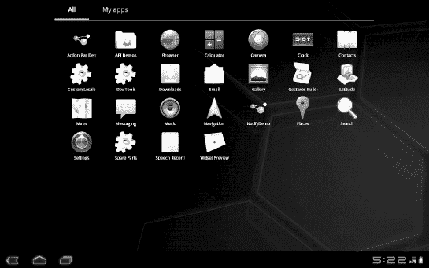
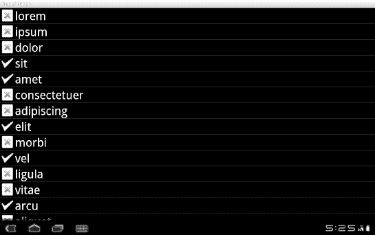
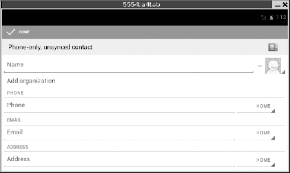
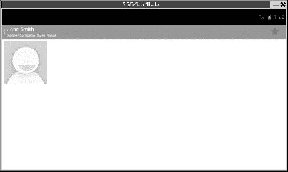
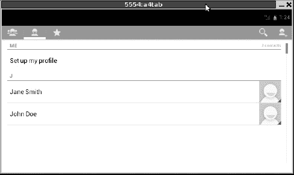
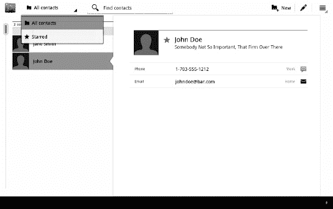

# 二十六、关注平板电脑和更大的用户界面

2011 年 2 月，Android 3.0 和一种用户界面范式问世，这种界面范式采用了比早期 Android 版本设计的传统手机大得多的屏幕。快进到 2011 年 10 月，Android 4.0 冰淇淋三明治(ICS)已经发布，将 Android 3.0 的平板专用蜂巢 UI 系统与主流 Android 代码库统一起来。拥抱平板电脑，以及更大的设备，如电视、影院显示器等，这是自第一代手机问世之前的 Android 0.9 以来，Android 最大的一次变化。

在设计和构建 Android 应用时是否考虑平板设备是您自己的偏好，但了解平台适应大格式的方式将允许您设计代码，以便在未来轻松适应平板电脑，最重要的是，处理 API 的核心原则，无论您对平板电脑的感觉如何，都必须解决这些原则。这一章更侧重于平板设备的 API 的现状以及它们在 Android 中的位置。

### 为什么选择平板电脑？

原则上，Android 最初以手机为中心的 UI 可以在平板电脑上运行。毕竟，一些平板电脑已经搭载了 Android 2.2 支持，如三星 Galaxy Tab 和中兴 V9。显然，这些制造商认为当时的 Android 对于他们的平板设备来说已经足够强大了。

也就是说，随着你进入更大的平板电脑(例如，10 英寸对角线屏幕的摩托罗拉 XOOM)，旧的 Android 手机用户界面开始变得沉闷。虽然应用可以通过扩展来使用更大的屏幕，但是默认的扩展方式只是把所有东西都放大，这经常会导致大量的空间浪费。手机上的电子邮件客户端可能会专门显示收件箱中的电子邮件列表，而平板电脑上的电子邮件客户端实际上应该显示电子邮件列表和其他内容，例如所选电子邮件的内容。我们有这个房间，所以不妨使用它。

同样，对菜单的依赖在手机上是合理的，但在平板电脑上就没那么有意义了。我们有足够的空间在屏幕上展示更多的功能。将它们隐藏在菜单中会使它们不容易被用户发现，并且需要额外的点击才能访问。

因此，“现代”Android 旨在保留 Android 用户体验的精髓，同时允许应用(相对)优雅地利用可用空间。

### 用户看到的内容

平板电脑屏幕看起来与传统手机上的 Android 2.x 屏幕略有不同，如图 Figure 26–1 所示。

**图 26–1。***Android 应用启动器，在模拟器上显示为平板电脑*

有了这些额外的不动产，各种库存组件可以放置在更多不同的位置。在本例中，我们看到系统栏位于屏幕底部。系统栏的左端是返回、主页和最近任务的屏幕按钮(无需记住长按主页按钮即可达到相同的效果)。通知图标出现在系统栏的右侧，旁边还有时钟、信号和电池电量指示器(通知的概念将在第三十七章中介绍)。

未针对 Android 3.x/4.0 优化的应用的 UI 看起来大同小异，如图 Figure 26–2 所示。

**图 26–2。***Android 3.0 上的 fancy lists/动态样本项目*

唯一实质性的区别是系统栏左边的新图标，它将打开一个 Android 2.x 选项菜单，如果应用有的话。

针对平板电脑优化的应用看起来会有些不同，如图 Figure 26–3 所示。

**图 26–3。** *在安卓 4.0 上添加联系人*

屏幕顶部是操作栏，占据了 Android 3.0 之前的应用使用菜单的空间。在图 26–3 中，完成选项作为菜单选项出现。其他需要注意的菜单行为是动作栏左端的<图标，如图 Figure 26–4 所示。

**图 26–4。***<图标用于在动作层级中向上移动，在安卓 4.0* 中显示

在这种情况下，点击< icon takes the user up in the hierarchy of actions in this application, going “up” from viewing a new contact to viewing the list of existing contacts, as shown in 图 26–5。

**图 26–5。** *安卓 4.0 显示的可用联系人名单*

我们的用户界面已经走过了几个 Android 版本的生命周期。在 Android 2.x 中，联系人 UI 将有一个包含联系人列表的活动，以及一个查看该联系人详细信息的单独活动。在 Android 3.0 中，这些被合并成一个活动。在 Android 4.0 中，我们又回到了每次操作一个活动的模式。操作栏的右侧包括一个“查找联系人”搜索图标(放大镜)和一个添加新联系人的图标。与之相邻的是代表任何其他可用选项菜单项和上下文菜单项的图标。

### 处理剩余的设备

当然，世界上所有的 Android 手机并没有因为 Android 4.0 的发布而消失。我们的目标是让您从一个代码库创建一个同时支持手机和平板电脑的应用。

你的以手机为中心的应用在平板电脑上运行也很好，尽管你可能希望做一些事情来利用更大的屏幕尺寸，正如上一章所讨论的那样。如果您想采用冰激凌三明治 UI 的一般外观，您需要在清单的`<uses-sdk>`元素中包含`android:targetSdkVersion="14"`。如果你以前为 Honeycomb 开发过，并且习惯于使用`android:hardwareAccelerated="true"`属性显式打开硬件加速，那么好消息是你不再需要在 Android 4.0 中显式设置这样的加速。硬件加速现在是默认的。从`ScreenSizes/EU4You_5`示例项目的`AndroidManifest.xml`文件中摘录的这段内容展示了 SDK 的变化:

`<?xml version="1.0" encoding="utf-8"?>
<manifest xmlns:android="http://schemas.android.com/apk/res/android"
  package="com.commonsware.android.eu4you"
  android:versionCode="1"
  android:versionName="1.0">
  <uses-permission android:name="android.permission.INTERNET" />
  <supports-screens
    android:largeScreens="true"
    android:normalScreens="true"
    android:smallScreens="true"
    android:anyDensity="true"
  />
  <uses-sdk android:minSdkVersion="4" android:targetSdkVersion="14" />
  <application android:label="@string/app_name"
    android:icon="@drawable/cw"
    <activity android:name=".EU4You"
              android:label="@string/app_name">
      <intent-filter>
        <action android:name="android.intent.action.MAIN" />
        <category android:name="android.intent.category.LAUNCHER" />
      </intent-filter>
    </activity>
  </application>
</manifest>`

最终的应用在旧设备上运行良好，但是没有其他变化，我们在摩托罗拉 XOOM 上得到如图 Figure 26–6 所示的结果。

**图 26–6。**??【EU4You】样本应用，在摩托罗拉 XOOM 上运行

如果你想利用冰淇淋三明治的一些新特性，你还需要考虑向后兼容性，以确保你在应用中实现的东西能在新老版本的 Android 上成功工作。这个主题将在本书的后面部分讨论。

如果您有需要特定于版本的资源，比如样式，您可以使用`-v*NN*`资源集后缀语法，其中 *`NN`* 表示您所针对的版本。例如，你可以有一个`res/values/styles.xml`和一个`res/values-v14/styles.xml`——后者将用于冰淇淋三明治，而前者将用于旧版本的 Android。但是首先，你需要探索所有你可以利用的平板 UI 特性，这是接下来几章的重点。