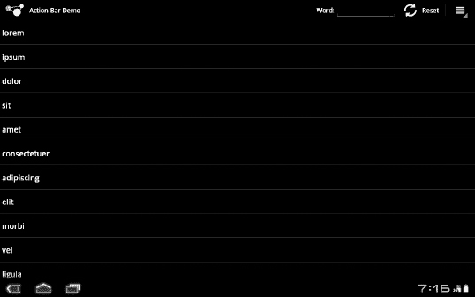

# 二十七、使用动作栏

让你的应用更好地融入最新最棒的 Android UI 的最简单的方法之一是启用动作栏，这在第二十六章中有介绍。让它变得“容易”的是，动作栏的大部分基本功能都是向后兼容的 Android 4.0 的设置不会导致应用在早期版本的 Android 上崩溃。

本章中显示的示例项目是`Menus/ActionBar`，它扩展了上一章中显示的`Menus/Inflation`项目。

### 启用动作栏

默认情况下，您的 Android 应用不会使用操作栏。事实上，它甚至不会显示在屏幕上。如果您希望动作栏出现在屏幕上，您需要在清单中的`<uses-sdk>`元素中包含`android:targetSdkVersion="11"`或更高版本，例如`Menus/ActionBar`项目的清单:

`<?xml version="1.0" encoding="utf-8"?>
<manifest xmlns:android="http://schemas.android.com/apk/res/android"
package="com.commonsware.android.inflation">
    <application android:label="@string/app_name"
                android:icon="@drawable/cw"
                android:hardwareAccelerated="true">
        <activity android:name=".InflationDemo" android:label="@string/app_name">
            <intent-filter>
                <action android:name="android.intent.action.MAIN"/>
                <category android:name="android.intent.category.LAUNCHER"/>
            </intent-filter>
        </activity>
    </application>
    <uses-sdk android:minSdkVersion="4" android:targetSdkVersion="11" />
    <supports-screens android:xlargeScreens="true"
                    android:largeScreens="true"
                    android:normalScreens="true"
                    android:smallScreens="true"
                    android:anyDensity="true"/>
</manifest>`

这将使你的选项菜单出现在屏幕的右上角，在动作栏的菜单图标下，如第二十六章所示。此外，您的活动图标将出现在左上角，旁边是您的活动名称(来自清单中的`android:label`属性)。

虽然这给了你基本的现代外观和感觉——包括冰淇淋三明治主题的小部件——但它并没有真正改变用户体验。

### 将菜单项提升到操作栏

与动作栏集成的下一步是将某些选项菜单项从选项菜单的一部分提升到总是在动作栏上可见。这使得它们更容易被找到，并在用户需要使用它们的时候节省了时间。

为此，在您的菜单 XML 资源中，您可以将`android:showAsAction`属性添加到`<item>`元素中。值`ifRoom`意味着如果有空间，菜单项将出现在动作栏中，而值`always`意味着菜单项将总是被放在动作栏中。在其他条件相同的情况下，`ifRoom`是更好的选择，因为一旦蜂窝用户界面转移到手机上，它将更好地适应更小的屏幕。您也可以将其与`withText`值(例如`ifRoom|withText`)结合使用，使菜单项的标题出现在该项目的图标旁边(否则，只有图标出现在操作栏中)。

例如，`Menus/ActionBar`项目的`options.xml`菜单资源在前两个菜单项上有`android:showAsAction`:

`<?xml version="1.0" encoding="utf-8"?>
<menu xmlns:android="http://schemas.android.com/apk/res/android">
  <item android:id="@+id/add"
    android:title="Add"
    android:icon="@drawable/ic_menu_add"
    android:actionLayout="@layout/add"
    android:showAsAction="ifRoom"/>
  <item android:id="@+id/reset"
    android:title="Reset"
    android:icon="@drawable/ic_menu_refresh"
    android:showAsAction="ifRoom|withText"/>
  <item android:id="@+id/about"
    android:title="About"
    android:icon="@drawable/ic_menu_info_details" />
</menu>`

第二个菜单项 Reset 用于重置列表的内容，它是一个普通的“带文本”操作栏按钮。第一个菜单项 Add 做了一点不同的事情，我们将在本章的后面讨论。第三个菜单项 About 没有`android:showAsAction`这一事实意味着它将保留在菜单中，即使动作栏中还有空间。

请注意，Java 代码没有改变——我们的`InflationDemo`活动的`onCreateOptionsMenu()`和`onOptionsItemSelected()`不需要调整，因为菜单项仅通过菜单 XML 资源被提升到动作栏中。

### 响应标志

屏幕左上角的活动图标可点击。如果用户点击它，它会触发`onOptionsItemSelected()`…但不是您自己定义的选项菜单项。而是使用了`android.R.id.home`的神奇值。在`Menus/ActionBar`项目中，我们将它连接到用户选择 About options 菜单项时调用的相同代码——显示一个`Toast`:

`@Override
public boolean **onOptionsItemSelected**(MenuItem item) {
  switch (item.**getItemId**()) {
    case R.id.add:
      **add**();
      return(true);

    case R.id.reset:
      **initAdapter**();
      return(true);

    case R.id.about:
    case android.R.id.home:
      Toast
        .**makeText**(this,
                  "Action Bar Sample App",
                  Toast.LENGTH_LONG)
        .**show**();
      return(true);
  }

  return(super.**onOptionsItemSelected**(item));
}`

然而，在一个包含多个活动的项目中，无论这意味着什么，点击图标都会将你带到应用的“主页”活动。

### 向操作栏添加自定义视图

除了简单地将选项菜单项转换为相当于工具栏按钮的内容之外，您还可以使用操作栏做更多的事情。您可以将自己的自定义用户界面添加到操作栏中。在`Menus/ActionBar`的例子中，我们将在动作栏本身用一个添加字段替换添加菜单选项和结果对话框。

然而，如下所述，实现起来有点棘手。

#### 定义布局

要在动作栏中放置自定义的东西，我们需要以布局 XML 文件的形式定义“自定义的东西”是什么。幸运的是，我们已经有了一个用于向列表添加单词的布局 XML 文件——它是当点击 Add options 菜单项时,`Menus/Inflation`示例包装在自定义的`AlertDialog`中的文件。最初的布局是这样的:

`<?xml version="1.0" encoding="utf-8"?>
<LinearLayout xmlns:android="http://schemas.android.com/apk/res/android"
    android:orientation="horizontal"
    android:layout_width="fill_parent"
    android:layout_height="wrap_content"
    >
  <TextView
      android:text="Word:"
      android:layout_width="wrap_content"
      android:layout_height="wrap_content"
      />
  <EditText
      android:id="@+id/title"
      android:layout_width="fill_parent"
      android:layout_height="wrap_content"
      android:layout_marginLeft="4dip"
      />
</LinearLayout>`

我们需要对这个布局做一些小的调整，以便将其用于操作栏:

`<?xml version="1.0" encoding="utf-8"?>
<LinearLayout xmlns:android="http://schemas.android.com/apk/res/android"
    android:orientation="horizontal"
    android:layout_width="fill_parent"
    android:layout_height="wrap_content"
    >
  <TextView
      android:text="Word:"
      android:layout_width="wrap_content"
      android:layout_height="wrap_content"
      android:textAppearance="@android:style/TextAppearance.Medium"
      />
  <EditText
      android:id="@+id/title"
      android:layout_width="fill_parent"
      android:layout_height="wrap_content"
      android:layout_marginLeft="4dip"
      android:width="160sp"
      android:inputType="text"
      android:imeActionId="1337"
      android:imeOptions="actionDone"
      />
</LinearLayout>`

具体来说，我们做了以下小调整:

*   我们向表示添加标题的`TextView`添加了一个`android:textAppearance`属性。`android:textAppearance`属性允许我们一次性定义字体类型、大小、颜色和粗细(如粗体)。我们特别使用了一个神奇的值`@android:style/TextAppearance.Medium`,以便标题与我们提升到动作栏的另一个菜单项上的重置标签的样式相匹配。
*   我们为`EditText`小部件指定了`android:width="160sp"`,因为`android:layout_width="fill_parent"`在动作栏中被忽略了——否则，我们将占用栏的其余部分。
*   我们在`EditText`小部件上指定了`android:inputType="text"`，这将我们限制为单行文本。
*   我们用`EditText`小部件上的`android:imeActionId`和`android:imeOptions`来控制软键盘的动作按钮，所以当用户按下软键盘上的回车键时，我们得到控制权。

#### 将布局放入菜单

接下来，如果我们运行的是最新版本的 Android，比如冰激凌三明治或蜂巢，我们需要教会 Android 使用这种布局来添加选项菜单项。为此，我们在`<item>`元素上使用了`android:actionLayout`属性，引用了我们的布局资源(`@layout/add`)，如本章前面所示。这个属性在早期版本的 Android 上会被忽略，所以可以安全使用。

如果我们什么也不做，我们将得到想要的 UI，如图 Figure 27–1 所示。

**图 27–1。** *菜单/ActionBar 示例应用*

然而，尽管用户可以输入一些东西，我们没有办法知道他们输入了什么，什么时候输入的，等等。

#### 控制用户输入

给定我们放在`EditText`小部件上的软键盘设置，我们可以安排找出用户何时在软键盘或硬件键盘上按回车键。然而，要做到这一点，我们需要接触到`EditText`小部件本身。你可能认为它是在`onCreate()`中用户界面膨胀时添加的……但是你错了。

对于动作栏，`onCreateOptionsMenu()`在`onCreate()`之后被调用，作为设置 UI 的一部分。在经典版本的安卓系统中，`onCreateOptionsMenu()`直到用户按下菜单键才会被调用。但是，由于一些选项菜单项可能会被提升到动作栏中，Android 现在会自动调用`onCreateOptionsMenu()`。在我们扩大我们的`options.xml`菜单资源后，`EditText`将会存在。

然而，获得`EditText`的最好方法是不要在活动中使用`findViewById()`。相反，我们应该在与添加选项相关的`MenuItem`上调用`getActionView()`。这将返回视图层次结构的根，它是从我们在菜单资源的`android:actionLayout`属性中定义的布局资源展开的。在这种情况下，那是来自`res/layout/add.xml`的`LinearLayout`，所以我们需要在它上面调用`findViewById()`来获得`EditText`:

`@Override
public boolean **onCreateOptionsMenu**(Menu menu) {
  new **MenuInflater**(this).**inflate**(R.menu.option, menu);

  EditText add=(EditText)menu
                         .**findItem**(R.id.add)
                         .**getActionView**()
                         .**findViewById**(R.id.title);

  add.**setOnEditorActionListener**(onSearch);

  return(super.**onCreateOptionsMenu**(menu));
}`

然后，我们可以调用`EditText`上的`setOnEditorActionListener()`,注册一个`OnEditorActionListener`对象，当用户在硬键盘或软键盘上按 Enter 键时，该对象将获得控制权:

`private TextView.OnEditorActionListener onSearch=
  new TextView.**OnEditorActionListener**() {
  public boolean **onEditorAction**(TextView v, int actionId,
                               KeyEvent event) {
    if (event==null || event.**getAction**()==KeyEvent.ACTION_UP) {
      **addWord**(v);

      InputMethodManager imm=(InputMethodManager)**getSystemService**(INPUT_METHOD_SERVICE);` 
`      imm.**hideSoftInputFromWindow**(v.**getWindowToken**(), 0);
    }

    return(true);
  }
};`

这又调用了一个`addWord()`方法，提供了`EditText`，它通过`ArrayAdapter`将单词添加到列表中:

`private void **addWord**(TextView title) {
  ArrayAdapter<String> adapter=(ArrayAdapter<String>)**getListAdapter**();

  adapter.**add**(title.**getText**().**toString**());
}`

显示`AlertDialog`的`add()`方法也可以使用相同的`addWord()`方法，尽管它不会在平板电脑上使用，因为添加菜单选项不再作为菜单选项存在:

`private void **add**() {
  final View addView=**getLayoutInflater**().**inflate**(R.layout.add, null);

  new AlertDialog.**Builder**(this)
    .**setTitle**("Add a Word")
    .**setView**(addView)
    .**setPositiveButton**("OK",
                       new DialogInterface.**OnClickListener**() {
      public void **onClick**(DialogInterface dialog,
                           int whichButton) {
        **addWord**((TextView)addView.**findViewById**(R.id.title));
      }
    })
    .**setNegativeButton**("Cancel", null)
    .**show**();
}`

最终结果是，当用户在 Add 字段中键入内容并按下 Enter 键时，该单词将被添加到列表的底部。这比传统的电话 UI 节省了一些点击，因为用户不必打开选项菜单，不必点击选项菜单项，并且不必点击对话框上的按钮。

请注意，我们的`OnEditorActionListener`不仅仅是将单词添加到列表中:它隐藏了软键盘。如前一章所述，它使用`InputMethodManager`来实现这一点。

### 别忘了手机！

除了上一节中描述的自定义视图特性之外，本章中关于操作栏的所有内容都是自动向后兼容的。适用于冰淇淋三明治口味的 Android 版本的代码和资源将适用于未经修改的 Android 经典版本。

然而，如果你想使用自定义视图功能，你会遇到一个问题——`getActionView()`方法是 API 级的新方法，在旧版本的 Android 上不可用。这意味着您将需要编译至少 API 级别 11(例如，设置您的 Eclipse 目标或 Ant `default.properties`来引用`android-11`)或更高，并且您将需要采取措施来避免在旧设备上调用`getActionView()`。我们将在后面的章节中探讨如何实现这一壮举。