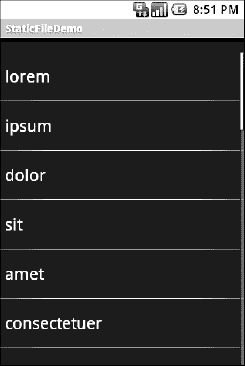

# 三十、访问文件

虽然 Android 通过偏好和数据库提供结构化存储，但有时一个简单的文件就足够了。Android 提供了两种访问文件的模式:一种是应用预打包的文件，另一种是应用在设备上创建的文件。

### 你和你骑的马

假设您有一些静态数据希望随应用一起提供，比如拼写检查器的单词列表。最简单的部署方法是将文件放在`res/raw`目录中，这样它将作为打包过程的一部分作为原始资源放在 Android 应用 APK 文件中。

要访问这个文件，您需要给自己弄一个`Resources`对象。从一个活动中，这就像调用`getResources()`一样简单。一个`Resources`对象提供`openRawResource()`来获取你指定文件的一个`InputStream`。`openRawResource()`期望打包的文件有一个整数标识符，而不是路径。这就像通过`findViewById()`访问小部件一样；例如，如果将一个名为`words.xml`的文件放在`res/raw`中，这个标识符在 Java 中可以作为`R.raw.words`来访问。

因为您只能获得一个`InputStream`，所以您无法修改这个文件。因此，它实际上只对静态参考数据有用。此外，由于它在用户安装应用包的更新版本之前不会改变，所以要么引用数据必须在可预见的将来有效，要么您必须提供一些更新数据的方法。最简单的处理方法是使用引用数据来引导一些其他可修改的存储形式(例如，数据库)，但这会导致存储中数据的两个副本。另一种方法是保持参考数据不变，并将修改保存在文件或数据库中，然后在需要完整的信息时将它们合并在一起。例如，如果您的应用提供了一个 URL 文件，您可以拥有另一个文件来跟踪用户添加的 URL 或引用用户删除的 URL。

在`Files/Static`示例项目中，您会发现对前面的列表框示例进行了修改，这次使用了静态 XML 文件，而不是 Java 中的硬连线数组。布局是相同的:

`<?xml version="1.0" encoding="utf-8"?>
<LinearLayoutxmlns:android="http://schemas.android.com/apk/res/android"
  android:orientation="vertical"
  android:layout_width="fill_parent"
  android:layout_height="fill_parent" >
  <TextView
    android:id="@+id/selection"
    android:layout_width="fill_parent"
    android:layout_height="wrap_content"
  />
  <ListView
    android:id="@android:id/list"
    android:layout_width="fill_parent"
    android:layout_height="fill_parent"
    android:drawSelectorOnTop="false"
  />
</LinearLayout>`

除了这个 XML 文件之外，您还需要一个 XML 文件，其中包含要在列表中显示的单词:

`<words>
  <word value="lorem" />
  <word value="ipsum" />
  <word value="dolor" />
  <word value="sit" />
  <word value="amet" />
  <word value="consectetuer" />
  <word value="adipiscing" />
  <word value="elit" />
  <word value="morbi" />
  <word value="vel" />
  <word value="ligula" />
  <word value="vitae" />
  <word value="arcu" />
  <word value="aliquet" />
  <word value="mollis" />
  <word value="etiam" />
  <word value="vel" />
  <word value="erat" />
  <word value="placerat" />
  <word value="ante" />
  <word value="porttitor" />
  <word value="sodales" />
  <word value="pellentesque" />
  <word value="augue" />
  <word value="purus" />
</words>`

虽然这种 XML 结构并不完全是空间效率的模型，但对于演示来说已经足够了。

Java 代码现在必须读入 XML 文件，解析出单词，并将它们放在列表可以获取地方:

`public class StaticFileDemo extends ListActivity {
  TextView selection;` `ArrayList<String> items=new ArrayList<String>();

  @Override
  public void **onCreate**(Bundle icicle) {
    super**.onCreate**(icicle);
    **setContentView**(R.layout.main);
    selection=(TextView)**findViewById**(R.id.selection);

    try {
      InputStream in=**getResources**()**.openRawResource**(R.raw.words);
      DocumentBuilder builder=DocumentBuilderFactory
                               **.newInstance**()
                               **.newDocumentBuilder**();
      Document doc=builder**.parse**(in, null);
      NodeList words=doc**.getElementsByTagName**("word");

      for (inti=0;i<words**.getLength**();i++) {
        items**.add**(((Element)words**.item**(i))**.getAttribute**("value"));
      }

      in**.close()**;
    }
    catch (Throwable t) {
      Toast
        **.makeText**(this, "Exception: "+t**.toString**(), Toast.LENGTH_LONG)
        **.show**();
    }

    **setListAdapter**(new ArrayAdapter<String>(this,
                                 android.R.layout.simple_list_item_1,
                                 items));
  }

  public void **onListItemClick**(ListView parent, View v, int position,
                  long id) {
    selection**.setText**(items**.get**(position)**.toString**());
  }
}`

**注意:**我们对`openRawResource()`的调用引用了前面描述的`R.raw.words`。从冰激凌三明治开始，更具体地说，SDK 和 ADT 版本 14 和 15，Google 已经禁止以这种方式引用一些资源字段，允许库项目只编译一次，然后跨应用重用。通常，这不值得一提。然而，在 Eclipse 中，随 SDK 14 发布的 ADT 插件错误地将我们的用法标记为错误，试图在`switch`语句中使用`R.raw.words`。在这个问题解决之前，您需要从命令行构建或者调整您的 ADT 插件级别。

分歧主要在`onCreate()`内部。我们为 XML 文件(`getResources().openRawResource(R.raw.words)`)获取一个`InputStream`，然后使用内置的 XML 解析逻辑将文件解析成一个 DOM `Document`，挑选出单词元素，然后将值属性注入一个`ArrayList`供`ArrayAdapter`使用。

产生的活动看起来和以前一样，如 Figure 30–1 所示，因为单词列表是相同的，只是重新定位了。

**图 30–1。***static file demo 示例应用*

当然，还有更简单的方法将 XML 文件作为预打包文件提供给你，比如使用 XML 资源。这在第三十一章中有所涉及。然而，虽然这个例子使用了 XML，但是这个文件也可以是一个简单的每行一个单词的列表，或者是 Android 资源系统本身不处理的其他格式。

### 读取“n 个 writin”

读写您自己的特定于应用的数据文件几乎与您在桌面 Java 应用中所做的一样。关键是在活动或其他上下文中使用 openFileInput()和 openFileOutput()来分别获得 InputStream 和 OutputStream。从这一点来看，它与常规 Java I/O 逻辑没有太大区别:

*   根据需要包装那些流，比如通过使用一个`InputStreamReader`或`OutputStreamWriter`用于基于文本的 I/O。
*   读取或写入数据。
*   完成后，使用`close()`释放流。

如果两个应用都试图通过`openFileInput()`读取一个`notes.txt`文件，那么每个应用都将访问自己的文件版本。如果您需要从许多地方访问一个文件，您可能希望创建一个内容提供者，这将在下一章中描述。

注意`openFileInput()`和`openFileOutput()`不接受文件路径(如`path/to/file.txt`)，只接受简单的文件名。

下面是世界上最简单的文本编辑器的布局，摘自`Files/ReadWrite`示例应用:

`<?xml version="1.0" encoding="utf-8"?>
<EditTextxmlns:android="http://schemas.android.com/apk/res/android"
  android:id="@+id/editor"
  android:layout_width="fill_parent"
  android:layout_height="fill_parent"
  android:singleLine="false"
  android:gravity="top"
  />`

我们这里只有一个很大的文本编辑小工具…这很无聊。

Java 只是稍微复杂一点:

`package com.commonsware.android.readwrite;

importandroid.app.Activity;
importandroid.os.Bundle;
importandroid.view.View;
importandroid.widget.Button;
importandroid.widget.EditText;
importandroid.widget.Toast;
importjava.io.BufferedReader;
importjava.io.File;
importjava.io.InputStream;
importjava.io.InputStreamReader;
importjava.io.OutputStream;
importjava.io.OutputStreamWriter;

public class ReadWriteFileDemo extends Activity {
  private final static String NOTES="notes.txt";
  privateEditText editor;

  @Override
  public void onCreate(Bundle icicle) {
    super**.onCreate**(icicle);
    **setContentView**(R.layout.main);
    editor=(EditText)**findViewById**(R.id.editor);
  }

  public void **onResume**() {
    super**.onResume**();

    try {
      IputStream in=**openFileInput**(NOTES);

      if (in!=null) {` `        InputStreamReader tmp=new **InputStreamReader**(in);
        BufferedReader reader=new **BufferedReader**(tmp);
        String str;
        StringBuilderbuf=new **StringBuilder**();

        while ((str = reader**.readLine**()) != null) {
          buf**.append**(str+"\n");
        }

        in**.close**();
        editor**.setText**(buf**.toString**());
      }
    }
    catch (java.io.FileNotFoundException e) {
      // that's OK, we probably haven't created it yet
    }
    catch (Throwable t) {
      Toast
        **.makeText**(this, "Exception: "+t**.toString**(), Toast.LENGTH_LONG)
        **.show**();
    }
  }

  public void **onPause**() {
    super**.onPause**();

    try {
      OutputStreamWriter out=
          new **OutputStreamWriter**(**openFileOutput**(NOTES, 0));

      out**.write**(editor**.getText**().toString());
      out.close();
    }
    catch (Throwable t) {
      Toast
        **.makeText**(this, "Exception: "+t.toString(), Toast.LENGTH_LONG)
        **.show**();
    }
  }
}`

首先，我们挂钩到`onResume()`，这样我们就可以控制我们的编辑器什么时候复活，从新启动还是被冻结。我们使用`openFileInput()`读入`notes.txt`，并将内容注入文本编辑器。如果没有找到文件，我们假设这是第一次运行活动(或者文件通过其他方式被删除)，我们只是让编辑器为空。

接下来，我们挂钩到`onPause()`，这样当我们的活动被另一个活动隐藏或者被关闭时，我们就可以获得控制权，比如通过设备的 Back 按钮。这里，我们使用`openFileOutput()`打开`notes.txt`，将文本编辑器的内容注入其中。

最终结果是我们有了一个持久的记事本，如图图 30–2 和 30–3 所示。任何输入的内容都会保留，直到被删除，直到我们的活动被关闭(例如，通过后退按钮)，手机被关闭，或者类似的情况。

**图 30–2。***read write file demo 示例应用，如同最初启动的*

**图 30–3。** *同样的应用，输入一些文字后*

使用应用本地文件的另一种方法是使用`getFilesDir()`。这将返回一个`File`对象，该对象指向板载闪存中应用可以存储文件的位置。这个目录是`openFileInput()`和`openFileOutput()`工作的地方。然而，虽然`openFileInput()`和`openFileOutput()`不支持子目录，但如果需要，可以使用`getFilesDir()`中的`File`来创建和导航子目录。

默认情况下，只有您的应用可以访问存储在此处的文件。设备上的其他应用无权读取该空间，更不用说写入了。然而，请记住，一些用户“root”他们的 Android 手机，获得超级用户权限。这些用户将能够读写他们想要的任何文件。因此，请不要认为应用本地文件对感兴趣的用户是安全的。

### 外部存储:巨大的经济空间

除了应用本地存储，您还可以访问外部存储。这可能是可移动媒体卡的形式，如 SD 卡或 microSD 卡，或者是附加的板载闪存，用作“外部存储”。

有利的一面是，外部存储往往比板载存储有更多的可用空间。机载存储可能相当有限；例如，最初的 T-Mobile G1 (HTC Dream)所有应用的总容量为 70MB。虽然新手机提供了更多的板载空间，但外部存储通常至少为 2GB，最大可达 32GB。

不利的一面是，如果愿意，所有应用都可以读写外部存储，因此这些文件不是很安全。此外，外部存储可以作为 USB 大容量存储设备安装在主机上，当它在此模式下使用时，Android 应用无法访问它。因此，在任何给定的时刻，外部存储器上的文件可能对您可用，也可能不可用。

#### 往哪里写

如果您的应用有太大的文件，不能冒险放在应用本地文件区域，那么您可以使用`getExternalFilesDir()`，它可用于任何活动或其他`Context`。这为您提供了一个`File`对象，它指向在外部存储器上自动创建的目录，对于您的应用是唯一的。虽然不能抵御其他应用，但它有一个很大的优势:当您的应用被卸载时，这些文件会被自动删除，就像应用本地文件区域中的文件一样。

如果你有更多属于用户而不是你的应用的文件(例如，相机拍摄的照片、下载的 MP3 文件等。)，更好的解决方案是使用`Environment`类上可用的`getExternalStoragePublicDirectory()`。这为您提供了一个`File`对象，该对象基于您传递给`getExternalStoragePublicDirectory()`的类型，指向为特定类型的文件留出的目录。例如，你可以分别请求`DIRECTORY_MOVIES`、`DIRECTORY_MUSIC`或`DIRECTORY_PICTURES`来存储 MP4、MP3 或 JPEG 文件。卸载应用时，这些文件将被留下。

您还会在`Environment`上找到一个`getExternalStorageDirectory()`方法，指向外部存储的根目录。这不再是首选方法，之前描述的方法有助于更好地组织用户的文件。然而，如果你支持旧的 Android 设备，你可能需要使用`getExternalStorageDirectory()`，仅仅是因为新的选项可能对你不可用。

#### 什么时候写

从 Android 1.6 开始，您还需要持有权限才能使用外部存储(例如，`WRITE_EXTERNAL_STORAGE`)。权限的概念将在后面的章节中介绍。

此外，如果用户将外部存储器作为 USB 存储设备安装，它可能会被占用。您可以使用`getExternalStorageState()`(在`Environment`上的一个静态方法)来确定外部存储器目前是否可用。

### StrictMode:避免 Janky 代码

如果用户觉得你的应用响应迅速，他们就更可能喜欢你的应用。所谓“反应灵敏”，我们的意思是它对用户的操作做出快速而准确的反应，比如点击和滑动。

相反，如果用户认为你的 UI“笨拙”——对他们的请求反应迟钝——他们就不太可能对你的应用满意。例如，也许你的列表不能像用户希望的那样平滑滚动，或者点击一个按钮不能立即得到他们想要的结果。

虽然线程和`AsyncTask`之类的东西会有所帮助，但是在哪里应用它们并不总是显而易见的。使用 Traceview 或类似的 Android 工具进行全面的性能分析当然是可能的。然而，开发人员在主应用线程上做的一些标准的事情，有时很偶然，往往会导致缓慢:

*   用于板载存储和外部存储(例如 SD 卡)的闪存 I/O
*   网络输入输出

然而，即使在这里，也可能看不出您是在主应用线程上执行这些操作。当操作实际上是由您简单调用的 Android 代码完成时，情况尤其如此。

这就是`StrictMode`的用武之地。它的任务是帮助您确定您在主应用线程上做什么事情可能会导致不愉快的用户体验。

#### 设置严格模式

制定一套政策。目前有两类策略:虚拟机策略和线程策略。VM 策略代表了与您的整个应用相关的糟糕的编码实践，特别是泄漏 SQLite `Cursor`对象和 kin。线程策略表示在主应用线程上执行时不好的事情，特别是闪存 I/O 和网络 I/O。

每个策略都规定了`StrictMode`应该注意什么(例如，闪存读取可以，但闪存写入不行)以及当您违反规则时`StrictMode`应该如何反应，例如

*   将消息记录到 LogCat
*   显示一个对话框
*   崩溃你的应用(说真的！)

最简单的方法是从第一个活动的`onCreate()`调用`StrictMode`上的静态`enableDefaults()`方法。这将设置正常操作，通过简单地记录到 LogCat 来报告所有违规。但是，如果您愿意，您可以通过`Builder`对象设置自己的定制策略。

#### 了解 StrictMode 的实际应用

`Threads/ReadWriteStrict`示例应用是本章前面显示的`Files/ReadWrite`示例应用的翻版。它所添加的只是一个定制的`StrictMode`线程策略:

`StrictMode**.setThreadPolicy**(new StrictMode.ThreadPolicy**.Builder**()
                           **.detectAll**()
                           **.penaltyLog**()
                           **.build**());`

如果您运行该应用，用户将看不到任何区别。但是，您将在 LogCat 中看到一条调试级别的日志消息，其中包含以下堆栈跟踪:

`12-28 17:19:40.009: DEBUG/StrictMode(480): StrictMode policy violation; ~duration=169
 ms: android.os.StrictMode$StrictModeDiskReadViolation: policy=23 violation=2
12-28 17:19:40.009: DEBUG/StrictMode(480): at
 android.os.StrictMode$AndroidBlockGuardPolicy.onReadFromDisk(StrictMode.java:745)
12-28 17:19:40.009: DEBUG/StrictMode(480): at
 dalvik.system.BlockGuard$WrappedFileSystem.open(BlockGuard.java:228)
12-28 17:19:40.009: DEBUG/StrictMode(480): at
 android.app.ContextImpl.openFileOutput(ContextImpl.java:410)
12-28 17:19:40.009: DEBUG/StrictMode(480): at
 android.content.ContextWrapper.openFileOutput(ContextWrapper.java:158)
12-28 17:19:40.009: DEBUG/StrictMode(480): at
 com.commonsware.android.readwrite.ReadWriteFileDemo.onPause(ReadWriteFileDemo.java:82)
…`

这里，`StrictMode`警告我们，我们试图在主应用线程(我们设置了`StrictMode`策略的线程)上进行闪存写入。理想情况下，我们会重写这个项目，以使用一个`AsyncTask`或写出数据的东西。

#### 请只开发！

不要在生产代码中使用`StrictMode`。它是为构建、测试和调试应用而设计的。它不是为野外使用而设计的。

为了解决这个问题，你可以

*   在准备生产构建时，只需注释掉或删除`StrictMode`安装代码
*   需要时，使用某种生产标志跳过`StrictMode`设置代码

#### 有条件的严格

`StrictMode`仅适用于 Android 2.3 及更高版本。因此，如果我们的代码中有它，即使是在开发模式中，当我们尝试在旧的模拟器或设备上测试时，它可能会干扰。正如我们在前面的章节中看到的，有一些技术可以解决这个问题，但是使用反射来配置`StrictMode`会非常痛苦。

因此，正确的方法是简单地组织您的代码，使您拥有使用较新 API 的常规类，但是您不要在较旧的设备上加载这些类。`APIVersions/ReadWriteStrict`项目演示了这一点，允许应用在可用的地方使用 Android 2.3 的`StrictMode`,在不可用的地方跳过它。

当我们在本节前面检查`StrictMode`时，我们在示例活动的`onCreate()`方法中配置了`StrictMode`。这是可行的，但是只在 Android 2.3 和更新的版本上。

为了让它在旧版本的 Android 上工作，我们使用了`StrictWrapper`:

`packagecom.commonsware.android.readwrite;

importandroid.os.Build;

abstract class StrictWrapper {
  static private StrictWrapper INSTANCE=null;

  static public void init() {
    if (Build.VERSION.SDK_INT>=Build.VERSION_CODES.GINGERBREAD) {
      INSTANCE=new **StrictForRealz**();
    }
    else {
      INSTANCE=new **NotAllThatStrict**();
    }
  }

  static class NotAllThatStrict extends StrictWrapper {
    // no methods needed
  }
}`

这个看起来很奇怪的类封装了我们处理`StrictMode`的“做我们或者不做我们”的逻辑。它包含一个`init()`方法，当被调用时，检查应用运行在哪个版本的 Android 上，并基于它创建一个`StrictWrapper`子类的单例实例——对于 Android 2.3 和更高版本为`StrictForRealz`，对于旧版本的 Android 为`NotAllThatStrict`。后一个类是`StrictWrapper`的静态内部类，什么都不做，反映出 Android 较新版本中没有`StrictMode`。

`StrictForRealz`包含了`StrictMode`的初始化逻辑:

`packagecom.commonsware.android.readwrite;

importandroid.os.StrictMode;

classStrictForRealz extends StrictWrapper {
  **StrictForRealz**() {
    StrictMode**.setThreadPolicy**(new StrictMode.ThreadPolicy**.Builder**()
                               **.detectAll**()
                               **.penaltyLog**()
                               **.build**());
  }
}`

并且，我们活动的`onCreate()`方法调用`StrictWrapper`上的`init()`，以触发创建适当的对象:

`@Override
public void **onCreate**(Bundle icicle) {
  super**.onCreate**(icicle);
  **setContentView**(R.layout.main);

  StrictWrapper**.init**();

  editor=(EditText)**findViewById**(R.id.editor);
}`

当活动第一次启动时，`StrictWrapper`和`StrictForRealz`都没有被加载到流程中。一旦我们到达`onCreate()`中的`init()`语句，Android 就会将`StrictWrapper`加载到这个过程中，但是这是安全的，因为它不会引用任何可能不存在的类。只有当我们安全地使用受支持的 Android 版本时，`StrictWrapper`上的`init()`方法才会执行涉及`StrictForRealz`的语句。因此，`StrictForRealz`只有在我们使用较新的 Android 版本时才会被加载到进程中，所以我们在`StrictForRealz`中使用`StrictMode`不会触发`VerifyError`。

在这里，我们所需要的只是一点初始化。singleton 模式用于演示如果您愿意，您可以公开一个依赖于版本的 API 实现。简单地将 API 定义为抽象类(`StrictWrapper`)上的抽象方法，并在具体子类(`StrictForRealz`、`NotAllThatStrict`)上拥有这些抽象方法的依赖于版本的具体实现。

### Linux 文件系统:同步，你赢了

Android 建立在 Linux 内核之上，使用 Linux 文件系统来保存文件。传统上，Android 使用 YAFFS(另一种闪存文件系统)，优化用于低功耗设备，将数据存储到闪存中。今天，许多设备仍在使用 YAFFS。

YAFFS 有一个大问题:一次只有一个进程可以写入文件系统。YAFFS 不提供文件级锁定，而是提供分区级锁定。这可能会成为一个瓶颈，特别是当 Android 设备的功能越来越强大，并且开始想要同时做更多的事情时，就像他们的台式机和笔记本兄弟一样。

Android 开始向 ext4 发展，ext 4 是另一个针对台式机/笔记本的 Linux 文件系统。您的应用不会直接感觉到差异。然而，ext4 做了相当多的缓冲，它会给没有考虑这种缓冲的应用带来问题。2008 年和 2009 年，当 ext4 开始流行时，Linux 应用开发人员一头扎进了这个领域。作为一个 Android 开发者，你现在需要考虑一下…你自己的文件存储。

如果你使用的是 SQLite 或者`SharedPreferences`，就不需要担心这个问题。Android(和 SQLite，如果你正在使用它)为你处理所有的缓冲问题。但是，如果您编写自己的文件，您可能希望在将数据刷新到磁盘时考虑一个额外的步骤。具体来说，您需要触发一个名为`fsync()`的 Linux 系统调用，它告诉文件系统确保所有缓冲区都被写入磁盘。

如果你在同步模式下使用`java.io.RandomAccessFile`，这一步也会为你处理，所以你不需要担心。然而，Java 开发人员倾向于使用`FileOutputStream`，它不会触发`fsync()`，即使您在流上调用`close()`。相反，你在`FileOutputStream`上调用`getFD().sync()`来触发`fsync()`。注意，这可能很耗时，所以只要可行，磁盘写应该在主应用线程之外完成，比如通过`AsyncTask`。