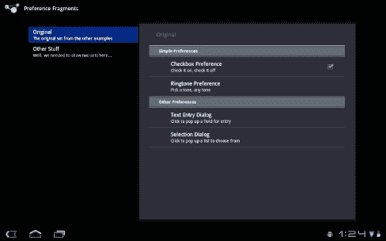
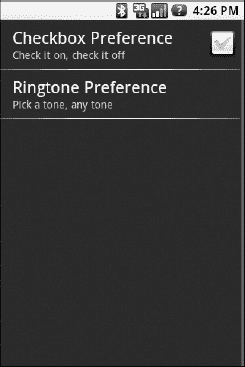
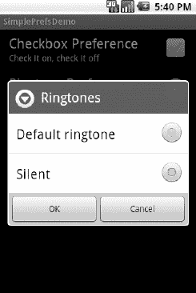
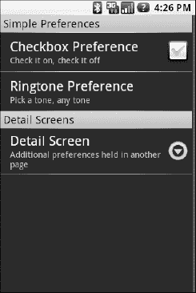
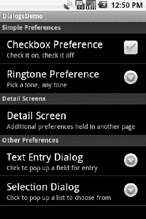
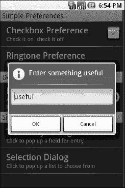
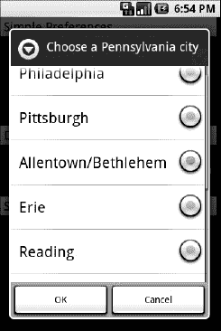

# 三十一、使用偏好设置

Android 有许多不同的方式供您存储数据，供您的活动长期使用。最容易使用的是首选项系统，这是本章的重点。

Android 允许活动和应用以键/值对(类似于`Map`)的形式保存首选项，这些首选项将在活动调用之间保留。顾名思义，首选项的主要目的是让您能够存储用户指定的配置细节，比如用户在您的提要阅读器中查看的最后一个提要、默认情况下在列表中使用的排序顺序等等。当然，您可以在首选项中存储任何您喜欢的内容，只要它是由一个`String`键控的，并且有一个原始值(`boolean`、`String`等)。)

首选项可以针对单个活动，也可以在应用中的所有活动之间共享。其他组件(如服务)也可以使用共享偏好设置。

### 得到你想要的

要访问首选项，有三个 API 可供选择:

*   `getPreferences()`在您的`Activity`中，访问特定活动的偏好设置
*   从您的`Activity`(或其他应用`Context`)中，访问应用级偏好设置
*   `getDefaultSharedPreferences()`，在`PreferenceManager`上，获取与 Android 的整体偏好设置框架协同工作的共享偏好设置

前两个方法采用安全模式参数—正确的选择是`MODE_PRIVATE`，这样其他应用就不能访问该文件。`getSharedPreferences()`方法还接受一组首选项的名称。`getPreferences()`有效地调用`getSharedPreferences()`，将活动的类名作为首选项集名。`getDefaultSharedPreferences()`方法将`Context`作为首选项(例如，您的`Activity`)。

所有这些方法都返回一个`SharedPreferences`的实例，它提供了一系列的 getters 来访问命名的首选项，返回一个合适类型的结果(例如，`getBoolean()`返回一个布尔首选项)。getters 还采用默认值，如果在指定的键下没有设置首选项，则返回该值。

除非你有很好的理由不这样做，否则最好使用第三个选项——`getDefaultSharedPreferences()`——因为这将为你提供默认情况下与`PreferenceActivity`一起工作的`SharedPreferences`对象，这将在本章后面描述。

### 陈述你的偏好

给定适当的`SharedPreferences`对象，您可以使用`edit()`来获得首选项的编辑器。这个对象有一组设置器，这些设置器镜像父`SharedPreferences`对象上的获取器。它还有以下方法:

*   `remove()`:删除单个命名的首选项
*   `clear()`:删除所有首选项
*   `commit()`:保存您通过编辑器所做的更改

`commit()`方法很重要，因为如果您通过编辑器修改首选项，并且未能`commit()`更改，那么一旦编辑器超出范围，这些更改就会消失。请注意，Android 2.3 有一个`apply()`方法，它的工作方式类似于`commit()`，但运行速度更快。

相反，由于 preferences 对象支持实时更改，如果应用的一部分(比如一个活动)修改了共享的首选项，应用的另一部分(比如一个服务)将可以立即访问更改后的值。

### 引入偏好片段和偏好活动

您可以运行自己的活动来收集用户的偏好。总的来说，这是个坏主意。相反，根据您的目标 Android 版本，使用首选 XML 资源和一个`PreferenceFragment`或一个`PreferenceActivity`。为什么呢？对 Android 开发人员的一个常见抱怨是他们缺乏纪律性，不遵循平台固有的任何标准或惯例。对于其他操作系统，设备制造商可能会阻止你分发违反其人机界面准则的应用。对于 Android 来说，情况并非如此——但这并不意味着你可以为所欲为。如果有标准或惯例，请遵循它，这样用户会对你的应用和他们的设备感觉更舒服。在 Android 3.0 或更高版本中使用`PreferenceFragment`，或者在早期版本中使用`PreferenceActivity`来收集偏好就是这样一种惯例。Android 3.0 和 4.0 对`PreferenceActivity`的行为进行了改进，因此我们将首先介绍使用偏好设置的新方式，然后说明原始模型——这对于许多现有的 Android 1.x 和 2.x 设备非常有用，您的代码可能需要与这些设备兼容。

### 片段偏好

Android 3.0 和更高版本引入了新的和改进的`PreferenceScreen`和`PreferenceActivity`。这使得偏好选择在大屏幕上看起来很棒，提供了大量设置的快速访问，如图 Figure 31–1 所示。

**图 31–1。**??【preference activity】使用片段

不利的一面是，新系统不是 Android 兼容性库的一部分，因此不能直接用于 3.0 之前的 Android 版本。也就是说，有可能找到一个向后兼容的解决方案，尽管如果您有很多偏好，这可能需要一些努力。

### 偏好新的和改进的方式

在 Android 的前蜂巢版本中，一个`PreferenceActivity`子类从资源文件中加载首选项，以指示屏幕上应该显示什么。在 Honeycomb 和 Ice Cream Sandwich 中，一个`PreferenceActivity`子类从资源文件中加载首选项*标题*，以指示屏幕上应该显示什么。

#### 首选项标题

从视觉上看，首选项标题不是首选项类别(在一组首选项上放置一个标题)。相反，首选项标题是首选项的主要群集。表头列在左侧，所选表头的首选项显示在右侧，如图 Figure 31–1 所示。冰激凌三明治或蜂巢`PreferenceActivity`调用`loadHeadersFromResource()`，指向另一个描述偏好头的 XML 资源。例如，下面是来自`Prefs/Fragments`样本项目的`res/xml/preference_headers.xml`:

`<preference-headers xmlns:android="http://schemas.android.com/apk/res/android">
    <header android:fragment="com.commonsware.android.preffrags.StockPreferenceFragment"
            android:title="Original"
            android:summary="The original set from the other examples">
      <extra android:name="resource" android:value="preferences" />
    </header>
    <header android:fragment="com.commonsware.android.preffrags.StockPreferenceFragment"
            android:title="Other Stuff"
            android:summary="Well, we needed to show two sets here…">
      <extra android:name="resource" android:value="preferences2" />
    </header>
</preference-headers>`

每个`<header>`元素表示将描述属于标题的首选项的`PreferenceFragment`子类。此外，`<header>`元素描述了标题和摘要，以及一个可选的图标(`android:icon`属性)。一个`<header>`元素也可能有一个或多个`<extra>`子元素，提供一个`PreferenceFragment`可以用来配置的额外数据的键/值对。在前面的例子中，每个`<header>`元素都有一个`<extra>`元素，它定义了一个 XML 资源的名称，该资源将保存该头的首选项。

因此，`PreferenceActivity`是一个非常短的结构:

`package com.commonsware.android.preffrags;

import android.os.Bundle;
import android.preference.PreferenceActivity;
import java.util.List;

public class EditPreferences extends PreferenceActivity {
  @Override
  public void **onBuildHeaders**(List<Header> target) {
    **loadHeadersFromResource**(R.xml.preference_headers, target);
  }
}`

您覆盖了一个`onLoadHeaders()`方法，并在那里调用`loadHeadersFromResource()`。

#### PreferenceFragment 和 StockPreferenceFragment

如前所述，首选项头指向`PreferenceFragment`的子类。`PreferenceFragment`的工作是做`PreferenceActivity`在旧版本的 Android 中所做的事情(我们将很快介绍)——调用`addPreferencesFromResource()`来定义当相关联的标题在左边被点击时将在右边显示的偏好。

`PreferenceFragment`的奇怪之处在于它需要子类。考虑到绝大多数这样的片段会简单地在单个资源上调用`addPreferencesFromResource()` 一次，将它内置到 Android 中似乎是合乎逻辑的，允许`PreferenceFragment`的子类用于更复杂的情况。然而，目前还不支持。官方的 Android 示例会让你为每个 preference 头创建一个`PreferenceFragment`子类，这似乎很浪费。

另一种方法是使用`StockPreferenceFragment`，一个在`Prefs/Fragments`项目中实现的`PreferenceFragment`子类，但是可以在任何地方使用。它假设您已经向`<header>`添加了一个`<extra>`来标识要加载的首选 XML 资源的名称，并加载它。不需要额外的子类。这就是上一节中显示的两个头如何指向单个`StockPreferenceFragment`实现的原因。

并不特别长，但它确实使用了一个技巧:

`package com.commonsware.android.preffrags;

import android.os.Bundle;
import android.preference.PreferenceFragment;

public class StockPreferenceFragment extends PreferenceFragment {
  @Override
  public void **onCreate**(Bundle savedInstanceState) {
    super**.onCreate**(savedInstanceState);

    int res=**getActivity**()
              **.getResources**()
              **.getIdentifier**(**getArguments**()**.getString**("resource"),
                             "xml",
                             **getActivity**()**.getPackageName**());

    **addPreferencesFromResource**(res);
  }
}`

为了得到额外的内容，`PreferenceFragment`可以调用`getArguments()`，后者返回一个`Bundle`。在我们的例子中，我们可以通过`getArguments().getString("resource")`获得`resources`额外价值。问题是，这是一个`String`，不是资源 ID。为了调用`addPreferencesFromResource()`，我们需要只知道名称的首选项的资源 ID。

窍门就是用`getIdentifier()`。在给定三条信息的情况下，`Resources`对象上的`getIdentifier()`方法(通过调用`Activity`上的`getResources()`获得)将使用反射来查找资源 ID:

*   资源的名称(在这种情况下，是参数中的值)
*   资源的类型(在本例中为`xml`)
*   这个 ID 应该驻留的包(通常是您自己的包，通过调用`Activity`上的`getPackageName()`获得)

因此，`StockPreferenceFragment`使用`getIdentifier()`将额外的`resource`转换成资源 ID，然后与`addPreferencesFromResource()`一起使用。

注意`getIdentifier()`并不是特别快，因为它使用了反射。不要在一个紧循环中，在一个`Adapter`的`getView()`中，或者在任何可能会被调用数千次的地方使用它。

#### 避免嵌套的 PreferenceScreen 元素

在前蜂窝 Android 中，如果你有很多偏好，你可以考虑把它们变成嵌套的`PreferenceScreen`元素。最好将它们分成单独的首选项标题。部分原因是为了提供更好的用户体验——用户可以直接看到和访问各种标题，而不是不得不费力地通过你的首选项来找到导致嵌套的`PreferenceScreen`的标题。部分原因也是因为嵌套的`PreferenceScreen` UI 没有采用当代的 Android 外观和感觉(例如，没有嵌套的首选项标题)，所以会有视觉冲突。

#### 标题或偏好的意图

如果您需要收集一些超出标准首选项处理能力的首选项，您有一些选择。

一种选择是创建自定义的`Preference`。扩展`DialogPreference`来创建自己的`Preference`实现并不特别困难。然而，它确实把你限制在一个对话框中。

另一种选择是将一个`<intent>`元素指定为一个`<header>`元素的子元素。当用户点击这个标题时，您指定的`Intent`与`startActivity()`一起使用，为您提供了一个自己收集偏好 UI 无法处理的东西的活动的入口。例如，您可以使用下面的`<header>`:

`<header android:icon="@drawable/something"
        android:title="Fancy Stuff"
        android:summary="Click here to transcend your plane of existence">
  <intent android:action="com.commonsware.android.MY_CUSTOM_ACTION" />
</header>`

然后，只要您有一个带有指定您想要的动作(`com.commonsware.android.MY_CUSTOM_ACTION`)的`<intent-filter>`的活动，当用户点击相关的标题时，该活动将得到控制。

#### 增加向后兼容性

当然，本节描述的所有内容仅适用于 Android 3.0 至 4.0 及更高版本。其他数以百万计的安卓设备呢？它们是剁碎的肝脏吗？不。一方面，切碎的肝脏有众所周知的不好的细胞接收。然而，他们将不得不退回到最初的方法。由于旧版本的 Android 不能加载引用来自新版本 Android 的其他类或方法的类，最简单的方法是有两个`PreferenceActivity`类，一个新的，一个旧的。

例如，`Prefs/FragmentsBC`示例项目包含了来自`Prefs/Fragments`的所有代码，并做了一些修改。首先，针对冰淇淋三明治和蜂巢的`EditPreferences`类的特定版本被重命名为`EditPreferencesNew`。基于我们最初的 prefragment 实现，添加了另一个`EditPreferences`类:

`package com.commonsware.android.preffrags;

import android.os.Bundle;
import android.preference.PreferenceActivity;

public class EditPreferences extends PreferenceActivity {
  @Override
  public void **onCreate**(Bundle savedInstanceState) {
    super**.onCreate**(savedInstanceState);

    **addPreferencesFromResource**(R.xml.preferences);
    **addPreferencesFromResource**(R.xml.preferences2);
  }
}`

这里，我们利用了这样一个事实，即可以多次调用`addPreferencesFromResource()`来简单地将我们的两个 preference 头的 preferences 值链接在一起。此外，打开我们的`PreferenceActivity`的选项菜单选项会根据我们的`Build.VERSION.SDK_INT`值选择正确的选项:

`  @Override
  public boolean onOptionsItemSelected(MenuItem item) {
    switch (item.getItemId()) {
      case EDIT_ID:
        if (Build.VERSION.SDK_INT<Build.VERSION_CODES.HONEYCOMB) {
                                                                       startActivity(new
Intent(this, EditPreferences.class));
        }
        else {
                                                                       startActivity(new
Intent(this, EditPreferencesNew.class));
        }

        return(true);
      }

    return(super.onOptionsItemSelected(item));
  }`

因此，我们只在已知安全的情况下使用`EditPreferencesNew`类。否则，我们使用旧的。

#### 偏好处理的旧模型

在旧版本的 Android 3 . x 之前，首选项框架和`PreferenceActivity`的关键是另一种 XML 数据结构。您可以在项目的`res/xml/`目录中存储的 XML 文件中描述您的应用的首选项。考虑到这一点，Android 可以呈现一个令人愉快的用户界面来操作这些偏好，然后存储在你从`getDefaultSharedPreferences()`返回的`SharedPreferences`中。即使您计划将 Android 3.0 和更高版本作为目标，下面的例子对您也很有用，因为它们展示了基本的首选项元素(如复选框和输入字段)是如何工作的——这些基本元素在新旧方法中都是通用的。

以下是`Prefs/Simple`首选项示例项目的首选项 XML:

`<PreferenceScreen
  xmlns:android="http://schemas.android.com/apk/res/android">
  <CheckBoxPreference
    android:key="checkbox"
    android:title="Checkbox Preference"
    android:summary="Check it on, check it off" />
  <RingtonePreference
    android:key="ringtone"
    android:title="Ringtone Preference"
    android:showDefault="true"
    android:showSilent="true"
    android:summary="Pick a tone, any tone" />
</PreferenceScreen>`

首选项 XML 的根是一个`PreferenceScreen`元素。毫不奇怪，您可以在`PreferenceScreen`元素中拥有的一些东西是偏好定义。这些是`Preference`的子类，如`CheckBoxPreference`或`RingtonePreference`，如前面的 XML 所示。正如你所料，这些分别允许你选择一个复选框或者选择一个铃声。在`RingtonePreference`的情况下，你有允许用户选择系统默认铃声或者选择静音作为铃声的选项。

### 让用户发表意见

假设您已经设置了首选项 XML，那么您可以使用一个近乎内置的活动来允许您的用户设置他们的首选项。该活动“几乎是内置的”,因为您只需将其子类化并指向您的首选 XML，然后将该活动与应用的其余部分挂钩。

例如，下面是`Prefs/Simple`项目的`EditPreferences`活动:

`package com.commonsware.android.simple;

import android.app.Activity;
import android.os.Bundle;
import android.preference.PreferenceActivity;

public class EditPreferences extends PreferenceActivity {
  @Override
  public void **onCreate**(Bundle savedInstanceState) {
    super**.onCreate**(savedInstanceState);

    **addPreferencesFromResource**(R.xml.preferences);
  }` `}`

如你所见，这里没有太多的*到*可看。您需要做的就是调用`addPreferencesFromResource()`并指定包含您的首选项的 XML 资源。

您还需要将此作为活动添加到您的`AndroidManifest.xml`文件中:

`<?xml version="1.0" encoding="utf-8"?>
<manifest xmlns:android="http://schemas.android.com/apk/res/android" package="com.commonsware.android.simple">
    <application android:label="@string/app_name" android:icon="@drawable/cw">
        <activity android:name=".SimplePrefsDemo" android:label="@string/app_name">
            <intent-filter>
                <action android:name="android.intent.action.MAIN"/>
                <category android:name="android.intent.category.LAUNCHER"/>
            </intent-filter>
            </activity>
            <activity android:name=".EditPreferences" android:label="@string/app_name">
            </activity>
    </application>
  <supports-screens android:largeScreens="true" android:normalScreens="true" android:smallScreens="true" android:anyDensity="true"/>
</manifest>`

您需要安排调用活动，比如从菜单选项中调用。以下摘自`SimplePrefsDemo`:

` public boolean **onCreateOptionsMenu**(Menu menu) {
    menu**.add**(Menu.NONE, EDIT_ID, Menu.NONE, "Edit Prefs")
        **.setIcon**(R.drawable.misc)
        **.setAlphabeticShortcut**('e');

    return(super**.onCreateOptionsMenu**(menu));
  }

  @Override
  public boolean **onOptionsItemSelected**(MenuItem item) {
    switch (item**.getItemId**()) {
      case EDIT_ID:
        **startActivity**(new Intent(this, EditPreferences.class));
        return(true);
    }

    return(super**.onOptionsItemSelected**(item));
  }`

这就是所需要的全部，除了 preferences XML 之外，真的没有那么多代码。你的努力得到的是一个 Android 提供的偏好 UI，如图 Figure 31–2 所示。

**图 31–2。** *简单项目的首选项 UI*

该复选框可以直接选中或取消选中。要更改铃声首选项，只需选择首选项列表中的条目，弹出选择对话框，如 Figure 31–3 所示。

**图 31–3。** *选择铃声偏好*

注意，`PreferenceActivity`上没有明确的保存或提交按钮或菜单——更改会自动保存。

除了具有上述菜单之外，`SimplePrefsDemo`活动还通过`TableLayout`显示当前偏好:

`<?xml version="1.0" encoding="utf-8"?>
<TableLayout
  xmlns:android="http://schemas.android.com/apk/res/android"
  android:layout_width="fill_parent"
  android:layout_height="fill_parent"
>
  <TableRow>
    <TextView
        android:text="Checkbox:"
        android:paddingRight="5dip"
    />
    <TextView android:id="@+id/checkbox"
    />
  </TableRow>
  <TableRow>
    <TextView
        android:text="Ringtone:"
        android:paddingRight="5dip"
    />
    <TextView android:id="@+id/ringtone"
    />
  </TableRow>
</TableLayout>`

该表的字段位于`onCreate()`:

`public void **onCreate**(Bundle savedInstanceState) {
  super**.onCreate**(savedInstanceState);
  **setContentView**(R.layout.main);

  checkbox=(TextView)**findViewById**(R.id.checkbox);
  ringtone=(TextView)**findViewById**(R.id.ringtone);
}`

这些字段在每个`onResume()`更新:

`public void **onResume**() {
  super**.onResume**();

  SharedPreferences prefs=PreferenceManager
                           **.getDefaultSharedPreferences**(this);

  checkbox**.setText**(new **Boolean**(prefs
                               **.getBoolean**("checkbox", false))
                     **.toString**());
  ringtone.setText(prefs**.getString**("ringtone", "<unset>"));
}`

这意味着这些字段将在打开活动时和离开首选项活动后更新(例如，通过后退按钮)，如 Figure 31–4 所示。

**图 31–4。** *简单项目的保存偏好列表*

### 加入一点点 o’结构

如果你有很多用户需要设置的偏好，把它们都放在一个大列表里可能会很麻烦。Android 的偏好用户界面给了你一些方法来给你的偏好设置加上一点结构，包括类别和屏幕。

类别是通过首选项 XML 中的一个`PreferenceCategory`元素添加的，用于将相关的首选项组合在一起。您可以将一些`PreferenceCategory`元素放在`PreferenceScreen`中，然后将您的偏好放在它们适当的类别中，而不是将您的偏好都作为根`PreferenceScreen`的子元素。从视觉上看，这在偏好组之间添加了一个带有类别标题的分隔线。

如果你有很多很多的偏好——不方便用户滚动浏览——你也可以通过引入`PreferenceScreen`元素把它们放在单独的“屏幕”上。是的，*即*元素。

任何`PreferenceScreen`的孩子都去自己的屏幕。如果嵌套了`PreferenceScreen`元素，父屏幕会将屏幕显示为占位符条目，点击该条目会弹出子屏幕。

例如，在`Prefs/Structured`示例项目中，有一个包含`PreferenceCategory`和嵌套的`PreferenceScreen`元素的首选 XML 文件:

`<PreferenceScreen
  xmlns:android="http://schemas.android.com/apk/res/android">
  <PreferenceCategory android:title="Simple Preferences">
    <CheckBoxPreference` `      android:key="checkbox"
      android:title="Checkbox Preference"
      android:summary="Check it on, check it off"
    />
    <RingtonePreference
      android:key="ringtone"
      android:title="Ringtone Preference"
      android:showDefault="true"
      android:showSilent="true"
      android:summary="Pick a tone, any tone"
    />
  </PreferenceCategory>
  <PreferenceCategory android:title="Detail Screens">
    <PreferenceScreen
      android:key="detail"
      android:title="Detail Screen"
      android:summary="Additional preferences held in another page">
      <CheckBoxPreference
        android:key="checkbox2"
        android:title="Another Checkbox"
        android:summary="On. Off. It really doesn't matter."
      />
    </PreferenceScreen>
  </PreferenceCategory>
</PreferenceScreen>`

当您在您的`PreferenceActivity`实现中使用这个首选 XML 时，结果是一个元素的分类列表，如图 Figure 31–5 所示。

**图 31–5。** *结构化项目的首选项 UI，显示类别和一个屏幕占位符*

如果点击详细信息屏幕条目，您将进入儿童偏好屏幕，如图 Figure 31–6 所示。

**图 31–6。** *结构化项目偏好 UI 的子偏好画面*

### 你喜欢的弹出窗口类型

当然，并不是所有的偏好都是复选框和铃声。对于其他的，比如输入框和列表，Android 使用弹出对话框。用户不直接在首选项 UI 活动中输入他们的首选项，而是点击一个首选项，填写一个值，然后点击 OK 以提交更改。

从结构上来说，在 preference XML 中，字段和列表与其他 preference 类型没有太大的不同，如来自`Prefs/Dialogs`示例项目的 preference XML 所示:

`<PreferenceScreen
  xmlns:android="http://schemas.android.com/apk/res/android">
  <PreferenceCategory android:title="Simple Preferences">
    <CheckBoxPreference
      android:key="checkbox"
      android:title="Checkbox Preference"
      android:summary="Check it on, check it off"
    />
    <RingtonePreference
      android:key="ringtone"
      android:title="Ringtone Preference"
      android:showDefault="true"
      android:showSilent="true"
      android:summary="Pick a tone, any tone"` `    />
  </PreferenceCategory>
  <PreferenceCategory android:title="Detail Screens">
    <PreferenceScreen
      android:key="detail"
      android:title="Detail Screen"
      android:summary="Additional preferences held in another page">
      <CheckBoxPreference
        android:key="checkbox2"
        android:title="Another Checkbox"
        android:summary="On. Off. It really doesn't matter."
      />
    </PreferenceScreen>
  </PreferenceCategory>
  <PreferenceCategory android:title="Other Preferences">
    <EditTextPreference
      android:key="text"
      android:title="Text Entry Dialog"
      android:summary="Click to pop up a field for entry"
      android:dialogTitle="Enter something useful"
    />
    <ListPreference
      android:key="list"
      android:title="Selection Dialog"
      android:summary="Click to pop up a list to choose from"
      android:entries="@array/cities"
      android:entryValues="@array/airport_codes"
      android:dialogTitle="Choose a Pennsylvania city" />
  </PreferenceCategory>
</PreferenceScreen>`

使用字段(`EditTextPreference`)，除了您在首选项上添加的标题和摘要之外，您还可以为对话框提供标题。

使用 list ( `ListPreference`)，您可以提供一个对话框标题和两个字符串数组资源:一个用于显示名称，一个用于值。这些需要有相同的顺序和相同的元素数量，因为所选显示名称的索引决定了哪个值作为首选项存储在`SharedPreferences`中。例如，以下是前面示例中显示的`ListPreference`使用的数组:

`<?xml version="1.0" encoding="utf-8"?>
<resources>
  <string-array name="cities">
    <item>Philadelphia</item>
    <item>Pittsburgh</item>
    <item>Allentown/Bethlehem</item>
    <item>Erie</item>
    <item>Reading</item>
    <item>Scranton</item>
    <item>Lancaster</item>
    <item>Altoona</item>
    <item>Harrisburg</item>
  </string-array>
  <string-array name="airport_codes">
    <item>PHL</item>
    <item>PIT</item>` `    <item>ABE</item>
    <item>ERI</item>
    <item>RDG</item>
    <item>AVP</item>
    <item>LNS</item>
    <item>AOO</item>
    <item>MDT</item>
  </string-array>
</resources>`

当您调出首选项 UI 时，您从另一个类别开始，该类别包含另一对首选项条目，如 Figure 31–7 所示。

**图 31–7。** *对话框项目偏好 UI 的偏好屏幕*

点击文本输入对话框，弹出一个文本输入对话框——在这种情况下，填入先前的首选项，如 Figure 31–8 所示。

**图 31–8。** *编辑文本偏好*

点击选择对话框弹出一个选择对话框，显示一个数组的显示名称，如 Figure 31–9 所示。

**图 31–9。** *编辑列表偏好*