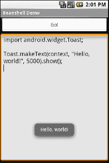

# 三十三、利用 Java 库

Java 拥有和其他现代编程语言一样多的第三方库，甚至更多。这些第三方库是您可以包含在服务器或桌面 Java 应用中的无数 JARs 这些是 Java SDKs 本身不提供的。

在 Android 的情况下，Dalvik 虚拟机(VM)的核心并不完全是 Java，它在 SDK 中提供的内容也不完全与任何传统的 Java SDK 相同。也就是说，许多 Java 第三方库提供了 Android 本身缺乏的功能，因此，如果您能让它们与 Android 风格的 Java 一起工作，它们可能对您的项目有用。

本章解释了利用这些库需要什么，并描述了 Android 对任意第三方代码支持的限制。

### 蚂蚁和罐子

将第三方代码集成到项目中有两种选择:使用源代码或使用预打包的 jar。

如果您选择使用源代码，您需要做的就是将它复制到您自己的源代码树中(在您的项目中的`src/`下)，这样它就可以与您现有的代码并排放置，然后让编译器发挥它的魔力。

如果您选择使用一个现有的 JAR，也许您没有它的源代码，您将需要教您的构建链如何使用这个 JAR。首先，将 JAR 放在 Android 项目的`libs/`目录中。然后，如果您使用的是 IDE，您可能需要将 JAR 添加到您的构建路径中(Ant 将自动选择在`libs/`中找到的所有 JAR)。这对于 Eclipse 来说是必不可少的，您需要在 Java 构建路径页面的 Libraries 选项卡下放置一个对 jar 的引用。

仅此而已。向 Android 应用添加第三方代码相当容易。然而，让它真正*工作*可能要复杂一些。

### 外部界限

并非所有可用的 Java 代码都能很好地与 Android 兼容。有许多因素需要考虑，包括:

*   期望的平台 API:代码是否假设了一个比 Android 所基于的 JVM 更新的 JVM？或者，代码是否假设 Java 2 Platform，Standard Edition (J2SE)附带了 Java APIs，而 Android 没有，比如 Swing？
*   *大小*:现有的设计用于桌面或服务器的 Java 代码不需要太关心磁盘上的大小，或者在某种程度上，甚至不需要太关心内存中的大小。当然，安卓在这两方面都有所欠缺。使用第三方 Java 代码，尤其是预打包成 jar 的时候，可能会增加应用的规模。
*   *性能*:Java 代码是否实际上假设了一个比你在许多 Android 设备上发现的更强大的 CPU？仅仅因为一台台式机可以运行它没有问题，并不意味着你的普通手机会处理得很好。
*   *接口*:Java 代码是否假设了一个控制台接口？或者它是一个纯粹的 API，你可以用它来包装你自己的接口？
*   *操作系统*:Java 代码是否假设某些控制台程序的存在？Java 代码是否认为它可以使用 Windows DLL？
*   *语言版本*:JAR 是用老版本的 Java (1.4.2 或更老)编译的吗？这个 JAR 是用不同于 Sun 官方的编译器编译的吗(比如 GCJ)？
*   *依赖性*:Java 代码是否依赖于其他可能也有这些问题的第三方 jar？Java 代码是否依赖于内置在 Android 中的第三方库(例如来自 [`http://json.org`](http://json.org) 的 JSON 库)，但是期望这些库的不同版本？

解决这些问题的一个技巧是使用开源 Java 代码，并实际处理这些代码，使其对 Android 更加友好。例如，如果您只使用了第三方库的 10 %,也许值得重新编译项目的子集，使之成为您所需要的，或者至少从 JAR 中删除不必要的类。前一种方法更安全，因为您可以获得编译器的帮助，以确保您不会丢弃一些重要的代码，尽管这样做可能更繁琐。

### 跟随脚本

与其他移动设备操作系统不同，Android 对您可以在其上运行什么没有限制，只要您可以使用 Dalvik VM 用 Java 来完成。这包括将你自己的脚本语言整合到你的应用中，这在其他设备上是被明确禁止的。

一种可能的 Java 脚本语言是 BeanShell ( [`www.beanshell.org/`](http://www.beanshell.org/) )。BeanShell 为您提供了与 Java 兼容的语法，带有隐式类型，不需要编译。

要添加 BeanShell 脚本，您需要将 BeanShell 解释器的 JAR 文件放在您的`libs/`目录中。不幸的是，可以从 BeanShell 网站下载的 2.0b4 JAR 不能与 Android 0.9 和更新的 SDK 一起开箱即用，这可能是由于构建它所用的编译器。相反，您可能应该从 Apache Subversion 检查源代码并执行`ant jarcore`来构建它，然后将结果 JAR(在 BeanShell 的`dist/`目录中)复制到您自己项目的`libs/`中。或者，在`Java/AndShell`项目中使用本书源代码附带的 BeanShell JAR。

由此看来，在 Android 上使用 BeanShell 与在任何其他 Java 环境中使用 BeanShell 没有什么不同:

1.  创建 BeanShell `Interpreter`类的一个实例。
2.  通过`Interpreter#set()`设置脚本使用的任何全局变量。
3.  调用`Interpreter#eval()`运行脚本，并可选地获取最后一条语句的结果。

例如，下面是世界上最小的 BeanShell IDE 的 XML 布局:

`<?xml version="1.0" encoding="utf-8"?>
<LinearLayoutxmlns:android="http://schemas.android.com/apk/res/android"
    android:orientation="vertical"
    android:layout_width="fill_parent"
    android:layout_height="fill_parent"
    >
<Button
    android:id="@+id/eval"
    android:layout_width="fill_parent"
    android:layout_height="wrap_content"
    android:text="Go!"
    android:onClick="go"
    />
<EditText
    android:id="@+id/script"
    android:layout_width="fill_parent"
    android:layout_height="fill_parent"
    android:singleLine="false"
    android:gravity="top"
    />
</LinearLayout>`

结合以下活动实施:

`packagecom.commonsware.android.andshell;

importandroid.app.Activity;
importandroid.app.AlertDialog;
importandroid.os.Bundle;
importandroid.view.View;
importandroid.widget.EditText;
importandroid.widget.Toast;
importbsh.Interpreter;

public class MainActivity extends Activity {
  private Interpreter i=new **Interpreter**();

  @Override
  public void **onCreate**(Bundle icicle) {
    super.**onCreate**(icicle);
    **setContentView**(R.layout.main);
}

public void **go**(View v) {
  EditText script=(EditText)**findViewById**(R.id.script);
  String src=script.**getText**().**toString**();

  try {
    i**.set**("context", MainActivity.this);
    i**.eval**(src);
  }
  catch (bsh.EvalError e) {
    AlertDialog.Builder builder=
              newAlertDialog**.Builder**(MainActivity.this);

    builder
      **.setTitle**("Exception!")
      **.setMessage(e.toString**())
      **.setPositiveButton**("OK", null)
      **.show**();
    }
  }
}`

编译并运行它(包括前面提到的合并 BeanShell JAR)，并将其安装在模拟器上。启动它，你会得到一个简单的 IDE，它有一个大的文本区域来存放你的脚本和一个大的 Go！按钮执行，如图 Figure 33–1 所示。

**图 33–1。***AndShell 豆壳 IDE*

`importandroid.widget.Toast;

Toast**.makeText**(context, "Hello, world!", Toast.LENGTH_LONG)**.show**();`

注意在制作`Toast`时使用`context`来指代活动。这是活动引用回自身的全局设置。只要`set()`调用和脚本代码使用相同的名称，您可以随意命名这个全局变量。

点击开始！按钮，您将得到如图图 33–2 所示的结果。

**图 33–2。***AndShell BeanShell IDE，执行一些代码*

现在，一些警告:

*   不是所有的脚本语言都能工作。例如，那些实现自己形式的实时(JIT)编译，动态生成 Java 字节码的人，可能需要扩充来生成 Dalvik VM 字节码，而不是那些用于普通 Java 实现的字节码。从解析过的脚本执行的更简单的语言，调用 Java 反射 API 回调编译过的类，可能会工作得更好。尽管如此，如果它依赖于 Dalvik 中不存在的传统 Java API 中的某些功能，也不是该语言的每一个特性都可以工作。例如，BeanShell 或附加 jar 中可能隐藏了一些在今天的 Android 上无法运行的东西。
*   没有 JIT 的脚本语言必然会比编译的 Dalvik 应用慢。较慢可能意味着用户体验迟缓。更慢无疑意味着同样的工作量消耗更多的电池寿命。因此，在 BeanShell 中构建一个完整的 Android 应用，仅仅因为你觉得它更容易编程，可能会导致你的用户不高兴。
*   暴露整个 Java API 的脚本语言，比如 BeanShell，可以做底层 Android 安全模型允许的任何事情。因此，如果您的应用拥有`READ_CONTACTS`权限，那么您的应用运行的任何 BeanShell 脚本都应该拥有相同的权限。
*   最后，但肯定不是最不重要的，语言解释器 jar 往往…很大。本例中使用的 BeanShell JAR 有 200KB。考虑到它所做的事情，这并不荒谬，但它会使使用 BeanShell 的应用下载起来更大，占用设备上更多的空间，等等。

### 审阅剧本

由于本章介绍了 Android 中的脚本，您可能有兴趣知道除了在项目中直接嵌入 BeanShell 之外，您还有其他选择。

已经用其他基于 JVM 的编程语言进行了一些实验，比如 JRuby 和 Jython。目前，他们对 Android 的支持并不总是 100%顺利，但正在不断取得进展。例如，那些对 Android 上的 JRuby 感兴趣的人应该在 [`http://ruboto.org`调查 Ruboto 开源项目。](http://ruboto.org)

此外，在 [`http://code.google.com/p/android-scripting/`](http://code.google.com/p/android-scripting/) 上描述的 Android 脚本层(SL4A)允许您使用 BeanShell 之外的各种脚本语言编写脚本，例如:

*   珠
*   计算机编程语言
*   JRuby
*   左上臂
*   JavaScript(通过 Rhino 实现，Rhino 是用 Java 编写的 Mozilla JavaScript 解释器)
*   服务器端编程语言（Professional Hypertext Preprocessor 的缩写）

这些脚本不是完全成熟的应用，尽管 SL4A 团队正在努力让你将它们转换成带有基本 ui 的 APK 文件。对于在设备上开发，SL4A 是一个不错的选择。SL4A 开发的著名项目包括 Nexus One 传感器测井有效载荷。如果你对 SL4A 的进一步阅读和开发感兴趣，这方面的一本好书是 Paul Ferrill 写的*Pro Android Python with SL4A*(a press，2011)。