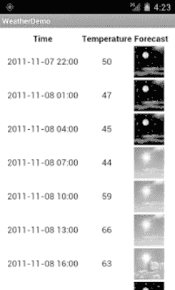
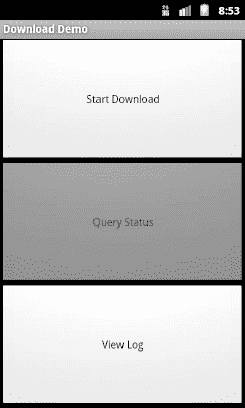
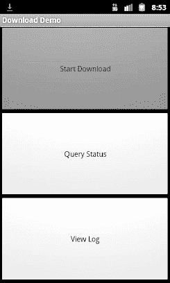
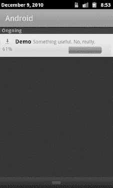
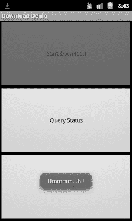
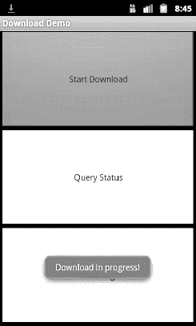
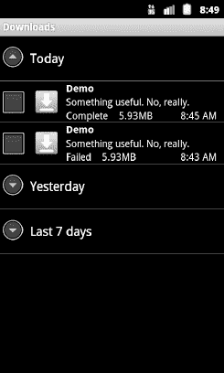

# 三十四、通过互联网交流

人们的预期是，大多数(如果不是全部的话)Android 设备都将内置互联网接入。那可能是 Wi-Fi、蜂窝数据服务(EDGE、3G、4G 等。)，或者可能完全是别的什么东西。不管怎样，大多数人——或者至少是那些有数据套餐或 Wi-Fi 接入的人——将能够通过他们的安卓手机上网。

毫不奇怪，Android 平台为开发者提供了多种方式来利用这种互联网接入。有些提供高级访问，比如集成的 WebKit 浏览器组件。如果你愿意，你可以直接使用原始套接字。在这两者之间，您可以利用 API——设备上的和来自第三方 jar 的——来访问特定的协议:HTTP、XMPP、SMTP 等等。

本书的重点是更高层次的访问形式:WebKit 组件，在第十五章中讨论，以及本章中讨论的互联网访问 API。作为忙碌的编码人员，我们应该尽可能重用现有的组件，而不是使用我们自己的在线协议。

### 休息和放松

Android 没有内置的 SOAP 或 XML-RPC 客户端 API。但是，它内置了 Apache HttpClient 库。您可以在这个库的上面放置一个 SOAP/XML-RPC 层，或者直接使用它来访问 REST 风格的 web 服务。出于本书的目的，REST 风格的 web 服务被认为是对普通 URL 的简单 HTTP 请求，包括所有 HTTP 动词，以及格式化的有效负载(XML、JSON 等)。)作为回应。

在 HttpClient 网站( [`http://hc.apache.org/`](http://hc.apache.org/) )上可以找到更多的教程、常见问题解答和指南。在这里，我们将涵盖基本的，而检查天气。

#### 通过 Apache HttpClient 进行 HTTP 操作

毫不奇怪，使用 HttpClient 的第一步是创建一个`HttpClient`对象。客户端对象代表您处理所有 HTTP 请求。因为`HttpClient`是一个接口，你需要实例化这个接口的一些实现，比如`DefaultHttpClient`。

这些请求被打包成`HttpRequest`实例，每个不同的 HTTP 动词有不同的`HttpRequest`实现(例如，HTTP `GET`请求有`HttpGet`)。您创建一个`HttpRequest`实现实例，填写要检索的 URL 和其他配置数据(例如，如果您正在通过`HttpPost`执行 HTTP `POST`，则填写表单值)，然后将该方法传递给客户端，以通过`execute()`实际发出 HTTP 请求。

此时发生的事情可以简单，也可以复杂。您可以返回一个`HttpResponse`对象，带有一个响应代码(例如，`200`表示 OK)、HTTP 头等等。或者，您可以使用一种将`ResponseHandler<String>`作为参数的`execute()`，最终结果是`execute()`只返回响应体的`String`表示。实际上，这不是推荐的方法，因为您真的应该检查 HTTP 响应代码中的错误。然而，对于琐碎的应用，如书籍示例，`ResponseHandler<String>`方法工作得很好。

例如，让我们看看`Internet/Weather`示例项目。这实现了一个从国家气象局检索您当前位置的天气数据的活动。(请注意，这可能仅适用于美国的地理位置。)这些数据被转换成一个 HTML 页面，并被注入到一个`WebKit`小部件中进行显示。使用`ListView`重新构建这个演示是留给读者的一个练习。此外，由于这个示例相对较长，我们在本章中将只展示相关的 Java 代码片段，尽管您可以从 CommonsWare 网站下载完整的源代码。

为了让这个更有趣一点，我们使用 Android 定位服务来计算我们在哪里……算是吧。在第三十九章中提供了如何工作的全部细节。

在`onResume()`方法中，我们开启位置更新，因此我们将被告知我们现在的位置以及我们何时移动了一个相当大的距离(10 公里)。当位置可用时——无论是在开始还是基于移动——我们通过我们的`updateForecast()`方法检索国家气象局数据:

`private void **updateForecast**(Location loc) {
  String url=String.**format**(format, loc.**getLatitude**(),
                         loc.**getLongitude**());
  HttpGet getMethod=new **HttpGet**(url);

  try {
    ResponseHandler<String> responseHandler=new **BasicResponseHandler**();
    String responseBody=client.execute(getMethod,
                                     responseHandler);
    **buildForecasts**(responseBody);` `    String page=**generatePage**();

    browser.**loadDataWithBaseURL**(null, page, "text/html",
                               "UTF-8", null);
  }
  catch (Throwable t) {
    android.util.Log.e("WeatherDemo", "Exception fetching data", t);
    Toast
      **.makeText**(this, "Request failed: "+t.**toString**(), Toast.LENGTH_LONG)
      **.show**();
  }
}`

`updateForecast()`方法将从位置更新过程中获得的一个`Location`作为参数。现在，您需要知道的是，`Location`提供了`getLatitude()`和`getLongitude()`方法，分别返回设备位置的纬度和经度。

我们将国家气象局 XML 的 URL 保存在一个字符串资源中，并在运行时注入纬度和经度。给定在`onCreate()`中创建的`HttpClient`对象，我们用定制的 URL 填充一个`HttpGet`，然后执行该方法。给定从 REST 服务得到的 XML，我们构建预测 HTML 页面，如下所述，并将其注入到`WebKit`小部件中。如果`HttpClient`出现异常，我们将该错误作为`Toast`提供。

注意，我们还关闭了`onDestroy()`中的`HttpClient`对象。

#### 解析响应

您得到的响应将使用某种系统进行格式化——HTML、XML、JSON 或其他。当然，挑选出你需要的信息并利用它做一些有用的事情是你自己的事情。在`WeatherDemo`的例子中，我们需要提取预测时间、温度和图标(指示天空状况和降雨量),并从中生成一个 HTML 页面。

Android 包括以下解析器:

*   三个 XML 解析器:传统的 W3C DOM ( `org.w3c.dom`)、SAX 解析器(`org.xml.sax`)和 XML 拉解析器(在第二十三章中讨论)
*   JSON 解析器(`org.json`)

也欢迎您尽可能使用第三方 Java 代码来处理其他格式，比如用于提要阅读器的专用 RSS/Atom 解析器。第三方 Java 代码的使用在第三十三章中讨论。

对于`WeatherDemo`，我们在`buildForecasts()`方法中使用 W3C DOM 解析器:

`void **buildForecasts**(String raw) throws Exception {
  DocumentBuilder builder=DocumentBuilderFactory
                           .**new**Instance()
                           .**newDocumentBuilder**();
  Document doc=builder.**parse**(new InputSource(new **StringReader**(raw)));` `  NodeList times=doc.**getElementsByTagName**("start-valid-time");

  for (int i=0;i<times.**getLength**();i++) {
    Element time=(Element)times.**item**(i);
    Forecast forecast=new **Forecast**();

    forecasts.**add**(forecast);
    forecast.**setTime**(time.**getFirstChild**().**getNodeValue**());
  }

  NodeList temps=doc.**getElementsByTagName**("value");

  for (int i=0;i<temps.**getLength**();i++) {
    Element temp=(Element)temps.**item**(i);
    Forecast forecast=forecasts.**get**(i);

    forecast.**setTemp** (new Integer(temp.getFirstChild().**getNodeValue**()));
  }

  NodeList icons=doc.**getElementsByTagName**("icon-link");

  for (int i=0;i<icons.**getLength**();i++) {
    Element icon=(Element)icons.**item**(i);
    Forecast forecast=forecasts.**get**(i);

    forecast.**setIcon**(icon.**getFirstChild**().**getNodeValue**());
  }
}`

国家气象局的 XML 格式结构奇特，严重依赖于列表中的顺序位置，而不是 RSS 或 Atom 等格式中更面向对象的风格。也就是说，我们可以采取一些自由措施，稍微简化解析，利用我们想要的元素(`start-valid-time`表示预测时间，`value`表示温度，`icon-link`表示图标 URL)在文档中都是唯一的这一事实。

HTML 以`InputStream`的形式出现，并被送入 DOM 解析器。从那里，我们扫描`start-valid-time`元素，并使用这些开始时间填充一组`Forecast`模型。然后，我们找到温度`value`元素和`icon-link`URL，并将它们填充到`Forecast`对象中。

反过来，`generatePage()`方法用预测创建了一个基本的 HTML 表:

`String **generatePage**() {
  StringBuilder bufResult=new **StringBuilder**("<html><body><table>");

  bufResult.**append**("<tr><th width=\"50%\">Time</th>"+
                    "<th>Temperature</th><th>Forecast</th></tr>");

  for (Forecast forecast : forecasts) {
    bufResult.**append**("<tr><td align=\"center\">");
    bufResult.**append**(forecast.**getTime**());
    bufResult.**append**("</td><td align=\"center\">");` `    bufResult.**append**(forecast.**getTemp**());
    bufResult.**append**("</td><td></td></tr>");
  }

  bufResult.**append**("</table></body></html>");

  return(**bufResult.toString**());
}`

结果类似于 Figure 34–1。

**图 34–1。***weather demo 示例应用*

**注意:**如果您使用模拟器，您必须在 Eclipse 中设置您的位置。用`Window`  `Open Perspective`  `Other`  `DDMS`打开 DDMS 透视图。在`Devices`  `Name`面板中选择您的模拟器，然后使用经度和纬度框在模拟器控制面板中设置模拟器的位置。准备好后，点按“发送”。每次启动应用时，您都需要这样做。

#### 货色要考虑

如果您需要使用 SSL，请记住默认的`HttpClient`设置不包括 SSL 支持。大多数情况下，这是因为您需要决定如何处理 SSL 证书表示:您是否盲目地接受所有证书，即使是自签名或过期的证书？还是想问用户是不是真的要用一些奇怪的证书？

类似地，默认情况下，`HttpClient`是为单线程使用而设计的。如果您将在多线程可能成为问题的其他地方使用`HttpClient`，您可以很容易地设置`HttpClient`来支持多线程。

对于这类主题，您最好查看 HttpClient 网站以获得文档和支持。

#### 雄激素 http 客户端

从 Android 2.2 (API level 8)开始，你可以使用`android.net.http`包中的`AndroidHttpClient`类。这是一个`HttpClient`接口的实现，类似于`DefaultHttpClient`。然而，它预先配置了 Android 核心团队认为对平台有意义的设置。

您将获得以下好处:

*   SSL 管理
*   一种指定用户代理字符串的直接方法，该字符串在您调用静态`newInstance()`方法以获得`AndroidHttpClient`的实例时提供
*   用于处理通过 GZIP 压缩的材料、解析 HTTP 头中的日期等的实用方法

你失去的是自动 cookie 存储。常规的`DefaultHttpClient`将在内存中缓存 cookies，并在需要它们的后续请求中使用它们。`AndroidHttpClient`不会。有一些方法可以解决这个问题，通过使用一个`HttpContext`对象，正如在`AndroidHttpClient`文档中所描述的。

另外，`AndroidHttpClient`阻止您在主应用线程上使用它——请求只能在后台线程上发出。这是一个特性，即使有些人可能认为这是一个 bug。

因为这个类只在 Android 2.2 和更高版本中可用，所以在你只支持 API level 8 或更高版本之前，对它做太多可能没有意义。

### 利用互联网感知的 Android 组件

只要有可能，就使用内置的 Android 组件来处理你的互联网接入。这类组件将经过相当严格的测试，更有可能很好地处理边缘情况，例如处理 Wi-Fi 上移动到接入点范围之外并故障转移到移动数据连接(如 3G)的用户。

例如，`WebView`小工具(在第十五章中介绍)和`MapView`小工具(在第四十章中介绍)都可以为您处理互联网接入。虽然您仍然需要`INTERNET`权限，但是您不必自己执行 HTTP 请求或类似的操作。

本节概述了利用内置互联网功能的一些其他方法。

#### 下载文件

Android 2.3 引入了一个`DownloadManager`，旨在处理下载较大文件的许多复杂问题，例如:

*   确定用户是使用 Wi-Fi 还是移动数据，以及根据哪种情况，是否应该进行下载
*   当先前使用 Wi-Fi 的用户移出接入点范围并故障转移到移动数据时的处理
*   确保设备在下载过程中保持唤醒状态

与你自己编写全部内容相比，它本身并不复杂。然而，它确实带来了一些挑战。在本节中，我们将检查使用了`DownloadManager`的`Internet/Download`示例项目。

##### 权限

要使用`DownloadManager`，您需要持有`INTERNET`权限。根据您选择下载文件的位置，您可能还需要`WRITE_EXTERNAL_STORAGE`权限。

然而，在撰写本文时，如果您没有足够的权限，您可能会得到一个错误，抱怨您缺少`ACCESS_ALL_DOWNLOADS`。这似乎是`DownloadManager`实现中的一个错误。应该是抱怨缺少`INTERNET`或者`WRITE_EXTERNAL_STORAGE`，或者两者都缺。你不需要持有`ACCESS_ALL_DOWNLOADS`许可，在 Android 3.0 中甚至没有记录。

例如，下面是`Internet/Download`应用的清单:

`<?xml version="1.0" encoding="utf-8"?>
<manifest xmlns:android="http://schemas.android.com/apk/res/android"
package="com.commonsware.android.download" android:versionCode="1"
android:versionName="1.0">
   <!-- <uses-permission android:name="android.permission.ACCESS_ALL_DOWNLOADS" /> -->
   <uses-permission android:name="android.permission.INTERNET"/>
   <uses-permission android:name="android.permission.WRITE_EXTERNAL_STORAGE"/>
   <application android:label="@string/app_name" android:icon="@drawable/cw">
       <activity android:name="DownloadDemo" android:label="@string/app_name">
           <intent-filter>
               <action android:name="android.intent.action.MAIN"/>` `               <category android:name="android.intent.category.LAUNCHER"/>
           </intent-filter>
       </activity>
   </application>
 <supports-screens android:largeScreens="true" android:normalScreens="true" android:smallScreens="true" android:anyDensity="true"/>
</manifest>`

**注意:**对于本例，您需要确保您的仿真器配置了 SD 卡。打开 Android SDK 和 AVD 管理器并选择您的仿真器，然后单击编辑。然后，您可以设置仿真器用于存储的 SD 卡的大小。如果您调整现有 SD 卡映像的大小，请注意 AVD 将删除您现有的 SD 卡映像，因此您应该首先备份您希望保留的任何有价值的内容。

##### 布局

我们的示例应用有一个简单的布局，由三个按钮组成:

*   一个开始下载
*   一个用于查询下载的状态
*   一个用于显示系统提供的包含下载文件列表的活动

`<?xml version="1.0" encoding="utf-8"?>
<LinearLayout
  xmlns:android="http://schemas.android.com/apk/res/android"
  android:orientation="vertical"
  android:layout_width="fill_parent"
  android:layout_height="fill_parent"
  >
  <Button
    android:id="@+id/start"
    android:text="Start Download"
    android:layout_width="fill_parent"
    android:layout_height="0dip"
    android:layout_weight="1"
    android:onClick="startDownload"
  />
  <Button
    android:id="@+id/query"
    android:text="Query Status"
    android:layout_width="fill_parent"
    android:layout_height="0dip"
    android:layout_weight="1"
    android:onClick="queryStatus"
    android:enabled="false"
  />
  <Button
    android:text="View Log"
    android:layout_width="fill_parent"
    android:layout_height="0dip"` `    android:layout_weight="1"
    android:onClick="viewLog"
  />
</LinearLayout>`

##### 请求下载

为了开始下载，我们首先需要访问`DownloadManager`。这是一项系统服务。我们可以在任何活动上调用`getSystemService()`(或其他`Context`)，向它提供我们想要的系统服务的标识符，并接收回系统服务对象。然而，由于`getSystemService()`支持大范围的这些对象，我们需要将它转换成我们所请求的服务的适当类型。

举例来说，这是从`DownloadDemo`活动的`onCreate()`开始的一行，在这里我们得到了`DownloadManager`:

`mgr=(DownloadManager)**getSystemService**(DOWNLOAD_SERVICE);`

这些管理器中的大多数都没有`close()`、`release()`或`goAwayPlease()`类型的方法——我们可以使用它们，让垃圾收集来清理它们。

给定`DownloadManager`，我们现在可以调用一个`enqueue()`方法来请求下载。名称是相关的——不要假设您的下载会立即开始，尽管它经常会开始。`enqueue()`方法将一个`DownloadManager.Request`对象作为参数。`Request`对象使用构建器模式，因为大多数方法返回`Request`本身，所以我们可以用更少的输入将一系列调用链接在一起。

例如，我们布局中最顶端的按钮被绑定到`DownloadDemo`中的`startDownload()`方法，如下所示:

`public void **startDownload**(View v) {
  Uri uri=Uri.**parse**("http://commonsware.com/misc/test.mp4");

  Environment
    .**getExternalStoragePublicDirectory**(Environment.DIRECTORY_DOWNLOADS)
    .**mkdirs();**

  lastDownload=
    mgr.**enqueue**(new DownloadManager.**Request**(uri)
                .**setAllowedNetworkTypes**(DownloadManager.Request.NETWORK_WIFI |
                                       DownloadManager.Request.NETWORK_MOBILE)
                .**setAllowedOverRoaming**(false)
                .**setTitle**("Demo")
                .**setDescription**("Something useful. No, really.")
                .**setDestinationInExternalPublicDir**(Environment.DIRECTORY_DOWNLOADS,
                                                "test.mp4"));

  v.**setEnabled**(false);
  **findViewById**(R.id.query).**setEnabled**(true);
}`

我们正在下载一个样本 MP4 文件，我们想把它下载到外部存储区。为了实现后者，我们在`Environment`上使用了`getExternalStoragePublicDirectory()`，这给了我们一个适合存储某类内容的目录。在这种情况下，我们将把下载存储在`Environment.DIRECTORY_DOWNLOADS`中，尽管我们也可以选择`Environment.DIRECTORY_MOVIES`，因为我们正在下载一个视频剪辑。注意，`getExternalStoragePublicDirectory()`返回的`File`对象可能指向一个尚未创建的目录，这就是为什么我们对它调用`mkdirs()`，以确保该目录存在。

然后我们创建`DownloadManager.Request`对象，具有以下属性:

*   由于提供给`Request`构造函数的`Uri`，我们正在下载我们想要的特定 URL。
*   我们愿意使用移动数据或 Wi-Fi 进行下载(`setAllowedNetworkTypes()`)，但我们不希望下载产生漫游费(`setAllowedOverRoaming()`)。
*   我们希望在外部存储器(`setDestinationInExternalPublicDir()`)的下载区域中以`test.mp4`的名称下载文件。

我们还提供了一个名称(`setTitle()`)和描述(`setDescription()`)，它们被用作此次下载的通知抽屉条目的一部分。当用户在下载过程中向下滑动抽屉时，就会看到这些内容。

`enqueue()`方法返回这次下载的 ID，我们保留它用于查询下载状态。

##### 跟踪下载状态

如果用户点击查询状态按钮，我们希望了解下载进度的详细信息。为此，我们可以在`DownloadManager`上调用`query()`。`query()`方法接受一个`DownloadManager.Query`对象，描述我们感兴趣的下载内容。在我们的例子中，当用户请求下载时，我们使用从`enqueue()`方法获得的值:

`public void **queryStatus**(View v) {
  Cursor c=mgr.**query**(new DownloadManager.**Query**().**setFilterById**(lastDownload));

  if (c==null) {
    Toast.**makeText**(this, "Download not found!", Toast.LENGTH_LONG).**show**();
  }
  else {
    c.**moveToFirst**();

    Log.**d**(**getClass**().**getName**(), "COLUMN_ID: "+
          c.**getLong**(c.**getColumnIndex**(DownloadManager.COLUMN_ID)));
    Log.**d**(**getClass**().**getName**(), "COLUMN_BYTES_DOWNLOADED_SO_FAR: "+
          c.**getLong**(c.**getColumnIndex**(DownloadManager.COLUMN_BYTES_DOWNLOADED_SO_FAR)));
    Log.**d**(**getClass**().**getName**(), "COLUMN_LAST_MODIFIED_TIMESTAMP: "+
          c.**getLong**(c.**getColumnIndex**(DownloadManager.COLUMN_LAST_MODIFIED_TIMESTAMP)));
    Log.**d**(**getClass**().**getName**(), "COLUMN_LOCAL_URI: "+` `          c.**getString**(c.**getColumnIndex**(DownloadManager.COLUMN_LOCAL_URI)));
    Log.**d**(**getClass**().**getName**(), "COLUMN_STATUS: "+
          c.**getInt**(c.**getColumnIndex**(DownloadManager.COLUMN_STATUS)));
    Log.**d**(**getClass**().**getName**(), "COLUMN_REASON: "+
          c.**getInt**(c.**getColumnIndex**(DownloadManager.COLUMN_REASON)));

    Toast.**makeText**(this, **statusMessage**(c), Toast.LENGTH_LONG).**show**();
  }
}`

`query()`方法返回一个`Cursor`，包含一系列表示下载细节的列。在`DownloadManager`类中有一系列常量概述了什么是可能的。在我们的例子中，我们检索(并转储到 LogCat)以下内容:

*   下载的 ID(`COLUMN_ID`)
*   迄今为止已经下载的数据量(`COLUMN_BYTES_DOWNLOADED_SO_FAR`)
*   下载的最后修改时间戳是什么(`COLUMN_LAST_MODIFIED_TIMESTAMP`)
*   文件保存到本地的位置(`COLUMN_LOCAL_URI`)
*   实际状态是什么(`COLUMN_STATUS`)
*   那种状态的原因是什么(`COLUMN_REASON`)

有许多可能的状态代码(例如，`STATUS_FAILED`、`STATUS_SUCCESSFUL`和`STATUS_RUNNING`)。有些，像`STATUS_FAILED`，可能有一个附带的原因提供更多的细节。

##### 用户看到的内容

用户在启动应用时，会看到我们的三个按钮，如图 Figure 34–2 所示。

**图 34–2。** *下载演示示例应用，如同最初启动的*

在下载过程中，点击第一个按钮会禁用该按钮，状态栏中会出现一个下载图标(尽管由于 Android 的图标和 Android 的状态栏之间的对比度很差，有点难以看清)，如 Figure 34–3 所示。

**图 34–3。** *下载演示示例应用，执行下载*

向下滑动通知抽屉以`ProgressBar`窗口小部件的形式向用户显示下载进度，如图 Figure 34–4 所示。

**图 34–4。** *通知抽屉，在下载期间使用 DownloadManager*

点击通知抽屉中的条目将控制返回到我们的原始活动，用户会看到一个`Toast`，如 Figure 34–5 所示。

**图 34–5。***download demo 示例应用，来到前台后发出通知*

如果用户在下载过程中点击中间按钮，会出现一个`Toast`，表示下载正在进行中，如图图 34–6 所示。

**图 34–6。** *下载演示示例应用，显示下载中的状态*

其他详细信息也转储到 LogCat，可通过 DDMS 或`adb logcat`查看:

`12-10 08:45:01.289: DEBUG/com.commonsware.android.download.DownloadDemo(372):
 COLUMN_ID: 12
12-10 08:45:01.289: DEBUG/com.commonsware.android.download.DownloadDemo(372):
 COLUMN_BYTES_DOWNLOADED_SO_FAR: 615400
12-10 08:45:01.289: DEBUG/com.commonsware.android.download.DownloadDemo(372):
 COLUMN_LAST_MODIFIED_TIMESTAMP: 1291988696232
12-10 08:45:01.289: DEBUG/com.commonsware.android.download.DownloadDemo(372):
 COLUMN_LOCAL_URI: file:///mnt/sdcard/Download/test.mp4
12-10 08:45:01.299: DEBUG/com.commonsware.android.download.DownloadDemo(372):
 COLUMN_STATUS: 2
12-10 08:45:01.299: DEBUG/com.commonsware.android.download.DownloadDemo(372):
 COLUMN_REASON: 0`

下载完成后，点击中间的按钮将表明下载已经完成，关于下载的最终信息将发送到 LogCat:

`12-10 08:49:27.360: DEBUG/com.commonsware.android.download.DownloadDemo(372):
 COLUMN_ID: 12
12-10 08:49:27.360: DEBUG/com.commonsware.android.download.DownloadDemo(372):` ` COLUMN_BYTES_DOWNLOADED_SO_FAR: 6219229
12-10 08:49:27.370: DEBUG/com.commonsware.android.download.DownloadDemo(372):
 COLUMN_LAST_MODIFIED_TIMESTAMP: 1291988713409
12-10 08:49:27.370: DEBUG/com.commonsware.android.download.DownloadDemo(372):
 COLUMN_LOCAL_URI: file:///mnt/sdcard/Download/test.mp4
12-10 08:49:27.370: DEBUG/com.commonsware.android.download.DownloadDemo(372):
 COLUMN_STATUS: 8
12-10 08:49:27.370: DEBUG/com.commonsware.android.download.DownloadDemo(372):
 COLUMN_REASON: 0`

点击底部按钮，显示所有下载的活动，包括成功和失败，如 Figure 34–7 所示。

**图 34–7。** *下载屏幕，显示 DownloadManager 下载的所有内容*

当然，文件是下载的。在 Android 2.3 中，在模拟器中，我们选择的位置映射到`/mnt/sdcard/Downloads/test.mp4`。

##### 限制

`DownloadManager`适用于 HTTP URLs，但不适用于 HTTPS(SSL)URL。这是不幸的，因为越来越多的网站正在全面转向 SSL 加密，以应对各种安全挑战。希望在未来，`DownloadManager`在这里会有更多的选择。

如果您显示所有下载的列表，并且您的下载也在其中，那么确保某个活动(可能是您的某个活动)能够响应该下载的 MIME 类型上的`ACTION_VIEW Intent`是一个非常好的主意。否则，当用户点击列表中的条目时，他们会得到一个`Toast`，表明没有可用的内容来查看下载。这可能会让用户感到困惑。或者，在您的请求上使用`setVisibleInDownloadsUi()`，传入`false`，从列表中取消它。

### 继续逃离简基密码

规则很简单:不要从主应用线程访问互联网。始终使用带有`HttpClient`、`HttpUrlConnection`的后台线程，或者您希望使用的任何其他互联网访问 API。

如果您试图在主应用线程上访问互联网，前面章节中介绍的`StrictMode`将会警告您。如果您试图在主应用线程上发出 web 请求,`AndroidHttpClient`将会崩溃。然而，这些功能仅在较新版本的 Android 中可用。也就是说，有很多方法可以在你的应用中使用`StrictMode`,但是只能在使用条件类加载的新版 Android 中使用——这种技术在本书前面已经介绍过了。