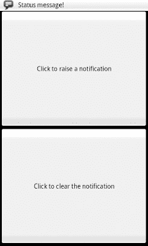
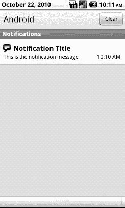
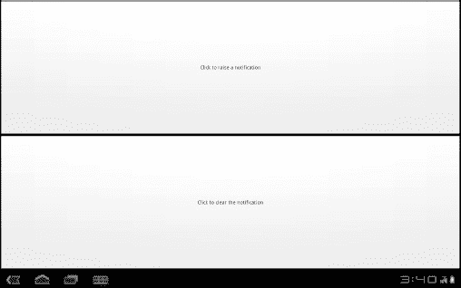
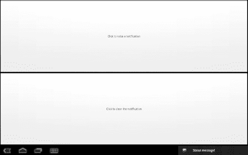
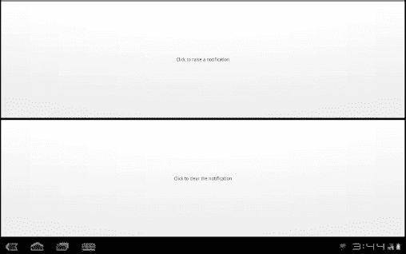
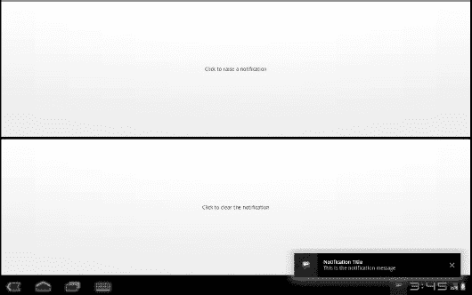

# 三十七、通过通知提醒用户

弹出消息、托盘图标及其相关的“气泡”消息、跳跃的停靠图标……毫无疑问，你已经习惯于程序试图引起你的注意，有时是有充分理由的。除了来电，你的手机可能还会发出啁啾声:低电量、闹钟、约会通知、收到短信和电子邮件等等。

毫不奇怪，Android 有一个完整的框架来处理这类事情，统称为*通知*，如本章所述。

### 通知配置

在后台运行的服务需要一种方式来让用户知道发生了感兴趣的事情，比如何时收到了电子邮件。此外，该服务可能需要某种方式将用户引导到他们可以对事件采取行动的活动，比如阅读接收到的消息。为此，Android 提供了状态栏图标、闪光灯和其他指示器，统称为通知。

您当前的手机可能已经有这样的图标，以指示电池寿命、信号强度、蓝牙是否启用等。使用 Android，应用可以添加自己的状态栏图标，只在需要的时候才会出现(例如，有消息到达)。

在 Android 中，你可以通过系统服务`NotificationManager`发出通知。要使用它，您需要通过`getSystemService(NOTIFICATION_SERVICE)`从活动中获取服务对象。`NotificationManager`给你三个方法:一个养一个`Notification` ( `notify()`，两个去掉一个现有的`Notification` ( `cancel()`、`cancelAll()`)。

`notify()`方法接受一个`Notification`，这是一个数据结构，说明你的纠缠应该采取什么形式。以下部分描述了该对象的功能。

#### 硬件通知

您可以通过将`lights`设置为`true`来闪烁设备上的 led，还可以指定颜色(作为`ledARGB`中的`#ARGB`值)和灯应该闪烁的模式(通过`ledOnMS`和`ledOffMS`提供灯的关闭/打开持续时间，单位为毫秒)。然而，请注意，Android 设备将尽最大努力满足您的颜色请求，这意味着不同的设备可能会给你不同的颜色，或者可能根本无法控制颜色。例如，摩托罗拉 CLIQ 只有一个白色的 LED，所以你可以要求任何你想要的颜色，你会得到白色。请注意，您需要将`Notification.FLAG_SHOW_LIGHTS`值或(`|`)到`Notification`对象上的公共`flags`域中，以使 LED 闪烁工作。

你可以使用一个`Uri`来播放一段内容，这段内容可能是由`ContentManager` ( `sound`)保存的。请将此视为您的应用的铃声。

您可以通过`long[]`控制振动设备，指示振动(`vibrate`)的开/关模式(毫秒)。你可以默认这样做，或者当情况需要比铃声更微妙的通知时，你可以让用户选择这个选项。不过，要使用这个，你需要请求`VIBRATE`许可(许可在第三十八章的中讨论)。

默认情况下，所有这些选项都会出现一次(例如，一次 LED 闪烁或一次声音回放)。如果您想让它们一直持续到`Notification`被取消，您需要在您的`Notification`中设置`flags`公共字段来包含`FLAG_INSISTENT`。

除了手动指定硬件选项，您还可以使用`Notification`中的`defaults`字段，将其设置为`DEFAULT_LIGHTS`、`DEFAULT_SOUND`、`DEFAULT_VIBRATE`或`DEFAULT_ALL`，这将使用所有硬件选项的平台默认值。

#### 图标

虽然闪烁的灯光、声音和振动旨在让人们看到设备，但图标旨在让他们采取下一步行动，并告诉他们什么是如此重要。

要为一个`Notification`设置一个图标，您需要设置两个公共字段:`icon`，在这里您提供一个代表图标的`Drawable`资源的标识符，以及`contentIntent`，在这里您提供一个当图标被点击时将被引发的`PendingIntent`。一个`PendingIntent`是一个常规`Intent`的包装器，它允许`Intent`稍后被另一个进程调用，启动一个活动或其他什么。通常，一个`Notification`将触发一个活动，在这种情况下，您将通过静态的`getActivity()`方法创建`PendingIntent`，并给它一个`Intent`来标识您的一个活动。也就是说，你可以通过使用`PendingIntent`的`getBroadcast()`版本，让`Notification`发送广播`Intent`。Android 4.0 扩展了`PendingIntent`可用的 `send()`方法的种类，提供了大多数可以想象的情况。

您也可以提供一个文本格式回复，当图标被放在状态栏上时出现(`tickerText`)。

如果您想要所有这三个，更简单的方法是调用`setLatestEventInfo()`，它将所有这三个封装在一个调用中。

您还可以在您的`Notification`的`number`公共字段中设置一个值。这将导致你提供的数字被画在一角的`icon`的上方。例如，这用于显示未读电子邮件的数量，这样您就不需要有一堆不同的图标，每个图标代表未读邮件的可能数量。默认情况下，`number`字段将被忽略且不使用。

请注意，在 Android 2.3 中，`Notification`图标的大小发生了变化。在那个版本之前，25 像素的正方形是理想的尺寸。现在，更矩形的每密度图标是首选:

*   24 像素正方形(在 24 像素宽、38 像素高的边界框内)，用于高密度和超高密度屏幕
*   适用于中等密度屏幕的 16 像素正方形(在 16×25 像素边框内)
*   用于低密度屏幕的 12 像素正方形(在 12×19 像素边界框内)

遵循这些规则的应用需要为新图标使用特定的资源集:

*   `res/drawable-xhdpi-v9/`:超高密度 Android 2.3 及以后版本
*   `res/drawable-hdpi-v9/`:针对高密度 Android 2.3 及以后版本
*   `res/drawable-mdpi-v9/`:适用于中密度 Android 2.3 及以后版本
*   `res/drawable-ldpi-v9/`:低密度 Android 2.3 及以后版本
*   `res/drawable/`:用于 Android 2.2 及更早版本的图标

关于包括状态栏图标在内的所有图标指南的更多细节可以在 Android 开发者文档中找到。

### 通知在行动

现在让我们看一下`Notifications/Notify1`示例项目，特别是`NotifyDemo`类:

`packagecom.commonsware.android.notify;

importandroid.app.Activity;
importandroid.app.Notification;
importandroid.app.NotificationManager;
importandroid.app.PendingIntent;
importandroid.content.Intent;
importandroid.os.Bundle;
importandroid.view.View;

public class NotifyDemo extends Activity {
  private static final int NOTIFY_ME_ID=1337;
  privateint count=0;
  private NotificationManager mgr=null;

  @Override
  public void **onCreate**(Bundle savedInstanceState) {
    super.**onCreate**(savedInstanceState);
    **setContentView**(R.layout.main);

    mgr=(NotificationManager)**getSystemService**(NOTIFICATION_SERVICE);
  }

  public void **notifyMe**(View v) {
    Notification note=new **Notification**(R.drawable.stat_notify_chat,
                                       "Status message!",
                                        System.**currentTimeMillis**());
    PendingIntenti=PendingIntent.**getActivity**(this, 0,
                          new**Intent**(this, NotifyMessage.class),
                                          0);

    note.**setLatestEventInfo**(this, "Notification Title",
                           "This is the notification message", i);
    note.number=++count;
    note.vibrate=new long[] {500L, 200L, 200L, 500L};
    note.flags|=Notification.FLAG_AUTO_CANCEL;

    mgr.**notify**(NOTIFY_ME_ID, note);
  }

  public void **clearNotification**(View v) {
    mgr.cancel(NOTIFY_ME_ID);
  }
}`

如图 Figure 37–1 所示，该活动有两个大按钮，一个用于在 5 秒钟延迟后启动通知，另一个用于取消通知(如果它处于活动状态)。

**图 37–1。**??【notify demo】活动主视图

在`notifyMe()`中，创建通知分七个步骤完成:

1.  创建一个带有我们的图标的`Notification`对象，一个当通知出现时在状态栏上闪烁的消息，以及与该事件相关的时间。
2.  创建一个`PendingIntent`，它将触发另一个活动(`NotifyMessage`)的显示。
3.  使用`setLatestEventInfo()`来指定，当通知被点击时，我们将显示某个标题和消息，如果被点击，我们将启动`PendingIntent`。
4.  更新与通知相关的号码。
5.  指定振动模式:500 毫秒开启，200 毫秒关闭，200 毫秒开启，500 毫秒关闭。
6.  将`FLAG_AUTO_CANCEL`包含在`Notification`对象的`flags`字段中。
7.  告诉`NotificationManager`(在`onCreate()`中获得)显示通知。

因此，如果我们点击顶部的按钮，我们的图标将会出现在状态栏中，同时会简短显示我们的状态信息，如图 Figure 37–2 所示。

**图 37–2。** *我们的通知出现在状态栏上，上面有我们的状态消息*

状态信息消失后，图标的右下角会叠加我们的编号(最初为 1)，如图 Figure 37–3 所示。例如，您可以用它来表示未读邮件的数量。

**图 37–3。** *我们的通知加上了叠加号*

如果您向下拖动图标，状态栏下方会出现一个抽屉。将该抽屉一直拖到屏幕底部，以显示未完成的通知，包括我们自己的通知，如 Figure 37–4 所示。

**图 37–4。** *的通知抽屉，完全展开，里面有我们的通知*

如果您单击抽屉中的通知条目，您将被带到一个显示消息的小活动。在实际的应用中，这个活动会根据发生的事件做一些有用的事情(例如，将用户带到新到达的邮件消息)。

单击取消按钮、单击抽屉中的清除按钮或单击抽屉中的通知条目将从状态栏中移除图标。后者之所以发生，是因为我们在`Notification`中包含了`FLAG_AUTO_CANCEL`，这表明在抽屉条目上点击一下应该会取消`Notification`本身。Android 4.0 的用户还可以选择“滑动清除”，他们可以简单地将单个通知滑动到屏幕的任意一侧，以消除或处理它们。这有助于用户处理多个活动通知，并希望在处理完一个特定通知后返回到剩余的通知。

### 待在前台

通知还有另一个用途:保留选定的服务。

服务不会永远存在。Android 可能会在紧急情况下终止应用的进程来释放内存，或者只是因为它似乎已经在内存中逗留了太久。理想情况下，您设计您的服务来处理它们可能不会无限期运行的事实。

然而，如果一些服务神秘消失，用户将会错过它们。例如，Android 自带的默认音乐播放器应用使用一个服务来播放音乐。这样，用户可以一边听音乐，一边继续将手机用于其他目的。只有当用户按下音乐播放器活动中的停止按钮时，服务才会停止。如果该服务意外关闭，用户会想知道出了什么问题。

像这样的服务可以宣称自己是*前台*的一部分。这将导致它们的优先级上升，并使它们不太可能被挤出内存。代价是服务必须维护一个`Notification`，所以用户知道这个服务要求前台的一部分。而且，理想情况下，`Notification`应该提供一个简单的路径返回到某个用户可以停止服务的活动。

要做到这一点，在您的服务的`onCreate()`(或者在服务生命周期中任何有意义的地方)，调用`startForeground()`。这需要一个`Notification`和一个本地唯一的整数，就像`NotificationManager`上的`notify()`方法一样。它使`Notification`出现，并将服务移动到前台优先级。稍后，您可以调用`stopForeground()`返回正常优先级。

注意，这个方法是在 Android 2.0 (API level 5)中添加的。有一个更早的方法`setForeground()`，在 Android 的早期版本中执行类似的功能。

#### fakeplicael，Redux

前一章介绍了服务模式，给出了一个假的音乐播放器，用一个`Activity` ( `FakePlayer`)和一个`Service` ( `PlayerService`)实现。实际上，`PlayerService`是播放音乐的地方，所以即使`FakePlayer`活动没有打开，音乐也可以播放。

然而，Android 可能不认为`PlayerService`是用户体验的一部分，因为服务通常很少直接与用户互动。这意味着 Android 可能会以限制 CPU 使用的方式运行`PlayerService`(不一定是坏的)，如果它认为自己已经运行了太长时间(可能是坏的)，可能会选择关闭服务。

答案是用`startForeground()`和`stopForeground()`。当我们用`play()`方法开始播放音乐时，我们可以调用`startForeground()`:

`private void play(String playlist, booleanuseShuffle) {
  if (!isPlaying) {
    Log.**w**(**getClass**().**getName**(), "Got to play()!");
    isPlaying=true;

    Notification note=new **Notification**(R.drawable.stat_notify_chat,
                                       "Can you hear the music?",
                                        System.**currentTimeMillis**());
    Intent i=new **Intent**(this, FakePlayer.class);

    i.**setFlags**(Intent.FLAG_ACTIVITY_CLEAR_TOP|
              Intent.FLAG_ACTIVITY_SINGLE_TOP);

    PendingIntent pi=PendingIntent.**getActivity**(this, 0,
                                              i, 0);

    note.**setLatestEventInfo**(this, "Fake Player",
                           "Now Playing: \"Ummmm, Nothing\"",
pi);
    note.flags|=Notification.FLAG_NO_CLEAR;

    **startForeground(1337, note);**
  }
}`

有利的一面是，如果需要的话，我们的服务将会有更多的 CPU 可用，并且被 Android 杀死的可能性会小得多。用户将在状态栏中看到一个图标。如果他们滑下通知抽屉并点击我们的`Notification`条目，他们将被带回到`FakePlayer`——现有的实例，如果有的话，或者一个新的实例，否则，由于我们的`Intent`标志(`Intent.FLAG_ACTIVITY_CLEAR_TOP| Intent.FLAG_ACTIVITY_SINGLE_TOP`)。对于一个音乐播放器来说，这种 UI 模式可以让用户在需要的时候快速返回停止播放音乐。

停止音乐，通过我们的`stop()`方法，将调用`stopForeground()`:

`private void **stop**() {
  if (isPlaying) {
    Log.**w**(**getClass**().**getName**(), "Got to stop()!");
    isPlaying=false;
    **stopForeground(true);**
  }
}`

传递给`stopForeground()`的`true`值告诉 Android 删除`Notification`，这将是这种模式的典型方法。

### 冰淇淋三明治和蜂巢中的通知

Android 3.0 中引入的蜂巢 UI，以及它在 Android 4.0 中的继任者冰激凌三明治，都支持通知，就像之前所有版本的 Android 一样。然而，由于平板电脑的比喻及其额外的屏幕空间，用户体验略有不同。

figure 37–5 显示了未修改的`Notifications/Notify1`项目，就像在平板电脑大小的模拟器中看到的一样。

**图 37–5。** *在安卓 3.0 平板大小的模拟器上看到的 notify 1*

除了新样式的状态栏和超大按钮之外，这与你在蜂窝电话之前看到的没有什么不同。

如果我们单击顶部的按钮，我们的`Notification`会出现，这次是在右下角，带有图标和滚动条文本，如图 Figure 37–6 所示。

**图 37–6。**??【notify 1】增加了一个通知

请注意，如果用户点击滚动条，就会触发我们的`PendingIntent`，就像他们点击了电话上的通知抽屉条目一样。

当滚动条被移除时，我们的图标依然存在...无编号，如图图 37–7 所示。

**图 37–7。** *Notify1 带有一个无编号的通知图标*

如果用户点击该图标，附近会出现一个通知抽屉样式的弹出窗口，如 Figure 37–8 所示。

**图 37–8。** *通知 1，通知内容出现*

点击图标或文本触发`PendingIntent`，点击右边的×取消此`Notification`。