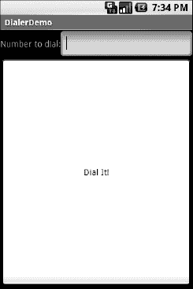
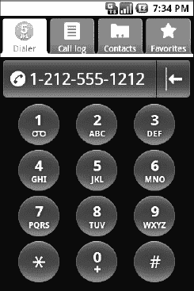

# 四十一、处理电话

许多，如果不是大多数，Android 设备将是手机。因此，不仅用户会期待使用 Android 拨打和接听电话，而且如果你愿意，你将有机会帮助他们拨打电话。

为什么你会想呢？

*   也许你正在为一个销售管理应用(*a la*Salesforce.com)编写一个 Android 界面，你想让用户只需点击一个按钮就能给潜在客户打电话，而不必让他们在你的应用和手机的联系人应用中都保留这些联系人。
*   也许您正在编写一个社交网络应用，您可以访问的电话号码列表会不断变化，因此与其尝试将社交网络联系人与手机的联系人数据库同步，不如让人们直接从您的应用拨打电话。
*   也许你正在创建一个现有联系人系统的替代界面，也许是为运动控制能力下降的用户(例如，老年人)，运动大按钮等，使他们更容易拨打电话。

不管是什么原因，Android 有办法让你像操作 Android 系统的任何其他部分一样操作手机。

### 向经理汇报

为了获得更多的电话 API，可以使用`TelephonyManager`类。该类允许您执行如下操作:

*   通过`getCallState()`确定电话是否在使用中，返回值为`CALL_STATE_IDLE`(电话未使用)`CALL_STATE_RINGING`(已请求通话但仍在连接中)`CALL_STATE_OFFHOOK`(通话进行中)
*   通过`getSubscriberId()`找到 SIM ID (IMSI)
*   通过`getPhoneType()`查找电话类型(如 GSM)或通过`getNetworkType()`查找数据连接类型(如 GPRS 或 EDGE)

### 你打电话吧！

您还可以从您的应用发起呼叫，例如从您通过自己的 web 服务获得的电话号码。要做到这一点，只需制作一个带有形式为`tel:NNNNN`的`Uri`的`ACTION_DIALIntent`(其中`NNNNN`是要拨打的电话号码)并使用带有`startActivity()`的`Intent`。这实际上不会拨打电话；相反，它激活了拨号器活动，用户可以点击一个按钮发出呼叫。

例如，让我们看一下`Phone/Dialer`示例应用。以下是简单但有效的布局:

`<?xml version="1.0" encoding="utf-8"?>
<LinearLayoutxmlns:android="http://schemas.android.com/apk/res/android"
    android:orientation="vertical"
    android:layout_width="fill_parent"
    android:layout_height="fill_parent"
    >
  <LinearLayout
    android:orientation="horizontal"
    android:layout_width="fill_parent"
    android:layout_height="wrap_content"
    >
    <TextView
      android:layout_width="wrap_content"
      android:layout_height="wrap_content"
      android:text="Number to dial:"
      />
    <EditTextandroid:id="@+id/number"
      android:layout_width="fill_parent"
      android:layout_height="wrap_content"
      android:cursorVisible="true"
      android:editable="true"
      android:singleLine="true"
    />
  </LinearLayout>
  <Button android:id="@+id/dial"
    android:layout_width="fill_parent"
    android:layout_height="wrap_content"
    android:layout_weight="1"
    android:text="Dial It!"
    android:onClick="dial"
  />
</LinearLayout>`

我们有一个用于输入电话号码的标签栏，还有一个用于拨打该号码的按钮。

Java 代码只是使用字段中的电话号码启动拨号器:

`packagecom.commonsware.android.dialer;` 
`importandroid.app.Activity;
importandroid.content.Intent;
importandroid.net.Uri;
importandroid.os.Bundle;
importandroid.view.View;
importandroid.widget.EditText;

public class DialerDemo extends Activity {
  @Override
  public void **onCreate**(Bundle icicle) {
    super**.onCreate**(icicle);
    **setContentView**(R.layout.main);
  }

  public void dial(View v) {
    EditText number=(EditText)**findViewById**(R.id.number);
    String toDial="tel:"+number.getText().toString();

    **startActivity**(new Intent(Intent.ACTION_DIAL, Uri.parse(toDial)));
  }
}`

活动本身的 UI 并没有那么令人印象深刻，如图 Figure 41–1 所示。

**图 41–1。***dialer demo 示例应用，最初启动时*

不过你点击拨号键得到的拨号器更好，显示你要拨的号码，如图 Figure 41–2 所示。

**图 41–2。** *安卓拨号器活动，从拨号器发起*

### 不，真的，你来打电话！

好消息是`ACTION_DIAL`不需要任何特殊权限就可以工作。坏消息是它只带用户到拨号器。用户仍然需要采取行动(按绿色的呼叫按钮)来实际拨打电话。

另一种方法是使用`ACTION_CALL`而不是`ACTION_DIAL`。在一个`ACTION_CALLIntent`上调用`startActivity()`将立即发出电话呼叫，不需要任何其他的 UI 步骤。然而，你需要得到`CALL_PHONE`的许可才能使用`ACTION_CALL`(见第三十八章)。