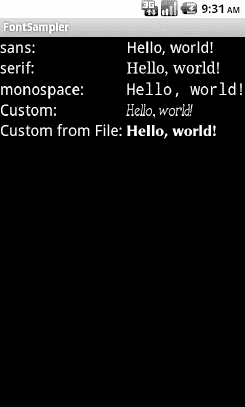

# 四十二、字体

在开发任何类型的应用时，你都会不可避免地遇到这样的问题:“嘿，我们能改变这种字体吗？”答案取决于平台自带的字体，是否可以添加其他字体，以及字体如何应用到小部件或任何需要改变字体的地方。安卓也不例外。它附带了一些字体，以及添加新字体的方法。然而，如同任何新环境一样，有一些特质需要处理，如本章所述。

### 爱和你在一起的人

Android 本身就知道三种字体，简写为 sans、serif 和 monospace。这些字体实际上是 Droid 系列字体，由 Monotype Imaging 的一个部门 Ascender Corp. ( `[www.ascendercorp.com/](http://www.ascendercorp.com/)`)为开放手机联盟创建。要使用这三种字体，您可以在您的布局 XML 中引用它们，例如下面来自`Fonts/FontSampler`示例项目的布局:

`<?xml version="1.0" encoding="utf-8"?>
<TableLayout
  xmlns:android="http://schemas.android.com/apk/res/android"
  android:layout_width="fill_parent"
  android:layout_height="fill_parent"
  android:stretchColumns="1">
  <TableRow>
    <TextView
      android:text="sans:"
      android:layout_marginRight="4dip"
      android:textSize="20sp"
    />
    <TextView
      android:id="@+id/sans"
      android:text="Hello, world!"
      android:typeface="sans"
      android:textSize="20sp"
    />
  </TableRow>
  <TableRow>
    <TextView` `      android:text="serif:"
      android:layout_marginRight="4dip"
      android:textSize="20sp"
    />
    <TextView
      android:id="@+id/serif"
      android:text="Hello, world!"
      android:typeface="serif"
      android:textSize="20sp"
    />
  </TableRow>
  <TableRow>
    <TextView
      android:text="monospace:"
      android:layout_marginRight="4dip"
      android:textSize="20sp"
    />
  <TextView
      android:id="@+id/monospace"
      android:text="Hello, world!"
      android:typeface="monospace"
      android:textSize="20sp"
    />
  </TableRow>
  <TableRow>
    <TextView
      android:text="Custom:"
      android:layout_marginRight="4dip"
      android:textSize="20sp"
    />
    <TextView
      android:id="@+id/custom"
      android:text="Hello, world!"
      android:textSize="20sp"
    />
  </TableRow>
  <TableRowandroid:id="@+id/filerow">
    <TextView
      android:text="Custom from File:"
      android:layout_marginRight="4dip"
      android:textSize="20sp"
    />
    <TextView
      android:id="@+id/file"
      android:text="Hello, world!"
      android:textSize="20sp"
    />
  </TableRow>
</TableLayout>`

此布局构建了一个显示五种字体的简短示例的表格。注意前三个有`android:typeface`属性，它的值是三个内置字体之一(例如`“sans"”`)。

### 附加字体

三个内置字体都很好看。然而，设计师、经理或客户可能想要不同的字体。或者，您可能希望使用一种用于特殊目的的字体，例如，用丁巴特字体代替一系列 PNG 图形。实现这一点最简单的方法是将所需的字体与应用打包在一起。为此，只需在项目根目录下创建一个`assets/`文件夹，并将您的 TrueType (TTF)字体放入该文件夹。例如，您可以创建`assets/fonts` /并将您的 TTF 文件放在那里。

然后，您需要告诉您的小部件使用该字体。不幸的是，您不能再为此使用布局 XML，因为 XML 不知道您可能已经作为应用素材隐藏起来的任何字体。相反，您需要在 Java 代码中进行更改:

`importandroid.widget.TextView;
importjava.io.File;

public class FontSampler extends Activity {
  @Override
  public void **onCreate**(Bundle icicle) {
    super**.onCreate**(icicle);
    **setContentView**(R.layout.main);

    TextViewtv=(TextView)**findViewById**(R.id.custom);
    Typeface face=Typeface**.createFromAsset**(**getAssets**(),
                                          "fonts/HandmadeTypewriter.ttf");

    tv**.setTypeface**(face);

    File font=new File(Environment**.getExternalStorageDirectory**(),
                     "MgOpenCosmeticaBold.ttf");

    if (font**.exists**()) {
      tv=(TextView)**findViewById**(R.id.file);
      face=Typeface**.createFromFile**(font);

      tv**.setTypeface**(face);
    }
    else {
      **findViewById**(R.id.filerow).setVisibility(View.GONE);
    }
  }
}`

这里，我们为我们的定制样本获取了`TextView`，然后通过静态的`createFromAsset()`构建器方法创建了一个`Typeface`对象。这需要应用的`AssetManager`(来自`getAssets()`)和你的`assets/`目录中的一个路径到你想要的字体。

然后，只需要告诉`TextView`到`setTypeface()`，提供我们刚刚创建的`Typeface`。在这种情况下，我们使用手工打字机字体。您也可以从本地文件中加载字体并使用它。好处是你可以在你的应用发布后定制你的字体。另一方面，你必须想办法把字体放到设备上。但是，正如你可以通过`createFromAsset()`得到一个`Typeface`，你也可以通过`createFromFile()`得到一个`Typeface`。在我们的`FontSampler`中，我们在“外部存储器”(通常是 SD 卡)的根目录中寻找`MgOpenCosmeticaBold` TrueType 字体文件，如果找到了，我们将它用于表的第五行。否则，我们隐藏该行。

图 42–1 显示了结果。

**图 42–1。**??【font sampler】应用

我们将在接下来的章节中详细介绍素材和本地文件。

注意，Android 似乎并不喜欢所有的 TrueType 字体。当 Android 不喜欢某个自定义字体时，它似乎会悄悄地用 Droid Sans ( `"sans"`)代替，而不是升起一个`Exception`。因此，如果你试图使用不同的字体，但它似乎没有工作，它可能与 Android 不兼容，无论出于什么原因。

### 这里一字形，那里一字形

TrueType 字体可能会很笨重，尤其是当它们支持大量可用的 Unicode 字符时。上一节用的手工打字机字体运行 70KB 以上；DejaVu 免费字体每个可以运行 500KB 以上。即使是压缩的，也会增加你的应用的体积，所以注意不要过度使用自定义字体，以免你的应用在用户的手机上占据太多空间。

相反，请记住，字体可能没有您需要的所有字形。举个例子，我们来说说省略号。

Android 的`TextView`类具有“省略”文本的内置功能，如果文本长度超过可用空间，它会截断文本并添加省略号。例如，您可以通过`android:ellipsize`属性来使用它。至少对于单行文本来说，这样做效果很好。

安卓用的省略号不是三个句号。相反，它使用了一个实际的省略号字符，其中三个点包含在一个字形中。因此，您使用的任何也使用“椭圆化”功能的字体都需要省略号标志符号。

然而，除此之外，Android 填充了呈现在屏幕上的字符串，使得长度(以字符为单位)在椭圆化前后是相同的。为了做到这一点，Android 用省略号替换一个字符，用 Unicode 字符`ZERO WIDTH NO-BREAK SPACE (U+FEFF)`替换所有其他被删除的字符。因此，省略号后面的额外字符不会占用屏幕上的任何可见空间，但它们可以是字符串的一部分。然而，这意味着任何用于与`android:ellipsize`一起使用的`TextView`部件的定制字体也必须支持这种特殊的 Unicode 字符。并不是所有的字体都是这样，如果你的字体缺少这个字符(例如，流氓 *X* s 出现在行尾)，你会在屏幕上看到你缩短的字符串。这种方法的另一个副作用是，预测任何字符串长度算法(比如一个简单的`length()` Java 调用)是否会返回您期望的值是有风险的。这几乎是反直觉的，但 Android 试图给你一个一致的答案，而你以前使用 Java 和字体的经验可能会让你期望不同的结果。

当然，Android 的国际部署意味着你的字体必须处理用户可能希望输入的任何语言，也许是通过特定语言的输入法编辑器。

因此，虽然在 Android 中使用自定义字体是非常可能的，但也有许多潜在的问题，所以你必须仔细权衡自定义字体的好处和潜在的成本。