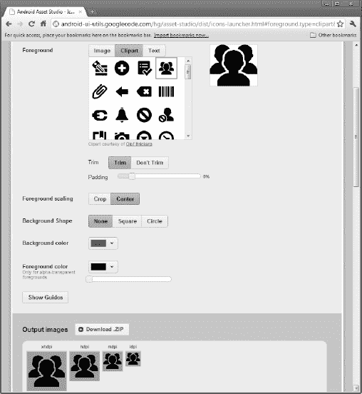

# 四十三、更多开发工具

Android SDK 不仅仅是一个 Java 类和 API 调用库。它还包括许多有助于应用开发的工具。当然，Eclipse 倾向于主导讨论。然而，这并不是您可以使用的唯一工具，所以让我们快速浏览一下您还可以使用哪些工具。

### 层次查看器:你的代码有多深？

Android 附带了一个层次查看器工具，旨在帮助您可视化您的布局，就像在运行的仿真器中的运行活动中看到的一样。因此，举例来说，您可以确定某个小部件占用了多少空间，或者尝试找到没有出现在屏幕上的小部件隐藏在哪里。

要使用 Hierarchy Viewer，首先需要启动仿真器，安装应用，启动“活动”,并导航到要检查的位置。请注意，您不能在生产 Android 设备上使用层次查看器。

您可以通过 Android SDK 安装中的`tools/`目录下的`hierarchyviewer`程序启动层次结构查看器，或者从 Eclipse 内部启动。主窗口如图 43–1 所示。

**图 43–1。** *层级查看器主窗口*

该表的根显示了当前在您的开发机器上运行的模拟器实例。树叶代表在特定仿真器上运行的应用。您的活动将通过应用包和类别(如`com.commonsware.android.files/...`)来识别。

当你选择一个窗口并点击 Load View Hierarchy 时，事情变得有趣了。几秒钟后，细节映入眼帘，如图 43–2 所示。

**图 43–2。** *层级查看器布局视图*

布局视图的主要区域显示了一个由各种小部件和组成您的活动的东西组成的树，从整个系统窗口开始，一直到用户将与之交互的各个 UI 小部件。这包括您的应用定义的小部件和容器，以及系统提供的其他小部件和容器，包括标题栏。

单击其中一个视图可为该透视图添加更多信息，如图 Figure 43–3 所示。

**图 43–3。** *层次查看器查看属性*

现在，在层次查看器的中右区域，您可以看到所选小部件或容器的属性，以及渲染该容器及其子容器所用时间的计时细节。

此外，小部件在活动的线框中以红色突出显示，显示在属性下面(默认情况下，视图显示为黑色背景上的白色轮廓)。这可以帮助您确保选择了正确的小部件，比如说，如果您有几个按钮，并且不能从树中轻易地判断出哪个按钮是哪个按钮。

您还可以在层次结构查看器主窗口中执行以下操作:

*   将树形图保存为 PNG 文件
*   将 UI 保存为 Photoshop PSD 文件，不同的小部件和容器使用不同的图层
*   如果您对数据库或应用的内容进行了更改，并且需要一个新的图表，请强制 UI 在模拟器中重新绘制或重新加载层次结构

您可以单击检查屏幕截图，而不是在主窗口中单击加载视图层次。这将层次查看器置于一个全新的视角，称为像素完美视图，如图 Figure 43–4 所示。

**图 43–4。** *层次浏览器像素完美视图*

在左侧，您会看到一个树，表示您活动中的小部件和其他`View`。在中间，您可以看到您的活动的放大视图，它以正常大小显示在右侧。

覆盖在活动上的十字光标显示被缩放的位置。只需点击一个新的区域来改变你所看到的。有一个控制缩放级别的滑块。单击像素还会指示该像素的位置和颜色。

如果您选中工具栏中的“自动刷新”复选框，层次查看器将定期轮询并从您的活动中重新加载 UI，频率由另一个滑块控制。

### DDMS:在安卓的引擎盖下

Android 开发者的另一个工具是 Dalvik 调试监控服务(DDMS)。这就像一把瑞士军刀，允许您做任何事情，从浏览日志文件，更新模拟器提供的 GPS 位置，模拟来电和消息，以及浏览模拟器上的存储以推送和拉取文件。

要启动 DDMS，运行 Android SDK 发行版中`tools/`目录下的`ddms`程序，或者在 Eclipse 中打开 DDMS 透视图。它最初会在左边显示一个模拟器和运行程序的树，如图 Figure 43–5 所示。

**图 43–5。** *DDMS 初始视图*

单击仿真器允许您浏览底部的事件日志，并通过右侧的选项卡操纵仿真器，如 Figure 43–6 所示。

**图 43–6。** *DDMS，用模拟器选中*

#### 伐木

DDMS 让你在一个可滚动的表格中查看你的日志信息，而不是使用`adb logcat`。只需突出显示您想要监控的仿真器或设备，屏幕的下半部分就会显示日志。

此外，您可以执行以下操作:

*   按五个日志记录级别中的任何一个筛选日志选项卡，显示为工具栏按钮 V 到 E。
*   创建一个自定义过滤器，这样您就可以通过点击+工具栏按钮并完成表格(如图 Figure 43–7 所示)来查看那些带有您的应用标签的条目。您在表单中输入的名称将被用作 DDMS 主窗口底部的另一个日志输出选项卡的名称。
*   将日志信息保存到一个文本文件中，以便以后阅读或搜索。

**图 43–7。**??【DDMS】测井过滤器

#### 文件推拉

虽然你可以使用`adb pull`和`adb push`从模拟器或设备获取文件，但 DDMS 可以让你直观地做到这一点。只需突出显示您希望使用的仿真器或设备，然后从主菜单中选择`Device`   `File Explorer`。这将打开典型的目录浏览器，如图 Figure 43–8 所示。

**图 43–8。** *DDMS 文件浏览器*

只需浏览到所需的文件，然后单击工具栏上的“拉”(最左边)或“推”(中间)按钮，将文件传输到开发机器或从开发机器传输文件。要删除文件，请单击删除(最右边)工具栏按钮。

使用文件资源管理器有一些注意事项:

*   您不能通过此工具创建目录。您将需要使用`adb shell`或者从您的应用中创建它们。
*   虽然你可以在模拟器上浏览大部分文件，但由于 Android 的安全限制，你只能在实际设备上访问`/sdcard`之外的很少内容。

#### 截图

要获取 Android 模拟器或设备的屏幕截图，请切换到 Eclipse 中的 DDMS 透视图，并按下屏幕截图工具栏按钮(显示为相机)。这将弹出一个包含当前屏幕图像的对话框，如 Figure 43–9 所示。

**图 43–9。** *DDMS 截屏*

在这里，您可以单击“保存”将图像作为 PNG 文件保存在开发计算机上的某个位置，单击“刷新”根据模拟器或设备的当前状态更新图像，或者单击“完成”关闭对话框。

#### 位置更新

要使用 DDMS 为您的应用提供位置更新，您必须做的第一件事就是让您的应用使用`gpsLocationProvider`，因为这是 DDMS 将要更新的。然后，单击“模拟器控件”选项卡，向下滚动到“位置控件”部分。在这里，您会发现一个更小的选项卡窗格，其中有三个选项用于指定位置:手动、GPX 和 KML，如图 Figure 43–10 所示。

**图 43–10。** *DDMS 位置控件*

要使用 Manual 选项卡，请提供纬度和经度，然后单击 Send 按钮将该位置提交给模拟器。仿真器将依次通知任何位置监听器新的位置。

#### 拨打电话和发送信息

如果你想在 Android 模拟器上模拟来电或短信，DDMS 也可以处理。在仿真器控制选项卡上，位置控制组上方是电话操作组，如图 Figure 43–11 所示。

**图 43–11。**??【DDMS】电话控制

要模拟来电，请填写电话号码，选择语音单选按钮，然后单击呼叫。此时，模拟器将显示来电，允许您接听或拒绝，如图 Figure 43–12 所示。

**图 43–12。** *模拟来电*

要模拟收到的文本消息，请填写电话号码，选择 SMS 单选按钮，在提供的文本区域中输入消息，然后单击发送。文本消息将作为通知出现，如图 Figure 43–13 所示。

**图 43–13。** *模拟短信*

当然，您可以点击通知，在成熟的消息应用中查看消息，如图 Figure 43–14 所示。

**图 43–14。** *模拟短信，在短信应用中*

#### 内存管理

DDMS 还可以帮助您诊断与应用如何使用内存(尤其是堆空间)相关的问题。

在 Sysinfo 选项卡上，您可以看到仿真器整体内存分配的饼图，如图 Figure 43–15 所示。

**图 43–15。**DDMS 内存使用图表

在 Allocation Tracker 选项卡上，您可以记录您的代码(或您在 Android 内部调用的代码)每次分配内存的时间。只需在树表中突出显示您的应用的进程，然后单击 Start Tracking 按钮。当您想查看自单击开始跟踪以来您已经分配了什么时，单击获取分配按钮，这将填写一个表格，显示每次分配、分配了多少内存以及内存在代码中的分配位置，如图 Figure 43–16 所示。

**图 43–16。** *DDMS 分配追踪器*

此外，您甚至可以通过 Dump HPROF 选项为您的应用转储整个堆，这是一个工具栏按钮，看起来像一个半空的罐子，右边有一个红色的向下箭头。产生的 HPROF 文件可以与 MAT(Eclipse 的一个插件)一起使用，以查看哪些对象仍然在堆上，以及是谁导致它们停留在堆上。

在转储 HPROF 文件之前，您可能希望在您的进程上强制运行垃圾收集。您可以通过单击看起来像经典金属垃圾桶的工具栏按钮来实现。

### 亚行:像 DDMS，打字多

Android 调试桥或`adb`实用程序有两个作用:

*   在幕后，它充当模拟器/设备和其他工具之间的桥梁。例如，ADT、层次结构查看器和 DDMS 都通过`adb`桥与仿真器通信。这个桥以守护进程的形式出现，在您上次重启后第一次尝试使用这些工具时产生。
*   它为其他工具的许多功能提供了命令行等价物，特别是 DDMS。

您可以使用`adb`做的一些事情包括:

*   启动(`adb start-server`)或停止(`adb kill-server`)上述守护进程
*   列出目前可见的所有已识别的 Android 设备和模拟器(`adb devices`)
*   在您的设备或模拟器中访问 Linux 外壳(`adb shell`)
*   在您的设备或模拟器上安装或卸载 Android 应用(`adb install`)
*   将文件复制到模拟器中(`adb push`)或从模拟器中(`adb pull`)，很像 DDMS 的文件浏览器
*   检查 LogCat ( `adb logcat`)

### 获取图形

与 Android 4.0 (ADT 版本 14 和 15)一起发布的最新版本的 Android 开发者工具引入了新的 Android Asset Studio。这个配套工具旨在让您快速轻松地创建图形素材，如启动器图标、操作栏和选项卡图标等，并处理创建一组连贯图像的许多繁琐方面，这些图像在每个可能的设备大小、分辨率等方面都很好看。

至少有两种方法可以访问和使用 Android Asset Studio。对于铁杆开发者来说，这些代码是开源的，可以在 Google Code 的`[`code.google.com/p/android-ui-utils/`](http://code.google.com/p/android-ui-utils/)`上获得。您可以下载代码，并构建您的解决方案，为您提供在您的环境中运行的 Android Asset Studio 实例。这种方法的缺点是 Android Asset Studio 仍然被标记为测试版，您很可能会发现自己遇到的问题仍然在开发中得到纠正。

**注意:**作为一个尚未纠正的问题的例子，作者可以通过试图在 Firefox 下的启动器图标上添加文本来不断地发送他的图形卡混乱。

另一种方法是从您最喜欢的浏览器中使用 Android Asset Studio 的托管版本。Android Asset Studio 的开发者建议你使用 Chrome 作为浏览器，但是你也可以使用其他浏览器。

Android Asset Studio 的托管版本目前在`[`android-ui-utils.googlecode.com/hg/asset-studio/dist/index.html`](http://android-ui-utils.googlecode.com/hg/asset-studio/dist/index.html)`。在您的浏览器中打开该页面，您会看到 Android Asset Studio 当前可用的选项，如图 Figure 43–17 所示。

**图 43–17。** *安卓素材工作室首页*

例如，选择创建一个启动器图标会将你带到一个非常简单的调色板，在这里你可以看到 Android 大小的图标，如`ldpi`、`mdpi`、`hdpi`和`xhdpi`，当你向新图标添加图形和文本时，它们会变得栩栩如生。图 43–18 展示了一些立竿见影的效果(以及你的作者并非下一个毕加索的事实)。

**图 43–18。** *在安卓素材工作室*创建启动器图标集

当你完成杰作的创作后，你可以下载这些资源并把它们放在项目的相关`res/`文件夹中。