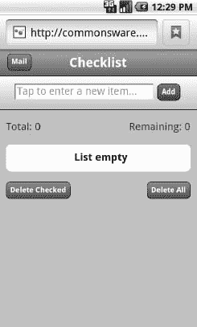
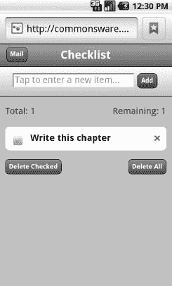
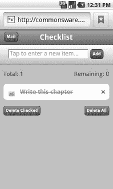
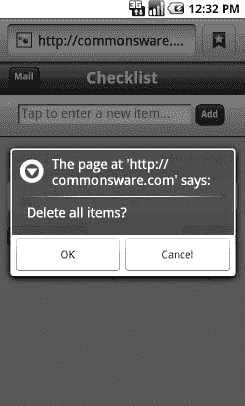

# 四十五、HTML5

在当前对移动应用的兴趣浪潮之前，当前的技术是 web 应用。很多注意力都放在了 AJAX、Ruby on Rails 和其他技巧和技术上，这些技巧和技术使得使用 web 应用的体验接近，有时甚至优于使用桌面应用的体验。

web 应用的爆炸最终推动了 web 标准的下一轮增强，统称为 HTML5。Android 2.0 是第一个支持这些 HTML5 增强功能的版本。值得注意的是，Android 支持离线应用和网络存储，这意味着 HTML5 成为创建 Android 应用的相关技术，而无需处理 Java。

### 离线应用

在 Android 或其他地方使用 HTML5 进行离线应用的关键是，当没有互联网连接时，可以在客户端(例如，在没有 Wi-Fi 的飞机上)或服务器端(例如，由于 web 服务器维护)使用这些应用。

#### 这是什么意思？

从历史上看，web 应用有这种讨厌的趋势，需要 web 服务器。这导致了离线使用的各种变通方法，包括运送 web 服务器并将其部署到桌面。

HTML5 通过允许网页指定自己的缓存规则解决了这个问题。web 应用可以发布一个*缓存清单*，描述哪些资源

*   可以安全地缓存，这样，如果 web 服务器不可用，浏览器可以使用缓存的副本。
*   不能被安全地缓存，这样，如果 web 服务器不可用，浏览器就会像往常一样失败。
*   拥有一个“后备”资源，这样，如果 web 服务器不可用，应该使用缓存的后备资源。

对于移动设备来说，这意味着一个完全支持 HTML5 的浏览器应该能够预先加载所有的资源并保持缓存。如果用户失去连接，应用仍将运行。在这方面，web 应用的行为几乎与常规应用相同。

#### 你如何使用它？

这一章，我们将使用亚历克斯·吉普森创造的`Checklist`“迷你应用”。虽然可以在 MiniApps 网站(`[`miniapps.co.uk/`](http://miniapps.co.uk/)`)上找到该应用的最新版本，但本章将回顾在 Apress 网站(`[www.apress.com](http://www.apress.com)`)的源代码/下载区中找到的`HTML5/Checklist`副本。这份拷贝也在线托管在 CommonsWare 网站上，你可以很容易地通过简短的网址`[`bit.ly/cw-html5`](http://bit.ly/cw-html5)`直接找到它。

##### 关于示例应用

`Checklist`顾名思义，是一个简单的清单应用。当您第一次启动它时，列表将是空的，如图 Figure 45–1 所示。

**图 45–1。** *清单 app，初始启动*

您可以在顶部字段中输入一些文本，然后点击添加按钮将其添加到列表中，如图 Figure 45–2 所示。

**图 45–2。** *检查表，增加一项*

您可以“勾选”个别项目，然后以删除线显示，如图 Figure 45–3 所示。

**图 45–3。** *检查表，其中一项标记为已完成*

您也可以删除选中的条目(通过删除选中的按钮)或所有条目(通过删除全部按钮)，在继续之前会弹出一个确认对话框，如 Figure 45–4 所示。

**图 45–4。** *清单删除确认对话框*

##### 在您的 Android 设备上“安装”清单

要在您的 Android 设备上访问`Checklist`，请访问位于`[`bit.ly/cw-html5`](http://bit.ly/cw-html5)`的托管版。然后你可以为它添加一个书签(在浏览器的选项菜单中选择更多添加书签),以便以后返回。

如果你愿意，你甚至可以在主屏幕上设置书签的快捷方式——只需长按背景，选择书签，然后选择你之前设置的`Checklist`书签。

##### 检查 HTML

`Checklist`应用中的所有功能都是通过几行 HTML 代码实现的:

`<!DOCTYPE html>
<html lang="en" manifest="checklist.manifest">
<head>
<meta http-equiv="Content-Type" content="text/html; charset=utf-8" />
<title>Checklist</title>
<meta name="viewport"
  content="width=device-width; initial-scale=1.0; maximum-scale=1.0;
 user-scalable=0;" />
<meta name="apple-mobile-web-app-capable" content="yes" />`
`<meta name="apple-mobile-web-app-status-bar-style" />
<link rel="apple-touch-startup-image" href="splashscreen.png" />
<link rel="stylesheet" href="styles.css" />
<link rel="apple-touch-icon-precomposed"
      href="apple-touch-icon-precomposed.png" />
</head>
<body>
<section>
 <header>
 <button type="button" id="sendmail">Mail</button>
 <h1>Checklist</h1>
 </header>
 <article>
    <form id="inputarea" onsubmit="addNewItem()">
    <input type="text" name="name" id="name" maxlength="75"
                  autocorrect placeholder="Tap to enter a new item&hellip;" />
    <button type="button" id="add">Add</button>
  </form>
  <ul id="maillist">
    <li class="empty"><a href="" id="maillink">Mail remaining items</a></li>
  </ul>
  
Total: 0
        Remaining: 0

  <ul id="checklist">
    <li class="empty">Loading&hellip;</li>
  </ul>
 </article>
 <fieldset>
  <button type="button" id="deletechecked">Delete Checked</button>
  <button type="button" id="deleteall">Delete All</button>
 </fieldset>
</section>

</body>
</html>`

然而，对于离线应用来说，关键是我们的`html`元素的`manifest`属性:

`<html lang="en" manifest="checklist.manifest">`

这里，我们指定了清单文件的相对路径，指明了离线缓存该应用各个部分的规则。

##### 检查清单

因为清单是所有乐趣所在，所以让我们来看看`Checklist`的清单:

`CACHE MANIFEST
#version 54
styles.css
main.js
splashscreen.png`

html 5 清单格式非常简单。它以一个`CACHE MANIFEST`行开始，后面是一个应该被缓存的文件列表(技术上来说，是相对 URL)。它还支持注释，注释是以`#`开头的行。

清单还可以有一个`NETWORK:`行，后面跟着不应该被缓存的相对 URL。类似地，清单可以有一个`FALLBACK:`行，后跟成对的相对 URL:试图从网络获取的 URL，后跟网络不可用时使用的缓存资源的 URL。

原则上，清单应该为应用运行所需的所有内容请求缓存，尽管请求缓存的页面(在本例中为`index.html`)也会被缓存。

### 网络存储

缓存 HTML5 应用的素材以供离线使用固然很好，但这本身会有相当大的局限性。在离线情况下，应用不能使用 AJAX 技术与 web 服务进行交互。因此，如果应用要能够存储信息，它需要在浏览器本身上这样做。

从 cookies 到 Google Gears 的一切都被用来解决这个问题，后一种工具为 HTML5 应用开辟了一条道路，现在被不同地称为 Web 存储或 DOM 存储。一个 HTML5 应用可以在客户端上持久存储数据，在客户端施加的限制内。这与离线素材缓存相结合，意味着 HTML5 应用在缺少互联网连接时，或者对于存储在“云中”没有意义的数据，可以提供更多的价值

**注意:**从技术上讲，Web 存储不是 HTML5 的一部分，而是一个相关的规范。然而，在日常对话中，它往往会与 HTML5 混为一谈。

#### 这是什么意思？

在支持 Web 存储的浏览器上，您的 JavaScript 代码将可以访问一个代表应用数据的`localStorage`对象。更准确地说，每个*源*(即域)在浏览器上将有一个不同的`localStorage`对象。

`localStorage`对象是一个*关联数组*，这意味着您可以通过数字索引或基于字符串的键来使用它。值通常是字符串。您可以使用`localStorage`执行以下操作:

*   通过`length()`找出数组中有多少条目
*   通过`getItem()`和`setItem()`按键获取和设置项目
*   通过`key()`获取数字索引的密钥
*   通过`removeItem()`删除个别条目或通过`clear()`删除所有项目

这意味着您不具备 SQL 数据库的全部丰富性，就像您在原生 Android 应用中使用 SQLite 一样。但是，对于许多应用来说，这已经足够了。

#### 你如何使用它？

`Checklist`将列表项作为键存储在关联数组中，常规项的值为`0`，删除项的值为`1`。在这里，我们看到了将一个新项目放入清单的代码:

`try {
  localStorage.**setItem**(strippedString, data);
}
catch (e) {
  if (e == QUOTA_EXCEEDED_ERR) {
    **alert**('Quota exceeded!');
  }
}`

下面的代码将这些项目从存储中取出，放入一个数组中进行排序，然后在网页上显示为 DOM 元素:

`/*get all items from localStorage and push them one by one into an array.*/
for (i = 0; i <= listlength; i++) {

  var item = localStorage.**key**(i);
  myArray.**push**(item);
}

/*sort the array into alphabetical order.*/
myArray.**sort**();`

当用户选中某个项目旁边的复选框时，存储会更新，以持续切换选中的设置:

`/*toggle the check flag.*/
if (target.previousSibling.checked) {
  data = 0;
}
else {
  data = 1;
}
/*save item in localStorage.*/
try {
  localStorage.**setItem**(name, data);
} catch (e) {

  if (e == QUOTA_EXCEEDED_ERR) {
    **alert**('Quota exceeded!');
  }
}`

`Checklist`也有从存储器中删除项目的代码，可以是所有被标记为选中的项目，也可以是所有项目。以下是删除所有选中项目的代码:

`/*remove every item from localStorage that has the data flag checked.*/
while (i <= localStorage.length-1) {

  var key = localStorage.**key**(i);
  if (localStorage.**getItem**(key) === '1') {
    localStorage.**removeItem**(key);
  }
  else { i++; }
}`

下面是删除所有项目的代码:

`/*deletes all items in the list.*/
deleteAll: function() {

  /*ask for user confirmation.*/
  var answer = **confirm**("Delete all items?");

  /*if yes.*/
  if (answer) {

    /*remove all items from localStorage.*/
    localStorage.**clear**();
    /*update view.*/
    checklistApp.**getAllItems**();
 }
 /*clear up.*/
 delete checklistApp.deleteAll;
},`

#### Web SQL 数据库

Android 的内置浏览器还支持 Web SQL 数据库选项，这使您能够从 JavaScript 使用 SQLite 风格的数据库。这比基本的 Web 存储提供了更多的功能，尽管代价很复杂。它也不是现行标准的一部分——致力于该标准的网络超文本应用技术工作组(WHATWG)已经暂时将其搁置一旁。

您可以考虑评估 Lawnchair，它是一个 JavaScript API，允许您存储任意的 JavaScript 对象符号(JSON)编码的对象。它将使用任何可用的存储选项，因此将帮助您处理跨平台的多样性。

### 即将投入生产

创建一个小的测试应用并不需要什么神奇的东西。不过，假设您对让其他人使用您的应用感兴趣——可能是许多其他人。经典的基于 Java 的 Android 应用必须处理测试，对应用进行数字签名以供生产，通过各种渠道(如 Android Market)分发应用，并通过各种方式为应用提供更新。这些问题不会神奇地消失，因为 HTML5 被用作应用环境。然而，HTML5 确实大大改变了 Java 开发人员必须做的事情。

#### 测试

由于 HTML5 可以在其他浏览器中工作，测试您的业务逻辑可以很容易地利用任何数量的 HTML 和 JavaScript 测试工具，从 Selenium 到 QUnit 再到 Jasmine。

为了在 Android 上进行测试——以确保没有与 Android 浏览器实现相关的问题——您可以使用 Selenium 的 Android 驱动程序或远程控制模式。

#### 签署和分发

与原生 Android 应用不同，您无需担心 HTML5 应用的签名问题。这样做的缺点是不支持通过 Android Market 分发 HTML5 应用，Android Market 目前只支持原生 Android 应用。用户将不得不通过某种方式找到你的应用，在浏览器中访问它，给页面添加书签，可能还会创建一个主屏幕快捷方式。

#### 更新

与默认情况下必须手动更新的原生 Android 应用不同，HTML5 应用将在用户下次在连接到互联网的情况下运行该应用时透明地更新。离线缓存协议将在回退到缓存的副本之前检查 web 服务器上文件的新版本。因此，除了发布最新的 web 应用资源，您没有什么可做的了。

### 您可能会遇到的问题

不幸的是，没有什么是完美的。虽然 HTML5 可能会使许多事情变得更容易，但它不是解决所有 Android 开发问题的灵丹妙药。

这一节涵盖了一些潜在的关注领域，当你使用 Android 的 HTML5 应用时，你将会考虑到这些领域。

#### 安卓设备版本

并非所有 Android 设备都支持 html 5——只有运行 Android 2.x 或更高版本的设备才支持。因此，理想情况下，你应该在你的网络服务器上做一点用户代理嗅探，把老 Android 用户重定向到其他解释他们设备局限性的页面。

以下是运行 Android 2.1 的 Google/HTC Nexus One 设备的用户代理字符串:

`Mozilla/5.0 (Linux; U; Android 2.1-update1; en-us; Nexus One Build/ERE27)
 AppleWebKit/530.17 (KHTML, like Gecko) Version/4.0 Mobile Safari/530.17`

如您所见，它的格式类似于典型的现代用户代理字符串，这意味着它相当混乱。它确实表明它正在运行`Android 2.1-update1`。

最终，有人会为不同的设备型号创建一个用户代理字符串数据库，从那里我们可以导出适当的正则表达式或类似的算法来确定给定的设备是否可以支持 HTML5 应用。

#### 屏幕尺寸和密度

HTML5 应用可以在各种屏幕尺寸上运行，从 QVGA Android 设备到 1080p 液晶显示器等等。同样，屏幕密度可能会有很大差异，因此尽管智能手机上的 48×48 像素图像可能是合适的尺寸，但对于 1080p 电视来说可能太大了，更不用说 24 英寸的液晶桌面显示器了。

除了增加低端屏幕尺寸的可能选项，这些都不是 Android 独有的。你需要决定如何最好地设计你的 HTML 和 CSS，以适应不同的大小和密度，即使 Android 不在其中。

#### 有限的平台集成

HTML5 虽然提供了比以往更多的平台集成，但并没有涵盖 Android 应用可能希望能够做到的一切。例如，普通的 HTML5 应用不能执行以下操作:

*   启动另一个应用
*   使用联系人数据库
*   用股票浏览器发出通知(注意，Android 版 Firefox 有一个解决方案)
*   一定要真正在后台工作(尽管网络工作者有一天可能会减轻这一点)
*   与蓝牙设备互动
*   录制音频或视频
*   使用标准的 Android 偏好系统
*   使用语音识别或文本到语音转换

当然，许多应用不需要这些功能。其他应用环境，如 PhoneGap(在第四十六章中有所介绍)，将很可能演变成 Android 的“HTML5 Plus”。这样，您可以创建一个适用于所有设备的普通应用和一个独立的增强 Android 应用，该应用利用了更好的平台集成，但代价是额外的编程量。

#### 性能和电池

一段时间以来，人们一直担心基于 HTML 的用户界面与原生 Android 用户界面相比，在处理器时间、内存和电池方面效率低下。例如，避免在 Android 主屏幕上使用 BONDI 风格的 web 小部件的原因之一就是性能影响。

当然，设计消耗电池的 HTML5 应用是可能的。例如，如果每秒钟都有一大块 JavaScript 代码无限期地运行，这将消耗相当多的处理器时间。然而，除此之外，一个普通的应用似乎不太可能被如此频繁地使用，以至于严重影响电池寿命。当然，在这方面还需要做更多的测试。

此外，HTML5 应用的启动速度可能会比其他应用慢一点，特别是如果浏览器有一段时间没有使用，或者网络连接存在，但服务器的带宽很小。

#### 外观和感觉

HTML5 应用当然可以看起来非常光滑和专业——毕竟，它们是用 web 技术构建的，web 应用可以看起来非常光滑和专业。

然而，HTML5 应用不一定看起来像标准的 Android 应用，至少最初不是。毫无疑问，一些有事业心的开发人员会创建一些可重用的 CSS、JavaScript 和图像，例如，镜像一个 Android 原生`Spinner`小部件(一种下拉控件)。类似地，HTML5 应用往往缺少选项菜单、通知或其他原生 Android 应用可能会使用的 UI 功能。

这不一定是坏事。考虑到创建一个看起来非常光滑的 Android 应用的难度，HTML5 应用可能会比 Android 应用看起来更好。毕竟，擅长创建漂亮的网络应用的人比擅长创建漂亮的安卓应用的人多得多。

然而，一些用户可能会抱怨外观和感觉的差距，只是因为它是不同的。

#### 分布

HTML5 应用可以很容易地添加到用户的设备上——浏览、添加书签和添加主屏幕的快捷方式。然而，HTML5 应用不会出现在 Android 市场中，因此受过培训来查看可用应用市场的用户不会找到 HTML5 应用，即使这些应用可能比他们的原生应用更好。

可以想象，有一天，Android 市场将支持 HTML5 应用。还可以想象，有一天，Android 用户将倾向于通过搜索 Android Market 之外的其他方式找到他们的应用，并能够通过这种方式获得他们的 HTML5 应用。然而，在其中一个成为现实之前，HTML5 应用可能不像它们的本地对等物那样“容易被发现”。

### 浏览器更改贴吧冰淇淋三明治

谷歌已经宣布，他们的 Android 浏览器的未来方向将是 Chrome(或 Android 的 Chrome 衍生版本)。对于 Android 4.0 版本，没有迹象表明这种变化是通过一个渐进的过程慢慢收敛到一个类似 Chrome 的浏览器上，还是通过未来版本中的一个大变革。当这种变化真的发生时，使用 HTML5 的一些细微差别，甚至一些支持的特性，都可能会改变。这将影响所有使用 HTML5 应用的用户，不包括使用其他浏览器的用户。

### HTML5 和其他安卓浏览器

虽然内置的 Android 浏览器将是许多 Android 用户的选择，但也有其他浏览器可用。以下是一些更著名的替代方案在 HTML5 支持方面的情况:

*   火狐移动版:经过一段时间后仍处于测试阶段，支持离线缓存和本地存储。但是，此时无法正确运行`Checklist`样本。
*   *Opera Mobile* :稳步改进的产品，最近增加了触觉反馈支持等功能。不支持本地存储，渲染`Checklist`没有意义。它也不支持离线缓存。
*   *海豚浏览器 HD 4.0* :支持离线缓存和本地存储。虽然在`Checklist`中有轻微的渲染问题——可能与 CSS 有关——但是应用在其他方面运行良好，即使没有互联网连接。

### HTML5:基线

对于传统的应用开发来说，HTML5 可能会变得相当流行。它为 web 开发者提供了一条通向桌面的道路。它可能是谷歌 Chrome OS 的唯一选择。而且，随着对流行移动设备(包括 Android)的支持不断改善，开发者肯定会被另一轮“一次编写，随处运行”的承诺所吸引。

随着时间的推移，HTML5 很有可能成为 Android 应用开发的第二选择，仅次于编写到 Android SDK 的传统 Java 应用。这将使 HTML5 成为比较可选 Android 开发选项的基准——这些选项不仅会与使用 SDK 进行比较，还会与使用 HTML5 进行比较。