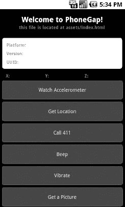
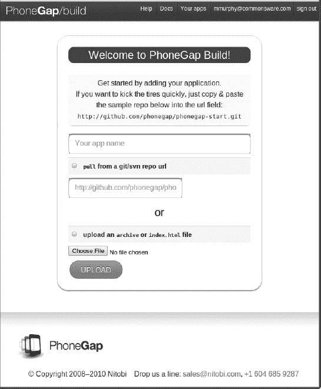
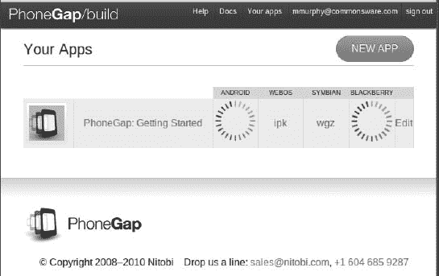
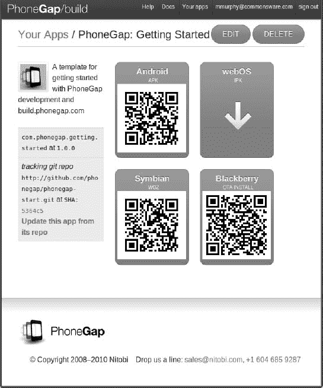
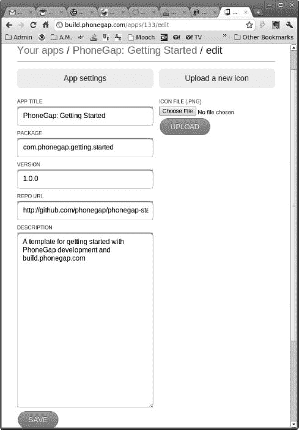
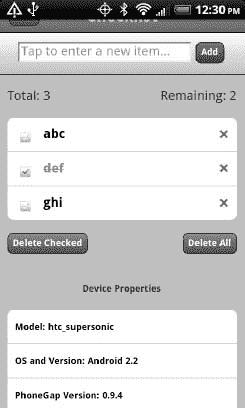

# 四十六、PhoneGap

PhoneGap 可能是 Android 最初的替代应用框架，于 2009 年初出现。PhoneGap ( `[www.phonegap.com/](http://www.phonegap.com/)`)是开源的，由 Nitobi 支持，Nitobi 传统上提供开源和商业产品的混合，以及咨询和培训服务。截至 2011 年 10 月，Nitobi 已同意被 Adobe 收购。为了确保 PhoneGap 代码的持久性，Nitobi 将 PhoneGap 代码库提交给了 Apache 软件基金会，该项目现在被命名为 Apache Callback。大多数人仍然知道这个项目的原始名称，许多文档仍然提到 PhoneGap，所以我们将坚持使用传统的名称。

### 什么是 PhoneGap？

PhoneGap 是一个围绕 HTML5 构建的平台，使您能够从一个代码库开发应用，并将它们部署到多个平台。使用 PhoneGap 只需遵循以下步骤:

1.  使用 HTML5 和 JavaScript 等 web 标准语言构建您的应用。
2.  用 PhoneGap 包装您的应用，以获得对本机 API 的访问。
3.  将您的应用部署到多个平台。

在`[www.phonegap.com/about](http://www.phonegap.com/about)`阅读更多关于 PhoneGap 及其工作原理的信息。

#### 你在写什么？

PhoneGap 应用由 HTML、CSS 和 JavaScript 组成，与移动网站或 HTML5 应用没有什么不同，只是在 PhoneGap 中，web 素材与应用打包在一起，而不是即时下载。

因此，预装的 PhoneGap 应用可能包含相对较大的素材，如复杂的 JavaScript 库，可能太慢而无法通过较慢的 EDGE 连接下载。然而，PhoneGap 仍然受到移动设备速度以及 WebKit 浏览器加载和处理这些素材的速度的限制。

此外，WebKit for mobile 的开发不同于 WebKit for desktops 的开发，特别是在触摸和鼠标事件方面。在可行的情况下，您可能希望使用 JavaScript 框架的移动层进行开发(例如，jQTouch 与普通 jQuery)。

#### 你有什么特点？

与 HTML5 应用一样，PhoneGap 为您提供了 web 浏览器的基本功能，包括 AJAX 支持。除此之外，PhoneGap 还增加了许多 JavaScript APIs，让你可以了解 Android 平台的底层特性。在撰写本文时，包括以下内容:

*   加速度计接入，用于检测设备的移动
*   录音
*   相机接入，用于拍摄静态照片
*   指南针访问，用于定向活动
*   联系人访问，用于使用内置联系人提供程序
*   数据库访问，既可以访问您创建的数据库(SQLite)，也可以访问 Android 内置的其他数据库(例如，联系人)
*   文件系统访问，例如对 SD 卡或其他外部存储器的访问
*   地理定位，用于确定设备的位置
*   通知服务，包括警报和声音效果
*   存储，设备上和 SD 卡
*   振动，用于摇动电话(例如，力反馈)

因为其中一些是 HTML5 规范的一部分(例如，地理定位)，所以您可以选择 API。此外，这个列表会随着时间的推移而变化，但你会看到前面的列表是大多数当代 Android 设备上的本机功能的一个非常全面的列表。

#### app 是什么样子的？

PhoneGap 应用看起来像网页，比原生 Android 应用更像，如图图 46–1 所示，这是 PhoneGap 附带的示例应用的截图。您可以使用 CSS 和图像在某种程度上模仿 Android 的外观和感觉，但仅限于那些可以在 Android 和 HTML 中创建的小部件。例如，Android `Spinner`小部件，类似于一个下拉列表，可能很难在 HTML 中模仿。

**图 46–1。***PhoneGap 附带的示例应用*

#### 分销是如何运作的？

分发 PhoneGap 应用与分发任何其他标准 Android 应用非常相似，只是有一些额外的选项。使用独立的 PhoneGap，在测试之后，您使用 Android 构建工具从 PhoneGap 为您生成的 Android 项目中创建一个标准的 APK 文件。这个项目将包含 Java、XML 和其他必要的部分，来包装 HTML、CSS 和 JavaScript，以构成您的应用。然后，您对应用进行数字签名，并将其上传到 Android Market 或您希望使用的任何其他分发机制。Nitobi 还提供了一个托管构建服务，叫做 PhoneGap Build，我们将在本章稍后讨论。

#### 其他平台呢？

PhoneGap 不只是针对 Android。你可以为 iPhone，Blackberry，Symbian，微软 Windows Phone，Samsung Bada 和 Palm 的 WebOS 创建 PhoneGap 应用。至少在理论上，您可以使用 HTML、CSS、JavaScript 和 PhoneGap JavaScript APIs 创建一个应用，并让它在许多设备上运行。

有几个限制会阻碍你实现这个目标:

*   PhoneGap 在所有这些平台上使用的网络浏览组件并不相同。根据 WebKit 集成到给定设备的固件中时可用的版本，即使使用 WebKit 的多个平台也会有不同的 WebKit 版本。因此，您需要进行测试，以确保您的 CSS 能够在尽可能多的设备上正常运行。
*   由于各种因素，并非所有 PhoneGap JavaScript APIs 都可以在所有设备上使用(例如，没有在平台的本机 API 中公开，缺乏将功能提升到 PhoneGap APIs 中的工程时间，等等)。).PhoneGap wiki 可以让你知道在不同的设备上什么有效，什么无效。您将希望限制您的功能使用以匹配您想要的平台，或者限制您的平台以匹配您想要的功能。

### 使用 PhoneGap

现在，让我们来看看使用 PhoneGap 的更多技巧。在撰写本文时，PhoneGap 的安装和使用通常需要一名基于 Java 的 Android 开发专家。您需要安装一整套工具，手动编辑配置文件，等等。如果您想做到所有这些，PhoneGap 网站上提供了文档，我们将在下面简单介绍一下。如果你正在读这一章，你很有可能会跳过所有这些。同样，您可以使用 PhoneGap 构建服务(`[`build.phonegap.com/`](http://build.phonegap.com/)`)，我们将很快介绍它。

#### 安装

您可以从 PhoneGap 网站下载最新的 PhoneGap 工具，作为一个 ZIP 存档，它可以重定向到 Apache Software Foundation 的 Apache Callback incubator 存储库。只要对您的开发机器和平台有意义，就将这些工具解包。对于 Android 开发，这就是你需要的所有 PhoneGap 特有的安装。但是，您将需要 Android SDK 和相关工具(例如，如果您希望使用 Eclipse，可以使用 Eclipse)来设置项目。

#### 创建并安装您的项目

PhoneGap Android 项目本质上是一个常规的 Android 项目，您可以按照本书前面概述的说明来创建它。要将标准生成的“Hello，World”应用转换为 PhoneGap 项目，您需要执行以下操作:

1.  从解压 PhoneGap ZIP 文件的位置的`Android/`目录，将 PhoneGap JAR 文件复制到项目的`libs/`目录。如果您正在使用 Eclipse，您还需要将它添加到您的构建路径中。
2.  在您的项目中创建一个`assets/www/`目录。然后，从您解压 PhoneGap ZIP 文件的位置的`Android/`目录中复制 PhoneGap JS 文件。
3.  将标准的“Hello，World”活动调整为继承自`DroidGap`而不是`Activity`。这就需要你导入`com.phonegap.DroidGap`。
4.  在活动的`onCreate()`方法中，用`super.loadUrl("file:///android_asset/www/index.html");`替换`setContentView()`。
5.  在您的清单中，添加 PhoneGap 请求的所有权限，这些权限将在本章后面列出。
6.  同样在您的清单中，根据您想要测试和支持的屏幕尺寸添加一个合适的`<supports-screens>`元素。
7.  同样在您的清单中，将`android:configChanges="orientation|keyboardHidden"`添加到您的`<activity>`元素中，因为`DroidGap`处理与方向相关的配置更改。

此时，您可以在项目中创建一个`assets/www/index.html`文件，并开始使用 HTML、CSS 和 JavaScript 创建 PhoneGap 应用。您需要包含对 PhoneGap JavaScript 文件的引用(例如，`
</head>
<body>
    <section>
        <header>
          <button type="button" id="sendmail">Mail</button>
          <h1>Checklist</h1>
        </header>
        <article>
          <form id="inputarea" onsubmit="addNewItem()">
              <input type="text" name="name" id="name" maxlength="75"
                     autocorrect placeholder="Tap to enter a new item&hellip;" />
              <button type="button" id="add">Add</button>
            </form>
            <ul id="maillist">
            <li class="empty"><a href="" id="maillink">Mail remaining items</a></li>
          </ul>
            
Total: 0
            Remaining: 0

          <ul id="checklist">
            <li class="empty">Loading&hellip;</li>
          </ul>
        </article>
        <fieldset>
          <button type="button" id="deletechecked">Delete Checked</button>
          <button type="button" id="deleteall">Delete All</button>
        </fieldset>
    </section>
    
</body>
</html>`

对于许多应用，这就是你所需要的。你只是简单地看着 PhoneGap 给你一些你可以在 Android Market、iOS 应用商店等等上分发的东西。

#### 添加 PhoneGap APIs

如果您想利用更多的设备功能，您可以扩充您的 HTML5 应用来使用 PhoneGap 特定的 API。这些功能涵盖了从告诉你设备的型号到让你获得指南针读数的所有范围。因此，它们的复杂性会有所不同。为了本章的目的，我们将看一些更简单的。

##### 设置设备就绪事件处理程序

由于各种原因，当您的页面被加载时，PhoneGap 不会立即响应它的所有 API。相反，您需要寻找一个`deviceready`事件来确认使用 PhoneGap 特定的 JavaScript 全局变量是安全的。以下是典型的食谱:

1.  向您的`<body>`标签添加一个`onload`属性，引用一个全局 JavaScript 函数(例如，`onLoad()`)。
2.  在`onLoad()`中，使用`addEventListener()`为`deviceready`事件注册另一个全局 JavaScript 函数(如`onDeviceReady()`)。
3.  在`onDeviceReady()`中，开始使用 PhoneGap APIs。

##### 使用 PhoneGap 提供的功能

PhoneGap 通过一系列虚拟 JavaScript 对象为您提供了许多方法。这里，“虚拟”意味着您不能检查对象是否存在，但是您可以调用方法并读取它们的属性。例如，有一个`device`对象有一些有用的属性，比如`phonegap`返回 PhoneGap 版本，而`version`返回 OS 版本。这些虚拟对象准备好在`deviceready`事件中或之后使用。

例如，下面是一个 JavaScript 文件(`PhoneGap/ChecklistEx`项目中的`props.js`)，它实现了一个`onLoad()`函数(为`deviceready`注册)和一个`onDeviceReady()`函数(使用`device`对象的属性):

`// PhoneGap's APIs are not immediately ready, so set up an
// event handler to find out when they are ready

function onLoad() {
  document.addEventListener("deviceready", onDeviceReady, false);
}

// Now PhoneGap's APIs are ready

function onDeviceReady() {
  var element=document.getElementById('props');

  element.innerHTML='<li>Model: '+device.name+'</li>' +
                    '<li>OS and Version: '+device.platform +' '+device.version+'</li>' +
                    '<li>PhoneGap Version: '+device.phonegap+'</li>';
}`

`onDeviceReady()`函数需要一个`id`为`props`的列表元素。这再加上首先加载这个 JavaScript，将需要对我们的 HTML 进行一些小的修改:

`<!DOCTYPE html>
<html lang="en" manifest="checklist.manifest">
<head>
    <meta http-equiv="Content-Type" content="text/html; charset=utf-8" />
    <title>Checklist</title>
    <meta name="viewport"
      content="width=device-width; initial-scale=1.0; maximum-scale=1.0;
 user-scalable=0;" />
    <link rel="stylesheet" href="styles.css" />
    
    
</head>
 <body onload="onLoad()">
    <section>
 <header>
 <button type="button" id="sendmail">Mail</button>
 <h1>Checklist</h1>
 </header>
 <article>
    <form id="inputarea" onsubmit="addNewItem()">
    <input type="text" name="name" id="name" maxlength="75"
                  autocorrect placeholder="Tap to enter a new item&hellip;" />
    <button type="button" id="add">Add</button>
  </form>
  <ul id="maillist">
    <li class="empty"><a href="" id="maillink">Mail remaining items</a></li>
  </ul>
  
Total: 0
        Remaining: 0

  <ul id="checklist">
    <li class="empty">Loading&hellip;</li>
  </ul>
 </article>
 <fieldset>
  <button type="button" id="deletechecked">Delete Checked</button>
  <button type="button" id="deleteall">Delete All</button>
 </fieldset>
    <footer>
        <h2>Device Properties</h2>
        <ul id="props"></ul>
    </footer>
    </section>
    
 </body>
</html>`

Figure 46–6 显示了最终的应用。

**图 46–6。** *带有设备属性的 PhoneGap 清单应用*

显然，读取一些属性远比用设备的摄像头拍照简单。然而，复杂性的差异主要在于 PhoneGap 的虚拟 JavaScript 对象给了你什么以及你如何使用它们，这比 Android 特有的任何东西都要多。

### 你可能遇到的问题

PhoneGap 是创建跨平台应用的绝佳选择。然而，它也不是没有问题。其中一些问题可能会及时得到解决；有些可能是 PhoneGap 特有的性质。

#### 安全

Android 应用使用权限系统来请求访问某些系统功能，例如提出互联网请求或读取用户的联系人。应用必须在安装时请求这些权限，因此如果请求的权限可疑，用户可以选择放弃安装。

一般的经验法则是，您应该请求尽可能少的权限，并确保您可以证明您为什么请求它们。

PhoneGap，对于一个新项目，请求相当多的权限:

*   `CAMERA`
*   `VIBRATE`
*   `ACCESS_COARSE_LOCATION`
*   `ACCESS_FINE_LOCATION`
*   `ACCESS_LOCATION_EXTRA_COMMANDS`
*   `READ_PHONE_STATE`
*   `INTERNET`
*   `RECEIVE_SMS`
*   `RECORD_AUDIO`
*   `MODIFY_AUDIO_SETTINGS`
*   `READ_CONTACTS`
*   `WRITE_CONTACTS`
*   `WRITE_EXTERNAL_STORAGE`
*   `ACCESS_NETWORK_STATE`

保持这个花名册不变将使您的应用可以使用 PhoneGap 为您的 JavaScript 提供的所有 API...和一个会吓跑很多用户的应用。毕竟，您的应用不太可能能够使用所有这些权限，更不用说证明这些权限的合理性了。

您当然可以通过修改 PhoneGap 项目根目录下的`AndroidManifest.xml`文件来缩减这个列表。然而，您将需要彻底测试您的应用，以确保您没有放弃您实际需要的权限。此外，您可能不清楚可以安全删除哪些权限。

最终，PhoneGap 项目可能会有工具来帮助指导您选择权限，也许是通过静态分析您的 JavaScript 代码来查看您正在使用哪些 PhoneGap APIs。不过，与此同时，获得适当的权限集将涉及大量的尝试和错误。

#### 屏幕尺寸和密度

普通的 web 应用主要关注屏幕分辨率和窗口大小作为它们的主要变量。移动网络应用不必担心窗口大小，因为浏览器和应用通常全屏运行。但是，移动 web 应用需要处理物理大小和密度——这些问题与传统 web 开发无关。

上网本的屏幕可以是 10 英寸或更小，而台式机的屏幕可以是 24 英寸或更大。因此，物理屏幕尺寸似乎是 web 开发人员需要解决的问题。然而，在上网本/笔记本/台式机领域，屏幕分辨率(以像素为单位)通常与物理尺寸相符。这是因为 LCD 的屏幕密度相当一致，而且密度相当低。

另一方面，智能手机有几种不同的密度，导致分辨率和尺寸之间的联系被打破。一些低端手机，尤其是小尺寸(例如 3 英寸)的 LCD，其密度与漂亮的显示器相当。中档手机的密度是普通手机的两倍(240 dpi 对 120 dpi)。苹果的 iPhone 4 密度更高，很可能很快也会有一些配备所谓视网膜显示屏的 Android 设备。因此，例如，800×480 的分辨率可以在 4 英寸到 7 英寸的屏幕上显示。平板电脑增加了更多可能的尺寸。

触摸屏带来的问题更是雪上加霜。鼠标点击可以获得像素级的精度。手指就没那么精确了。因此，你可能需要在触摸屏上把你的按钮和类似的东西做得大一点，这样才方便手指操作。这导致了素材缩放的一些问题，尤其是图像。在低密度 3 英寸设备上可能对手指友好的东西对于高密度 4 英寸设备来说可能完全太小了。

原生 Android 应用具有用于处理该问题的内置逻辑，其形式为多组资源(例如，图像)，可以基于设备特征进行交换。最终，PhoneGap 和类似的工具将需要为他们的用户提供相关的建议，告诉他们如何创建同样能适应环境的应用。

#### 观感

一个 web 应用看起来永远不会像一个本地应用。这未必是一件坏事。然而，一些用户可能会感到不安，特别是因为他们不明白为什么他们新安装的应用(例如，用 PhoneGap 制作的)与他们已经拥有的任何其他类似应用如此不同。

随着 HTML5 应用在 Android 上变得更加突出，这个问题的重要性应该会下降。然而，这是需要记住的事情。如果您正在创建自己的图形元素(图标等)。)你几乎肯定会从使用 Android Asset Studio 中受益，这将在第四十三章中介绍，承担一些杂务:制作必要大小的图标，创建与你的图标和其他风格一致的网络图像，等等。

### 了解更多信息

在撰写本文时，还没有专门介绍 PhoneGap 开发的书籍。目前，关于 PhoneGap 的最佳信息可以在 PhoneGap 网站上找到，包括它的 API 文档，也可以在其他网站上的许多其他公开的教程中找到。