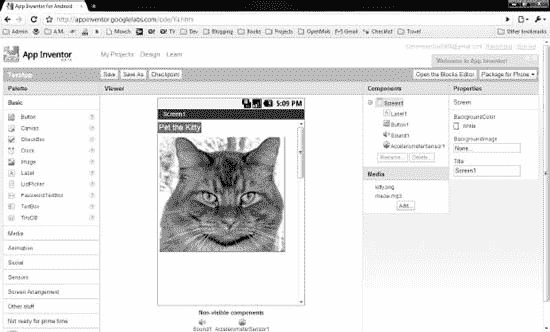
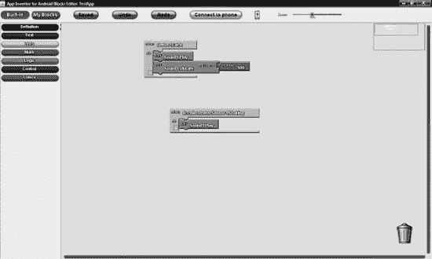

# 四十七、其他替代环境

前面章节中描述的备选应用环境只是这些技术不断发展的一小部分。这里，我们将简要地看一下其他几个可供选择的应用环境。

**注意:**这个领域正在快速变化，所以当你读到这一章的时候，相对于这些技术已经取得的进步，这些材料可能已经有些过时了。查看每个应用环境的网站，获取最新的更新。

### 罗德斯

Rhodes ( `[`rhomobile.com/`](http://rhomobile.com/)`)类似于 PhoneGap，因为您开发的 Android 应用的用户界面是通过 HTML、CSS 和 JavaScript 定义的。不同之处在于 Rhodes 在一个完整的 Ruby 环境中使用 Rails 风格的框架。您的 Ruby 代码生成 HTML，并通过一个`WebView`小部件“提供”给一个活动，就像服务器端的 Ruby web 应用生成 HTML 提供给一个独立的 web 浏览器一样。

与 PhoneGap 类似，您可以在您的开发机器上构建项目，也可以使用他们的托管构建流程 RhoHub。推荐后一种方法，部分原因是对本地构建的要求高于 PhoneGap——值得注意的是，Rhodes 需要本地开发工具包(NDK)来构建 Ruby 解释器并将其链接到您的应用。

由于 Ruby 解释器的开销(大约 1.5MB)，Rhodes 最终创建了比 PhoneGap 更大的应用。但是，如果你习惯于服务器端的 web 开发，那么对你来说，拿起 Rhodes 可能比拿起 PhoneGap 更容易。

Rhodes 与众不同的一个方面是提供一组连接器和一种称为 RhoConnect 的服务器端服务，所有这些都是为了在 Rhodes 开发的 Android 应用和各种企业和商业系统之间提供集成。

### 闪光、弯曲和空气

Adobe 长期努力将其 Flash、Flex 和 AIR 技术扩展到移动领域。历史上，你可以使用 Flex(“Hero”版)和 Flash Builder(“Burrito”版)来创建 Android APK 文件，这些文件可以在 Android Market 上分发并部署到 Android 设备上。这些设备需要安装 Adobe Integrated Runtime (AIR ),这是免费的，但下载量很大，只能在采用新款 ARM 处理器的 Android 2.2 或更高版本的设备上运行(具体来说，ARM v7 或更高版本的处理器，因此一些运行 Android 2.2 或 2.3 的早期型号设备就不太走运了，如 LG Optimus V)。

然后在 2011 年 11 月，Adobe 宣布移动设备(Android 和其他平台)将不再使用 Flash。如果你读了上一章关于 PhoneGap 的内容，你可能会对 Adobe 在移动领域的发展方向得出自己的结论。Adobe 无疑已经在工具领域收集了大量技术和知识来构建 Flash 代码，然后将其转换为 HTML5 和相关的非 Flash 技术。只有时间才能证明这一举措在移动领域是否成功。

AIR 不像 PhoneGap 那样与平台紧密集成(例如，AIR 不提供对设备联系人的访问)，尽管 Adobe 现在可能会在这一领域投入更多资源，可能会利用其通过收购 Nitobi 获得的专业知识。

### JRuby 和 Ruboto

JRuby ( `[www.jruby.org/](http://www.jruby.org/)`)是设计用于在 JVM 上运行的最流行的语言之一——除了 Java 本身。JRuby 很快被移植到 Android 上运行，但禁用了一些优化，因为 JRuby 实际上运行在 Android 环境底层的 Dalvik 虚拟机上，而不是在经典的 JVM 上。

然而，仅靠 JRuby 无法创建 Android 应用。作为一种脚本语言，它无法定义一个活动或其他组件——这些需要在应用的清单中注册为常规的 Java 类文件。

这就是 Ruboto ( `[`ruboto.org/`](http://ruboto.org/)`)的用武之地。Ruboto 是一个通用 JRuby/Android 应用的框架。它通过代码生成器提供框架活动，并允许 JRuby 脚本为所有生命周期方法定义处理程序(例如，`onCreate()`)，使用 JRuby 代码定义用户界面，等等。可以使用提供的 Rake 脚本将结果打包成 APK 文件。搜索结果可以上传到 Android Market，也可以按照你的意愿进行分发。

### 安卓版单声道

Mono 是 C#和。NET 用于非 Windows 环境。Mono 也有相当多的争议，大部分来自微软，比如微软是否有一天会因为专利考虑而压制 Mono。

Android 版 Mono 已经开发了一段时间。这将允许 Mono 开发者将 Android 作为他们应用的目标。原则上，人们可以这样为 Android 开发 C#应用。

虽然 Mono 本身是一个开源项目，但 Mono for Android“是一个商业产品...基于每个开发者的许可”，由 Xamarin ( `[`android.xamarin.com/`](http://android.xamarin.com/)`)主持。对于期待 Android 上的 Mono 保持开源的开发者来说，这可能有点令人震惊。截至 2011 年底，Xamarin 网站列出的价格从每位开发者 399 美元起。

### 应用发明者

App Inventor ( `[`appinventor.googlelabs.com/`](http://appinventor.googlelabs.com/)`)是一款 Android 应用开发工具，由谷歌提供，但不在正常的 Android 开发者网站之内。App Inventor 最初是为教育开发的，但谷歌一直在邀请其他人进入他们的封闭测试版。

App Inventor 理论上是一个基于 web 的开发工具。在这里，“理论上”意味着，在实践中，用户必须在浏览器之外做大量的工作来设置一切:

*   在浏览器中安装并运行 Java 1.6 或更高版本，能够运行 Java Web Start ( `.jnlp`)应用
*   下载并安装大型(~55MB)客户端工具集

设置完成后，App Inventor 会为您提供一个拖放式 GUI 编辑器，如图 Figure 47–1 所示。

**图 47–1。***App 发明者“设计者”查看*

App Inventor 还为您提供了一个块编辑器(参见 Figure 47–2)，您可以通过将代表事件、方法和属性的各种“块”捕捉在一起，将行为附加到事件(例如，单击按钮)。

**图 47–2。***App Inventor Blocks 编辑*

在 GUI 编辑器中工作时，如果您选择直接在连接的设备上构建您的应用，您可以在连接的设备上实时查看您正在构建的内容，并可以对其进行实时测试。稍后，当您准备好了，您可以将应用打包成一个标准的 APK 文件。

但是，App Inventor 目前并未真正用于生产应用:

*   您不能在 Android Market 上分发 App Inventor 应用。谷歌声称这是由于技术上的限制，目前正在积极解决，但这种状况在 2011 年的大部分时间里都没有改变。
*   它有更多的组件旨在“sizzle”(例如，Twitter 集成)，而较少的组件提供典型的现代应用可能需要的功能(例如，关系数据库和列表)。
*   共享开发是原始的，额外的开发人员上传和下载项目代码的 ZIP 文件。
*   也许最大的限制是它的单屏幕焦点，这意味着在不同屏幕上进行额外的活动超出了 App Inventor 的范围。

在未来，App Inventor 可能会成为一个可靠的选择，或者 App Inventor 会引发其他公司为 Android 创建类似的免编程开发选项。

### 钛金属手机

Titanium Mobile 之所以出名，是因为它只使用 JavaScript 来定义用户界面，而完全避开了 HTML。它的 JavaScript 库除了提供对数据库和平台功能的访问之外，还允许您声明用户界面小部件。但是其用于定位所述窗口小部件的布局能力还有待改进。

在撰写本文时，Titanium Mobile 的创建者 Appcelerator ( `www.appcelerator.com/`)还没有提供一套基于云的工具。它确实提供了一个名为 Titanium+Plus 的程序，提供额外的 SDK 组件来与 Twitter 和 PayPal 等其他基于云的服务进行对话。它的 Titanium 工具有一个看起来非常光滑的 UI，但它仍然需要 Java SDK 和 Android SDK 才能构建 Android 应用，这使得设置对一些人来说有点令人生畏。

在撰写本文时，Titanium Mobile 支持 Android 和 iOS 开发。处于私人测试阶段的黑莓支持计划似乎已经暂停。

### 其他 JVM 编译语言

如果你喜欢常规的 Android 开发，但是你不喜欢 Java，任何可以生成兼容的 JVM 字节码的语言都应该可以在 Android 上工作。您必须修改另一种语言的构建链来完成 Android 构建过程的其余部分(例如，从资源中生成`R.java`并最终创建 APK 文件)。

Scala ( `[www.scala-lang.org/](http://www.scala-lang.org/)`)和 Clojure ( `[`clojure.org/`](http://clojure.org/)`)就是两种这样的语言，它们的社区已经将使用它们的语言进行 Android 开发的指令放在了一起。