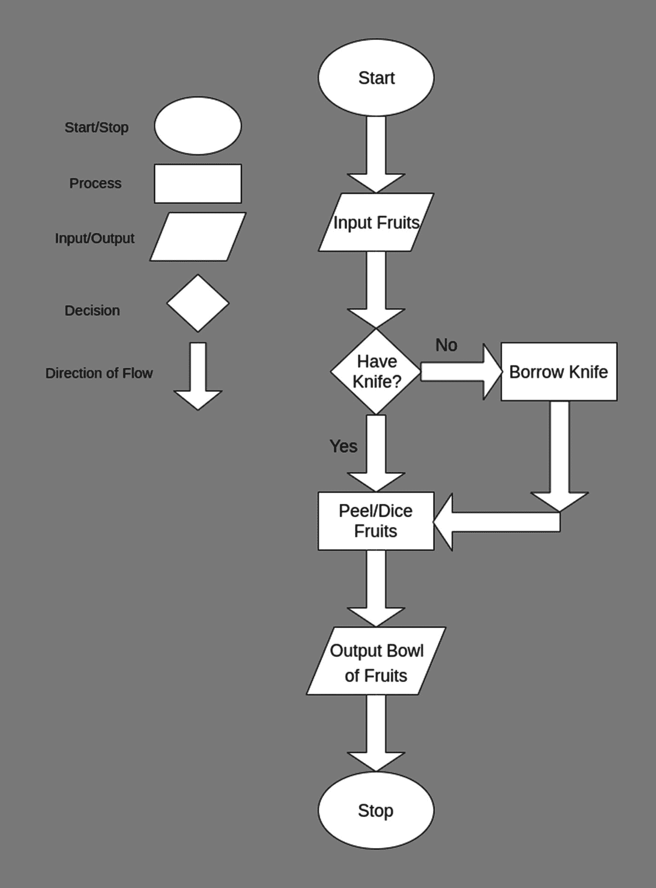

# 一、编程概念

编程就是解决一个问题并为其定义一个解决方案。每一个细节都是精心制作的，试图将解决方案传达给计算机。对于一些，特定的指令被给予计算机系统，以执行导致期望的解决方案的任务。

幸运的是，有高级编程语言来帮助我们用更接近英语而不是 0 和 1 的语言编写这些解决方案。确切地说，编程语言是一套规则，它提供了一种指示计算机执行什么操作的方法。

让我们考虑一个类比。(参见图 [1-1](#Fig1) 。)假设我们有几个水果，必须用它们做沙拉。第一步是分析和定义问题。具体来说，必须识别输入数据(水果)并将其转化为预期输出数据(沙拉)。

第二步是规划。程序员使用的一种技术是流程图，它是一个问题的逐步解决方案的图形表示。它们帮助我们关注程序逻辑，而不是我们将要使用的编程语言的适当语法。

第三步是实际编写程序。第二步中的逻辑现在必须转换成计算机可以理解的东西。存在各种集成开发环境(ide)来帮助程序员用他们选择的编程语言编码。IDE 就像一个文本编辑器，但是有几个附加的特性来帮助程序的开发，比如自动完成或者调试器。自动完成是一种功能，通过这种功能，句子会自动用 IDE 下一步期望的关键字来完成，同时调试器会帮助运行程序并可能找到错误。

第四步也是最后一步是测试程序。可能存在一些错误，为了检测它们，必须输入不同类型的测试数据，并且输出必须与预期的结果一致。调试是指检测、定位和纠正错误。这些错误可能是语法错误或逻辑错误，例如，前者是计算机无法理解的拼写错误的指令，后者就像告诉计算机重复操作，但不告诉它如何停止重复。

本章将引导你了解许多流行的编程概念，但是为了简单起见，很多内容将被搁置。



图 1-1

做沙拉

Note

您还不能运行下面的代码片段，但是不要担心。在我们进入后续章节的 Unity 编码之前，它们只是给你一些基本的理论。

## 1.1 变量、常数和类型

在编程中，数据可以有许多不同的类型。由于我们将使用 Unity 游戏引擎，代码片段(部分)将用 C#来表达。在这一章中，我们将只考虑四种类型的数据:整型、浮点型、布尔型和字符串型。

### 1.1.1 整数数据类型

整数(没有小数部分)的数值可以用整数形式表示。整数值也可以是负值。

```cpp
10, 2667, -50, 0

```

### 1.1.2 浮点数类型

有小数部分的数值可以用浮点形式表示。浮点值也可以是负值。

```cpp
3.9874, 1.245, -112.245, 0.0932

```

### 布尔数据类型

布尔值具有值`true`或`false`。

### 1.1.4 字符串数据类型

字符集可以用字符串形式表示。

```cpp
"Unity", "192.168.100.0", "The big brown fox"

```

### 变量

可以对各种数据执行不同的操作。从长远来看，利用变量可能是个好主意。变量是一种保存特定类型数据的特殊容器。打个比方，一个变量可能是一个衣柜，用来装衣服，而不是其他东西——比如说，不是厨房用具。在 C#中，声明变量的经典方式如下:

```cpp
<variableType> <variableName> = <value>;

```

在 C#中，特定数据类型的变量*不能*保存另一种数据类型的值。为了清楚起见，要声明上述数据类型的变量并为其赋值，必须设置类似于以下内容的内容:

```cpp
int myInteger = 10;
float myFloat = 3.9874f;
bool myBool = false;
string myString = "Unity";

```

注意，对于浮点变量，`f`必须附加在 float 值的末尾，以确保它被解释为 float(而不是 double 数据类型)。在 double 数据类型中，值以 64 位(最多 16 位)存储，这对于我们将要处理的值的类型来说不是很有用。使用 float 数据类型还可以提供更高的整体性能，因为数据是以 32 位(7 位数)存储的。

如果变量在初始化时没有值，例如`bool condition`，它们所使用的数据类型的默认值将被赋给它们，在本例中为`false`。对于整数和浮点数，默认值将分别等于`0`和`0.0f`。对于字符串，这将是`""`(一个空白和空字符串)。

如果一个变量已经包含一个值，并且给它赋了一个新值，那么这个变量的内容将被覆盖，并且它将包含新赋的值，直到程序结束，除非给它赋了另一个值。

```cpp
int pin = 1234;
pin = 4321;
// pin now holds a value of 4321.

```

注意，如果一个变量已经被声明了，就没有必要用它的数据类型来引用它。这将在 1.7 节中详细讨论。

### 常数

常数就像变量一样，只是在声明后不能修改，并且将保持它们初始化时的值。声明常量的过程与声明变量的过程类似，除了关键字`const`必须放在数据类型字段之前。

```cpp
const <variableType> <variableName> = <value>;

```

### 评论

注释是脚本中程序员可读的注释或解释，通常使用户更容易理解代码的某个部分是做什么的。注释通常会被编译器/解释器忽略。在 C#中，注释可以用单行或多行的方式编写。

```cpp
// This is a single-line comment.
/* This is a
multiline comment.*/

```

## 1.2 阵列

数组是一种类似于变量的数据存储结构形式，因为它被声明为保存特定的数据类型。然而，与变量不同，数组可以保存多个数据值。创建数组时，会为其设置一个预定义的大小。因此，数组将保存与其大小相等的数据值的数量。

与变量一样，数组中索引(位置)处的数据值可以被相同类型的其他数据值读取、修改或替换。数组的索引从 0(第一个数据值)开始，最后一个索引将等于数组的大小减 1，因为第一个索引不是 1。

### 1.2.1 声明和创建数组

如果声明的数组没有等号后面的部分，那么它的大小将为零。以后可以修改数组的大小，但是存储在每个索引中的数据值将被重置为数组使用的数据类型的默认值。

```cpp
<arrayType>[] <arrayName> = new <arrayType>[<size>];

// create an integer array of a size of 5 named firstArray
int[] firstArray = new int[5];
// create a string array with a size of 0 named secondArray
string[] secondArray;

// creating a new string array with a size of 10 and assigning it to secondArray
secondArray = new string[10];

```

声明数组的另一种方式是在开始时用值初始化它们。

```cpp
<arrayType>[] <arrayName> = {<value0>, <value1>};
int[] firstArray = {5, 10, 20, 35, 45};
string[] secondArray;

secondArray = {"abc", "def", "ghi"};

```

要获得数组的长度，即它可以存储多少个值，可以调用`Length`方法。

```cpp
int[] firstArray = {5, 10, 20, 35, 45};
int arraySize = firstArray.Length; // 5

```

### 1.2.2 设置、获取和修改数组中的值

在这一节中，我们将看看如何设置和修改数组中的索引值。

```cpp
<arrayName>[<index>] = <value>;
<variable> = <arrayName>[<index>];

```

在下面的例子中，值`13`将被存储在正在使用的整数数组(`firstArray`)的第三个位置(索引 2)。通过将存储在索引 0 ( `7`)和索引 4 ( `6`)的数据值相加来获得值`13`，其中大小`- 1`指的是索引 4。

```cpp
int[] firstArray;
int size = 5;

firstArray = new int[size];
firstArray[0] = 7;
firstArray[4] = 6;

firstArray[2] = firstArray[0] + firstArray[size - 1];

```

## 1.3 算术运算符

在编程中执行算术运算是很常见的。基本的算术运算是加、减、乘和除。可以使用这些运算符来处理数值。这也适用于保存数值的变量和常量(`int`、`float`)。算术运算符必须有两个操作数，并且它们的倍数可以链接成一个等式。操作数是与操作符一起使用的任何东西。例如，加法语句中的数字是操作数，加号是运算符。遵循运算顺序:首先计算括号中的运算，然后是除法和乘法运算，最后是加法和减法运算。

### 1.3.1 加减乘除

这些可以像你在数学课上学到的一样使用。

```cpp
1 + 1; // 2
9 -6; // 3
4 * 2; // 8
60 / 12; // 5
6 * 2 + 3; // 15
5 * (3 - 1) + 1; // 11

```

### 变量和常数

如前所述，算术运算可以通过使用保存数值的变量或常数来完成。

```cpp
int number = 1;

number + 1; // 2
number + 8 - 6; // 3

```

算术运算的结果也可以存储在数字类型的变量中。

```cpp
int number = 2;

number = number * 2; // 4
number * 4; // 16

number = number + 56; // 60
number / 12; // 5

```

### 模量

这是另一个有用的算术运算符。它返回整数除法的余数。正如前面的操作符一样，它也可以用于变量和常量。

```cpp
11 % 4; // 3

```

### 复合赋值运算符

有一种简单的方法可以将一个操作的值赋给该操作中涉及的变量。

<colgroup><col class="tcol1 align-left"> <col class="tcol2 align-left"></colgroup> 
| 

例子

 | 

相等的

 |
| --- | --- |
| 绵羊+= 5； | 羊=羊+5； |
| 绵羊-= 5； | 羊=羊-5； |
| 绵羊*-= 5； | 羊=羊* 5； |
| 绵羊/= 5； | 羊=羊/5； |
| 绵羊% = 5； | 绵羊=绵羊% 5； |

### 快速递增和递减

变量可以快速递增或递减 1。

```cpp
int count = 5;

count++; // 6
count++; // 7
count--; // 6

```

### 一元运算

一元运算是只有一个操作数的运算。由于一元运算只有一个操作数，因此它们在包含它们的其他运算之前被求值。这通常适用于正运算符和负运算符。例如，+8 + -2 和+2 - 3 分别相当于 8 - 2 和 2 + 5。

### 铸造

例如，当执行算术运算时，可能会获得不期望类型的输出。例如，如果程序员将一个变量声明为一个整数，他们将在其中存储 5 * 1.61f 的结果，将获得一个不能存储在该变量中的浮点结果。

这是选角出现的情况之一。基本上，强制转换将特定数据类型的值转换为相同的值，但属于指定的数据类型。将浮点数转换为整数不会对值进行舍入。只返回整数部分。

```cpp
int perfectInt;
float badFloat;

badFloat = 5 * 1.61f; // 7.55f

perfectInt = (int)badFloat; // 7

```

在前面的例子中，我们将变量`badFloat`的值转换为`perfectInt`。然而，我们可以直接执行算术运算，并在`perfectInt`变量中直接将其转换为整数。对于需要浮点结果的算术运算，不需要将涉及的整数(无论是变量还是原始值)转换为浮点数据类型

铸造在某些情况下也可能不适用。例如，由字母组成的 stringvalue 不能转换为整数或浮点数。

## 1.4 逻辑运算符

C#中的逻辑运算符是用于连接表达式的符号，因此生成的复合表达式的值取决于原始表达式的值以及所用逻辑运算符的含义。

### 简单的布尔表达式

布尔表达式总是产生`true`或`false`。例如，问一个问题，比如 5 大于 2 吗？会导致`yes`。在编程中，这将被写成 5 > 2，返回的结果布尔值将是`true`。

<colgroup><col class="tcol1 align-left"> <col class="tcol2 align-left"></colgroup> 
| 

标志

 | 

解释

 |
| --- | --- |
| == | 等于 |
| ！= | 不等于 |
| > | 大于 |
| < | 小于 |
| >= | 大于或等于 |
| <= | 小于或等于 |

```cpp
4 > 5 // false
180 < 450 // true

60 >= 70 // false
567 <= 550 // false
330 != 80 // true

45 > 45 // false
40 < 40.1f // true
90 >= 90 // true
1 == 2 // false

"Cat" == "Dog" // false
"cat" == "Cat" // false
"Shoes" == "Shoes" // true
"Car" != "Plane" // true

```

### 1.4.2 和(&&)

`AND`逻辑运算符有两个操作数。如果操作数的结果是`true`，它将返回一个值`true`。

```cpp
(1 == 1) && (5 > 4) // true
(3 > 4) && (80 >= 79) && (50 > 40) // false

```

### 1.4.3 或(||)

`OR`逻辑运算符有两个操作数。如果它的操作数中至少有一个导致`true`，它将返回一个值`true`。

```cpp
(3 < 4) || ( 255 == 256) // true
(4 > 5) || (40 < 50) || ("abc" == "def") // false

```

### 1.4.4 不是(！)

`NOT`逻辑运算符只接受一个操作数。它将一个布尔值转换成它的对应物。即如果其操作数的布尔值为`true`，则返回`false`。

```cpp
!(1 == 2) // true
!((4 <= 8) && (6.1 >= 6)) // false

```

## 1.5 选择

通常，脚本由许多行代码组成。指令序列被一个接一个地执行。有时，我们希望只根据特定的条件运行特定的指令。这就是选择的来源。通过问一些问题，我们可以让计算机系统根据答案做一些事情。控制结构帮助我们改变编程中的流程。每个控件结构都需要缩进放在其中的代码。缩进实际上只是空格或制表符。

### 1.5.1 如果是，则控制结构

在这个选择控制结构中，将在代码运行的正常流程中检查所有指定子句的条件，直到找到导致`true`的第一个条件，或者如果所有子句都导致`false`。如果某个子句的条件导致`true`，那么它的代码块将会运行，而所有其他子句将会被跳过，因为只有一个指定的子句可以运行。

使用一个非常简单的`if then else`，一些代码只有在指定条件导致`true`时才能执行。

```cpp
if (condition) {
 // Do something
}
string apple = "fruit";
int numberOfFruits = 0;

if (apple == "fruit") {
 numberOfFruits++;
}

```

如果`if`子句中的条件导致`false`，也可以指定`else`关键字来运行另一个代码块。

```cpp
if (condition) {
 // Do something
} else {
 // Do something else instead
}

string apple = "fruit";
int numberOfFruits = 0;
int numberOfVegetables = 0;

if (apple == "fruit") {
 numberOfFruits++;
} else {
 numberOfVegetables++;
}

```

此外，`if`和`else`子句可以一起使用，仅在一个块中创建多个条件。注意最后一个`else`从句可以省略。

```cpp
if (condition) {
 // Do something
} else if (another condition) {
 // Do something
} else {
 // Do something else instead
}

string gender = "M";
int males = 0;
int females = 0;
int undefined = 0;

if (gender == "M") {
 males++;
} else if (gender == "F") {
 females++;
} else {
 undefined++;
}

```

最后，`if then else`控制结构可以“嵌套”到其他`if then else`控制结构中。

```cpp
if (condition) {
 if (condition) {
 // Do something
 }
}

string species = "human";
string furColor = "";
int brownFur = 0;
int blackFur = 0;

// != is interpreted as "is not equal to"
if (species != "human") {
 if (furColor == "brown") {
 brownFur++;
 } else if (furColor == "black") {
 blackFur++;
 }
}

```

### 1.5.2 案例控制结构

一个`case`选择控制结构与一个变量一起工作，根据它包含的值，可以运行特定的代码。将验证所有的`case`子句，直到其中一个子句的条件导致`true`；否则，将运行最后一个子句中的代码`default`。如果其中一个`case`子句有一个导致`true`的条件，那么相应的代码块将会运行，所有剩余的子句都不会被验证，因此会被跳过。每个子句中都需要`break`关键字。这种形式的控制结构在必须执行许多检查的情况下很有用，因为它提供了比链接许多`if` - `else`语句更优雅的解决方案。

```cpp
switch(variable) {
 case value:
 // Do something
 break;
 default:
 // Do something else then
 break;
}

string apple = "fruit";
int numberOfFruits = 0;
int numberOfVegetables = 0;
int numberOfExceptions = 0;

switch (apple) {
 case "fruit":
 numberOfFruits++;
 break;
 case "vegetable":
 numberOfVegetables++;
 break;
 default:
 numberOfExceptions++;
 break;
}

```

## 1.6 迭代

通常，脚本的某些部分可能需要重复多次。为了使程序更容易阅读、修改和调试，并且在某些情况下，为了使算法更有效，可以使用循环控制结构，而不是复制代码 x 次。基于预定义的条件，位于循环控制结构子句的花括号之间的代码将保持运行。然而，如果一个条件总是保持`true`，循环将无限运行并导致程序崩溃。

### while 循环

本质上，在一个`while`循环中的代码不断重复自己`while`一些条件是`true`。

```cpp
while (condition) {
 // Do something
}

```

在下面的例子中，`while`循环运行了五次。

```cpp
int number = 1;

while (number < 6) {
 number++;
}

```

### 用于循环

编写一个`for`循环比编写一个`while`循环要复杂一些。与后者不同，它不只是有一个条件。相反，它包括声明一个变量，设置一个条件，如果条件不为真，则导致循环停止运行，最后，设置变量每次增加/减少的量。

```cpp
for (<declareVariable>; <condition>; <variableIncrement>)
{
 // Do something
}

```

例如，`for`循环可用于执行从 2 到 10 的所有偶数的求和。基本上，变量`i`被声明为一个整数，最初被赋予值 2，每次循环运行时，它的值将增加 2，并添加到变量 sum，直到`i`的值大于 10。

```cpp
int evenSum = 0;

for (int i = 2; i <= 10; i += 2) {
 evenSum += i;
}

```

### 1.6.3 foreach 循环

这是对`for`循环稍加修改的版本，更常用于数组之类的结构。与其编写一个`for`循环来遍历一个数组的所有值，不如编写一个`foreach`循环，这样可以更快地完成工作。不像常规的`for`循环，其中数组的大小必须为条件部分写入，这对于`foreach`循环是不必要的。

```cpp
foreach (<dataType> <newVariableName> in <arrayName>) {
 // Do something
}

```

例如，假设我们有一个由`float`值组成的数组，并希望得到该数组中所有元素的总和。`foreach`循环将遍历数组值的每个元素，并且每次自动将当前元素分配给临时`float`变量`temp`，该变量本身将被添加并存储在变量`sum`中。

```cpp
float[] values = {66.3f, 346.21f, 45.8f, 890.8f, 556.99f};
float sum = 0.0f;

foreach (float temp in values) {
 sum += temp;
}

```

作为参考，这里是一个普通的`for`循环中的等价函数。注意`values.Length`返回值 5，但是循环不能等于这个，因为数组的最后一个索引会是 4。

```cpp
float[] values = {66.3f, 346.21f, 45.8f, 890.8f, 556.99f};
float sum = 0.0f;

for (int i = 0; i < values.Length; i++) {
 float temp = values[i];
 sum += temp;
}

```

### 1.6.4 继续和中断

关键字`continue`告诉循环跳过任何剩余的代码，直接跳到循环的下一次迭代。一个简单的例子是遍历一个食物数组，并简单地跳转到下一个迭代实例，以避免在当前位置的数组元素不是水果时增加一个`integer`变量。

```cpp
string[] food = {"fruit", "human", "fruit", "vegetable", "shoes"};
int fruits;

foreach (string current in food) {
 if (current != "fruit") {
 continue;
 }
 fruits++;
}

```

关键字`break`立即结束循环的执行，并跳转到循环之后和循环之外的代码行。例如，一旦在数组中找到一个特定的值，就可以用它来结束循环的执行，因为继续检查该数组的其余元素是徒劳的。

```cpp
string[] alphabets = {"a", "b", "c", "d", "e", "f"};
string alphabetToSearchFor = "c";

int alphabetRealPosition = 0;

for (int i = 0; i < alphabets.Length; i++) {
 if (alphabets[i] == alphabetToSearchFor) {
 alphabetRealPosition = i + 1;
 break;
 }
}

```

## 1.7 功能

您可能拥有数百或数千行代码的脚本。虽然您可以在一个连续的流程中编写所有内容，但是将代码包装在一个函数中做一件特定的事情会使代码看起来更整洁，也更容易管理。在前面的“迭代”部分(1.6)，我们学习了如何通过循环来减少代码重复。但是如果一些代码必须在程序的不同部分再次运行多次呢？这就是函数的用武之地。

### 基础知识

函数包含代码，在脚本中需要的部分，可以“调用”它们来执行编写它们要做的操作。

```cpp
void <functionName> () {
 // Do something
}

```

注意，不返回值的函数，也就是说，脚本不期望从它们那里得到值，具有类型`void`。一个`void`函数完成它的任务，然后将控制返回给调用者。

一个简单的函数可以用来向用户显示一些东西。当然，功能不会自己运行。这就是为什么在我们代码运行的主流程中，我们必须调用它。`Debug.Log`函数将输出我们传递给它的`string`的日志消息。

```cpp
PrintHelloWorld();

void PrintHelloWorld() {
 Debug.Log(“Hello World”);
}

```

### 参数

有时，我们可能还希望将值传递给函数，以便它们使用这些值执行操作，例如，如果我们希望将该函数用于类似的操作，但使用不同的值。我们传递给函数的值被称为*参数*，它们必须与实际参数具有相同的数据类型。

```cpp
void <functionName> (<parameterType> <parameterName>) {
 // Do something
}

```

修改前面的示例，我们现在希望函数打印作为参数传递的三个数字的总和。传递的值由函数中的局部名称标识，以便可以引用它们。求和的结果是 11，并将在日志消息中输出。

```cpp
int a = 5;
int b = 4;

PrintSum(a, b, 2);

void PrintSum(int first, int second, int third) {
 Debug.Log(first + second + third);
}

```

### 返回一个值

在前面的例子中，我们的函数只执行一个操作。它们没有真正意义上的“返回”一个值。未声明为`void`的函数可以返回一个值，该值可以分配给变量或用于控制流程。例如，我们可以直接调用`if`子句中的函数，而不是让`boolean`变量保存一个在`if else`条件下使用的函数返回的`boolean`值。注意，当一个函数返回一个值时，该值前面必须有`return`关键字，任何代码，如果留在该函数中，都不会运行。

```cpp
<functionType> <functionName> (<parameterType> <parameterName>) {
 // Do something
 return <value>;
}

```

再拿前面的例子来说，这次我们把函数的返回值赋给`c`。

```cpp
int a = 5;
int b = 4;
int c = 0;

c = Add3Numbers(a, b, 2);

int Add3Numbers(int first, int second, int third) {
 return first + second + third;
}

```

让我们考虑另一个例子，这次用一个`boolean`值。如果变量`eat`不包含值`fruit`，函数将返回`false`。

```cpp
string food = "fruit";
int numberFruits = 0;

if (itsAFruit(food)) {
 numberFruits++;
}

bool itsAFruit(string eat) {
 if (eat == "fruit") {
 return true;
 }
 return false;
}

```

### 全球和本地

基本上，在脚本的所有函数外部声明的变量被称为`global`，而在函数内部声明的变量被称为`local`。`global`变量可以从脚本中的任何地方访问，而`local`变量只能在声明它们的`function`中访问。

在下面的例子中，`a`是一个`global`变量，因为它和它的值可以在脚本中的任何地方被访问、读取和修改。即使一个`global`变量作为一个`parameter`被传递给一个`function`，那个`function`引用被传递参数的名字只有它自己知道，因此`b`和`c`都是`local`参数，只能在函数`temporaryFunction()`内部被访问、读取和修改。

```cpp
int a = 100;

void temporaryFunction(string b) {
 int c;
}

```

## 1.8 协程

协程与函数非常相似，除了当你调用一个函数时，它在返回之前运行完成。函数中发生的任何动作都不是随时间推移而发生的，因为函数中的代码是在一次帧更新中运行的。虽然可以使用循环和检查来实现这一点，但使用协程通常更有用。与每次执行都必须手动调用的函数不同，协程可以设置为在指定的延迟自动运行。协程的返回值是强制的，不能赋给任何变量或直接使用。

### 1.8.1 定义和调用协程

一个协程只能被调用一次，其中的代码将在一些特定的关键字定义的帧数下运行。

```cpp
StartCoroutine("<coroutineName>"); // or StartCoroutine(<coroutineName>());
IEnumerator <coroutineName>(<parameters>) {
 // Do something
 yield return <returnValue>;
}

```

协程总是被定义为`IEnumerator`，并且必须总是有那个`yield return <returnValue>;`行。该`yield return <returnValue>;`行之后的任何代码都将在指定为`returnValue`的帧数之后运行。

例如，为了在游戏中每运行一帧就将`integer`变量`numberFrames`的值增加 1，可以使用下面的代码。`yield return null;`相当于`yield return 1;`，在我们的例子中，它导致`coroutine`的最后一行每帧运行一次。

```cpp
int numberFrames = 0;
StartCoroutine("CountFrames");
IEnumerator CountFrames() {
 yield return null;
 numberFrames++;
}

```

### 1.8.2 用秒代替帧

`coroutines`可以等待若干秒，而不是等待帧。

```cpp
IEnumerator <coroutineName>(<parameters>) {
 // Do something
 yield return new WaitForSeconds(<numberOfSeconds>);
}

```

演示这一点的一个很好的例子是在特定的时间间隔检查一些条件，而不是在每一帧检查。下面指定的`for`子句无限运行。`if`子句将以作为参数传递的值为间隔运行。

```cpp
string weather = "rainy";
bool happy = false;
float numberSeconds = 0.5f;
StartCoroutine(CheckWeather(numberSeconds));
IEnumerator CheckWeather(float amount) {
 for ( ; ; ) {
 yield return new WaitForSeconds(amount);
 if (weather == "sunny") {
 happy = true;
 } else {
 happy = false;
 }

 }
}

```