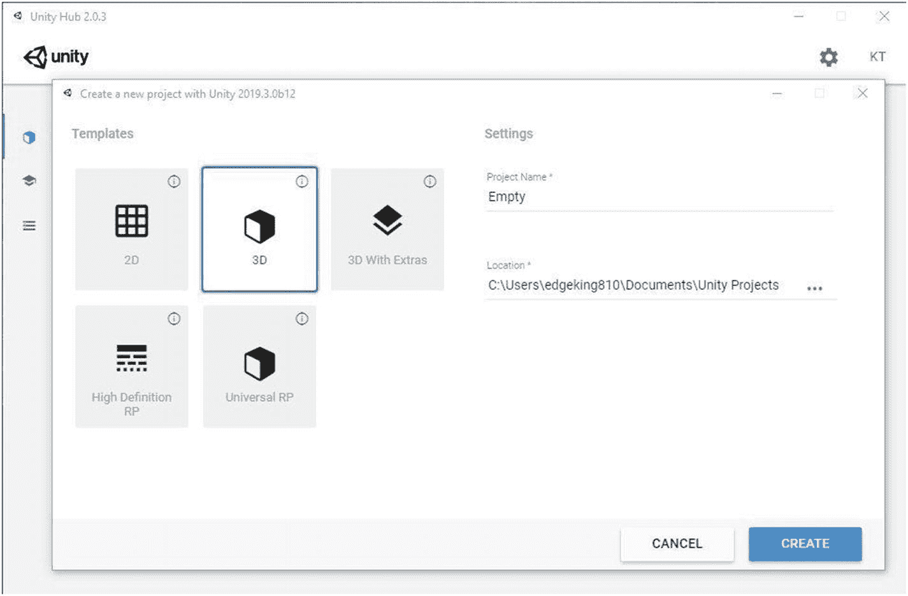
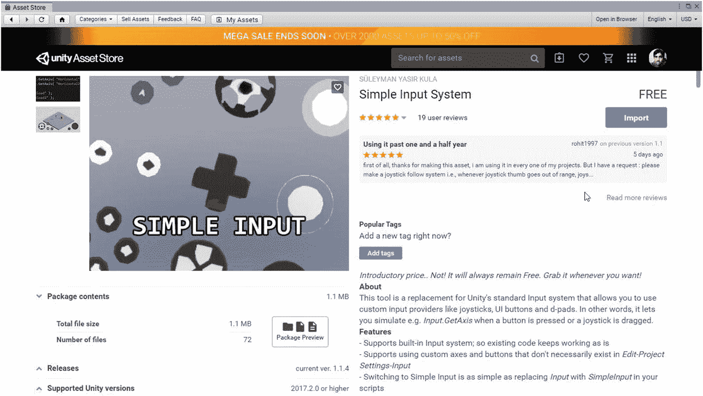

# 二、Unity 简介

正如你已经知道的，我们将使用 Unity 游戏引擎来开发游戏。Unity 已经用 C++编程语言编写，但是它的脚本应用编程接口(API 我们实际用来编码游戏的东西)是用 C#写的。Unity 不仅仅可以用来做游戏。它甚至可以用于为电影、建筑或汽车制造创建可视化效果。

使用 Unity 而不是从头开始编写游戏的好处是，Unity 已经提供了许多现成的工具来帮助我们制作游戏，例如物理或照明。与其他游戏引擎相比，Unity 更受欢迎，这使得解决 bug 或学习如何做一些事情更容易，因为很可能一些东西已经出现在互联网上。我们希望在 Unity 中开发的任何游戏都是一个项目。

## 2.1 创建 Unity 帐户

为了使用 Unity，您必须在 [`https://id.unity.com`](https://id.unity.com) 设置一个帐户。同样，你可以使用你的谷歌或脸书账户创建一个账户(图 [2-1](#Fig1) )。

图 2-1

创建 Unity 帐户

## 2.2 下载 Unity 和附加软件

Unity 有四个许可证:个人版、高级版、专业版和企业版。个人拥有其他营业执照提供的大部分功能，并且是免费的(图 [2-2](#Fig2) )。想要更多功能而不是个人优惠的个人可以购买 Plus。如果从你的游戏开发公司或组织获得的收入超过特定的阈值，必须购买专业或企业许可证。使用个人许可证的最大好处是能够定制游戏的闪屏(当游戏开始时)，使用深色编辑器 UI，更好的支持，优质资源的可用性(尽管不是绝对必需的)，以及更多的诊断/分析。更多信息请访问 [`https://store.unity.com/`](https://store.unity.com/) 。

图 2-2

统一计划

### 2.2.1 统一集线器

Unity Hub 是一个应用，可用于下载多个版本的 Unity，以及它们各自的模块(如果需要的话)，并且包含您正在处理或已经创建的项目(云或本地)的列表(图 [2-3](#Fig3) )。

图 2-3

Unity Hub 项目

对于 MacOS 或 Windows 用户，可以从 [`https://unity3d.com/get-unity/download/`](https://unity3d.com/get-unity/download/) 下载 Unity Hub，对于 Linux 用户，可以从 [`https://forum.unity.com/threads/unity-hub-v2-0-0-release.677485/`](https://forum.unity.com/threads/unity-hub-v2-0-0-release.677485/) 的论坛获取一个可执行文件。下载完成后安装或运行即可。

接下来，你必须下载一个版本的 Unity 编辑器(实际的游戏引擎)。对于本书中的示例，您必须使用任何 2019.3.x 版本。首先使用您之前创建帐户时使用的凭据登录 Unity Hub。然后，点击您的个人资料图片或姓名首字母(右上角)。转到管理许可证并激活新的 Unity 个人许可证。最后，转到 Installs，点击 Add，选择 Unity 的 2019.3.x 版本，并选择您希望安装的模块。因为我们将开发一款手机游戏，所以至少要选择 Android 和/或 iOS 构建支持模块。注意，如果你没有苹果电脑，你将无法制作 iOS 游戏。对于 Android 构建支持，也可以查看 Android SDK & NDK 工具和 OpenJDK(图 [2-4](#Fig4) )。文档和其他东西都是可选的。

图 2-4

从中心下载 Unity 编辑器

您还需要一个集成开发环境(IDE)来编写脚本。Visual Studio 代码是一个轻量级的优秀选择。可以从 [`https://code.visualstudio.com/`](https://code.visualstudio.com/) 下载。我们稍后会将它链接到 Unity 编辑器。目前，只需安装它。

### 2.2.2 创建空项目

在 Unity Hub 中，点按蓝色的“新建”按钮，给您要创建的项目命名，然后选取一个存储位置。选择 3D 作为模板。点击创建，稍等片刻，项目应该打开(图 [2-5](#Fig5) )。

图 2-5

创建新项目

首先，去编辑➤首选项➤外部工具，并确保您使用内置的 JDK，SDK 和 NDK。应勾选相应的复选框。您还必须在外部脚本编辑器选项卡中指定 vscode 选项，以便在适当的 IDE 中编写和修改脚本。该选项位于外部工具标题的正下方(图 [2-6](#Fig6) )。

图 2-6

检查首选项

## 2.3 基本窗口

Unity 提供了几个具有特殊功能的窗口来帮助开发者开发游戏。你已经知道项目在 Unity 中意味着什么。游戏项目包含场景。例如，把场景想象成游戏的关卡。例如，当很多东西目前不需要的时候，加载所有的东西是一个坏主意。在场景中，你可以设计你的关卡并使它们可玩。

现在，场景中出现的所有东西都被称为游戏对象(在本书的第 3 章会有更多的介绍)。当你制作游戏时，你可能会需要图像、声音、3D 模型等。您在项目中导入的所有内容都是一种资源，无论您是否在场景中使用过它。

我将浏览 Unity 中一些最常用的窗口。您的空项目看起来应该是这样的(图 [2-7](#Fig7) ):

图 2-7

空旷的场景

您可以通过点击 Unity 编辑器右上角的小布局按钮来更改这些窗口的布局(图 [2-8](#Fig8) )。您也可以通过拖动它们的边缘来调整它们的大小。

图 2-8

布局

### 2.3.1 项目窗口

如果您使用的是默认布局，通常可以在编辑器的底部找到它。项目窗口(图 [2-9](#Fig9) )是您已经创建或导入到 Unity 项目中的资源和目录的集合。您也可以使用搜索栏搜索整个项目，按名称或类型查找资源。

图 2-9

项目窗口

### 层次结构窗口

层级窗口(图 [2-10](#Fig10) )基本上包含了当前在编辑器中打开的场景中出现的所有游戏对象的列表。默认情况下，它包含一个摄像头和一个光源，你会在第 [3](03.html) 章中了解更多。它位于编辑器的左上角，在默认布局中。

图 2-10

默认情况下的“层次结构”窗口

尝试从层级窗口中创建一些基本的游戏对象，通过左键单击小加号图标或右键单击窗口中的任意位置，弹出一个菜单供选择。新创建的游戏对象将立即出现在层级窗口中(图 [2-11](#Fig11) )。

图 2-11

创建 3D 游戏对象

### 2.3.3 场景窗口

场景窗口主要用在关卡设计中，必须放置游戏对象来创建游戏区域。可以使用鼠标在场景中导航，并在场景窗口中直接更改场景中的对象。注意红色代表 x 轴，绿色代表 y 轴，蓝色代表 z 轴(图 [2-12](#Fig12) )。

图 2-12

带立方体的场景窗口

可以通过在场景窗口中左键单击对象来选择对象。也可以尝试右键单击并拖动来旋转，或者使用滚轮来放大和缩小。最后，您可以点击并按住滚轮，移动鼠标进行平移。如果在“检查器”窗口中左键单击并选择对象，它们在“场景”窗口中也会显示为选中状态。

有七个工具(图 [2-13](#Fig13) )可以帮助你在场景视图中执行操作。首先是手工具。选中时，当您单击它们时，不会选择任何对象。相反，鼠标左键将用于在场景中平移，就像前面描述的按住滚轮一样。

图 2-13

七个场景工具

第二个场景工具是移动工具(图 [2-14](#Fig14) )。当在场景窗口中选择一个对象时，可以拖动箭头将其向特定轴的方向移动。物体也可以被两个小方块拖动，同时沿两个轴移动。

图 2-14

移动工具

第三个场景工具是旋转工具，其工作方式与移动工具相同，只是它用于旋转游戏对象。通过沿着彩色圆圈拖动，你可以在三个轴中的一个轴上旋转游戏对象，或者沿着灰色圆圈，同时在两个轴上旋转(图 [2-15](#Fig15) )。

图 2-15

旋转工具

第四个工具是缩放工具(图 [2-16](#Fig16) )，它允许我们缩小或放大选定的游戏对象。通过沿着彩色方块拖动，你可以沿着相应的轴放大或缩小游戏对象，通过从游戏对象中心的小方块拖动，你可以同时沿着所有轴均匀地放大或缩小游戏对象。

图 2-16

缩放工具

第五个场景工具是矩形工具，用于移动和缩放 2D 对象。当我们需要移动或缩放图像、按钮和 2D UI 元素时，我们将会用到它。

第六个工具结合了移动、旋转和缩放工具的功能。我们将跳过它做什么，现在使用第七个也是最后一个(多重)工具(图 [2-17](#Fig17) )。

图 2-17

多功能工具

在场景视图中，也可以单击窗口右上角的小圆锥体，使视角垂直于轴。例如，尝试单击红色圆锥体，使视角垂直于 x 轴，本质上，您看到的内容现在将以二维形式出现，以 z 轴和 y 轴为界(图 [2-18](#Fig18) )。

图 2-18

沿 x 轴方向观察

你也可以点击小圆锥下面的文字，在透视或正交视图之间切换，这取决于你正在制作的游戏类型。

场景视图左上角的第一个按钮允许你以另一种形式查看游戏对象。转向线框的一个很好的例子是调整汽车的车轮(图 [2-19](#Fig19) )。

图 2-19

场景窗口中的线框着色

窗口顶部的小 2D 按钮使所有东西都出现在 2D，这对于处理 2D UI 元素或 2D 游戏很有用。其他按钮主要用于打开或关闭诸如灯光、音频或效果之类的东西。

最后，默认情况下还有两个按钮，标记为“中心”和“全局”。单击前者时，将显示“中心”或“轴心”。当使用移动或旋转等变换工具时，箭头将被放置在所选游戏对象的中心或枢轴点。现在在编辑器中尝试一下，以便更好地使用它们。尝试移动、旋转和缩放 3D 对象，并练习到目前为止所学的一切。

例如，如果场景中有两个立方体并且都被选中，如果第一个按钮被设置为中心，当前工具将被放置在与两个立方体等距的位置(图 [2-20](#Fig20) )。

图 2-20

两个游戏对象的中心点

如果使用 Pivot，该工具将被放置在两个立方体之一的中心，因此称为轴心点。在这种情况下，轴心点将由首先选择两个立方体中的哪一个来确定。如果首先选择左边的，则其中心将是支点(图 [2-21](#Fig21) )。

图 2-21

两个游戏对象的枢轴点

现在转到全局和局部模式。基本上，当第一个按钮的模式设置为全局时，所有工具相对于世界的定位都是相同的。红色箭头会一直指向右边(x 轴)；绿色箭头会一直指向上(y 轴)；蓝色箭头总是指向前方(z 轴)。这些将不取决于所选游戏对象的位置、旋转或比例。

然而，对于本地模式，该工具将始终取决于所选游戏对象的位置、旋转或缩放。在某种程度上，这就像说蓝色箭头“是游戏对象的 z 轴”，这意味着蓝色箭头将指向游戏对象的向前移动，而不是法线，它跨越了 Global 定义的世界空间。在下面的例子中，立方体被轻微旋转，因此它的“向前”指向上方一点(图 [2-22](#Fig22) )。

图 2-22

选择游戏对象的本地模式

在全局/局部按钮旁边还有一个小磁铁图标。这可用于打开/关闭网格捕捉。当刀具定位设置为全局时，可使用此选项。网格捕捉允许您在所有轴上以 1 为单位移动对象，从而将游戏对象的位置捕捉到场景中最接近的整数位置。

### 游戏视图

如果使用默认布局，可以在场景窗口旁边找到它。它主要用于在导出之前测试游戏项目，因为它向第三方用户展示了实际导出游戏的表示(图 [2-23](#Fig23) )。

图 2-23

游戏视图

图 [2-23](#Fig23) 显示了如果有人现在尝试玩你的空游戏会是什么样子。显示 1 允许您在不同的显示之间切换，以查看特定地点的外观。

自由外观选项卡允许您设置分辨率/比率，这样您就可以更容易地看到游戏如何在具有特定分辨率/比率的显示器上呈现。自由视角占据了游戏窗口的整个尺寸。您也可以创建新的分辨率或比率(图 [2-24](#Fig24) )。

图 2-24

在游戏视图中设置新的分辨率/比率

使用缩放滑块，您可以放大或缩小游戏窗口，尽管如果您没有实现类似的东西，这在实际游戏中是不可用的。播放时最大化可以设置为开或关。如果被激活，它会显得更白，这样你就可以全屏测试你的游戏了。请注意，在这一点上，如果您打开或关闭它，什么都不会发生。

统计数据允许你预览一些关于游戏的信息，比如 CPU 使用率或者当前顶点的数量(图 [2-25](#Fig25) )。

图 2-25

在游戏视图中显示统计数据

Gizmos 允许你预览更多显示给最终用户的东西，比如碰撞器这样的组件，你将在接下来的章节中了解更多。最后，进入游戏模式。

当你想测试你的游戏而不导出它的版本时，你可以在编辑器中完成。游戏窗口的顶部有三个图标。第一个(最左边的)是播放按钮。当你点击那个按钮时，编辑器变暗，按钮变成蓝色，你就进入了所谓的播放模式。在游戏模式下，你可以像普通用户一样玩游戏，如果他们有那个游戏的版本的话。要退出播放模式，只需再次单击播放按钮。

在游戏模式下(图 [2-26](#Fig26) ，可以点击旁边的按钮——暂停按钮，暂时暂停游戏。再次点击暂停按钮将恢复暂停。最后一个(最右边的)按钮是步进按钮，每当你点击它，它会自动播放一帧并暂停游戏，如果它还没有暂停的话。你仍然可以点击暂停按钮继续游戏。如果我们想知道每一帧发生了什么导致了一个 bug，那么 Step 按钮是很有用的。

图 2-26

进入播放模式

请注意，您在播放模式下所做的任何更改都是暂时的。也就是说，例如，如果您在播放模式中移动对象，当您返回正常编辑模式时，更改将恢复到进入播放模式之前的状态。

### 2.3.5 检查员窗口

如果您使用的是默认布局，检查器就是屏幕右侧的大垂直三角形。它包含了许多关于所选游戏对象的信息，基于附加到这个(这些)游戏对象的组件。默认情况下，所有游戏对象都有一个变换组件(图 [2-27](#Fig27) 和 [2-28](#Fig28) )。大多数组件的字段或属性的值都可以在此窗口中调整。

图 2-28

多维数据集的典型默认检查器窗口:第 2 部分

图 2-27

多维数据集的典型默认检查器窗口:第 1 部分

我们作为例子的立方体，或者我们创建的一个新的立方体，默认情况下应该有这些组件。标签和层的用途将在最后几章中解释，你看到的组件的使用将在第 [3](03.html) 章中记录。当静态旁边的复选框被选中时，无论我们做什么，我们的游戏对象都不会在运行时移动或物理改变。这有性能增益。建议您尝试更改一些组件的属性，看看会有什么不同。

### 2.3.6 统一资产商店

如果您还记得在您学习项目窗口的章节中提到的资产定义，有几种方法可以将资产导入 Unity。其中最常见的是通过打开`.unitypackage`文件。Unity 包，或以扩展名`.unitypackage`结尾的文件，是一个包含多个资产的压缩文件。

对于本节，我们将主要关注从资产商店下载和导入资产，而不是从第三方非官方来源。资产商店是一种市场，你可以浏览和下载游戏的资产。把它想象成 Unity 的 Google Play for Assets。

要访问资产存储，您必须转到窗口并单击资产存储选项卡。或者直接按 Ctrl+9。您可以调整“资产存储”窗口的大小或将其放置在某个位置。它应该看起来有点像全屏显示的图 [2-29](#Fig29) 。

图 2-29

资产商店

您可以使用搜索栏搜索资产，并使用价格和类别等过滤器。出于本教程的考虑，我们将下载并导入一个名为 Simple Input 的包，它碰巧是免费的。使用定价过滤器仅针对免费资产(图 [2-30](#Fig30) )。

图 2-30

搜索资产

然后单击弹出的第一个结果(它应该看起来像前面截图中的第一个结果)。在资产页面上，您可以阅读描述、预览将导入的文件，以及查看屏幕截图或评论。准备好了就点击下载。当它完成下载时，你现在应该在那个按钮上看到 Import 而不是 Download(图 [2-31](#Fig31) )。点击它。

图 2-31

简单输入系统资产

Unity 现在将解压软件包。最后，点击导入。一旦所有内容都被导入，资产将出现在您的项目窗口中(图 [2-32](#Fig32) )。

图 2-32

导入资产——我们项目中的简单输入系统

### 控制台窗口

控制台是一个只读窗口，可以显示日志、警告或错误(图 [2-33](#Fig33) )。在测试游戏项目的代码时，您通常会将值输出到控制台，以确保一切按预期运行。这叫做调试。Unity 也可能警告你一些事情，这些事情可能不会马上真正影响你的项目，但从长远来看会引起问题。至于错误，你必须修正它们；否则，您将无法运行或构建您的游戏。

图 2-33

控制台中记录、警告和错误消息的示例

当您单击控制台窗口中的日志/警告/错误时，更多详细信息将出现在屏幕底部，主要指示与相关消息相关的语句和行号。如果您在控制台中双击一条消息，负责的脚本将在 Unity 已分配使用的默认文本/代码编辑器中打开。

清除按钮将删除控制台窗口中的所有消息，除了那些必须完全修复才能继续开发游戏项目的消息(图 [2-34](#Fig34) )。只要启用了“播放时清除”,每次进入播放模式时，它都会自动执行“清除”按钮的操作。类似地，每次 Unity 成功构建游戏的可执行文件时，Clear on Build 就会运行。

图 2-34

控制台窗口中按类型和流派显示的消息数量

Collapse 选项卡将把相同的控制台消息编辑在一条消息中。实例的数量将显示在控制台窗口最右侧的小圆圈中。错误暂停将在收到错误时暂停游戏模式，最后一个下拉按钮编辑器允许您选择调试消息的来源，例如，可能来自连接到您计算机的设备。

搜索栏允许您搜索特定的消息，最后三个彩色小按钮允许您选择想要的调试消息类型。例如，单击黄色按钮将停止控制台窗口中弹出的所有警告消息。但是，自您上次点击清除后收到的每种类型的日志消息的数量仍将继续显示在它们各自的按钮旁边。

### 构建设置

这可以从文件➤构建设置中访问。在构建设置窗口中，您可以切换到您想要导出游戏的平台，并调整更多选项，这些选项将在以后的章节中更全面地介绍(图 [2-35](#Fig35) )。您当前所在的平台将在其标签前显示一个小的 Unity 徽标。对于未来的项目，切换到 Android 平台。您将很快看到如何配置和构建。在“构件设置”窗口中拖放您想要的场景。第一个是玩家打开游戏时看到的。最后，保存您的场景和项目是一个很好的做法。从“文件”选项卡执行此操作。

图 2-35

“构件设置”窗口