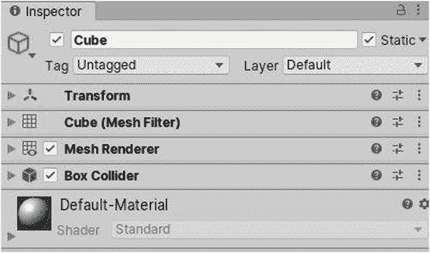

# 3.游戏对象、预设、材料和组件

如第 [2](02.html) 章所述，用 Unity 搭建的游戏通常都是场景布置。这些场景通常包含许多对象来增强它们，并使游戏具有交互性和趣味性。目标是有一个具体的游戏，有坚实的机制，良好的游戏性，和良好的图形。

## 3.1 游戏对象和预设

在 Unity 中，场景中的物体被称为“游戏物体”创建新场景时，它包含主摄影机和平行光。这些是游戏对象。你在层级窗口中找到的每个对象都是一个游戏对象。如果你创建一个立方体，它也是一个游戏对象。

现在，如果你有多个场景，并且在所有的场景中使用一个公共的游戏对象，如果你可以在所有的场景中拖放那个对象，而不是为每个场景从头开始配置，那就太好了，对吗？这就是预制构件的用武之地。基本上可以保存一个游戏对象的版本，拖放到其他场景中(图 [3-1](#Fig1) )。你只需要在项目窗口中拖放一个游戏对象，它就会变成一个预置。

图 3-1

制作预制品

你刚刚变成预设的游戏对象现在在层级标签中会有一点蓝色。至于你的预设，你可以加载另一个场景，并将其拖入新打开场景的层次或场景标签中。

你也可以直接改变一个预置。你只需要在项目窗口中双击它。场景窗口现在将有一个蓝色的背景，你现在将能够看到该预设的子对象(如果它有任何子对象的话),并对其属性以及子对象的属性进行更改。

在做了想要的改变之后，你可以通过点击层级窗口左上角预设名称旁边的小箭头或者使用快捷键比如 Ctrl 来保存它们；前一个动作会自动保存对预设所做的更改，并返回到之前打开的场景。然后，该预设的所有实例将在发现它们的所有场景中用这些变化进行更新(图 [3-2](#Fig2) )。

图 3-2

打开预设

如果你对你在场景中变成预设的游戏对象进行了更改，在检查器窗口中有一个覆盖按钮，你可以点击它使你所做的更改应用到预设，从而应用到该预设在其他场景中的每个实例(图 [3-3](#Fig3) )。你也可以将属性还原为预设版本的属性。这不是一个必要的步骤，你也可以在一个场景中有一个游戏对象，它来自一个预置，但是没有完全相同的属性。

图 3-3

覆盖预设属性

如果你制作了一个预置，把它放在一个场景中，并且不希望它被将来对预置的修改所更新或覆盖，你可以通过在检查器中右键点击它，或者点击“解包预置”或者“完全解包预置”来使预置实例成为一个独立的游戏对象。例如，如果你在一个场景中放置了一个预置，并且它的属性与原始预置中的属性完全不同，你可能希望那个版本是完全独立的。

你可以制作预置的预置，例如，通过创建一个游戏对象，它有多个预置作为孩子，并且它自己变成一个预置。前一个选项将只移除第一层嵌套预设，而后一个选项将移除所有嵌套预设。还需要注意的是，删除一个预设并不会删除场景中该预设的实例。这些预设实例将成为独立的游戏对象，并在层级中沿着它们的名称带有红色(图 [3-4](#Fig4) )。嵌套预设在游戏中非常有用，在游戏中所有的敌人都以相似的方式行动，并且共享相同的基础特征。

图 3-4

删除预设

## 3.2 组件

每个游戏对象都有组件。组件基本上是一个可以附加到游戏对象上的模块。除了空游戏对象已经提供的属性和特性之外，组件还提供了几个新的属性和特性。有些组件需要游戏对象上的其他组件才能正常工作，而有些组件是强制性的，即使你想创建一个空的 3D 对象。当您选择游戏对象时，您将在检查器窗口中看到所有附加到它们的通用组件，也可以通过单击它们的名称来收缩或扩展(图 [3-5](#Fig5) )。

图 3-5

多个组件

在检查器窗口中，您可以更改组件的值。您还可以单击组件右上角的三个点，以调出更多选项，例如 Reset，它将为组件分配默认值，就像您刚刚添加它一样。

也可以通过单击“复制组件”将组件值同时复制并粘贴到两个组件中。在选择了包含您想要覆盖其值的组件的游戏对象后，单击粘贴组件值。你也可以复制组件并直接粘贴到另一个游戏对象上。

还应该注意到，一个游戏对象可以有一个以上的特定组件的实例，尽管也有一些例外。你也可以通过上下拖动或者使用三个点并点击上移或下移来重新排列游戏对象上的组件。

在三点图标旁边，还有一个按钮。单击它允许您使用相应组件的预设。

要获取组件的手册或文档，只需单击左侧预设按钮旁边的问号图标。将打开一个浏览器选项卡，显示合适的相关信息(图 [3-6](#Fig6) )。

图 3-6

查看文档

最后，你可以通过点击添加组件按钮并浏览或搜索你想要添加的组件，或者通过使用编辑器菜单(图 [3-7](#Fig7) )来给游戏对象添加新的组件。

图 3-7

添加组件

### 3.2.1 转换

如果你按照第 2 章[中的](02.html)学习，你已经从场景窗口中与变换组件进行了交互，并且可能对它有一个坚实的概念。每个游戏对象都需要转换组件。与整数或浮点数据类型不同，转换组件由三组`Vector3`值组成。您可以将`Vector3`视为由三个值组成的浮点数组。从第一个索引开始，或者从左边开始，这三个值分别由“x”、“y”和“z”字符表示。变换组件的三组`Vector3`值是所选游戏对象的位置、旋转和缩放(图 [3-8](#Fig8) )。

图 3-8

变换组件

x 轴用红色表示，水平方向从左(-)到右(+)。y 轴用绿色表示，垂直方向从下(-)到上(+)，z 轴用蓝色表示，从后(-)到前(+)。所有的轴都互相垂直。

位置`Vector3`用`X`、`Y`和`Z`值表示游戏对象在世界中的位置。您可以更改这些值，方法是将它们直接输入到特定轴名称旁边的文本框中，或者在“检查器”标签本身中将光标从轴名称向右(+)或向左(-)。

旋转`Vector3`以`x`、`y`和`z`值表示游戏对象在世界中的旋转，比例`Vector3`以`x`、`y`和`z`值表示游戏对象在世界中的位置。

但是，如果选定的游戏对象是另一个游戏对象的子对象，那么它的位置、旋转和缩放都是相对于其父对象的。例如，下面是两个不同立方体的变换组件(图 [3-9](#Fig9) 和 [3-10](#Fig10) ):

图 3-10

立方 2 的变换组件

图 3-9

立方 1 的变换组件

现在，如果我们必须使立方体 2 成为立方体 1 的子对象，通过在层次窗口中将它的游戏对象拖动到后者的游戏对象上，下面是它的变换看起来的样子(图 [3-11](#Fig11) ):

图 3-11

Cube2 的转换组件(如果它是 Cube1 的子元素)

因为它与立方体 1 处于相同的位置，相对于其父体，立方体 2 的`Vector3`位置在所有轴上都将为 0。因为它的旋转在任何地方都是 0，为了保持这一点，立方体 2 必须在其相对的 y 轴上减去 90 度，以保持该值为 0，因为立方体 1 在其自身的 y 轴上旋转了 90 度。至于比例，这是不言自明的:立方 2 比立方 1 大两倍。

### 相机

在电子游戏中，相机相当于我们的眼睛。你在游戏中感知到的一切都被一个叫做摄像头的组件“看到”。通常，在一个特定的时间，你在一个单人游戏中只能启用一个主摄像头，以向玩家展示他们所能看到的。如果你在玩第三人称游戏，摄像机将会在你所控制的主要角色的后面，因此，会产生另一个实体正在监视和跟踪后者的印象。在第一人称游戏中，相机充当你所控制的角色的眼睛。

在一个空场景中，通常应该有一个相机组件已经连接到一个游戏对象(主相机)，如果你没有对它做任何修改的话(图 [3-12](#Fig12) )。

图 3-12

相机组件

清除标志选项允许您从预定义的列表中选择应该显示在摄像机空白区域的内容。

*   默认情况下，它被设置为天空盒，正如您稍后将了解到的，它由总共六幅图像组成，这些图像通常相互补充，形成一种围绕场景的立方体。

*   此外，您可以选择纯色选项，并在下面的背景属性中选择一种颜色。

*   如果选择“仅深度”,空白区域中不会显示任何内容，如果没有被任何内容覆盖,“不清除”将持续显示上一帧中存在的内容。

剔除遮罩是一种机制，它基于已分配给组(称为层)的图形元素来控制渲染到该相机的内容。

接下来，您可以选择是让相机使用透视视图还是正交视图。如果您选择正交(默认情况下，这是透视)，相机看到的一切都将在某种程度上 2D 视图。

*   使用正交相机，您可以调整相机的大小，即它在特定时刻或帧可以“看到”的区域。

*   使用透视相机，您可以选择它的视野，从字面上看，这是调整它从中心“看到”的“角度”的过程。

您还可以调整视野是沿着水平(x)轴(从上到下)还是沿着垂直(y)轴(从左到右)。

尽管如此，对于透视视图，您可以通过勾选物理摄像机来选择使摄像机更具可配置性(图 [3-13](#Fig13) )。这将允许您调整更多的设置，如相机的焦距和传感器大小。顺便说一句，要改变相机的位置和旋转/方向，你必须修改游戏对象的转换组件中相应的值，该组件连接了相机组件。

图 3-13

透视照相机

现在是裁剪平面。Unity 的 1 个单位相当于现实世界中的 1 米。对于相机,“剪裁平面”设置有一个近值和一个远值。这两个值代表游戏对象到摄像机的最小和最大距离，以便后者渲染它。如果相机比游戏对象的近距离更近，比方说，相机位于游戏对象的正中心，并且近距离值大约为 0.5，它不会被渲染。如果现在另一个游戏对象离相机很远，距离大于“远”值，它也不会被渲染。

至于 Viewport Rect 设置，由两组`Vector2`值组成。因为屏幕上显示的一切都是 2D 形式，所以没有第三个值来代表 z 轴。

*   `X`和`Y`值允许您分别水平和垂直调整相机渲染的位置。

*   `W`和`H`值分别代表用于水平和垂直渲染摄像机的屏幕部分。值 1 表示使用屏幕的整个宽度或高度，值 0 表示不使用。

例如，如果您正在为两个玩家制作一个具有分屏功能的游戏机赛车游戏，您可以有两个摄像机，每个摄像机占据一半的屏幕，跟随两个玩家中的一个。两个相机的`W`值为 0.5，`H`值为 0，`Y`值为 0，但是`X`值不同，以匹配屏幕左半部分和右半部分的位置。

如果在一个场景中使用多个摄影机，可以为它们设定不同的深度值。例如，如果您正在制作一个游戏，其中您可以在第三人称和第一人称视图之间切换，您可以对任何一个视图使用两个相机，但是由于它们都占用 100%的屏幕空间，深度值决定了哪个相机将被渲染给玩家。在该示例中，玩家将看到具有最高深度值的相机正在“看”什么

其余的设置将有一个非常简短的描述，对于简单或小型项目，你可能不会去弄乱那些，如果你这样做，最好是编辑项目本身的设置，而不是相机的个别设置。渲染路径设置允许你选择游戏对象如何被一个相机渲染。

目标纹理允许您将 2D 渲染纹理指定给相机组件。该纹理将随摄像机在场景中看到的任何东西而更新。例如，当你想创建一个鸟瞰图形式的小地图时，这是很有用的。可以设置一个摄像头，从上面跟着玩家往下看(90，0，0)。然后它可以输出到一个 2D 纹理，该纹理可以被分配到一个“矩形”中，该矩形将总是显示在屏幕的右上角。

遮挡剔除是一种流行的技术，可以显著提高某些类型游戏的性能。如果您正在使用该技术，并且特别希望相机从中受益，请勾选相应的复选框。为了遮挡剔除正常工作，你的场景必须为这个特定的特征“烘焙”;否则，勾选复选框不会导致任何变化。

至于高动态范围(HDR)和多采样抗锯齿(MSAA)渲染，它们可以让你的游戏看起来更好，但特别是使用 MSAA，有重要的性能成本。

最后，勾选允许动态分辨率将允许相机缩放渲染纹理，如果你构建游戏的平台支持的话。

### 照明

灯光在电子游戏中非常重要。主灯光的位置和旋转决定了游戏对象可见的部分，相对于它们与光源投射光线方向的角度，从而决定了阴影投射的方向和大小。

默认情况下，Unity 中的一个空场景会有一个被称为平行光的游戏对象，其中有一个灯光组件(图 [3-14](#Fig14) )在一个方向上提供均匀的光线，模拟类似太阳的东西。如果场景中没有光源，世界将会完全黑暗。

图 3-14

轻组分

在“层次”窗口中，可以从四种默认类型的光源中创建，即平行光、点光源、聚光灯和区域光源。平行光可以用来照亮整个场景，基本上就像太阳一样。点光源用于更特殊的场景，例如中世纪村庄中的火把。例如，聚光灯可用于在黑暗的房子里模拟恐怖游戏中的手电筒，区域光可用于均匀照亮指定的区域。

为了保持这一部分的简单，我将只基于定向光源的解释。用其他类型的光源获得的附加设置是不言自明的。

首先，您可以设置光源发出的光的颜色。然后，可以将灯光模式设置为实时、混合或烘焙。

*   如果你使用的是实时光照模式，那么在你玩游戏的时候，游戏物体会被加阴影。

*   使用“烘焙”,可以“烘焙”场景以生成一种将自动指定给该光源的照明数据资源。

*   如果你使用混合，你将有一个烘焙和实时照明的组合。

如果你制作的游戏需要一个移动的光源，或者游戏对象是渐进或随机产生的，最好使用实时，因为照明数据会更准确。但是，如果您想在照明方面节省一些性能，并且如果对象在场景中几乎是静态的，以及光源，您可能会考虑过早烘焙场景并使用烘焙。

如果你使用混合或实时作为照明模式，你可以为将要产生的阴影类型做一些额外的设置。你可以选择从没有阴影到有软阴影或硬阴影。软阴影比硬阴影看起来更平滑，但需要更多的处理能力。然后你可以修改将要产生的阴影的值，比如它们的强度，它们的分辨率(也可以在项目的设置中设置)，以及它们与各自游戏对象的距离偏差(图 [3-15](#Fig15) )。

图 3-15

立方体上正常强度的光

您也可以增加或减少光源的强度和间接乘数。间接光是被一个游戏对象反射到另一个游戏对象上的光。增加这两个值中的任何一个都会使场景看起来更亮。如果光源的强度被提升到其原始值的两倍(图 [3-16](#Fig16) )，上图中的场景看起来会是这样:

图 3-16

立方体上的高强度光

cookie 属性允许您将 2D 纹理分配给光源。纹理将被用作遮罩。你可以把它想象成一个放在光源(灯泡)前的厚纸板形状(可能是恐龙的形状)。这将定义光源投射时获得的阴影、轮廓或图案。您也可以在它下面的选项中编辑 cookie 掩码的大小。

勾选绘制光晕将在光源周围创建一个模糊的球体，其半径等于其范围(如果使用点光源或聚光灯光源，此属性可用)，并且颜色与光源投射的光相同。

“光斑”可用于允许场景中的光源渲染光斑，如果您正在制作电影，这可能会很有用。如果使用某种形式的正向渲染，可以更改渲染模式以反映场景中灯光的重要性。最后，以类似于相机的方式，您可以选择将受光源在其剔除遮罩属性中影响的游戏对象层。没有被选中的层的游戏对象不会受到光源的任何影响。在 Unity 的文档中，您可以找到不同灯光样本的更多细节。

### 渲染器

我现在要讨论的是让 3D 游戏对象可见的两个关键要素。任何缺少这些的游戏对象都将是透明的和不可见的。第一个组件是网格过滤器，它从您的资产中提取一个网格，并将其传递给第二个组件，即用于在屏幕上渲染的网格渲染器(图 [3-17](#Fig17) )。

图 3-17

渲染器组件

在接下来的主题中，你将会学到材料到底是什么，但是现在，假设它们是颜色。

渲染器可以利用多种材质，具体取决于如何设置网格过滤器组件中的网格。如果你想自定义一个游戏对象如何接收或投射阴影，可以调整灯光属性。

在制作游戏时，你可能不需要弄乱渲染器的其他属性，但你可以随时访问 Unity 的文档或手册来了解更多信息。

### 碰撞器

游戏中的物理依赖于刚体和对撞机。碰撞器是一组允许碰撞发生的组件。碰撞器被用作触发器也很常见。例如，在游戏中离非玩家角色(NPC)足够近可能会触发 NPC 和你的角色之间的对话。

在 Unity 中，有六种类型的碰撞器，主要是

*   盒子(图 [3-18](#Fig18)

*   范围

*   胶囊

*   网状物

*   车轮

*   地带

在本书中，我将介绍前四个对撞机。车轮碰撞器用于制作陆地车辆的车轮，以及其他类似的对象，而地形碰撞器用于地形，这是另一种形式的原生 3D 对象，但具有更多可配置的选项。这本书不会涉及地形。

图 3-18

盒子碰撞器组件

默认情况下，在编辑器中创建的立方体带有一个盒子碰撞器(图 [3-19](#Fig19) )。如果你点击编辑碰撞器按钮，你将能够在你的场景视图中缩放碰撞器。你只需要向你想要缩放碰撞器的方向拖动出现的小方块。

图 3-19

修改场景中长方体碰撞器的边界

在检查器窗口中，改变`Vector3`的`x`、`y`或`z`值，即所谓的“中心”，将使碰撞器向各自的方向移动。改变大小值会使碰撞器变大或变小，这取决于你在哪个轴上修改它的值。应该注意的是，增加或减少游戏对象的缩放变换将使其碰撞器的大小以相似的比例减少。例如，如果您创建一个立方体，并使其所有的比例`Vector3`值等于 2，即使其碰撞器的大小在所有轴上都是 1，假设您没有手动修改任何东西，碰撞器仍然会环绕立方体的整个体积或大小。

上面的物理材质标签可以用来让碰撞器模拟一种特殊的真实材质。例如，一些物理材料可以使对撞机在你走在上面时感觉更滑，例如冰，而其他材料可以使它感觉像似乎有更多摩擦的东西，例如沥青。

如果我们想在两个物理对象碰撞时触发一个事件，但不让它们相互弹开，就使用触发碰撞器。所以，如果你想在地板上移动时打开灯，这些会有帮助。如果你在碰撞器组件上勾选了 IsTrigger，与之相关的游戏对象将会看起来缺乏参与碰撞的能力。换句话说，你将能够穿越游戏对象，即使当它的 IsTrigger 框被选中时，它有一个碰撞器组件。这在您想要创建触发区域时非常有用，例如，在游戏中，在一个区域中行走会触发某些事情的发生，如播放过场动画。

球体对撞机(图 [3-20](#Fig20) )的性质与箱式对撞机非常相似。唯一的区别是它们有一个半径属性，而不是一个`Vector3`大小的属性。您可以在场景窗口中使用该属性的第一个按钮来修改碰撞器，但是拖动一个点将沿所有轴均匀地增加半径。

图 3-20

球体碰撞器组件

胶囊由两个半球组成，一个在胶囊的顶部，一个在底部。这两个半球之间有一段距离，称为高度。胶囊碰撞器同样具有这些属性(图 [3-21](#Fig21) )。

图 3-21

胶囊碰撞器组件

最后说一下网格碰撞器(图 [3-22](#Fig22) )。例如，如果你有一个不规则形状的游戏对象，你可以给它添加一个网格碰撞器组件。默认情况下，网格碰撞器会将碰撞添加到游戏对象的整个表面。

图 3-22

网格碰撞器组件

要制作网格碰撞器，请使用 IsTrigger。必须先标记为“凸”。滴答滴答将使碰撞器使用相当数量的 3D 规则形状来覆盖游戏对象的整个表面区域和体积。使用 Convex 还允许使用网格碰撞器在其他游戏对象之间进行碰撞。然而，建议您尽可能使用之前讨论的其他碰撞器，而不是这些，因为它们提供了性能提升，即使网格碰撞器被标记为凸面。

### 3.2.6 刚体

刚体组件(图 [3-23](#Fig23) )通常与碰撞器组件一起使用，它是一个神奇的组件，可以将游戏对象变成反映现实世界中对象属性的对象。它可以使物理引擎允许对象从其他对象反弹，并模拟重力之类的东西。如果你正在制作一个与物理有关的游戏，你很可能不得不使用刚体。

图 3-23

刚体组件

Mass 属性允许您设置对象的质量。一个单位相当于 1 公斤。更大的值会让游戏对象感觉更重。如果使用重力，增加质量会使游戏对象对外力(例如爆炸)的反应更弱，下落更快。

阻力相当于空气阻力，当游戏物体从高处落下时，可以看到这个数值的差异。角阻力几乎是相同的，但它可以由多少空气阻力将影响游戏对象的旋转扭矩来定义。这些值中的任何一个值为 0 都可以解释为“这个游戏对象不受空气阻力的影响。”

不勾选“使用重力”将会阻止游戏对象自动下落，如果它被放置在离地面一定高度的地方，下面没有任何东西支撑它。

如果运动学被勾选，游戏对象将不会受到普通物理的影响。为了使游戏对象移动或影响其位置或旋转，您必须操纵其各自的变换值。这对制作移动平台很有用。

例如，如果游戏中玩家角色的运动不稳定，插值可以用来使游戏对象感觉更平滑。将“插值”设定为“插值”将基于前一帧的变换平滑变换，而在“外推”中，将基于估计的下一个运动平滑变换。当我们开始编码时，你会学到更多关于插值的知识。

碰撞检测系统可以从离散模式改变为连续模式，如果游戏对象移动得如此之快，以至于它能够通过其他碰撞器，因为碰撞检测系统检测它的速度不够快。使用离散模式以外的模式会有性能成本。

最后，你可以为游戏对象设置约束。勾选任一复选框都不允许游戏对象在各自的轴上移动或旋转。这并不意味着它不会通过代码或脚本。这只是意味着应用于刚体的普通物理(例如，碰撞)不会对其产生任何影响。

### 3.2.7 音频源和听众

音频监听器组件通常在主相机游戏对象上。它实现了一个类似麦克风的设备。它会记录周围的声音，并通过播放器的扬声器播放出来。一个场景中只能有一个侦听器。例如，如果在场景中的某一点，您有一辆汽车发动机正在运行并产生声音，当摄像机靠近它时，声音会以更高的音量播放。

相反，音频源组件定义了播放什么声音以及如何播放。声音来源的位置将由音源组件所连接的游戏对象的位置决定(图 [3-24](#Fig24) )。

图 3-24

音频源组件

音频源组件的第一个属性是 AudioClip。这通常是在 Unity 中作为资源导入的音频文件。混音器组是另一个组件或资源，您可以使用它来进一步个性化将要产生的声音质量。

勾选静音会禁止音频收听者拾取其音频源产生的音频。稍后，您可以勾选旁路，以防止音频源产生的声音受到其他效果的影响，无论是听众效果还是其他类型组件产生的效果，混响区域都会相应地应用到它。

“唤醒时播放”将使音频源在场景加载后立即播放指定的音频剪辑，而“循环”将使音频源从头开始重放音频剪辑，每次它都自动完成播放。

如果场景中有多个音频源，可以使用优先级滑块为每个音频源设定不同的优先级。例如，如果音频收听者与两个音频源的距离相等，则两个音频源中具有最低优先级滑块的那个音频源的声音会比另一个音频源的声音大。

音量滑块的作用非常明显。音量为 1 的音频源将以扬声器设定的最大输出音量播放分配给它的音频片段。请注意，音量为 0 的音频源产生的声音是听不到的。

音高滑块用于设定音频源产生的声音的频率。它也可以用来加快或减慢声音。

立体声声相滑块设定发送到混响区的输出信号量。该数量在(0–1)范围内是线性的，但允许在(1–1.1)范围内放大 10 dB，这对于实现近场和远场声音的效果很有用。

空间混合、混响区域混合和 3D 声音设置超出了本书的范围。

### 粒子系统

粒子系统是一个看起来在特定位置和旋转发射某种粒子或形状的组件(图 [3-25](#Fig25) )。例如，使用粒子系统可以帮助你模拟火，雪，或者只是汽车尾气中的烟雾。

图 3-25

场景中的粒子系统

在你的场景窗口中，默认情况下，一个粒子系统看起来就像前面的截图。这三个按钮将分别从左边，暂停，重启，或停止粒子系统。停止和暂停的区别在于，停止会重新启动系统，但会立即暂停。

*   可以更改播放速度，以查看以指定速度以外的速度运行的粒子系统。

*   播放时间包含一个值，表示自粒子系统开始运行以来经过的秒数。

*   粒子是该粒子系统当前活动的已生成粒子数，速度范围是这些粒子速度的最小-最大值。

*   模拟层允许你在层上模拟粒子系统，而不是在游戏对象的层上。

*   勾选重新模拟将使应用到粒子系统的更改立即显示。

*   “显示边界”将使 3D 体积出现在场景窗口中，这将指示粒子在该系统中可以行进的最大距离。

*   最后，如果勾选了最后一个复选框，只显示选中的，将隐藏当前效果中所有未选中的粒子系统。

持续时间(见图 [3-26](#Fig26) )定义了粒子系统发射的时间。这意味着，在该秒数过去后，将不再创建更多的粒子或形状。当然，如果勾选了循环，这个值就没有任何重要性了，因为系统会一直发出信号。

图 3-26

粒子系统组件中的第一个设置

开始延迟是系统开始发射前等待的时间。“开始寿命”定义粒子发射后多少秒后将被自动销毁。开始速度是粒子发射时最初行进的速度。

起始尺寸或 3D 起始尺寸可用于定义粒子的尺寸。开始旋转或 3D 开始旋转定义其旋转。翻转旋转可用于翻转粒子的旋转。“开始颜色”在创建粒子时更改粒子的颜色。

重力修改器可以创建受重力影响的粒子。高于 0 的值将使粒子下落得更快。低于 0 的值将根据前面的陈述起作用，但是粒子将向上而不是向下，0 将使粒子完全不受重力影响。

模拟空间可以设置为本地、世界或自定义。

*   如果设置为局部，粒子将相对于它们的粒子系统所附着的游戏对象的变换移动。

*   在世界中，它们相对于世界或场景移动。

*   在“自定义”中，可以指定另一个变换，使系统相对于该变换。

模拟速度是粒子系统播放的乘数。如果使用“未缩放”选项，更改增量时间模式对于暂停时播放效果非常有用。

缩放模式用于相对于整个层次、局部粒子节点调整粒子大小，或者仅将缩放应用于形状。

唤醒时勾选播放将使粒子系统自动开始运行。

发射器速度允许你改变模式为变形或刚体，这取决于系统移动时如何计算速度。

最大粒子数定义了某一特定时刻系统中粒子的最大数量。如果达到该数量，将不会发射更多的粒子，直到粒子数量少于定义的数量。

勾选“自动随机种子”会使每次播放效果时的模拟不同。

在“停止动作”中，您可以定义在粒子系统停止且所有粒子都已被销毁的情况下要做的事情。例如，您可以选择禁用粒子系统组件或销毁以后者为组件的游戏对象。

剔除模式定义了当系统不在屏幕上时会发生什么，即当粒子在屏幕上不可见时。

*   追赶模式会暂停屏幕外模拟，但当它们变得可见时，会执行一个大的模拟步骤，给人一种从未暂停的感觉。

*   自动对循环系统使用暂停模式，否则始终模拟。

*   AlwaysSimulate 永远不会暂停模拟，即使在屏幕外。

当“环形缓冲区模式”设定为“启用”时，粒子将保持活动状态，直到“最大粒子缓冲区”填满，此时新粒子将替换最旧的粒子，而不是在粒子寿命结束时死亡。

我将详细讨论发射(图 [3-27](#Fig27) )和形状，但对于其余的大多数属性，我将只陈述它们的用途。粒子系统不必利用检查器中所有可用的属性。

图 3-27

粒子系统组件的发射属性

“随时间变化的速率”属性中的值表示每秒发射的粒子数量。速率随距离的变化与速率随时间的变化是一样的，但作用于单位秒。

“爆发”阵列允许您在特定的时间帧发射粒子。其时间属性允许您选择何时发射粒子爆发，计数指定要发射的粒子数量。此外，通过在下拉列表中选择值以外的其他设置，可以设置曲线或创建要发射的粒子数范围。

周期值允许指定重复脉冲的次数。通过在访问其下拉菜单时选择该属性，可以将其设置为无穷大。

Interval 允许您每 x 秒重复一次脉冲，概率是 0 到 1 之间的一个值。如果 Probability 设置为 0，则永远不会发生猝发，如果设置为 1，则总是会发生。值为 0.5 将使突发发生 50%的时间，或者不发生 50%的时间。

您可以通过单击下面的加号图标添加更多组值，或者通过单击减号图标删除组值。

形状代表发射器的 3D 体积(图 [3-28](#Fig28) )。例如，球形会导致粒子向各个方向发射。我们将看到这部分的圆锥形状。其他形状提供的不同选项也很容易理解。

图 3-28

粒子系统组件的形状属性

较高的角度值将使发射的粒子向更多方向运动，增加半径将增加粒子可以覆盖的体积。半径厚度的值可以从 0 到 1。值为 0 将使发射的粒子看起来更密集。

“弧”中的值表示从发射器中心可以产生粒子的最大角度。值为 0 将使粒子仅从发射器的中心发射，而值为 360 允许粒子在发射器底部区域的任何点发射。例如，当我们使用圆锥体时，值为 360 会使粒子在形成发射器底部的小圆上的任意点繁殖。

“模式”允许您选择如何在圆弧周围产生粒子。“随机”模式使它们在相对于原始 Arc 值的任何位置繁殖，而“扩散”允许您选择在特定角度繁殖粒子。值为 0 表示禁用此行为。

“从使用发射”的值可以更改，以指定希望粒子从何处发射，从基础还是从体积本身发射。使用纹理 2D 资源，可以修改粒子采样颜色的位置。

`Vector3`位置允许你从游戏对象的变形位置移动发射器体积。旋转和缩放起着类似的作用。

勾选“对齐到方向”将根据粒子的初始行进方向自动对齐粒子。

随机化方向取 0 到 1 的值。值 1 将用随机方向覆盖粒子的初始行进方向。

类似地，球形化方向用从形状变换中心向外投射粒子的方向来覆盖初始行进方向。

最后,“随机化位置”将起始位置移动一个随机量，直到它包含的最大值。

转到 Shape 属性底部的四个按钮，单击第一个按钮可以打开或关闭形状 gizmo 编辑模式。这与碰撞器的“修改碰撞器”按钮的作用相同，允许您在场景窗口中调整发射器体积的边界或形状。

其他三个按钮分别允许您使用箭头等导向移动、旋转或缩放发射器体积，当您切换它们时，这些导向将出现在场景窗口中。

可以调整“一生中的速度”和“一生中的极限速度”的值，分别使粒子随时间增加或减少速度。

“继承速度”允许您控制粒子从发射器本身继承的速度。

“力随寿命变化”和“颜色随寿命变化”包含可以修改的属性，以分别使粒子获得/失去力并显示颜色随时间的变化。

“颜色按速度”的工作方式类似于“颜色随寿命”的工作方式，但它是根据粒子的速度而不是时间来工作的。大小和旋转随寿命或速度的变化类似。

例如，外力可以被修改以使粒子受到风的影响。“噪波”允许您将湍流添加到粒子的运动中，“碰撞”允许您指定粒子可以碰撞的多个碰撞平面。

触发器允许您根据粒子是在碰撞形状内部还是外部来执行脚本代码。子发射器允许每个粒子在另一个系统中发射粒子。纹理片动画允许您指定纹理片资源，并对每个粒子进行动画/随机化。灯光用于控制附加到粒子上的光源，轨迹用于将轨迹附加到粒子上(在下一节“轨迹渲染器”中会详细介绍)。自定义日期非常复杂，并且允许粒子与脚本或着色器进行交互。

至于渲染器的属性，你可以定义如何渲染粒子，例如，控制它们的颜色，轨迹，渲染模式，排序模式，最小/最大尺寸，相对于相机的对齐，沿轴翻转/旋转，以及它们如何与阴影/灯光交互。

### 轨迹渲染器

轨迹是粒子系统的另一种形式，它画出了游戏对象的位置(图 [3-29](#Fig29) )。把它们想象成尾巴。例如，如果你有一架飞机，你可能希望它的机翼上有轨迹，以模拟在空中飞行的效果。

图 3-29

来自场景中游戏对象上的轨迹渲染器组件的轨迹

轨迹渲染器(图 [3-30](#Fig30) )组件的第一件事是某种宽度(y 轴)对时间(x 轴)的图表。你可以在图上添加更多的点，让轨迹随着时间变大或变小。

图 3-30

轨迹渲染器组件

*   时间轴(x 轴)的值实际上对应于轨迹被设置为渲染的总时间的百分比，由 Time 属性定义(在我们的示例中为 5)。这个时间值 5 可以被解释为踪迹将持续的最大时间。下面是一个例子。如果该值设置为 10，并且汽车持续行驶，将会持续产生多段踪迹，看起来好像踪迹将达到最大长度值 10。轨迹将保持这么长(看起来像一个长矩形)，因为新的片段正在产生，以取代汽车上的前一个片段，最大值为 10，直到汽车刹车。轨迹会变得越来越短，直到长度为 0。这需要 10 秒钟的时间，因为每一个棋子在产生后 10 秒钟就会被销毁，最远的棋子最先消失。

*   宽度轴(y 轴)的值将对应于在特定时间点形成的轨迹的宽度。

最小顶点距离是从上一个顶点开始在轨迹上产生一个新点的最小距离。

当没有踪迹时，勾选自动毁灭会自动毁灭以踪迹渲染器为组件的游戏对象。不点击发射将暂停轨迹生成。

“颜色”允许您为沿着轨迹的颜色设置渐变。拐角顶点是为每个拐角添加的顶点数量。端帽顶点是要添加到轨迹每一端的顶点数。

对齐允许您旋转轨迹以面向其变换组件或相机。如果选择使用 TransformZ 模式，线将沿变换的 XY 平面拉伸。

另一方面，纹理模式可以设置为另一种模式，这取决于您希望如何放置坐标。

如果选中，生成照明数据将为关联的着色器生成数据。

可以应用阴影偏置来防止自阴影伪像。值为 0.5 表示每段轨迹宽度的 50%。

您将在下一节了解材质，但是现在，假设它们定义了轨迹的颜色。

照明可以让您选择投射或接收阴影的方式。同样，探针也是关于照明和反射的。

## 3.3 材料

如前所述，材质可以改变装备了渲染器组件的游戏对象的外观。这包括对象的纹理、颜色和平滑度，以及其他几个属性。材质拥有的属性由该材质使用的着色器定义。着色器定义了对象的外观，材质可以被视为着色器的一个实例，就像数据类型和变量一样。在项目窗口中右键单击任意位置并指向创建➤材质，可以创建一个材质(图 [3-31](#Fig31) )。您可以重命名刚刚创建的材料。

图 3-31

创建材料

要将一个材质应用到场景中的游戏对象，你可以简单地将它直接拖放到场景窗口中的对象上，层次窗口中游戏对象的名称上，或者检查器视图的底部，如果有问题的游戏对象被选中的话(图 [3-32](#Fig32) )。

图 3-32

使用渲染器将材质应用到游戏对象

要编辑一个材质的属性，你可以简单地在任何一个应用了它的渲染器的游戏对象上展开它，或者在项目窗口中选择它，在检查器窗口中进行(图 [3-33](#Fig33) )。

图 3-33

材料的特性

默认情况下，创建的材质将使用标准着色器。这是可以改变的，符合特定的要求。出现在属性旁边的透明小方块可以被赋予 2D 纹理，这样它们就不会像默认情况下那样显得单调。

反照率是材质的主色，可以挑别的颜色。使用该材质的对象的所有实例将实时显示和应用更改。

“金属色”和“平滑度”滑块将分别使材质的颜色看起来或多或少有点金属色和平滑度。也可以将源更改为反照率 Alpha 来模拟另一种效果。

如上所述，您可以为法线、高度、遮挡和细节遮罩设置 2D 纹理。勾选发射后，您可以使材料发射 HDR 颜色。

例如，如果您有一个使用栅格 2D 纹理的材质，平铺和偏移就很有用。更改这些值将使材质重复自身或沿轴移动。

我不会详细讨论二级地图和其他选项，因为这对于本书来说不是必需的。

## 3.4 标签和层

如前所述，标签可用于例如在射击游戏中识别与敌人相撞的物体。如果是球员，我们应该移除他的健康；否则，如果是子弹，损害应该由敌人承担。

图层也可以应用于游戏对象。在编辑器中，你可以定义一层 GameObject 是否可以和另一层 GameObject 发生碰撞。默认情况下，当您创建一个层并将其指定给游戏对象时，如果您不修改任何内容，它会使用现有层与所有对象发生冲突。层也可以用于定义哪些对象由相机渲染或受特定光源影响。

在编辑➤项目设置➤物理，你可以设置许多默认的物理属性，如重力和摩擦力设置值。我们将保持目前的一切，但你可以随时改变价值观，以更好地了解自己的变化。向下滚动，你会发现层碰撞矩阵，在这里你可以设置游戏对象的层是否可以与其他游戏对象的层发生碰撞(图 [3-34](#Fig34) )。请注意，取消勾选或禁用两层之间的碰撞将使两个游戏对象之间不可能发生碰撞。这两层中的每一层，包括 IsTrigger，都调用不再有效的内容。

图 3-34

层碰撞矩阵的一个例子

要创建新的标签或层，前往编辑➤项目设置➤标签和层，并展开各自的选项卡。对于标记，单击加号图标，输入名称，保存并关闭窗口。对于层，输入你看到的第一个空矩形命名用户层<num>并关闭窗口(图 [3-35](#Fig35) )。</num>

图 3-35

标签和图层

要将标签或/和层应用到游戏对象，在场景或层次窗口中选择它，并选择要应用到它的相应标签或/和层(图 [3-36](#Fig36) )。

图 3-36

将标签和层应用到游戏对象

## 3.5 脚本

脚本可以分为两类，一类是组件，另一类是独立的资产。脚本只能用 UnityScript 编写(像 C#一样，只是做了一些修改)，因为其他所有以前的语言都已被弃用。当你选择游戏对象并输入你想要添加的脚本名称时，你可以通过使用检查器窗口底部的添加组件菜单来创建脚本，或者在项目窗口中右击并创建一个脚本(图 [3-37](#Fig37) )。请注意，当您使用前一个选项，并且您键入的脚本名称不存在时，您可以直接创建一个。

图 3-37

创建脚本

创建脚本后，您还可以在项目窗口中看到它。选择一个脚本会在检查器中显示其内容的预览(图 [3-38](#Fig38) )。

图 3-38

在检查器中查看脚本

如果您双击该脚本，它将在您在“编辑➤”首选项中设置的代码编辑器中打开。创建的任何新脚本的前三行用来引用包含类的名称空间。这些将允许您编写代码，利用流行和重要的数据类型，如列表和数组。通过您的脚本，`using UnityEngine;`行将让您轻松地与引擎中的其他组件进行交互。

您在脚本中编写的代码通常放在它的开始和结束花括号之间。`: MonoBehaviour`部分是让你的脚本实际上表现得像 Unity 中的一个组件。

接下来，如果你想声明全局变量，你可以在任何函数之外，在类的花括号内这样做。

当您进入播放模式时，`void Start() {}`函数中编写的代码将运行一次。写入`void Update() {}`的指令将每帧执行一次。如果你的游戏运行速度是 60 FPS，更新函数中的代码一秒钟就会运行 60 次。

图 [3-39](#Fig39) 显示了一个声明一个全局整型变量并使其在 Unity 编辑器和其他脚本中公开可见的例子。请注意，如果您省略了`public`部分，变量将默认标记为`private`，其他脚本将无法直接访问这些变量，也无法在编辑器中看到这些变量。

图 3-39

一个脚本如何默认+一个全局整数变量:`myInt`

保存你的脚本后，在 Unity 中自动编译后，你应该可以在游戏对象上看到一个新的区域，这个区域有这个脚本作为组件。在编辑器中编辑该字段的值会直接改变`myInt`变量保存的值(图 [3-40](#Fig40) )。在后面的章节中，你会学到更多关于 Unity 脚本的知识。

图 3-40

从检查器中查看和修改脚本变量